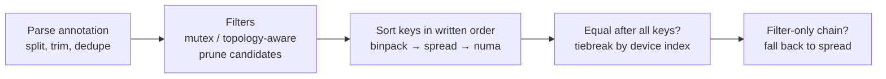
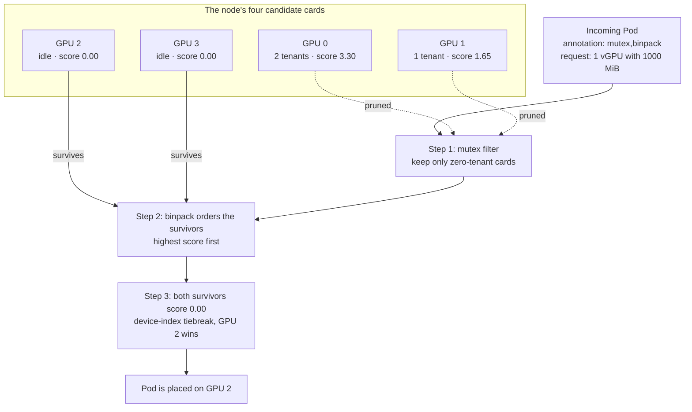

HAMi has always offered per-Pod GPU scheduling policies through the `hami.io/gpu-scheduler-policy` annotation: `binpack` to pack workloads onto as few cards as possible, `spread` to distribute them, `mutex` (new in v2.10.0) to demand an exclusive card. Until now, the annotation accepted exactly **one** value.

Real clusters rarely want just one behavior at a time. A typical production wish list looks like this: pack inference replicas tightly to leave whole cards free, but keep each Pod's GPUs on the same NUMA node for bandwidth, and give the latency-critical tier cards of its own. That is **three** policies in a single sentence. Before v2.10.0 you had to pick one and give up the rest.

v2.10.0 closes this gap: `hami.io/gpu-scheduler-policy` now accepts an **ordered, comma-separated list** of policies, so filter-style and sort-style policies compose ([#2621](https://github.com/Project-HAMi/HAMi/pull/2621), [@mesutoezdil](https://github.com/mesutoezdil), closes [#2010](https://github.com/Project-HAMi/HAMi/issues/2010)). This post explains how the combination actually works, and how to adopt and verify it. If you prefer to learn by doing, the companion [Lab 14: Composable GPU Scheduling Policies on GKE](/tutorials/labs/composable-scheduler-policies-gke) walks through every scenario below on a real cluster.

<!-- truncate -->

## Two Kinds of Policies: Filters and Sort Keys

The feature is easier to understand once you see that HAMi's GPU policies were never one kind of thing. They fall into two roles:

| Policy | Role | What it does |
| :-- | :-- | :-- |
| `mutex` | **Filter** | Only cards with **no existing workloads** are eligible. Every card in use is pruned from the candidate set. |
| `topology-aware` | **Filter** (NVIDIA only) | Keeps only cards whose NVLink/NVSwitch topology satisfies the Pod's multi-GPU request. Requires topology-aware scheduling to be enabled. |
| `binpack` | **Sort key** | Prefers the **most heavily used** eligible card, so workloads concentrate. |
| `spread` | **Sort key** | Prefers the **least heavily used** eligible card, so workloads distribute. |
| `numa` | **Sort key** | Prefers the card on the **lower NUMA node id**, improving locality. |

A filter answers a yes/no question per card: can this card be considered at all? A sort key answers a ranking question: among the eligible cards, which comes first? Because the two roles never conflict, they compose naturally: **filters run first and shrink the candidate set, then the sort keys rank what survives**.

That is exactly what a policy chain expresses:

```yaml
# Exclusive cards only, then pack tightly, with NUMA as the tiebreaker
metadata:
  annotations:
    hami.io/gpu-scheduler-policy: "mutex,binpack,numa"
```

## How the Scheduler Evaluates a Chain

When the HAMi scheduler filters and scores the GPUs of a node, a policy chain is evaluated in a fixed pipeline:



The rules, in order:

1. **Parse.** The annotation is split on commas; whitespace around each entry is ignored, duplicate entries are dropped, and only known policy names take effect.
2. **Filter first.** `mutex` and `topology-aware` act in the filter stage, before any sorting. For a `mutex` Pod, card eligibility depends on exactly one question: does the card currently have zero tenants? A card running even one tiny workload is excluded entirely, however much free memory or compute it still has, so a `mutex` Pod can only land on a fully idle card. When every card has at least one tenant, the Pod stays Pending with the `ExclusiveDeviceAllocateConflict` reason.
3. **Sort in the order written.** `binpack`, `spread`, and `numa` become an ordered list of sort keys. The first key dominates: `binpack,numa` ranks primarily by binpack and uses the NUMA node id only to break ties between cards that binpack scores equally. Writing `numa,binpack` reverses that priority; the order of the list is the order of the keys.
4. **Deterministic ties.** If two cards compare equal under every key in the chain, the lower device index wins. Identical requests on an idle cluster therefore produce identical, reproducible placements.
5. **Filter-only fallback.** A chain that contains no sort keys at all (for example `"mutex,topology-aware"`) falls back to `spread` ordering after filtering.
6. **Single values unchanged.** A plain `"binpack"`, `"spread"`, or `"mutex"` behaves exactly as it did before v2.10.0, so existing workloads need no changes when upgrading.

## What the Sort Keys Actually Score

For `binpack` and `spread`, "most/least heavily used" is not a guess: the scheduler computes a per-card utilization score from the card's allocated compute and memory, weighted by slot, core, and memory (you can tune the weights per Pod with the `hami.io/device-scoring-weights` annotation). `binpack` picks the card with the **highest** score; `spread` picks the **lowest**. The `numa` key compares the NUMA node id each card reports through NVML.

Note that v2.10.0 also shipped a related fix ([#2012](https://github.com/Project-HAMi/HAMi/pull/2012)): previously NUMA was the _primary_ sort key even for plain `binpack`/`spread`, which pinned workloads to one NUMA node regardless of load. With the fix, utilization score leads and NUMA only breaks ties, which is precisely the tiebreaker role `numa` now plays inside a chain.

## A Worked Example: One Pod, Four Cards

The pipeline becomes concrete with the exact state from the lab cluster: one node, four Tesla T4s, and an incoming Pod annotated `mutex,binpack` requesting one vGPU with a 1000 MiB slice. Each card below carries its tenant count and its utilization score, and the arrows trace the selection path:



Two things to read off the diagram:

- The busiest card, GPU 0, never reaches the sorting step: the `mutex` filter removes it first, although plain `binpack` would have ranked it first with its 3.30 score. Filters run before sort keys, so the composed chain never even considers the card that `binpack` alone would choose.
- Among the two surviving cards, `binpack` has nothing to separate (both score 0.00), so the chain falls through to the device-index tiebreak, which deterministically picks GPU 2.

The numbers are real: in the lab run, a card holding one 1000 MiB tenant scored `1.651042` and an idle card scored `0.000000`, as shown by the scheduler's own score log.

## Common Recipes

| Annotation | Meaning |
| :-- | :-- |
| `"binpack"` | Pack this Pod onto the busiest card that fits. Maximizes cards left fully idle. |
| `"spread"` (default) | Place on the least-used card. Minimizes contention between neighbors. |
| `"mutex"` | Demand a card with zero current users (note: later non-mutex Pods may still join that card). |
| `"binpack,numa"` | Pack tightly; among equally-packed cards prefer the lower NUMA node. |
| `"mutex,binpack"` | Exclusive card **and** tight packing: choose the busiest card among the idle ones, keeping fragmentation low. |
| `"mutex,binpack,numa"` | The "latency-tier" recipe: exclusive card, best packing among idle cards, NUMA locality as the tiebreaker. |

A note on `mutex` semantics: it guarantees the card is unused **at placement time**. A plain Pod scheduled afterwards may still join a card that a `mutex` Pod occupies. To keep a card exclusive for the workload's lifetime, request all of its resources (memory and cores) or pin it with `nvidia.com/use-gpuuuid`.

## Adopting the Feature in Three Steps

**1. Upgrade to HAMi v2.10.0 or later.**

```bash
helm repo add hami-charts https://project-hami.github.io/HAMi/
helm repo update
helm upgrade hami hami-charts/hami -n kube-system --version 2.10.0
```

Cluster-wide defaults are still `binpack` for node selection and `spread` for card selection (`scheduler.defaultSchedulerPolicy.nodeSchedulerPolicy` / `gpuSchedulerPolicy` in the chart values). No defaults change during upgrade.

**2. Annotate the Pods that need a combination.**

```yaml
apiVersion: v1
kind: Pod
metadata:
  name: inference-latency-tier
  annotations:
    hami.io/gpu-scheduler-policy: "mutex,binpack,numa"
spec:
  containers:
    - name: app
      image: ubuntu:22.04
      command: ["bash", "-c", "sleep 86400"]
      resources:
        limits:
          nvidia.com/gpu: 1 # 1 vGPU
          nvidia.com/gpumem: 8000 # with an 8000 MiB memory slice
```

**3. Verify the decision.** The scheduler writes the chosen card onto the Pod, so you can verify placement without entering the container:

```bash
# The device UUID, vendor, memory slice, and core % of the chosen card
kubectl get pod inference-latency-tier \
  -o jsonpath='{.metadata.annotations.hami\.io/vgpu-devices-allocated}'; echo
```

For `mutex` Pods that stay Pending, `kubectl describe pod` shows the `ExclusiveDeviceAllocateConflict` reason, and the scheduler logs one utilization score line per candidate card while it filters (`computer score is`), so you can watch `binpack` and `spread` ranking take place:

```bash
kubectl -n kube-system logs deploy/hami-scheduler -c vgpu-scheduler-extender \
  --tail=-1 | grep 'computer score' | tail
```

## Try It on a Real Cluster

Reading about filters and sort keys is one thing; watching a `mutex` Pod stay Pending until you free a card, and then watching `mutex,binpack` refuse the card plain `binpack` would have chosen, is another. [Lab 14: Composable GPU Scheduling Policies on GKE](/tutorials/labs/composable-scheduler-policies-gke) runs the whole feature matrix on a single GKE node with four Tesla T4s: default `spread`, `binpack` stacking, `mutex` blocking and release, and the composed `mutex,binpack` behavior, verified through allocation annotations, events, and scheduler logs.

## References

- Pull request: [feat: support comma-separated gpu-scheduler-policy combinations (#2621)](https://github.com/Project-HAMi/HAMi/pull/2621)
- Issue: [Composable scheduling policies (#2010)](https://github.com/Project-HAMi/HAMi/issues/2010)
- [Scheduler policy design](/docs/developers/scheduling)
- [Configuration reference](/docs/userguide/configure)
- Hands-on lab: [Lab 14: Composable GPU Scheduling Policies on GKE](/tutorials/labs/composable-scheduler-policies-gke)
