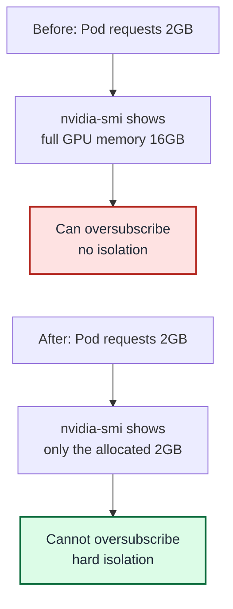
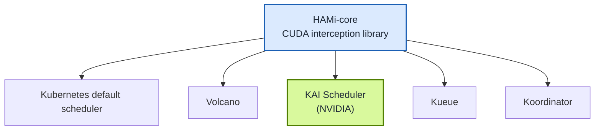

> The integration target here is strictly HAMi-core, not the full HAMi platform. KAI Scheduler keeps its own scheduling capability and brings in HAMi-core to provide GPU memory isolation.

In June 2026, two core PRs were officially merged into the NVIDIA KAI Scheduler main branch. This means HAMi's GPU memory hard isolation will ship as a built-in feature in the next KAI Scheduler release. Cloud-native GPU scheduling has officially moved from "cooperative sharing" into the "hard isolation" era.

<!-- truncate -->

## What is KAI Scheduler?

[KAI Scheduler](https://github.com/kai-scheduler/KAI-Scheduler) is NVIDIA's open source, Kubernetes-native scheduler for AI workloads. It grew out of the Run:ai scheduling engine. After NVIDIA acquired Run:ai in late 2024, it was open sourced under Apache 2.0 in April 2025 and is now a CNCF Sandbox project.

The Kubernetes default scheduler was designed for stateless services and schedules GPUs the same way it schedules CPU cores: one Pod takes a whole GPU, with no gang scheduling, no team fairness, and no topology awareness. KAI Scheduler exists to solve the scheduling problems unique to AI scenarios:

- **PodGroup (gang scheduling)**: the many Pods of a distributed training job must all start at once, or none start. This avoids the awkward situation where 7 GPUs are held but the job can't run.
- **Queues (hierarchical fair scheduling)**: allocate GPU quotas by department or team, with borrowing and reclaim, for fair sharing of a cluster across teams.
- **Fractional GPU**: multiple workloads share one GPU, allocated by fraction or by memory size.
- **Topology-aware placement**: aware of inter-GPU interconnect topology, it places tightly coupled training jobs on the same node or within the same NVLink domain.
- **Elastic workloads**: a job can elastically scale between a minimum and maximum Pod count, adjusting to cluster load.

## KAI Scheduler's "last mile": GPU hard isolation

KAI Scheduler's fractional GPU sharing is powerful, but it has one key limitation.

KAI Scheduler's GPU sharing is "cooperative": the scheduler makes sure the sum of requested memory shares does not exceed the total GPU capacity, but it does **not physically prevent** a workload from oversubscribing memory. If a container requests 2000 MiB, it can still see and use the full GPU memory through `nvidia-smi` and the CUDA API.

That is usually acceptable in dev and test environments. But in multi-tenant production, it becomes a fatal weakness:

- You cannot stop a workload from oversubscribing memory, which leads to OOM or mutual interference.
- There is no real resource isolation guarantee between tenants.
- You cannot precisely cap each container's GPU memory limit.

This is exactly where HAMi's core capability lives.

## What is HAMi?

HAMi is a CNCF Sandbox project focused on heterogeneous AI compute virtualization middleware. Its core capability is container-level hard isolation of GPU memory and compute, through a CUDA interception library (HAMi-core).

A simple way to understand HAMi's position:

- **KAI Scheduler** decides "who uses which GPU, and when" (the scheduling layer).
- **HAMi** ensures "once allocated, that is all you get, and you cannot take more" (the isolation layer).

Only by combining the two do you get true production-grade GPU sharing. HAMi supports NVIDIA GPUs, Huawei Ascend NPUs, Cambricon MLUs, Hygon DCUs, Kunlun XPUs, and many other heterogeneous accelerators, making it the open source solution with the broadest coverage in cloud-native GPU virtualization. For the full list of supported accelerators, see the [HAMi documentation](https://project-hami.io/docs/userguide/device-supported).

## Integration architecture: how HAMi and KAI Scheduler work together

The whole integration is loosely coupled: KAI Scheduler and HAMi each keep their own responsibilities and deploy independently.

```mermaid
%% title: HAMi + KAI Scheduler Integration Flow
graph TD
    POD["Pod request<br/>gpu-memory: 4096"]
    SCHED["1. KAI Scheduler<br/>Schedules Pod to a GPU node"]
    INJECT["2. KAI Admission<br/>Injects CUDA_DEVICE_MEMORY_LIMIT"]
    WEBHOOK["3. MutatingWebhook<br/>Mounts /usr/local/vgpu"]
    DAEMON["DaemonSet<br/>Deploys HAMi-core library"]
    CONTAINER["4. Container runtime<br/>libvgpu.so intercepts CUDA allocation"]
    ENFORCE["Memory isolation active<br/>nvidia-smi shows allocated memory only"]

    POD --> SCHED --> INJECT --> WEBHOOK --> CONTAINER --> ENFORCE
    DAEMON -. loads libvgpu.so .-> CONTAINER

    style SCHED fill:#d9f99d,stroke:#4f7d00,stroke-width:2px,color:#1f2937
    style INJECT fill:#d9f99d,stroke:#4f7d00,stroke-width:2px,color:#1f2937
    style WEBHOOK fill:#dbeafe,stroke:#1a5fb4,stroke-width:2px,color:#1f2937
    style DAEMON fill:#dbeafe,stroke:#1a5fb4,stroke-width:2px,color:#1f2937
    style CONTAINER fill:#fef3c7,stroke:#b45309,stroke-width:2px,color:#1f2937
    style ENFORCE fill:#dcfce7,stroke:#0b6b3c,stroke-width:2px,color:#1f2937
```

The workflow has four phases:

1. **Schedule**: KAI Scheduler schedules the Pod onto a suitable GPU node.
2. **Env var injection**: the KAI Admission component injects the `CUDA_DEVICE_MEMORY_LIMIT` environment variable into the container, based on the `gpu-fraction` or `gpu-memory` annotation.
3. **Library injection**: the kai-resource-isolator MutatingWebhook automatically injects the HAMi-core library volume mount and the `ld.so.preload` configuration.
4. **Runtime isolation**: once the container starts, `libvgpu.so` intercepts every CUDA memory allocation call and enforces the memory cap according to the environment variable.



### Deploy

Integrating HAMi into KAI Scheduler is simple, only two steps.

**Step 1: install KAI Scheduler** with GPU sharing enabled and the `hamicore` plugin activated:

```bash
helm install kai-scheduler oci://ghcr.io/nvidia/kai-scheduler \
  --set scheduler.gpuSharing.enabled=true \
  --set scheduler.gpuSharing.hamicoreEnabled=true \
  --namespace kai-scheduler --create-namespace
```

**Step 2: deploy kai-resource-isolator**. It ships the HAMi-core library to every GPU node as a DaemonSet and uses a MutatingWebhook to inject volume mounts into Pods that share a GPU:

```bash
helm install kai-resource-isolator oci://docker.io/projecthami/kai-resource-isolator \
  --namespace kai-resource-isolator --create-namespace \
  --version 1.0.0-chart
```

Chart versions carry a `-chart` suffix (for example, `1.0.0-chart`). See available versions on [Docker Hub](https://hub.docker.com/r/projecthami/kai-resource-isolator/tags); for more customization options, see the [kai-resource-isolator repository](https://github.com/Project-HAMi/KAI-resource-isolator).

Once deployed, any Pod that uses a `gpu-fraction` or `gpu-memory` annotation automatically gets memory isolation.

### Use

To request 4096 MiB of memory, annotate the Pod with `gpu-memory` and set the scheduler to `kai-scheduler`:

```yaml
apiVersion: v1
kind: Pod
metadata:
  name: gpu-sharing-with-isolation
  labels:
    kai.scheduler/queue: default-queue
  annotations:
    gpu-memory: "4096" # unit is MiB, no suffix
spec:
  schedulerName: kai-scheduler
  containers:
    - name: gpu-workload
      image: nvidia/cuda:12.9.2-base-ubuntu24.04
      command: ["sleep", "infinity"]
```

After the Pod starts, `nvidia-smi` inside the container shows only the allocated memory, not the full GPU memory. Resource isolation verified.

#### Opt out of isolation

- **Single Pod**: add the annotation `kai-resource-isolator.io/inject: "false"`.
- **Entire namespace**: add the label `kai-resource-isolator.io/webhook=ignore`.

#### Memory value precision

The `gpu-memory` annotation accepts an **integer number of MiB** (no unit suffix). KAI Scheduler internally converts it into a two-decimal GPU fraction, then multiplies by the total GPU memory to get the enforced cap. So the value `nvidia-smi` reports may differ slightly from the requested value. For example, requesting `4096` on a 15360 MiB T4 rounds to a `0.27` fraction, and the final enforced cap is `4147m`.

:::tip

This post covers the highlights. For the complete setup guide — prerequisites, installation, scheduling an isolated Pod, verifying isolation with `nvidia-smi`, and opt-out — see the [How to use KAI Scheduler with HAMi](/docs/next/userguide/kai-scheduler/how-to-use-kai-scheduler) docs.

:::

## Open source collaboration: from proposal to merge

This integration is a model of open source community collaboration. It took over a year of close work between the HAMi team and the NVIDIA KAI Scheduler team:

| Date | Milestone | Participants |
| --- | --- | --- |
| April 2025 | [@archlitchi](https://github.com/archlitchi) opened PR #60 "Resource isolation design" with the resource isolation design; the NVIDIA team reviewed the proposal, discussed the architecture, and agreed on the split of work; the community settled the technical approach: KAI handles env var injection, HAMi handles the resource isolation component | [@archlitchi](https://github.com/archlitchi) (HAMi), [@romanbaron](https://github.com/romanbaron), [@enoodle](https://github.com/enoodle) (NVIDIA), and both teams and the community |
| April 2026 | [@FouoF](https://github.com/FouoF) opened PR #1504, implementing the GPU_MEMORY_LIMIT binder plugin | [@FouoF](https://github.com/FouoF) (HAMi) |
| May 28, 2026 | PR #1504 merged into the KAI Scheduler main branch | [@davidLif](https://github.com/davidLif) (NVIDIA) merged |
| June 2026 | [@archlitchi](https://github.com/archlitchi) finished the user docs and e2e tests, and PR #60 passed all reviews | [@archlitchi](https://github.com/archlitchi) (HAMi) |
| June 9, 2026 | PR #60 officially merged into the KAI Scheduler main branch | [@davidLif](https://github.com/davidLif), [@gshaibi](https://github.com/gshaibi) (NVIDIA) approved |

Community response to this integration has been strong:

- Multiple community developers expressed strong demand for this feature on PR #60.
- Users such as Thanh Tung Dao followed the progress closely and looked forward to the v0.16.0 release.
- Community discussion covered everything from the technical approach to the deployment model.

## What this means for the HAMi ecosystem

### It validates the HAMi technical direction

HAMi's core capability, CUDA interception and GPU memory hard isolation, has been adopted by the official NVIDIA scheduler. That is a strong endorsement of HAMi's technical maturity. The NVIDIA team chose HAMi-core as the resource isolation mechanism for KAI Scheduler GPU sharing rather than building their own, which shows the HAMi approach is already the best solution in this space.

### It expands the ecosystem

Before this, HAMi had already integrated with several Kubernetes schedulers. This integration extends coverage to the official NVIDIA scheduler:



### It creates real value for users

For users who already use both KAI Scheduler and HAMi, this integration solves their most urgent need. As community user Thanh Tung Dao put it:

> "We're currently using KAI Scheduler to handle our ML workloads, but we have a new requirement: we need to enforce strict vGPU restrictions (memory/compute isolation) at the pod level. I know HAMi excels at this."

## What's next: the next KAI Scheduler release

Both core PRs have fully merged into the KAI Scheduler main branch and are expected to ship in the next release. At that point, users only need to enable GPU sharing and the `hamicore` plugin when installing KAI Scheduler with Helm to get HAMi resource isolation:

```bash
helm install kai-scheduler oci://ghcr.io/nvidia/kai-scheduler \
  --set scheduler.gpuSharing.enabled=true \
  --set scheduler.gpuSharing.hamicoreEnabled=true \
  --namespace kai-scheduler --create-namespace
```

`scheduler.gpuSharing.enabled=true` turns on GPU sharing, and `scheduler.gpuSharing.hamicoreEnabled=true` activates the `hamicore` plugin, which injects the `CUDA_DEVICE_MEMORY_LIMIT` environment variable into containers that share a GPU. Combined with the node-side kai-resource-isolator that enforces it, this delivers memory hard isolation (full steps above, in "Deploy").

### Roadmap

- Ship polished user documentation and a usage guide alongside the new KAI Scheduler release.
- Explore support for GPU compute unit (SM) isolation.
- Continuously improve HAMi-core performance at large-cluster scale.

---

## Related links

- HAMi project: [github.com/Project-HAMi/HAMi](https://github.com/Project-HAMi/HAMi)
- KAI Scheduler: [github.com/kai-scheduler/KAI-Scheduler](https://github.com/kai-scheduler/KAI-Scheduler)
- PR #60 (Resource isolation design): [github.com/kai-scheduler/KAI-Scheduler/pull/60](https://github.com/kai-scheduler/KAI-Scheduler/pull/60)
- PR #1504 (GPU_MEMORY_LIMIT binder): [github.com/kai-scheduler/KAI-Scheduler/pull/1504](https://github.com/kai-scheduler/KAI-Scheduler/pull/1504)
- HAMi resource isolation user guide: [docs/gpu-sharing/hami/README.md](https://github.com/kai-scheduler/KAI-Scheduler/blob/main/docs/gpu-sharing/hami/README.md)
- kai-resource-isolator: [github.com/Project-HAMi/KAI-resource-isolator](https://github.com/Project-HAMi/KAI-resource-isolator)
