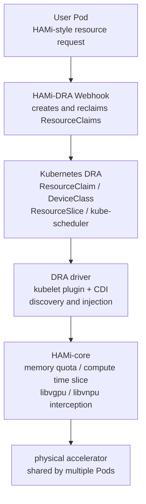

Kubernetes 1.34 took the DRA (Dynamic Resource Allocation) core APIs to GA, and together with the Consumable Capacity model, accelerators became first-class objects in Kubernetes' native resource model: they have attributes, they have capacity, and multiple Pods may share them. For sharing stacks built on Device Plugin, like HAMi, this raises a practical question: requesting and scheduling devices can now be done natively by Kubernetes, but isolating resources inside a container is still something Kubernetes does not handle.

[HAMi DRA](https://github.com/Project-HAMi/HAMi-DRA) is the HAMi community's answer: a migration layer that automatically converts the HAMi-style resource requests in existing workloads into native ResourceClaims, hands scheduling and accounting back to kube-scheduler, keeps runtime isolation with HAMi-core, and leaves the business side without a single line to change. The current 0.2.3 release covers NVIDIA GPUs; with the [Ascend DRA driver](https://github.com/4pdOss/hami-dra-driver) entering preview, the chain has been verified end to end on a real 310P3 cluster, and the community shipped the companion [Lab 18: Ascend NPU Sharing with HAMi DRA](/tutorials/labs/ascend-hami-dra) with every command and real output. This post is a systematic introduction to HAMi DRA: its motivation, design, usage, and current boundaries.

<!-- truncate -->

## What HAMi solved, and where it hit the ceiling

HAMi (Heterogeneous AI Computing Virtualization Middleware), formerly k8s-vGPU-scheduler, is now a CNCF incubating project. The problem it solves is concrete: the Device Plugin's extended resources can only express whole cards (`nvidia.com/gpu: 1`, `huawei.com/Ascend310P: 1`), while sharing an accelerator means "part of one card's memory plus part of its compute". On top of the old API, HAMi built a complete stack: a mutating webhook rewrites Pods, a scheduler extender does shared scheduling, device plugins report and mount, and HAMi-core (`libvgpu` / `libvnpu`) enforces quotas inside containers. The stack has held up in production (case figures from a [community talk](https://aicon.infoq.cn/2026/shenzhen/presentation/7168)): SF Express achieved up to 57% GPU savings through GPU sharing, SNOW cut costs by 55%, and China Merchants Bank reached 100% hardware pool utilization with topology-aware scheduling.

But precisely because the whole stack sits on Device Plugin and scheduler extension, the ceiling is structural. The real-world bottlenecks of the existing HAMi approach group into four (see the [community talk](https://aicon.infoq.cn/2026/shenzhen/presentation/7168)):

| Bottleneck | Root cause |
| :-- | :-- |
| ResourceQuota accounting | extended resources stay outside the native quota system and need a separate quota implementation |
| Preemption compatibility | Extender API limitations make Kubernetes scheduling features such as preemption awkward |
| Scheduling performance | node-lock exclusivity: scheduling several Pods onto one node degrades concurrency to serial |
| Deadlocks | the default lock window is 5 minutes; a failed request during creation can leave a node locked |

None of these are bugs in the code; they are architectural limits: doing fine-grained allocation on a node-centric allocation model comes with exactly these costs.

## What DRA changed

Kubernetes 1.34 took the DRA (Dynamic Resource Allocation) core APIs to GA, and cluster device management moved from a node-centric allocation model to a declarative model centered on resource objects. Four new objects:

- **ResourceSlice**: the device inventory. Each accelerator is one device with attributes (uuid, model, PCIe, and so on) and capacity (memory, compute).
- **ResourceClaim**: the Pod's device demand, expressed and constrained before the Pod is created.
- **DeviceClass**: filtering and configuration templates for devices.
- **ResourceClaimTemplate**: lets controllers such as StatefulSet generate claims in bulk.

The key enabler for shared scheduling is **Consumable Capacity** (KEP-5075): devices publish capacity along two independent dimensions (memory and a compute percentage), `allowMultipleAllocations` lets several claims consume one device, and kube-scheduler reconciles consumed capacity dimension by dimension, with each allocation carrying an independent shareID. "Multiple workloads fairly consuming parts of one accelerator" becomes a native scheduler capability for the first time, with no out-of-tree component simulating it. Note the feature gate needs manual enabling on 1.34/1.35 and is on by default from 1.36.

The traditional Device Plugin interface can only expose simple capacity, and the scheduler discovers "not enough resource" only after landing on a node; with DRA, device attributes are matched precisely at scheduling time. The migration logic here is straightforward: the bottleneck was never HAMi's scheduling algorithm, but the API layer beneath it.

## The design of HAMi DRA

HAMi DRA does not start over; it replaces only the upper part: scheduling and accounting move to the Kubernetes-native implementation, and runtime isolation stays with HAMi-core.



Three components, three responsibilities: the **HAMi-DRA Webhook** decides "how the request is declared", the **DRA driver** decides "how a device is allocated", and **HAMi-core** decides "how a device is shared".

The **webhook** does two things. First, automatic multi-dimensional resource conversion: it turns HAMi's multi-dimensional resource names (for example `huawei.com/Ascend310P` plus `-memory` plus `-core`, or on the NVIDIA side `nvidia.com/gpu` plus `gpumem` plus `gpucores`) into the ResourceClaim's `count` and `capacity.requests`, and HAMi's card-selection annotations (`use-*-uuid` and friends) into CEL selectors. Second, ResourceClaim lifecycle management: claims are created bound to the Pod and cleaned up when the Pod is deleted. Notably, HAMi-DRA itself no longer contains a scheduler component and works with the native kube-scheduler as well as Volcano and others.

The **DRA driver** is the node-side implementation: it discovers devices and publishes the ResourceSlice (attributes plus capacity), handles kubelet's `NodePrepareResources` to inject environment variables and create shared directories, and uses `UnprepareResourceClaims` to clean up HAMi-core's temporary files at the right moment, which is part of why device lifecycle management is more complete than in the Device Plugin era. Device injection reaches containerd through the standard CDI interface.

**HAMi-core** stays as it is: DRA only addresses the request-and-scheduling half; the enforce-inside-the-container half (memory quotas, compute time slices) remains with `libvgpu` / `libvnpu`. That is exactly where the conclusion of [Does Kubernetes DRA Replace HAMi?](/blog/does-kubernetes-dra-replace-hami) lands architecturally.

The scheduling-performance gain comes from the same replacement (the [AICon](https://aicon.infoq.cn/2026/shenzhen/presentation/7168) and [KCD Beijing](https://dynamia.ai/zh/blog/kcd-beijing-2026-dra-gpu-scheduling) talks give mutually confirming comparisons): by riding DRA's own scheduling, HAMi-DRA avoids the node-lock performance decay; when several Pods land on the same node concurrently, the original approach's Pod creation time degrades nearly linearly (peaking in the 42-second range), while HAMi-DRA stays clearly lower (by more than 30%). This owes mainly to DRA's resource pre-binding: the allocation is settled at scheduling time, which removes scheduling conflicts and retries. The overall change summarizes as four mappings: NodeLock to No Locks, ResourceName to ResourceClaim, Device Plugin to DRA Driver, and Annotation to Attributes.

Another easily underrated change is observability. In the traditional model, resource information comes from Nodes and usage from Pods, and a complete resource view has to be assembled by inference; in the DRA model, ResourceSlice describes the device inventory and ResourceClaim the allocations, so the resource view is itself a first-class citizen. Observability moves from "inferring" to "directly modeling" ([community talk](https://dynamia.ai/zh/blog/kcd-beijing-2026-dra-gpu-scheduling)): operators can read from a ResourceClaim who occupies which accelerator, how much memory was allocated, and how much is left, instead of reverse-engineering it from node status and Pod specs.

## Two usage modes

One cost of DRA's capability upgrade is often overlooked: the writing complexity, the often-mentioned "UX regression" ([community talk](https://dynamia.ai/zh/blog/kcd-beijing-2026-dra-gpu-scheduling)). The Device Plugin style is one line:

```yaml
resources:
  limits:
    nvidia.com/gpu: 1
```

The native DRA style is a separate ResourceClaim object with nested `count` and `capacity.requests`, plus a CEL selector filtering by device attributes:

```yaml
spec:
  devices:
    requests:
      - exactly:
          allocationMode: ExactCount
          count: 1
          capacity:
            requests:
              memory: 4194304k
```

For an enterprise already on Device Plugin, the migration cost is not just rewriting YAML; the whole team has to learn a new resource-declaration paradigm. HAMi-DRA's answer is two submission styles with the same scheduling and slicing underneath:

- **DRA native mode**: create the ResourceClaim by hand declaring memory and compute, and reference it from the Pod via `resourceClaims`. Suited to new workloads; CEL selectors express device-attribute constraints directly (topology awareness, NUMA affinity; the same mechanism extends to NICs and other resources, and `firstAvailable` expresses multiple candidate allocation plans, see the [community talk](https://aicon.infoq.cn/2026/shenzhen/presentation/7168)).
- **DevicePlugin-compatible mode**: keep the traditional `nvidia.com/gpu` / `huawei.com/Ascend310P` resource syntax; the webhook intercepts and converts it into a ResourceClaim. Existing workloads migrate with zero changes, which is where "seamless migration" comes from: the design turns DRA from an "expert interface" into an "ordinary user interface" ([community talk](https://dynamia.ai/zh/blog/kcd-beijing-2026-dra-gpu-scheduling)).

In compatible mode the conversion happens at admission. For a Pod submitted to a real Ascend 310P cluster, the three `huawei.com/*` entries in `resources.limits` are replaced by `resources.claims` and `spec.resourceClaims`, and in the generated ResourceClaim HAMi semantics enter DRA semantics field by field:

| ResourceClaim field | Comes from | Conversion |
| :-- | :-- | :-- |
| `count: 1` | `Ascend310P: 1` | integer passed through |
| `capacity.requests.memory: 8589934592` | `-memory: 8192` (MiB) | MiB to bytes (8192 × 1024 × 1024) |
| `capacity.requests.cores: "50"` | `-core: 50` | percent passed through |
| CEL selectors | `use-Ascend310P-uuid` annotation | `uuid in ["..."]`, the value taken from the ResourceSlice |

When two Pods each request 8192 MiB plus 50 cores against the same card, both claims land on the same device with independent shareIDs, and the scheduler debits the first one's consumption before allocating the second. Once capacity is fully debited, the next request is refused by the scheduler itself (the claim stays pending); when a Pod is deleted, its claim is reclaimed automatically and the accounting recovers. In-container enforcement is still HAMi-core: `libvnpu.so` intercepts over-quota memory requests and turns them into an in-container OOM, and the device as seen from the container is virtualized to the requested 8 GiB rather than the card's 21 GiB. The full walkthrough is [Lab 18](/tutorials/labs/ascend-hami-dra).

## The device support timeline, and "why now"

What HAMi DRA can do is bounded by each vendor's DRA driver progress. The timeline shared by the community ([AICon talk](https://aicon.infoq.cn/2026/shenzhen/presentation/7168)):

- 2025.09: NVIDIA DRA driver, Consumable Capacity ready
- 2026.03: Hygon DCU DRA driver integrated with HAMi DRA
- 2026.04: Enflame DRA driver, integration under way
- 2026.08: the **Ascend DRA driver entered development and preview** ([4pdOss/hami-dra-driver](https://github.com/4pdOss/hami-dra-driver), Paradigm's open-source repository)

The Ascend path entering preview means HAMi DRA's reach has just extended to NPUs: [Lab 18](/tutorials/labs/ascend-hami-dra) has already run the complete chain from HAMi request to NPU sharing on a 310P3 server, and the Ascend DRA driver is currently chart 0.1.1 (the lab used the development build fixing uuid generation; behavior may change before an official release). The HAMi 2.9 release webinar mentioned that NPU DRA support is planned to ship with 2.10, with test builds released to the community beforehand; the window for trying it and giving feedback is now.

## The practical constraints before adoption

The adoption friction groups into four:

- **High version dependency**: Consumable Capacity requires Kubernetes 1.34+, other DRA features possibly higher, and driving a production upgrade is not easy.
- **Limited vendor support**: few ready-to-use DRA drivers exist, and the set of supported heterogeneous devices is still small.
- **Missing scoring**: DRA lacks scoring at the device-scheduling layer, limiting support for specialized scheduling requirements.
- **Learning cost**: DRA's new concepts carry a threshold for the people deploying and maintaining clusters; the HAMi community's countermeasure is precisely the webhook-compatible mode keeping that cost out of the user's sight.

On choosing between them (guidance from the [HAMi 2.9 release webinar](https://dynamia.ai/zh/blog/hami-2.9-webinar-recap)): for standardized clusters chasing the best scheduling outcome (topology-aware scheduling, for example), plain HAMi is recommended; for highly customized clusters (already running their own scheduler) or plug-and-play device reuse, HAMi DRA is recommended. Two operational facts are also worth remembering: DRA mode and the traditional mode are mutually exclusive, do not enable both; and DRA mode still goes through HAMi-core.

## Outlook

On the HAMi-DRA roadmap: more heterogeneous devices (MetaX, Iluvatar CoreX), more DRA feature adoption (List Attributes, Partitionable Devices), compatibility with the Kubernetes-standard device attribute `resource.kubernetes.io/pcieRoot`, and scheduler integrations with Volcano and Kueue.

Zooming out ([community talk](https://dynamia.ai/zh/blog/kcd-beijing-2026-dra-gpu-scheduling)): Kubernetes is evolving into the control plane of AI infrastructure, and HAMi's position is the accelerator resource layer for Kubernetes, adapting heterogeneous devices downward, supporting training, inference, and agentic workloads upward, and providing scheduling, virtualization, and resource abstraction in between. HAMi-DRA is the step that aligns this resource layer with the Kubernetes-native model: HAMi's value converges onto runtime enforcement and heterogeneous ecosystem adaptation, while resource expression and scheduling move to the native model. If you are evaluating a migration from the Device Plugin model to DRA, or looking for a unified resource layer over a heterogeneous cluster, try [HAMi DRA](https://github.com/Project-HAMi/HAMi-DRA) and tell the community what you find.

## Further reading

- Yang Shouren at AICon Shenzhen 2026: [From HAMi to HAMi-DRA (talk, in Chinese)](https://aicon.infoq.cn/2026/shenzhen/presentation/7168)
- Wang Jifei and James Deng at KCD Beijing 2026: [From Device Plugin to DRA: GPU Scheduling Paradigm Shift and HAMi-DRA in Practice (recap, in Chinese)](https://dynamia.ai/zh/blog/kcd-beijing-2026-dra-gpu-scheduling)
- HAMi 2.9 release webinar recap by Li Mengxuan (in Chinese): [HAMi 2.9 Ascend soft slicing and DRA in depth](https://dynamia.ai/zh/blog/hami-2.9-webinar-recap)
- Community getting-started guide (in Chinese): [HAMi meets Kubernetes DRA: a practical guide](https://dynamia.ai/zh/blog/hami-dra-quickstart)
- Mesut Oezdil: [Does Kubernetes DRA Replace HAMi?](/blog/does-kubernetes-dra-replace-hami) ([CNCF blog original](https://www.cncf.io/blog/2026/08/07/does-kubernetes-dra-replace-hami/))
- User guide: [How to use HAMi DRA](/docs/installation/how-to-use-hami-dra); hands-on: [Lab 18: Ascend NPU Sharing with HAMi DRA](/tutorials/labs/ascend-hami-dra) and [Lab 4: GPU Slicing with Dynamic Resource Allocation](/tutorials/labs/hami-dra)
- Components: [Project-HAMi/HAMi-DRA](https://github.com/Project-HAMi/HAMi-DRA) · [4pdOss/hami-dra-driver](https://github.com/4pdOss/hami-dra-driver) · [Project-HAMi/hami-vnpu-core](https://github.com/Project-HAMi/hami-vnpu-core)
