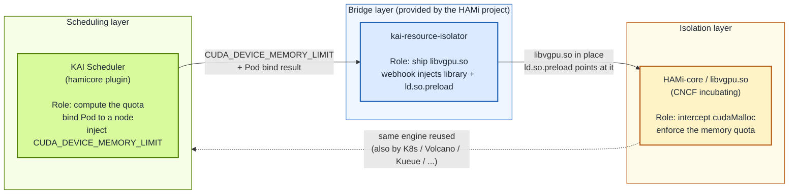
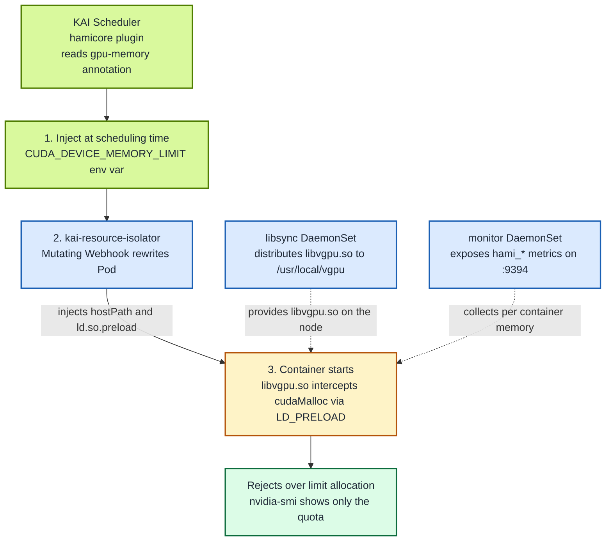

GPU sharing has been discussed in the Kubernetes ecosystem for years, but the scheduling layer and the isolation layer have long operated in isolation from each other. The scheduler places several pods onto the same card, yet once a container touches the GPU it still sees the full device memory. Whichever container calls `cudaMalloc` first can occupy everything, so the isolation is effectively absent. So-called "sharing" is really just "grabbing", with no resource guarantee at all.

Solving this requires the scheduling layer (deciding "who uses which GPU, and how much") and the isolation layer (guaranteeing "once a quota is set, it cannot be exceeded") to cooperate. **HAMi-core** is exactly such an isolation engine, reusable by multiple schedulers. Before KAI Scheduler, it already supported the Kubernetes native scheduler (via HAMi's own `hami-scheduler` extender), [Kueue](/docs/userguide/kueue/how-to-use-kueue), [Volcano](/docs/installation/how-to-use-volcano-vgpu), and more (see the full landscape in [Ecosystem Integrations](/docs/next/core-concepts/ecosystem-integrations)).

**Starting with KAI Scheduler v0.16.4, NVIDIA's KAI Scheduler officially joined this list**, building in HAMi-core as the isolation engine for its GPU sharing. This post verifies the currently documented supported combination, KAI Scheduler v0.17.0 plus `kai-resource-isolator` 1.1.0-chart. That means when you schedule GPU workloads with this integration enabled, you no longer get only "cooperative sharing"; you get CUDA API-level memory enforcement. This post covers two things:

- **Principles**: what each of KAI Scheduler, `kai-resource-isolator`, and HAMi-core is responsible for, how they connect, and how the `CUDA_DEVICE_MEMORY_LIMIT` contract ties the scheduling layer to the isolation layer.
- **Practice**: an end-to-end GKE verification on one NVIDIA T4, including a direct `cudaMalloc` proof that the per-Pod memory quota cannot be exceeded. The complete procedure is in Lab 12.

The background story and collaboration timeline are in the companion post [HAMi-core adopted by NVIDIA KAI Scheduler: GPU sharing enters the hard isolation era](/blog/hami-core-adopted-by-nvidia-kai-scheduler).

:::note About the output in this post

The GKE UUID, memory ceiling, error message, and CUDA allocation results marked as captured came from the verified GKE 1.35/COS/CDI run. Resource names are shortened where necessary; values in another cluster will differ.

:::

<!-- truncate -->

## Background: why sharing is not isolation

| Layer | Owner | What it solves | What it does not solve |
| :-- | :-- | :-- | :-- |
| Scheduling | KAI Scheduler, Volcano, Kueue, ... | Multiple pods can land on the same GPU | The container still sees all the memory |
| Runtime | HAMi-core (`libvgpu.so`) | Intercepts CUDA calls, enforces a memory quota | On its own, does not know how much each pod should get |

Real GPU sharing needs both layers, and they must cooperate: the scheduling layer decides "who uses which GPU, and how much", and the isolation layer guarantees "the agreed amount is all you get". The catch is that **the isolation layer needs to know "how much", a number it cannot compute on its own, because that number comes from the scheduling layer**.

HAMi-core, refined by the HAMi community over years, is exactly that isolation layer, and it is **decoupled from any specific scheduler**: well before KAI Scheduler, HAMi-core already worked with the Kubernetes native scheduler (via HAMi's own `hami-scheduler` extender), [Kueue](/docs/userguide/kueue/how-to-use-kueue), [Volcano](/docs/installation/how-to-use-volcano-vgpu), Koordinator, and others (see the full landscape in [Ecosystem Integrations](/docs/next/core-concepts/ecosystem-integrations)).

**KAI Scheduler joined this list in v0.16.4**, building HAMi-core in as the isolation engine for its GPU sharing. What this post explains is the role of each of the three components on the KAI Scheduler integration path, and how they connect.

## How it works: one contract, three steps

### What each of the three components is and does

The three components have similar-sounding names, so getting their roles straight is the prerequisite for understanding the whole chain:

- **HAMi-core (`libvgpu.so`)**: HAMi's CUDA interception library (CNCF incubating), and **the isolation engine itself**. It intercepts CUDA calls (like `cudaMalloc`) inside the container via `LD_PRELOAD` and enforces a memory quota. It does not care who provided the quota: any scheduler that hands in the quota by convention gets isolation for free. Before KAI, it was already reused by HAMi's own device-plugin/webhook, Volcano's `volcano-vgpu-device-plugin`, and others.

- **KAI Scheduler**: NVIDIA's open-source Kubernetes scheduler for AI workloads. It only owns the **scheduling layer**, deciding which node a pod lands on, which GPU it uses, and how much memory it gets. Since v0.16.4, its `hamicore` plugin writes the computed memory quota into the container's environment variable at bind time.

- **`kai-resource-isolator`**: a companion component **provided by the HAMi project specifically for the KAI Scheduler integration path**. It ships HAMi-core's `libvgpu.so` to every GPU node and uses a MutatingWebhook to rewrite pods, injecting the library and `ld.so.preload`. In other words, it is the bridge that turns KAI's scheduling decision into isolation HAMi-core can actually enforce.



In one sentence: **KAI Scheduler computes the quota, `kai-resource-isolator` puts the isolation library in place, and HAMi-core actually enforces the isolation at runtime.**

:::note Why HAMi-core, not the full HAMi platform

KAI Scheduler integrates with **HAMi-core itself**, not the full HAMi platform. KAI keeps its own scheduling capability (it is not replaced by `hami-scheduler`) and only brings in HAMi-core for GPU memory isolation. This mirrors how Volcano works (using `volcano-vgpu-device-plugin` + HAMi-core): each scheduler keeps its own, and they share HAMi-core as the common isolation engine.

:::

### The contract: `CUDA_DEVICE_MEMORY_LIMIT`

The whole chain works because the scheduling layer and the isolation layer agreed on a minimal hand off point: the environment variable **`CUDA_DEVICE_MEMORY_LIMIT`**.

- **KAI Scheduler (scheduling layer)** computes "how much memory this pod may use" and writes it into the container's environment variables when it binds the pod to a node.
- **HAMi-core (isolation layer)** reads that variable and, at runtime, actually keeps memory usage under that ceiling.

This contract matters because it **fully decouples the two sides**: KAI does not need to know how CUDA is intercepted, and HAMi-core does not need to know how the share was computed. As long as both honor that one variable, any scheduler can reuse the same isolation engine. That is exactly why HAMi-core can support multiple schedulers at once (see "What this means" at the end).

### The three steps



In one sentence: **KAI says you may only use this much, and the isolator makes sure you really can only use this much.**

The three components divide the work as follows (see the [KAI Scheduler docs on HAMi resource isolation](https://github.com/kai-scheduler/KAI-Scheduler/blob/main/docs/gpu-sharing/hami/README.md)):

- **libsync DaemonSet** copies `libvgpu.so` to `/usr/local/vgpu` on every GPU node.
- **mutating webhook** injects the hostPath volume mount into the pod, points `/etc/ld.so.preload` at `libvgpu.so`, and writes the `POD_UID`, `CONTAINER_NAME`, and `CONTAINER_VGPU_MOUNT` environment variables.
- **monitor DaemonSet** (optional) reads each container shared memory cache and exposes metrics on `:9394`.

### How the CUDA interception works

The "last mile" of isolation happens inside the container process. The chain is:

1. **KAI injects `CUDA_DEVICE_MEMORY_LIMIT` at scheduling time** (carrying the pod's requested memory quota, in MiB).
2. **The kai-resource-isolator webhook rewrites the pod**: it mounts the host's `libvgpu.so` and points `/etc/ld.so.preload` at it. `ld.so.preload` is a dynamic linker mechanism: any shared library listed there is loaded before all other libraries.
3. **Once the container process starts**, every call into the CUDA runtime (`libcudart`) or driver API passes through `libvgpu.so` first. It intercepts memory allocation calls like `cudaMalloc`, reads the quota from `CUDA_DEVICE_MEMORY_LIMIT`, accumulates the container's memory usage, and rejects any allocation that would exceed the quota.
4. **The visible effect**: `nvidia-smi` shows only the quota memory (HAMi-core rewrites the device query responses), and no matter how hard the container calls `cudaMalloc`, it cannot cross that line.

That is what "hard isolation" means: it is not left to application discipline, but enforced at the CUDA call layer.

:::tip How this integration came together

This integration path is the result of more than a year of work between the HAMi community and the NVIDIA KAI Scheduler team. The split is clean: KAI injects the environment variable, HAMi provides the resource isolation components. The full timeline and contributors are in the companion post [HAMi-core adopted by NVIDIA KAI Scheduler](/blog/hami-core-adopted-by-nvidia-kai-scheduler).

:::

## What these two versions bring

### KAI Scheduler (HAMi-core hard isolation built in since v0.16.4)

KAI Scheduler's support for HAMi-core first appeared in **v0.16.4**. The current integration documentation requires KAI Scheduler v0.17.0 or later, and this post tests v0.17.0. The key piece is the `hamicore` plugin: once enabled, when KAI binds a shared GPU pod to a node, it injects the `CUDA_DEVICE_MEMORY_LIMIT` environment variable into the container based on the `gpu-memory` (or `gpu-fraction`) annotation, exactly the quota that HAMi-core needs to enforce isolation, per the contract above.

Other GPU-related changes in v0.17.0 include: fixing invalid volume names caused by `/` in shared pod names; correcting the allocation math for `MinNodeGPUMemoryMiB` and fractional `gpu-memory`; and using the largest GPU profile in the cluster for overLimit decisions. It also adds preemption-delay (a time window for Cluster Autoscaler to bring up nodes), NUMA-aware scoring, and GitOps and ArgoCD installation support.

### kai-resource-isolator 1.1.0-chart

This is the isolator shipped alongside HAMi. It receives the quota injected by KAI and, before the container actually starts, puts the HAMi-core `libvgpu.so` in place. Compared with the first release, 1.1.0 adds several operational improvements:

- **New `kai-vgpu-monitor`**: runs as a DaemonSet, exposes HAMi-compatible metrics on `:9394` (`hami_vgpu_memory_used_bytes`, `hami_vgpu_memory_limit_bytes`, `hami_container_device_utilization_ratio`), supports ServiceMonitor, and can be scraped directly by Prometheus.
- **Multi container injection fix**: when a pod has multiple containers, the webhook now handles them correctly and no longer skips any.
- **Security tightening**: the webhook now uses a namespaced Issuer (instead of a ClusterIssuer), and the ClusterRole no longer reads Secrets.
- **Global image repository** precedence cleaned up, and `hamicore` installation parameters corrected.

## GKE Verification: Does the Isolation Actually Hold?

We completed an end-to-end test on a GKE 1.35/COS/CDI cluster with three `n1-standard-2` nodes, each carrying one NVIDIA T4. KAI Scheduler v0.17.0 handled shared scheduling, while `kai-resource-isolator` 1.1.0-chart injected HAMi-core.

The verification went beyond `nvidia-smi`:

| Check | Captured result | What it proves |
| :-- | :-- | :-- |
| Node and GPU UUID | Both Pods ran on one single-GPU node and returned `GPU-9acc8878-...` | They shared the same physical T4 |
| Visible memory | Both Pods reported `4147 MiB`; the full card reported `15360 MiB` | HAMi-core exposed KAI's per-Pod quota |
| CUDA allocation | 3 GiB succeeded; a cumulative 5 GiB returned `out of memory` | The ceiling was enforced, not merely displayed |
| Concurrent isolation | Pod B still allocated its own 3 GiB while Pod A held 3 GiB | One Pod could not consume the other's quota |
| Monitor metrics | The same-node `:9394/metrics` endpoint reported both Pods' 4.348 GB limits and 3.328 GB live usage | The monitor read each container's shared-memory cache and exported non-empty per-Pod gauges |

HAMi-core logged the over-quota allocation as:

```text
Device 0 OOM 5475663872 / 4348444672
allocate another 2 GiB: out of memory
PASS: in-quota allocation succeeded and over-quota allocation failed
```

Together, these checks connect scheduling onto one card, per-container visibility, actual CUDA allocation enforcement, and observability into one evidence chain. Because the monitor runs as a DaemonSet and reads node-local caches, Lab 12 queries the instance on the workload node directly instead of relying on a Service that may select another node.

:::note Isolation boundary

This proves CUDA API-level memory enforcement, not a MIG-like hardware security boundary. The tested GKE compatibility path also used privileged workload containers, so it should not be treated as an untrusted multi-tenant security design.

:::

### Why the full procedure is not in this post

The standard KAI + HAMi-core path is short. GKE 1.35/COS/CDI adds version-specific concerns around the read-only root filesystem, RuntimeClass, NVML library paths, CDI device injection, PriorityClass, and `kubectl exec` WebSocket resets. Those steps need independent maintenance and fit a reproducible lab better than the narrative of this post.

The complete cluster setup, manifests, Kyverno policies, CUDA program, monitor verification, captured outputs, troubleshooting table, and cleanup commands are in:

**[Lab 12: Verify KAI Scheduler and HAMi Memory Isolation on GKE](/tutorials/labs/kai-scheduler-hami-gke)**

If you only need the architecture, stop here. If you want to reproduce it on GKE, continue with Lab 12.

## What this means

HAMi-core was never positioned as "the isolation feature of some particular scheduler"; it is a **scheduler-decoupled, reusable isolation base**. Well before KAI Scheduler, it already powered the Kubernetes native scheduler, [Kueue](/docs/userguide/kueue/how-to-use-kueue), [Volcano](/docs/installation/how-to-use-volcano-vgpu), Koordinator, and other paths (see [Ecosystem Integrations](/docs/next/core-concepts/ecosystem-integrations)). KAI Scheduler v0.16.4 joining the list extends this ecosystem to NVIDIA's official AI scheduler:

- For **KAI users**: GPU sharing finally has a matching runtime hard isolation, so sharing no longer means running without guarantees.
- For **HAMi users**: there is now a path that does not lock you to a specific virtual device plugin and goes directly through NVIDIA's official scheduler, while keeping the metric surface (`hami_*`) compatible.
- For the **community**: the contract between the scheduling layer and the isolation layer (`CUDA_DEVICE_MEMORY_LIMIT`) is validated once more; any future scheduler that honors it can reuse the same isolation engine.

Behind this is more than a year of careful alignment between the KAI Scheduler team (Run:ai) and the HAMi maintainers. The `LD_PRELOAD`, the webhook, the metrics port, and the opt-out switch were each settled by both sides; the security tightening in `kai-resource-isolator` 1.1.0 (namespaced Issuer, tightened ClusterRole) was polished through community review line by line.

## Next steps

- The background story: [HAMi-core adopted by NVIDIA KAI Scheduler](/blog/hami-core-adopted-by-nvidia-kai-scheduler)
- User docs: [How to use HAMi with KAI Scheduler](/docs/next/userguide/kai-scheduler/how-to-use-kai-scheduler)
- Related repos: [Project-HAMi/KAI-resource-isolator](https://github.com/Project-HAMi/KAI-resource-isolator), [Project-HAMi/HAMi-core](https://github.com/Project-HAMi/HAMi-core) (the CNCF incubating CUDA interception library), [kai-scheduler/KAI-Scheduler](https://github.com/kai-scheduler/KAI-Scheduler), [KAI Scheduler HAMi resource isolation docs](https://github.com/kai-scheduler/KAI-Scheduler/blob/main/docs/gpu-sharing/hami/README.md)
- Run it on your own GKE, AWS, or self-built cluster, and share real results in an issue or the community group. If HAMi-core lacks support for a certain card or CUDA version, open an issue at [Project-HAMi/HAMi](https://github.com/Project-HAMi/HAMi). This is the feedback the community values most.
