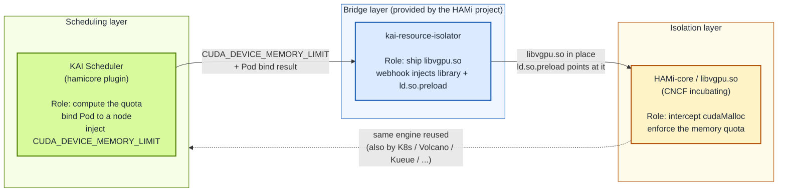
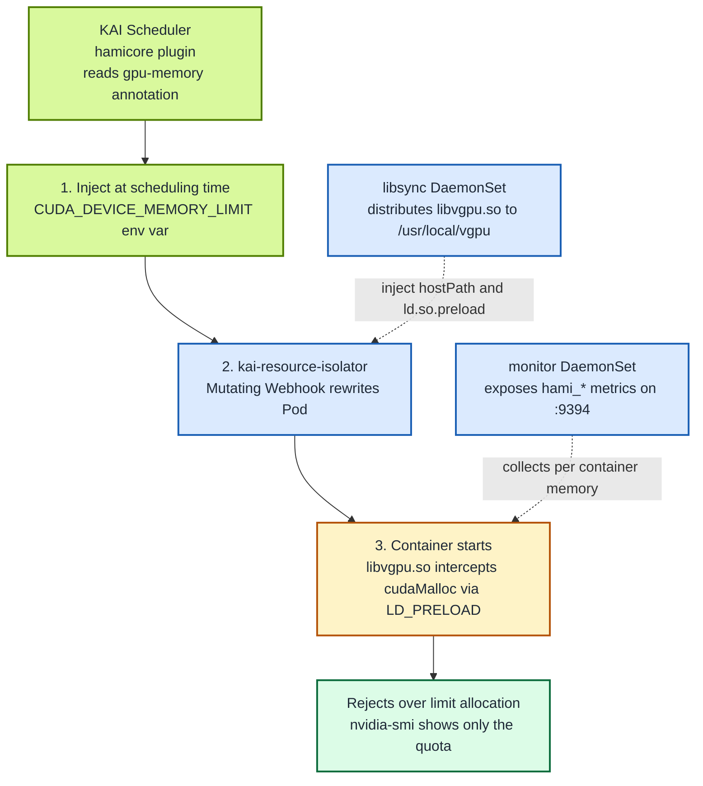
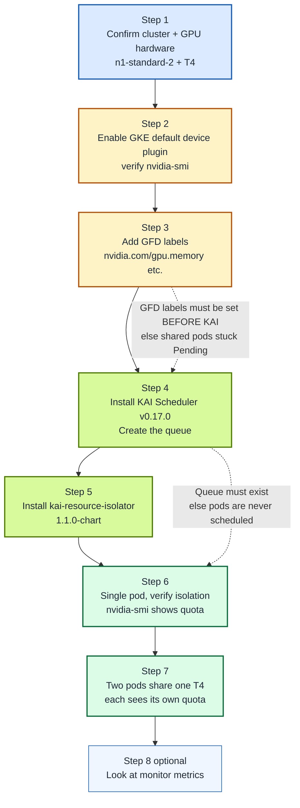

GPU sharing has been discussed in the Kubernetes ecosystem for years, but the scheduling layer and the isolation layer have long operated in isolation from each other. The scheduler places several pods onto the same card, yet once a container touches the GPU it still sees the full device memory. Whichever container calls `cudaMalloc` first can occupy everything, so the isolation is effectively absent. So called "sharing" is really just "grabbing", with no resource guarantee at all.

Solving this requires the scheduling layer (deciding "who uses which GPU, and how much") and the isolation layer (guaranteeing "once a quota is set, it cannot be exceeded") to cooperate. **HAMi-core** is exactly such an isolation engine, reusable by multiple schedulers. Before KAI Scheduler, it already supported the Kubernetes native scheduler (via HAMi's own `hami-scheduler` extender), [Kueue](/docs/userguide/kueue/how-to-use-kueue), [Volcano](/docs/installation/how-to-use-volcano-vgpu), and more (see the full landscape in [Ecosystem Integrations](/docs/next/core-concepts/ecosystem-integrations)).

**Starting with KAI Scheduler v0.16.4, NVIDIA's KAI Scheduler officially joined this list**, building in HAMi-core as the isolation engine for its GPU sharing (the current version at the time of writing is v0.17.0). That means when you schedule GPU workloads with KAI Scheduler, you no longer get only "cooperative sharing"; you get true hard isolation. This post covers two things:

- **Principles**: what each of KAI Scheduler, `kai-resource-isolator`, and HAMi-core is responsible for, how they connect, and how the `CUDA_DEVICE_MEMORY_LIMIT` contract ties the scheduling layer to the isolation layer.
- **Practice**: a fully reproducible verification example on GKE (a single NVIDIA T4 card, two pods sharing it, each seeing only its own memory quota), with every step carrying its config, its expected output, and the "why" behind it.

The background story and collaboration timeline are in the companion post [HAMi-core adopted by NVIDIA KAI Scheduler: GPU sharing enters the hard isolation era](/blog/hami-core-adopted-by-nvidia-kai-scheduler).

:::note About the output in this post

The commands in the second half are steps you can reproduce end to end on GKE. The shown command output and metrics are expected examples; actual values depend on your cluster.

:::

<!-- truncate -->

## Background: why sharing is not isolation

| Layer | Owner | What it solves | What it does not solve |
| --- | --- | --- | --- |
| Scheduling | KAI Scheduler, Volcano, Kueue, ... | Multiple pods can land on the same GPU | The container still sees all the memory |
| Runtime | HAMi-core (`libvgpu.so`) | Intercepts CUDA calls, enforces a memory quota | On its own, does not know how much each pod should get |

Real GPU sharing needs both layers, and they must cooperate: the scheduling layer decides "who uses which GPU, and how much", and the isolation layer guarantees "the agreed amount is all you get". The catch is that **the isolation layer needs to know "how much", a number it cannot compute on its own, because that number comes from the scheduling layer**.

HAMi-core, refined by the HAMi community over years (a CNCF incubating project), is exactly that isolation layer, and it is **decoupled from any specific scheduler**: well before KAI Scheduler, HAMi-core already worked with the Kubernetes native scheduler (via HAMi's own `hami-scheduler` extender), [Kueue](/docs/userguide/kueue/how-to-use-kueue), [Volcano](/docs/installation/how-to-use-volcano-vgpu), Koordinator, and others (see the full landscape in [Ecosystem Integrations](/docs/next/core-concepts/ecosystem-integrations)).

**KAI Scheduler joined this list in v0.16.4**, building HAMi-core in as the isolation engine for its GPU sharing. What this post explains is the role of each of the three components on the KAI Scheduler integration path, and how they connect.

## How it works: one contract, three steps

### What each of the three components is and does

The three components have similar-sounding names, so getting their roles straight is the prerequisite for understanding the whole chain:

- **HAMi-core (`libvgpu.so`)**: HAMi's CUDA interception library (CNCF incubating), and **the isolation engine itself**. It intercepts CUDA calls (like `cudaMalloc`) inside the container via `LD_PRELOAD` and enforces a memory quota. It does not care who provided the quota: any scheduler that hands in the quota by convention gets isolation for free. Before KAI, it was already reused by HAMi's own device-plugin/webhook, Volcano's `volcano-vgpu-device-plugin`, and others.

- **KAI Scheduler**: NVIDIA's open source Kubernetes scheduler for AI workloads (descended from Run:ai, CNCF Sandbox). It only owns the **scheduling layer**, deciding which node a pod lands on, which GPU it uses, and how much memory it gets. Since v0.16.4, its `hamicore` plugin writes the computed memory quota into the container's environment variable at bind time.

- **`kai-resource-isolator`**: a companion component **provided by the HAMi project specifically for the KAI Scheduler integration path**. It ships HAMi-core's `libvgpu.so` to every GPU node and uses a MutatingWebhook to rewrite pods, injecting the library and `ld.so.preload`. In other words, it is the bridge that turns KAI's scheduling decision into isolation HAMi-core can actually enforce.



In one sentence: **KAI Scheduler computes the quota, `kai-resource-isolator` puts the isolation library in place, and HAMi-core actually enforces the isolation at runtime.**

:::note Why HAMi-core, not the full HAMi platform

KAI Scheduler integrates with **HAMi-core itself**, not the full HAMi platform. KAI keeps its own scheduling capability (it is not replaced by `hami-scheduler`) and only brings in HAMi-core for GPU memory isolation. This mirrors how Volcano works (using `volcano-vgpu-device-plugin` + HAMi-core): each scheduler keeps its own, and they share HAMi-core as the common isolation engine.

:::

### The contract: `CUDA_DEVICE_MEMORY_LIMIT`

The whole chain works because the scheduling layer and the isolation layer agreed on a minimal hand off point: the environment variable **`CUDA_DEVICE_MEMORY_LIMIT`**.

- **KAI Scheduler (scheduling layer)** computes "how much memory this pod may use" and writes it into the container's environment variables when it binds the pod to a node.
- **HAMi-core (isolation layer)** reads that variable and, at runtime, actually keeps memory usage under that ceiling.

This contract matters because it **fully decouples the two sides**: KAI does not need to know how CUDA is intercepted, and HAMi-core does not need to know how the share was computed. As long as both honor that one variable, any scheduler can reuse the same isolation engine. That is exactly why HAMi-core can support multiple schedulers at once (see "What this means" at the end).

### The three steps



In one sentence: **KAI says you may only use this much, and the isolator makes sure you really can only use this much.**

The three components divide the work as follows (see the [KAI Scheduler docs on HAMi resource isolation](https://github.com/kai-scheduler/KAI-Scheduler/blob/main/docs/gpu-sharing/hami/README.md)):

- **libsync DaemonSet** copies `libvgpu.so` to `/usr/local/vgpu` on every GPU node.
- **mutating webhook** injects the hostPath volume mount into the pod, points `/etc/ld.so.preload` at `libvgpu.so`, and writes the `POD_UID`, `CONTAINER_NAME`, and `CONTAINER_VGPU_MOUNT` environment variables.
- **monitor DaemonSet** (optional) reads each container shared memory cache and exposes metrics on `:9394`.

### How the CUDA interception works

The "last mile" of isolation happens inside the container process. The chain is:

1. **KAI injects `CUDA_DEVICE_MEMORY_LIMIT` at scheduling time** (carrying the pod's requested memory quota, in MiB).
2. **The kai-resource-isolator webhook rewrites the pod**: it mounts the host's `libvgpu.so` and points `/etc/ld.so.preload` at it. `ld.so.preload` is a dynamic linker mechanism: any shared library listed there is loaded before all other libraries.
3. **Once the container process starts**, every call into the CUDA runtime (`libcudart`) or driver API passes through `libvgpu.so` first. It intercepts memory allocation calls like `cudaMalloc`, reads the quota from `CUDA_DEVICE_MEMORY_LIMIT`, accumulates the container's memory usage, and rejects any allocation that would exceed the quota.
4. **The visible effect**: `nvidia-smi` shows only the quota memory (HAMi-core rewrites the device query responses), and no matter how hard the container calls `cudaMalloc`, it cannot cross that line.

That is what "hard isolation" means: it is not left to application discipline, but enforced at the CUDA call layer.

:::tip How this integration came together

This integration path is the result of more than a year of work between the HAMi community and the NVIDIA KAI Scheduler team. The split is clean: KAI injects the environment variable, HAMi provides the resource isolation components. The full timeline and contributors are in the companion post [HAMi-core adopted by NVIDIA KAI Scheduler](/blog/hami-core-adopted-by-nvidia-kai-scheduler).

:::

## What these two versions bring

### KAI Scheduler (HAMi-core hard isolation built in since v0.16.4)

KAI Scheduler's support for HAMi-core has been a built-in capability **since v0.16.4** (this post uses the current version, v0.17.0). The key piece is the `hamicore` plugin: once enabled, when KAI binds a shared GPU pod to a node, it injects the `CUDA_DEVICE_MEMORY_LIMIT` environment variable into the container based on the `gpu-memory` (or `gpu-fraction`) annotation, exactly the quota that HAMi-core needs to enforce isolation, per the contract above.

Other GPU related changes in v0.17.0 include: fixing invalid volume names caused by `/` in shared pod names; correcting the allocation math for `MinNodeGPUMemoryMiB` and fractional `gpu-memory`; and using the largest GPU profile in the cluster for overLimit decisions. It also adds preemption-delay (a time window for Cluster Autoscaler to bring up nodes), NUMA aware scoring, and GitOps and ArgoCD installation support.

### kai-resource-isolator 1.1.0-chart

This is the isolator shipped alongside HAMi. It receives the quota injected by KAI and, before the container actually starts, puts the HAMi-core `libvgpu.so` in place. Compared with the first release, 1.1.0 fills in a set of improvements that make it production ready:

- **New `kai-vgpu-monitor`**: runs as a DaemonSet, exposes HAMi compatible metrics on `:9394` (`hami_vgpu_memory_used_bytes`, `hami_vgpu_memory_limit_bytes`, `hami_container_device_utilization_ratio`), supports ServiceMonitor, and can be scraped directly by Prometheus.
- **Multi container injection fix**: when a pod has multiple containers, the webhook now handles them correctly and no longer skips any.
- **Security tightening**: the webhook now uses a namespaced Issuer (instead of a ClusterIssuer), and the ClusterRole no longer reads Secrets.
- **Global image repository** precedence cleaned up, and `hamicore` installation parameters corrected.

## Practice: verifying hard isolation on GKE

The example runs on an existing GKE cluster: **3 `n1-standard-2` nodes, each with 1 NVIDIA T4 (`nvidia-smi` reports 15360 MiB of VRAM)**. Two containers each request about 4 GiB and share one of those T4s. Inside `nvidia-smi` each sees only its own quota, with no interference. Each step below comes with its config, its expected output, and the why behind it.

The diagram below is an overview of the whole exercise: the order of the eight steps, and the two prerequisites that are easiest to get wrong (the GFD labels must be in place before installing KAI; the queue must exist before KAI will schedule). Note: this post **does not install the NVIDIA GPU Operator**; GKE's default device plugin + driver + container toolkit are enough. The preparation below is just two steps: "enable the default device plugin" and "add a few GFD labels".



### Prerequisites

- A GCP project with GKE and Compute Engine APIs enabled.
- An existing GKE cluster with NVIDIA T4 GPUs in its node pool (this example uses 3 `n1-standard-2` nodes, each with 1× T4). The cluster for this example was created with the node label `gke-no-default-nvidia-gpu-device-plugin=true`, which **disables GKE's default NVIDIA device plugin**, while the driver is still installed by GKE automatically. This is why Step 1 below shows "hardware present, but `nvidia.com/gpu` resource empty"; Step 2 re-enables the device plugin. If you do not have a cluster yet, you can create an equivalent one with:

  ```bash
  gcloud container clusters create test-cluster --zone=asia-northeast1-a \
    --machine-type=n1-standard-2 --num-nodes=3 \
    --accelerator=type=nvidia-tesla-t4,count=1,gpu-driver-version=default
  gcloud container clusters get-credentials test-cluster --zone=asia-northeast1-a
  ```

  The `n1` machine family does not include a GPU by itself, so you **must** pass `--accelerator` to attach the T4; `gpu-driver-version=default` lets GKE install a matching NVIDIA driver and container toolkit. With this, the device plugin is enabled by default (you can skip the label-removal in Step 2).

- `gcloud`, `kubectl`, and `helm` (>= 3) authenticated, with `kubectl` already pointing at the cluster.
- The KAI queue created in Step 4 below.

### Step 1: confirm the cluster and GPU hardware are ready (initial state)

With the cluster already in place, first take a look at its initial state. This step is read-only.

```bash
kubectl get nodes -o custom-columns="NAME:.metadata.name,GPU:.status.capacity.nvidia\.com/gpu,ACCEL:.metadata.labels.cloud\.google\.com/gke-accelerator"
```

For the cluster in this example, the initial output looks like this: 3 nodes, all with `nvidia-tesla-t4` in the `ACCEL` column (T4 hardware present), but `GPU` is `<none>`.

```
NAME                                          GPU      ACCEL
gke-test-cluster-default-pool-xxxxxxxx        <none>   nvidia-tesla-t4
gke-test-cluster-default-pool-yyyyyyyy        <none>   nvidia-tesla-t4
gke-test-cluster-default-pool-zzzzzzzz        <none>   nvidia-tesla-t4
```

**How to read this**: the `ACCEL` value `nvidia-tesla-t4` confirms the T4 hardware is attached and GKE has already installed the NVIDIA kernel driver. But the `GPU` column is `<none>`, which means **the device plugin has not reported the `nvidia.com/gpu` resource yet**. The reason is that this cluster was created with the node label `gke-no-default-nvidia-gpu-device-plugin=true`, which disables GKE's default NVIDIA device plugin. The next step re-enables it.

If your cluster already shows `1` in the `GPU` column (the default device plugin was not disabled at creation), you can skip Step 2 and jump straight to Step 3 to add the GFD labels.

### Step 2: enable GKE's default device plugin and verify the GPU works

Remove the `gke-no-default-nvidia-gpu-device-plugin` label from the nodes, and GKE's built-in device plugin DaemonSet (whose scheduling rule is "only schedule when this label is not `true`") will land on the nodes automatically.

```bash
kubectl label node -l cloud.google.com/gke-accelerator=nvidia-tesla-t4 \
  gke-no-default-nvidia-gpu-device-plugin-
```

The trailing `-` on the label name means "delete this label". After about 20 seconds, the device plugin pods come up:

```bash
kubectl get pod -n kube-system -o wide | grep nvidia-gpu-device-plugin | grep -v "0/0"
```

Expected output (example): 3 `nvidia-gpu-device-plugin-*-ubuntu` pods, one per node, all `3/3 Running`.

```
NAME                                       READY   STATUS    NODE
nvidia-gpu-device-plugin-small-ubuntu-xxx  3/3     Running   gke-test-cluster-default-pool-xxxxxxxx
nvidia-gpu-device-plugin-small-ubuntu-yyy  3/3     Running   gke-test-cluster-default-pool-yyyyyyyy
nvidia-gpu-device-plugin-small-ubuntu-zzz  3/3     Running   gke-test-cluster-default-pool-zzzzzzzz
```

Once the device plugin is up, the `nvidia.com/gpu` resource appears:

```bash
kubectl get nodes -o custom-columns="NAME:.metadata.name,GPU:.status.capacity.nvidia\.com/gpu"
```

Expected output (example): the `GPU` column on each node goes from `<none>` to `1`.

```
NAME                                          GPU
gke-test-cluster-default-pool-xxxxxxxx        1
gke-test-cluster-default-pool-yyyyyyyy        1
gke-test-cluster-default-pool-zzzzzzzz        1
```

**Why no GPU Operator is needed**: GKE's default GPU stack already sets up three things: the NVIDIA kernel driver (installed by GKE), the device plugin (just enabled), and the container toolkit / nvidia runtime (configured automatically by GKE when `gpu-driver-version=default`). The GPU Operator is a tool that bundles these together for automatic management, but GKE is already managing them; installing the Operator on top actually conflicts with GKE's driver (in practice: the Operator's driver container cannot unload the kernel module GKE already loaded). So for running this experiment on GKE, the default stack is enough.

Finally, verify the toolkit works too (a container can run `nvidia-smi`) with a real GPU pod:

```bash
cat <<'EOF' | kubectl apply -f - && \
kubectl wait --for=condition=Ready pod/gpu-smi-test --timeout=120s && \
kubectl logs gpu-smi-test && \
kubectl delete pod gpu-smi-test
apiVersion: v1
kind: Pod
metadata:
  name: gpu-smi-test
spec:
  restartPolicy: Never
  containers:
    - name: cuda
      image: nvidia/cuda:12.4.1-base-ubuntu22.04
      command: ["nvidia-smi"]
      resources:
        limits:
          nvidia.com/gpu: 1
EOF
```

Expected output (real): you see the T4 and the driver version; note the memory is **15360 MiB** (the T4's actual addressable memory, which Step 3 uses for the label).

```
+-----------------------------------------------------------------------------------------+
| NVIDIA-SMI 580.159.04             Driver Version: 580.159.04     CUDA Version: 13.0     |
+-----------------------------------------+------------------------+----------------------+
|   0  Tesla T4                       Off |   00000000:00:04.0 Off |                    0 |
| N/A   45C    P8             17W /   70W |       0MiB /  15360MiB |      0%      Default |
+-----------------------------------------+------------------------+----------------------+
```

Seeing this table means the driver, device plugin, and toolkit are all in place, and the container can actually use the GPU.

### Step 3: add the GFD labels (needed by KAI scheduling)

KAI's hamicore plugin relies on the node label `nvidia.com/gpu.memory` to know each card's memory, so it can convert a `gpu-memory` request into a fraction. GKE's default device plugin sets `nvidia.com/gpu.present=true`, but **does not set `gpu.memory` / `gpu.count` / `gpu.product`** (those usually come from GPU Feature Discovery, which GKE's default stack does not run in full). So you add them manually.

Use the memory value **15360** (MiB) you saw from `nvidia-smi` in Step 2:

```bash
kubectl label node -l cloud.google.com/gke-accelerator=nvidia-tesla-t4 \
  nvidia.com/gpu.memory=15360 \
  nvidia.com/gpu.product=NVIDIA-Tesla-T4 \
  nvidia.com/gpu.count=1 \
  nvidia.com/gpu.present=true --overwrite
```

:::warning Critical step: labels must be in place before installing KAI

KAI's hamicore plugin caches per GPU memory **at node registration time** by reading `node.labels["nvidia.com/gpu.memory"]`. Without this label it errors out, shared pods stay `Pending` forever, and the logs show `didn't have enough resources: GPU memory`. So this step must be done **before** installing KAI in Step 4. If you only add the label after KAI is installed, restart `kai-scheduler` so it re-caches.

:::

Confirm the labels are in place:

```bash
kubectl get nodes -o custom-columns="NAME:.metadata.name,GPUMEM:.metadata.labels.nvidia\.com/gpu\.memory,GPUPROD:.metadata.labels.nvidia\.com/gpu\.product,GPUPRESENT:.metadata.labels.nvidia\.com/gpu\.present"
```

Expected output (example): each node shows `15360` under `GPUMEM`, `NVIDIA-Tesla-T4` under `GPUPROD`, and `true` under `GPUPRESENT`.

```
NAME                                          GPUMEM   GPUPROD           GPUPRESENT
gke-test-cluster-default-pool-xxxxxxxx        15360    NVIDIA-Tesla-T4   true
gke-test-cluster-default-pool-yyyyyyyy        15360    NVIDIA-Tesla-T4   true
gke-test-cluster-default-pool-zzzzzzzz        15360    NVIDIA-Tesla-T4   true
```

**Why `15360` and not `16384`**: the T4 is nominally 16 GiB, but `nvidia-smi` reports the actual addressable memory as 15360 MiB (some memory is reserved by the driver / ECC). KAI uses this number to convert `gpu-memory` requests into fractions, so the label value must match the `nvidia-smi` number, otherwise the ceiling the pod sees will not match your expectation.

### Step 4: install KAI Scheduler v0.17.0 and create the queue

```bash
helm install kai-scheduler oci://ghcr.io/kai-scheduler/kai-scheduler/kai-scheduler \
  --set global.gpuSharing=true \
  --set binder.plugins.hamicore.enabled=true \
  --set binder.plugins.gpusharing.arguments.cdiEnabled=true \
  --namespace kai-scheduler --create-namespace \
  --version v0.17.0

# Wait for the admission webhook to be ready (signing the certificate takes a
# moment) before creating the queue, otherwise Queue creation is rejected.
kubectl -n kai-scheduler wait --for=condition=available --timeout=180s deploy --all
```

**Why these switches**:

- `global.gpuSharing=true` turns on shared scheduling, allowing KAI to place multiple pods on the same GPU.
- `binder.plugins.hamicore.enabled=true` makes KAI inject `CUDA_DEVICE_MEMORY_LIMIT` at bind time. This is the contract that connects the scheduling layer to the isolation layer. Without it, the isolation layer never gets the quota and effectively is not installed.
- `binder.plugins.gpusharing.arguments.cdiEnabled=true`: **required on GKE 1.33+**. KAI's gpusharing plugin defaults to `cdiEnabled=false` (it assumes the GPU is injected via the NVIDIA runtime), but GKE 1.33+ containerd uses the CDI mode (`enable_cdi=true`) to inject GPUs. Without this flag, the GPU reservation pod KAI creates cannot find NVML (it fails with `ERROR_LIBRARY_NOT_FOUND`), and shared pods stay `Pending`. In the KAI source, CDI is auto-detected from the GPU Operator's ClusterPolicy, but we did not install the GPU Operator (see Step 2), so it must be enabled explicitly. (See the [KAI binder docs](https://github.com/kai-scheduler/KAI-Scheduler/blob/main/docs/developer/binder.md).)

Then create the queue. **The queue must exist before KAI will schedule anything.** A pod points at its queue via the `kai.scheduler/queue: default-queue` label; if the queue (CRD `scheduling.run.ai/v2`) does not exist, the pod stays `Pending`. The manifest below creates two layers, `default` (parent) and `default-queue` (child), with all quotas open (`-1`) to keep the demo simple:

```yaml
# queue.yaml
apiVersion: scheduling.run.ai/v2
kind: Queue
metadata:
  name: default
spec:
  resources:
    cpu: { quota: -1, limit: -1, overQuotaWeight: 1 }
    memory: { quota: -1, limit: -1, overQuotaWeight: 1 }
    gpu: { quota: -1, limit: -1, overQuotaWeight: 1 }
---
apiVersion: scheduling.run.ai/v2
kind: Queue
metadata:
  name: default-queue
spec:
  parentQueue: default
  resources:
    cpu: { quota: -1, limit: -1, overQuotaWeight: 1 }
    memory: { quota: -1, limit: -1, overQuotaWeight: 1 }
    gpu: { quota: -1, limit: -1, overQuotaWeight: 1 }
```

```bash
kubectl apply -f queue.yaml
kubectl get queues
```

Expected output (example):

```
NAME            PARENT     AGE
default                    5s
default-queue   default    5s
```

Both queues present and the child correctly pointing at the parent: then you can move on.

### Step 5: install kai-resource-isolator 1.1.0-chart

```bash
helm install kai-resource-isolator oci://docker.io/projecthami/kai-resource-isolator \
  --namespace kai-resource-isolator --create-namespace \
  --set monitor.enabled=true \
  --set monitor.serviceMonitor.enabled=true \
  --set paths.hostInstallBase=/home/kubernetes/bin/nvidia \
  --version 1.1.0-chart
```

**Why the version has a `-chart` suffix**: the chart version is **`1.1.0-chart`** (with the `-chart` suffix). The matching git tag is `v1.1.0`; do not confuse the two, since writing `1.1.0` or `v1.1.0` will not find the package. If your node NVML requires the NVIDIA runtime, also add `--set monitor.runtimeClassName=nvidia` (GKE GPU nodes already have this).

**Why change `paths.hostInstallBase`**: the isolator's libsync DaemonSet writes `libvgpu.so` to `{hostInstallBase}/vgpu/` on the host, which defaults to `/usr/local`. But **GKE nodes have a read-only root filesystem** (ext2 mounted `ro`), so `/usr/local` is not writable and libsync fails with `Read-only file system`. `/home/kubernetes/bin/nvidia` is a **writable** directory on GKE (the standard path where GKE installs the NVIDIA driver), so the library goes there. On self-built clusters where the root filesystem is writable, you can omit this flag (use the default `/usr/local`).

Confirm all three components are up:

```bash
kubectl -n kai-resource-isolator get pods
```

Expected output (example):

```
NAME                                    READY   STATUS
kai-resource-isolator-xxxxxxxx-xxxxx    1/1     Running   # webhook
kai-libsync-xxxxx                       1/1     Running   # distributes libvgpu.so
kai-vgpu-monitor-xxxxx                  1/1     Running   # :9394 metrics
```

All three pods `Running` means the webhook, libsync, and monitor are in place. On GKE, however, you still need a few extra adaptations before the isolation chain works end to end (see Step 5b below). On a self built cluster with a writable root filesystem, a `nvidia` RuntimeClass present, and NVML libraries in the standard paths, you can skip that section.

### Step 5b: GKE environment adaptation (required on GKE 1.33+)

The following four adaptations are confirmed GKE-specific requirements, each solving a concrete problem:

**5b-1. Create the `nvidia` RuntimeClass (absent on GKE 1.35)**

GKE 1.33+ injects GPUs in CDI mode, so no `nvidia` runtime handler is registered on the node and there is no `nvidia` RuntimeClass. But KAI's reservation pod checks for it at creation time. Create a RuntimeClass pointing at the default `runc` handler (CDI injects the device at the containerd layer, so the nvidia runtime is not needed):

```bash
cat <<'EOF' | kubectl apply -f -
apiVersion: node.k8s.io/v1
kind: RuntimeClass
metadata:
  name: nvidia
handler: runc
EOF
```

**5b-2. Patch the isolator DaemonSets to remove `system-node-critical` priority**

GKE forbids pods in user namespaces from using the `system-node-critical` PriorityClass (`insufficient quota to match these scopes`). The isolator's libsync and monitor DaemonSets use it by default, so it has to be removed:

```bash
for ds in kai-resource-isolator-libsync kai-resource-isolator-monitor; do
  kubectl patch ds "$ds" -n kai-resource-isolator \
    --type=json -p='[{"op":"replace","path":"/spec/template/spec/priorityClassName","value":null}]'
done
```

**5b-3. Install Kyverno and inject `LD_LIBRARY_PATH`**

KAI's reservation pod uses NVML to query GPU information, but its container image does not ship `libnvidia-ml.so`. GKE injects the NVML library into the container at `/usr/local/nvidia/lib64/`, but it does not set `LD_LIBRARY_PATH` (the `nvidia/cuda` image carries this variable, while the reservation image does not). Use [Kyverno](https://kyverno.io/)'s MutatingWebhook to automatically inject this environment variable into pods in the reservation namespace:

```bash
# Install Kyverno (ships its own TLS certificate management, no cert-manager needed)
helm install kyverno kyverno/kyverno -n kyverno --create-namespace
kubectl wait --for=condition=ready pod -l app.kubernetes.io/component=admission-controller \
  -n kyverno --timeout=300s

# Create the policy: inject LD_LIBRARY_PATH into all pods in the kai-resource-reservation namespace
cat <<'EOF' | kubectl apply -f -
apiVersion: kyverno.io/v1
kind: ClusterPolicy
metadata:
  name: inject-nvidia-library-path
spec:
  rules:
    - name: add-ld-library-path
      match:
        any:
          - resources:
              kinds: [Pod]
              namespaces: [kai-resource-reservation]
      mutate:
        foreach:
          - list: "request.object.spec.containers[]"
            patchStrategicMerge:
              metadata: {}
              spec:
                containers:
                  - name: "{{ element.name }}"
                    env:
                      - name: LD_LIBRARY_PATH
                        value: /usr/local/nvidia/lib64
EOF
```

The `inject-nvidia-library-path` policy above only solves the NVML query problem for the reservation pod. **Shared pods need a second policy, `inject-gpu-devices`**, which mounts the GPU device nodes and NVIDIA tool directories into the shared pods. The reason: under GKE CDI mode, the device plugin only runs `Allocate` and injects devices for pods that request the `nvidia.com/gpu` extended resource; KAI's shared pods use the `gpu-memory` annotation (no extended resource request), so the device plugin does not inject `/dev/nvidia*`, the `nvidia-smi` binary, or the NVML library into them. Without this policy, `nvidia-smi` inside a shared pod fails because it cannot find the device. The policy below matches any pod carrying the `gpu-memory` annotation (any namespace) and auto-mounts `/dev/nvidia0`, `/dev/nvidiactl`, `/dev/nvidia-uvm`, `/dev/nvidia-modeset`, `/dev/nvidia-caps`, plus the host's `nvidia-smi` binary directory and the `libnvidia-ml.so` library directory:

```bash
# Second policy: inject GPU device nodes + NVIDIA library directories into all
# shared pods carrying the gpu-memory annotation
cat <<'EOF' | kubectl apply -f -
apiVersion: kyverno.io/v1
kind: ClusterPolicy
metadata:
  name: inject-gpu-devices
spec:
  background: false
  rules:
    - name: add-gpu-volumes
      match:
        any:
          - resources:
              kinds: [Pod]
      preconditions:
        all:
          - key: "{{ request.object.metadata.annotations.\"gpu-memory\" || '' }}"
            operator: NotEquals
            value: ""
      mutate:
        patchesJson6902: |-
          - op: add
            path: /spec/volumes/-
            value:
              name: nvidia-dev0
              hostPath: {path: /dev/nvidia0, type: CharDevice}
          - op: add
            path: /spec/volumes/-
            value:
              name: nvidia-ctl
              hostPath: {path: /dev/nvidiactl, type: CharDevice}
          - op: add
            path: /spec/volumes/-
            value:
              name: nvidia-uvm
              hostPath: {path: /dev/nvidia-uvm, type: CharDevice}
          - op: add
            path: /spec/volumes/-
            value:
              name: nvidia-modeset
              hostPath: {path: /dev/nvidia-modeset, type: CharDevice}
          - op: add
            path: /spec/volumes/-
            value:
              name: nvidia-caps
              hostPath: {path: /dev/nvidia-caps, type: Directory}
          - op: add
            path: /spec/volumes/-
            value:
              name: nvidia-bin
              hostPath: {path: /home/kubernetes/bin/nvidia/bin, type: Directory}
          - op: add
            path: /spec/volumes/-
            value:
              name: nvidia-lib
              hostPath: {path: /home/kubernetes/bin/nvidia/lib64, type: Directory}
    - name: add-gpu-volumemounts
      match:
        any:
          - resources:
              kinds: [Pod]
      preconditions:
        all:
          - key: "{{ request.object.metadata.annotations.\"gpu-memory\" || '' }}"
            operator: NotEquals
            value: ""
      mutate:
        foreach:
          - list: "request.object.spec.containers[]"
            patchStrategicMerge:
              spec:
                containers:
                  - name: "{{ element.name }}"
                    volumeMounts:
                      - {name: nvidia-dev0, mountPath: /dev/nvidia0}
                      - {name: nvidia-ctl, mountPath: /dev/nvidiactl}
                      - {name: nvidia-uvm, mountPath: /dev/nvidia-uvm}
                      - {name: nvidia-modeset, mountPath: /dev/nvidia-modeset}
                      - {name: nvidia-caps, mountPath: /dev/nvidia-caps}
                      - {name: nvidia-bin, mountPath: /usr/local/nvidia/bin}
                      - {name: nvidia-lib, mountPath: /usr/local/nvidia/lib64}
EOF
```

With both policies in place, shared pods get the device nodes (`/dev/nvidia*`), the `nvidia-smi` binary (`/usr/local/nvidia/bin`), and the NVML library (`/usr/local/nvidia/lib64`). Note: device nodes alone are not enough; the pod must also set `securityContext.privileged: true` (see Step 6 and Step 7), because HAMi-core's `libvgpu.so` requires privileged mode to initialize NVML (confirmed by testing). All three pieces (device nodes + library directories + privileged mode) are required; once they are all in place, the shared pod can successfully run `nvidia-smi` and see the isolated memory.

**5b-4. Fix the `ld.so.preload` path written by libsync**

The isolator's libsync writes `libvgpu.so` and `ld.so.preload` to `/home/kubernetes/bin/nvidia/vgpu/` (the `hostInstallBase` from Step 5), but the chart's `ld.so.preload` ConfigMap may still carry the old `/usr/local/vgpu/libvgpu.so` path. Verify and correct it to point at the right path:

```bash
# Inspect the ConfigMap content
kubectl get cm kai-resource-isolator-ldpreload -n kai-resource-isolator \
  -o jsonpath='{.data.ld\.so\.preload}'
# If it is not /home/kubernetes/bin/nvidia/vgpu/libvgpu.so, fix it
kubectl create cm kai-resource-isolator-ldpreload -n kai-resource-isolator \
  --from-literal=ld.so.preload="/home/kubernetes/bin/nvidia/vgpu/libvgpu.so" \
  --dry-run=client -o yaml | kubectl apply -f -

# Restart the libsync pods so they rewrite with the corrected ConfigMap
kubectl delete pod -n kai-resource-isolator \
  $(kubectl get pod -n kai-resource-isolator -l app.kubernetes.io/component=kai-libsync -o jsonpath='{.items[*].metadata.name}')
```

Additionally, the monitor DaemonSet has a hostPath volume pointing to the old `/usr/local/vgpu/containers` (read-only rootfs), which gets stuck in `ContainerCreating`. Patch it to the writable area too:

```bash
kubectl patch ds kai-resource-isolator-monitor -n kai-resource-isolator --type=json \
  -p='[{"op":"replace","path":"/spec/template/spec/volumes/0","value":{"hostPath":{"path":"/home/kubernetes/bin/nvidia/vgpu/containers","type":"DirectoryOrCreate"},"name":"containers"}}]'
```

After these four steps, the reservation pod can successfully initialize NVML and hold the GPU, and shared pods can be scheduled and load `libvgpu.so`. Verify:

```bash
# The reservation pod should be Running (no longer CrashLoopBackOff)
kubectl get pod -n kai-resource-reservation
# Inside a shared pod, libvgpu.so should preload successfully (no "cannot be preloaded" error)
kubectl exec <shared-pod-name> -- cat /etc/ld.so.preload
# The memory limit KAI injected
kubectl exec <shared-pod-name> -- env | grep CUDA_DEVICE_MEMORY_LIMIT
```

:::tip Verified

Verified by testing: with Kyverno auto-mounting GPU device nodes + NVIDIA library directories + privileged mode into shared pods, shared pods can successfully run `nvidia-smi` and see only their memory quota (4147 MiB instead of the full 15360 MiB), confirming isolation works. The exact setup is the `inject-gpu-devices` policy in Step 5b-3 above, combined with `securityContext.privileged: true` in the Step 6 and Step 7 pod templates.

:::

### Step 6: a single pod, memory locked down

First verify isolation works on a single pod, before moving to the sharing scenario; this makes problems easier to localize.

```yaml
# single-pod.yaml
apiVersion: v1
kind: Pod
metadata:
  name: gpu-isolation-demo
  labels:
    kai.scheduler/queue: default-queue
  annotations:
    gpu-memory: "4096" # integer MiB, no unit suffix
spec:
  schedulerName: kai-scheduler
  restartPolicy: Never
  containers:
    - name: gpu-workload
      image: nvidia/cuda:12.9.2-base-ubuntu24.04
      command: ["sleep", "infinity"]
      securityContext:
        privileged: true
```

**Why it is written this way** (matching the [KAI docs](https://github.com/kai-scheduler/KAI-Scheduler/blob/main/docs/gpu-sharing/hami/README.md) pod template):

- `schedulerName: kai-scheduler` routes the pod through KAI (the default is `default-scheduler`).
- `kai.scheduler/queue: default-queue` attaches the pod to the queue from Step 4; a label that does not match a queue means the pod is never scheduled.
- `gpu-memory: "4096"` is the pod's memory quota, an integer MiB with no unit suffix. KAI uses it to inject `CUDA_DEVICE_MEMORY_LIMIT=4096` (MiB), which HAMi-core then enforces.
- **Do not add `resources.limits.nvidia.com/gpu`**. KAI's admission rejects pods that request both a whole card and a memory quota (`cannot request both GPU and GPU memory`); memory sharing is driven entirely by the `gpu-memory` annotation, and the whole-card device-plugin resource is allocated by KAI behind the scenes.

```bash
kubectl apply -f single-pod.yaml
kubectl wait --for=condition=Ready pod/gpu-isolation-demo --timeout=300s
kubectl exec gpu-isolation-demo -- nvidia-smi
```

Expected output (real output, verified):

```
+-----------------------------------------------------------------------------+
| NVIDIA-SMI ...        Driver Version: ...    CUDA Version: 12.9            |
|-------------------------------+----------------------+----------------------+
|   0  NVIDIA T4           ...  | 4147MiB / 4147MiB    ...   0%      Default |
+-------------------------------+----------------------+----------------------+
```

The full T4 has 15360 MiB, but inside the container only about 4147 MiB is visible (the actual ceiling after the quota 4096 is converted to a fraction), which means HAMi-core rewrote the device query response, so isolation is working. If you still see 15360 MiB here, the isolator webhook is most likely not taking effect (check that the Step 5 pods are Running and that the pod is covered by the webhook's namespace selector).

### Step 7: two pods sharing one T4

With isolation verified on a single pod, verify genuine sharing: two pods landing on the same card at the same time, each seeing only its own quota.

```yaml
# shared-t4.yaml
---
apiVersion: v1
kind: Pod
metadata:
  name: gpu-share-a
  labels:
    kai.scheduler/queue: default-queue
  annotations:
    gpu-memory: "4096"
spec:
  schedulerName: kai-scheduler
  restartPolicy: Never
  containers:
    - name: gpu-workload
      image: nvidia/cuda:12.9.2-base-ubuntu24.04
      command: ["sleep", "infinity"]
      securityContext:
        privileged: true
---
apiVersion: v1
kind: Pod
metadata:
  name: gpu-share-b
  labels:
    kai.scheduler/queue: default-queue
  annotations:
    gpu-memory: "4096"
spec:
  schedulerName: kai-scheduler
  restartPolicy: Never
  containers:
    - name: gpu-workload
      image: nvidia/cuda:12.9.2-base-ubuntu24.04
      command: ["sleep", "infinity"]
      securityContext:
        privileged: true
```

Each pod requests `4096` MiB; together that is 8 GiB, well under a single 15360 MiB T4, so KAI schedules both onto the same card (rather than one card each).

```bash
kubectl apply -f shared-t4.yaml
kubectl wait --for=condition=Ready pod/gpu-share-a pod/gpu-share-b --timeout=300s
kubectl exec gpu-share-a -- nvidia-smi --query-gpu=memory.total --format=csv,noheader
kubectl exec gpu-share-b -- nvidia-smi --query-gpu=memory.total --format=csv,noheader
```

Expected output (example): both pods return about 4147 MiB (the actual ceiling after the quota 4096 is converted to a fraction).

```
4147 MiB
4147 MiB
```

Then confirm they really share the same card rather than each taking their own:

```bash
kubectl get pod -o wide | grep gpu-share
```

Expected output (example): both pods show the same `NODE` (landed on the same node), and that node only has 1 T4, proving they share the same card.

```
NAME          READY   STATUS    RESTARTS   AGE     IP           NODE
gpu-share-a   1/1     Running   0          2m      10.x.x.x     gke-test-cluster-default-pool-xxxxxxxx
gpu-share-b   1/1     Running   0          2m      10.x.x.x     gke-test-cluster-default-pool-xxxxxxxx
```

**Why `4096` and not more**: the T4 has 15360 MiB of actual memory, and two pods each requesting 4096 MiB (8 GiB total) leaves nearly half the card free, which makes scheduling more robust. `gpu-memory` is an integer MiB. The scheduler converts it to a two-decimal GPU fraction and then lands it as `CUDA_DEVICE_MEMORY_LIMIT`. `4096 / 15360 ≈ 0.27`, so the actual ceiling you see is about 4147 MiB rather than exactly 4096 (see pitfall #4 for the rounding details). A 15 GiB card is cleanly split into two slices that do not bleed into each other, and that is hard isolation in action.

### Step 8 (optional): look at monitor metrics

```bash
kubectl -n kai-resource-isolator port-forward daemonset/kai-vgpu-monitor 9394:9394 &
curl -s localhost:9394/metrics | grep hami_vgpu_memory_limit_bytes
```

Expected (example):

```
hami_vgpu_memory_limit_bytes{...} 4.147e+06
```

**Why this metric**: `hami_vgpu_memory_limit_bytes` directly reflects the memory ceiling HAMi-core set for each container, and it matches the `nvidia-smi` number, making it the most direct observation point for verifying isolation. With Prometheus and Grafana, per container memory usage, limits, and utilization become ready made charts.

## Pitfalls worth knowing up front

1. **The `nvidia.com/gpu.memory` node label must appear first** (most important). KAI hamicore caches per card memory at node registration; without the label, shared pods get stuck `Pending` with `didn't have enough resources: GPU memory`. GKE's default device plugin **does not set this label** (it only sets `nvidia.com/gpu.present`), so this post adds it manually in Step 3. **The label must be added before installing KAI**; if you add it only after KAI is installed, restart `kai-scheduler` so it re-caches. Use the memory `nvidia-smi` reports (15360 for the T4 here, not the nominal 16384).
2. **Create the queue manually.** A pod points at its queue via the `kai.scheduler/queue` label, the CRD is `scheduling.run.ai/v2` `Queue`; without the queue, pods are never scheduled. Step 4 provides the manifest, and it must be applied after the KAI admission webhook is ready.
3. **RuntimeClass `nvidia`.** KAI shared reservation pods carry `runtimeClassName: nvidia` by default. GKE GPU nodes ship it (COS plus containerd registers the `nvidia` handler, performing real injection), so you usually do nothing. On a self built cluster that lacks it, create one pointing at the runtime that actually performs NVIDIA injection on your nodes.
4. **Memory precision is rounded.** `gpu-memory` is an integer MiB (no unit suffix). The scheduler converts it to a two decimal GPU fraction and then lands it as `CUDA_DEVICE_MEMORY_LIMIT`. In Step 6 and Step 7 of this post, requesting `4096` on a 15360 MiB T4 gives `4096 / 15360 ≈ 0.27`, so the actual ceiling you see is about 4147 MiB rather than exactly 4096 (this is exactly the T4 example in the official docs, see [Memory value precision](https://github.com/kai-scheduler/KAI-Scheduler/blob/main/docs/gpu-sharing/hami/README.md#memory-value-precision)). When you need finer control, reverse the math from the fraction.
5. **The chart version has a `-chart` suffix.** The OCI chart tag for `kai-resource-isolator` is `1.1.0-chart`, not `1.1.0` and not `v1.1.0`.
6. **Opting out of isolation is supported.** A single pod can set the annotation `kai-resource-isolator.io/inject: "false"`; an entire namespace can set the label `kai-resource-isolator.io/webhook=ignore`. Useful for gradual rollout.
7. **Monitor runtime and nodeSelector.** If your node NVML requires the NVIDIA runtime (some self built clusters), set `monitor.runtimeClassName=nvidia`; GKE GPU nodes satisfy this by default. The monitor DaemonSet also selects nodes via the `nvidia.com/gpu.present=true` nodeSelector; **this post adds `gpu.present=true` manually in Step 3, so the monitor pod schedules normally**. If you forget this label, the monitor pod will not come up; add it or change the nodeSelector.
8. **The driver is a prerequisite.** The isolation stack depends on the host NVIDIA driver. This post uses the GKE default stack (create the cluster with `gpu-driver-version=default`, and GKE installs the driver + device plugin + container toolkit automatically); on a self built cluster, get `nvidia-smi` working on the node first with the NVIDIA driver and container runtime.
9. **The isolator DaemonSets may fail to start on GKE (PriorityClass quota).** The kai-resource-isolator libsync and monitor DaemonSets default to the `system-node-critical` priority class, which GKE forbids for pods in user namespaces (`insufficient quota to match these scopes: [{PriorityClass In [system-node-critical ...]}]`). If you hit this, remove the `priorityClassName` from both DaemonSets:

   ```bash
   for ds in kai-resource-isolator-libsync kai-resource-isolator-monitor; do
     kubectl patch ds $ds -n kai-resource-isolator \
       --type=json -p='[{"op":"replace","path":"/spec/template/spec/priorityClassName","value":null}]'
   done
   ```

   This triggers a rolling update and the pods reschedule. Note: `helm upgrade` reverts this patch, so re-apply it after each isolator upgrade (or, for a more durable fix, add a ResourceQuota that allows critical pods in the isolator namespace).

10. **Do not put `resources.limits.nvidia.com/gpu` on shared pods.** KAI's admission rejects pods that request both a whole card and a memory quota (`cannot request both GPU and GPU memory`). Memory sharing is driven entirely by the `gpu-memory` annotation; follow the [KAI official pod template](https://github.com/kai-scheduler/KAI-Scheduler/blob/main/docs/gpu-sharing/hami/README.md) and omit the `resources` section.
11. **KAI's config-deployer hook may fail on GKE.** The `helm install kai-scheduler` post-install hook (the `kai-config-deployer` Job) can stall on GKE 1.35 due to an API server authentication issue (OpenAPI schema download fails with `the server has asked for the client to provide credentials`), so helm reports `INSTALLATION FAILED`. However, the KAI CRDs and the `kai-operator` are already installed. The fix is to apply the Config CR (the very resource the hook tries to deploy) manually: render the chart with `helm template ... > rendered.yaml`, extract `kai-config.yaml` from the `kai-config-manifest` ConfigMap (note that `cdiEnabled` must be a **quoted string** `"true"`, the CRD rejects a boolean), then `kubectl apply --validate=false -f kai-config.yaml`. Once kai-operator sees the Config CR, it brings up binder/admission/scheduler and the rest automatically. If the release status is stuck at `failed`, use `helm upgrade ... --no-hooks` to correct the state (it skips the hook and idempotently reconciles the resources).
12. **GKE nodes have a read-only root filesystem, so libsync cannot write to `/usr/local/vgpu`.** GKE nodes mount `/` as `ext2 ro`; the isolator's libsync writes `libvgpu.so` to `/usr/local/vgpu` by default and crashes with `Read-only file system`. The `--set paths.hostInstallBase=/home/kubernetes/bin/nvidia` flag in Step 5 fixes this by placing the library in GKE's writable area. Note: `paths.hostInstallBase` only changes libsync's write path and the webhook's hostPath; the chart's `ld.so.preload` ConfigMap may not be updated to match, so it needs manual verification/fixing (see Step 5b-4).
13. **GKE 1.35 has no `nvidia` RuntimeClass.** GKE 1.33+ uses CDI mode, so no nvidia runtime handler is registered on the node. KAI needs this RuntimeClass to exist when creating shared pods, otherwise the pod is rejected (`RuntimeClass "nvidia" not found`). Create one pointing at the default `runc` handler (see Step 5b-1). On a self built cluster that already registers a real nvidia runtime handler, this is not needed.
14. **The reservation pod cannot find the NVML library on GKE CDI.** GKE injects the NVML library into the container at `/usr/local/nvidia/lib64/`, but does not set `LD_LIBRARY_PATH`. The `nvidia/cuda` image carries this variable so it runs, but KAI's reservation image does not. The fix is to use a Kyverno MutatingWebhook to inject it automatically (see Step 5b-3). Related KAI issue: [#1449](https://github.com/kai-scheduler/kai-scheduler/issues/1449).
15. **Shared pods on GKE CDI need extra GPU device node mounts (solved).** The GKE device plugin only injects devices into pods that request `nvidia.com/gpu`; shared pods use the `gpu-memory` annotation instead. The fix: use the Kyverno `inject-gpu-devices` policy to auto-mount them (see Step 5b-3) and set `privileged: true` on the pod (HAMi-core's `libvgpu.so` needs privileged mode to initialize NVML, confirmed by testing). With both in place, shared pods can run `nvidia-smi` and see only their memory quota (4147 MiB instead of the full 15360 MiB).

## What this means

HAMi-core was never positioned as "the isolation feature of some particular scheduler"; it is a **scheduler-decoupled, reusable isolation base**. Well before KAI Scheduler, it already powered the Kubernetes native scheduler, [Kueue](/docs/userguide/kueue/how-to-use-kueue), [Volcano](/docs/installation/how-to-use-volcano-vgpu), Koordinator, and other paths (see [Ecosystem Integrations](/docs/next/core-concepts/ecosystem-integrations)). KAI Scheduler v0.16.4 joining the list extends this ecosystem to NVIDIA's official AI scheduler:

- For **KAI users**: GPU sharing finally has a matching runtime hard isolation, so sharing no longer means running without guarantees.
- For **HAMi users**: there is now a path that does not lock you to a specific virtual device plugin and goes directly through NVIDIA's official scheduler, while keeping the metric surface (`hami_*`) compatible.
- For the **community**: the contract between the scheduling layer and the isolation layer (`CUDA_DEVICE_MEMORY_LIMIT`) is validated once more; any future scheduler that honors it can reuse the same isolation engine.

Behind this is more than a year of careful alignment between the KAI Scheduler team (Run:ai) and the HAMi maintainers. The `LD_PRELOAD`, the webhook, the metrics port, and the opt-out switch were each settled by both sides; the security tightening in `kai-resource-isolator` 1.1.0 (namespaced Issuer, tightened ClusterRole) was polished through community review line by line.

## Next steps

- The background story: [HAMi-core adopted by NVIDIA KAI Scheduler](/blog/hami-core-adopted-by-nvidia-kai-scheduler)
- User docs: [How to use HAMi with KAI Scheduler](/docs/next/userguide/kai-scheduler/how-to-use-kai-scheduler)
- Related repos: [Project-HAMi/KAI-resource-isolator](https://github.com/Project-HAMi/KAI-resource-isolator), [Project-HAMi/HAMi-core](https://github.com/Project-HAMi/HAMi-core) (the CNCF incubating CUDA interception library), [kai-scheduler/KAI-Scheduler](https://github.com/kai-scheduler/KAI-Scheduler), [KAI Scheduler HAMi resource isolation docs](https://github.com/kai-scheduler/KAI-Scheduler/blob/main/docs/gpu-sharing/hami/README.md)
- Run it on your own GKE, AWS, or self built cluster, and share real results in an issue or the community group. If HAMi-core lacks support for a certain card or CUDA version, open an issue at [Project-HAMi/HAMi](https://github.com/Project-HAMi/HAMi). This is the feedback the community values most.
