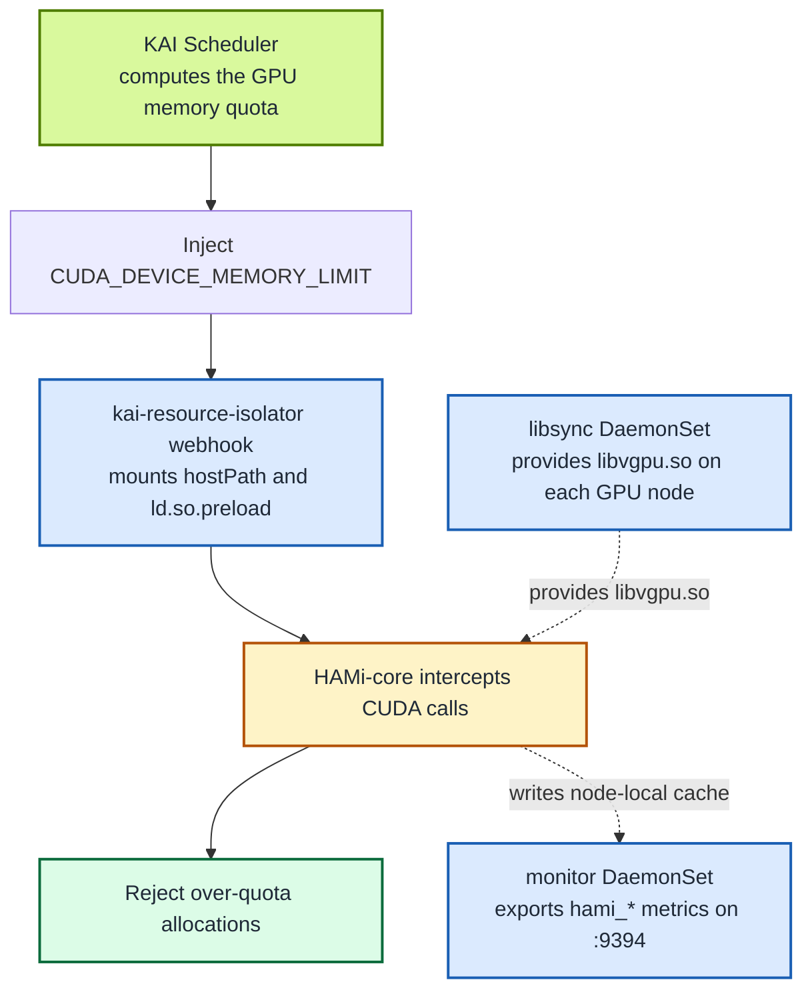

The companion post [HAMi-core adopted by NVIDIA KAI Scheduler](/blog/hami-core-adopted-by-nvidia-kai-scheduler) already introduces KAI Scheduler and the collaboration behind this integration. This post skips that background and focuses on one question: **when KAI Scheduler places two Pods on one GPU, does HAMi-core actually enforce each Pod's memory quota?**

We verified the currently documented combination—KAI Scheduler v0.17.0 and `kai-resource-isolator` 1.1.0-chart—on GKE 1.35/COS/CDI. Both Pods shared the same NVIDIA T4, each saw a 4147 MiB ceiling, a 3 GiB CUDA allocation succeeded, and a cumulative 5 GiB allocation failed. The optional monitor also exported live limit and usage metrics for both Pods.

:::note About the captured output

The UUID, memory ceiling, CUDA allocation results, and monitor metrics below came from the verified GKE run. Resource suffixes and addresses will differ in another cluster.

:::

<!-- truncate -->

## How the integration works

The path has three responsibilities:

- **KAI Scheduler** decides which GPU a Pod uses and injects the computed quota through `CUDA_DEVICE_MEMORY_LIMIT`.
- **`kai-resource-isolator`** distributes `libvgpu.so`; its webhook mounts the library and configures `ld.so.preload` in the workload Pod. Its optional monitor reads node-local HAMi caches and exposes `hami_*` metrics on `:9394`.
- **HAMi-core (`libvgpu.so`)** intercepts CUDA calls such as `cudaMalloc` and rejects allocations beyond the quota.



`CUDA_DEVICE_MEMORY_LIMIT` is the contract between scheduling and enforcement. KAI does not need to know how CUDA calls are intercepted, and HAMi-core does not need to know how the quota was calculated. KAI retains its own scheduling logic; it integrates with HAMi-core rather than replacing its scheduler with the full HAMi platform.

At runtime, the dynamic linker loads `libvgpu.so` before the CUDA libraries. HAMi-core reads the injected quota, tracks the container's memory use, rewrites device queries so tools such as `nvidia-smi` show the quota, and returns an error when a new allocation would cross the limit. This is CUDA API-level enforcement, rather than an application voluntarily respecting a value.

## Standard integration on an existing GPU cluster

This section assumes that the Kubernetes cluster already has working NVIDIA GPUs: nodes advertise `nvidia.com/gpu`, and an ordinary whole-GPU Pod can run `nvidia-smi`. It shows the standard integration path without the GKE-specific workarounds from Lab 12.

### 1. Install KAI Scheduler

Enable GPU sharing and the `hamicore` binder plugin:

```bash
helm install kai-scheduler \
  oci://ghcr.io/kai-scheduler/kai-scheduler/kai-scheduler \
  --namespace kai-scheduler --create-namespace \
  --version v0.17.0 \
  --set global.gpuSharing=true \
  --set binder.plugins.hamicore.enabled=true

kubectl -n kai-scheduler wait --for=condition=available \
  --timeout=180s deploy --all
kubectl -n kai-scheduler wait --for=condition=Ready \
  --timeout=300s config/kai-config
kubectl get pods -n kai-scheduler
kubectl get queues
```

A healthy installation has all KAI components running and the default queue hierarchy available. Pod suffixes vary:

```text
NAME                                  READY   STATUS
admission-...                         1/1     Running
binder-...                            1/1     Running
kai-operator-...                      1/1     Running
kai-scheduler-default-...             1/1     Running
pod-grouper-...                       1/1     Running
podgroup-controller-...               1/1     Running
queue-controller-...                  1/1     Running

NAME                   PARENT
default-parent-queue
default-queue          default-parent-queue
```

### 2. Install kai-resource-isolator

Install the HAMi-core library distributor, injection webhook, and optional monitor:

```bash
helm install kai-resource-isolator \
  oci://docker.io/projecthami/kai-resource-isolator \
  --namespace kai-resource-isolator --create-namespace \
  --version 1.1.0-chart \
  --set monitor.enabled=true

kubectl rollout status ds/kai-resource-isolator-libsync \
  -n kai-resource-isolator --timeout=300s
kubectl rollout status ds/kai-resource-isolator-monitor \
  -n kai-resource-isolator --timeout=300s
kubectl rollout status deploy/kai-resource-isolator-webhook \
  -n kai-resource-isolator --timeout=300s
kubectl get pods -n kai-resource-isolator
```

There should be one ready libsync Pod and one ready monitor Pod per GPU node, plus a ready webhook:

```text
NAME                                  READY   STATUS
kai-resource-isolator-libsync-...     1/1     Running
kai-resource-isolator-monitor-...     1/1     Running
kai-resource-isolator-webhook-...     1/1     Running
```

### 3. Run a shared GPU Pod

The `gpu-memory` annotation is an integer number of MiB without a suffix. The queue label and `schedulerName` send the Pod through KAI Scheduler:

```bash
kubectl apply -f - <<'EOF'
apiVersion: v1
kind: Pod
metadata:
  name: kai-hami-check
  labels:
    kai.scheduler/queue: default-queue
  annotations:
    gpu-memory: "4096"
spec:
  schedulerName: kai-scheduler
  containers:
    - name: cuda
      image: nvidia/cuda:12.4.1-base-ubuntu22.04
      command: ["sleep", "infinity"]
EOF

kubectl wait --for=condition=Ready pod/kai-hami-check --timeout=5m
kubectl get pod kai-hami-check -o wide
```

The Pod should be `Running` on a GPU node:

```text
NAME             READY   STATUS    NODE
kai-hami-check   1/1     Running   gpu-node-1
```

### 4. Check the scheduling-to-runtime handoff

Inspect the quota from KAI, the preload file injected by the isolator, and the memory visible through HAMi-core:

```bash
kubectl exec kai-hami-check -- sh -lc '
  test -n "$CUDA_DEVICE_MEMORY_LIMIT"
  test -f /usr/local/vgpu/libvgpu.so
  printf "limit=%s\n" "$CUDA_DEVICE_MEMORY_LIMIT"
  cat /etc/ld.so.preload
  nvidia-smi --query-gpu=uuid,memory.total --format=csv,noheader
'
```

For a 4096 MiB request on a 15360 MiB T4, the verified output was:

```text
limit=4147m
/usr/local/vgpu/libvgpu.so
GPU-9acc8878-3967-5fb4-c534-43d6fd820fa6, 4147 MiB
```

These three lines prove that the integration chain is active: KAI supplied a quota, the isolator injected HAMi-core, and the container sees the resulting limit instead of the full card. The value is 4147 rather than exactly 4096 MiB because KAI converts the request to a two-decimal GPU fraction before calculating the enforced limit.

### 5. Check the optional monitor

Each monitor reads caches from its own node, so select the monitor Pod running on the workload node. Keep the port-forward command running in one terminal:

```bash
export WORKLOAD_NODE=$(kubectl get pod kai-hami-check \
  -o jsonpath='{.spec.nodeName}')
export MONITOR_POD=$(kubectl get pods -n kai-resource-isolator \
  -l app.kubernetes.io/component=kai-vgpu-monitor \
  --field-selector="spec.nodeName=$WORKLOAD_NODE" \
  -o jsonpath='{range .items[*]}{.metadata.name}{"\n"}{end}' | head -n 1)
test -n "$MONITOR_POD" || {
  echo "No monitor Pod is running on $WORKLOAD_NODE" >&2
  exit 1
}
kubectl port-forward -n kai-resource-isolator \
  "pod/$MONITOR_POD" 9394:9394
```

From another terminal, confirm that the endpoint contains a series for the Pod:

```bash
curl -s http://127.0.0.1:9394/metrics | grep \
  'hami_vgpu_memory_limit_bytes.*pod="kai-hami-check"'
```

Expected shape:

```text
hami_vgpu_memory_limit_bytes{...,pod="kai-hami-check",...} 4.348444672e+09
```

This is enough for a basic integration check. To prove that the displayed ceiling is actually enforced, run a CUDA allocation test that succeeds below the quota and fails above it; the next section summarizes that result, and Lab 12 provides the complete program and procedure.

Remove the basic test Pod when finished:

```bash
kubectl delete pod kai-hami-check
```

## GKE verification: does the isolation hold?

We ran the integration on a GKE 1.35/COS/CDI cluster with three `n1-standard-2` nodes, each carrying one NVIDIA T4. KAI Scheduler v0.17.0 handled shared scheduling, while `kai-resource-isolator` 1.1.0-chart injected HAMi-core.

| Check | Captured result | What it proves |
| :-- | :-- | :-- |
| Node and GPU UUID | Both Pods ran on one single-GPU node and returned `GPU-9acc8878-...` | They shared the same physical T4 |
| Visible memory | Both Pods reported `4147 MiB`; the full card reported `15360 MiB` | HAMi-core exposed KAI's per-Pod quota |
| CUDA allocation | 3 GiB succeeded; a cumulative 5 GiB returned `out of memory` | The ceiling was enforced, not merely displayed |
| Concurrent isolation | Pod B still allocated its own 3 GiB while Pod A held 3 GiB | One Pod could not consume the other's quota |
| Monitor metrics | The same-node `:9394/metrics` endpoint reported both Pods' 4.348 GB limits and 3.328 GB live usage | The monitor exported non-empty per-Pod gauges from each container's cache |

HAMi-core logged the over-quota allocation as:

```text
Device 0 OOM 5475663872 / 4348444672
allocate another 2 GiB: out of memory
PASS: in-quota allocation succeeded and over-quota allocation failed
```

Together, these checks connect scheduling onto one card, per-container visibility, actual CUDA allocation enforcement, and observability into one evidence chain. Because the monitor reads node-local caches, the lab queries the monitor instance on the workload node directly instead of using a Service that may select another node.

:::note Isolation boundary

This proves CUDA API-level memory enforcement, not a MIG-like hardware security boundary. The tested GKE compatibility path also used privileged workload containers, so it should not be treated as an untrusted multi-tenant security design.

:::

## Reproduce the result

The standard KAI + HAMi-core installation is short. GKE 1.35/COS/CDI additionally requires environment-specific handling for the read-only root filesystem, RuntimeClass, NVML library paths, CDI device injection, and PriorityClass. Those operational details and their captured command output are maintained in:

**[Lab 12: Verify KAI Scheduler and HAMi Memory Isolation on GKE](/tutorials/labs/kai-scheduler-hami-gke)**

## Next steps

- Background and collaboration history: [HAMi-core adopted by NVIDIA KAI Scheduler](/blog/hami-core-adopted-by-nvidia-kai-scheduler)
- User documentation: [How to use HAMi with KAI Scheduler](/docs/next/userguide/kai-scheduler/how-to-use-kai-scheduler)
- Repositories: [KAI-resource-isolator](https://github.com/Project-HAMi/KAI-resource-isolator), [HAMi-core](https://github.com/Project-HAMi/HAMi-core), and [KAI-Scheduler](https://github.com/kai-scheduler/KAI-Scheduler)
