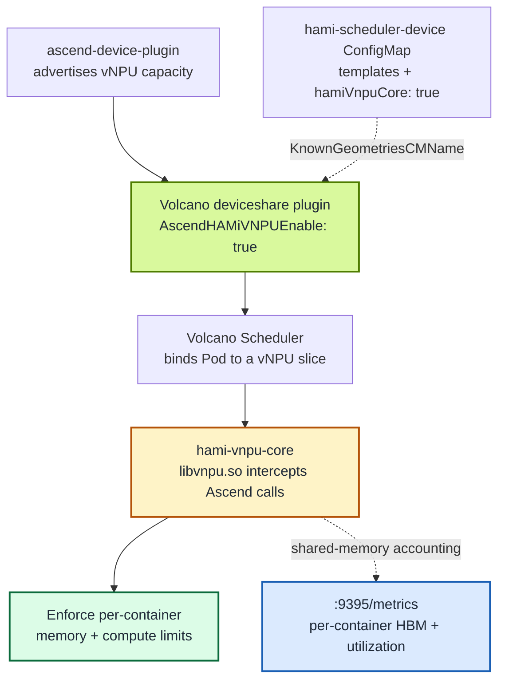

HAMi v2.10 makes it possible to run Ascend soft-partitioned workloads under the Volcano scheduler, combining Volcano's batch scheduling strength with HAMi-core's runtime isolation. This post explains how the integration works and gives a reproducible procedure to enable and verify `hami-vnpu-core` soft slicing on an Ascend 310P3 ARM server.

:::note About the captured output

The host-level outputs (`npu-smi info`, hardware inventory) are real captures from the test node. The in-cluster verification outputs describe the **expected** result and use `<placeholder>` values where the answer depends on the run; capture your real output as you go and fill it in before publishing.

:::

<!-- truncate -->

## What "Volcano vNPU soft slicing" actually means

There are **two different ways** Volcano can schedule Ascend virtual NPUs, and they are easy to confuse. Getting this right up front saves hours of debugging:

|  | MindCluster mode | HAMi mode |
| :-- | :-- | :-- |
| Volcano flag | `deviceshare.AscendMindClusterVNPUEnable` | `deviceshare.AscendHAMiVNPUEnable` |
| Provided by | Volcano's native Ascend plugin | [Project-HAMi/ascend-device-plugin](https://github.com/Project-HAMi/ascend-device-plugin) |
| Templates | `vir04_3c_ndvpp` (have a `dvpp` dimension) | `vir05_1c_16g` (fields `memory`/`aiCore`/`aiCPU` only) |
| Soft slicing (`hami-core`)? | No | **Yes** |
| Resource names | `huawei.com/npu-core` | `huawei.com/Ascend310P`, `-memory`, `-core` |

This post is about **HAMi mode** with **`hami-vnpu-core` soft slicing**. That is the only one of the two that does runtime interception: instead of pre-cutting the card into fixed virtualization templates, HAMi-core intercepts Ascend calls in user space and enforces per-container memory and compute limits at runtime. Volcano decides _which_ Pod gets _what_ slice; HAMi-core makes that decision _stick_.



The contract between Volcano and HAMi-core is the vNPU slice description. Volcano's `deviceshare` plugin reads the vNPU templates from the `hami-scheduler-device` ConfigMap and places Pods; the `ascend-device-plugin` then sets up the runtime so `hami-vnpu-core` enforces the slice the scheduler chose.

## Prerequisites and an important version caveat

Verified against the [ascend-device-plugin Volcano guide](https://github.com/Project-HAMi/ascend-device-plugin/blob/main/docs/volcano.md):

- **Kubernetes** ≥ 1.20
- **Volcano** ≥ 1.14, **and ≥ 1.16 for `hami-core` soft slicing**
- [ascend-docker-runtime](https://gitcode.com/Ascend/mind-cluster/tree/master/component/ascend-docker-runtime) installed on the node
- **Ascend Driver** ≥ 25.5
- The NPU chips set to **`device-share` mode** (`npu-smi set -t device-share -i <id> -d 1`)
- **`npu-smi` reachable on the host** (required only for soft slicing), at `/usr/local/Ascend/driver/tools/npu-smi`, `/usr/local/sbin/npu-smi`, or `/usr/local/bin/npu-smi`
- **Soft slicing is ARM-only**; template-based hard slicing has no architecture restriction

:::warning The Volcano 1.16 gap

This is the single biggest gotcha. Soft slicing needs Volcano ≥ 1.16, but **there is no stable 1.16 release yet**. At the time of writing, the only way to satisfy the requirement is the Volcano chart `1.16.0-alpha.1`:

```bash
helm repo add volcano-sh https://volcano-sh.github.io/helm-charts
helm search repo volcano-sh/volcano --versions | head
```

Expect to see `1.15.1` as the latest stable and `1.16.0-alpha.1` as the only 1.16. The procedure below uses the alpha explicitly. If your environment cannot run an alpha scheduler, fall back to **template-based vNPU under HAMi mode** (stable Volcano 1.14/1.15); only the runtime-interception soft slicing path needs 1.16.

:::

:::note No images to build

Even though HAMi v2.10 and Volcano 1.16 are not formally released yet, **nothing in this path requires building images yourself, including on ARM**:

- Volcano publishes multi-arch images (`linux/amd64` and `linux/arm64`) for `v1.16.0-alpha.1` (`vc-scheduler`, `vc-webhook-manager`, `vc-controller-manager`).
- `projecthami/ascend-device-plugin:v1.4.0` is multi-arch as well. The arm64 image already contains `libvnpu.so` compiled natively on ARM64 by the plugin's CI, which builds the bundled [hami-vnpu-core](https://github.com/Project-HAMi/hami-vnpu-core) source in a CANN environment.
- The soft-slicing engine is not a separate deployment: at startup the plugin DaemonSet copies `libvnpu.so` and `ld.so.preload` from the image into `/usr/local/hami-vnpu-core` on the host and creates `/usr/local/hami-shared-region` automatically. Building hami-vnpu-core from source (`cargo build` in a CANN environment) is only needed if you modify it.
- The full HAMi chart is **not** required for the Volcano path; the standalone ascend-device-plugin is sufficient, so the unreleased HAMi v2.10 does not block this test.

:::

## The test environment

The test node is a fully China-built inference server. The relevant inventory:

| Item | Value |
| :-- | :-- |
| Server | Huawei Kunpeng 920, aarch64, 96 cores, 4 NUMA nodes, ~512 GB RAM, Kylin Linux V10 Lance |
| NPU | 2× Ascend 310P3, each with ~21.5 GiB visible memory, inference-oriented (strong INT8) |
| npu-smi / driver | 25.5.1, which meets the ≥ 25.5 requirement |
| Kubernetes | kubeadm-installed single-node all-in-one cluster; node `aio-node74-arm` is both control-plane and worker; containerd + Flannel (VXLAN) |
| Pre-installed | Volcano and the Ascend device plugin are already on the cluster |
| Other GPUs | 2× NVIDIA T4 present, but the NVIDIA driver is not loaded, so they are unusable |

The aarch64 architecture satisfies the ARM-only requirement for soft slicing, and `npu-smi` works on the host.

:::note One node is enough

Soft slicing is an intra-node capability. Everything this post verifies (two Pods sharing one card, over-quota rejection, per-container metrics) happens inside a single node, so a single-node all-in-one cluster is a valid test bed. Multiple nodes only matter for cross-node concerns such as node-level binpack/spread or HA, which are not the target here.

:::

Because Volcano and the Ascend device plugin are already installed on the test cluster, the steps below emphasize **verifying and reconfiguring** the existing components rather than a greenfield install; the install commands are kept for readers starting from scratch.

## Step 1: Confirm the node and label it

Check the driver and devices first. This is the real `npu-smi info` output from the test node:

```text
+--------------------------------------------------------------------------------------------------------+
| npu-smi 25.5.1                                   Version: 25.5.1                                       |
+-------------------------------+-----------------+------------------------------------------------------+
| NPU     Name                  | Health          | Power(W)     Temp(C)           Hugepages-Usage(page) |
| Chip    Device                | Bus-Id          | AICore(%)    Memory-Usage(MB)                        |
+===============================+=================+======================================================+
| 4       310P3                 | OK              | NA           36                0     / 0             |
| 0       0                     | 0000:81:00.0    | 0            1848 / 21525                           |
+===============================+=================+======================================================+
| 5       310P3                 | OK              | NA           38                0     / 0             |
| 0       1                     | 0000:85:00.0    | 0            1849 / 21525                           |
+===============================+=================+======================================================+
```

Two healthy 310P3 cards, each reporting 21525 MB of memory. Note the mapping between what the hardware reports and what you request in a Pod spec: the chip name is `310P3`, but the Kubernetes resource name comes from the config's `commonWord`, which is `huawei.com/Ascend310P`. There is no generic `huawei.com/Ascend` resource; always match the entry in the device config.

The test node is named `aio-node74-arm`. Because a kubeadm control-plane node carries taints by default, first confirm the node is schedulable (in an all-in-one setup it must be, or nothing but control-plane components can run on it):

```bash
kubectl get node aio-node74-arm -o jsonpath='{.spec.taints}'
```

Expected: no `node-role.kubernetes.io/control-plane:NoSchedule` taint, or the existing DaemonSets already tolerate it. If the taint is present and you want this node to run workloads, remove it:

```bash
kubectl taint node aio-node74-arm node-role.kubernetes.io/control-plane:NoSchedule-
```

Then label the node so the device plugin's DaemonSet lands on it:

```bash
kubectl label node aio-node74-arm ascend=on --overwrite
kubectl get nodes --show-labels | grep ascend
```

## Step 2: Install Volcano (1.16 alpha)

The test cluster already runs Volcano, so start by checking which version it is:

```bash
kubectl -n volcano-system get deploy volcano-scheduler \
  -o jsonpath='{.spec.template.spec.containers[0].image}'
helm list -n volcano-system
```

Soft slicing requires ≥ 1.16; if the installed version is older, upgrade before continuing. For a fresh install, install Volcano into its own namespace and pin the alpha version explicitly so the soft-slicing requirement is met:

```bash
helm install volcano volcano-sh/volcano \
  --namespace volcano-system --create-namespace \
  --version 1.16.0-alpha.1

kubectl -n volcano-system wait --for=condition=available \
  --timeout=300s deploy/volcano-scheduler
kubectl get pods -n volcano-system
```

Expected: `volcano-scheduler`, `volcano-admission`, and `volcano-controllers` Pods are `Running`. Pod suffixes vary by release.

## Step 3: Install the ascend-device-plugin (HAMi mode)

If a plugin is already installed, confirm it is the Project-HAMi one (image `projecthami/ascend-device-plugin`) rather than Huawei's upstream plugin, then skip the fresh install and go straight to the ConfigMap change below:

```bash
kubectl -n kube-system get ds \
  -o custom-columns='NAME:.metadata.name,IMAGE:.spec.template.spec.containers[0].image' \
  | grep -i ascend
```

For a fresh install: the plugin ships raw manifests and a Helm chart. The raw-manifest path is the most explicit and is easiest to audit; use it here. All resources land in `kube-system`.

Create the RuntimeClass, the device-config ConfigMap, the optional node-config ConfigMap, and the DaemonSet:

```bash
# RuntimeClass required by every Ascend Pod
kubectl apply -f https://raw.githubusercontent.com/Project-HAMi/ascend-device-plugin/main/ascend-runtimeclass.yaml

# device-config (the "hami-scheduler-device" ConfigMap)
kubectl apply -f https://raw.githubusercontent.com/Project-HAMi/ascend-device-plugin/main/ascend-device-configmap.yaml

# optional per-node config ("hami-device-node-config")
kubectl apply -f https://raw.githubusercontent.com/Project-HAMi/ascend-device-plugin/main/ascend-device-node-configmap.yaml

# the DaemonSet (image projecthami/ascend-device-plugin:v1.4.0, port 9395)
kubectl apply -f https://raw.githubusercontent.com/Project-HAMi/ascend-device-plugin/main/ascend-device-plugin.yaml
```

Now enable soft slicing globally by setting `hamiVnpuCore: true` under `vnpus` inside the `hami-scheduler-device` ConfigMap (key `device-config.yaml`). The safe way is to dump the current config, edit one line, and re-apply:

```bash
# Inspect the templates for your chip and the current hamiVnpuCore flag
kubectl -n kube-system get cm hami-scheduler-device \
  -o jsonpath='{.data["device-config\.yaml"]}' | head -40

# Dump, edit hamiVnpuCore -> true, and re-apply
kubectl -n kube-system get cm hami-scheduler-device \
  -o jsonpath='{.data["device-config\.yaml"]}' > device-config.yaml
# edit device-config.yaml: under "vnpus:", set  hamiVnpuCore: true
kubectl -n kube-system create cm hami-scheduler-device \
  --from-file=device-config.yaml=device-config.yaml -o yaml --dry-run=client \
  | kubectl apply -f -
```

The 310P3 entry with soft slicing enabled looks like this (excerpt):

```yaml
vnpus:
  hamiVnpuCore: true
  configs:
    - chipName: 310P3
      commonWord: Ascend310P
      resourceName: huawei.com/Ascend310P
      resourceMemoryName: huawei.com/Ascend310P-memory
      memoryAllocatable: 21527
      memoryCapacity: 24576
      aiCore: 8
      aiCPU: 7
      templates:
        - name: vir01
          memory: 3072
          aiCore: 1
          aiCPU: 1
        - name: vir02
          memory: 6144
          aiCore: 2
          aiCPU: 2
        - name: vir04
          memory: 12288
          aiCore: 4
          aiCPU: 4
```

:::note The `-core` resource on 310P3

The stock config declares `resourceCoreName` (the `-core` soft-slice resource) only for `910B3` and `Ascend910C`. To request `huawei.com/Ascend310P-core` as the Pod examples below do (and as the upstream Volcano guide shows), add one line to the 310P3 entry:

```yaml
resourceCoreName: huawei.com/Ascend310P-core
```

If you skip this, omit the `-core` limit from the Pod specs; the memory limit still applies.

:::

Restart the device plugin so it picks up the new config, then confirm it is running and advertising capacity:

```bash
kubectl -n kube-system rollout restart ds hami-ascend-device-plugin
kubectl -n kube-system wait --for=condition=Ready \
  --timeout=180s pod -l app.kubernetes.io/component=hami-ascend-device-plugin

kubectl describe node aio-node74-arm | grep -A2 -i ascend
```

Expected: the node's capacity/allocatable now includes `huawei.com/Ascend310P` (and the `-memory`/`-core` extended resources). If the resources are missing, check the plugin logs (`kubectl -n kube-system logs ds/hami-ascend-device-plugin`) for `npu-smi` path or driver-version errors.

## Step 4: Enable Volcano's HAMi-mode deviceshare

Tell the Volcano scheduler to schedule Ascend vNPUs in HAMi mode and where to read the templates. Edit the `volcano-scheduler-configmap`:

```bash
kubectl -n volcano-system get cm volcano-scheduler-configmap \
  -o jsonpath='{.data["volcano-scheduler\.conf"]}'
```

Set `volcano-scheduler.conf` so the `deviceshare` plugin points at the `hami-scheduler-device` ConfigMap:

```yaml
actions: "enqueue, allocate, backfill"
tiers:
  - plugins:
      - name: predicates
      - name: deviceshare
        arguments:
          deviceshare.AscendHAMiVNPUEnable: "true"
          deviceshare.SchedulePolicy: binpack
          deviceshare.KnownGeometriesCMNamespace: kube-system
          deviceshare.KnownGeometriesCMName: hami-scheduler-device
```

Apply it and restart the scheduler so the new config takes effect:

```bash
kubectl -n volcano-system create cm volcano-scheduler-configmap \
  --from-file=volcano-scheduler.conf=volcano-scheduler.conf \
  -o yaml --dry-run=client | kubectl apply -f -
kubectl -n volcano-system rollout restart deploy volcano-scheduler
kubectl -n volcano-system rollout status deploy volcano-scheduler --timeout=180s
```

> If you also use Volcano vGPU (NVIDIA) in the same cluster, merge both geometry ConfigMaps into one and point `KnownGeometriesCMName` at the merged ConfigMap.

## Step 5: Run a soft-sliced vNPU Pod

The key switches are `schedulerName: volcano`, `runtimeClassName: ascend`, and the `huawei.com/vnpu-mode: hami-core` annotation. Without the annotation the Pod falls back to template-based slicing and may stay Pending on a hami-core-only node.

The example requests one 8 GiB slice with 50% of the compute cores, sized so that two such Pods fit on a single 21.5 GiB card:

```bash
kubectl apply -f - <<'EOF'
apiVersion: v1
kind: Pod
metadata:
  name: ascend-vnpu-check
  annotations:
    huawei.com/vnpu-mode: hami-core
spec:
  schedulerName: volcano
  runtimeClassName: ascend
  containers:
    - name: npu
      image: quay.io/ascend/vllm-ascend:v0.18.0-310p
      command: ["sleep", "infinity"]
      resources:
        limits:
          huawei.com/Ascend310P: "1"
          huawei.com/Ascend310P-memory: "8192"
          huawei.com/Ascend310P-core: "50"
EOF

kubectl wait --for=condition=Ready pod/ascend-vnpu-check --timeout=5m
kubectl get pod ascend-vnpu-check -o wide
```

Expected: the Pod reaches `Running` on the Ascend node. If it stays `Pending`, check events:

```bash
kubectl describe pod ascend-vnpu-check | tail -30
```

Common causes: the `deviceshare` plugin name is wrong, `KnownGeometriesCMName` points at the wrong ConfigMap, or the resource name does not match the config entry (for example requesting `huawei.com/Ascend310P3` or `huawei.com/Ascend` instead of `huawei.com/Ascend310P`).

## Step 6: Verify the slice and the isolation

Three checks connect scheduling, runtime enforcement, and observability.

**1. The container sees only its slice.** Inside the Pod, the NPU should report the requested memory, not the full ~21.5 GiB card:

```bash
kubectl exec ascend-vnpu-check -- sh -lc 'npu-smi info'
```

Expected: the device visible to the container shows an ~8 GiB memory window rather than the full card.

**2. Two Pods cannot exceed the card together.** Launch a second Pod with the same spec and confirm both land within their own limits:

```bash
kubectl apply -f - <<'EOF'
apiVersion: v1
kind: Pod
metadata:
  name: ascend-vnpu-check-2
  annotations:
    huawei.com/vnpu-mode: hami-core
spec:
  schedulerName: volcano
  runtimeClassName: ascend
  containers:
    - name: npu
      image: quay.io/ascend/vllm-ascend:v0.18.0-310p
      command: ["sleep", "infinity"]
      resources:
        limits:
          huawei.com/Ascend310P: "1"
          huawei.com/Ascend310P-memory: "8192"
          huawei.com/Ascend310P-core: "50"
EOF

kubectl get pod -o wide | grep ascend-vnpu-check
```

Expected: with the `binpack` schedule policy both Pods share one card, each bound to its own virtual slice (2 × 8192 MiB stays under the 21527 MiB allocatable). A third Pod that would push the total past the card's capacity stays Pending until one of the first two exits.

**3. Per-container metrics are exported.** The monitor runs only in `hami-vnpu-core` mode and serves Prometheus metrics on `:9395`:

```bash
PLUGIN_POD=$(kubectl -n kube-system get pod \
  -l app.kubernetes.io/component=hami-ascend-device-plugin \
  --field-selector spec.nodeName=aio-node74-arm \
  -o jsonpath='{.items[0].metadata.name}')
kubectl -n kube-system port-forward "pod/$PLUGIN_POD" 9395:9395 &
curl -s http://127.0.0.1:9395/metrics | grep hami_
```

Expected: series for each container, including per-container memory and utilization:

```text
hami_vgpu_memory_limit_bytes{...,pod="ascend-vnpu-check",...} 8.589934592e+09
hami_vgpu_memory_used_bytes{...,pod="ascend-vnpu-check",...} <live usage>
hami_container_device_utilization_ratio{...,pod="ascend-vnpu-check",...} <live %>
```

The full set of exported metrics includes `hami_host_gpu_memory_used_bytes`, `hami_host_gpu_utilization_ratio`, `hami_vgpu_memory_used_bytes`, `hami_vgpu_memory_limit_bytes`, and `hami_container_device_utilization_ratio`.

Clean up when finished:

```bash
kubectl delete pod ascend-vnpu-check ascend-vnpu-check-2
```

## Notes and gotchas

- **`-core` defaults to 0, `-memory` defaults to the whole NPU.** Omitting `-core` means no dedicated compute-core reservation; it only takes effect under `huawei.com/vnpu-mode: hami-core`.
- **Resource names come from the config's `commonWord`, not the chip name.** For 310P3 hardware the resource is `huawei.com/Ascend310P`. The bundled `examples/ascendjob-910b.yaml` uses a stale `huawei.com/Ascend910B` and will not match the current ConfigMap.
- **`-core` on 310P3 needs `resourceCoreName` declared.** The stock ConfigMap declares it only for `910B3` and `Ascend910C`; add the line shown in Step 3 before requesting `huawei.com/Ascend310P-core`.
- **Chip support caveat.** The hami-vnpu-core README scopes its standalone testing to Ascend 910B; the 310P soft-slicing path comes from the ascend-device-plugin docs example. Treat this test as validation of that documented path.
- **No official HAMi-mode VCJob example exists.** The ascend-device-plugin docs use bare Pods with `schedulerName: volcano`. To run a gang-scheduled job, wrap the Pod `spec` into a Volcano `VCJob` `tasks[].template` yourself; the `deviceshare` arguments above still apply.
- **`npu-smi` path.** If `npu-smi` lives at `/usr/local/bin/npu-smi`, add that path mount in `ascend-device-plugin.yaml`; the plugin only checks the three documented paths.
- **Isolation boundary.** This is runtime API-level enforcement (software interception via `hami-vnpu-core`'s `libvnpu.so`), not an SR-IOV-style hardware security boundary.

## Next steps

- Ascend device plugin: [Project-HAMi/ascend-device-plugin](https://github.com/Project-HAMi/ascend-device-plugin)
- Volcano deploy/usage: [ascend-device-plugin Volcano guide](https://github.com/Project-HAMi/ascend-device-plugin/blob/main/docs/volcano.md)
- Related release post: [HAMi v2.10.0 Release](/blog/hami-v2-10-0-release)
- Soft-slicing engine: [Project-HAMi/hami-vnpu-core](https://github.com/Project-HAMi/hami-vnpu-core)
