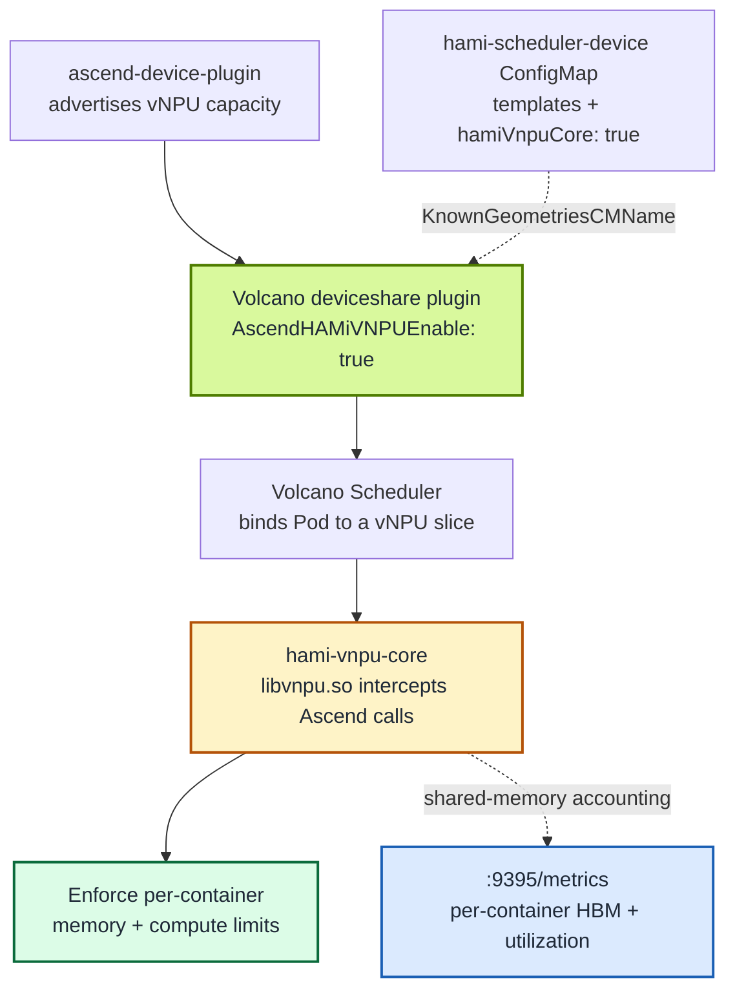

[Volcano](https://github.com/volcano-sh/volcano) is the batch scheduler of choice for many AI clusters, and HAMi-core is the runtime that makes shared accelerators behave. This post covers their intersection on Ascend hardware: running **`hami-vnpu-core` soft-sliced vNPUs under the Volcano scheduler**, so batch scheduling semantics (queues, gangs, binpack) and per-container isolation (memory and compute limits enforced at the Ascend API layer) work together.

We verified the full path on a single-node Kubernetes cluster running on an Ascend 310P3 aarch64 server: built Volcano and the [ascend-device-plugin](https://github.com/Project-HAMi/ascend-device-plugin) images from source, deployed both, and confirmed that a container requesting an 8192 MiB slice sees exactly that much memory, while a second Pod binpacks onto the same physical card with its own independent slice and the plugin's Prometheus endpoint reports both limits. The complete step-by-step procedure (including every command and captured output) is [Lab 13: Soft-Slicing Ascend 310P3 vNPU with Volcano and HAMi-core](/tutorials/labs/volcano-ascend-vnpu).

:::note About the captured output

Every output block in this post was captured from the verified run on 2026-08-14: a Kylin V10 aarch64 node with 2× Ascend 310P3 (driver/npu-smi 25.5.1), Kubernetes v1.28.15, and containerd 1.7.1. UUIDs, IPs, and Pod suffixes will differ in another cluster; compare the component names, placement, and measured values.

:::

<!-- truncate -->

## Two ways Volcano can schedule Ascend vNPUs

There are **two different ways** Volcano can schedule Ascend virtual NPUs, and they are easy to confuse. Getting this right up front saves hours of debugging:

|  | MindCluster mode | HAMi mode |
| :-- | :-- | :-- |
| Volcano flag | `deviceshare.AscendMindClusterVNPUEnable` | `deviceshare.AscendHAMiVNPUEnable` |
| Provided by | Volcano's native Ascend plugin | [Project-HAMi/ascend-device-plugin](https://github.com/Project-HAMi/ascend-device-plugin) |
| Templates | `vir04_3c_ndvpp` (have a `dvpp` dimension) | `vir05_1c_16g` (fields `memory`/`aiCore`/`aiCPU` only) |
| Soft slicing (`hami-core`)? | No | **Yes** |
| Resource names | `huawei.com/npu-core` | `huawei.com/Ascend310P`, `-memory` |

This post is about **HAMi mode** with **`hami-vnpu-core` soft slicing**. That is the only one of the two that does runtime interception: instead of pre-cutting the card into fixed virtualization templates, HAMi-core intercepts Ascend calls in user space and enforces per-container memory and compute limits at runtime. Volcano decides _which_ Pod gets _what_ slice; HAMi-core makes that decision _stick_.

## How the integration works

The path has three responsibilities:

- **Volcano's `deviceshare` plugin** reads the vNPU geometries from the `hami-scheduler-device` ConfigMap (with `AscendHAMiVNPUEnable: "true"`) and, together with the `binpack` or `spread` policy, decides which node and card serves each Pod.
- **The `ascend-device-plugin` DaemonSet** registers `huawei.com/Ascend310P` (card count) and `huawei.com/Ascend310P-memory` (MiB) as extended resources, and copies the HAMi-core assets (`libvnpu.so` and `ld.so.preload`) onto the host at `/usr/local/hami-vnpu-core/`.
- **HAMi-core (`libvnpu.so`)** is injected into workload containers through Ascend Docker Runtime's preload mechanism and enforces the slice the scheduler chose.



The Pod contract is minimal: `schedulerName: volcano`, `runtimeClassName: ascend`, the annotation `huawei.com/vnpu-mode: hami-core`, and limits on the two extended resources. Without the annotation, the Pod falls back to the template-based path and can stay Pending on a soft-slicing node.

A detail that trips up people coming from HAMi's NVIDIA side: the interception library for Ascend is **`libvnpu.so`, not `libvgpu.so`**, provided by [Project-HAMi/hami-vnpu-core](https://github.com/Project-HAMi/hami-vnpu-core). It is preloaded via `/etc/ld.so.preload` inside the container, communicates through a shared-memory region at `/hami-shared-region`, and receives the enforced quota through environment variables such as `NPU_MEM_QUOTA`.

## Why we built from source

Soft slicing requires **Volcano ≥ 1.16**, but no stable 1.16 existed at verification time: the latest stable release was v1.15.1, with only a `1.16.0-alpha.1` chart available. The options were the alpha chart or building master from source; we built **Volcano master (commit `7d9504320`)** because the node is aarch64 and we wanted the exact binaries we compiled.

The source build is a temporary workaround. Once Volcano ships a stable 1.16 release, the standard Helm installation will cover this path and the compile steps in Lab 13 can be skipped, for example:

```bash
helm repo add volcano-sh https://volcano-sh.github.io/helm-charts
helm install volcano volcano-sh/volcano \
  --namespace volcano-system --create-namespace \
  --version 1.16.0
```

Everything after the install (the `deviceshare` scheduler configuration and the plugin setup) stays exactly the same.

Two decisions from that build are worth remembering even if you never compile anything:

- **Host-compile, container-package.** Running `go mod download` inside the builder container kept timing out, while the host module cache was warm. Compiling on the host (`make vc-scheduler vc-controller-manager vc-webhook-manager`, ~10 s) and having Docker only package the static binaries into `alpine` images is both faster and more reproducible on restricted networks.
- **The cluster runtime is containerd, so Docker-built images are invisible to kubelet.** Every image had to be imported with `docker save … | ctr -n k8s.io images import -`. Pods otherwise fail with `ErrImageNeverPull` even though `docker images` shows the tag.

For the device plugin we checked out **v1.3.1 (commit `506fe27`)** and packaged it with one twist that turned out to be the single biggest pitfall of the whole exercise: the image must carry the **`libvnpu.so` that matches your NPU driver**. We initially reused a two-month-old `libvnpu` image as the asset source, and every in-container `npu-smi info` hung forever at `Initialize SchedulerClient...`. The fix was to copy the asset straight from the official v1.3.1 image (md5 `42b202887a27b9adb7522fd9e056b03b` on our driver, 25.5.1) instead of a stale local cache. Lab 13 shows the exact Dockerfile and the md5 check.

## What we verified

The host reported two healthy 310P3 cards:

```text
$ npu-smi info
+--------------------------------------------------------------------------------------------------------+
| npu-smi 25.5.1                                   Version: 25.5.1                                       |
+-------------------------------+-----------------+------------------------------------------------------+
| NPU     Name                  | Health          | Power(W)     Temp(C)           Hugepages-Usage(page) |
| Chip    Device                | Bus-Id          | AICore(%)    Memory-Usage(MB)                        |
+===============================+=================+======================================================+
| 4       310P3                 | OK              | NA           37                0     / 0             |
| 0       0                     | 0000:81:00.0    | 0            1848 / 21525                            |
+===============================+=================+======================================================+
| 5       310P3                 | OK              | NA           40                0     / 0             |
| 0       1                     | 0000:85:00.0    | 0            1849 / 21525                            |
+===============================+=================+======================================================+
```

With the plugin registered, the node advertised 14 vNPUs (2 cards × 7, the driver's limit for 310P3) and 43054 MiB of allocatable memory. Each test Pod requested one vNPU with an 8192 MiB slice:

```yaml
resources:
  limits:
    huawei.com/Ascend310P: "1"
    huawei.com/Ascend310P-memory: "8192"
```

### 1. The container sees only its slice

Inside the first Pod, `npu-smi info` reported a **0 / 8192 MB** device, not the 1848 / 21525 MB the host sees on the same card:

```text
$ kubectl exec ascend-vnpu-check -- npu-smi info
[INFO limiter::supervisor] [Supervisor PID:10] won manager election
[INFO limiter::manager] [Manager] Registered as Global Manager #0 (PID: 10). Compute limit: 1, Memory limit: 8192, FixedShare: false
open global registry path is "/hami-shared-region/0_global_registry"
...
| 32768   310P3                 | OK              | NA           38                0     / 0             |
| 0       0                     | 0000:81:00.0    | 0            0    / 8192                             |
```

`libvnpu.so` had rewritten the device query to the container's quota, and the injected environment confirmed the wiring: `NPU_MEM_QUOTA=8192`, `NPU_GLOBAL_SHM_PATH=/hami-shared-region/0_global_registry`, `ASCEND_VISIBLE_DEVICES=0`.

### 2. binpack shares one physical card between Pods

A second, identical Pod landed on the **same Bus-Id `0000:81:00.0`**, each with its own 8192 MiB window, and registered as `Global Manager #1` in the same shared registry as Pod 1's `#0`:

```text
$ kubectl exec ascend-vnpu-check-2 -- npu-smi info | grep -E "Memory limit|0000"
[INFO limiter::manager] [Manager] Registered as Global Manager #1 (PID: 10). Compute limit: 1, Memory limit: 8192, FixedShare: false
| 0       0                     | 0000:81:00.0    | 0            0    / 8192                             |
```

The node's allocated resources told the same story: `huawei.com/Ascend310P 2` (of 14) and `huawei.com/Ascend310P-memory 16384` (of 43054), two 8192 MiB slices packed onto one 21.5 GiB card instead of spread across two.

### 3. Per-container metrics are exported

The plugin (not the workload Pod) serves Prometheus metrics on `:9395`:

```text
hami_vgpu_memory_limit_bytes{container="npu",...,pod="ascend-vnpu-check",vdevice_index="0"} 8.589934592e+09
hami_vgpu_memory_limit_bytes{container="npu",...,pod="ascend-vnpu-check-2",vdevice_index="0"} 8.589934592e+09
hami_host_gpu_memory_used_bytes{device_index="0",device_type="Ascend-Atlas 300I Pro",...} 1.937768448e+09
```

`8.589934592e+09` bytes is exactly 8192 MiB, matching both Pods' requests, and both vdevices carry the same physical-card UUID. The endpoint also exports `hami_vgpu_memory_used_bytes`, `hami_container_device_utilization_ratio`, and `hami_host_gpu_utilization_ratio`.

## Results

| Verification | Result | Evidence |
| :-- | :-- | :-- |
| Volcano source build (aarch64) | Pass | 3 images, scheduler `--version` reports commit `7d950432...` |
| Plugin image with matching libvnpu | Pass | md5 `42b20288...` matches the official v1.3.1 asset |
| Volcano + HAMi-mode deviceshare | Pass | scheduler log loads `AscendHAMiVNPUEnable: "true"` |
| Node resource registration | Pass | `Ascend310P: 14`, `Ascend310P-memory: 43054` |
| Memory slice isolation | Pass | container `0 / 8192` vs host `1848 / 21525` |
| binpack card sharing | Pass | both Pods on Bus-Id `0000:81:00.0`, `Global Manager #0/#1` |
| Resource accounting | Pass | node allocated 2 vNPU, 16384 MiB |
| Monitoring | Pass | `:9395` exports host/container/vdevice metrics |

## Gotchas worth knowing before you try

- **`libvnpu.so` must match the NPU driver.** A mismatch does not produce an error; in-container `npu-smi` just hangs at `Initialize SchedulerClient...`. Copy the asset from the official image release that matches your driver and verify the md5.
- **Docker and containerd have separate image stores.** Import with `ctr -n k8s.io images import` or expect `ErrImageNeverPull`.
- **The Helm key is `basic.image_pull_policy`** (underscore), not `scheduler.imagePullPolicy`. With the wrong key, nodes try to pull images that only exist locally.
- **The `-core` resource is not registered in v1.3.1.** A Pod spec only needs `huawei.com/Ascend310P` (count) and `huawei.com/Ascend310P-memory` (MiB); the `resourceCoreName` entry in the config is not reported as a node resource.
- **Metrics live on the plugin Pod.** Curling `:9395` from the workload Pod returns nothing; select the DaemonSet Pod by label.
- **Uninstalling Volcano can leave `volcano-system` Terminating** after the webhooks are gone. Clearing the namespace finalizer unblocks it.

Soft slicing here is runtime API-level enforcement (software interception via `libvnpu.so`), not an SR-IOV-style hardware security boundary, which is the same caveat that applies to HAMi-core on GPUs.

## Next steps

- Full procedure with every command and captured output: [Lab 13: Soft-Slicing Ascend 310P3 vNPU with Volcano and HAMi-core](/tutorials/labs/volcano-ascend-vnpu)
- User guide: [Huawei Ascend devices in Volcano](/docs/installation/how-to-use-volcano-ascend) and [Enable Ascend sharing](/docs/userguide/ascend-device/enable-ascend-sharing)
- Components: [Project-HAMi/ascend-device-plugin](https://github.com/Project-HAMi/ascend-device-plugin) · [Project-HAMi/hami-vnpu-core](https://github.com/Project-HAMi/hami-vnpu-core) · [volcano-sh/volcano](https://github.com/volcano-sh/volcano)
- Related: [Lab 8: Volcano vGPU with Gang Scheduling and Queues](/tutorials/labs/volcano-vgpu-gang-queue) applies the same scheduler to NVIDIA GPUs
