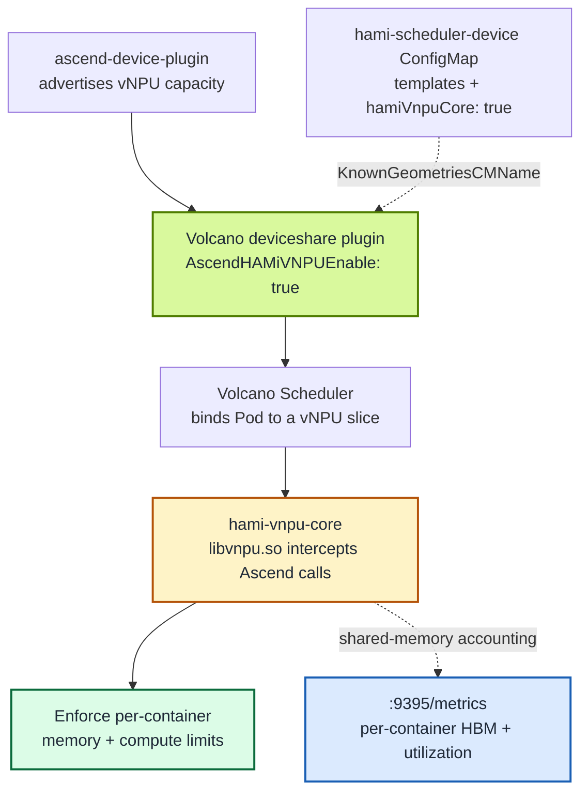

[Volcano](https://github.com/volcano-sh/volcano) is the batch scheduler of choice for many AI clusters, and HAMi-core is the runtime that makes shared accelerators behave. This post covers their intersection on Ascend hardware: running **`hami-vnpu-core` soft-sliced vNPUs under the Volcano scheduler**, so batch scheduling semantics (queues, gangs, binpack) and per-container isolation (memory and compute limits enforced at the Ascend API layer) work together.

We verified the full path on a single-node Kubernetes cluster running on an Ascend 310P3 aarch64 server: built the Volcano images from source, deployed the official [ascend-device-plugin](https://github.com/Project-HAMi/ascend-device-plugin) v1.4.0 image, and confirmed that a container requesting an 8192 MiB slice sees exactly that much memory, while a second Pod binpacks onto the same physical card with its own independent slice and the plugin's Prometheus endpoint reports both limits. The complete step-by-step procedure (including every command and captured output) is [Lab 13: Soft-Slicing Ascend 310P3 vNPU with Volcano and HAMi-core](/tutorials/labs/volcano-ascend-vnpu).

Because this topic mixes several concepts that are often conflated, the post first separates the layers: what a vNPU is, how hard and soft slicing differ, and what exactly the Volcano integration adds beyond the existing HAMi scheduler path.

:::note About the captured output

Every output block in this post was captured from a real run on a physical Ascend 310P3 server, verified as of the time of writing: a Kylin V10 aarch64 node with 2× Ascend 310P3 (driver/npu-smi 25.5.1), Kubernetes v1.28.15, and containerd 1.7.1. UUIDs, IPs, and Pod suffixes will differ in another cluster; compare the component names, placement, and measured values.

:::

<!-- truncate -->

## NPU, vNPU, hard slicing, soft slicing: keep the layers apart

vNPU, hard slicing, soft slicing, HAMi mode, and Volcano support sit at different layers, and mixing them together makes the whole thing look like one opaque feature. Each answers a different question:

| Layer | The question it answers |
| :-- | :-- |
| NPU / vNPU | Which device you get: a vNPU is a logical device carved out of a physical NPU |
| Hard / soft slicing | How that virtual device is isolated |
| HAMi-core | What enforces the soft-slicing quota inside the container |
| HAMi / Volcano | Who decides which Pod uses which card, and how much |

An NPU is the physical device, for example one Ascend 310P3 actually installed in the server; a vNPU is a logical device carved out of a physical NPU and handed to a container (one 21.5 GiB card can become an 8 GiB slice plus another 8 GiB slice, with about 5.5 GiB left over). The name "vNPU" describes the result, not the implementation: the slice can be carved by the Ascend driver's virtualization, or simulated in software by HAMi-core. This is the easiest point to misread in this topic: the "soft-sliced vNPU" in this post is a logical slice from the Kubernetes/HAMi perspective, not a hardware vNPU created with `npu-smi ... create-vnpu`.

**Hard slicing** is done by the Ascend driver/firmware virtualization, and you can only choose from predefined templates: `vir05_1c_16g`, for example, fixes a number of AI cores, AI CPUs, and 16 GiB of memory, and creating one produces a real vNPU instance at the device level. Query the templates your chip supports with `npu-smi info -t template-info`, and see Huawei's [hard-slicing practice guide](https://www.hiascend.com/developer/techArticles/20251212-1) for a full walkthrough.

**Soft slicing** creates no hardware vNPU: multiple containers share the same physical NPU, and each container gets `libvnpu.so` injected to intercept and account for the application's calls to the Ascend runtime API:

```text
application
  ↓ Ascend API call
libvnpu.so intercepts and accounts
  ↓ only the allocated memory and compute are allowed
Ascend driver
  ↓
physical NPU
```

With a quota of 8192 MiB, a device query inside the container reports only 8192 MiB, allocations are accounted by `libvnpu.so`, and over-quota requests are blocked by the interception layer. The [ascend-device-plugin README](https://github.com/Project-HAMi/ascend-device-plugin) documents both modes explicitly. The comparison:

|  | Hard slicing | Soft slicing |
| :-- | :-- | :-- |
| Isolation boundary | enforced by the device virtualization layer, stronger | software runtime interception, not an SR-IOV-class hardware boundary |
| Sizing | vendor templates only, for example 8 GiB or 16 GiB steps | arbitrary MiB and compute ratios |
| Partitioned units | AI cores, AI CPUs, memory, DVPP | memory and compute quotas |
| Requirements | chip and driver support for the templates | `libvnpu.so` injection and driver compatibility, currently ARM-only |

One analogy: hard slicing builds real walls inside the house; soft slicing keeps one shared house but puts a strict accountant and rate limiter at every door.

## Two ways Volcano can schedule Ascend vNPUs

There are **two different ways** Volcano can schedule Ascend virtual NPUs, and they are easy to confuse. Getting this right up front saves hours of debugging:

|  | MindCluster mode | HAMi mode |
| :-- | :-- | :-- |
| Volcano flag | `deviceshare.AscendMindClusterVNPUEnable` | `deviceshare.AscendHAMiVNPUEnable` |
| Provided by | Volcano's native Ascend plugin | [Project-HAMi/ascend-device-plugin](https://github.com/Project-HAMi/ascend-device-plugin) |
| Templates | `vir04_3c_ndvpp` (have a `dvpp` dimension) | `vir05_1c_16g` (fields `memory`/`aiCore`/`aiCPU` only) |
| Slicing modes | Driver templates (hard slicing) | Driver templates (hard slicing) by default, plus `hami-core` soft slicing when the Pod sets `huawei.com/vnpu-mode: hami-core` |
| Resource names | `huawei.com/npu-core` | `huawei.com/Ascend310P`, `-memory` |

This post is about **HAMi mode** with **`hami-vnpu-core` soft slicing**. Note that HAMi mode is not the same thing as soft-slicing mode: the same ascend-device-plugin supports both template-based hard slicing and hami-vnpu-core soft slicing, and the Pod's annotation selects the path. The lab's Pods set the annotation, so they take the soft path, which is the only one of the two Volcano modes that does runtime interception: instead of pre-cutting the card into fixed virtualization templates, HAMi-core intercepts Ascend calls in user space and enforces per-container memory and compute limits at runtime. Volcano decides which Pod gets which slice; HAMi-core makes that decision stick.

## What the Volcano integration actually adds

First, the naming: **HAMi-core** is the umbrella name for this family of in-container runtime isolation, and it originally referred to `libvgpu.so` on NVIDIA GPUs; **hami-vnpu-core** is the Ascend implementation, and what it actually injects is `libvnpu.so`.

Ascend soft slicing itself is not new. The support landed in April 2026 ([ascend-device-plugin integrated hami-vnpu-core](https://github.com/Project-HAMi/ascend-device-plugin/pull/61), [HAMi added the Ascend ResourceCoreName and soft-slicing scheduling support](https://github.com/Project-HAMi/HAMi/pull/1771)), and through HAMi 2.9 the flow already works: the HAMi scheduler allocates Ascend slices, `ascend-device-plugin` mounts the devices, and `hami-vnpu-core` enforces the memory and compute limits in the container.

What the Volcano integration in the upcoming HAMi 2.10 adds is the allocator: it swaps the HAMi scheduler for Volcano, while the layers below are reused as they are.

```text
HAMi 2.9:
HAMi Scheduler → ascend-device-plugin → hami-vnpu-core → NPU

HAMi 2.10 / Volcano integration:
Volcano Scheduler → ascend-device-plugin → hami-vnpu-core → NPU
```

| Layer | HAMi 2.9 path | Volcano integration path |
| :-- | :-- | :-- |
| Scheduler | HAMi Scheduler | Volcano Scheduler |
| Device discovery and mounting | ascend-device-plugin | the same ascend-device-plugin |
| Soft-slicing enforcement | hami-vnpu-core (`libvnpu.so`) | the same hami-vnpu-core |
| Memory and compute isolation | already supported | reused |
| Queues, gang scheduling | not the focus | provided by Volcano |
| binpack / spread | HAMi policy | Volcano deviceshare policy |
| Monitoring and mixed soft/hard management | early stage | further completed in 2.10 |

Volcano can now understand these HAMi Ascend resources and decide which Pod uses which physical NPU, whether several Pods binpack onto the same card, whether a group of training Pods meets its gang condition, and which queue, priority, and preemption policy applies. The precise statement is therefore: **the Volcano integration completes scheduling of Ascend HAMi-core soft-sliced resources under Volcano, together with monitoring and mixed soft/hard management; the Ascend soft-slicing capability itself existed before.**

## How the integration works

The path has three responsibilities:

- **Volcano's `deviceshare` plugin** reads the vNPU geometries from the `hami-scheduler-device` ConfigMap (with `AscendHAMiVNPUEnable: "true"`) and, together with the `binpack` or `spread` policy, decides which node and card serves each Pod.
- **The `ascend-device-plugin` DaemonSet** registers `huawei.com/Ascend310P` (card count) and `huawei.com/Ascend310P-memory` (MiB) as extended resources, and copies the HAMi-core assets (`libvnpu.so` and `ld.so.preload`) onto the host at `/usr/local/hami-vnpu-core/`.
- **HAMi-core (`libvnpu.so`)** is injected into workload containers through Ascend Docker Runtime's preload mechanism and enforces the slice the scheduler chose.



The Pod contract is minimal: `schedulerName: volcano`, `runtimeClassName: ascend`, the annotation `huawei.com/vnpu-mode: hami-core`, and limits on the two extended resources. Without the annotation, the Pod falls back to the template-based path and can stay Pending on a soft-slicing node.

The [hami-vnpu-core](https://github.com/Project-HAMi/hami-vnpu-core) library is preloaded via `/etc/ld.so.preload` inside the container, communicates through a shared-memory region at `/hami-shared-region`, and receives the enforced quota through environment variables such as `NPU_MEM_QUOTA`.

## The basic procedure

Everything ran on a single-node Kubernetes 1.28 cluster on the Ascend 310P3 server. Lab 13 carries every command and captured output; the essential steps:

1. **Prepare the node.** Driver/npu-smi ≥ 25.5, ascend-docker-runtime installed, and the node labeled `ascend=on`.
2. **Install Volcano ≥ 1.16.** Soft slicing requires 1.16, and no stable 1.16 existed at the time of writing (latest stable: v1.15.1, plus a `1.16.0-alpha.1` chart), so the verification built Volcano master (`7d9504320`) from source as Lab 13 shows. Once a stable release ships, install it directly with Helm and skip the compile:

   ```bash
   helm repo add volcano-sh https://volcano-sh.github.io/helm-charts
   helm install volcano volcano-sh/volcano \
     --namespace volcano-system --create-namespace \
     --version 1.16.0
   ```

3. **Enable HAMi-mode deviceshare.** Override `volcano-scheduler-configmap` so the `deviceshare` plugin runs with `AscendHAMiVNPUEnable: "true"`, `SchedulePolicy: binpack`, and `KnownGeometriesCMName: hami-scheduler-device`, then restart the scheduler.
4. **Deploy the plugin in soft-slicing mode.** Apply the `ascend` RuntimeClass, set `hamiVnpuCore: true` in the `hami-scheduler-device` ConfigMap plus `hami-vnpu-core: true` for the node in `hami-device-node-config`, and apply the DaemonSet. The node then advertises `huawei.com/Ascend310P` and `huawei.com/Ascend310P-memory`.
5. **Run a soft-sliced Pod.** `schedulerName: volcano`, `runtimeClassName: ascend`, the `huawei.com/vnpu-mode: hami-core` annotation, and limits of one card plus 8192 MiB of memory.
6. **Verify.** `npu-smi info` inside the Pod shows the slice rather than the card, a second Pod binpacks onto the same physical card, and the plugin's `:9395` endpoint exports per-container metrics.

## What we verified

The host reported two healthy 310P3 cards:

```text
$ npu-smi info
+--------------------------------------------------------------------------------------------------------+
| npu-smi 25.5.1                                   Version: 25.5.1                                       |
+-------------------------------+-----------------+------------------------------------------------------+
| NPU     Name                  | Health          | Power(W)     Temp(C)           Hugepages-Usage(page) |
| Chip    Device                | Bus-Id          | AICore(%)    Memory-Usage(MB)                        |
+===============================+=================+======================================================+
| 4       310P3                 | OK              | NA           37                0     / 0             |
| 0       0                     | 0000:81:00.0    | 0            1848 / 21525                            |
+===============================+=================+======================================================+
| 5       310P3                 | OK              | NA           40                0     / 0             |
| 0       1                     | 0000:85:00.0    | 0            1849 / 21525                            |
+===============================+=================+======================================================+
```

With the plugin registered, the node advertised 14 vNPUs (2 cards × 7, matching `vDeviceCount: 7`) and 43054 MiB of allocatable memory. The memory figure follows the chip config (`memoryAllocatable: 21527` MB per card), which sits 2 MiB per card above the 21525 MB `npu-smi` displays. Each test Pod requested one vNPU with an 8192 MiB slice:

```yaml
resources:
  limits:
    huawei.com/Ascend310P: "1"
    huawei.com/Ascend310P-memory: "8192"
```

### 1. The container sees only its slice

Inside the first Pod, `npu-smi info` reported a **0 / 8192 MB** device, not the 1848 / 21525 MB the host sees on the same card:

```text
$ kubectl exec ascend-vnpu-check -- npu-smi info
[INFO limiter::supervisor] [Supervisor PID:10] won manager election
[INFO limiter::manager] [Manager] Registered as Global Manager #0 (PID: 10). Compute limit: 1, Memory limit: 8192, FixedShare: false
open global registry path is "/hami-shared-region/0_global_registry"
...
| 32768   310P3                 | OK              | NA           38                0     / 0             |
| 0       0                     | 0000:81:00.0    | 0            0    / 8192                             |
```

`libvnpu.so` had rewritten the device query to the container's quota, and the injected environment confirmed the wiring: `NPU_MEM_QUOTA=8192`, `NPU_GLOBAL_SHM_PATH=/hami-shared-region/0_global_registry`, `ASCEND_VISIBLE_DEVICES=0`.

### 2. binpack shares one physical card between Pods

A second, identical Pod landed on the **same Bus-Id `0000:81:00.0`**, each with its own 8192 MiB window, and registered as `Global Manager #1` in the same shared registry as Pod 1's `#0`:

```text
$ kubectl exec ascend-vnpu-check-2 -- npu-smi info | grep -E "Memory limit|0000"
[INFO limiter::manager] [Manager] Registered as Global Manager #1 (PID: 10). Compute limit: 1, Memory limit: 8192, FixedShare: false
| 0       0                     | 0000:81:00.0    | 0            0    / 8192                             |
```

The node's allocated resources told the same story: `huawei.com/Ascend310P 2` (of 14) and `huawei.com/Ascend310P-memory 16384` (of 43054), two 8192 MiB slices packed onto one 21.5 GiB card instead of spread across two.

### 3. Per-container metrics are exported

The plugin (not the workload Pod) serves Prometheus metrics on `:9395`:

```text
hami_vgpu_memory_limit_bytes{container="npu",...,pod="ascend-vnpu-check",vdevice_index="0"} 8.589934592e+09
hami_vgpu_memory_limit_bytes{container="npu",...,pod="ascend-vnpu-check-2",vdevice_index="0"} 8.589934592e+09
hami_host_gpu_memory_used_bytes{device_index="0",device_type="Ascend-Atlas 300I Pro",...} 1.937768448e+09
```

`8.589934592e+09` bytes is exactly 8192 MiB, matching both Pods' requests, and both vdevices carry the same physical-card UUID. The endpoint also exports `hami_vgpu_memory_used_bytes`, `hami_container_device_utilization_ratio`, and `hami_host_gpu_utilization_ratio`.

## Results

| Verification | Result | Evidence |
| :-- | :-- | :-- |
| Volcano source build (aarch64) | Pass | 3 images, scheduler `--version` reports commit `7d950432...` |
| Plugin image with matching libvnpu | Pass | `libvnpu.so` asset verified against the release matching driver 25.5.1 |
| Volcano + HAMi-mode deviceshare | Pass | scheduler log loads `AscendHAMiVNPUEnable: "true"` |
| Node resource registration | Pass | `Ascend310P: 14`, `Ascend310P-memory: 43054` |
| Memory slice isolation | Pass | container `0 / 8192` vs host `1848 / 21525` |
| binpack card sharing | Pass | both Pods on Bus-Id `0000:81:00.0`, `Global Manager #0/#1` |
| Resource accounting | Pass | node allocated 2 vNPU, 16384 MiB |
| Monitoring | Pass | `:9395` exports host/container/vdevice metrics |

## Gotchas worth knowing before you try

- **`libvnpu.so` must match the NPU driver.** A mismatch does not produce an error; in-container `npu-smi` just hangs at `Initialize SchedulerClient...`. Copy the asset from the official image release that matches your driver and verify the md5.
- **Docker and containerd have separate image stores.** Import with `ctr -n k8s.io images import` or expect `ErrImageNeverPull`.
- **The Helm key is `basic.image_pull_policy`** (underscore), not `scheduler.imagePullPolicy`. With the wrong key, nodes try to pull images that only exist locally.
- **The `-core` resource is not registered in v1.4.0.** A Pod spec only needs `huawei.com/Ascend310P` (count) and `huawei.com/Ascend310P-memory` (MiB); the `resourceCoreName` entry in the config is not reported as a node resource.
- **Metrics live on the plugin Pod.** Curling `:9395` from the workload Pod returns nothing; select the DaemonSet Pod by label.
- **Uninstalling Volcano can leave `volcano-system` Terminating** after the webhooks are gone. Clearing the namespace finalizer unblocks it.

Soft slicing here is runtime API-level enforcement (software interception via `libvnpu.so`), not an SR-IOV-style hardware security boundary, which is the same caveat that applies to HAMi-core on GPUs.

## Next steps

- Full procedure with every command and captured output: [Lab 13: Soft-Slicing Ascend 310P3 vNPU with Volcano and HAMi-core](/tutorials/labs/volcano-ascend-vnpu)
- User guide: [Huawei Ascend devices in Volcano](/docs/installation/how-to-use-volcano-ascend) and [Enable Ascend sharing](/docs/userguide/ascend-device/enable-ascend-sharing)
- Hard slicing on Ascend: [NPU virtualization hard-slicing practice (Huawei)](https://www.hiascend.com/developer/techArticles/20251212-1)
- Components: [Project-HAMi/ascend-device-plugin](https://github.com/Project-HAMi/ascend-device-plugin) · [Project-HAMi/hami-vnpu-core](https://github.com/Project-HAMi/hami-vnpu-core) · [volcano-sh/volcano](https://github.com/volcano-sh/volcano)
- Related: [Lab 8: Volcano vGPU with Gang Scheduling and Queues](/tutorials/labs/volcano-vgpu-gang-queue) applies the same scheduler to NVIDIA GPUs
