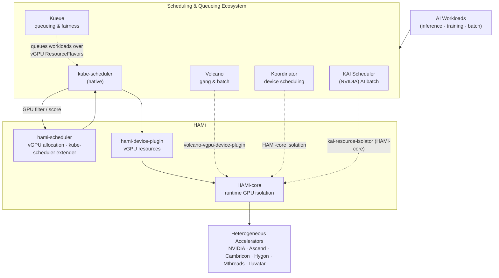

HAMi doesn't replace your Kubernetes scheduler. It extends it. HAMi handles GPU virtualization, sharing, and runtime isolation, and it slots into the wider Kubernetes scheduling world so you can pair **GPU sharing** with **batch scheduling, job queuing, and colocation**.

This page shows how HAMi works alongside the default scheduler and four ecosystem partners: **Volcano**, **Kueue**, **Koordinator**, and NVIDIA's **KAI Scheduler**.

## How HAMi integrates

HAMi exposes three roles that partners can mix and match:

- **hami-scheduler** registers as a `kube-scheduler` extender and owns vGPU allocation decisions, like memory partitioning, compute limits, and binpack or spread strategies.
- **hami-device-plugin** registers vGPU resources with `kubelet` and mounts the devices when a Pod is created.
- **HAMi-core (`libvgpu.so`)** intercepts CUDA, DCU, and similar calls inside the container to enforce hard isolation and resource limits at runtime.

Which path a partner takes depends on the layer it owns. Some call into the scheduler extender, others reuse HAMi-core directly for node-side isolation.

## Integration partners

### Native (default)

Out of the box, `kube-scheduler` delegates GPU filtering and scoring to `hami-scheduler`, while `hami-device-plugin` and HAMi-core handle sharing and isolation. That covers single-task, independent scheduling, which is just right for **online inference**. No extra scheduler is needed.

### Volcano for gang and batch scheduling

[Volcano](https://github.com/volcano-sh/volcano) adds gang scheduling, where every Pod in a job starts together or none of them do, plus multi-level queue priorities and fair-share. Those are the batch capabilities **AI training** needs. HAMi connects through the [`volcano-vgpu-device-plugin`](https://github.com/Project-HAMi/volcano-vgpu-device-plugin), so Volcano schedules HAMi-managed vGPUs while HAMi-core keeps doing the GPU isolation.

- Install: [Use Volcano vGPU](../installation/how-to-use-volcano-vgpu.md)
- Guide and examples: [Volcano vGPU (NVIDIA GPU)](../userguide/volcano-vgpu/nvidia-gpu/how-to-use-volcano-vgpu.md)

### Kueue for job queuing and fairness

[Kueue](https://kueue.sigs.k8s.io/) sits above the default scheduler and manages job admission, fairness, and quotas through `ResourceFlavor` and `ClusterQueue`. HAMi's vGPU resources show up as schedulable flavors that Kueue can queue and admit. That gives you **cohort fairness and quota enforcement** on top of GPU sharing, all without replacing `kube-scheduler`.

- Guide: [Using HAMi with Kueue](../userguide/kueue/how-to-use-kueue.md)
- Upstream integration doc: [Running HAMi workloads in Kueue](https://kueue.sigs.k8s.io/docs/tasks/run/using_hami/)

### Koordinator for device scheduling and colocation

[Koordinator](https://koordinator.sh/) does fine-grained device scheduling and CPU/GPU colocation. Deploy HAMi-core on the nodes, set the right labels and resource requests, and Koordinator will use HAMi's GPU isolation so **multiple Pods can share one GPU**. The broader scheduling and colocation decisions stay with Koordinator.

- Upstream integration doc: [Sharing a GPU with HAMi in Koordinator](https://koordinator.sh/docs/user-manuals/device-scheduling-gpu-share-with-hami/)

### KAI Scheduler, NVIDIA's AI batch scheduler

[KAI Scheduler](https://github.com/kai-scheduler/KAI-Scheduler) is NVIDIA's open-source, Kubernetes-native scheduler for AI workloads. It grew out of Run:ai, ships under Apache 2.0, and is a CNCF Sandbox project. It brings **PodGroup gang scheduling**, **hierarchical fair queues**, **fractional GPU sharing**, **topology-aware placement**, and **elastic workloads**. These are the things AI training needs that the default scheduler doesn't offer.

Here's the catch, though. KAI's fractional GPU sharing is *cooperative*: the scheduler keeps the sum of requests within a card, but it doesn't physically stop a Pod from using more memory than it asked for. A container that requests 2 GiB can still see the whole GPU through `nvidia-smi`. In a multi-tenant production cluster, that's the gap that bites you.

HAMi-core fills it. **KAI Scheduler does the scheduling, HAMi-core does the isolation.** The integration uses HAMi-core directly rather than the full HAMi platform, so KAI keeps its own scheduler. Turn on the `hamicore` plugin in KAI Scheduler to inject `CUDA_DEVICE_MEMORY_LIMIT`, then deploy [`kai-resource-isolator`](https://github.com/Project-HAMi/KAI-resource-isolator). It's a HAMi project component that ships HAMi-core to each node through a DaemonSet and uses a MutatingWebhook to inject the library and `ld.so.preload`. At runtime `libvgpu.so` enforces the memory cap, so `nvidia-smi` shows only the slice you allocated.

- Upstream guide: [HAMi resource isolation in KAI Scheduler](https://github.com/kai-scheduler/KAI-Scheduler/blob/main/docs/gpu-sharing/hami/README.md)
- Isolator component: [kai-resource-isolator](https://github.com/Project-HAMi/KAI-resource-isolator)

## Choosing an integration

| Workload pattern | Recommended partner | What it adds on top of HAMi |
| --- | --- | --- |
| Online inference, independent tasks | Native (`kube-scheduler` + HAMi) | Nothing extra needed |
| Distributed training, all-or-nothing startup | Volcano | Gang scheduling, batch queues, multi-level priority |
| Shared cluster, many teams, quotas | Kueue | Job queueing, fairness, cohort quotas |
| Mixed CPU/GPU colocation, fine-grained device scheduling | Koordinator | Colocation, device-aware scheduling |
| NVIDIA stacks, gang-scheduled training or batch needing hard isolation | KAI Scheduler | NVIDIA-native gang scheduling, fair queues, fractional GPU, plus HAMi-core hard isolation |

> HAMi's own two-level `nvidia.com/priority` is a **runtime** preemption mechanism scoped to a single GPU. If you need **scheduling-level** multi-level priority across a queue of jobs, combine HAMi with one of the partners above. See the [FAQ](../faq/faq.md) for details.
