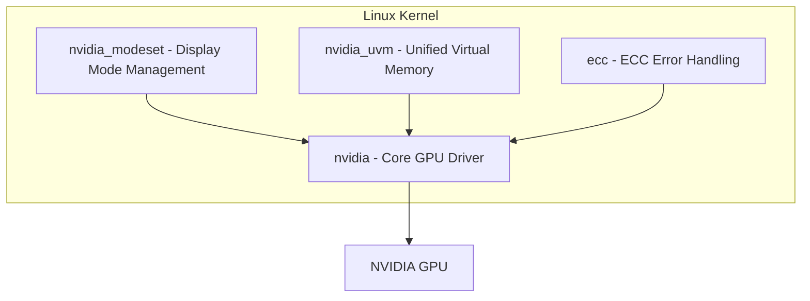
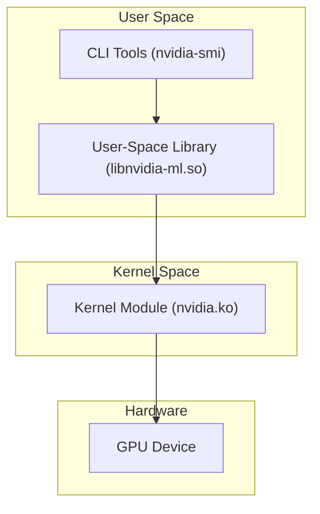

Before using a GPU, you first need to verify that the GPU driver is properly loaded into the kernel. This document explains how to check GPU driver status and understand the architecture of NVIDIA kernel modules.

## Checking GPU Driver Status

Use the following command to check whether the NVIDIA kernel module is loaded:

```bash
lsmod | grep nvidia
```

Example output:

```plaintext
nvidia_uvm           1589299  0
nvidia_modeset       1240365  0
nvidia_drm             81923  0
nvidia              62372776  19 nvidia_uvm,nvidia_modeset
ecc                   45056  0
```

Each line represents a loaded kernel module. The columns are: module name, memory size (bytes), usage count, and dependent modules.

## NVIDIA Kernel Module Hierarchy

The NVIDIA driver consists of multiple kernel modules with dependencies between them:



### Module Descriptions

| Module | File | Description |
| --- | --- | --- |
| **nvidia** | `nvidia.ko` | The core GPU driver module, responsible for GPU hardware initialization, video memory management, command queue scheduling, and other fundamental functions. All other NVIDIA modules depend on it. |
| **nvidia_uvm** | `nvidia_uvm.ko` | Unified Virtual Memory, enabling CPU and GPU to share the same address space. CUDA programs using `cudaMallocManaged` depend on this module, which automatically migrates data between CPU and GPU. |
| **nvidia_modeset** | `nvidia_modeset.ko` | Display mode setting module, responsible for managing display output (resolution, refresh rate, etc.). Depends on `nvidia_drm` (DRM subsystem interface) to function. |
| **ecc** | `ecc.ko` | ECC (Error-Correcting Code) error handling module, used for memory error detection and correction on data center GPUs (such as A100, H100). Consumer-grade GPUs typically do not load this module. |

## Linux Driver Architecture

GPU drivers follow the standard Linux layered architecture: user space communicates with kernel space modules through libraries, which ultimately operate the hardware.



Call chain:

1. User runs a CLI tool such as `nvidia-smi`
2. The CLI tool calls the user-space library `libnvidia-ml.so` (NVIDIA Management Library)
3. The user-space library enters kernel space via the `ioctl` system call
4. The kernel module `nvidia.ko` directly operates the GPU hardware

## Why lsmod Is More Fundamental Than nvidia-smi

`nvidia-smi` is a user-space tool that requires both the user-space library and kernel module to be functioning properly. In contrast, `lsmod | grep nvidia` directly checks whether the kernel module is loaded, making it a lower-level diagnostic approach:

- If `lsmod` does not show the nvidia module, the driver is not installed or the kernel module is not loaded, and `nvidia-smi` will inevitably fail
- If `lsmod` shows the nvidia module but `nvidia-smi` reports an error, the problem is at the user-space library or permission level

Therefore, when troubleshooting GPU issues, it is recommended to start with `lsmod | grep nvidia` to confirm the kernel module status, and then use `nvidia-smi` to check whether user space is functioning normally.
