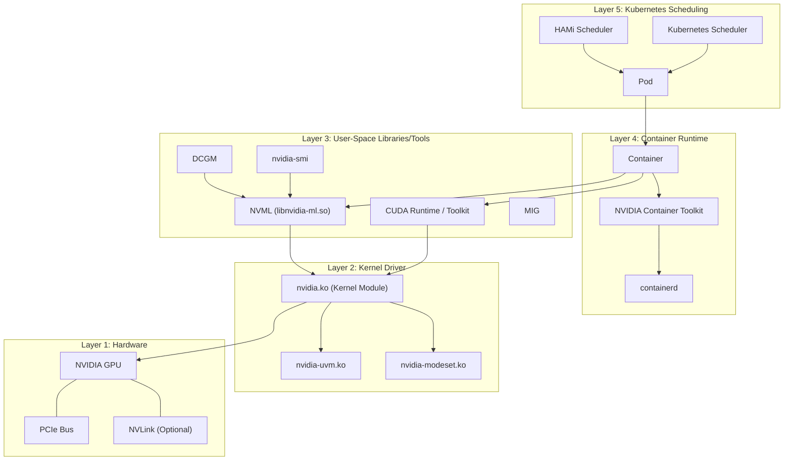
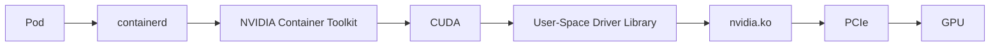
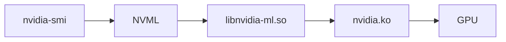
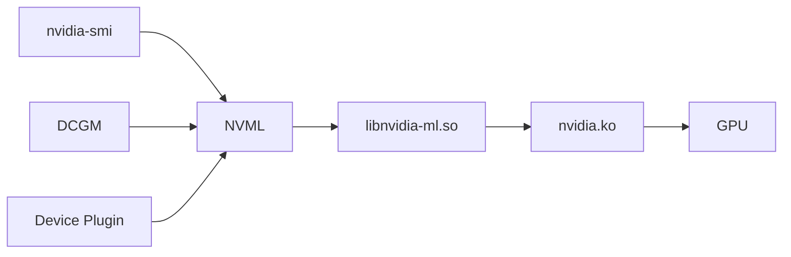
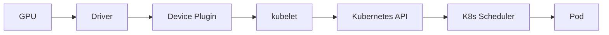
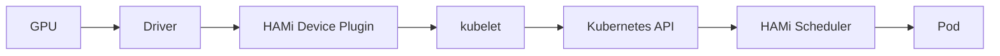

When you use a GPU on a server, you are not dealing with a single piece of software or hardware. Instead, you are working with an entire **software stack** built around NVIDIA GPUs. From the lowest-level physical hardware to the highest-level Kubernetes scheduling, it can be roughly divided into 5 layers:

> **Hardware Layer** → **Linux Kernel Driver Layer** → **User-Space Libraries/Tools Layer** → **Container Runtime Layer** → **Kubernetes / HAMi Scheduling Layer**

Understanding this layered structure is the foundation for troubleshooting GPU issues and understanding how HAMi works.

## 5-Layer Architecture Overview

The diagram below illustrates the complete layered structure of the GPU software stack:

## Layer Details

### Layer 1: Hardware

The physical hardware is the foundation of everything:

- **GPU**: NVIDIA GPU chips (such as A100, H100, L40, etc.), responsible for parallel computing.
- **PCIe Bus**: GPUs communicate with the CPU through PCIe slots, serving as the primary data transfer channel.
- **NVLink** (optional): A high-speed interconnect between multiple GPUs, offering far greater bandwidth than PCIe.

### Layer 2: Linux Kernel Driver

The kernel driver is the bridge between user-space programs and the GPU:

- **nvidia.ko**: The core NVIDIA kernel module that manages GPU hardware resources, video memory allocation, and command submission.
- **nvidia-uvm.ko**: The Unified Virtual Memory module, enabling transparent sharing of memory address spaces between the CPU and GPU.
- **nvidia-modeset.ko**: The display mode setting module, used for GPU graphics output management.

The kernel driver exposes `/dev/nvidia*` device nodes upward, through which user-space programs interact with the GPU.

### Layer 3: User-Space Libraries/Tools

This layer contains the tools and libraries that developers and administrators interact with most frequently:

- **CUDA**: NVIDIA's parallel computing platform and programming model, including the compiler (nvcc), runtime libraries, and development tools. Nearly all GPU applications access the GPU through CUDA.
- **NVML (NVIDIA Management Library)**: The GPU management library (`libnvidia-ml.so`), providing APIs for querying GPU status (temperature, video memory, utilization, etc.). Tools such as `nvidia-smi` and DCGM all depend on it.
- **nvidia-smi**: A command-line management tool for viewing GPU status, processes, video memory usage, and more. It is the CLI front-end for NVML.
- **DCGM (Data Center GPU Manager)**: A data center GPU management tool providing health monitoring, diagnostics, group management, and other capabilities, suitable for large-scale GPU clusters.
- **MIG (Multi-Instance GPU)**: Multi-Instance GPU technology that physically partitions a single A100/H100 into multiple isolated GPU instances, each with its own dedicated video memory and compute cores.

### Layer 4: Container Runtime

To make GPUs usable within containers, additional runtime components are required:

- **containerd**: The container runtime responsible for image management and container lifecycle management. Kubernetes uses containerd by default.
- **NVIDIA Container Toolkit** (formerly nvidia-docker2): Automatically mounts GPU device nodes, CUDA libraries, and NVIDIA driver libraries into the container at startup. It is the key bridge enabling containers to use GPUs.
- **Container**: A running application container that gains GPU access through the Toolkit.

### Layer 5: Kubernetes / HAMi Scheduling

Managing GPUs in a Kubernetes cluster requires:

- **NVIDIA Device Plugin**: A Kubernetes device plugin that reports GPU resources on the node to kubelet, enabling Kubernetes to be aware of GPUs and schedule GPU workloads.
- **GPU Operator**: A Kubernetes Operator provided by NVIDIA that automates the deployment and management of drivers, Container Toolkit, Device Plugin, DCGM, and other components.
- **HAMi Device Plugin**: HAMi's device plugin, supporting fine-grained partitioning and sharing of GPU memory and compute resources.
- **HAMi Scheduler**: HAMi's scheduler extension, supporting advanced scheduling policies such as Binpack/Spread, priorities, and targeted GPU card scheduling.

## Key Call Chains

Understanding the key call chains within the GPU software stack helps with troubleshooting and understanding the relationships between components.

### Complete Dependency Chain

From creation to execution, a GPU-using Pod goes through the following dependency chain:

### nvidia-smi Call Chain

The complete path for `nvidia-smi` to query GPU information:

### Management Tool Call Chain

Multiple management tools all access the GPU through NVML:

As you can see, whether it is a command-line tool, a monitoring component, or a Kubernetes device plugin, they all ultimately access the hardware through the NVML -> kernel driver -> GPU path.

### Kubernetes GPU Scheduling Chain

In Kubernetes, the flow of GPU resources from hardware to Pod:

### HAMi Enhanced Scheduling Chain

Building on the native scheduling chain, HAMi replaces the Device Plugin and Scheduler to implement GPU partitioning and sharing:

## Component Quick Reference

| Component | Summary |
| --- | --- |
| **GPU** | NVIDIA GPU hardware, executes parallel computing tasks |
| **PCIe** | Bus connecting the GPU and CPU, responsible for data transfer |
| **nvidia.ko** | NVIDIA kernel module, manages GPU hardware resources and exposes device nodes |
| **nvidia-smi** | Command-line tool for viewing GPU status, video memory, processes, and more |
| **NVML** | NVIDIA Management Library, a C-language API for GPU management |
| **libnvidia-ml.so** | NVML shared library implementation; all management tools communicate with the driver through it |
| **CUDA** | NVIDIA parallel computing platform, the core programming and runtime framework for GPU applications |
| **MIG** | Multi-Instance GPU, physically partitions a single GPU into multiple isolated instances |
| **DCGM** | Data Center GPU Manager, providing monitoring, diagnostics, and health checks |
| **containerd** | Container runtime, manages container images and lifecycle |
| **NVIDIA Container Toolkit** | Container GPU support, automatically mounts GPU devices and libraries into containers at startup |
| **Device Plugin** | Kubernetes device plugin, reports node GPU resource information to the cluster |
| **GPU Operator** | NVIDIA Operator, automates deployment and management of the full GPU software stack |
| **HAMi** | GPU virtualization middleware, supporting fine-grained partitioning and sharing of memory and compute |
| **HAMi Device Plugin** | HAMi's device plugin, replaces the native Device Plugin and supports GPU partition reporting |
