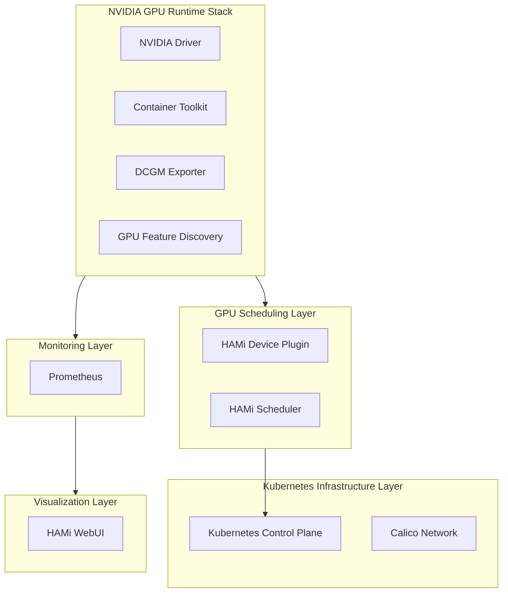
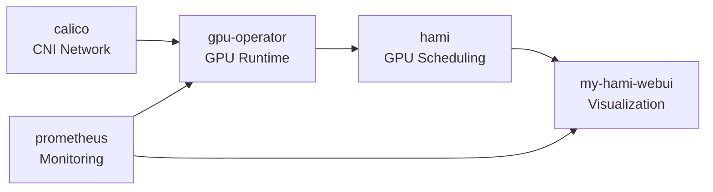
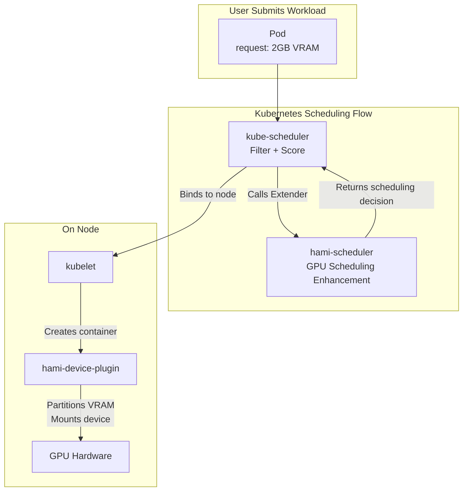
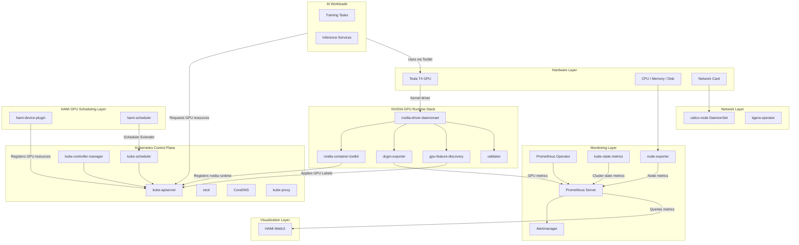
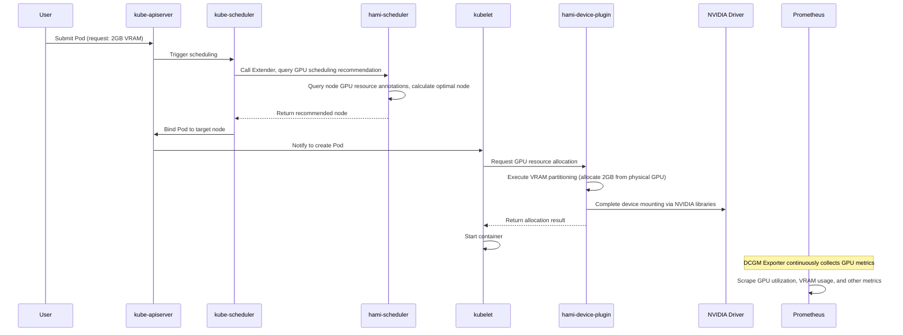

After completing the HAMi installation, the cluster is no longer an ordinary Kubernetes cluster, it becomes an AI infrastructure platform with GPU virtualization capabilities. This document breaks down the responsibilities and dependencies of every layer and every component in the cluster after installation.

## 5-Layer Architecture Overview

The cluster after installation consists of 5 layers, each providing services to the layer above:



Looking from bottom to top:

| Layer | Role | Analogy |
|-------|------|---------|
| Kubernetes Infrastructure Layer | Container orchestration, network communication, resource management | Operating system |
| NVIDIA GPU Runtime Stack | Enables containers to access GPU hardware | GPU driver |
| GPU Scheduling Layer | GPU resource partitioning, sharing, and scheduling decisions | Resource manager |
| Monitoring Layer | Collects and stores metrics from all components | Monitoring system |
| Visualization Layer | Visual management interface for GPU resources | Dashboard |

The relationship between these 5 layers is a strict dependency: **upper layers depend on lower layers, but lower layers do not depend on upper layers**. For example, HAMi Scheduler needs Kubernetes to provide scheduling framework extension points, but Kubernetes itself does not care about HAMi's existence.

---

## Helm Releases

Multiple Releases are deployed through Helm during installation. What is a Helm Release? You can think of it as a **running instance of an application package**, similar to how `apt install` installs a software package, or `docker compose up` starts a set of services. Each Release contains a set of Kubernetes resources (Pods, Services, ConfigMaps, etc.) that can be installed, upgraded, and uninstalled together.

Run `helm list -A` to see all Releases:

```text
NAMESPACE      NAME                        CHART                              STATUS
gpu-operator   gpu-operator-xxxxxxxxxx     gpu-operator-v25.3.0               deployed
kube-system    hami                        hami-2.9.0                         deployed
monitoring     prometheus                  kube-prometheus-stack-75.15.1      deployed
kube-system    my-hami-webui               hami-webui-x.x.x                   deployed
```

### Responsibilities of Each Release

| Release | Namespace | Responsibility | Installation Timing |
|---------|-----------|----------------|---------------------|
| **gpu-operator** | gpu-operator | Automated management of the NVIDIA GPU software stack, automatically deploys drivers, toolkits, and metrics collectors | After Prometheus installation |
| **hami** | kube-system | GPU virtualization and scheduling enhancement, supports VRAM partitioning and multi-Pod GPU sharing | After GPU Operator installation |
| **prometheus** | monitoring | Cluster monitoring, collects and stores metrics data from all components | After K8s installation, the first monitoring component installed |
| **my-hami-webui** | kube-system | GPU resource visualization interface, displays GPU usage and scheduling status | After HAMi installation (optional) |

> The CNI plugin (Calico) does not appear in `helm list` because it is installed via `kubectl create` with the tigera-operator manifests, not through Helm.

The installation order has dependency relationships:



Prometheus must be installed before GPU Operator and HAMi WebUI because they both depend on Prometheus for metrics collection and data provision.

---

## Pod Details

After installation, a large number of Pods are running in the cluster. Running `kubectl get pods -A` will show output similar to the following. This section explains the role of each Pod by category.

### K8s Core Components

These are Kubernetes control plane components, created by kubeadm during cluster initialization.

| Pod | Role |
|-----|------|
| **kube-apiserver** | Kubernetes API entry point; all components (kubectl, scheduler, controller-manager) communicate through it |
| **kube-scheduler** | Determines which node a Pod runs on; HAMi Scheduler participates as an extension |
| **kube-controller-manager** | Runs various controllers (Deployment, ReplicaSet, Node, etc.) to maintain the cluster's desired state |
| **etcd** | Distributed key-value store, stores all cluster state data (Pods, Services, ConfigMaps, etc.) |
| **kube-proxy** | Runs on each Node, maintains Service network forwarding rules (iptables/IPVS) |
| **coredns** | In-cluster DNS service, provides name resolution for Services |

**Without them**: The entire Kubernetes cluster cannot run. kube-apiserver is the only component that can directly operate etcd. If it goes down, the entire control plane is paralyzed.

**Significance for AI Infrastructure**: Kubernetes is the orchestration foundation for GPU workloads. Without K8s, GPU tasks can only be manually assigned to machines, making automatic scheduling, elastic scaling, and fault recovery impossible.

### Network Components

Created by the Calico manifests (tigera-operator).

| Pod | Role |
|-----|------|
| **tigera-operator** | Deployment, manages Calico's lifecycle; watches the `Installation` resource and deploys or reconciles all Calico components |
| **calico-node** | DaemonSet, one per node, responsible for Pod-to-Pod network connectivity, IP address management, routing, and network policy enforcement |
| **calico-kube-controllers** | Deployment, runs Calico's control plane logic (policy, namespace, and endpoint synchronization, IPAM garbage collection) |
| **calico-typha** | Deployment, aggregates datastore watch connections so large clusters do not overload the Kubernetes API |
| **csi-node-driver** | DaemonSet, Calico's CSI driver, mounts per-Pod volumes used by advanced policy features |

**Without them**: Pods cannot communicate with each other. Kubernetes' Service mechanism completely fails, DNS resolution does not work, and cross-Pod distributed training cannot proceed.

**Significance for AI Infrastructure**: AI training often involves distributed workloads (multi-Pod collaborative training), and network performance directly affects training efficiency. Calico provides high-performance routing (BGP/VXLAN) and NetworkPolicy enforcement to keep workloads isolated from each other.

### NVIDIA GPU Runtime Stack

Created by the gpu-operator Helm Release. The core problem this layer solves is: **enabling containers to access GPU hardware**.

| Pod | Role |
|-----|------|
| **nvidia-driver-daemonset** | DaemonSet, installs the NVIDIA kernel driver on each GPU node. It manages the driver in a containerized manner, avoiding the tedious process of manually compiling and installing drivers on the host |
| **nvidia-container-toolkit-daemonset** | DaemonSet, configures containerd on each node so it knows how to mount GPU devices and libraries into containers. Modifies containerd configuration to register the `nvidia` runtime |
| **gpu-feature-discovery** | DaemonSet, detects the GPU model, VRAM, computing power, and other information on the local node, and writes them as Labels and Annotations to the Node object for scheduler decision-making |
| **nvidia-dcgm-exporter** | DaemonSet, collects GPU utilization, VRAM usage, temperature, power consumption, and other metrics through DCGM (Data Center GPU Manager), exposing them in Prometheus format |
| **nvidia-operator-validator** | DaemonSet, validates whether the GPU software stack is functioning properly (driver loaded, Toolkit configured, node ready) |
| **nvidia-cuda-validator** | Job, runs once and exits, verifies that the CUDA runtime is available |

**Without them**:

- Without **nvidia-driver-daemonset**: The GPU hardware cannot be recognized by the operating system, the `nvidia-smi` command does not exist
- Without **nvidia-container-toolkit-daemonset**: GPUs cannot be used inside containers; even if the driver is installed, running `nvidia-smi` in a Pod will result in an error
- Without **gpu-feature-discovery**: The scheduler does not know what GPUs the nodes have, and cannot make scheduling decisions based on GPU model or VRAM
- Without **nvidia-dcgm-exporter**: Prometheus has no GPU metrics data, making it impossible to monitor GPU utilization
- Without **validator**: There is no way to automatically detect GPU software stack installation issues

**Significance for AI Infrastructure**: The GPU Runtime Stack is the infrastructure layer for AI workloads. It transforms GPUs from "bare-metal devices" into "Kubernetes-manageable resources". Without this layer, AI training and inference tasks cannot run in a containerized manner.

### HAMi Scheduling Components

Created by the hami Helm Release. The core problem this layer solves is: **enabling GPUs to go from whole-card allocation to partitionable and shareable**.

| Pod | Role |
|-----|------|
| **hami-scheduler** | Deployment, the HAMi scheduler. It registers as a Kubernetes Scheduler Extender and participates in GPU scheduling decisions for Pods. Supports advanced features such as binpack/spread strategies, priority scheduling, and GPU resource quotas |
| **hami-device-plugin** | DaemonSet (one per GPU node), replaces the native NVIDIA device-plugin. It registers custom GPU resources (VRAM, compute) with kubelet and performs VRAM partitioning and device mounting when Pods are created |



**Without them**:

- Without **hami-scheduler**: GPU scheduling falls back to Kubernetes' default behavior, allowing only whole-card allocation; VRAM partitioning and multi-Pod sharing become impossible
- Without **hami-device-plugin**: kubelet does not recognize HAMi's custom resources (`nvidia.com/gpumem`, `nvidia.com/gpucores`), and Pod GPU resource requests cannot be fulfilled

**Significance for AI Infrastructure**: HAMi is key to GPU utilization. Without HAMi, an inference service that only needs 2GB of VRAM would occupy an entire 16GB GPU, wasting 87.5% of resources. HAMi enables multiple workloads to share the same GPU, boosting GPU utilization several times over.

### Monitoring Components

Created by the prometheus Helm Release.

| Pod | Role |
|-----|------|
| **prometheus-prometheus-kube-prometheus-prometheus-0** | Main Prometheus Server instance, responsible for collecting and storing all metrics data. Automatically discovers scrape targets through ServiceMonitor |
| **prometheus-kube-prometheus-operator** | Prometheus Operator, manages the lifecycle of Prometheus and Alertmanager, automatically generates configuration |
| **prometheus-kube-state-metrics** | Listens to the Kubernetes API, converts cluster state (Deployments, Pods, Nodes, etc.) into Prometheus metrics |
| **prometheus-prometheus-node-exporter** | DaemonSet, one per node, collects node-level CPU, memory, disk, network, and other hardware metrics |
| **alertmanager-prometheus-kube-prometheus-alertmanager-0** | Alertmanager, processes alerts from Prometheus, performing deduplication, grouping, routing, and sending notifications |

**Without them**:

- Without **Prometheus Server**: All metrics data has nowhere to be stored, and HAMi WebUI cannot display GPU usage charts
- Without **Prometheus Operator**: Every time a new scrape target is added, the Prometheus configuration must be manually modified and restarted
- Without **kube-state-metrics**: It is not possible to understand cluster state through metrics (Pod restart counts, Deployment replica count deviations, etc.)
- Without **node-exporter**: It is not possible to monitor node-level hardware resource usage
- Without **Alertmanager**: Abnormal conditions such as GPU overheating or insufficient VRAM cannot trigger automatic notifications

**Significance for AI Infrastructure**: AI workloads are typically long-running training tasks or high-throughput inference services. Monitoring is used not only for observation but also for early warning, excessively high GPU temperatures can interrupt training, and VRAM leaks can cause OOM errors. Without monitoring, operating AI infrastructure is like fumbling in the dark.

---

## Complete System Architecture

The following shows the complete connection relationships between all components after installation:



---

## Cross-Layer Collaboration Flow

Using a typical scenario, **submitting an inference Pod that requires 2GB of VRAM**, as an example, let's see how the layers collaborate:



Throughout this process, each layer fulfills its role: Kubernetes provides the scheduling framework and Pod lifecycle management, the GPU Runtime Stack provides hardware access capabilities, HAMi makes GPU-level scheduling decisions and resource partitioning in the middle, and Prometheus continuously collects metrics in the background.

---

## Summary

| Layer | Core Components | Core Problem Solved |
|-------|-----------------|---------------------|
| Kubernetes Infrastructure Layer | kube-apiserver, kube-scheduler, etcd, calico | Container orchestration and network communication |
| NVIDIA GPU Runtime Stack | driver, toolkit, dcgm-exporter, gfd | Enabling containers to access GPUs |
| GPU Scheduling Layer | hami-scheduler, hami-device-plugin | GPU resource partitioning and sharing |
| Monitoring Layer | prometheus, node-exporter, kube-state-metrics | Metrics collection and alerting |
| Visualization Layer | HAMi WebUI | GPU resource visualization |

Once you understand the responsibilities and dependencies of these components, you can quickly identify which layer has a problem when issues arise in the cluster: if Pods cannot be scheduled, check the scheduling layer; if GPUs are unavailable, check the Runtime Stack; if metrics are missing, check the monitoring layer.
