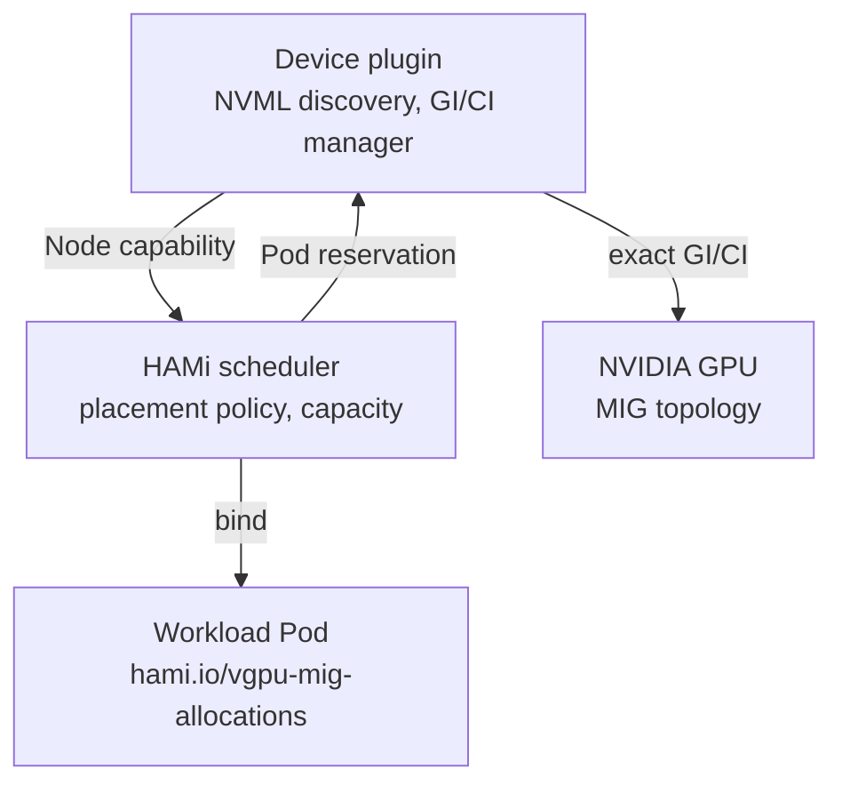
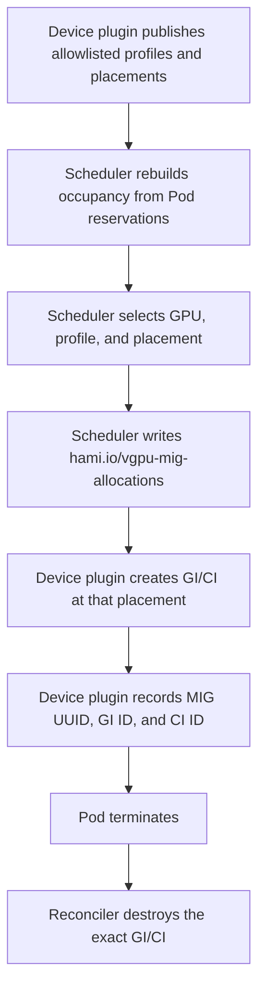

## Special Thanks

The original Dynamic MIG feature was implemented with the help of @sailorvii. The v2.10.0 reservation-first refactor was contributed by @FouoF.

## Introduction

The NVIDIA GPU built-in sharing method includes: time-slice, MPS and MIG. The context switch for time slice sharing would waste some time, so MPS and MIG are preferred. A GPU exposes several MIG profiles, but a fixed whole-GPU geometry must be chosen before workloads arrive. Switching that geometry usually means draining the GPU. The goal is an automatic slice plugin that creates a MIG instance when the user requires it.

From v2.10.0, HAMi uses a reservation-first model: the device plugin publishes allowlisted profiles and legal placements discovered through NVML, the scheduler reserves a specific profile and placement for each Pod, and the device plugin creates the GI/CI during `Allocate`. The instance is reclaimed when the Pod terminates.

For the scheduling method, node-level binpack and spread will be supported. Referring to the binpack plugin, the scheduler considers CPU, Mem, GPU memory and other user-defined resources. HAMi is done by using [hami-core](https://github.com/Project-HAMi/HAMi-core), which is a cuda-hacking library. But MIG is also widely used across the world. A unified API for dynamic-mig and hami-core is needed.

## Targets

- CPU, Mem, and GPU combined schedule
- GPU dynamic slice: HAMi-core and MIG
- Support node-level binpack and spread by GPU memory, CPU and Mem
- A unified vGPU Pool different virtualization techniques
- Tasks can choose to use MIG, use HAMi-core, or use both.

### Config maps

- hami-scheduler-device-configMap This configmap defines the plugin configurations including resourceName, the MIG profile allowlist, and node-level configurations.

```yaml
apiVersion: v1
data:
  device-config.yaml: |
    nvidia:
      resourceCountName: nvidia.com/gpu
      resourceMemoryName: nvidia.com/gpumem
      resourceCoreName: nvidia.com/gpucores
      migProfileAllowlist:
      - models: [ "A30" ]
        profiles: [ "1g.6gb", "2g.12gb", "4g.24gb" ]
      - models: [ "A100-SXM4-40GB", "A100-40GB-PCIe", "A100-PCIE-40GB" ]
        profiles: [ "1g.5gb", "2g.10gb", "3g.20gb", "7g.40gb" ]
      - models: [ "A100-SXM4-80GB", "A100-80GB-PCIe", "A100-PCIE-80GB"]
        profiles: [ "1g.10gb", "2g.20gb", "3g.40gb", "7g.79gb" ]
      nodeconfig:
          - name: nodeA
            operatingmode: hami-core
          - name: nodeB
            operatingmode: mig
```

The allowlist is cluster policy. NVML on the node that owns the GPU supplies memory, compute, slice count, and legal placements. Do not duplicate those values in the ConfigMap.

## Structure




The device plugin is the hardware authority. The scheduler is the reservation authority. The Pod annotation is the durable handoff between them.

## Examples

Dynamic MIG is compatible with HAMi tasks, as shown in the example below: Set `nvidia.com/gpu` and `nvidia.com/gpumem`.

```yaml
apiVersion: v1
kind: Pod
metadata:
  name: gpu-pod1
spec:
  containers:
    - name: ubuntu-container1
      image: ubuntu:22.04
      command: ["bash", "-c", "sleep 86400"]
      resources:
        limits:
          nvidia.com/gpu: 2 # requesting 2 vGPUs
          nvidia.com/gpumem: 8000 # Each vGPU contains 8000m device memory (Optional,Integer)
```

A task can decide only to use `mig` or `hami-core` by setting `annotations.nvidia.com/vgpu-mode` to corresponding value, as the example below shows:

```yaml
apiVersion: v1
kind: Pod
metadata:
  name: gpu-pod1
  annotations:
    nvidia.com/vgpu-mode: "mig"
spec:
  containers:
    - name: ubuntu-container1
      image: ubuntu:22.04
      command: ["bash", "-c", "sleep 86400"]
      resources:
        limits:
          nvidia.com/gpu: 2 # requesting 2 vGPUs
          nvidia.com/gpumem: 8000 # Each vGPU contains 8000m device memory (Optional,Integer)
```

## Procedures

The Procedure of a vGPU task which uses dynamic-mig is shown below:




After submitting a task, the scheduler matches `nvidia.com/gpumem` to an allowlisted profile and picks a legal free placement. Occupancy is the interval `[start, start + size)`. You can change `migProfileAllowlist` in ConfigMap `hami-scheduler-device` and restart the scheduler and device plugin.

If you submit the example on an empty A100-PCIE-40GB node, the scheduler selects `2g.10gb` (the smallest allowlisted profile with at least 8000 MiB) twice, with non-overlapping placements, and the device plugin creates two `2g.10gb` instances.

Do not edit `hami.io/vgpu-mig-allocations`. Incomplete or legacy `GPU-UUID[template-slot]` identities cannot be adopted safely; drain geometry-based MIG Pods before upgrading to v2.10.0. See [Migrating to HAMi Dynamic MIG](https://github.com/Project-HAMi/HAMi/blob/v2.10.0/docs/develop/dynamic-mig-migration.md) and [Dynamic MIG Architecture](https://github.com/Project-HAMi/HAMi/blob/v2.10.0/docs/develop/mig-dynamic-deallocate.md).
