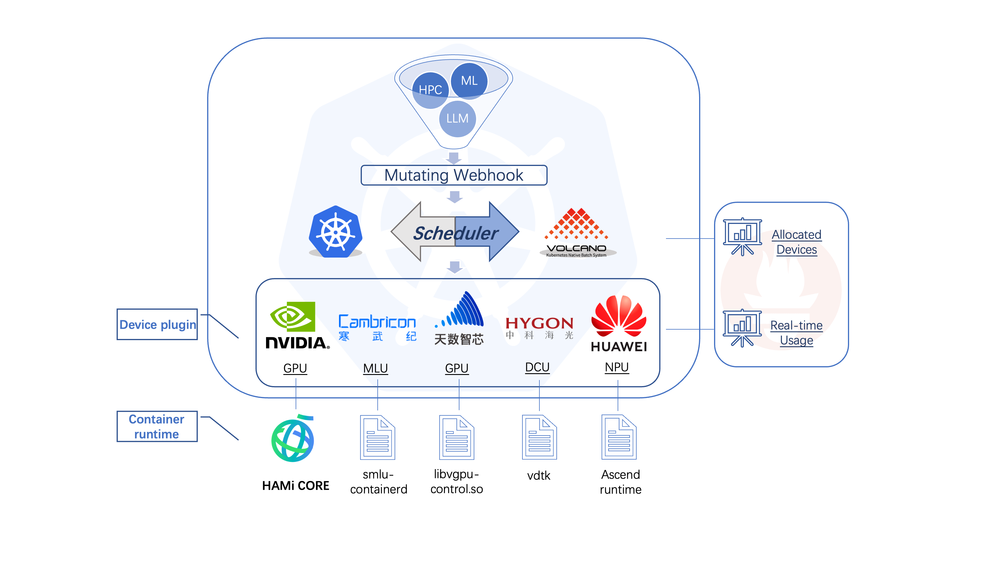
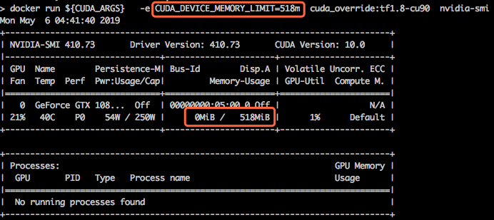
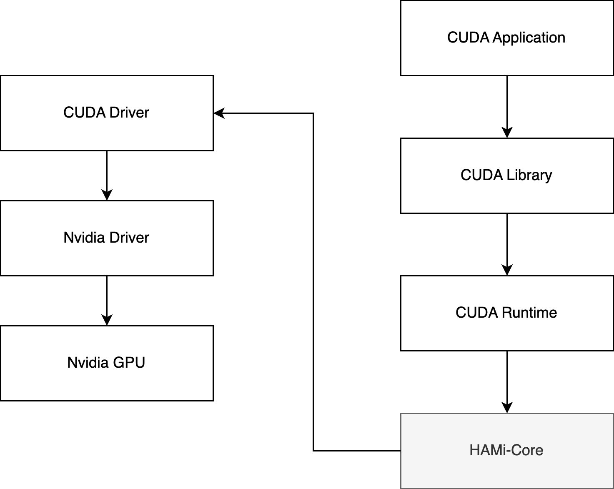

HAMi-core is a hook library designed for the CUDA environment.
It functions as an in-container GPU resource controller and has been adopted by projects
like [HAMi](https://github.com/HAMi-project/HAMi) and [Volcano](https://github.com/volcano-sh/devices).

## Features

HAMi-core offers the following key features:

1. Virtualize the device memory

   

2. Limit the device utilization  

   Implements a custom time-slicing mechanism to control GPU usage.

3. Monitor the device utilization in real time

## Design

HAMi-core works by intercepting API calls between the CUDA Runtime (`libcudart.so`) and
the CUDA Driver (`libcuda.so`), as shown below:

