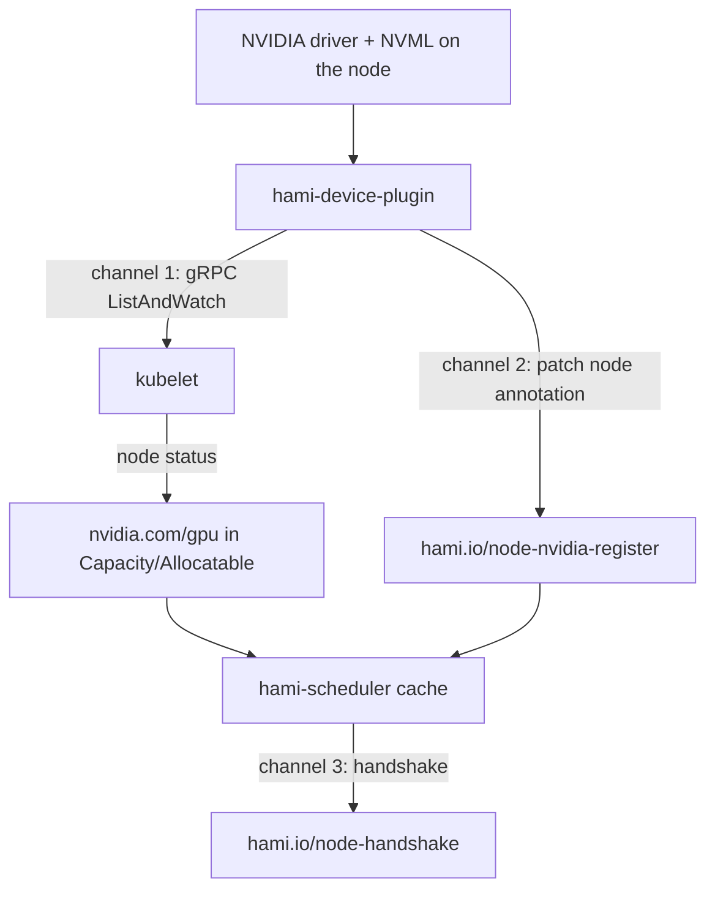

Before HAMi can schedule anything, a GPU node has to complete registration. This page covers the failures that happen _before_ scheduling: the node advertises no GPUs, the HAMi scheduler does not know the node exists, or a node that used to work silently drops out of the cluster's GPU capacity.

Typical symptoms:

- `kubectl describe node` shows no `nvidia.com/gpu` under `Capacity` and `Allocatable`.
- A Pod requesting `nvidia.com/gpu` stays `Pending` with `0/N nodes are available`, and **no** `FilteringFailed` event from `hami-scheduler`.
- `nvidia-smi` works on the host, but the node still contributes nothing to the cluster.
- A node worked yesterday and stopped being selected today.

If your Pod _does_ get a `FilteringFailed` event from `hami-scheduler`, registration already succeeded and the problem is scheduling instead. See [Troubleshooting](./troubleshooting.md).

## How registration works

Registration is not one action. It is three independent channels, and each can break on its own:



| Channel | Written by | Carries | Where to observe it |
| --- | --- | --- | --- |
| Device count | Device Plugin to kubelet | An integer count only | `nvidia.com/gpu` in node `Allocatable` |
| Device specification | Device Plugin to the API server | UUID, memory, compute, model, NUMA, health | `hami.io/node-nvidia-register` node annotation |
| Liveness handshake | Scheduler to the API server | A timestamp | `hami.io/node-handshake` node annotation |

The count and the specification travel separately because the Device Plugin API can only report a single integer resource. A node can therefore advertise `nvidia.com/gpu: 10` while the HAMi scheduler still refuses to use it, because the annotation the scheduler actually reads is missing.

The count kubelet advertises is the **inflated** count: physical GPUs multiplied by `devicePlugin.deviceSplitCount` (default `10`). One physical card on a default install shows as `nvidia.com/gpu: 10`, not `1`. See [GPU Virtualization](../core-concepts/gpu-virtualization.md).

## Step 1: Find the broken channel

Run all three checks against the affected node before changing anything:

```bash
NODE=<node-name>

# Channel 1: does kubelet advertise the resource?
kubectl get node $NODE -o jsonpath='{.status.allocatable.nvidia\.com/gpu}{"\n"}'

# Channel 2: did the Device Plugin write the device specification?
kubectl get node $NODE -o jsonpath='{.metadata.annotations.hami\.io/node-nvidia-register}{"\n"}'

# Channel 3: is a Device Plugin Pod actually running there?
kubectl get pods -n kube-system \
  -l app.kubernetes.io/component=hami-device-plugin \
  -o wide --field-selector spec.nodeName=$NODE
```

Match the result to the section to read next:

| Result                                 | Broken channel                  | Go to             |
| -------------------------------------- | ------------------------------- | ----------------- |
| No Device Plugin Pod on the node       | Nothing is registering          | [Case 1](#case-1) |
| Pod exists but is not `Running`        | Plugin cannot start             | [Case 2](#case-2) |
| Empty `nvidia.com/gpu`, Pod `Running`  | Plugin to kubelet               | [Case 3](#case-3) |
| `nvidia.com/gpu` set, annotation empty | Plugin to API server            | [Case 4](#case-4) |
| Both set, Pod still `Pending`          | Scheduler does not see the node | [Case 5](#case-5) |

## Case 1: no Device Plugin Pod on the node {#case-1}

The HAMi NVIDIA Device Plugin DaemonSet carries a node selector. Its chart default is:

```yaml
devicePlugin:
  nvidiaNodeSelector:
    gpu: "on"
```

A node without that label never receives a Device Plugin Pod, so none of the three channels start. This is the single most common cause of a GPU node contributing nothing.

### Check

```bash
kubectl get node $NODE --show-labels | tr ',' '\n' | grep gpu
kubectl get daemonset -n kube-system hami-device-plugin \
  -o jsonpath='{.spec.template.spec.nodeSelector}{"\n"}'
```

### Fix

```bash
kubectl label node $NODE gpu=on --overwrite
```

Then wait for the DaemonSet to place a Pod:

```bash
kubectl rollout status daemonset/hami-device-plugin -n kube-system
```

If the label is already present and correct, check that the node is not tainted in a way the DaemonSet does not tolerate:

```bash
kubectl describe node $NODE | grep -A 3 Taints
```

Add matching entries under `devicePlugin.tolerations` if needed. Node labelling is also covered in [Prerequisites](../installation/prerequisites.md).

## Case 2: the Device Plugin Pod does not stay running {#case-2}

```bash
kubectl logs -n kube-system -l app.kubernetes.io/component=hami-device-plugin \
  -c device-plugin --tail=100
kubectl describe pod -n kube-system -l app.kubernetes.io/component=hami-device-plugin
```

### NVML initialization failure

```plaintext
nvml Init err:  ERROR_LIBRARY_NOT_FOUND
```

The Device Plugin treats every NVML failure during a device scan as fatal and exits, so the container ends up in `CrashLoopBackOff` rather than running degraded. The same fatal path is taken for `nvml get memory error`, `nvml get name error`, and `nvml new device by index error`.

This almost always means the container did not receive the driver, which in turn means `nvidia-container-runtime` is not the default runtime on the node:

```bash
containerd config dump | grep default_runtime_name
```

The output must be `nvidia`. If it is not, follow [Prerequisites](../installation/prerequisites.md), then restart the container runtime. On GPU Operator 25.10 and later the default runtime deliberately stays `runc`; that case needs `devicePlugin.runtimeClassName=nvidia` instead, and is covered in [Troubleshooting](./troubleshooting.md#nvidia-toolkit-gpu-operator-25-10).

### Stuck in `Init`

```plaintext
Waiting for /run/nvidia/validations/toolkit-ready...
```

The `toolkit-validation` init container blocks until the NVIDIA Container Toolkit writes a `toolkit-ready` file under `devicePlugin.gpuOperatorToolkitReady.hostPath` (default `/run/nvidia/validations`). The gate is off by default and is meant for GPU Operator clusters. If it was enabled on a cluster without GPU Operator, that file is never created and the init container waits forever:

```bash
helm upgrade hami hami-charts/hami -n kube-system --reuse-values \
  --set devicePlugin.gpuOperatorToolkitReady.enabled=false
```

### Node name not resolved

The Device Plugin patches the node named by its `NODE_NAME` environment variable, which the chart populates from `spec.nodeName`. On charts older than v2.3.10 the variable was called `NodeName`, and a mismatched image and chart pair leaves the plugin unable to identify its own node. Upgrade rather than patching by hand:

```bash
helm upgrade hami hami-charts/hami -n kube-system --reuse-values
```

## Case 3: the resource never appears in Allocatable {#case-3}

The Pod is `Running` and NVML works, but `nvidia.com/gpu` is absent. The Device Plugin registered with the API server but not with kubelet.

### Check

```bash
kubectl logs -n kube-system -l app.kubernetes.io/component=hami-device-plugin \
  -c device-plugin --tail=200 | grep -i -E "register|socket|kubelet"

ls -l /var/lib/kubelet/device-plugins/   # on the node itself
```

The plugin registers over `kubelet.sock` in that directory. The chart mounts it from `devicePlugin.pluginPath`, which defaults to `/var/lib/kubelet/device-plugins`. If your distribution relocates the kubelet root, the plugin writes its socket somewhere kubelet never reads and registration silently never completes.

### Fix

Confirm the real path on the node, then point the chart at it:

```bash
# on the node
ps aux | grep kubelet | grep -o '\--root-dir=[^ ]*'

helm upgrade hami hami-charts/hami -n kube-system --reuse-values \
  --set devicePlugin.pluginPath=<kubelet-root>/device-plugins
```

Restarting kubelet also forces every Device Plugin to re-register, which is a fast way to confirm the socket path is the problem.

## Case 4: the register annotation is missing or stale {#case-4}

This is the case that most often looks like a scheduler bug. kubelet advertises the GPUs, so `kubectl describe node` looks healthy, but `hami-scheduler` never places a Pod there.

### Read the annotation

```bash
kubectl get node $NODE \
  -o jsonpath='{.metadata.annotations.hami\.io/node-nvidia-register}' | jq .
```

Expected output for one 24 GiB card on a default install:

```json
[
  {
    "id": "GPU-fc28df76-54d2-c387-e52e-5f0a9495968c",
    "count": 10,
    "devmem": 24576,
    "devcore": 100,
    "type": "NVIDIA-NVIDIA L40S",
    "mode": "hami-core",
    "health": true
  }
]
```

| Field     | Meaning                        | Source                                      |
| --------- | ------------------------------ | ------------------------------------------- |
| `id`      | GPU UUID                       | NVML                                        |
| `count`   | Logical split count            | `devicePlugin.deviceSplitCount`             |
| `devmem`  | Schedulable memory in MiB      | Physical memory times `deviceMemoryScaling` |
| `devcore` | Schedulable compute percentage | `deviceCoreScaling` times 100               |
| `type`    | Model, prefixed with `NVIDIA-` | NVML                                        |
| `numa`    | NUMA node                      | sysfs                                       |
| `mode`    | `hami-core` or `mig`           | Plugin operating mode                       |
| `health`  | Device health                  | Device Plugin health check                  |

:::warning Zero-valued fields are omitted

The annotation is serialized with `omitempty`, so any field whose value is zero or `false` is absent rather than shown. An **unhealthy GPU has no `health` key at all**, it does not appear as `"health": false`. The same applies to `"numa": 0` and `"index": 0`. Read a missing `health` key as unhealthy, not as healthy.

:::

### The annotation is only rewritten when it changes

The Device Plugin rescans devices every 30 seconds, but it compares the newly encoded list against the last one it wrote and skips the patch when they are identical:

```plaintext
Device info unchanged, skipping annotation update
```

That line appears at verbosity `-v=3`. At the default verbosity, a real update logs:

```plaintext
Updating node annotations with 1 device(s)
```

The consequence: an old timestamp on the annotation is normal and is not evidence of a stuck plugin. Conversely, deleting the annotation by hand does **not** get it rewritten within 30 seconds, because the plugin's in-memory cache still matches what it thinks it wrote. Restart the Pod instead. See [Force a re-registration](#force-a-re-registration).

### The patch is rejected

```plaintext
patch node error  nodes "gpu-node-1" is forbidden: User "system:serviceaccount:kube-system:hami-device-plugin" cannot patch resource "nodes"
```

The ServiceAccount lost permission to patch nodes, usually after a partial upgrade or a hand-edited ClusterRole:

```bash
kubectl auth can-i patch nodes \
  --as=system:serviceaccount:kube-system:hami-device-plugin
```

Reinstalling or upgrading the chart restores the RBAC objects.

## Case 5: the scheduler does not see the node {#case-5}

Both the resource and the annotation are correct, but Pods still do not land. The node is missing from the scheduler's in-memory cache.

### Check the scheduler log

```bash
kubectl logs -n kube-system deploy/hami-scheduler -c vgpu-scheduler-extender --tail=200
```

The registration loop runs every 15 seconds, and also on node events and on leader changes. Raise verbosity to `-v=5` to see per-node decisions, which are otherwise silent:

```plaintext
Using label selector for list nodes
Listed nodes
Processing node
Failed to get node devices
```

`Failed to get node devices` for your node means the scheduler read the annotation and rejected it. There are three ways that happens: the annotation key is absent, the JSON does not decode, and the decoded list is empty. The second and third also log at the default verbosity:

```plaintext
failed to decode node devices
no nvidia gpu device found
```

A hand-edited annotation is the usual cause of a decode failure.

### Cause A: a node label selector excludes the node

The scheduler can be restricted to a subset of nodes with `scheduler.nodeLabelSelector`. It is commented out in the chart by default, so an unmodified install lists every node. If it was set, the value is echoed on startup:

```bash
kubectl logs -n kube-system deploy/hami-scheduler -c vgpu-scheduler-extender \
  | grep "label selector"
```

Any node missing those labels is never registered, no matter how healthy it is.

### Cause B: the replica you are reading is not the leader

Only the leader performs registration. Every other replica logs:

```plaintext
Scheduler is not leader yet, skipping ...
```

With more than one `hami-scheduler` replica, a quiet log is expected on followers and proves nothing. Identify the leader before concluding the loop is dead:

```bash
kubectl get lease -n kube-system | grep hami
```

## The handshake annotation

`hami.io/node-handshake` is a liveness marker maintained by the **scheduler**, not by the Device Plugin. Reading it backwards causes a lot of wasted debugging, so it is worth stating the actual behavior:

- When the annotation is absent, or its value does not contain `Requesting`, the scheduler stamps it with `Requesting_<timestamp>` and treats the node as healthy.
- While the timestamp is less than **60 seconds** old, the node is healthy.
- Once it is older than 60 seconds, the scheduler checks the node's allocatable `nvidia.com/gpu`. If that is still greater than zero, the node stays healthy and nothing is cleaned up.
- Only when the handshake has expired **and** allocatable has dropped to zero does the scheduler run node cleanup: it drops the node's devices from its cache and deletes the handshake annotation.

```bash
kubectl get node $NODE -o jsonpath='{.metadata.annotations.hami\.io/node-handshake}{"\n"}'
# Requesting_2026-08-15 09:12:44
```

Two practical consequences:

- **An old `Requesting_` timestamp is not a fault.** It is the normal steady state, and on its own it never removes a node. Do not tune anything based on it.
- **The real trigger for a node leaving the scheduler's cache is allocatable falling to zero**, which means the Device Plugin stopped reporting to kubelet. Debug that, not the handshake. The scheduler logs the removal:

  ```plaintext
  Device is unhealthy, cleaning up node
  ```

:::note NVIDIA uses an unsuffixed key

The NVIDIA handshake key is `hami.io/node-handshake`. Other vendors use a suffixed form such as `hami.io/node-handshake-dcu` or `hami.io/node-handshake-xpu`. A `kubectl get node -o yaml | grep node-handshake-nvidia` returns nothing on an NVIDIA node, which is expected.

:::

## Force a re-registration

Restarting the Device Plugin Pod clears its in-memory device cache and forces a fresh annotation patch on the next scan. This is the correct recovery for a missing, truncated, or hand-edited register annotation:

```bash
kubectl delete pod -n kube-system \
  -l app.kubernetes.io/component=hami-device-plugin \
  --field-selector spec.nodeName=$NODE
```

Confirm the cycle completed:

```bash
kubectl logs -n kube-system -l app.kubernetes.io/component=hami-device-plugin \
  -c device-plugin --tail=50 | grep "Updating node annotations"

kubectl get node $NODE \
  -o jsonpath='{.metadata.annotations.hami\.io/node-nvidia-register}' | jq length
```

The scheduler picks the node back up within one registration cycle, so allow about 15 seconds before retesting with a Pod.

If the node still does not register, collect the following before opening an issue:

```bash
kubectl get node $NODE -o yaml > node.yaml
kubectl logs -n kube-system -l app.kubernetes.io/component=hami-device-plugin \
  -c device-plugin --tail=500 > device-plugin.log
kubectl logs -n kube-system deploy/hami-scheduler \
  -c vgpu-scheduler-extender --tail=500 > scheduler.log
```

## Validation environment

The behavior described on this page was verified by reading the HAMi source at **v2.9.0** and on `master`, specifically `pkg/device-plugin/nvidiadevice/nvinternal/plugin/register.go`, `pkg/device/devices.go`, `pkg/device/nvidia/device.go`, `pkg/scheduler/scheduler.go`, and `charts/hami/values.yaml`. Chart defaults quoted here are the NVIDIA values from `charts/hami`. Intervals, the 60-second handshake window, and log strings can change between releases; check the source for the version you run before relying on an exact number.

## Related pages

- [Troubleshooting](./troubleshooting.md) for runtime and GPU Operator issues
- [Validate HAMi](../get-started/verify-hami.md) for the end-to-end post-install check
- [Protocol design](../developers/protocol.md) for the registration protocol itself
- [GPU Virtualization](../core-concepts/gpu-virtualization.md) for how the annotation feeds scheduling
