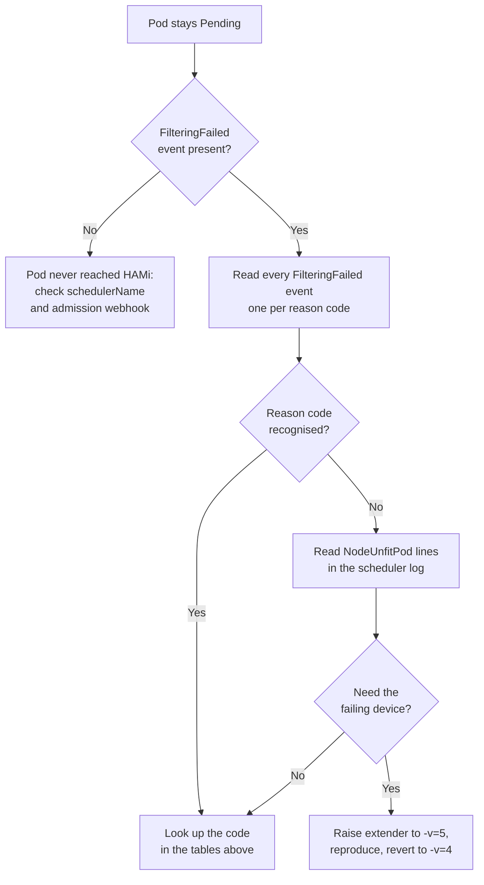

When a Pod that requests HAMi resources stays `Pending`, the HAMi scheduler extender has already made a decision and told you why. It records that decision as `FilteringFailed` events on the Pod, using a fixed set of reason codes such as `CardInsufficientMemory` or `CardTimeSlicingExhausted`.

This page explains how to read those messages and what each reason code means.

:::info

Reason codes are defined in `pkg/device/common/common.go` in the [HAMi repository](https://github.com/Project-HAMi/HAMi). The list below reflects HAMi v2.9.0. Older versions emit a subset of these codes; a Pod scheduled by an older scheduler may show free-form messages instead.

:::

## Step 1: Read the Pod events

```bash
kubectl describe pod <pod-name> -n <namespace>
```

The `Events` section holds two different kinds of message. Both matter:

```plaintext
Events:
  Type     Reason            Age   From            Message
  ----     ------            ----  ----            -------
  Warning  FailedScheduling  15s   default-scheduler  0/3 nodes are available: 3 NodeUnfitPod.
  Warning  FilteringFailed   16s   hami-scheduler     2 nodes CardInsufficientMemory(node-a,node-b)
  Warning  FilteringFailed   16s   hami-scheduler     1 nodes CardTypeMismatch(node-c)
```

- `FailedScheduling` comes from the Kubernetes scheduler. It only tells you how many nodes were rejected.
- `FilteringFailed` comes from `hami-scheduler` and carries the actual reason. **This is the line to act on.**

If you see no `FilteringFailed` event at all, the Pod never reached HAMi. Check that the Pod uses HAMi's scheduler and that the admission webhook is running. See [Verify HAMi](../get-started/verify-hami.md).

## Step 2: Decode the message

### The event format

```plaintext
<node-count> nodes <ReasonCode>(<node-a>,<node-b>,...)
```

Three properties of this format are easy to misread:

- **One event per reason code.** A cluster where two nodes ran out of memory and one node had the wrong card type produces _two_ `FilteringFailed` events, not one. Read all of them before concluding anything.
- **These events appear only when no node fits.** If at least one node is viable, the Pod is scheduled and you get a single `FilteringSucceed` event instead, even though other nodes were rejected.
- **The node list is the set of nodes rejected for that specific reason.** A node can appear under more than one reason code, because different GPUs on the same node can fail for different reasons.

### The scheduler log format

The events aggregate per node. To see which _device_ failed and why, read the scheduler extender log:

```bash
kubectl logs -n kube-system deploy/hami-scheduler -c vgpu-scheduler-extender --tail=200
```

At the default verbosity (`-v=4`) each rejected node produces one `NodeUnfitPod` line:

```plaintext
NodeUnfitPod pod="default/gpu-pod" node="node-a" reason="3/8 CardInsufficientMemory, 5/8 CardInsufficientCore"
```

Read the fraction as `<devices rejected for this reason>/<total devices of that type on the node>`. In the line above, node-a has 8 GPUs: 3 were short on memory and 5 were short on compute. Each rejected device is counted once, under the **first** check it failed, so a card that is short on both memory and compute appears only under `CardInsufficientMemory`. Fixing the reason with the largest count is not always the fastest route to a scheduled Pod.

:::warning The one exception to the fraction rule

`AllocatedCardsInsufficientRequest` inverts the numerator. There it counts the cards that **did** fit, not the ones that were rejected. `2/8 AllocatedCardsInsufficientRequest` means the node offered 2 usable cards for a request that needed more.

:::

Successful nodes log a matching `NodeFitPod` line with the score that decided the placement.

## Step 3: Look up the reason code

### Node-level rejections

| Reason code | What the scheduler found | What to do |
| --- | --- | --- |
| `NodeInsufficientDevice` | The node has fewer devices of the requested type than the Pod asks for. Evaluated before any per-device check. | Lower the card count, or add nodes with more cards. A 4-GPU request never fits a 2-GPU node, regardless of how idle it is. |
| `NodeUnfitPod` | Summary line: this node was rejected. It is always accompanied by the per-device reasons. | Read the per-device reasons in the same log line. |
| `NodeFitPod` | Not a failure. The node passed filtering and was scored. | Nothing. |

### The card was excluded before capacity was considered

| Reason code | What the scheduler found | What to do |
| --- | --- | --- |
| `CardNotHealth` | The device plugin reported the device as unhealthy, so it is skipped entirely. | Check the device plugin logs and `nvidia-smi` on that node. An unhealthy card is a node problem, not a request problem. |
| `CardTypeMismatch` | The card model does not satisfy the Pod's type constraints. | Review the `nvidia.com/use-gputype` / `nvidia.com/nouse-gputype` annotations. Also triggered by `nvidia.com/vgpu-mode` when the card does not run the requested mode. See [Specify device type to use](../userguide/nvidia-device/specify-device-type-to-use.md). |
| `CardUuidMismatch` | The card's UUID is excluded by the Pod's UUID constraints. | Review `nvidia.com/use-gpuuuid` / `nvidia.com/nouse-gpuuuid`. A stale UUID pinned in a Deployment template survives node replacement and silently blocks every rescheduling attempt. See [Specify device UUID to use](../userguide/nvidia-device/specify-device-uuid-to-use.md). |
| `NumaNotFit` | The Pod requires all its cards on one NUMA node, and the candidate cards span a NUMA boundary. | Only applies when the Pod sets `nvidia.com/numa-bind: "true"`. Drop the annotation if NUMA locality is not required, or request a card count that a single NUMA node can serve. |
| `ModeNotFit` | The node cannot run the requested virtualization mode for that vendor. | Vendor-specific. On Ascend, it means HAMi-core sharing was requested on a node that does not support it; on Enflame, that no GCU profile matches the request. |
| `CardNotFoundCustomFilterRule` | A vendor-specific filter rule rejected the card. | Consult the guide for that vendor under [User Guide](../userguide/device-supported.md). NVIDIA cards outside MIG mode never produce this code. |
| `CardMigTopologyInfeasible` | The card is in MIG mode, but no allowed MIG profile with a free placement matches the requested memory. | The card may have free memory in total while still having no contiguous slot of the right shape. Align the request with a real MIG profile size, or drain the card. See [Dynamic MIG support](../userguide/nvidia-device/dynamic-mig-support.md). |

### The card matched but had no room

| Reason code | What the scheduler found | What to do |
| --- | --- | --- |
| `CardInsufficientMemory` | Free device memory is below the request: `total - used < requested`. | The most common code. Lower `nvidia.com/gpumem`, wait for a workload to finish, or add capacity. Remember that HAMi counts _allocated_ memory, not memory currently in use, so an idle-looking card can still be full. |
| `CardInsufficientCore` | Free compute percentage is below `nvidia.com/gpucores`. | Lower `gpucores`, or place the Pod on a card with fewer streaming workloads. |
| `CardTimeSlicingExhausted` | The card already hosts the maximum number of tasks. | Each card accepts `deviceSplitCount` tasks (default 10) regardless of remaining memory. A card with plenty of free memory still rejects task 11. Raise the split count if the workloads are small enough to justify it. See [Global configuration](../userguide/configure.md). |
| `CardComputeUnitsExhausted` | The Pod requests no cores at all, and the card's compute is fully committed. | A request that omits `gpucores` is not free to place: it still cannot land on a card at 100% committed compute. Give the Pod an explicit `gpucores` value, or free compute on the card. |
| `ExclusiveDeviceAllocateConflict` | Exclusive use was requested for a card that is already shared, or a shared request hit a card held exclusively. | Raised either when `nvidia.com/gpucores: 100` is requested on a card with existing tasks, or when the `mutex` GPU scheduler policy is in effect. See [Scheduling policy](../userguide/nvidia-device/scheduling-policy.md). |
| `ResourceQuotaNotFit` | The allocation would exceed the namespace's HAMi `ResourceQuota`. | A cluster-capacity problem in disguise: the cards are free, the namespace budget is not. See [Using ResourceQuota](../userguide/nvidia-device/using-resourcequota.md). |
| `AllocatedCardsInsufficientRequest` | Some cards on the node fit, but fewer than the requested count. | The node is partially usable. Reduce the card count, or free enough cards on one node. HAMi does not split one container's cards across nodes. |

## Step 4: Get per-device detail when the node summary is not enough

The `NodeUnfitPod` summary tells you _how many_ devices failed, not _which_ ones. Device identity is logged at `-v=5`:

```bash
helm upgrade hami hami-charts/hami \
  --namespace kube-system \
  --reuse-values \
  --set-json 'scheduler.extender.extraArgs=["--debug","-v=5"]'

kubectl rollout status deploy/hami-scheduler -n kube-system
```

Re-create the Pod, then read the log again. Each rejected device now names itself:

```plaintext
CardInsufficientMemory pod="default/gpu-pod" node="node-a" device="GPU-62b7408e-edb2-41d1-bc91-f46165c61130" device total memory=40960 device used memory=39000 request memory=8000
```

`-v=5` is verbose in proportion to cluster size: a 10-node cluster with 8 GPUs per node emits up to 80 lines for a single failed Pod. Return to the default once you have the answer:

```bash
helm upgrade hami hami-charts/hami \
  --namespace kube-system \
  --reuse-values \
  --set-json 'scheduler.extender.extraArgs=["--debug","-v=4"]'
```

## Messages that carry no reason code

Some failures are reported before per-device filtering runs, so they never produce a reason code.

| Message | Meaning |
| --- | --- |
| `no available node, N nodes do not meet` | Every candidate node was rejected. The specific reasons are in the other `FilteringFailed` events on the same Pod, so do not stop reading at this one. |
| `no available node, all node scores do not meet` | Same situation, reported by older HAMi versions without per-reason breakdown. Fall back to the scheduler log. |
| `node unregistered` (log only, `-v=5`) | The node has no HAMi device registration. Either its device plugin is not running, or it genuinely has no supported accelerator. Check `kubectl get node <name> -o jsonpath='{.metadata.annotations}'` for `hami.io/node-*-register`. |
| `Device type not found` | The Pod requests a device type the scheduler was not built or configured to handle, for example an Ascend request on a scheduler started without `--enable-ascend=true`. |

:::note Why some reasons never reach the events

The aggregated events are built by parsing the `<n>/<m> <Code>` fractions out of each node's reason string. Reason codes reported bare, without a fraction (`NodeInsufficientDevice` is the notable one), are recorded against the node but do not become their own `FilteringFailed` event. If the events look thinner than the failure, read the scheduler log.

:::

## Putting it together



## Related Pages

- [Troubleshooting](./troubleshooting.md): installation and runtime problems that are not scheduling decisions
- [Scheduler Event Log](../developers/scheduler-event-log.md): the design behind these events and logs
- [Scheduling Policy](../userguide/nvidia-device/scheduling-policy.md): node and GPU selection policies that change which cards are considered
- [FAQ](../faq/faq.md)
