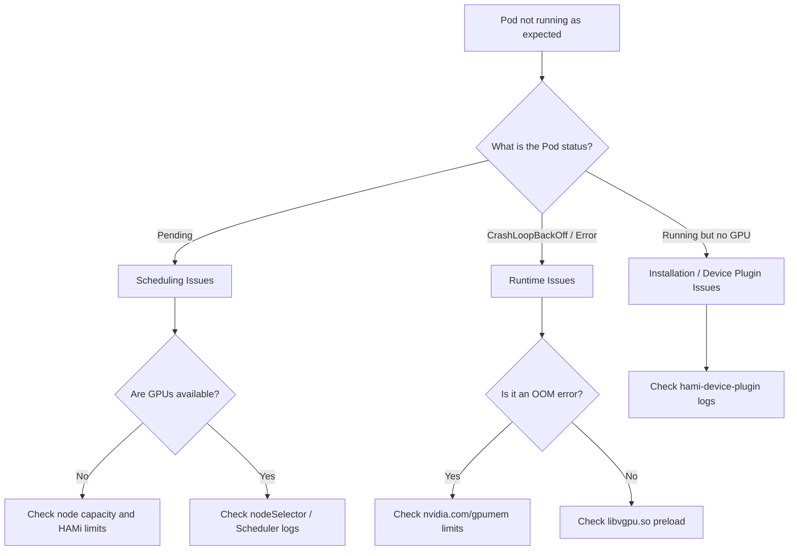

This guide covers common issues you might encounter when installing, scheduling, and running workloads with HAMi. It is broken down into three main sections: Installation, Scheduling, and Runtime.

## Diagnostic Flowchart

Use this flowchart to quickly identify where your issue might be occurring:



---

## 1. Installation Issues

Installation issues usually manifest as the `hami-device-plugin` pods crashing or failing to register GPUs to the Kubernetes nodes.

### Device Plugin Fails to Start

- Since v2.3.10, HAMi has changed the `device-plugin` environment variable name from `NodeName` to `NODE_NAME`. If you are using an image version earlier than v2.3.10, the `device-plugin` may fail to start.

  To resolve this issue, you have two options:
  - Manually edit the DaemonSet using `kubectl edit daemonset` and update the environment variable from `NodeName` to `NODE_NAME`.
  - Upgrade the `device-plugin` image to the latest version using Helm:

    ```bash
    helm upgrade hami hami/hami -n kube-system
    ```

### Container Runtime Configuration

If the `hami-device-plugin` is running but your nodes don't show `nvidia.com/gpu` resources, verify your containerd configuration:

- **`nvidia-container-runtime` not set as default** - verify with:

  ```bash
  containerd config dump | grep default_runtime_name
  ```

  The output must show `nvidia`. If not, follow the [Prerequisites](../installation/online-installation) guide.

---

## 2. Scheduling Issues

Scheduling issues occur when your Pods remain in the `Pending` state.

### Pods Stuck in Pending

- **NodeName unsupported:** Tasks with the `nodeName` field cannot be scheduled at the moment; please use `nodeSelector` instead.
- **A100 MIG restrictions:** Currently, A100 MIG can be supported in only "none" and "mixed" modes.
- **Check Scheduler Logs:** Use the following command to view why the HAMi scheduler rejected a pod:

  ```bash
  kubectl logs -n kube-system -l component=hami-scheduler
  ```

---

## 3. Runtime Issues

Runtime issues occur after the Pod is scheduled, but it fails to execute correctly or doesn't respect isolation limits.

### GPU Memory Limit Not Enforced {#gpu-memory-limit-not-enforced}

If a container exceeds its `nvidia.com/gpumem` limit, check the following causes:

- **`CUDA_DISABLE_CONTROL=true` is set** - disables HAMi-core enforcement entirely. Remove it from production workloads.
- **Docker-in-Docker (DinD)** - inner containers do not inherit the `/etc/ld.so.preload` hostPath mount. HAMi enforcement does not apply inside DinD.
- **Direct driver API usage** - workloads calling NVML or the CUDA Driver API directly bypass `libvgpu.so`.
- If you don’t explicitly request vGPUs when using the device plugin with NVIDIA images, all GPUs on the host may be exposed to your container.

### Unsupported Workloads

- Only computing tasks are currently supported; video codec processing is not supported.

## Diagnostic Cheat Sheet

Here are some helpful commands for diagnosing HAMi clusters:

```bash
# Check if HAMi resources are allocatable on a node
kubectl get node <node-name> -o yaml | grep nvidia.com

# Check the logs of the HAMi device plugin
kubectl logs -n kube-system -l app.kubernetes.io/name=hami

# Verify if the libvgpu library is mounted inside a running pod
kubectl exec -it <pod-name> -- ls -l /usr/local/vgpu/libvgpu.so
```
