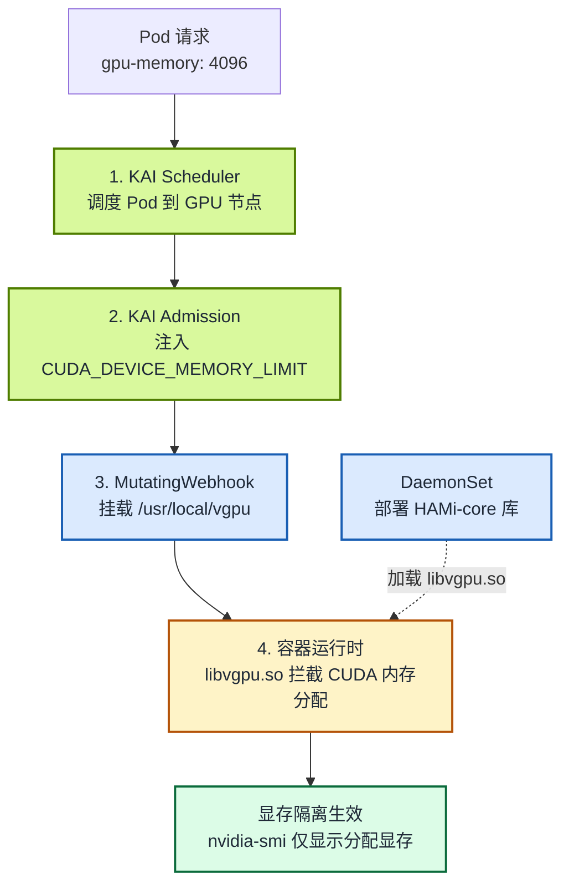
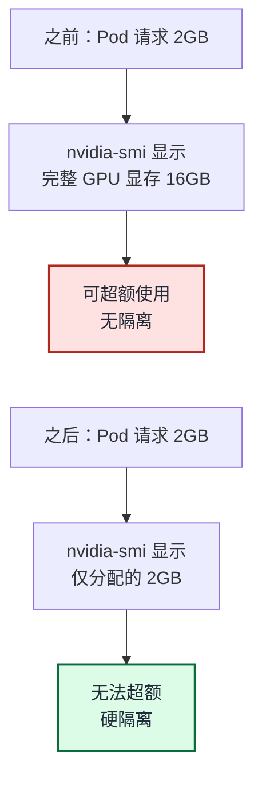
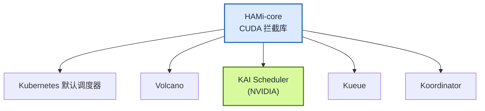

> 本文中的集成对象严格来说是 HAMi-core，而非完整 HAMi 平台。KAI Scheduler 保留自身调度能力，引入 HAMi-core 提供 GPU Memory Isolation 能力。

2026 年 6 月，两项核心 PR 正式合并进入 NVIDIA KAI Scheduler 主干。HAMi 的 GPU 显存硬隔离能力已作为内置特性随 KAI Scheduler v0.16.4 发布，云原生 GPU 资源调度正式从「软共享」迈入「硬隔离」时代。

<!-- truncate -->

## 什么是 KAI Scheduler？

[KAI Scheduler](https://github.com/kai-scheduler/KAI-Scheduler) 是 NVIDIA 开源的 Kubernetes 原生 AI 工作负载调度器。它的前身是 Run:ai 的调度引擎，NVIDIA 于 2024 年底收购 Run:ai 后，在 2025 年 4 月以 Apache 2.0 协议开源，现已成为 CNCF Sandbox 项目。

Kubernetes 默认调度器为无状态服务设计，把 GPU 当 CPU 核一样调度，每个 Pod 独占整张 GPU，没有 gang scheduling，没有团队公平性，没有拓扑感知。KAI Scheduler 正是为解决这些 AI 场景特有的调度问题而生：

- **PodGroup（Gang Scheduling）**：分布式训练的多个 Pod 必须同时启动，否则全部等待。避免 7 张 GPU 被占着却跑不起来的尴尬。
- **Queue（层级公平调度）**：按部门/团队分配 GPU 配额，支持借用和回收，实现多团队共享集群的公平调度。
- **Fractional GPU（GPU 分片共享）**：多个工作负载共享同一张 GPU，按比例或按显存大小分配。
- **Topology-Aware Placement**：感知 GPU 间互联拓扑，把紧耦合的训练任务放在同一节点或同一 NVLink 域内。
- **Elastic Workloads**：任务可以在最小和最大 Pod 数之间弹性伸缩，随集群负载动态调整。

## KAI Scheduler 的「最后一公里」：GPU 硬隔离

KAI Scheduler 的 GPU 分片共享（Fractional GPU）功能虽然很强大，但是有一个关键限制：

KAI Scheduler 的 GPU 共享是「协作式」的：调度器确保请求的显存份额加起来不超过 GPU 总量，但**不物理阻止**某个工作负载超额使用显存。假如一个容器请求 2000 MiB 显存，但是在该容器中仍然可以通过 `nvidia-smi` 和 CUDA API 看到并使用完整 GPU 显存。

这对于开发测试环境通常可以接受。但在生产环境的多租户场景下，这就成了致命短板：

- 无法防止工作负载超额使用显存，导致 OOM 或互相干扰
- 多租户之间缺乏真正的资源隔离保障
- 无法精确控制每个容器的 GPU 显存上限

这正是 HAMi 的核心能力所在。

## 什么是 HAMi？

HAMi 是 CNCF 沙箱项目，专注于异构 AI 算力虚拟化中间件。其核心能力是通过 CUDA 拦截库（HAMi-core），在容器级别实现 GPU 显存和算力的硬隔离。

简单理解 HAMi 的定位：

- **KAI Scheduler** = 决定「谁在什么时候用什么 GPU」（调度层）
- **HAMi** = 确保「用了就只有这么多，不能多占」（隔离层）

两者结合，才能实现真正意义上的生产级 GPU 共享。HAMi 支持 NVIDIA GPU、华为昇腾 NPU、寒武纪 MLU、海光 DCU、昆仑芯 XPU 等多种异构加速卡，是云原生 GPU 虚拟化领域覆盖最广的开源方案。详细的异构加速卡支持信息请参考 [HAMi 官方文档](/zh/docs/userguide/device-supported)。

## 集成架构：HAMi + KAI Scheduler 如何协作

整个集成方案采用松耦合设计，KAI Scheduler 和 HAMi 各司其职、独立部署：



工作流程分为四个阶段：

1. **调度**：KAI Scheduler 将 Pod 调度到合适的 GPU 节点
2. **环境变量注入**：KAI 的 Admission 组件根据 `gpu-fraction` 或 `gpu-memory` 注解，向容器注入 `CUDA_DEVICE_MEMORY_LIMIT` 环境变量
3. **库文件注入**：kai-resource-isolator 的 MutatingWebhook 自动注入 HAMi-core 库的 volume mount 和 `ld.so.preload` 配置
4. **运行时隔离**：容器启动后，`libvgpu.so` 拦截所有 CUDA 内存分配调用，根据环境变量强制执行显存上限



### 部署方式

在 KAI Scheduler 中集成 HAMi 也极其简单，仅两步。

**第一步：安装 KAI Scheduler**，启用 GPU 共享并激活 `hamicore` 插件：

```bash
helm install kai-scheduler oci://ghcr.io/nvidia/kai-scheduler \
  --version v0.16.4 \
  --set global.gpuSharing=true \
  --set binder.plugins.hamicore.enabled=true \
  --namespace kai-scheduler --create-namespace
```

**第二步：部署 kai-resource-isolator**。它把 HAMi-core 库以 DaemonSet 形式分发到每个 GPU 节点，并通过 MutatingWebhook 向共享 GPU 的 Pod 注入卷挂载：

```bash
helm install kai-resource-isolator oci://docker.io/projecthami/kai-resource-isolator \
  --namespace kai-resource-isolator --create-namespace \
  --version 1.0.0-chart
```

Chart 版本号带 `-chart` 后缀（如 `1.0.0-chart`），可用版本见 [Docker Hub](https://hub.docker.com/r/projecthami/kai-resource-isolator/tags)；更多定制项参考 [kai-resource-isolator 仓库](https://github.com/Project-HAMi/KAI-resource-isolator)。

部署完成后，任何使用 `gpu-fraction` 或 `gpu-memory` 注解的 Pod 都会自动获得显存隔离。

### 使用方式

以请求 4096 MiB 显存为例，给 Pod 打上 `gpu-memory` 注解并指定 `kai-scheduler` 调度器即可：

```yaml
apiVersion: v1
kind: Pod
metadata:
  name: gpu-sharing-with-isolation
  labels:
    kai.scheduler/queue: default-queue
  annotations:
    gpu-memory: "4096" # 单位 MiB，不带后缀
spec:
  schedulerName: kai-scheduler
  containers:
    - name: gpu-workload
      image: nvidia/cuda:12.9.2-base-ubuntu24.04
      command: ["sleep", "infinity"]
```

Pod 启动后，容器内的 `nvidia-smi` 只会显示分配到的显存，而非整张 GPU 的完整显存，资源隔离得到验证。

#### 按需关闭隔离（Opt-out）

- **单个 Pod**：添加注解 `kai-resource-isolator.io/inject: "false"`
- **整个命名空间**：添加标签 `kai-resource-isolator.io/webhook=ignore`

#### 显存数值精度

`gpu-memory` 注解接受**整数 MiB**（无单位后缀）。KAI Scheduler 内部会把它换算成两位小数的 GPU 分数，再乘以 GPU 总显存得出实际强制上限。因此 `nvidia-smi` 看到的值可能与请求值略有出入，例如在 15360 MiB 的 T4 上请求 `4096`，会四舍五入为 `0.27` 分数，最终强制上限为 `4147m`。

:::tip

本文只讲重点。完整步骤（前置条件、安装、调度隔离 Pod、用 `nvidia-smi` 验证隔离、按需关闭）见 [如何在 KAI Scheduler 中使用 HAMi](/zh/docs/next/userguide/kai-scheduler/how-to-use-kai-scheduler) 文档。

:::

## 开源协作：从提案到合并

此次集成是开源社区协作的典范，历时超过一年，涉及 HAMi 团队与 NVIDIA KAI Scheduler 团队的紧密配合：

| 时间 | 里程碑 | 参与者 |
| --- | --- | --- |
| 2025 年 4 月 | [@archlitchi](https://github.com/archlitchi) 提交 PR #60「Resource isolation design」提出资源隔离设计；NVIDIA 团队评审方案、讨论架构设计并确定分工；社区讨论敲定技术方案：KAI 负责环境变量注入，HAMi 负责资源隔离组件 | [@archlitchi](https://github.com/archlitchi)（HAMi）、[@romanbaron](https://github.com/romanbaron)、[@enoodle](https://github.com/enoodle)（NVIDIA）及双方团队与社区 |
| 2026 年 4 月 | [@FouoF](https://github.com/FouoF) 提交 PR #1504，实现 GPU_MEMORY_LIMIT binder 插件 | [@FouoF](https://github.com/FouoF)（HAMi） |
| 2026 年 5 月 28 日 | PR #1504 合并进入 KAI Scheduler 主干 | [@davidLif](https://github.com/davidLif)（NVIDIA）merge |
| 2026 年 6 月 | [@archlitchi](https://github.com/archlitchi) 完成用户文档、e2e 测试，PR #60 通过全部 review | [@archlitchi](https://github.com/archlitchi)（HAMi） |
| 2026 年 6 月 9 日 | PR #60 正式合并进入 KAI Scheduler 主干 | [@davidLif](https://github.com/davidLif), [@gshaibi](https://github.com/gshaibi)（NVIDIA）approve |

此次集成的社区反响十分热烈：

- PR #60 多位社区开发者表达了对此功能的强烈需求
- Thanh Tung Dao 等用户积极跟进进展，期待 v0.16.0 版本发布
- 社区讨论覆盖了从技术方案到部署模型的各个层面

## 对 HAMi 生态的意义

### 验证了 HAMi 技术路线的正确性

HAMi 的核心能力（CUDA 拦截和 GPU 显存硬隔离）被 NVIDIA 官方调度器采纳，这是对 HAMi 技术成熟度的有力背书。NVIDIA 团队选择将 HAMi-core 作为 KAI Scheduler GPU 共享的资源隔离方案，而非自行开发，说明 HAMi 在这个领域的方案已经是最优解。

### 拓展了生态版图

在此之前，HAMi 已与多个 Kubernetes 调度器完成集成。此次整合将覆盖范围拓展到 NVIDIA 官方调度器：



### 为用户创造实际价值

对于同时使用 KAI Scheduler 和 HAMi 的用户，这次集成解决了最迫切的需求。正如社区用户 Thanh Tung Dao 所说：

> "We're currently using KAI Scheduler to handle our ML workloads, but we have a new requirement: we need to enforce strict vGPU restrictions (memory/compute isolation) at the pod level. I know HAMi excels at this."

## 现已可用：KAI Scheduler v0.16.4 中的 HAMi 资源隔离

两项核心 PR 已全部合并进入 KAI Scheduler 主干，并随 v0.16.4 正式发布。用户只需在 Helm 安装 KAI Scheduler 时启用 GPU 共享与 `hamicore` 插件，即可获得 HAMi 资源隔离：

```bash
helm install kai-scheduler oci://ghcr.io/nvidia/kai-scheduler \
  --version v0.16.4 \
  --set global.gpuSharing=true \
  --set binder.plugins.hamicore.enabled=true \
  --namespace kai-scheduler --create-namespace
```

`global.gpuSharing=true` 开启 GPU 共享，`binder.plugins.hamicore.enabled=true` 激活 `hamicore` 插件，由其为共享 GPU 的容器注入 `CUDA_DEVICE_MEMORY_LIMIT` 环境变量；再配合节点侧的 kai-resource-isolator 强制执行，即可实现显存硬隔离（完整步骤见上文「部署方式」）。

### 后续规划

- 配合 KAI Scheduler 新版本发布，完善用户文档和使用指南
- 探索 GPU 计算单元（SM）隔离的支持
- 持续优化 HAMi-core 在大规模集群场景下的性能表现

---

## 相关链接

- HAMi 项目：[github.com/Project-HAMi/HAMi](https://github.com/Project-HAMi/HAMi)
- KAI Scheduler：[github.com/kai-scheduler/KAI-Scheduler](https://github.com/kai-scheduler/KAI-Scheduler)
- PR #60（Resource isolation design）：[github.com/kai-scheduler/KAI-Scheduler/pull/60](https://github.com/kai-scheduler/KAI-Scheduler/pull/60)
- PR #1504（GPU_MEMORY_LIMIT binder）：[github.com/kai-scheduler/KAI-Scheduler/pull/1504](https://github.com/kai-scheduler/KAI-Scheduler/pull/1504)
- HAMi 资源隔离用户文档：[docs/gpu-sharing/hami/README.md](https://github.com/kai-scheduler/KAI-Scheduler/blob/main/docs/gpu-sharing/hami/README.md)
- kai-resource-isolator：[github.com/Project-HAMi/KAI-resource-isolator](https://github.com/Project-HAMi/KAI-resource-isolator)
