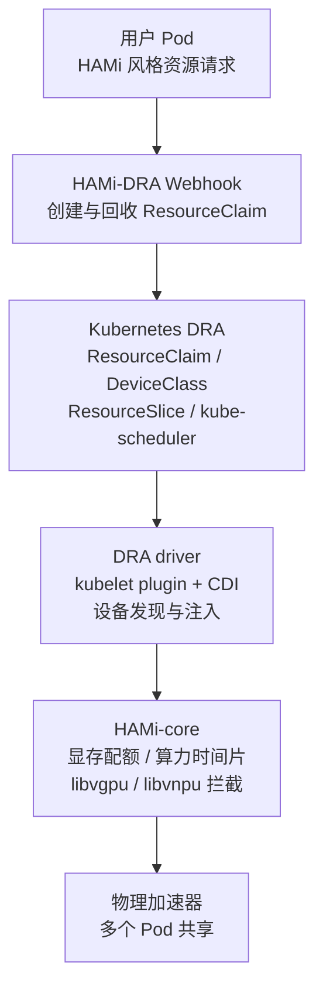

Kubernetes 1.34 将 DRA（Dynamic Resource Allocation）核心 API 推进至 GA，配合 Consumable Capacity（可消费容量）模型，加速器第一次成为 Kubernetes 原生资源模型里的“一等公民”：有属性、有容量、允许多个 Pod 共享。这对 HAMi 这类基于 Device Plugin 的共享方案提出了一个现实问题：设备的申请和调度可以交给 Kubernetes 原生完成，但容器内的资源隔离，Kubernetes 并不负责。

[HAMi DRA](https://github.com/Project-HAMi/HAMi-DRA) 是 HAMi 社区交出的答案：一个迁移层，把存量 workload 里的 HAMi 风格资源请求自动转换成原生 ResourceClaim，调度与记账交还 kube-scheduler，运行时隔离继续由 HAMi-core 完成，业务侧一行代码不用改。当前 0.2.3 版本覆盖 NVIDIA GPU；随着[昇腾 DRA Driver](https://github.com/4pdOss/hami-dra-driver) 进入预览，这条链路已在真实的 310P3 集群上完成端到端验证，社区同步发布了配套的 [实验 18：用 HAMi DRA 共享昇腾 NPU](/zh/tutorials/labs/ascend-hami-dra)，提供每一步的命令与真实输出。本文系统介绍 HAMi DRA 的动机、设计、使用方式与当前边界。

<!-- truncate -->

## HAMi 解决了什么，又卡在哪里

HAMi（异构 AI 计算虚拟化中间件）的前身是 k8s-vGPU-scheduler，现在是 CNCF 孵化项目。它解决的问题很具体：Device Plugin 的 Extended Resource 只能表达整数张卡（`nvidia.com/gpu: 1`、`huawei.com/Ascend310P: 1`），而加速器共享需要的是“一块卡的一部分显存加一部分算力”。HAMi 在旧 API 之上搭起了完整体系：mutating webhook 改写 Pod、调度器扩展（extender）做共享调度、device plugin 上报与挂载、HAMi-core（`libvgpu` / `libvnpu`）在容器内强制执行配额。这套体系在生产中经受了检验（案例数据来自[社区分享](https://aicon.infoq.cn/2026/shenzhen/presentation/7168)）：顺丰通过 GPU 共享实现最高 57% 的 GPU 节省，SNOW 降低 55% 成本，招商银行借助拓扑感知调度实现硬件资源池 100% 利用。

但正因为整个体系建在 Device Plugin 和调度扩展之上，天花板也是结构性的。HAMi 现有方案的现实瓶颈可以归纳为四点（详见[社区分享](https://aicon.infoq.cn/2026/shenzhen/presentation/7168)）：

| 瓶颈                   | 根源                                                            |
| :--------------------- | :-------------------------------------------------------------- |
| ResourceQuota 计量问题 | Extended Resource 不进原生配额体系，需要额外的 Quota 实现       |
| Preemption 兼容问题    | Extender API 的限制，在支持抢占等调度功能时捉襟见肘             |
| 调度性能劣化           | 节点锁的排它性：单节点同时调度多个 Pod 时，并发退化为串行       |
| 异常死锁               | 系统默认锁定时长 5 分钟，创建过程中的请求失败可能让节点无法解锁 |

这四点都不是代码层面的 bug，而是架构限制：要在以节点为中心的分配模型上做精细化分配，就得付出这些代价。

## DRA 改变了什么

Kubernetes 1.34 将 DRA（Dynamic Resource Allocation）核心 API 推进至 GA，集群设备资源管理从以节点为中心的分配模型，演进为以资源对象为核心的声明式模型。新 API 一共四个对象：

- **ResourceSlice**：设备清单。每块加速器是一个 device，携带属性（uuid、型号、PCIe 等）与容量（显存、算力）。
- **ResourceClaim**：Pod 的设备需求声明，在 Pod 创建之前完成表达与约束。
- **DeviceClass**：设备过滤与配置模板。
- **ResourceClaimTemplate**：供 StatefulSet 等控制器批量生成 claim。

对共享调度最关键的是 **Consumable Capacity**（KEP-5075）：设备以两个独立维度（显存、算力百分比）发布容量，`allowMultipleAllocations` 允许同一设备被多个 claim 消费，kube-scheduler 逐维度对账已消费容量，每次分配带独立 shareID。这意味着“多个 workload 合理消费同一加速器的部分容量”第一次成为调度器的原生能力，不再需要树外组件模拟。注意该 feature gate 在 1.34/1.35 需手动开启，1.36 起默认开启。

传统 Device Plugin 接口只能暴露简单容量信息，调度器“调度到节点后才发现资源不够”；DRA 让设备属性在调度阶段就可精确匹配。这里的迁移逻辑很清楚：瓶颈不在 HAMi 的调度算法，而在它脚下那层 API。

## HAMi DRA 的设计

HAMi DRA 没有推倒重来，而是只替换了上半部分：调度和记账改用 Kubernetes 原生实现，运行时隔离继续用 HAMi-core。



三个组件，各管一段：**HAMi-DRA Webhook** 负责“怎么声明”，**DRA driver** 负责“怎么分配设备”，**HAMi-core** 负责“怎么共享设备”。

**Webhook** 做两件事。一是多维度资源自动转换：把 HAMi 定义的多维度 ResourceName（如 `huawei.com/Ascend310P` 加 `-memory` 加 `-core`，NVIDIA 侧 `nvidia.com/gpu` 加 `gpumem` 加 `gpucores`）自动转换成 ResourceClaim 的 `count` 与 `capacity.requests`；HAMi 的选卡注解（`use-*-uuid` 等）转换成 CEL 选择器。二是 ResourceClaim 生命周期管理：claim 的创建与 Pod 绑定，Pod 删除时自动清理。注意 HAMi-DRA 自身不再包含调度器组件，原生 kube-scheduler、Volcano 等都能配合工作。

**DRA driver** 是节点侧实现：发现设备并发布 ResourceSlice（属性加容量），处理 kubelet 的 `NodePrepareResources` 注入环境变量、创建共享目录，通过 `UnprepareResourceClaims` 在合适时机清理 HAMi-core 引入的临时文件，这也是设备生命周期管理比 Device Plugin 时代更完善的地方。设备注入走 CDI 标准接口落到 containerd。

**HAMi-core** 原样保留：DRA 只解决“请求与调度”那一半，“容器内强制执行”那一半（显存配额、算力时间片）仍由 `libvgpu` / `libvnpu` 完成。这正是 [《Kubernetes DRA 会取代 HAMi 吗？》](/zh/blog/does-kubernetes-dra-replace-hami)的结论在架构上的落点。

调度性能的提升同样来自这次替换（[AICon](https://aicon.infoq.cn/2026/shenzhen/presentation/7168) 与 [KCD Beijing](https://dynamia.ai/zh/blog/kcd-beijing-2026-dra-gpu-scheduling) 两场分享给出的对比相互印证）：借助 DRA 自身的调度系统，HAMi-DRA 避免了节点锁带来的性能衰退，同节点并发调度多个 Pod 时，原方案的 Pod 创建时间近似线性劣化（峰值在 42 秒量级），HAMi-DRA 则明显更低（幅度在 30% 以上）。这主要得益于 DRA 的资源预绑定机制：资源分配在调度阶段就已确定，减少了调度冲突与重试。整体可以概括为四组对照：NodeLock 到 No Locks，ResourceName 到 ResourceClaim，Device Plugin 到 DRA Driver，Annotation 到 Attributes。

还有一个容易被低估的变化是可观测性。传统模型里，资源信息来自 Node、使用情况来自 Pod，完整的资源视图需要聚合推断才能得到；DRA 模型里 ResourceSlice 描述设备清单、ResourceClaim 描述分配，资源视角本身就是一等公民。可观测性从“推断”变成了“直接建模”（[社区分享](https://dynamia.ai/zh/blog/kcd-beijing-2026-dra-gpu-scheduling)）：运维可以直接从 ResourceClaim 看到每块加速器被谁占用、分配了多少显存、还剩多少余量，而不必从节点状态和 Pod 配置里反推。

## 两种使用模式

DRA 的能力升级有一面经常被忽视的代价：写法复杂度，也就是常被提到的“UX 退化”（[社区分享](https://dynamia.ai/zh/blog/kcd-beijing-2026-dra-gpu-scheduling)）。Device Plugin 的写法是一行：

```yaml
resources:
  limits:
    nvidia.com/gpu: 1
```

DRA 原生写法则是独立的 ResourceClaim 对象，`count`、`capacity.requests` 一层层嵌套，还要配上按设备属性过滤的 CEL 选择器：

```yaml
spec:
  devices:
    requests:
      - exactly:
          allocationMode: ExactCount
          count: 1
          capacity:
            requests:
              memory: 4194304k
```

对已在使用 Device Plugin 的企业，迁移成本不只是改 YAML，而是整个团队要学一套新的资源声明范式。HAMi-DRA 对此的回答是两种提交方式，底层调度与切分逻辑一致：

- **DRA 原生模式**：手动创建 ResourceClaim 声明显存与算力，Pod 通过 `resourceClaims` 引用。适合新业务，能直接使用 CEL 选择器表达设备属性约束（例如拓扑感知、NUMA 亲和；相同机制已扩展到网卡等资源，配合 `firstAvailable` 还能表达多种候选分配方案，见[社区分享](https://aicon.infoq.cn/2026/shenzhen/presentation/7168)）。
- **DevicePlugin 兼容模式**：沿用传统 `nvidia.com/gpu` / `huawei.com/Ascend310P` 资源申请语法，Webhook 自动拦截并转换为 ResourceClaim。存量业务零改造迁移，这就是“无感迁移”的由来：这个设计把 DRA 从“专家接口”变成了“普通用户接口”（[社区分享](https://dynamia.ai/zh/blog/kcd-beijing-2026-dra-gpu-scheduling)）。

兼容模式的转换发生在准入阶段。以一台昇腾 310P 真实集群里提交的 Pod 为例，`resources.limits` 里的三个 `huawei.com/*` 条目被替换为 `resources.claims` 与 `spec.resourceClaims`，生成的 ResourceClaim 中 HAMi 语义逐项进入 DRA 语义：

| ResourceClaim 字段 | 来源 | 转换规则 |
| :-- | :-- | :-- |
| `count: 1` | `Ascend310P: 1` | 整数直传 |
| `capacity.requests.memory: 8589934592` | `-memory: 8192`（MiB） | MiB 转字节（8192 × 1024 × 1024） |
| `capacity.requests.cores: "50"` | `-core: 50` | 百分比直传 |
| CEL 选择器 | `use-Ascend310P-uuid` 注解 | `uuid in ["..."]`，值来自 ResourceSlice |

两个 Pod 各请求 8192 MiB 显存加 50 算力、指向同一块卡时，两个 claim 落到同一个 device 上，各自带独立 shareID，调度器在分配第二个之前已把第一个的消费记账。容量记满后新请求被调度器直接拒绝（claim 停在 pending），Pod 删除后 claim 自动回收、记账恢复。容器内的强制执行依旧是 HAMi-core：`libvnpu.so` 拦截超限的显存申请并转为容器内 OOM，容器视角的设备被虚拟化为申请的 8 GiB 而非整卡 21 GiB。完整过程见[实验 18](/zh/tutorials/labs/ascend-hami-dra)。

## 设备支持的时间线，与“为什么是现在”

HAMi DRA 的能力边界很大程度上取决于各厂商 DRA driver 的适配进度。社区分享中给出的时间线（[AICon](https://aicon.infoq.cn/2026/shenzhen/presentation/7168)）：

- 2025.09：NVIDIA DRA Driver，Consumable Capacity 就绪
- 2026.03：海光 DCU DRA Driver 完成与 HAMi DRA 的集成
- 2026.04：Enflame（燧原）DRA Driver 集成推进中
- 2026.08：**Ascend DRA Driver 进入开发与预览**（[4pdOss/hami-dra-driver](https://github.com/4pdOss/hami-dra-driver)，即范式的开源仓库）

昇腾链路进入预览，意味着 HAMi DRA 的能力边界刚刚扩展到 NPU：[实验 18](/zh/tutorials/labs/ascend-hami-dra) 已在一台 310P3 服务器上把 HAMi 请求到 NPU 共享的完整链路跑通，昇腾 DRA driver 当前为 chart 0.1.1（实验所用镜像为修复 uuid 生成问题的开发构建，正式发布前行为可能变化）。HAMi 2.9 版本直播中提到 NPU 的 DRA 支持计划随 2.10 发布，在那之前会先放出测试版本供社区试用，现在正是尝鲜与反馈的窗口。

## 落地前的现实约束

落地阻力可以归纳为四条：

- **高版本依赖**：Consumable Capacity 依赖 Kubernetes 1.34+，其他 DRA 特性可能要求更高版本，生产环境推动升级不轻松。
- **有限的厂商支持**：开箱即用的 DRA Driver 数量还少，支持的异构设备有限。
- **Scoring 缺失**：设备调度层面 DRA 的打分能力尚缺，对特性化调度要求的支持有限。
- **学习成本**：DRA 引入的新概念对集群部署与维护同学有门槛，HAMi 社区的对策正是用 Webhook 兼容模式把这份成本挡在用户视线之外。

选型上（[HAMi 2.9 版本直播](https://dynamia.ai/zh/blog/hami-2.9-webinar-recap)给出的建议）：标准化集群、追求最优调度效果（如拓扑感知），推荐原生 HAMi；高度定制化（已有自己的调度器）或需要即插即用设备复用的集群，推荐 HAMi DRA。此外两条运维事实值得记住：DRA 模式与传统模式不兼容，不要同时启用；使用 DRA 模式仍然会经过 HAMi-core。

## 展望

HAMi-DRA 的 roadmap 上排着：更多异构设备（MetaX、天数智芯 Iluvatar CoreX）、更多 DRA 特性适配（List Attributes、Partitionable Devices）、兼容 Kubernetes 标准设备属性（`resource.kubernetes.io/pcieRoot`），以及与 Volcano、Kueue 的调度器集成。

再往大处看（[社区分享](https://dynamia.ai/zh/blog/kcd-beijing-2026-dra-gpu-scheduling)）：Kubernetes 正在演进为 AI 基础设施的控制平面，而 HAMi 的定位是面向 Kubernetes 的加速器资源层，向下适配异构设备，向上支撑训练、推理与 Agent 等 workload，中间提供调度、虚拟化与资源抽象。HAMi-DRA 正是把这层资源能力与 Kubernetes 原生模型对齐的关键一步：HAMi 的价值收敛到运行时强制执行与异构生态适配，资源表达与调度则交给原生模型。如果你正在评估从 Device Plugin 模式迁移到 DRA，或在为异构集群寻找统一的资源管理层，欢迎试用 [HAMi DRA](https://github.com/Project-HAMi/HAMi-DRA) 并向社区反馈。

## 延伸阅读

- 杨守仁 AICon 深圳 2026 分享：[从 HAMi 到 HAMi-DRA：异构环境的算力资源管理实践](https://aicon.infoq.cn/2026/shenzhen/presentation/7168)
- 王纪飞、James Deng KCD Beijing 2026 分享回顾：[从 Device Plugin 到 DRA：GPU 调度范式升级与 HAMi-DRA 实践](https://dynamia.ai/zh/blog/kcd-beijing-2026-dra-gpu-scheduling)
- HAMi 2.9 版本直播回顾（李孟轩）：[HAMi 2.9 昇腾软切分与 DRA 实战详解](https://dynamia.ai/zh/blog/hami-2.9-webinar-recap)
- 社区上手指南：[HAMi 正式接入 Kubernetes DRA：下一代 GPU 资源模型实践指南](https://dynamia.ai/zh/blog/hami-dra-quickstart)
- Mesut Oezdil：[Kubernetes DRA 会取代 HAMi 吗？](/zh/blog/does-kubernetes-dra-replace-hami)（[英文原文](https://www.cncf.io/blog/2026/08/07/does-kubernetes-dra-replace-hami/)，CNCF 博客）
- 用户指南：[如何使用 HAMi DRA](/zh/docs/installation/how-to-use-hami-dra)；动手实验：[实验 18：用 HAMi DRA 共享昇腾 NPU](/zh/tutorials/labs/ascend-hami-dra)、[实验 4：用 DRA 切分 GPU](/zh/tutorials/labs/hami-dra)
- 相关组件：[Project-HAMi/HAMi-DRA](https://github.com/Project-HAMi/HAMi-DRA) · [4pdOss/hami-dra-driver](https://github.com/4pdOss/hami-dra-driver) · [Project-HAMi/hami-vnpu-core](https://github.com/Project-HAMi/hami-vnpu-core)
