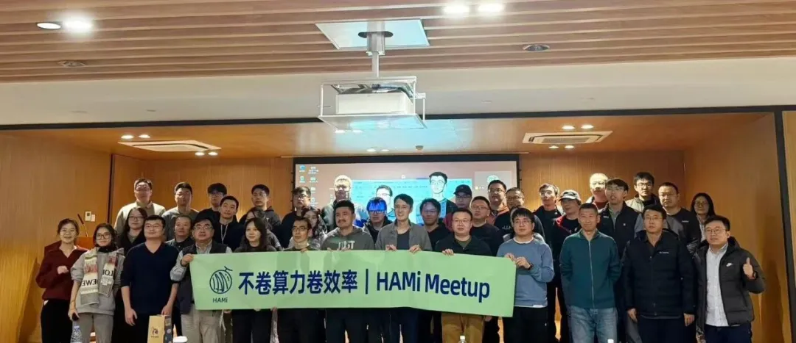
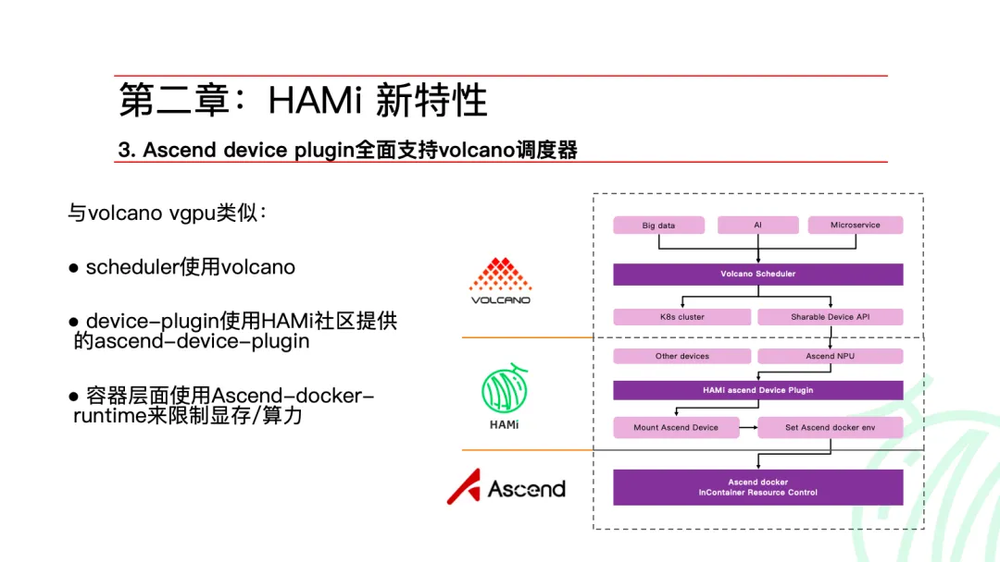
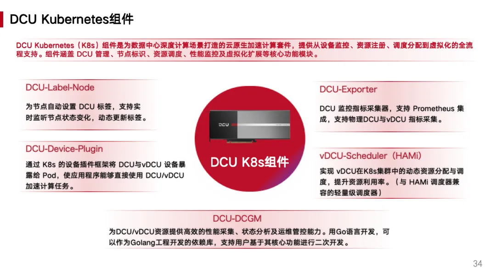
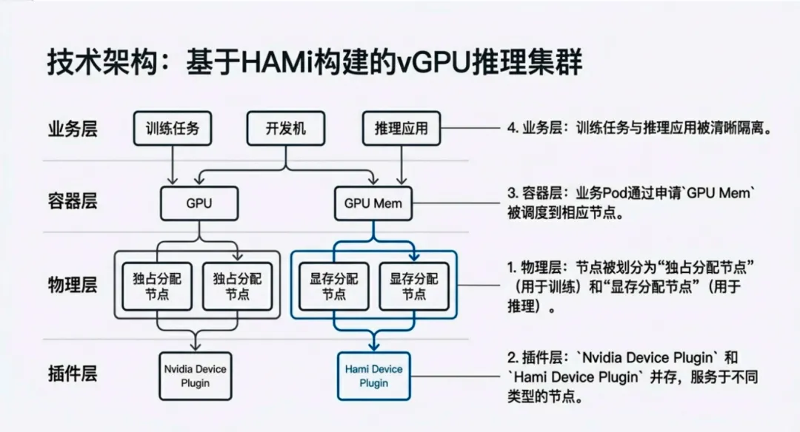
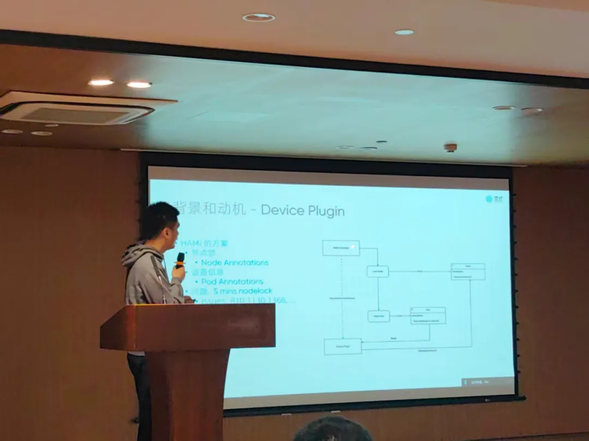
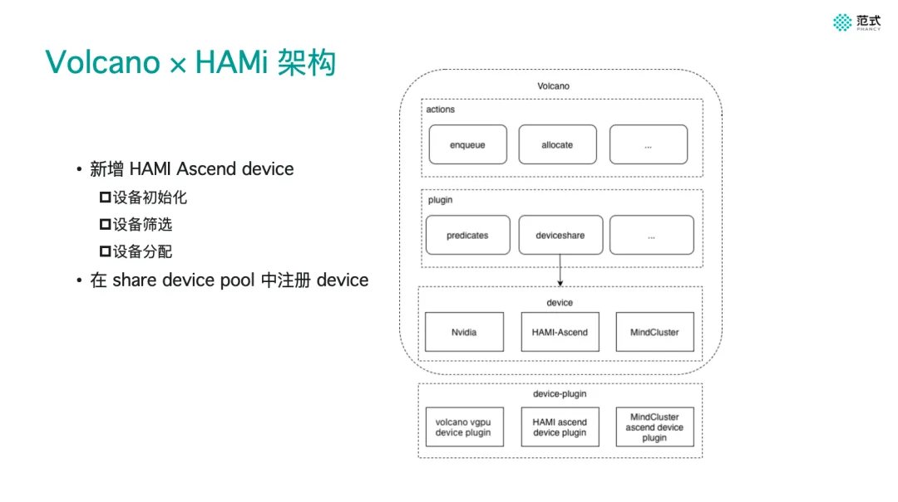
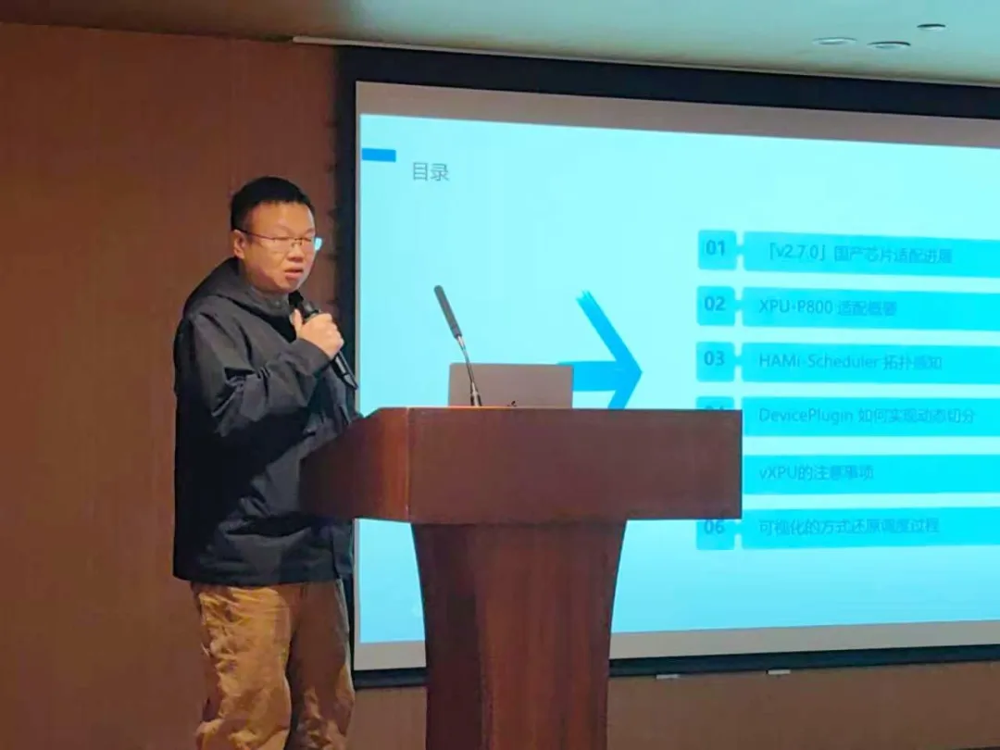
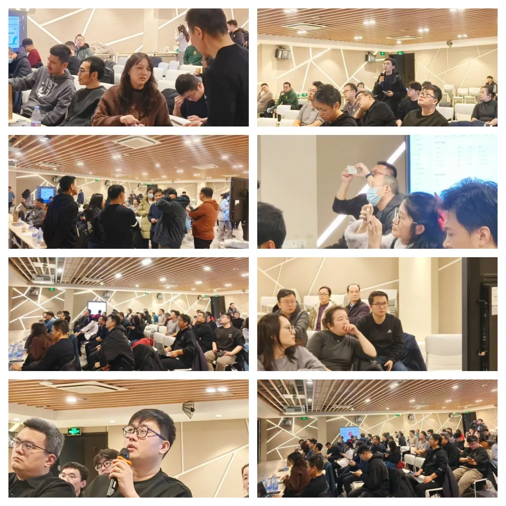

12 月 27 日，HAMi Meetup 北京站在近百位技术伙伴的参与下圆满落幕。作为 HAMi 社区的第二场线下活动，本次 Meetup 聚焦国产算力的生产实践与异构调度工程落地，来自贝壳、海光信息、第四范式、昆仑芯等企业的工程师分享了他们的一线经验。

<!-- truncate -->

## 活动开场

Linux 基金会副总裁、CNCF 亚太区中国主席 Keith Chan 在开场分享中提到：AI 的发展正在从模型本身转向对底层基础设施与资源效率的考验。GPU 成本高、资源利用率不足已成为全球共性问题，如何通过云原生与开源技术构建更弹性的 AI 基础设施，是整个行业面临的共同课题。

## 主题分享

### HAMi 新特性与能力矩阵标准化

HAMi 社区 Maintainer 李孟轩介绍了项目在异构算力调度领域的技术演进。作为 CNCF Sandbox 项目，HAMi 已在多种 AI 加速器场景验证了应用无侵入、强隔离、易部署等核心能力。

**新特性与规划：**

- CDI 支持、Mock Device Plugin 等特性改进
- Ascend Device Plugin 与 Volcano 调度器的深度适配
- 计划推出轻量化方案 HAMi-DRA，基于 Kubernetes DRA 架构简化调度链路
- 建立设备能力矩阵，评估不同设备在显存隔离、算力控制等方面的支持情况

### DCU 软件虚拟化从基础到实践

海光信息研发工程师王忠勤分享了 DCU 在云原生环境中的虚拟化实践。他介绍了如何基于 hy-smi 工具实现 vDCU 在算力与显存维度的精细化切分，以及 DCU-Device-Plugin 与 HAMi 调度器的协同架构。

**关键内容：**

- vDCU 的资源隔离与运行时一致性实现
- 标准化设备插件框架与多种运行模式支持
- DCU-Exporter 在物理 DCU 与 vDCU 监控中的应用

### 贝壳 × HAMi：vGPU 推理集群实践

贝壳找房算力平台开发工程师王妮分享了 HAMi 在大规模 GPU 管理场景下的落地经验。

**实践成果：**

- 基于显存切片的 vGPU 弹性池化能力
- 支持多型号 GPU 共存、多集群统一调度
- 千万级日请求量下的稳定运行
- GPU 利用率提升约 3 倍

### HAMi-Core x DRA：原生 DRA Driver 实践

第四范式研发工程师、HAMi Approver 杨守仁分享了 HAMi-Core 从传统 Device Plugin 向原生 DRA Driver 的演进。

**技术要点：**

- 采用 KEP-5075（DRA: Consumable Capacity）标准
- 结合 ResourceClaim、ResourceSlice 原生对象
- 通过 CDI 与 libvgpu 实现不侵入业务容器的资源管理

### HAMi 设备插件新功能

第四范式平台工程师 James 介绍了 HAMi 设备插件在昇腾场景下与 Volcano 调度器的集成。

**关键改进：**

- Ascend Device Plugin 的设备初始化、筛选与分配机制
- Mock Device Plugin 方案补齐显存等资源维度
- 提升异构设备在多调度器环境下的可观测性

### HAMi v2.7.0 国产算力适配

睿思智联研发工程师、HAMi Reviewer 欧阳陆伟分享了昆仑芯 P800 vXPU 场景下的工程实践。

**实践亮点：**

- HAMi-Scheduler 的拓扑感知调度能力
- 多 XPU、多节点环境下的合理调度决策
- 调度可观测性改进：规范化日志、丰富事件信息

## 交流环节

现场围绕 GPU/DCU/XPU 虚拟化、推理与训练混部策略、国产加速器适配成本等问题展开了热烈讨论。

## PPT 分享

PPT 下载链接：[HAMi Meetup 北京站 PPT 合集](https://github.com/Project-HAMi/community/tree/main/hami-meetup/02-北京-20251227)

## 结语

算力效率不是单点能力，而是调度、虚拟化、软件栈与业务场景共同作用的结果。欢迎更多 HAMi 用户分享你的实践故事，共同推动社区发展。
