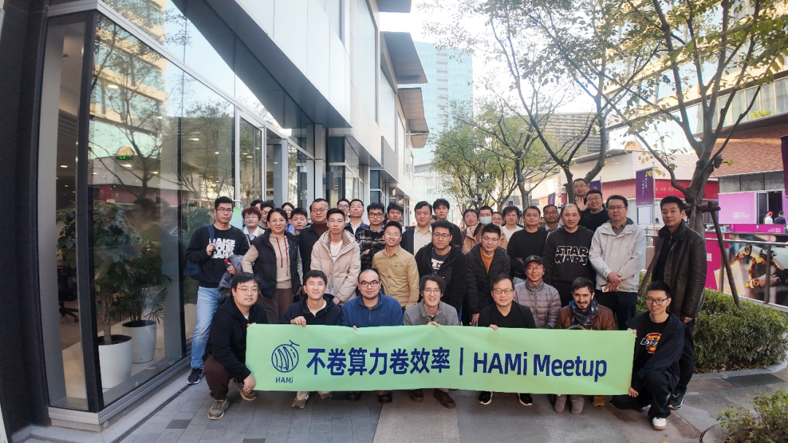
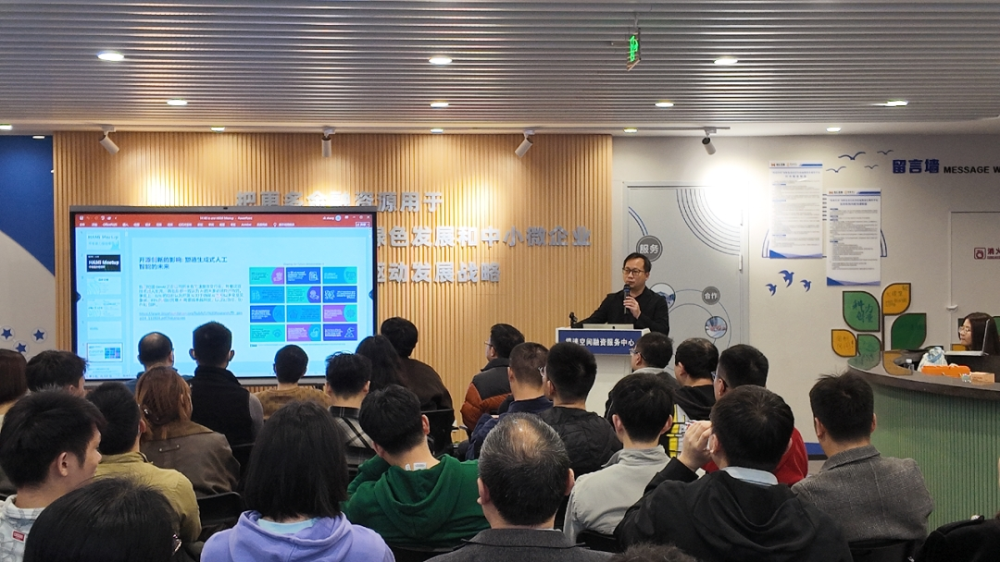
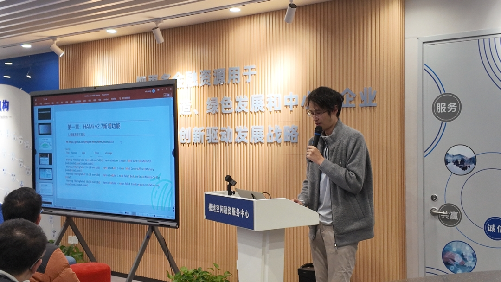
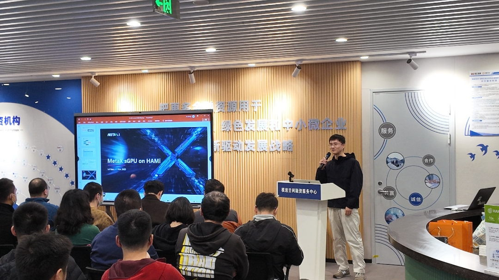
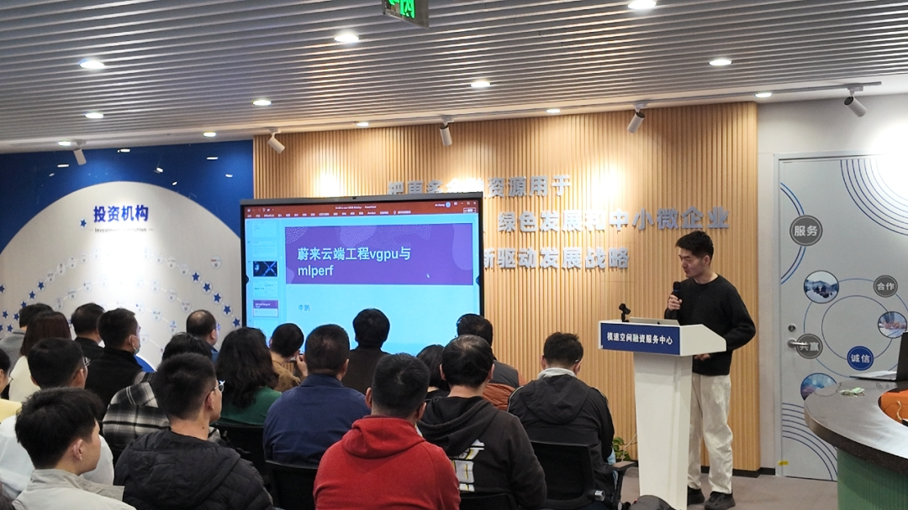
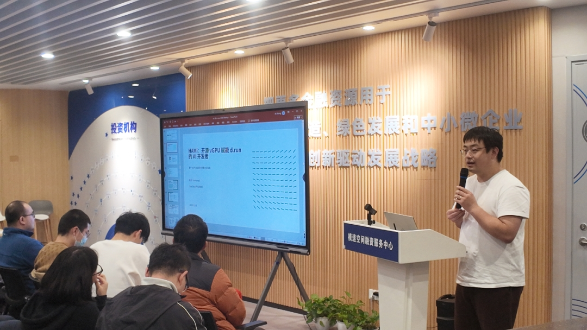
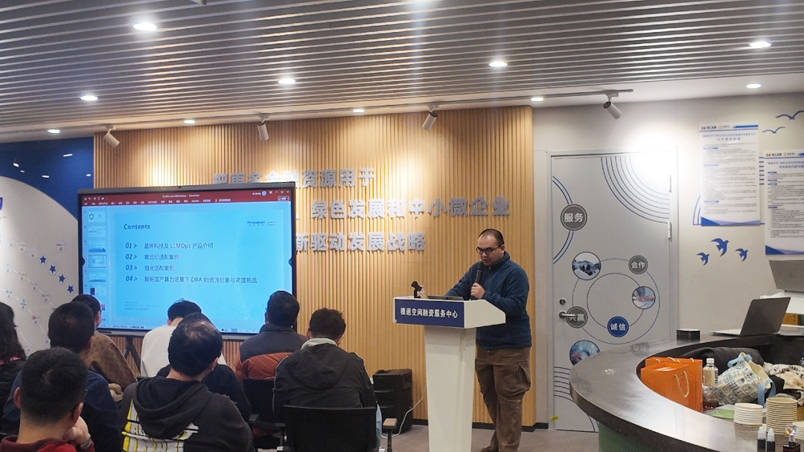
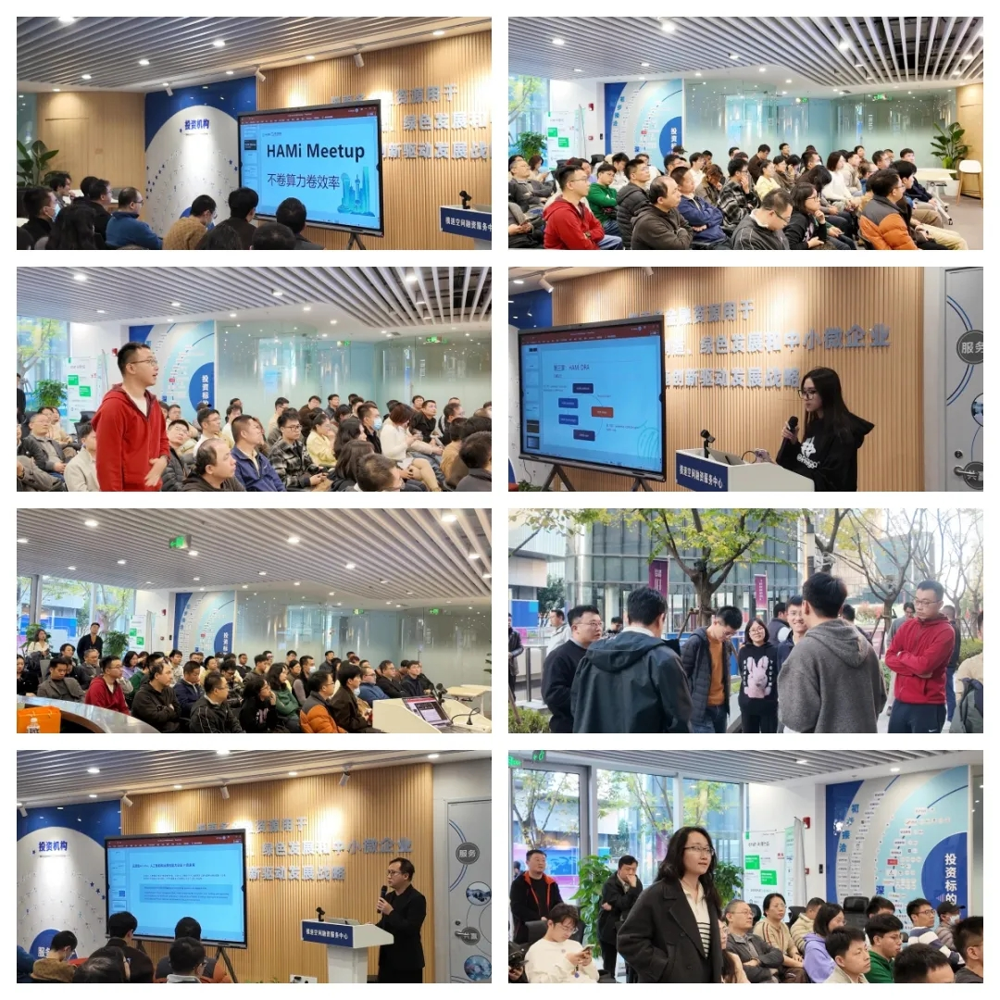

11 月 30 日，首场 HAMi Meetup 在上海圆满结束。本次活动以"不卷算力卷效率"为主题，近百位 AI 开发者、运维工程师、企业 IT 架构师齐聚现场，聚焦异构算力调度的核心命题。

<!-- truncate -->

## 开场：云原生 AI 基础设施

Linux 基金会副总裁、CNCF 亚太区中国主席 **Keith Chan** 在开场演讲中指出：

- GPU 成本高、资源利用率不足已成为全球共性问题
- 70%–80% 的推理与训练工作负载已运行在 Kubernetes 上
- 超过 80% 的企业认为"开源是 AI 成熟的关键驱动力"
- CNCF 正推动 Certified AI Platform for Kubernetes 标准化计划

## 技术分享回顾

### HAMi 2.7.0 - 2.8.0 版本演进

HAMi 核心 Maintainer **李孟轩** 介绍了从 2.7.0 到 2.8.0 的能力演进：

**2.7.0 可用性改进：**

- 调度原因可视化：一眼看出 Pod 为什么 Pending
- 资源配额监控优化：解决虚拟化带来的 quota 失真问题

**生态支持：**

- 已支持 9 家厂商 GPU
- 扩展到昆仑芯 XPU、AWS Trainium/Inferentia 等异构设备
- Web UI 提供更友好的能力展示

**2.8.0 规划：**

- 优化调度性能与 Web UI 的异构设备支持
- 通过 DRA 将原有 scheduler 与 device plugin 能力收敛到新的 DRA driver

### MetaX sGPU on HAMi

沐曦股份云原生基础架构专家 **郭磊** 分享了 sGPU 在 HAMi 社区的落地实践：

**核心能力：**

- 显存以 1MB 级粒度、算力以 1% 粒度配置
- Pod 可按需申请"60% 算力 + 4GB 显存"等虚拟 GPU 资源
- 节点级与 GPU 级 binpack/spread 策略灵活组合

**QoS 策略：**

- best effort、fixed share、burst share 多种策略
- 在线/离线混部，资源紧张时自动暂停低优先级任务
- 拓扑感知调度优化通信链路

### 基于 vGPU 的性能优化

蔚来云端工程部训练加速负责人 **李鹏** 分享了虚拟化环境下的性能诊断框架：

**核心方案：**

- HAMi 基于 perf 的虚拟化机制提供无侵入式数据采集
- 拦截 CUDA/cuBLAS/NVML 等 GPU 核心库，无需改动业务代码
- 构建 CPU/GPU 双侧时间线，精确还原任务执行状态

**应用场景：**

- 已应用于蔚来自动驾驶训练场景
- 识别低并行度、通信阻塞等关键瓶颈
- 实现底层瓶颈定位 + 上层代码溯源的闭环诊断

### DaoCloud d.run 的 GPU 虚拟化实践

DaoCloud 产品负责人 **卢传佳** 分享了 d.run 智算调度平台在 SaaS GPU 租赁场景的实践：

**挑战：**

- 企业自建场景受限于"整卡"使用，利用率难以突破
- SaaS 租赁模式易受供需波动影响，GPU 池碎片化

**HAMi 的价值：**

- 动态切片与超配能力显著降低碎片化
- 单卡可输出更多 SKU（3G/6G/12G/24G 等）
- 显存动态扩容避免 OOM 触发容器重启
- 支持多集群池化管理、国产卡统一调度、租户级优先级与抢占

### 星环科技国产算力适配实践

星环科技 AI 工具平台研发 **侯雨希** 围绕 LLMOps 平台在寒武纪、海光等国产加速器上的适配实践展开分享：

**寒武纪适配：**

- 解决 sMLU 动态切片粒度限制
- 多型号资源名隔离与硬编码显存单元问题
- 通过节点 label、型号识别实现多型号管理

**海光 DCU 场景：**

- 解决设备 ID 不唯一问题，通过驱动 SDK 获取硬件序列号
- 重写 exporter 逻辑，确保指标与调度一致性

**未来方向：**

- DRA 将成为异构 GPU 的统一抽象方向
- 完成从自定义到 Kubernetes 原生的升级

## 交流环节

现场围绕 GPU 虚拟化实践、模型推理效率优化、国产加速器适配经验等主题展开了热烈讨论。

## PPT 分享

PPT 下载链接：[HAMi Meetup 上海站 PPT 合集](https://github.com/Project-HAMi/community/tree/main/hami-meetup/01-shanghai-20251130)

## 结语

本次 HAMi Meetup 聚焦提升算力效率，沉淀了多份企业级实战干货。从技术细节探讨到业务场景适配，从开源生态共建到国产算力创新，交流充分体现了行业对云原生 AI 基建的高关注度。

未来，HAMi 社区将继续以开源力量为纽带，联动更多行业伙伴，深耕异构算力调度领域。也期待更多社区用户和从业者踊跃投稿，分享你的实践经验！
