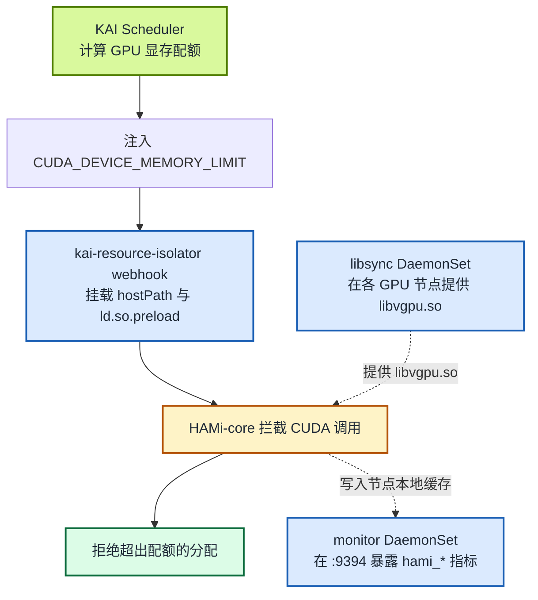

上一篇 [《HAMi-core 被 NVIDIA KAI Scheduler 采用》](/zh/blog/hami-core-adopted-by-nvidia-kai-scheduler)已经介绍了 KAI Scheduler 和这项集成的协作背景。本文不再重复铺垫，只回答一个问题：**KAI Scheduler 把两个 Pod 调度到同一张 GPU 后，HAMi-core 是否真的能限制每个 Pod 的显存用量？**

我们在 GKE 1.35/COS/CDI 上验证了当前文档支持的组合：KAI Scheduler v0.17.0 与 `kai-resource-isolator` 1.1.0-chart。两个 Pod 共享同一张 NVIDIA T4，各自看到 4147 MiB 上限；申请 3 GiB 成功，累计申请 5 GiB 失败。可选的 monitor 也导出了两个 Pod 的实时显存上限与用量。

:::note 关于实测输出

下文的 UUID、显存上限、CUDA 分配结果和 monitor 指标均来自该次 GKE 实测。资源后缀和地址在不同集群中会变化。

:::

<!-- truncate -->

## 集成如何工作

整条链路只有三项职责：

- **KAI Scheduler** 决定 Pod 使用哪张 GPU，并通过 `CUDA_DEVICE_MEMORY_LIMIT` 注入计算出的显存配额。
- **`kai-resource-isolator`** 分发 `libvgpu.so`；其 webhook 为业务 Pod 挂载该库并配置 `ld.so.preload`。可选的 monitor 读取节点本地 HAMi 缓存，在 `:9394` 暴露 `hami_*` 指标。
- **HAMi-core（`libvgpu.so`）** 拦截 `cudaMalloc` 等 CUDA 调用，拒绝超出配额的显存分配。



`CUDA_DEVICE_MEMORY_LIMIT` 是调度层与隔离层之间的契约。KAI 不需要知道 CUDA 调用如何被拦截，HAMi-core 也不需要知道配额如何计算。KAI 保留自己的调度逻辑；它集成的是 HAMi-core，而不是用完整的 HAMi 平台替换自身调度器。

容器启动时，动态链接器会先于 CUDA 库加载 `libvgpu.so`。HAMi-core 读取注入的配额，跟踪容器显存用量，改写设备查询结果，使 `nvidia-smi` 等工具只显示该配额；新的分配一旦越界就返回错误。这是在 CUDA API 层强制执行，并非依赖应用自觉遵守一个数值。

## 在已有 GPU 集群上的标准集成步骤

下面默认 Kubernetes 集群中的 NVIDIA GPU 已经可用：节点能够上报 `nvidia.com/gpu`，普通整卡 Pod 也能正常执行 `nvidia-smi`。这里只写标准集成路径，不包含实验 12 中针对 GKE 的特殊适配。

### 1. 安装 KAI Scheduler

启用 GPU 共享与 `hamicore` binder 插件：

```bash
helm install kai-scheduler \
  oci://ghcr.io/kai-scheduler/kai-scheduler/kai-scheduler \
  --namespace kai-scheduler --create-namespace \
  --version v0.17.0 \
  --set global.gpuSharing=true \
  --set binder.plugins.hamicore.enabled=true

kubectl -n kai-scheduler wait --for=condition=available \
  --timeout=180s deploy --all
kubectl -n kai-scheduler wait --for=condition=Ready \
  --timeout=300s config/kai-config
kubectl get pods -n kai-scheduler
kubectl get queues
```

正常情况下，KAI 的所有组件都处于运行状态，并且默认父子队列已经创建。Pod 后缀会因环境而异：

```text
NAME                                  READY   STATUS
admission-...                         1/1     Running
binder-...                            1/1     Running
kai-operator-...                      1/1     Running
kai-scheduler-default-...             1/1     Running
pod-grouper-...                       1/1     Running
podgroup-controller-...               1/1     Running
queue-controller-...                  1/1     Running

NAME                   PARENT
default-parent-queue
default-queue          default-parent-queue
```

### 2. 安装 kai-resource-isolator

安装 HAMi-core 库分发组件、注入 webhook 和可选的 monitor：

```bash
helm install kai-resource-isolator \
  oci://docker.io/projecthami/kai-resource-isolator \
  --namespace kai-resource-isolator --create-namespace \
  --version 1.1.0-chart \
  --set monitor.enabled=true

kubectl rollout status ds/kai-resource-isolator-libsync \
  -n kai-resource-isolator --timeout=300s
kubectl rollout status ds/kai-resource-isolator-monitor \
  -n kai-resource-isolator --timeout=300s
kubectl rollout status deploy/kai-resource-isolator-webhook \
  -n kai-resource-isolator --timeout=300s
kubectl get pods -n kai-resource-isolator
```

每个 GPU 节点上都应该有一个就绪的 libsync Pod 和一个就绪的 monitor Pod，同时 webhook 也应处于就绪状态：

```text
NAME                                  READY   STATUS
kai-resource-isolator-libsync-...     1/1     Running
kai-resource-isolator-monitor-...     1/1     Running
kai-resource-isolator-webhook-...     1/1     Running
```

### 3. 运行一个共享 GPU Pod

`gpu-memory` 注解使用不带单位后缀的整数 MiB。队列标签与 `schedulerName` 会让 Pod 经 KAI Scheduler 调度：

```bash
kubectl apply -f - <<'EOF'
apiVersion: v1
kind: Pod
metadata:
  name: kai-hami-check
  labels:
    kai.scheduler/queue: default-queue
  annotations:
    gpu-memory: "4096"
spec:
  schedulerName: kai-scheduler
  containers:
    - name: cuda
      image: nvidia/cuda:12.4.1-base-ubuntu22.04
      command: ["sleep", "infinity"]
EOF

kubectl wait --for=condition=Ready pod/kai-hami-check --timeout=5m
kubectl get pod kai-hami-check -o wide
```

Pod 应该处于 `Running` 状态，并被调度到一个 GPU 节点：

```text
NAME             READY   STATUS    NODE
kai-hami-check   1/1     Running   gpu-node-1
```

### 4. 检查调度层到运行时的交接

检查 KAI 提供的配额、isolator 注入的 preload 文件，以及 HAMi-core 向容器暴露的显存：

```bash
kubectl exec kai-hami-check -- sh -lc '
  test -n "$CUDA_DEVICE_MEMORY_LIMIT"
  test -f /usr/local/vgpu/libvgpu.so
  printf "limit=%s\n" "$CUDA_DEVICE_MEMORY_LIMIT"
  cat /etc/ld.so.preload
  nvidia-smi --query-gpu=uuid,memory.total --format=csv,noheader
'
```

在一张 15360 MiB T4 上申请 4096 MiB 时，实测输出为：

```text
limit=4147m
/usr/local/vgpu/libvgpu.so
GPU-9acc8878-3967-5fb4-c534-43d6fd820fa6, 4147 MiB
```

这三行可以证明集成链路已经生效：KAI 提供了显存配额，isolator 注入了 HAMi-core，容器看到的是隔离后的上限而非整卡显存。结果是 4147 而不是刚好 4096 MiB，是因为 KAI 会先把请求换算成两位小数的 GPU fraction，再计算最终强制上限。

### 5. 检查可选的 monitor

每个 monitor 只读取本节点上的缓存，因此要选择与业务 Pod 位于同一节点的 monitor。在一个终端中保持下面的端口转发命令运行：

```bash
export WORKLOAD_NODE=$(kubectl get pod kai-hami-check \
  -o jsonpath='{.spec.nodeName}')
export MONITOR_POD=$(kubectl get pods -n kai-resource-isolator \
  -l app.kubernetes.io/component=kai-vgpu-monitor \
  --field-selector="spec.nodeName=$WORKLOAD_NODE" \
  -o jsonpath='{range .items[*]}{.metadata.name}{"\n"}{end}' | head -n 1)
test -n "$MONITOR_POD" || {
  echo "$WORKLOAD_NODE 上没有运行 monitor Pod" >&2
  exit 1
}
kubectl port-forward -n kai-resource-isolator \
  "pod/$MONITOR_POD" 9394:9394
```

在另一个终端确认端点中存在该 Pod 的指标：

```bash
curl -s http://127.0.0.1:9394/metrics | grep \
  'hami_vgpu_memory_limit_bytes.*pod="kai-hami-check"'
```

输出格式应类似：

```text
hami_vgpu_memory_limit_bytes{...,pod="kai-hami-check",...} 4.348444672e+09
```

以上检查足以确认基本集成链路正确。要证明显示出来的上限确实无法越过，还需要执行一次 CUDA 分配测试：配额内成功、超额失败。下一节汇总了这项实测结果，实验 12 则提供完整程序和操作过程。

完成基本检查后删除测试 Pod：

```bash
kubectl delete pod kai-hami-check
```

## GKE 实测：隔离是否真的生效？

验证环境是 GKE 1.35/COS/CDI 集群，包含三个 `n1-standard-2` 节点，每个节点有一张 NVIDIA T4。KAI Scheduler v0.17.0 负责共享调度，`kai-resource-isolator` 1.1.0-chart 负责注入 HAMi-core。

| 检查项 | 实测结果 | 证明了什么 |
| :-- | :-- | :-- |
| 节点与 GPU UUID | 两个 Pod 位于同一单卡节点，并返回 `GPU-9acc8878-...` | 它们共享同一张物理 T4 |
| 可见显存 | 两个 Pod 均报告 `4147 MiB`，整卡报告 `15360 MiB` | HAMi-core 暴露了 KAI 分配给各 Pod 的配额 |
| CUDA 分配 | 3 GiB 成功，累计 5 GiB 返回 `out of memory` | 上限确实执行，而不只是显示值变化 |
| 并发隔离 | Pod A 持有 3 GiB 时，Pod B 仍能申请自己的 3 GiB | 一个 Pod 无法占用另一个 Pod 的配额 |
| Monitor 指标 | 同节点 `:9394/metrics` 返回两个 Pod 的 4.348 GB 上限和 3.328 GB 实时用量 | monitor 从容器缓存导出了非空的 Pod 级指标 |

超额分配时，HAMi-core 记录：

```text
Device 0 OOM 5475663872 / 4348444672
allocate another 2 GiB: out of memory
PASS: in-quota allocation succeeded and over-quota allocation failed
```

这些结果把“调度到同一张卡”“容器内只见自身配额”“CUDA 分配确实越不过上限”和“monitor 能观测实时用量”连成了一条完整证据链。由于 monitor 读取节点本地缓存，实验会直接查询业务 Pod 所在节点的 monitor 实例，避免 Service 把请求转发到其他节点。

:::note 隔离边界

这里验证的是 CUDA API 层的显存限制，不是 MIG 一类硬件安全边界。本次 GKE 兼容路径还使用了特权业务容器，因此不应作为不可信多租户安全方案。

:::

## 复现实测结果

标准 KAI + HAMi-core 安装链路并不长。GKE 1.35/COS/CDI 还需要针对只读根文件系统、RuntimeClass、NVML 库路径、CDI 设备注入和 PriorityClass 做环境适配。完整操作、实测命令输出与故障排查统一维护在：

**[实验 12：在 GKE 上验证 KAI Scheduler 与 HAMi 显存隔离](/zh/tutorials/labs/kai-scheduler-hami-gke)**

## 下一步

- 背景与协作过程：[《HAMi-core 被 NVIDIA KAI Scheduler 采用》](/zh/blog/hami-core-adopted-by-nvidia-kai-scheduler)
- 用户文档：[如何在 KAI Scheduler 中使用 HAMi](/zh/docs/next/userguide/kai-scheduler/how-to-use-kai-scheduler)
- 相关仓库：[KAI-resource-isolator](https://github.com/Project-HAMi/KAI-resource-isolator)、[HAMi-core](https://github.com/Project-HAMi/HAMi-core) 和 [KAI-Scheduler](https://github.com/kai-scheduler/KAI-Scheduler)
