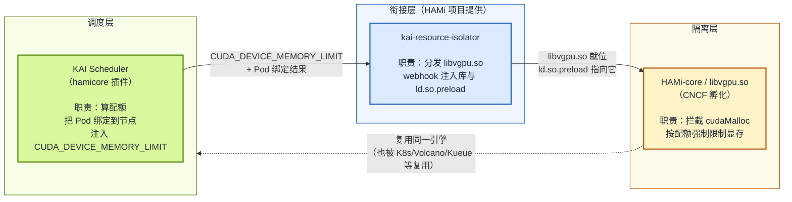
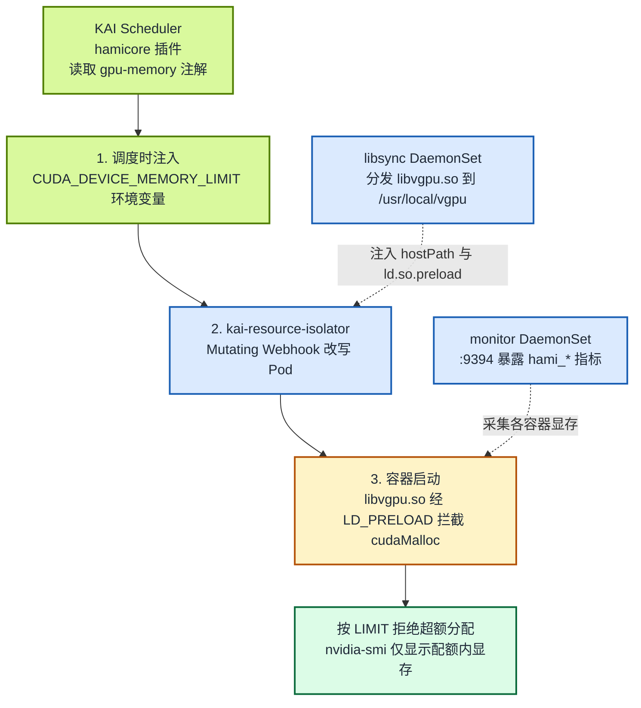
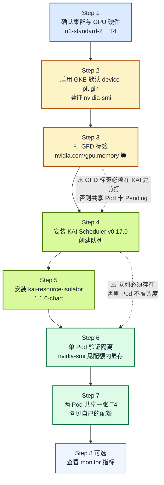

GPU 共享在 Kubernetes 生态里讨论了很多年，但调度层与隔离层长期各自为政：调度器把几个 Pod 分到同一张卡，容器进入 GPU 后却依然能看到整张卡的显存，谁先发起 `cudaMalloc` 谁就占满，隔离形同虚设。所谓「共享」其实只是「抢」，没有任何资源保障可言。

要解决这个问题，需要调度层（决定「谁能用哪张卡、用多少」）和隔离层（保证「说好用多少就只能用多少」）协同。**HAMi-core** 正是这样一个可被多种调度器复用的隔离底座。在 KAI Scheduler 之前，它已经支持 Kubernetes 原生调度器（经 HAMi 自带的 `hami-scheduler` 扩展）、[Kueue](/zh/docs/userguide/kueue/how-to-use-kueue)、[Volcano](/zh/docs/installation/how-to-use-volcano-vgpu) 等（完整生态见 [HAMi 生态集成](/zh/docs/next/core-concepts/ecosystem-integrations)）。

**自 KAI Scheduler v0.16.4 起，NVIDIA 的 KAI Scheduler 也正式加入这一行列**，把 HAMi-core 作为其 GPU 共享的隔离引擎内置支持（当前版本为 v0.17.0）。这意味着用 KAI Scheduler 调度 GPU 工作负载时，不再只有「协作式共享」，而是有了真正的硬隔离保障。本文讲清两件事：

- **原理**：KAI Scheduler、`kai-resource-isolator`、HAMi-core 三者各自负责什么、如何衔接，以及 `CUDA_DEVICE_MEMORY_LIMIT` 这一契约如何把调度层与隔离层连起来。
- **实践**：一套可在 GKE 上完整复现的验证示例（单张 NVIDIA T4 卡，两个 Pod 共享，各自只见自己的显存配额），每一步都附配置文件、预期输出，以及「为什么这样做」的解释。

背景故事与协作时间线见 [《HAMi-core 被 NVIDIA KAI Scheduler 采用：GPU 共享正式迈入硬隔离时代》](/zh/blog/hami-core-adopted-by-nvidia-kai-scheduler)。

:::note 关于本文的输出

下半部分的命令为可在 GKE 上完整复现的步骤，所附命令输出与指标为预期示意，实际数值以你的集群环境为准。

:::

<!-- truncate -->

## 背景：为什么「共享」不等于「隔离」

| 层次 | 负责方 | 解决了什么 | 没有解决什么 |
| --- | --- | --- | --- |
| 调度层 | KAI Scheduler、Volcano、Kueue 等 | 多个 Pod 能被分到同一张 GPU | 容器内仍可见全部显存 |
| 运行时层 | HAMi-core（`libvgpu.so`） | 拦截 CUDA 调用，按配额限制显存 | 单独使用时，不知道每个 Pod 该分多少 |

要实现真正的 GPU 共享，这两层缺一不可，而且必须协同：调度层决定「谁能用哪张卡、用多少」，隔离层保证「说好用多少就只能用多少」。问题是，**隔离层需要知道「到底用多少」这个数字，而它本身是算不出来的，这个数字来自调度层**。

HAMi 社区多年打磨的 HAMi-core（CNCF 孵化项目）正是这样的隔离层，而且它是**与调度器解耦**的：在 KAI Scheduler 之前，HAMi-core 已经通过不同的方式与 Kubernetes 原生调度器（经 HAMi 自带的 `hami-scheduler` 扩展）、[Kueue](/zh/docs/userguide/kueue/how-to-use-kueue)、[Volcano](/zh/docs/installation/how-to-use-volcano-vgpu)、Koordinator 等协同工作（完整生态见 [HAMi 生态集成](/zh/docs/next/core-concepts/ecosystem-integrations)）。

**KAI Scheduler 在 v0.16.4 正式加入这一行列**，把 HAMi-core 作为其 GPU 共享的隔离引擎内置支持。本文要讲清的，就是 KAI Scheduler 这条集成路径上三个组件各自的角色，以及它们之间如何衔接。

## 运行原理：一个契约、三步协作

### 三个组件各是什么、各做什么

先把三个名字容易混淆的组件讲清楚，这是理解整条链路的前提：

- **HAMi-core（`libvgpu.so`）**：HAMi 项目的 CUDA 拦截库（CNCF 孵化），是**隔离引擎本身**。它通过 `LD_PRELOAD` 拦截容器里的 CUDA 调用（如 `cudaMalloc`），按一个显存配额强制限制。它不关心配额是谁给的：任何调度器只要按约定把配额传进来，它都能执行隔离。在 KAI 之前，它已经被 HAMi 自带的 device-plugin/webhook、Volcano 的 `volcano-vgpu-device-plugin` 等复用。

- **KAI Scheduler**：NVIDIA 开源的 Kubernetes AI 工作负载调度器（源自 Run:ai，CNCF Sandbox）。它只负责**调度层**，即决定 Pod 落到哪个节点、用哪张 GPU、分多少显存。自 v0.16.4 起，它的 `hamicore` 插件在绑定 Pod 时，会把算好的显存配额写进容器的环境变量。

- **`kai-resource-isolator`**：HAMi 项目侧为 KAI Scheduler 这条集成路径**专门提供的配套组件**。它把 HAMi-core 的 `libvgpu.so` 分发到每个 GPU 节点，并用 MutatingWebhook 改写 Pod，把库和 `ld.so.preload` 注入进去。换言之，它是「把 KAI 的调度决策落地成 HAMi-core 能执行的隔离」的桥梁。



一句话：**KAI Scheduler 算配额，`kai-resource-isolator` 把隔离库就位，HAMi-core 在运行时真正执行隔离。**

:::note 为什么是 HAMi-core，不是完整 HAMi 平台

KAI Scheduler 的集成目标是 **HAMi-core 本身**，而不是完整的 HAMi 平台。KAI 保留自己的调度能力（不替换成 `hami-scheduler`），只引入 HAMi-core 来做 GPU 显存隔离。这与 Volcano（用 `volcano-vgpu-device-plugin` + HAMi-core）的分工模式是同一思路：调度器各用各的，隔离引擎共用 HAMi-core。

:::

### 契约：`CUDA_DEVICE_MEMORY_LIMIT`

整条链路之所以能成立，是因为调度层和隔离层约定了一个极简的交接点：环境变量 **`CUDA_DEVICE_MEMORY_LIMIT`**。

- **KAI Scheduler（调度层）** 负责算出「这个 Pod 能用多少显存」，并在绑定节点时把它写进容器的环境变量。
- **HAMi-core（隔离层）** 负责读这个环境变量，并在运行时真正把显存用量卡在这个上限以内。

这个契约之所以重要，是因为它**把两件事彻底解耦**：KAI 不需要知道 CUDA 怎么被拦截，HAMi-core 不需要知道份额是怎么算出来的。两边只要都遵守 `CUDA_DEVICE_MEMORY_LIMIT` 这一个变量，任何调度器都能复用同一套隔离引擎。这正是 HAMi-core 能同时支持多个调度器的根本原因（见文末「这意味着什么」）。

### 三步协作



一句话概括：**KAI 说「你只能用这么多」，isolator 负责「让你真的只能用这么多」。**

三个组件的分工如下（详见 [KAI Scheduler 官方文档「HAMi 资源隔离」](https://github.com/kai-scheduler/KAI-Scheduler/blob/main/docs/gpu-sharing/hami/README.md)）：

- **libsync DaemonSet**：把 `libvgpu.so` 复制到每个 GPU 节点的 `/usr/local/vgpu`。
- **mutating webhook**：给 Pod 注入 hostPath 卷挂载，把 `/etc/ld.so.preload` 指向 `libvgpu.so`，并写入 `POD_UID`、`CONTAINER_NAME`、`CONTAINER_VGPU_MOUNT` 环境变量。
- **monitor DaemonSet**（可选）：读取各容器的共享内存缓存，在 `:9394` 暴露指标。

### CUDA 拦截是如何生效的

隔离的「最后一公里」发生在容器进程里，链路是这样的：

1. **KAI 在调度时注入 `CUDA_DEVICE_MEMORY_LIMIT`**（带上 Pod 申请的显存配额，单位 MiB）。
2. **kai-resource-isolator 的 webhook 改写 Pod**：挂载宿主机上的 `libvgpu.so`，并把 `/etc/ld.so.preload` 指向它。`ld.so.preload` 是动态链接器的机制，被列在里面的共享库会在所有其他库之前加载。
3. **容器进程启动后**，任何对 CUDA 运行时（`libcudart`）或驱动 API 的调用，都会先经过 `libvgpu.so`。后者拦截 `cudaMalloc` 之类的显存分配调用，从 `CUDA_DEVICE_MEMORY_LIMIT` 读出配额，累计该容器的显存用量；一旦超额就拒绝分配。
4. **对外可见的效果**：`nvidia-smi` 只显示配额内的显存（HAMi-core 会改写设备查询的返回值），容器再怎么 `cudaMalloc` 也越不过这条线。

这就是「硬隔离」的含义：不是靠应用自觉，而是在 CUDA 调用这一层强制执行。

:::tip 集成的来龙去脉

这条集成路径是 HAMi 社区与 NVIDIA KAI Scheduler 团队一年多协作的结果，分工很清晰：KAI 负责注入环境变量，HAMi 负责资源隔离组件。完整的时间线与参与人员见姊妹篇 [《HAMi-core 被 NVIDIA KAI Scheduler 采用》](/zh/blog/hami-core-adopted-by-nvidia-kai-scheduler)。

:::

## 这两个版本带来了什么

### KAI Scheduler（自 v0.16.4 起内置 HAMi-core 硬隔离）

KAI Scheduler 对 HAMi-core 的支持自 **v0.16.4** 起成为内置能力（本文示例使用当前版本 v0.17.0）。关键在于 `hamicore` 插件：启用后，KAI 在把共享 GPU 的 Pod 绑定到节点时，会按 `gpu-memory`（或 `gpu-fraction`）注解向容器注入 `CUDA_DEVICE_MEMORY_LIMIT` 环境变量，这正是上一节契约里 HAMi-core 执行隔离所需的配额。

v0.17.0 中其他与 GPU 相关的改动还包括：修正共享 Pod 名称带「`/`」造成的非法卷名问题；修正 `MinNodeGPUMemoryMiB` 与 fractional `gpu-memory` 的分配计算；overLimit 判定改用集群最大 GPU 规格。此外还有 preemption-delay（为 Cluster Autoscaler 留出拉起节点的时间窗）、NUMA 感知打分、GitOps 与 ArgoCD 安装支持等。

### kai-resource-isolator 1.1.0-chart

这是与 HAMi 配套发布的隔离器。它接收 KAI 注入的配额，在容器真正运行起来之前，把 HAMi-core 的 `libvgpu.so` 注入到位。相对首个版本，1.1.0 补齐了一组让它具备生产可用性的改进：

- **新增 `kai-vgpu-monitor`**：以 DaemonSet 形式运行，在 `:9394` 暴露 HAMi 兼容指标（`hami_vgpu_memory_used_bytes`、`hami_vgpu_memory_limit_bytes`、`hami_container_device_utilization_ratio`），支持 ServiceMonitor，可被 Prometheus 直接抓取。
- **多容器注入修复**：一个 Pod 内有多个容器时，webhook 现在能正确处理，不再漏注。
- **安全收紧**：webhook 改用命名空间内 Issuer（不再使用 ClusterIssuer），ClusterRole 收回读 Secret 的权限。
- **全局镜像仓库**优先级理顺，`hamicore` 安装参数修正。

## 实践：在 GKE 上验证硬隔离

示例运行在一个已有的 GKE 集群上：**3 个 `n1-standard-2` 节点，每节点挂载 1 张 NVIDIA T4（`nvidia-smi` 实测显存 15360 MiB）**。两个容器各申请约 4 GiB，共享其中一张 T4；`nvidia-smi` 里各自只见自己的配额，互不干扰。下面每一步都给出配置、预期输出，以及为什么这样做。

下图是整个实验的总览：8 个步骤的顺序，以及其中两个最容易踩坑的前置依赖（GFD 标签必须在 KAI 之前打好；队列必须存在才会调度）。注意：本文**不需要安装 NVIDIA GPU Operator**，GKE 默认的 device plugin + 驱动 + container toolkit 已经够用，下面只要「启用默认 device plugin」和「补几个 GFD 标签」两步准备即可。



### 前置条件

- 一个 GCP 项目，已启用 GKE 与 Compute Engine API。
- 一个已有的 GKE 集群，节点池里带 NVIDIA T4 GPU（本文示例为 3 个 `n1-standard-2` 节点，每节点 1× T4）。本例这个集群建的时候带了节点标签 `gke-no-default-nvidia-gpu-device-plugin=true`，即**禁用了 GKE 默认的 NVIDIA device plugin**，驱动则由 GKE 自动安装。这正是后面 Step 1 会看到的「硬件在、但 `nvidia.com/gpu` 资源为空」这一初始状态的由来，Step 2 会把 device plugin 重新启用。如果你还没建好，可以用下面的命令建一个同等规格的集群：

  ```bash
  gcloud container clusters create test-cluster --zone=asia-northeast1-a \
    --machine-type=n1-standard-2 --num-nodes=3 \
    --accelerator=type=nvidia-tesla-t4,count=1,gpu-driver-version=default
  gcloud container clusters get-credentials test-cluster --zone=asia-northeast1-a
  ```

  `n1` 机型本身不含 GPU，所以**必须**用 `--accelerator` 显式指定 T4；`gpu-driver-version=default` 让 GKE 自动安装匹配的 NVIDIA 驱动和 container toolkit。这样建出来的集群，device plugin 默认就是启用的（Step 2 可以跳过删标签那步）。

- `gcloud`、`kubectl`、`helm`（≥ 3）已登录，`kubectl` 已能访问该集群。
- KAI 队列由下文 Step 4 创建。

### Step 1：确认集群与 GPU 硬件就绪（初始状态）

集群已经建好后，先看一眼它的初始状态。这一步只看、不改。

```bash
kubectl get nodes -o custom-columns="NAME:.metadata.name,GPU:.status.capacity.nvidia\.com/gpu,ACCEL:.metadata.labels.cloud\.google\.com/gke-accelerator"
```

本例这个集群的初始输出是这样的：3 个节点，`ACCEL` 列都是 `nvidia-tesla-t4`（T4 硬件在），但 `GPU` 列是 `<none>`。

```
NAME                                          GPU      ACCEL
gke-test-cluster-default-pool-xxxxxxxx        <none>   nvidia-tesla-t4
gke-test-cluster-default-pool-yyyyyyyy        <none>   nvidia-tesla-t4
gke-test-cluster-default-pool-zzzzzzzz        <none>   nvidia-tesla-t4
```

**怎么读这个输出**：`ACCEL` 列的 `nvidia-tesla-t4` 确认 T4 硬件已经挂载到节点上，GKE 也已经把 NVIDIA 内核驱动装好了。但 `GPU` 列是 `<none>`，说明 **device plugin 还没上报 `nvidia.com/gpu` 资源**。原因是这个集群建的时候带了节点标签 `gke-no-default-nvidia-gpu-device-plugin=true`，把 GKE 默认的 NVIDIA device plugin 禁用了。下一启用它。

如果你的集群 `GPU` 列已经直接是 `1`（建集群时没禁用默认 device plugin），可以跳过 Step 2，直接到 Step 3 打 GFD 标签。

### Step 2：启用 GKE 默认 device plugin，并验证 GPU 可用

把节点上的 `gke-no-default-nvidia-gpu-device-plugin` 标签删掉，GKE 自带的 device plugin DaemonSet（它的调度规则是「这个标签不为 `true` 才上」）就会自动调度到节点上。

```bash
kubectl label node -l cloud.google.com/gke-accelerator=nvidia-tesla-t4 \
  gke-no-default-nvidia-gpu-device-plugin-
```

标签名末尾的 `-` 表示「删除这个标签」。执行后等大约 20 秒，device plugin Pod 就会起来：

```bash
kubectl get pod -n kube-system -o wide | grep nvidia-gpu-device-plugin | grep -v "0/0"
```

预期输出（示意）：3 个 `nvidia-gpu-device-plugin-*-ubuntu` Pod，每个节点一个，都是 `3/3 Running`。

```
NAME                                       READY   STATUS    NODE
nvidia-gpu-device-plugin-small-ubuntu-xxx  3/3     Running   gke-test-cluster-default-pool-xxxxxxxx
nvidia-gpu-device-plugin-small-ubuntu-yyy  3/3     Running   gke-test-cluster-default-pool-yyyyyyyy
nvidia-gpu-device-plugin-small-ubuntu-zzz  3/3     Running   gke-test-cluster-default-pool-zzzzzzzz
```

device plugin 起来后，`nvidia.com/gpu` 资源就有了：

```bash
kubectl get nodes -o custom-columns="NAME:.metadata.name,GPU:.status.capacity.nvidia\.com/gpu"
```

预期输出（示意）：每个节点的 `GPU` 列从 `<none>` 变成 `1`。

```
NAME                                          GPU
gke-test-cluster-default-pool-xxxxxxxx        1
gke-test-cluster-default-pool-yyyyyyyy        1
gke-test-cluster-default-pool-zzzzzzzz        1
```

**为什么不需要装 GPU Operator**：GKE 默认的 GPU 栈已经把三样东西都配好了：NVIDIA 内核驱动（GKE 自动装）、device plugin（刚启用）、container toolkit / nvidia runtime（`gpu-driver-version=default` 时 GKE 自动配）。GPU Operator 是把这些打包在一起自动管理的工具，但 GKE 自己已经在管了，再装反而会和 GKE 的驱动冲突（实测：GPU Operator 的驱动容器无法卸载 GKE 已加载的内核模块）。所以 GKE 上跑通实验，靠 GKE 默认栈就够了。

最后用一个真正的 GPU Pod 验证 toolkit 也工作（容器能跑 `nvidia-smi`）：

```bash
cat <<'EOF' | kubectl apply -f - && \
kubectl wait --for=condition=Ready pod/gpu-smi-test --timeout=120s && \
kubectl logs gpu-smi-test && \
kubectl delete pod gpu-smi-test
apiVersion: v1
kind: Pod
metadata:
  name: gpu-smi-test
spec:
  restartPolicy: Never
  containers:
    - name: cuda
      image: nvidia/cuda:12.4.1-base-ubuntu22.04
      command: ["nvidia-smi"]
      resources:
        limits:
          nvidia.com/gpu: 1
EOF
```

预期输出（实测）：能看到 T4 和驱动版本，注意显存是 **15360 MiB**（这是 T4 实际可寻址显存，下面 Step 3 打标签要用这个数）。

```
+-----------------------------------------------------------------------------------------+
| NVIDIA-SMI 580.159.04             Driver Version: 580.159.04     CUDA Version: 13.0     |
+-----------------------------------------+------------------------+----------------------+
|   0  Tesla T4                       Off |   00000000:00:04.0 Off |                    0 |
| N/A   45C    P8             17W /   70W |       0MiB /  15360MiB |      0%      Default |
+-----------------------------------------+------------------------+----------------------+
```

看到这张表，说明驱动、device plugin、toolkit 全部就位，容器已经能真正使用 GPU 了。

### Step 3：打 GFD 标签（KAI 调度需要）

KAI 的 hamicore 插件要靠节点标签 `nvidia.com/gpu.memory` 来知道每张卡的显存，才能把 `gpu-memory` 请求换算成分数。GKE 默认 device plugin 会打 `nvidia.com/gpu.present=true`，但**不打 `gpu.memory` / `gpu.count` / `gpu.product` 这几个**（那些通常由 GPU Feature Discovery 打，而 GKE 默认栈不跑完整 GFD）。所以需要手动补上。

用 Step 2 里 `nvidia-smi` 看到的显存值 **15360**（MiB）：

```bash
kubectl label node -l cloud.google.com/gke-accelerator=nvidia-tesla-t4 \
  nvidia.com/gpu.memory=15360 \
  nvidia.com/gpu.product=NVIDIA-Tesla-T4 \
  nvidia.com/gpu.count=1 \
  nvidia.com/gpu.present=true --overwrite
```

:::warning 关键一步：标签必须在安装 KAI 之前打好

KAI 的 hamicore 插件在**节点注册时**缓存每张卡的显存（读取 `node.labels["nvidia.com/gpu.memory"]`）。缺这个标签它会直接报错，共享 Pod 永远停在 `Pending`，日志中出现 `didn't have enough resources: GPU memory`。所以这一步必须在 Step 4 装 KAI **之前**完成。万一装完 KAI 才补标签，重启 `kai-scheduler` 让它重新缓存即可。

:::

确认标签到位：

```bash
kubectl get nodes -o custom-columns="NAME:.metadata.name,GPUMEM:.metadata.labels.nvidia\.com/gpu\.memory,GPUPROD:.metadata.labels.nvidia\.com/gpu\.product,GPUPRESENT:.metadata.labels.nvidia\.com/gpu\.present"
```

预期输出（示意）：每个节点的 `GPUMEM` 为 `15360`，`GPUPROD` 为 `NVIDIA-Tesla-T4`，`GPUPRESENT` 为 `true`。

```
NAME                                          GPUMEM   GPUPROD           GPUPRESENT
gke-test-cluster-default-pool-xxxxxxxx        15360    NVIDIA-Tesla-T4   true
gke-test-cluster-default-pool-yyyyyyyy        15360    NVIDIA-Tesla-T4   true
gke-test-cluster-default-pool-zzzzzzzz        15360    NVIDIA-Tesla-T4   true
```

**为什么是 `15360` 而不是 `16384`**：T4 标称 16 GiB，但 `nvidia-smi` 报告的实际可寻址显存是 15360 MiB（部分显存被驱动/ECC 预留）。KAI 用这个数把 `gpu-memory` 请求换算成分数，所以标签值必须和 `nvidia-smi` 的数字一致，否则 Pod 看到的上限会和你预期不符。

### Step 4：安装 KAI Scheduler v0.17.0，并创建队列

```bash
helm install kai-scheduler oci://ghcr.io/kai-scheduler/kai-scheduler/kai-scheduler \
  --set global.gpuSharing=true \
  --set binder.plugins.hamicore.enabled=true \
  --set binder.plugins.gpusharing.arguments.cdiEnabled=true \
  --namespace kai-scheduler --create-namespace \
  --version v0.17.0

# 等 admission webhook 就绪（签发证书需要一点时间），再创建队列，
# 否则 Queue 的创建会被拒绝。
kubectl -n kai-scheduler wait --for=condition=available --timeout=180s deploy --all
```

**为什么是这几个开关**：

- `global.gpuSharing=true` 打开共享调度，允许 KAI 把多个 Pod 放到同一张 GPU 上。
- `binder.plugins.hamicore.enabled=true` 让 KAI 在绑定时注入 `CUDA_DEVICE_MEMORY_LIMIT`，这是把调度层和隔离层连起来的那个契约。没开它，隔离层就拿不到配额，等于没装。
- `binder.plugins.gpusharing.arguments.cdiEnabled=true`：**GKE 1.33+ 必加**。KAI 的 gpusharing 插件默认 `cdiEnabled=false`（假设 GPU 通过 NVIDIA runtime 注入），但 GKE 1.33+ 的 containerd 用 CDI 模式（`enable_cdi=true`）注入 GPU。不开这个开关，KAI 创建的 GPU reservation Pod 会找不到 NVML（报 `ERROR_LIBRARY_NOT_FOUND`），共享 Pod 卡在 `Pending`。KAI 源码里 CDI 优先靠 GPU Operator 的 ClusterPolicy 自动检测，但我们没装 GPU Operator（见 Step 2），所以必须显式打开。（参考 [KAI binder 文档](https://github.com/kai-scheduler/KAI-Scheduler/blob/main/docs/developer/binder.md)。）

随后创建队列。**队列必须存在，KAI 才会调度。** Pod 靠 `kai.scheduler/queue: default-queue` 标签指向队列；队列（CRD `scheduling.run.ai/v2`）不存在，Pod 就一直 `Pending`。下面这份清单建立了 `default`（父）与 `default-queue`（子）两层，配额全部放开（`-1`），方便演示：

```yaml
# queue.yaml
apiVersion: scheduling.run.ai/v2
kind: Queue
metadata:
  name: default
spec:
  resources:
    cpu: { quota: -1, limit: -1, overQuotaWeight: 1 }
    memory: { quota: -1, limit: -1, overQuotaWeight: 1 }
    gpu: { quota: -1, limit: -1, overQuotaWeight: 1 }
---
apiVersion: scheduling.run.ai/v2
kind: Queue
metadata:
  name: default-queue
spec:
  parentQueue: default
  resources:
    cpu: { quota: -1, limit: -1, overQuotaWeight: 1 }
    memory: { quota: -1, limit: -1, overQuotaWeight: 1 }
    gpu: { quota: -1, limit: -1, overQuotaWeight: 1 }
```

```bash
kubectl apply -f queue.yaml
kubectl get queues
```

预期输出（示意）：

```
NAME            PARENT     AGE
default                    5s
default-queue   default    5s
```

两个队列都在、子队列正确指向父队列，才能进入下一步。

### Step 5：安装 kai-resource-isolator 1.1.0-chart

```bash
helm install kai-resource-isolator oci://docker.io/projecthami/kai-resource-isolator \
  --namespace kai-resource-isolator --create-namespace \
  --set monitor.enabled=true \
  --set monitor.serviceMonitor.enabled=true \
  --set paths.hostInstallBase=/home/kubernetes/bin/nvidia \
  --version 1.1.0-chart
```

**为什么版本号带 `-chart` 后缀**：chart 版本是 **`1.1.0-chart`**（带 `-chart` 后缀），对应的 git tag 是 `v1.1.0`，两者不要混淆，写成 `1.1.0` 或 `v1.1.0` 会拉不到包。若节点的 NVML 必须走 NVIDIA runtime，再补一个 `--set monitor.runtimeClassName=nvidia`（GKE GPU 节点默认已具备）。

**为什么改 `paths.hostInstallBase`**：isolator 的 libsync DaemonSet 要把 `libvgpu.so` 写到宿主机的 `{hostInstallBase}/vgpu/`，默认是 `/usr/local`。但 **GKE 节点的根文件系统是只读的**（ext2 `ro` 挂载），`/usr/local` 不可写，libsync 会报 `Read-only file system` 起不来。`/home/kubernetes/bin/nvidia` 是 GKE 上 NVIDIA 驱动所在的**可写**目录（也是 GKE 装 driver 的标准路径），所以把库放这里。非 GKE 的自建集群根文件系统可写时，这个参数可以不加（用默认 `/usr/local`）。

确认三个组件都已就绪：

```bash
kubectl -n kai-resource-isolator get pods
```

预期输出（示意）：

```
NAME                                    READY   STATUS
kai-resource-isolator-xxxxxxxx-xxxxx    1/1     Running   # webhook
kai-libsync-xxxxx                       1/1     Running   # 分发 libvgpu.so
kai-vgpu-monitor-xxxxx                  1/1     Running   # :9394 指标
```

三个 Pod 都 `Running`，意味着 webhook、libsync、monitor 全部就位。但在 GKE 上，还需要做几步额外适配才能让隔离链路完整工作（见下文）。自建集群如果根文件系统可写、有 `nvidia` RuntimeClass、节点 NVML 库在标准路径，可以跳过本节。

### Step 5b：GKE 环境适配（GKE 1.33+ 必做）

以下四个适配是实测确认的 GKE 特有要求，每一步都解决一个具体问题：

**5b-1. 创建 `nvidia` RuntimeClass（GKE 1.35 没有）**

GKE 1.33+ 用 CDI 模式注入 GPU，节点上没有注册 `nvidia` runtime handler，因此也没有 `nvidia` RuntimeClass。但 KAI 的 reservation Pod 在创建时会检查它。创建一个指向默认 `runc` handler 的 RuntimeClass（CDI 在 containerd 层注入设备，不需要 nvidia runtime）：

```bash
cat <<'EOF' | kubectl apply -f -
apiVersion: node.k8s.io/v1
kind: RuntimeClass
metadata:
  name: nvidia
handler: runc
EOF
```

**5b-2. patch isolator DaemonSet 去掉 `system-node-critical` 优先级**

GKE 不允许用户 namespace 的 Pod 使用 `system-node-critical` PriorityClass（报 `insufficient quota to match these scopes`）。isolator 的 libsync 和 monitor DaemonSet 默认用了它，需要去掉：

```bash
for ds in kai-resource-isolator-libsync kai-resource-isolator-monitor; do
  kubectl patch ds "$ds" -n kai-resource-isolator \
    --type=json -p='[{"op":"replace","path":"/spec/template/spec/priorityClassName","value":null}]'
done
```

**5b-3. 安装 Kyverno 并注入 `LD_LIBRARY_PATH`**

KAI 的 reservation Pod 用 NVML 查询 GPU 信息，但它的容器镜像里没有 `libnvidia-ml.so`。GKE 会把 NVML 库注入到容器的 `/usr/local/nvidia/lib64/`，但不会设 `LD_LIBRARY_PATH`（nvidia/cuda 镜像自带这个变量，而 reservation 镜像没有）。用 [Kyverno](https://kyverno.io/) 的 MutatingWebhook 自动给 reservation namespace 的 Pod 注入这个环境变量：

```bash
# 安装 Kyverno（自带 TLS 证书管理，不需要 cert-manager）
helm install kyverno kyverno/kyverno -n kyverno --create-namespace
kubectl wait --for=condition=ready pod -l app.kubernetes.io/component=admission-controller \
  -n kyverno --timeout=300s

# 创建策略：给 kai-resource-reservation namespace 的所有 Pod 注入 LD_LIBRARY_PATH
cat <<'EOF' | kubectl apply -f -
apiVersion: kyverno.io/v1
kind: ClusterPolicy
metadata:
  name: inject-nvidia-library-path
spec:
  rules:
    - name: add-ld-library-path
      match:
        any:
          - resources:
              kinds: [Pod]
              namespaces: [kai-resource-reservation]
      mutate:
        foreach:
          - list: "request.object.spec.containers[]"
            patchStrategicMerge:
              metadata: {}
              spec:
                containers:
                  - name: "{{ element.name }}"
                    env:
                      - name: LD_LIBRARY_PATH
                        value: /usr/local/nvidia/lib64
EOF
```

上面这条 `inject-nvidia-library-path` 策略只解决了 reservation Pod 的 NVML 查询问题。**共享 Pod 还需要第二条策略 `inject-gpu-devices`**，作用是把 GPU 设备节点和 NVIDIA 工具目录挂进共享 Pod。原因是：GKE CDI 模式下，device plugin 只对 request 了 `nvidia.com/gpu` 扩展资源的 Pod 执行 `Allocate` 并注入设备；而 KAI 的共享 Pod 用 `gpu-memory` 注解（不 request 扩展资源），所以 device plugin 不会给它们注入 `/dev/nvidia*`、`nvidia-smi` 二进制和 NVML 库。没有这条策略，共享 Pod 里 `nvidia-smi` 会因为找不到设备而无法运行。下面这份策略匹配所有带 `gpu-memory` 注解的 Pod（任意 namespace），自动挂载 `/dev/nvidia0`、`/dev/nvidiactl`、`/dev/nvidia-uvm`、`/dev/nvidia-modeset`、`/dev/nvidia-caps` 以及宿主机上的 `nvidia-smi` 二进制目录和 `libnvidia-ml.so` 库目录：

```bash
# 第二条策略：给所有带 gpu-memory 注解的共享 Pod 注入 GPU 设备节点和 NVIDIA 库目录
cat <<'EOF' | kubectl apply -f -
apiVersion: kyverno.io/v1
kind: ClusterPolicy
metadata:
  name: inject-gpu-devices
spec:
  background: false
  rules:
    - name: add-gpu-volumes
      match:
        any:
          - resources:
              kinds: [Pod]
      preconditions:
        all:
          - key: "{{ request.object.metadata.annotations.\"gpu-memory\" || '' }}"
            operator: NotEquals
            value: ""
      mutate:
        patchesJson6902: |-
          - op: add
            path: /spec/volumes/-
            value:
              name: nvidia-dev0
              hostPath: {path: /dev/nvidia0, type: CharDevice}
          - op: add
            path: /spec/volumes/-
            value:
              name: nvidia-ctl
              hostPath: {path: /dev/nvidiactl, type: CharDevice}
          - op: add
            path: /spec/volumes/-
            value:
              name: nvidia-uvm
              hostPath: {path: /dev/nvidia-uvm, type: CharDevice}
          - op: add
            path: /spec/volumes/-
            value:
              name: nvidia-modeset
              hostPath: {path: /dev/nvidia-modeset, type: CharDevice}
          - op: add
            path: /spec/volumes/-
            value:
              name: nvidia-caps
              hostPath: {path: /dev/nvidia-caps, type: Directory}
          - op: add
            path: /spec/volumes/-
            value:
              name: nvidia-bin
              hostPath: {path: /home/kubernetes/bin/nvidia/bin, type: Directory}
          - op: add
            path: /spec/volumes/-
            value:
              name: nvidia-lib
              hostPath: {path: /home/kubernetes/bin/nvidia/lib64, type: Directory}
    - name: add-gpu-volumemounts
      match:
        any:
          - resources:
              kinds: [Pod]
      preconditions:
        all:
          - key: "{{ request.object.metadata.annotations.\"gpu-memory\" || '' }}"
            operator: NotEquals
            value: ""
      mutate:
        foreach:
          - list: "request.object.spec.containers[]"
            patchStrategicMerge:
              spec:
                containers:
                  - name: "{{ element.name }}"
                    volumeMounts:
                      - {name: nvidia-dev0, mountPath: /dev/nvidia0}
                      - {name: nvidia-ctl, mountPath: /dev/nvidiactl}
                      - {name: nvidia-uvm, mountPath: /dev/nvidia-uvm}
                      - {name: nvidia-modeset, mountPath: /dev/nvidia-modeset}
                      - {name: nvidia-caps, mountPath: /dev/nvidia-caps}
                      - {name: nvidia-bin, mountPath: /usr/local/nvidia/bin}
                      - {name: nvidia-lib, mountPath: /usr/local/nvidia/lib64}
EOF
```

两条策略一起用，共享 Pod 就同时有了设备节点（`/dev/nvidia*`）、`nvidia-smi` 二进制（`/usr/local/nvidia/bin`）和 NVML 库（`/usr/local/nvidia/lib64`）。注意：仅有设备节点还不够，Pod 还必须开 `securityContext.privileged: true`（见 Step 6、Step 7），因为 HAMi-core 的 `libvgpu.so` 需要特权模式才能初始化 NVML（实测确认）。这三件事（设备节点 + 库目录 + privileged）缺一不可，配齐后共享 Pod 才能成功跑通 `nvidia-smi` 并看到隔离后的显存。

**5b-4. 修正 libsync 写入的 `ld.so.preload` 路径 + monitor hostPath**

isolator 的 libsync 把 `libvgpu.so` 和 `ld.so.preload` 写到 `/home/kubernetes/bin/nvidia/vgpu/`（Step 5 的 `hostInstallBase`），但 chart 的 `ld.so.preload` ConfigMap 里可能还是旧的 `/usr/local/vgpu/libvgpu.so` 路径。确认并修正它指向正确路径：

```bash
# 确认 ConfigMap 内容
kubectl get cm kai-resource-isolator-ldpreload -n kai-resource-isolator \
  -o jsonpath='{.data.ld\.so\.preload}'
# 如果不是 /home/kubernetes/bin/nvidia/vgpu/libvgpu.so，修正它
kubectl create cm kai-resource-isolator-ldpreload -n kai-resource-isolator \
  --from-literal=ld.so.preload="/home/kubernetes/bin/nvidia/vgpu/libvgpu.so" \
  --dry-run=client -o yaml | kubectl apply -f -

# 重启 libsync Pod 让它用修正后的 ConfigMap 重新写入
kubectl delete pod -n kai-resource-isolator \
  $(kubectl get pod -n kai-resource-isolator -l app.kubernetes.io/component=kai-libsync -o jsonpath='{.items[*].metadata.name}')
```

另外，monitor DaemonSet 也有一个 hostPath volume 指向旧的 `/usr/local/vgpu/containers`（只读 rootfs），会卡在 `ContainerCreating`。同样改成可写区：

```bash
kubectl patch ds kai-resource-isolator-monitor -n kai-resource-isolator --type=json \
  -p='[{"op":"replace","path":"/spec/template/spec/volumes/0","value":{"hostPath":{"path":"/home/kubernetes/bin/nvidia/vgpu/containers","type":"DirectoryOrCreate"},"name":"containers"}}]'
```

完成以上四步后，reservation Pod 能成功初始化 NVML 并持有 GPU，共享 Pod 能成功调度并加载 `libvgpu.so`。验证：

```bash
# reservation Pod 应该 Running（不再 CrashLoopBackOff）
kubectl get pod -n kai-resource-reservation
# 共享 Pod 里 libvgpu.so 应该成功 preload（没有 "cannot be preloaded" 错误）
kubectl exec <shared-pod-name> -- cat /etc/ld.so.preload
# KAI 注入的显存限制
kubectl exec <shared-pod-name> -- env | grep CUDA_DEVICE_MEMORY_LIMIT
```

:::tip 实测验证

经实测验证，通过 Kyverno 自动给共享 Pod 挂载 GPU 设备节点 + NVIDIA 库目录 + privileged 模式，共享 Pod 可以成功运行 `nvidia-smi`，看到配额内的显存（4147 MiB 而非整卡 15360 MiB），隔离生效。具体做法见上面 Step 5b-3 的 `inject-gpu-devices` 策略与 Step 6、Step 7 Pod 模板里的 `securityContext.privileged: true`。

:::

### Step 6：单 Pod，显存被「锁」住

先用一个 Pod 验证隔离本身能生效，再上共享场景，便于定位问题。

```yaml
# single-pod.yaml
apiVersion: v1
kind: Pod
metadata:
  name: gpu-isolation-demo
  labels:
    kai.scheduler/queue: default-queue
  annotations:
    gpu-memory: "4096" # 整数 MiB，不带后缀
spec:
  schedulerName: kai-scheduler
  restartPolicy: Never
  containers:
    - name: gpu-workload
      image: nvidia/cuda:12.9.2-base-ubuntu24.04
      command: ["sleep", "infinity"]
      securityContext:
        privileged: true
```

**为什么这样写**（对照 [KAI 官方文档](https://github.com/kai-scheduler/KAI-Scheduler/blob/main/docs/gpu-sharing/hami/README.md)的 Pod 模板）：

- `schedulerName: kai-scheduler` 让 Pod 走 KAI 调度（默认是 `default-scheduler`）。
- `kai.scheduler/queue: default-queue` 把 Pod 挂到 Step 4 建的队列上；标签对应不上的队列，Pod 不会被调度。
- `gpu-memory: "4096"` 注解是这个 Pod 的显存配额，整数 MiB、不带单位后缀。KAI 会据此注入 `CUDA_DEVICE_MEMORY_LIMIT=4096`（MiB），HAMi-core 据此拦截。
- **不要写 `resources.limits.nvidia.com/gpu`**。KAI 的 admission 会拒绝同时申请「整卡」和「显存配额」的 Pod，报 `cannot request both GPU and GPU memory`；显存共享完全由 `gpu-memory` 注解控制，device plugin 的整卡资源由 KAI 在背后分配。

```bash
kubectl apply -f single-pod.yaml
kubectl wait --for=condition=Ready pod/gpu-isolation-demo --timeout=300s
kubectl exec gpu-isolation-demo -- nvidia-smi
```

预期输出（实测）：

```
+-----------------------------------------------------------------------------+
| NVIDIA-SMI ...        Driver Version: ...    CUDA Version: 12.9            |
|-------------------------------+----------------------+----------------------+
|   0  NVIDIA T4           ...  | 4147MiB / 4147MiB    ...   0%      Default |
+-------------------------------+----------------------+----------------------+
```

整张 T4 本是 15360 MiB，容器里只看到约 4147 MiB（配额 4096 经 fraction 折算后的实际上限），说明 HAMi-core 改写了设备查询的返回值，隔离生效。如果这里仍看到 15360 MiB，多半是 isolator webhook 没生效（检查 Step 5 的 Pod 是否 Running、Pod 是否被 webhook 命名空间选择器覆盖）。

### Step 7：两个 Pod 共享一张 T4

隔离单 Pod 验证通过后，验证真正的共享：两个 Pod 同时落在同一张卡上，各自只见自己的配额。

```yaml
# shared-t4.yaml
---
apiVersion: v1
kind: Pod
metadata:
  name: gpu-share-a
  labels:
    kai.scheduler/queue: default-queue
  annotations:
    gpu-memory: "4096"
spec:
  schedulerName: kai-scheduler
  restartPolicy: Never
  containers:
    - name: gpu-workload
      image: nvidia/cuda:12.9.2-base-ubuntu24.04
      command: ["sleep", "infinity"]
      securityContext:
        privileged: true
---
apiVersion: v1
kind: Pod
metadata:
  name: gpu-share-b
  labels:
    kai.scheduler/queue: default-queue
  annotations:
    gpu-memory: "4096"
spec:
  schedulerName: kai-scheduler
  restartPolicy: Never
  containers:
    - name: gpu-workload
      image: nvidia/cuda:12.9.2-base-ubuntu24.04
      command: ["sleep", "infinity"]
      securityContext:
        privileged: true
```

两个 Pod 各申请 `4096` MiB，加起来 8 GiB，远小于单张 T4 的 15360 MiB，因此 KAI 会把它们调度到同一张卡上（而不是各占一卡）。

```bash
kubectl apply -f shared-t4.yaml
kubectl wait --for=condition=Ready pod/gpu-share-a pod/gpu-share-b --timeout=300s
kubectl exec gpu-share-a -- nvidia-smi --query-gpu=memory.total --format=csv,noheader
kubectl exec gpu-share-b -- nvidia-smi --query-gpu=memory.total --format=csv,noheader
```

预期输出（示意）：两个 Pod 都返回约 4147 MiB（配额 4096 经 fraction 折算后的上限）。

```
4147 MiB
4147 MiB
```

再确认它们确实共享同一张卡，而不是各占一卡：

```bash
kubectl get pod -o wide | grep gpu-share
```

预期输出（示意）：两个 Pod 的 `NODE` 列相同（落在同一个节点上），且这个节点只有 1 张 T4，证明它们共享的是同一张卡。

```
NAME          READY   STATUS    RESTARTS   AGE     IP           NODE
gpu-share-a   1/1     Running   0          2m      10.x.x.x     gke-test-cluster-default-pool-xxxxxxxx
gpu-share-b   1/1     Running   0          2m      10.x.x.x     gke-test-cluster-default-pool-xxxxxxxx
```

**为什么是 `4096` 而不是更大**：T4 实际显存 15360 MiB，两个 Pod 各要 4096 MiB（共 8 GiB），留出近一半余量，KAI 调度起来更稳妥。`gpu-memory` 是整数 MiB，调度器会把它折算成两位小数的 GPU fraction 再落地为 `CUDA_DEVICE_MEMORY_LIMIT`。`4096 / 15360 ≈ 0.27`，实际看到的上限约为 4147 MiB 而非精确 4096（折算细节见坑 #4）。一张 15 GiB 的卡被干净地切成两份，互不越界，这就是硬隔离的效果。

### Step 8（可选）：查看 monitor 指标

```bash
kubectl -n kai-resource-isolator port-forward daemonset/kai-vgpu-monitor 9394:9394 &
curl -s localhost:9394/metrics | grep hami_vgpu_memory_limit_bytes
```

预期（示意）：

```
hami_vgpu_memory_limit_bytes{...} 4.147e+06
```

**为什么用这个指标**：`hami_vgpu_memory_limit_bytes` 直接反映 HAMi-core 给每个容器设的显存上限，和 `nvidia-smi` 的数字对得上，是验证隔离最直接的观测点。配合 Prometheus 与 Grafana 后，每个容器的显存用量、上限与利用率都是现成的曲线。

## 几个值得提前知道的坑

1. **`nvidia.com/gpu.memory` 节点标签必须先出现**（最重要）。KAI hamicore 在节点注册时缓存每卡显存，缺标签会导致共享 Pod 卡在 `Pending` 并报 `didn't have enough resources: GPU memory`。GKE 默认 device plugin **不打这个标签**（它只打 `nvidia.com/gpu.present`），所以本文 Step 3 手动补上。**补标签必须在装 KAI 之前完成**；万一装完 KAI 才补，重启 `kai-scheduler` 让它重新缓存即可。标签值要用 `nvidia-smi` 报的显存（本例 T4 是 15360，不是标称的 16384）。
2. **队列必须手动创建**。Pod 靠 `kai.scheduler/queue` 标签指向队列，CRD 是 `scheduling.run.ai/v2` 的 `Queue`；队列不存在 Pod 就不会被调度。本文 Step 4 已提供清单，且要等 KAI admission webhook 就绪后再创建。
3. **RuntimeClass `nvidia`**。KAI 的共享 reservation Pod 默认带 `runtimeClassName: nvidia`。GKE GPU 节点自带（COS 加 containerd 注册了 `nvidia` handler，真正注入 GPU），一般无需干预；自建集群若缺失，创建一个指向节点上真正执行 NVIDIA 注入的 runtime。
4. **显存精度会四舍五入**。`gpu-memory` 是整数 MiB（无单位后缀），调度器会把它折算成两位小数的 GPU fraction 再落地为 `CUDA_DEVICE_MEMORY_LIMIT`。本文 Step 6、Step 7 在显存 15360 MiB 的 T4 上申请 `4096`，`4096 / 15360 ≈ 0.27`，实际看到的上限约为 4147 MiB 而非精确 4096（这正好是官方文档举的 T4 例子，见 [Memory value precision](https://github.com/kai-scheduler/KAI-Scheduler/blob/main/docs/gpu-sharing/hami/README.md#memory-value-precision)）。需要更精细的控制时，按 fraction 反推即可。
5. **Chart 版本带 `-chart` 后缀**。`kai-resource-isolator` 的 OCI chart 标签是 `1.1.0-chart`，不是 `1.1.0` 也不是 `v1.1.0`。
6. **想退出隔离也支持**：单个 Pod 加注解 `kai-resource-isolator.io/inject: "false"`；整个命名空间打标签 `kai-resource-isolator.io/webhook=ignore`，便于灰度迁移。
7. **monitor 的 runtime 与 nodeSelector**。如果节点 NVML 必须走 NVIDIA runtime（部分自建集群），记得设置 `monitor.runtimeClassName=nvidia`；GKE GPU 节点默认满足。另外 monitor DaemonSet 默认靠 `nvidia.com/gpu.present=true` 这个 nodeSelector 选择节点；**本文 Step 3 手动补了 `gpu.present=true`，monitor Pod 能正常调度**。如果忘了打这个标签，monitor Pod 不会上来，补打或修改 nodeSelector 即可。
8. **驱动是前置条件**。隔离栈依赖宿主机 NVIDIA 驱动。本文用 GKE 默认栈（建集群带 `gpu-driver-version=default`，GKE 自动装驱动 + device plugin + container toolkit）；自建集群请先用 NVIDIA Driver 加 container runtime 在节点上跑通 `nvidia-smi`。
9. **GKE 上 isolator 的 DaemonSet 可能起不来（PriorityClass 配额）**。kai-resource-isolator 的 libsync 和 monitor DaemonSet 默认用 `system-node-critical` 优先级，而 GKE 不允许用户命名空间的 Pod 用这个 PriorityClass（报 `insufficient quota to match these scopes: [{PriorityClass In [system-node-critical ...]}]`）。如果遇到，把两个 DaemonSet 的 `priorityClassName` 去掉即可：

   ```bash
   for ds in kai-resource-isolator-libsync kai-resource-isolator-monitor; do
     kubectl patch ds $ds -n kai-resource-isolator \
       --type=json -p='[{"op":"replace","path":"/spec/template/spec/priorityClassName","value":null}]'
   done
   ```

   patch 后会触发滚动更新，Pod 重新调度上来。注意：`helm upgrade` 会把这个 patch 覆盖回去，所以每次升级 isolator 后要重新 patch（或给 isolator namespace 加一个允许 critical pods 的 ResourceQuota 作为更持久的解法）。

10. **共享 Pod 模板不要写 `resources.limits.nvidia.com/gpu`**。KAI 的 admission 会拒绝同时申请整卡和显存配额的 Pod（报 `cannot request both GPU and GPU memory`）。显存共享完全由 `gpu-memory` 注解控制，按 [KAI 官方 Pod 模板](https://github.com/kai-scheduler/KAI-Scheduler/blob/main/docs/gpu-sharing/hami/README.md)写即可，不加 `resources` 段。
11. **GKE 上 KAI 的 config-deployer hook 可能失败**。`helm install kai-scheduler` 的 post-install hook（`kai-config-deployer` Job）在 GKE 1.35 上可能因 API server 认证问题（OpenAPI schema 下载报 `the server has asked for the client to provide credentials`）一直跑不完，导致 helm 报 `INSTALLATION FAILED`。但 KAI 的 CRD 和 `kai-operator` 其实已经装好了。最快的修复：手动 apply Config CR（用 `helm template` 渲染，注意 `cdiEnabled` 必须是带引号字符串 `"true"`，CRD 不接受 boolean），再 `kubectl apply --validate=false -f kai-config.yaml`；kai-operator 看到 Config CR 后会自动拉起所有组件。如果 release 状态卡在 `failed`，用 `helm upgrade ... --no-hooks` 修正状态（跳过 hook，幂等地重新确认资源）。
12. **GKE 节点根文件系统只读，libsync 写不进 `/usr/local/vgpu`**。GKE 节点的 `/` 是 `ext2 ro` 挂载，isolator 的 libsync 默认把 `libvgpu.so` 写到 `/usr/local/vgpu`，会报 `Read-only file system` 而 CrashLoop。Step 5 的 `--set paths.hostInstallBase=/home/kubernetes/bin/nvidia` 就是解决这个（把库写到 GKE 的可写区）。注意：`paths.hostInstallBase` 只改了 libsync 的写入路径和 webhook 的 hostPath，但 chart 的 `ld.so.preload` ConfigMap 可能没跟着改，需要手动确认/修正（见 Step 5b-4）。
13. **GKE 1.35 没有 `nvidia` RuntimeClass**。GKE 1.33+ 用 CDI 模式，节点没有注册 nvidia runtime handler。KAI 创建共享 Pod 时需要这个 RuntimeClass 存在，否则 Pod 被拒绝（`RuntimeClass "nvidia" not found`）。创建一个指向默认 `runc` handler 的即可（见 Step 5b-1）。自建集群如果已注册了真正的 nvidia runtime handler，则不需要。
14. **reservation Pod 在 GKE CDI 模式下找不到 NVML 库**。GKE 把 NVML 库注入到容器的 `/usr/local/nvidia/lib64/`，但不设 `LD_LIBRARY_PATH`。`nvidia/cuda` 镜像自带这个变量所以能跑，但 KAI 的 reservation 镜像没有。解法是用 Kyverno MutatingWebhook 自动注入（见 Step 5b-3）。对应的 KAI issue：[#1449](https://github.com/kai-scheduler/kai-scheduler/issues/1449)。
15. **GKE CDI 模式下共享 Pod 需要额外挂载 GPU 设备节点（已解决）**。GKE device plugin 只对 request 了 `nvidia.com/gpu` 的 Pod 注入设备；共享 Pod 用 `gpu-memory` 注解（无 resource request），所以 device plugin 不响应。解法：用 Kyverno `inject-gpu-devices` 策略自动挂载（见 Step 5b-3）+ Pod 加 `privileged: true`（HAMi-core 的 `libvgpu.so` 需要特权模式初始化 NVML，实测确认）。配齐这两项后，共享 Pod 能成功跑通 `nvidia-smi` 并看到配额内的显存（4147 MiB 而非整卡 15360 MiB）。

## 这意味着什么

HAMi-core 的定位从来不是「某个调度器的附属隔离功能」，而是一个**与调度器解耦、可被各路调度器复用的隔离底座**。在 KAI Scheduler 之前，它已经支撑了 Kubernetes 原生调度器、[Kueue](/zh/docs/userguide/kueue/how-to-use-kueue)、[Volcano](/zh/docs/installation/how-to-use-volcano-vgpu)、Koordinator 等多条路径（见 [HAMi 生态集成](/zh/docs/next/core-concepts/ecosystem-integrations)）。KAI Scheduler v0.16.4 的加入，是把这个生态又扩到了 NVIDIA 官方的 AI 调度器：

- 对 **KAI 用户**：GPU 共享终于有了与之匹配的运行时硬隔离，共享不再等于缺少保障。
- 对 **HAMi 用户**：多了一条不绑死特定虚拟化设备插件、直接走 NVIDIA 官方调度器的集成路径，指标体系（`hami_*`）也保持兼容。
- 对 **社区**：调度层与隔离层之间的契约（`CUDA_DEVICE_MEMORY_LIMIT`）被又一次验证可行，后续任何调度器只要遵守它，就能复用同一套隔离引擎。

这背后是 KAI Scheduler 团队（Run:ai）与 HAMi 维护者一年多反复对齐的结果。`LD_PRELOAD`、webhook、指标端口、退出开关，每一个都是两边共同敲定的；`kai-resource-isolator` 1.1.0 里那批安全收紧（命名空间内 Issuer、收紧 ClusterRole），也都是社区评审一条条打磨出来的。

## 下一步

- 背景故事：[《HAMi-core 被 NVIDIA KAI Scheduler 采用》](/zh/blog/hami-core-adopted-by-nvidia-kai-scheduler)
- 用户文档：[如何在 KAI Scheduler 中使用 HAMi](/zh/docs/next/userguide/kai-scheduler/how-to-use-kai-scheduler)
- 相关仓库：[Project-HAMi/KAI-resource-isolator](https://github.com/Project-HAMi/KAI-resource-isolator) · [Project-HAMi/HAMi-core](https://github.com/Project-HAMi/HAMi-core)（CNCF 孵化的 CUDA 拦截库） · [kai-scheduler/KAI-Scheduler](https://github.com/kai-scheduler/KAI-Scheduler) · [KAI Scheduler HAMi 资源隔离文档](https://github.com/kai-scheduler/KAI-Scheduler/blob/main/docs/gpu-sharing/hami/README.md)
- 欢迎在你自己的 GKE、AWS 或自建集群上跑一遍，并把真实结果反馈到 issue 或社区群。若缺 HAMi-core 在某种卡或某种 CUDA 版本上的支持，直接到 [Project-HAMi/HAMi](https://github.com/Project-HAMi/HAMi) 提 issue，这是社区最看重的反馈。
