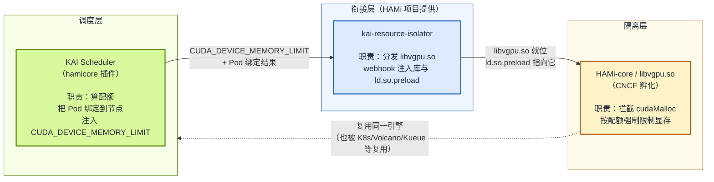
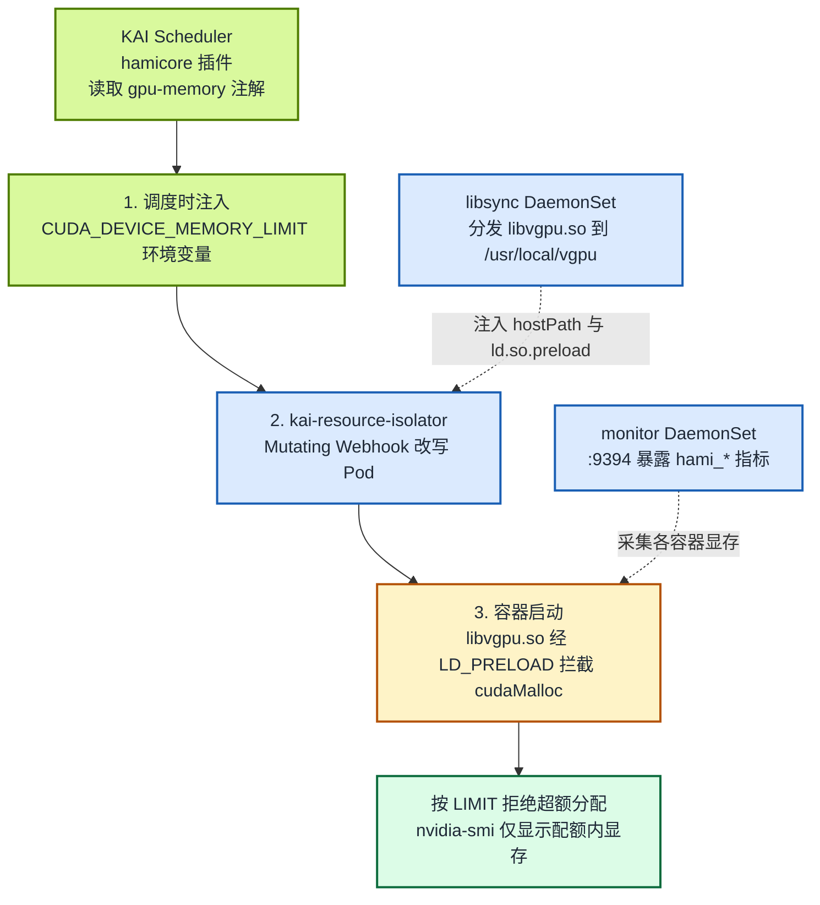

GPU 共享在 Kubernetes 生态里讨论了很多年，但调度层与隔离层长期各自为政：调度器把几个 Pod 分到同一张卡，容器进入 GPU 后却依然能看到整张卡的显存，谁先发起 `cudaMalloc` 谁就占满，隔离形同虚设。所谓“共享”其实只是“抢”，没有任何资源保障可言。

要解决这个问题，需要调度层（决定“谁能用哪张卡、用多少”）和隔离层（保证“说好用多少就只能用多少”）协同。**HAMi-core** 正是这样一个可被多种调度器复用的隔离底座。在 KAI Scheduler 之前，它已经支持 Kubernetes 原生调度器（经 HAMi 自带的 `hami-scheduler` 扩展）、[Kueue](/zh/docs/userguide/kueue/how-to-use-kueue)、[Volcano](/zh/docs/installation/how-to-use-volcano-vgpu) 等（完整生态见 [HAMi 生态集成](/zh/docs/next/core-concepts/ecosystem-integrations)）。

**自 KAI Scheduler v0.16.4 起，NVIDIA 的 KAI Scheduler 也正式加入这一行列**，把 HAMi-core 作为其 GPU 共享的隔离引擎内置支持。本文验证当前文档支持的组合：KAI Scheduler v0.17.0 与 `kai-resource-isolator` 1.1.0-chart。启用这条集成后，GPU 共享不再只是“协作式共享”，而是在 CUDA API 层执行显存上限。本文讲清两件事：

- **原理**：KAI Scheduler、`kai-resource-isolator`、HAMi-core 三者各自负责什么、如何衔接，以及 `CUDA_DEVICE_MEMORY_LIMIT` 这一契约如何把调度层与隔离层连起来。
- **实践**：一套在 GKE 上完成的端到端验证（单张 NVIDIA T4 卡，两个 Pod 共享），并通过 `cudaMalloc` 证明显存配额无法被越过。完整复现步骤见实验 12。

背景故事与协作时间线见 [《HAMi-core 被 NVIDIA KAI Scheduler 采用：GPU 共享正式迈入硬隔离时代》](/zh/blog/hami-core-adopted-by-nvidia-kai-scheduler)。

:::note 关于本文的输出

下半部分的命令已在本文的 GKE 1.35/COS/CDI 集群上实际执行。标为“实测”的 UUID、显存上限、错误信息和 CUDA 分配结果来自该次运行；标为“示意”的资源名称与地址经过脱敏，实际值以你的集群环境为准。

:::

<!-- truncate -->

## 背景：为什么“共享”不等于“隔离”

| 层次 | 负责方 | 解决了什么 | 没有解决什么 |
| :-- | :-- | :-- | :-- |
| 调度层 | KAI Scheduler、Volcano、Kueue 等 | 多个 Pod 能被分到同一张 GPU | 容器内仍可见全部显存 |
| 运行时层 | HAMi-core（`libvgpu.so`） | 拦截 CUDA 调用，按配额限制显存 | 单独使用时，不知道每个 Pod 该分多少 |

要实现真正的 GPU 共享，这两层缺一不可，而且必须协同：调度层决定“谁能用哪张卡、用多少”，隔离层保证“说好用多少就只能用多少”。问题是，**隔离层需要知道“到底用多少”这个数字，而它本身是算不出来的，这个数字来自调度层**。

HAMi 社区多年打磨的 HAMi-core（CNCF 孵化项目）正是这样的隔离层，而且它是**与调度器解耦**的：在 KAI Scheduler 之前，HAMi-core 已经通过不同的方式与 Kubernetes 原生调度器（经 HAMi 自带的 `hami-scheduler` 扩展）、[Kueue](/zh/docs/userguide/kueue/how-to-use-kueue)、[Volcano](/zh/docs/installation/how-to-use-volcano-vgpu)、Koordinator 等协同工作（完整生态见 [HAMi 生态集成](/zh/docs/next/core-concepts/ecosystem-integrations)）。

**KAI Scheduler 在 v0.16.4 正式加入这一行列**，把 HAMi-core 作为其 GPU 共享的隔离引擎内置支持。本文要讲清的，就是 KAI Scheduler 这条集成路径上三个组件各自的角色，以及它们之间如何衔接。

## 运行原理：一个契约、三步协作

### 三个组件各是什么、各做什么

先把三个名字容易混淆的组件讲清楚，这是理解整条链路的前提：

- **HAMi-core（`libvgpu.so`）**：HAMi 项目的 CUDA 拦截库，是**隔离引擎本身**。它通过 `LD_PRELOAD` 拦截容器里的 CUDA 调用（如 `cudaMalloc`），按一个显存配额强制限制。它不关心配额是谁给的：任何调度器只要按约定把配额传进来，它都能执行隔离。在 KAI 之前，它已经被 HAMi 自带的 device-plugin/webhook、Volcano 的 `volcano-vgpu-device-plugin` 等复用。

- **KAI Scheduler**：NVIDIA 开源的 Kubernetes AI 工作负载调度器。它只负责**调度层**，即决定 Pod 落到哪个节点、用哪张 GPU、分多少显存。自 v0.16.4 起，它的 `hamicore` 插件在绑定 Pod 时，会把算好的显存配额写进容器的环境变量。

- **`kai-resource-isolator`**：HAMi 项目侧为 KAI Scheduler 这条集成路径**专门提供的配套组件**。它把 HAMi-core 的 `libvgpu.so` 分发到每个 GPU 节点，并用 MutatingWebhook 改写 Pod，把库和 `ld.so.preload` 注入进去。换言之，它是“把 KAI 的调度决策落地成 HAMi-core 能执行的隔离”的桥梁。



一句话：**KAI Scheduler 算配额，`kai-resource-isolator` 把隔离库就位，HAMi-core 在运行时真正执行隔离。**

:::note 为什么是 HAMi-core，不是完整 HAMi 平台

KAI Scheduler 的集成目标是 **HAMi-core 本身**，而不是完整的 HAMi 平台。KAI 保留自己的调度能力（不替换成 `hami-scheduler`），只引入 HAMi-core 来做 GPU 显存隔离。这与 Volcano（用 `volcano-vgpu-device-plugin` + HAMi-core）的分工模式是同一思路：调度器各用各的，隔离引擎共用 HAMi-core。

:::

### 契约：`CUDA_DEVICE_MEMORY_LIMIT`

整条链路之所以能成立，是因为调度层和隔离层约定了一个极简的交接点：环境变量 **`CUDA_DEVICE_MEMORY_LIMIT`**。

- **KAI Scheduler（调度层）** 负责算出“这个 Pod 能用多少显存”，并在绑定节点时把它写进容器的环境变量。
- **HAMi-core（隔离层）** 负责读这个环境变量，并在运行时真正把显存用量卡在这个上限以内。

这个契约之所以重要，是因为它**把两件事彻底解耦**：KAI 不需要知道 CUDA 怎么被拦截，HAMi-core 不需要知道份额是怎么算出来的。两边只要都遵守 `CUDA_DEVICE_MEMORY_LIMIT` 这一个变量，任何调度器都能复用同一套隔离引擎。这正是 HAMi-core 能同时支持多个调度器的根本原因（见文末“这意味着什么”）。

### 三步协作



一句话概括：**KAI 说“你只能用这么多”，isolator 负责“让你真的只能用这么多”。**

三个组件的分工如下（详见 [KAI Scheduler 官方文档“HAMi 资源隔离”](https://github.com/kai-scheduler/KAI-Scheduler/blob/main/docs/gpu-sharing/hami/README.md)）：

- **libsync DaemonSet**：把 `libvgpu.so` 复制到每个 GPU 节点的 `/usr/local/vgpu`。
- **mutating webhook**：给 Pod 注入 hostPath 卷挂载，把 `/etc/ld.so.preload` 指向 `libvgpu.so`，并写入 `POD_UID`、`CONTAINER_NAME`、`CONTAINER_VGPU_MOUNT` 环境变量。
- **monitor DaemonSet**（可选）：读取各容器的共享内存缓存，在 `:9394` 暴露指标。

### CUDA 拦截是如何生效的

隔离的“最后一公里”发生在容器进程里，链路是这样的：

1. **KAI 在调度时注入 `CUDA_DEVICE_MEMORY_LIMIT`**（带上 Pod 申请的显存配额，单位 MiB）。
2. **kai-resource-isolator 的 webhook 改写 Pod**：挂载宿主机上的 `libvgpu.so`，并把 `/etc/ld.so.preload` 指向它。`ld.so.preload` 是动态链接器的机制，被列在里面的共享库会在所有其他库之前加载。
3. **容器进程启动后**，任何对 CUDA 运行时（`libcudart`）或驱动 API 的调用，都会先经过 `libvgpu.so`。后者拦截 `cudaMalloc` 之类的显存分配调用，从 `CUDA_DEVICE_MEMORY_LIMIT` 读出配额，累计该容器的显存用量；一旦超额就拒绝分配。
4. **对外可见的效果**：`nvidia-smi` 只显示配额内的显存（HAMi-core 会改写设备查询的返回值），容器再怎么 `cudaMalloc` 也越不过这条线。

这就是“硬隔离”的含义：不是靠应用自觉，而是在 CUDA 调用这一层强制执行。

:::tip 集成的来龙去脉

这条集成路径是 HAMi 社区与 NVIDIA KAI Scheduler 团队一年多协作的结果，分工很清晰：KAI 负责注入环境变量，HAMi 负责资源隔离组件。完整的时间线与参与人员见姊妹篇 [《HAMi-core 被 NVIDIA KAI Scheduler 采用》](/zh/blog/hami-core-adopted-by-nvidia-kai-scheduler)。

:::

## 这两个版本带来了什么

### KAI Scheduler（自 v0.16.4 起内置 HAMi-core 硬隔离）

KAI Scheduler 对 HAMi-core 的支持最早出现在 **v0.16.4**。当前集成文档要求 KAI Scheduler v0.17.0 或更高版本，本文实测 v0.17.0。关键在于 `hamicore` 插件：启用后，KAI 在把共享 GPU 的 Pod 绑定到节点时，会按 `gpu-memory`（或 `gpu-fraction`）注解向容器注入 `CUDA_DEVICE_MEMORY_LIMIT` 环境变量，这正是上一节契约里 HAMi-core 执行隔离所需的配额。

v0.17.0 中其他与 GPU 相关的改动还包括：修正共享 Pod 名称带“`/`”造成的非法卷名问题；修正 `MinNodeGPUMemoryMiB` 与 fractional `gpu-memory` 的分配计算；overLimit 判定改用集群最大 GPU 规格。此外还有 preemption-delay（为 Cluster Autoscaler 留出拉起节点的时间窗）、NUMA 感知打分、GitOps 与 ArgoCD 安装支持等。

### kai-resource-isolator 1.1.0-chart

这是与 HAMi 配套发布的隔离器。它接收 KAI 注入的配额，在容器真正运行起来之前，把 HAMi-core 的 `libvgpu.so` 注入到位。相对首个版本，1.1.0 增加了一组运维改进：

- **新增 `kai-vgpu-monitor`**：以 DaemonSet 形式运行，在 `:9394` 暴露 HAMi 兼容指标（`hami_vgpu_memory_used_bytes`、`hami_vgpu_memory_limit_bytes`、`hami_container_device_utilization_ratio`），支持 ServiceMonitor，可被 Prometheus 直接抓取。
- **多容器注入修复**：一个 Pod 内有多个容器时，webhook 现在能正确处理，不再漏注。
- **安全收紧**：webhook 改用命名空间内 Issuer（不再使用 ClusterIssuer），ClusterRole 收回读 Secret 的权限。
- **全局镜像仓库**优先级理顺，`hamicore` 安装参数修正。

## GKE 实测：隔离是否真的生效

我们在一套 GKE 1.35/COS/CDI 集群上完成了端到端验证：3 个 `n1-standard-2` 节点，每节点一张 NVIDIA T4；KAI Scheduler v0.17.0 负责共享调度，`kai-resource-isolator` 1.1.0-chart 负责注入 HAMi-core。

验证没有止步于 `nvidia-smi`。两个 Pod 被固定到一个只有一张 T4 的节点上，并完成了三层检查：

| 检查 | 实测结果 | 证明了什么 |
| :-- | :-- | :-- |
| 节点与 GPU UUID | 两个 Pod 位于同一节点，UUID 均为 `GPU-9acc8878-...` | 两个 Pod 确实共享同一张物理卡 |
| 可见显存 | 两个 Pod 均为 `4147 MiB`，整卡为 `15360 MiB` | KAI 注入的配额已由 HAMi-core 呈现到容器 |
| CUDA 分配 | 3 GiB 成功，累计申请 5 GiB 返回 `out of memory` | 显存上限被实际执行，不只是修改显示 |
| 并发隔离 | Pod A 持有 3 GiB 时，Pod B 仍成功获得自己的 3 GiB | 一个 Pod 无法占用另一个 Pod 的配额 |
| monitor 指标 | 同节点 `:9394/metrics` 返回两个 Pod 各自 4.348 GB 上限与 3.328 GB 实时用量 | monitor 读取了每个容器的共享内存缓存，并导出非空的 Pod 级指标 |

HAMi-core 在越界时记录了：

```text
Device 0 OOM 5475663872 / 4348444672
allocate another 2 GiB: out of memory
PASS: in-quota allocation succeeded and over-quota allocation failed
```

这组结果把“调度到同一张卡”“容器只看到自己的配额”“CUDA 无法越过配额”和“指标可观测”连成了完整证据链。monitor 以 DaemonSet 运行并读取节点本地缓存，因此实验 12 会直接查询工作负载所在节点的实例，而不是依赖可能选中其他节点的 Service。

:::note 隔离边界

这里验证的是 HAMi-core 在 CUDA API 层执行的显存配额，不是 MIG 一类硬件安全边界。本次 GKE 兼容路径还使用了特权业务容器，因此不应直接解读为面向不可信多租户的安全隔离方案。

:::

### 为什么完整步骤不放在博客里

标准的 KAI + HAMi-core 链路并不长，但本次 GKE 1.35/COS/CDI 环境还涉及只读根文件系统、RuntimeClass、NVML 库路径、CDI 设备注入、PriorityClass 和 `kubectl exec` WebSocket 等兼容问题。这些内容版本相关、需要持续维护，更适合成为可执行的实验，而不是嵌在博客主线中。

完整的集群准备、安装清单、Kyverno 策略、CUDA 程序、monitor 验证、真实输出、故障排查和清理命令已整理到：

**[实验 12：在 GKE 上验证 KAI Scheduler 与 HAMi 显存隔离](/zh/tutorials/labs/kai-scheduler-hami-gke)**

如果只想理解集成原理，读到这里即可；如果要在 GKE 上复现，再进入“实验 12”按步骤操作。

## 这意味着什么

HAMi-core 的定位从来不是“某个调度器的附属隔离功能”，而是一个**与调度器解耦、可被各路调度器复用的隔离底座**。在 KAI Scheduler 之前，它已经支撑了 Kubernetes 原生调度器、[Kueue](/zh/docs/userguide/kueue/how-to-use-kueue)、[Volcano](/zh/docs/installation/how-to-use-volcano-vgpu)、Koordinator 等多条路径（见 [HAMi 生态集成](/zh/docs/next/core-concepts/ecosystem-integrations)）。KAI Scheduler v0.16.4 的加入，是把这个生态又扩到了 NVIDIA 官方的 AI 调度器：

- 对 **KAI 用户**：GPU 共享终于有了与之匹配的运行时硬隔离，共享不再等于缺少保障。
- 对 **HAMi 用户**：多了一条不绑死特定虚拟化设备插件、直接走 NVIDIA 官方调度器的集成路径，指标体系（`hami_*`）也保持兼容。
- 对 **社区**：调度层与隔离层之间的契约（`CUDA_DEVICE_MEMORY_LIMIT`）被又一次验证可行，后续任何调度器只要遵守它，就能复用同一套隔离引擎。

这背后是 KAI Scheduler 团队（Run:ai）与 HAMi 维护者一年多反复对齐的结果。`LD_PRELOAD`、webhook、指标端口、退出开关，每一个都是两边共同敲定的；`kai-resource-isolator` 1.1.0 里那批安全收紧（命名空间内 Issuer、收紧 ClusterRole），也都是社区评审一条条打磨出来的。

## 下一步

- 背景故事：[《HAMi-core 被 NVIDIA KAI Scheduler 采用》](/zh/blog/hami-core-adopted-by-nvidia-kai-scheduler)
- 用户文档：[如何在 KAI Scheduler 中使用 HAMi](/zh/docs/next/userguide/kai-scheduler/how-to-use-kai-scheduler)
- 相关仓库：[Project-HAMi/KAI-resource-isolator](https://github.com/Project-HAMi/KAI-resource-isolator) · [Project-HAMi/HAMi-core](https://github.com/Project-HAMi/HAMi-core)（CNCF 孵化的 CUDA 拦截库） · [kai-scheduler/KAI-Scheduler](https://github.com/kai-scheduler/KAI-Scheduler) · [KAI Scheduler HAMi 资源隔离文档](https://github.com/kai-scheduler/KAI-Scheduler/blob/main/docs/gpu-sharing/hami/README.md)
- 欢迎在你自己的 GKE、AWS 或自建集群上跑一遍，并把真实结果反馈到 issue 或社区群。若缺 HAMi-core 在某种卡或某种 CUDA 版本上的支持，直接到 [Project-HAMi/HAMi](https://github.com/Project-HAMi/HAMi) 提 issue，这是社区最看重的反馈。
