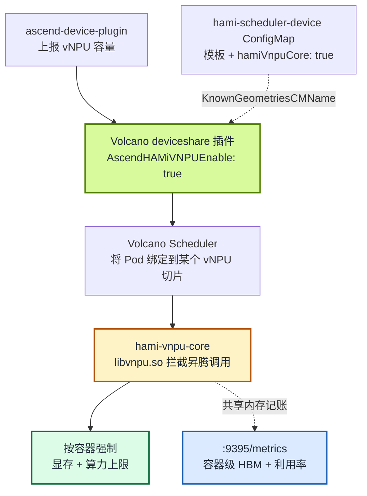

[Volcano](https://github.com/volcano-sh/volcano) 是很多 AI 集群的批量调度器首选，HAMi-core 则是让共享加速器“守规矩”的运行时。本文关注两者在昇腾硬件上的交汇点：在 **Volcano 调度器下运行 `hami-vnpu-core` 软切分的 vNPU**，让批量调度语义（队列、Gang、binpack）与容器级隔离（在昇腾 API 层强制生效的显存与算力上限）协同工作。

我们在一台昇腾 310P3 aarch64 服务器的单节点 Kubernetes 集群上验证了完整链路：源码编译 Volcano 与 [ascend-device-plugin](https://github.com/Project-HAMi/ascend-device-plugin) 镜像、部署两者，并确认申请 8192 MiB 切片的容器恰好只能看到这么多显存；同时第二个 Pod 以 binpack 方式落到同一张物理卡上、拿到独立切片，插件的 Prometheus 端点也如实上报了两个容器的配额。完整步骤（含每条命令与真实输出）见 [实验 13：用 Volcano + HAMi-core 软切分昇腾 310P3 vNPU](/zh/tutorials/labs/volcano-ascend-vnpu)。

:::note 关于本文中的输出

本文所有输出均采集自 2026-08-14 的真机验证：麒麟 V10 aarch64 节点、2× 昇腾 310P3（驱动/npu-smi 25.5.1）、Kubernetes v1.28.15、containerd 1.7.1。其他集群中的 UUID、IP、Pod 后缀会不同；请对比组件名、调度位置与测量值。

:::

<!-- truncate -->

## Volcano 调度昇腾 vNPU 的两种方式

Volcano 调度昇腾虚拟 NPU 有**两种不同方式**，很容易混淆。先把它讲清楚，能省掉好几个小时的排错：

|  | MindCluster 模式 | HAMi 模式 |
| :-- | :-- | :-- |
| Volcano 开关 | `deviceshare.AscendMindClusterVNPUEnable` | `deviceshare.AscendHAMiVNPUEnable` |
| 提供方 | Volcano 原生昇腾插件 | [Project-HAMi/ascend-device-plugin](https://github.com/Project-HAMi/ascend-device-plugin) |
| 模板 | `vir04_3c_ndvpp`（带 `dvpp` 维度） | `vir05_1c_16g`（仅 `memory`/`aiCore`/`aiCPU` 字段） |
| 软切分（`hami-core`）？ | 否 | **是** |
| 资源名 | `huawei.com/npu-core` | `huawei.com/Ascend310P`、`-memory` |

本文讲的是 **HAMi 模式**下的 **`hami-vnpu-core` 软切分**。这两种里只有它做运行时拦截：不是把卡预先切成固定的虚拟化模板，而是在用户态拦截昇腾调用，在运行时按容器强制显存与算力上限。Volcano 决定*哪个* Pod 拿到*多少*切片，HAMi-core 让这个决定*真正生效*。

## 集成是如何工作的

这条链路有三个分工：

- **Volcano 的 `deviceshare` 插件**从 `hami-scheduler-device` ConfigMap（配合 `AscendHAMiVNPUEnable: "true"`）读取 vNPU 规格，并按 `binpack` 或 `spread` 策略决定每个 Pod 由哪个节点、哪张卡服务。
- **`ascend-device-plugin` DaemonSet** 向节点注册 `huawei.com/Ascend310P`（卡数）与 `huawei.com/Ascend310P-memory`（MiB）扩展资源，并把 HAMi-core 资产（`libvnpu.so` 和 `ld.so.preload`）拷贝到宿主机 `/usr/local/hami-vnpu-core/`。
- **HAMi-core（`libvnpu.so`）** 经 Ascend Docker Runtime 的 preload 机制注入业务容器，强制执行调度器选定的切片。



Pod 侧的契约很简洁：`schedulerName: volcano`、`runtimeClassName: ascend`、注解 `huawei.com/vnpu-mode: hami-core`，以及对两个扩展资源的 limits。少了这个注解，Pod 会退回模板路径，在纯软切分节点上可能一直 Pending。

有一个容易让从 HAMi NVIDIA 侧过来的用户踩坑的细节：昇腾的拦截库是 **`libvnpu.so`，不是 `libvgpu.so`**，由 [Project-HAMi/hami-vnpu-core](https://github.com/Project-HAMi/hami-vnpu-core) 提供。它在容器内通过 `/etc/ld.so.preload` 预加载，经 `/hami-shared-region` 共享内存区通信，并通过 `NPU_MEM_QUOTA` 等环境变量拿到强制配额。

## 为什么要源码编译

软切分要求 **Volcano ≥ 1.16**，但验证时还没有稳定的 1.16：最新稳定版是 v1.15.1，仅有 `1.16.0-alpha.1` chart 可用。可选方案是 alpha chart 或源码编译；我们选择编译 **Volcano master（commit `7d9504320`）**，因为节点是 aarch64，而且我们想要确切知道自己编译的二进制。

源码编译只是临时方案。等 Volcano 发布稳定的 1.16 版本后，通过 Helm 直接安装即可覆盖这条链路，实验 13 中的编译步骤可以跳过，例如：

```bash
helm repo add volcano-sh https://volcano-sh.github.io/helm-charts
helm install volcano volcano-sh/volcano \
  --namespace volcano-system --create-namespace \
  --version 1.16.0
```

安装之后的步骤（deviceshare 调度器配置与插件部署）完全不变。

这次编译中有两个结论，即使你从不编译镜像也值得记住：

- **宿主机编译、容器只做打包。** 在 builder 容器里跑 `go mod download` 反复超时，而宿主机模块缓存是热的。在宿主机编译（`make vc-scheduler vc-controller-manager vc-webhook-manager`，约 10 秒）、由 Docker 把静态二进制打包进 alpine 镜像，在受限网络上更快也更可复现。
- **集群运行时是 containerd，Docker 构建的镜像对 kubelet 不可见。** 每个镜像都必须用 `docker save … | ctr -n k8s.io images import -` 导入。否则即便 `docker images` 能看到 tag，Pod 依然报 `ErrImageNeverPull`。

设备插件我们签出了 **v1.3.1（commit `506fe27`）**，打包时有一个关键点，也是整个过程中最大的坑：镜像必须携带**与 NPU 驱动匹配的 `libvnpu.so`**。我们最初用两个月前缓存的 `libvnpu` 镜像作为资产来源，结果容器内所有 `npu-smi info` 永久卡死在 `Initialize SchedulerClient...`。修复方式是直接从官方 v1.3.1 镜像拷贝资产（在我们的驱动 25.5.1 上 md5 为 `42b202887a27b9adb7522fd9e056b03b`），而不是用过期的本地缓存。实验 13 给出了确切的 Dockerfile 与 md5 校验方法。

## 我们验证了什么

宿主机上两张 310P3 均为健康状态：

```text
$ npu-smi info
+--------------------------------------------------------------------------------------------------------+
| npu-smi 25.5.1                                   Version: 25.5.1                                       |
+-------------------------------+-----------------+------------------------------------------------------+
| NPU     Name                  | Health          | Power(W)     Temp(C)           Hugepages-Usage(page) |
| Chip    Device                | Bus-Id          | AICore(%)    Memory-Usage(MB)                        |
+===============================+=================+======================================================+
| 4       310P3                 | OK              | NA           37                0     / 0             |
| 0       0                     | 0000:81:00.0    | 0            1848 / 21525                            |
+===============================+=================+======================================================+
| 5       310P3                 | OK              | NA           40                0     / 0             |
| 0       1                     | 0000:85:00.0    | 0            1849 / 21525                            |
+===============================+=================+======================================================+
```

插件注册后，节点上报 14 个 vNPU（2 卡 × 7，310P3 的驱动上限）与 43054 MiB 可分配显存。每个测试 Pod 申请 1 个 vNPU、8192 MiB 切片：

```yaml
resources:
  limits:
    huawei.com/Ascend310P: "1"
    huawei.com/Ascend310P-memory: "8192"
```

### 1. 容器只看到自己的切片

第一个 Pod 内的 `npu-smi info` 显示的是 **0 / 8192 MB** 的设备，而不是宿主机在同一张卡上看到的 1848 / 21525 MB：

```text
$ kubectl exec ascend-vnpu-check -- npu-smi info
[INFO limiter::supervisor] [Supervisor PID:10] won manager election
[INFO limiter::manager] [Manager] Registered as Global Manager #0 (PID: 10). Compute limit: 1, Memory limit: 8192, FixedShare: false
open global registry path is "/hami-shared-region/0_global_registry"
...
| 32768   310P3                 | OK              | NA           38                0     / 0             |
| 0       0                     | 0000:81:00.0    | 0            0    / 8192                             |
```

`libvnpu.so` 已把设备查询改写为容器的配额，注入的环境变量也印证了接线：`NPU_MEM_QUOTA=8192`、`NPU_GLOBAL_SHM_PATH=/hami-shared-region/0_global_registry`、`ASCEND_VISIBLE_DEVICES=0`。

### 2. binpack 让多个 Pod 共享一张物理卡

第二个同规格的 Pod 落在了**同一个 Bus-Id `0000:81:00.0`** 上，各自拥有独立的 8192 MiB 窗口，并作为 `Global Manager #1` 注册进与 Pod 1 的 `#0` 相同的共享注册表：

```text
$ kubectl exec ascend-vnpu-check-2 -- npu-smi info | grep -E "Memory limit|0000"
[INFO limiter::manager] [Manager] Registered as Global Manager #1 (PID: 10). Compute limit: 1, Memory limit: 8192, FixedShare: false
| 0       0                     | 0000:81:00.0    | 0            0    / 8192                             |
```

节点的已分配资源说的是同一件事：`huawei.com/Ascend310P 2`（共 14）、`huawei.com/Ascend310P-memory 16384`（共 43054），两个 8192 MiB 切片打包进一张 21.5 GiB 的卡，而不是分散到两张卡。

### 3. 容器级监控指标正常导出

插件（不是业务 Pod）在 `:9395` 上提供 Prometheus 指标：

```text
hami_vgpu_memory_limit_bytes{container="npu",...,pod="ascend-vnpu-check",vdevice_index="0"} 8.589934592e+09
hami_vgpu_memory_limit_bytes{container="npu",...,pod="ascend-vnpu-check-2",vdevice_index="0"} 8.589934592e+09
hami_host_gpu_memory_used_bytes{device_index="0",device_type="Ascend-Atlas 300I Pro",...} 1.937768448e+09
```

`8.589934592e+09` 字节恰好是 8192 MiB，与两个 Pod 的申请值一致，且两个 vdevice 挂在同一张物理卡的 UUID 上。该端点还导出 `hami_vgpu_memory_used_bytes`、`hami_container_device_utilization_ratio` 和 `hami_host_gpu_utilization_ratio`。

## 验证结果

| 验证项 | 结果 | 证据 |
| :-- | :-- | :-- |
| Volcano 源码编译（aarch64） | 通过 | 3 个镜像，scheduler `--version` 输出 commit `7d950432...` |
| 插件镜像携带匹配的 libvnpu | 通过 | md5 `42b20288...` 与官方 v1.3.1 资产一致 |
| Volcano + HAMi 模式 deviceshare | 通过 | 调度器日志加载 `AscendHAMiVNPUEnable: "true"` |
| 节点资源注册 | 通过 | `Ascend310P: 14`、`Ascend310P-memory: 43054` |
| 显存切片隔离 | 通过 | 容器内 `0 / 8192`，宿主机 `1848 / 21525` |
| binpack 共卡 | 通过 | 两个 Pod 同为 Bus-Id `0000:81:00.0`，`Global Manager #0/#1` |
| 资源计量 | 通过 | 节点已分配 2 vNPU、16384 MiB |
| 监控 | 通过 | `:9395` 导出宿主机/容器/vdevice 三层指标 |

## 动手前值得知道的坑

- **`libvnpu.so` 必须与 NPU 驱动匹配。** 不匹配不会报错，容器内 `npu-smi` 只是永远卡在 `Initialize SchedulerClient...`。请从与驱动匹配的官方镜像版本拷贝资产并校验 md5。
- **Docker 与 containerd 的镜像存储是隔离的。** 用 `ctr -n k8s.io images import` 导入，否则等着收 `ErrImageNeverPull`。
- **Helm 里镜像拉取策略的 key 是 `basic.image_pull_policy`**（下划线），不是 `scheduler.imagePullPolicy`。key 写错时节点会去拉取只有本地才有的镜像。
- **v1.3.1 不注册 `-core` 资源。** Pod spec 只需要 `huawei.com/Ascend310P`（卡数）与 `huawei.com/Ascend310P-memory`（MiB）；配置里的 `resourceCoreName` 不会上报为节点资源。
- **指标在插件 Pod 上。** 在业务 Pod 里 curl `:9395` 毫无响应；要按 label 选中 DaemonSet Pod。
- **卸载 Volcano 后 `volcano-system` 可能卡在 Terminating**（webhook 已删除之后）。清理 namespace 的 finalizer 即可解除。

这里的软切分是运行时 API 层的强制（`libvnpu.so` 软件拦截），不是 SR-IOV 式的硬件安全边界，这一点与 HAMi-core 在 GPU 上的定性相同。

## 延伸阅读

- 完整流程（每条命令与真实输出）：[实验 13：用 Volcano + HAMi-core 软切分昇腾 310P3 vNPU](/zh/tutorials/labs/volcano-ascend-vnpu)
- 用户指南：[Volcano 中的华为昇腾设备](/zh/docs/installation/how-to-use-volcano-ascend) 与 [启用昇腾共享](/zh/docs/userguide/ascend-device/enable-ascend-sharing)
- 组件仓库：[Project-HAMi/ascend-device-plugin](https://github.com/Project-HAMi/ascend-device-plugin) · [Project-HAMi/hami-vnpu-core](https://github.com/Project-HAMi/hami-vnpu-core) · [volcano-sh/volcano](https://github.com/volcano-sh/volcano)
- 相关实验：[实验 8：Volcano vGPU、Gang 调度与队列限制](/zh/tutorials/labs/volcano-vgpu-gang-queue) 把同一套调度器用于 NVIDIA GPU
