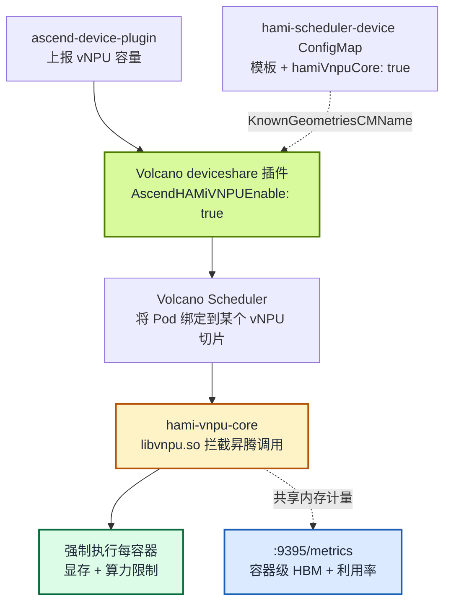

HAMi v2.10 让昇腾软切分工作负载可以在 Volcano 调度器下运行，把 Volcano 的批量调度能力与 HAMi-core 的运行时隔离能力结合起来。本文说明这套集成的工作原理，并给出在昇腾 310P3 ARM 服务器上启用并验证 `hami-vnpu-core` 软切分的可复现流程。

:::note 关于本文中的输出

宿主机层面的输出（`npu-smi info`、硬件信息）来自测试节点的真实采集。集群内的验证输出描述的是**预期**结果，凡取决于实际运行的值都用 `<占位符>` 表示；请在执行过程中捕获真实输出，发布前再回填。

:::

<!-- truncate -->

## "Volcano vNPU 软切分"到底指什么

Volcano 调度昇腾虚拟 NPU 有**两种不同方式**，很容易混淆。先把它讲清楚，能省掉好几个小时的排错：

|  | MindCluster 模式 | HAMi 模式 |
| :-- | :-- | :-- |
| Volcano 开关 | `deviceshare.AscendMindClusterVNPUEnable` | `deviceshare.AscendHAMiVNPUEnable` |
| 提供方 | Volcano 原生昇腾插件 | [Project-HAMi/ascend-device-plugin](https://github.com/Project-HAMi/ascend-device-plugin) |
| 模板 | `vir04_3c_ndvpp`（带 `dvpp` 维度） | `vir05_1c_16g`（仅 `memory`/`aiCore`/`aiCPU` 字段） |
| 软切分（`hami-core`）？ | 否 | **是** |
| 资源名 | `huawei.com/npu-core` | `huawei.com/Ascend310P`、`-memory`、`-core` |

本文讲的是 **HAMi 模式**下的 **`hami-vnpu-core` 软切分**。这两种里只有它做运行时拦截：不是把卡预先切成固定的虚拟化模板，而是在用户态拦截昇腾调用，在运行时按容器强制显存与算力上限。Volcano 决定*哪个* Pod 拿到*多少*切片，HAMi-core 让这个决定*真正生效*。



Volcano 与 HAMi-core 之间的契约就是 vNPU 切片描述。Volcano 的 `deviceshare` 插件从 `hami-scheduler-device` ConfigMap 读取 vNPU 模板并放置 Pod；`ascend-device-plugin` 随后完成运行时设置，让 `hami-vnpu-core` 强制执行调度器选定的切片。

## 前置条件与一个重要的版本坑

依据 [ascend-device-plugin Volcano 指南](https://github.com/Project-HAMi/ascend-device-plugin/blob/main/docs/volcano.md)：

- **Kubernetes** ≥ 1.20
- **Volcano** ≥ 1.14，**软切分（`hami-core`）需要 ≥ 1.16**
- 节点上已安装 [ascend-docker-runtime](https://gitcode.com/Ascend/mind-cluster/tree/master/component/ascend-docker-runtime)
- **昇腾驱动** ≥ 25.5
- NPU 芯片需设置为 **`device-share` 模式**（`npu-smi set -t device-share -i <id> -d 1`）
- **`npu-smi` 在宿主机可达**（仅软切分需要），路径为 `/usr/local/Ascend/driver/tools/npu-smi`、`/usr/local/sbin/npu-smi` 或 `/usr/local/bin/npu-smi`
- **软切分仅支持 ARM 平台**；模板硬切分无架构限制

:::warning Volcano 1.16 的版本缺口

这是最大的一个坑。软切分需要 Volcano ≥ 1.16，但**目前还没有稳定的 1.16 版本**。写本文时，满足该要求的只有 Volcano chart `1.16.0-alpha.1`：

```bash
helm repo add volcano-sh https://volcano-sh.github.io/helm-charts
helm search repo volcano-sh/volcano --versions | head
```

预期看到最新稳定版是 `1.15.1`，而 1.16 仅有 `1.16.0-alpha.1`。下面的流程会显式使用这个 alpha 版本。如果你的环境不能跑 alpha 调度器，可以回退到 **HAMi 模式下的模板切分**（稳定版 Volcano 1.14/1.15 即可）；只有运行时拦截的软切分路径才需要 1.16。

:::

:::note 无需自建镜像

虽然 HAMi v2.10 和 Volcano 1.16 都尚未正式发布，但**这条链路上没有任何组件需要你自己构建镜像，ARM 也一样**：

- Volcano 为 `v1.16.0-alpha.1` 发布了多架构镜像（`linux/amd64` 与 `linux/arm64`），涵盖 `vc-scheduler`、`vc-webhook-manager`、`vc-controller-manager`。
- `projecthami/ascend-device-plugin:v1.4.0` 同样是多架构镜像。其 arm64 镜像已内置由插件 CI 在原生 ARM64 上、于 CANN 环境中编译的 [hami-vnpu-core](https://github.com/Project-HAMi/hami-vnpu-core) `libvnpu.so`。
- 软切分引擎不是独立部署项：插件 DaemonSet 启动时会自动把镜像内的 `libvnpu.so` 与 `ld.so.preload` 拷贝到宿主机的 `/usr/local/hami-vnpu-core`，并自动创建 `/usr/local/hami-shared-region`。只有在修改 hami-vnpu-core 时才需要在 CANN 环境中 `cargo build` 自行构建。
- Volcano 路径**不需要**安装完整的 HAMi chart，standalone ascend-device-plugin 即可；因此未发布的 HAMi v2.10 并不阻塞本测试。

:::

## 测试环境

测试节点是一台纯国产化的 AI 推理服务器，关键配置如下：

| 项目 | 配置 |
| :-- | :-- |
| 服务器 | 华为鲲鹏 920，aarch64，96 核，4 个 NUMA 节点，约 512 GB 内存，麒麟 Linux V10 Lance |
| NPU | 昇腾 310P3 × 2 张，每张可见显存约 21.5 GiB，面向 AI 推理（INT8 算力强劲） |
| npu-smi / 驱动 | 25.5.1，满足 ≥ 25.5 的要求 |
| Kubernetes | kubeadm 安装的单节点 all-in-one 集群，节点 `aio-node74-arm` 同时担任 control-plane 和 worker，containerd + Flannel（VXLAN） |
| 已预装 | Volcano 与昇腾设备插件已在集群中 |
| 其他 GPU | 另插 2 张 NVIDIA T4，但驱动未加载，当前不可用 |

aarch64 架构满足软切分的 ARM-only 要求，宿主机上 `npu-smi` 可用。

:::note 单节点就够

软切分是节点内的能力。本文验证的所有内容（两个 Pod 共享一张卡、超限拒绝、容器级指标）都发生在单个节点内部，因此单节点 all-in-one 集群就是有效的测试环境。多节点只在跨节点场景（节点级 binpack/spread、高可用）才有意义，那不是本文的目标。

:::

由于测试集群已预装 Volcano 和昇腾设备插件，下文的步骤侧重于**核对并重配**现有组件，而非全新安装；安装命令保留给从零开始的读者。

## 步骤 1：确认节点并打标签

先检查驱动与设备。以下是测试节点上 `npu-smi info` 的真实输出：

```text
+--------------------------------------------------------------------------------------------------------+
| npu-smi 25.5.1                                   Version: 25.5.1                                       |
+-------------------------------+-----------------+------------------------------------------------------+
| NPU     Name                  | Health          | Power(W)     Temp(C)           Hugepages-Usage(page) |
| Chip    Device                | Bus-Id          | AICore(%)    Memory-Usage(MB)                        |
+===============================+=================+======================================================+
| 4       310P3                 | OK              | NA           36                0     / 0             |
| 0       0                     | 0000:81:00.0    | 0            1848 / 21525                           |
+===============================+=================+======================================================+
| 5       310P3                 | OK              | NA           38                0     / 0             |
| 0       1                     | 0000:85:00.0    | 0            1849 / 21525                           |
+===============================+=================+======================================================+
```

两张健康的 310P3 卡，每张上报 21525 MB 显存。注意硬件名称与 Pod 里请求的资源名的对应关系：芯片名是 `310P3`，但 Kubernetes 资源名来自配置里的 `commonWord`，即 `huawei.com/Ascend310P`。**没有**通用的 `huawei.com/Ascend` 资源；请始终与 device config 中的条目保持一致。

测试节点名为 `aio-node74-arm`。kubeadm 的 control-plane 节点默认带污点，先确认该节点可调度（all-in-one 部署必须如此，否则除了控制面组件什么都跑不上去）：

```bash
kubectl get node aio-node74-arm -o jsonpath='{.spec.taints}'
```

预期：没有 `node-role.kubernetes.io/control-plane:NoSchedule` 污点，或现有 DaemonSet 已带上对应 toleration。若污点存在且希望该节点运行业务负载，先移除：

```bash
kubectl taint node aio-node74-arm node-role.kubernetes.io/control-plane:NoSchedule-
```

然后给节点打标签，让 device plugin 的 DaemonSet 调度上去：

```bash
kubectl label node aio-node74-arm ascend=on --overwrite
kubectl get nodes --show-labels | grep ascend
```

## 步骤 2：安装 Volcano（1.16 alpha）

测试集群已运行 Volcano，先确认它的版本：

```bash
kubectl -n volcano-system get deploy volcano-scheduler \
  -o jsonpath='{.spec.template.spec.containers[0].image}'
helm list -n volcano-system
```

软切分要求 ≥ 1.16；若已装版本较旧，请先升级再继续。全新安装时，把 Volcano 装到独立命名空间，显式锁定 alpha 版本以满足软切分要求：

```bash
helm install volcano volcano-sh/volcano \
  --namespace volcano-system --create-namespace \
  --version 1.16.0-alpha.1

kubectl -n volcano-system wait --for=condition=available \
  --timeout=300s deploy/volcano-scheduler
kubectl get pods -n volcano-system
```

预期：`volcano-scheduler`、`volcano-admission`、`volcano-controllers` 的 Pod 为 `Running`。Pod 后缀随版本变化。

## 步骤 3：安装 ascend-device-plugin（HAMi 模式）

若集群中已装有昇腾插件，先确认它是 Project-HAMi 版本（镜像 `projecthami/ascend-device-plugin`）而不是华为上游插件，然后跳过全新安装，直接进行下面的 ConfigMap 修改：

```bash
kubectl -n kube-system get ds \
  -o custom-columns='NAME:.metadata.name,IMAGE:.spec.template.spec.containers[0].image' \
  | grep -i ascend
```

全新安装时：该插件提供原始 manifest 和 Helm chart。这里用原始 manifest 路径，最显式、便于审计。所有资源都落在 `kube-system`。

创建 RuntimeClass、device-config ConfigMap、可选的 node-config ConfigMap，以及 DaemonSet：

```bash
# 每个 Ascend Pod 都需要的 RuntimeClass
kubectl apply -f https://raw.githubusercontent.com/Project-HAMi/ascend-device-plugin/main/ascend-runtimeclass.yaml

# device-config（即 "hami-scheduler-device" ConfigMap）
kubectl apply -f https://raw.githubusercontent.com/Project-HAMi/ascend-device-plugin/main/ascend-device-configmap.yaml

# 可选的节点级配置（"hami-device-node-config"）
kubectl apply -f https://raw.githubusercontent.com/Project-HAMi/ascend-device-plugin/main/ascend-device-node-configmap.yaml

# DaemonSet（镜像 projecthami/ascend-device-plugin:v1.4.0，端口 9395）
kubectl apply -f https://raw.githubusercontent.com/Project-HAMi/ascend-device-plugin/main/ascend-device-plugin.yaml
```

接着，在 `hami-scheduler-device` ConfigMap（键 `device-config.yaml`）里的 `vnpus` 下把 `hamiVnpuCore` 设为 `true`，全局开启软切分。安全做法是把当前配置导出、改一行、再重新应用：

```bash
# 查看你芯片的模板与当前 hamiVnpuCore 取值
kubectl -n kube-system get cm hami-scheduler-device \
  -o jsonpath='{.data["device-config\.yaml"]}' | head -40

# 导出，把 hamiVnpuCore 改成 true，再重新应用
kubectl -n kube-system get cm hami-scheduler-device \
  -o jsonpath='{.data["device-config\.yaml"]}' > device-config.yaml
# 编辑 device-config.yaml：在 "vnpus:" 下设置 hamiVnpuCore: true
kubectl -n kube-system create cm hami-scheduler-device \
  --from-file=device-config.yaml=device-config.yaml -o yaml --dry-run=client \
  | kubectl apply -f -
```

开启软切分后，310P3 的条目长这样（节选）：

```yaml
vnpus:
  hamiVnpuCore: true
  configs:
    - chipName: 310P3
      commonWord: Ascend310P
      resourceName: huawei.com/Ascend310P
      resourceMemoryName: huawei.com/Ascend310P-memory
      memoryAllocatable: 21527
      memoryCapacity: 24576
      aiCore: 8
      aiCPU: 7
      templates:
        - name: vir01
          memory: 3072
          aiCore: 1
          aiCPU: 1
        - name: vir02
          memory: 6144
          aiCore: 2
          aiCPU: 2
        - name: vir04
          memory: 12288
          aiCore: 4
          aiCPU: 4
```

:::note 310P3 上的 `-core` 资源

stock 配置只为 `910B3` 和 `Ascend910C` 声明了 `resourceCoreName`（即 `-core` 软切分资源）。要像下文的 Pod 示例（以及上游 Volcano 指南）那样请求 `huawei.com/Ascend310P-core`，需在 310P3 条目中加一行：

```yaml
resourceCoreName: huawei.com/Ascend310P-core
```

如果不加，请从 Pod 中省略 `-core` 限制；显存限制仍然生效。

:::

重启 device plugin 让它读取新配置，然后确认它已运行并上报容量：

```bash
kubectl -n kube-system rollout restart ds hami-ascend-device-plugin
kubectl -n kube-system wait --for=condition=Ready \
  --timeout=180s pod -l app.kubernetes.io/component=hami-ascend-device-plugin

kubectl describe node aio-node74-arm | grep -A2 -i ascend
```

预期：节点的 capacity/allocatable 中现在出现 `huawei.com/Ascend310P`（以及 `-memory`/`-core` 扩展资源）。如果资源缺失，查看插件日志（`kubectl -n kube-system logs ds/hami-ascend-device-plugin`）是否有 `npu-smi` 路径或驱动版本的报错。

## 步骤 4：开启 Volcano 的 HAMi 模式 deviceshare

告诉 Volcano 调度器以 HAMi 模式调度昇腾 vNPU，并指明从哪里读取模板。编辑 `volcano-scheduler-configmap`：

```bash
kubectl -n volcano-system get cm volcano-scheduler-configmap \
  -o jsonpath='{.data["volcano-scheduler\.conf"]}'
```

把 `volcano-scheduler.conf` 设置成让 `deviceshare` 插件指向 `hami-scheduler-device` ConfigMap：

```yaml
actions: "enqueue, allocate, backfill"
tiers:
  - plugins:
      - name: predicates
      - name: deviceshare
        arguments:
          deviceshare.AscendHAMiVNPUEnable: "true"
          deviceshare.SchedulePolicy: binpack
          deviceshare.KnownGeometriesCMNamespace: kube-system
          deviceshare.KnownGeometriesCMName: hami-scheduler-device
```

应用并重启调度器使新配置生效：

```bash
kubectl -n volcano-system create cm volcano-scheduler-configmap \
  --from-file=volcano-scheduler.conf=volcano-scheduler.conf \
  -o yaml --dry-run=client | kubectl apply -f -
kubectl -n volcano-system rollout restart deploy volcano-scheduler
kubectl -n volcano-system rollout status deploy volcano-scheduler --timeout=180s
```

> 如果同一集群里还要用 Volcano vGPU（NVIDIA），请把两个 geometry ConfigMap 合并成一个，并把 `KnownGeometriesCMName` 指向合并后的 ConfigMap。

## 步骤 5：运行软切分 vNPU Pod

关键开关是 `schedulerName: volcano`、`runtimeClassName: ascend`，以及 `huawei.com/vnpu-mode: hami-core` 注解。没有该注解的 Pod 会回退到模板切分，在仅提供 hami-core 软切分的节点上可能一直 Pending。

示例请求一个 8 GiB 切片加 50% 算力核，尺寸经过设计：两个这样的 Pod 恰好能共享一张 21.5 GiB 的卡：

```bash
kubectl apply -f - <<'EOF'
apiVersion: v1
kind: Pod
metadata:
  name: ascend-vnpu-check
  annotations:
    huawei.com/vnpu-mode: hami-core
spec:
  schedulerName: volcano
  runtimeClassName: ascend
  containers:
    - name: npu
      image: quay.io/ascend/vllm-ascend:v0.18.0-310p
      command: ["sleep", "infinity"]
      resources:
        limits:
          huawei.com/Ascend310P: "1"
          huawei.com/Ascend310P-memory: "8192"
          huawei.com/Ascend310P-core: "50"
EOF

kubectl wait --for=condition=Ready pod/ascend-vnpu-check --timeout=5m
kubectl get pod ascend-vnpu-check -o wide
```

预期：Pod 在昇腾节点上进入 `Running`。如果一直 `Pending`，查看事件：

```bash
kubectl describe pod ascend-vnpu-check | tail -30
```

常见原因：`deviceshare` 插件名写错、`KnownGeometriesCMName` 指向了错误的 ConfigMap，或资源名与配置条目不匹配（例如请求了 `huawei.com/Ascend310P3` 或 `huawei.com/Ascend`，而不是 `huawei.com/Ascend310P`）。

## 步骤 6：验证切片与隔离

三项检查把调度、运行时强制执行与可观测性串起来。

**1. 容器只能看到自己的切片。** 在 Pod 内，NPU 应显示请求的显存，而不是整张约 21.5 GiB 的卡：

```bash
kubectl exec ascend-vnpu-check -- sh -lc 'npu-smi info'
```

预期：容器可见的设备显示约 8 GiB 的显存窗口，而非整卡。

**2. 两个 Pod 合计不能超过整卡。** 以相同配置启动第二个 Pod，确认两者都在各自限额内：

```bash
kubectl apply -f - <<'EOF'
apiVersion: v1
kind: Pod
metadata:
  name: ascend-vnpu-check-2
  annotations:
    huawei.com/vnpu-mode: hami-core
spec:
  schedulerName: volcano
  runtimeClassName: ascend
  containers:
    - name: npu
      image: quay.io/ascend/vllm-ascend:v0.18.0-310p
      command: ["sleep", "infinity"]
      resources:
        limits:
          huawei.com/Ascend310P: "1"
          huawei.com/Ascend310P-memory: "8192"
          huawei.com/Ascend310P-core: "50"
EOF

kubectl get pod -o wide | grep ascend-vnpu-check
```

预期：在 `binpack` 调度策略下，两个 Pod 共享同一张卡，各自绑定到自己的虚拟切片（2 × 8192 MiB 低于 21527 MiB 的可分配量）。第三个会把总量推过整卡容量的 Pod 会一直 Pending，直到前两个之一退出。

**3. 容器级指标已导出。** 监控仅在 `hami-vnpu-core` 模式下运行，在 `:9395` 提供 Prometheus 指标：

```bash
PLUGIN_POD=$(kubectl -n kube-system get pod \
  -l app.kubernetes.io/component=hami-ascend-device-plugin \
  --field-selector spec.nodeName=aio-node74-arm \
  -o jsonpath='{.items[0].metadata.name}')
kubectl -n kube-system port-forward "pod/$PLUGIN_POD" 9395:9395 &
curl -s http://127.0.0.1:9395/metrics | grep hami_
```

预期：每个容器都对应一组序列，包含容器级显存与利用率：

```text
hami_vgpu_memory_limit_bytes{...,pod="ascend-vnpu-check",...} 8.589934592e+09
hami_vgpu_memory_used_bytes{...,pod="ascend-vnpu-check",...} <实时用量>
hami_container_device_utilization_ratio{...,pod="ascend-vnpu-check",...} <实时 %>
```

完整导出的指标包括 `hami_host_gpu_memory_used_bytes`、`hami_host_gpu_utilization_ratio`、`hami_vgpu_memory_used_bytes`、`hami_vgpu_memory_limit_bytes` 与 `hami_container_device_utilization_ratio`。

测试结束后清理：

```bash
kubectl delete pod ascend-vnpu-check ascend-vnpu-check-2
```

## 注意事项与坑

- **`-core` 默认为 0，`-memory` 默认为整张 NPU。** 省略 `-core` 表示不预留专属算力核；它仅在 `huawei.com/vnpu-mode: hami-core` 下生效。
- **资源名来自配置的 `commonWord`，不是芯片名。** 310P3 硬件对应的资源是 `huawei.com/Ascend310P`。仓库自带的 `examples/ascendjob-910b.yaml` 用了过时的 `huawei.com/Ascend910B`，与当前 ConfigMap 不匹配。
- **310P3 上使用 `-core` 需先声明 `resourceCoreName`。** stock ConfigMap 只为 `910B3` 和 `Ascend910C` 声明；请按步骤 3 加上该行，再请求 `huawei.com/Ascend310P-core`。
- **芯片支持范围注意。** hami-vnpu-core 的 README 将其独立测试范围限定在昇腾 910B；310P 的软切分路径来自 ascend-device-plugin 的文档示例。本文的测试即是对该文档路径的验证。
- **没有官方的 HAMi 模式 VCJob 示例。** ascend-device-plugin 文档用的是带 `schedulerName: volcano` 的裸 Pod。若要跑 gang-scheduling 作业，请自行把 Pod 的 `spec` 包进 Volcano `VCJob` 的 `tasks[].template`；上面的 `deviceshare` 参数仍然适用。
- **`npu-smi` 路径。** 若 `npu-smi` 位于 `/usr/local/bin/npu-smi`，请在 `ascend-device-plugin.yaml` 中补上该路径挂载；插件只检查文档列出的那三个路径。
- **隔离边界。** 这是运行时 API 级强制执行（通过 `hami-vnpu-core` 的 `libvgpu.so` 软件拦截），不是 SR-IOV 式的硬件安全边界。

## 后续

- Ascend device plugin：[Project-HAMi/ascend-device-plugin](https://github.com/Project-HAMi/ascend-device-plugin)
- Volcano 部署与使用：[ascend-device-plugin Volcano 指南](https://github.com/Project-HAMi/ascend-device-plugin/blob/main/docs/volcano.md)
- 相关发布文章：[HAMi v2.10.0 发布](/zh/blog/hami-v2-10-0-release)
- 软切分引擎：[Project-HAMi/hami-vnpu-core](https://github.com/Project-HAMi/hami-vnpu-core)
