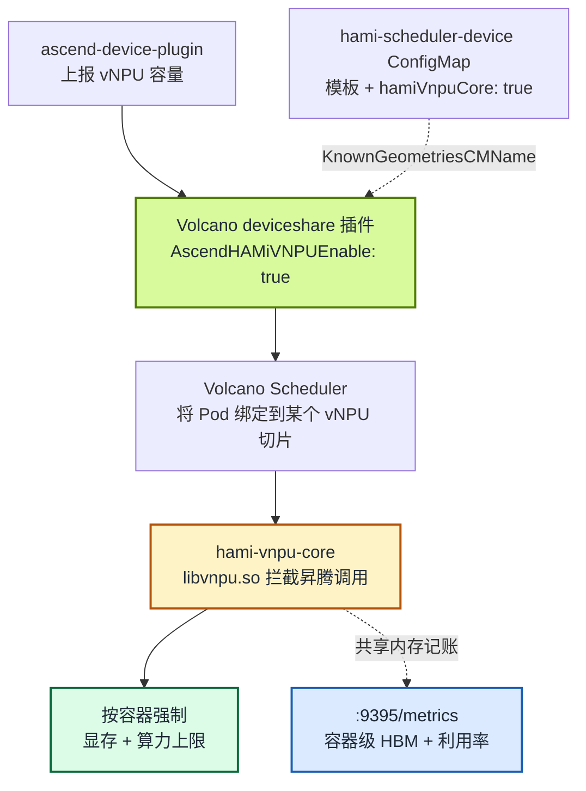

[Volcano](https://github.com/volcano-sh/volcano) 是很多 AI 集群的批量调度器首选，HAMi-core 则是让共享加速器"守规矩"的运行时。本文关注两者在昇腾硬件上的交汇点：在 **Volcano 调度器下运行 `hami-vnpu-core` 软切分的 vNPU**，让批量调度语义（队列、Gang、binpack）与容器级隔离（在昇腾 API 层强制生效的显存与算力上限）协同工作。

我们在一台昇腾 310P3 aarch64 服务器的单节点 Kubernetes 集群上验证了完整链路：源码编译 Volcano 镜像、部署官方 [ascend-device-plugin](https://github.com/Project-HAMi/ascend-device-plugin) v1.4.0 镜像，并确认申请 8192 MiB 切片的容器恰好只能看到这么多显存；同时第二个 Pod 以 binpack 方式落到同一张物理卡上、拿到独立切片，插件的 Prometheus 端点也如实上报了两个容器的配额。完整步骤（含每条命令与真实输出）见 [实验 13：用 Volcano + HAMi-core 软切分昇腾 310P3 vNPU](/zh/tutorials/labs/volcano-ascend-vnpu)。

这个话题里混着好几个经常被混为一谈的概念，所以本文先把层次分开：vNPU 是什么、硬切分和软切分有何不同、Volcano 集成相比已有的 HAMi 调度器路径到底新增了什么。

:::note 关于本文中的输出

本文所有输出均采集自真实的昇腾 310P3 物理服务器，截至撰写本文时已在真机上验证：麒麟 V10 aarch64 节点、2× 昇腾 310P3（驱动/npu-smi 25.5.1）、Kubernetes v1.28.15、containerd 1.7.1。其他集群中的 UUID、IP、Pod 后缀会不同；请对比组件名、调度位置与测量值。

:::

<!-- truncate -->

## 先把 NPU、vNPU、硬切分、软切分分清楚

vNPU、硬切分、软切分、HAMi 模式、Volcano 支持分别处在不同的层次，混在一起看就会显得像同一件事。它们各自回答不同的问题：

| 层次            | 回答的问题                                                       |
| :-------------- | :--------------------------------------------------------------- |
| NPU / vNPU      | 你拿到的是什么设备：vNPU 是从物理 NPU 划出、提供给容器的逻辑设备 |
| 硬切分 / 软切分 | 这个虚拟设备如何实现隔离                                         |
| HAMi-core       | 谁在容器内执行软切分配额                                         |
| HAMi / Volcano  | 由谁决定 Pod 用哪张卡、用多少资源                                |

NPU 是物理设备，例如服务器里真实存在的一张昇腾 310P3；vNPU 是从物理 NPU 上划出来、提供给容器使用的逻辑设备（一张 21.5 GiB 的卡可以划成 8 GiB 加 8 GiB 两份切片，剩余约 5.5 GiB）。但“vNPU”只表示结果，并不说明实现：切片既可能由昇腾驱动的虚拟化能力切出来，也可能由 HAMi-core 用软件模拟出来。这也是本话题最容易产生歧义的地方：本文所说的“软切分 vNPU”是 Kubernetes/HAMi 视角下的逻辑切片，并不是通过 `npu-smi ... create-vnpu` 创建的昇腾硬件 vNPU。

**硬切分**由昇腾驱动/固件的虚拟化能力完成，用户只能从预定义模板中选择：`vir05_1c_16g` 代表固定数量的 AI Core、AI CPU 和 16 GiB 显存，创建后设备层会产生一个真正的 vNPU 实例。可用 `npu-smi info -t template-info` 查询芯片支持的模板，完整实践见昇腾社区的[《NPU 卡虚拟化硬切分参考实践》](https://www.hiascend.com/developer/techArticles/20251212-1)。

**软切分**不在硬件里真正创建 vNPU，而是让多个容器共享同一张物理 NPU，在容器内注入 `libvnpu.so` 拦截应用对昇腾运行时 API 的调用并记账：

```text
应用
  ↓ 昇腾 API 调用
libvnpu.so 拦截并记账
  ↓ 只允许使用分配到的显存和算力
昇腾驱动
  ↓
物理 NPU
```

以 8192 MiB 配额为例：应用查询设备时只看到 8192 MiB，申请显存由 `libvnpu.so` 记账，超过配额的请求被运行时拦截层阻止，多个容器可以共享同一张物理卡。官方 [ascend-device-plugin 文档](https://github.com/Project-HAMi/ascend-device-plugin)也明确区分了“模板硬切分”与“运行时拦截的软切分”两种模式。两者对比：

|  | 硬切分 | 软切分 |
| :-- | :-- | :-- |
| 隔离边界 | 设备虚拟化层强制，更强 | 软件运行时拦截，不等于 SR-IOV 级硬件边界 |
| 规格 | 仅厂商模板，例如 8 GiB、16 GiB 档位 | 任意 MiB、算力比例 |
| 切分单元 | AI Core、AI CPU、显存、DVPP | 显存与算力配额 |
| 前置条件 | 芯片/驱动需支持对应模板 | 依赖 `libvnpu.so` 注入与驱动兼容，当前仅支持 ARM |

可以把两者理解成：**硬切分是在房子里真正砌墙；软切分是大家共用房子，但每个门口都有一个严格记账和限流的管理员。**

## Volcano 调度昇腾 vNPU 的两种方式

Volcano 调度昇腾虚拟 NPU 有**两种不同方式**，很容易混淆。先把它讲清楚，能省掉好几个小时的排错：

|  | MindCluster 模式 | HAMi 模式 |
| :-- | :-- | :-- |
| Volcano 开关 | `deviceshare.AscendMindClusterVNPUEnable` | `deviceshare.AscendHAMiVNPUEnable` |
| 提供方 | Volcano 原生昇腾插件 | [Project-HAMi/ascend-device-plugin](https://github.com/Project-HAMi/ascend-device-plugin) |
| 模板 | `vir04_3c_ndvpp`（带 `dvpp` 维度） | `vir05_1c_16g`（仅 `memory`/`aiCore`/`aiCPU` 字段） |
| 切分方式 | 驱动模板（硬切分） | 默认走驱动模板（硬切分），Pod 设置 `huawei.com/vnpu-mode: hami-core` 后走 `hami-core` 软切分 |
| 资源名 | `huawei.com/npu-core` | `huawei.com/Ascend310P`、`-memory` |

本文讲的是 **HAMi 模式**下的 **`hami-vnpu-core` 软切分**。注意，HAMi 模式并不等于软切分模式：同一个 ascend-device-plugin 同时支持模板硬切分与 hami-vnpu-core 软切分，由 Pod 的注解选择路径。实验中的 Pod 设置了该注解，因此走的是软切分路径，也是两种 Volcano 模式里唯一做运行时拦截的一种：不是把卡预先切成固定的虚拟化模板，而是在用户态拦截昇腾调用，在运行时按容器强制显存与算力上限。Volcano 决定哪个 Pod 拿到哪个切片，HAMi-core 让这个决定真正生效。

## Volcano 集成到底新增了什么

先纠正一个名字：**HAMi-core** 是这一类容器内运行时隔离技术的统称，最早主要指 NVIDIA 的 `libvgpu.so`；**hami-vnpu-core** 是专门面向昇腾 NPU 的实现，实际注入的是 `libvnpu.so`。

昇腾软切分能力本身并不是新东西。相关支持在 2026 年 4 月已经进入代码（[ascend-device-plugin 集成 hami-vnpu-core](https://github.com/Project-HAMi/ascend-device-plugin/pull/61)、[HAMi 增加昇腾 ResourceCoreName 和软切分调度支持](https://github.com/Project-HAMi/HAMi/pull/1771)），在 HAMi 2.9 中链路已经可用：HAMi 自己的调度器分配昇腾切片，`ascend-device-plugin` 完成设备挂载，`hami-vnpu-core` 在容器内执行显存和算力限制。

即将发布的 HAMi 2.10 中的 Volcano 集成没有重新发明软切分，而是把"分配者"从 HAMi Scheduler 换成了 Volcano，底下两层原样复用：

```text
HAMi 2.9:
HAMi Scheduler → ascend-device-plugin → hami-vnpu-core → NPU

HAMi 2.10 / Volcano 集成：
Volcano Scheduler → ascend-device-plugin → hami-vnpu-core → NPU
```

| 层次               | HAMi 2.9 路径                  | Volcano 集成路径            |
| :----------------- | :----------------------------- | :-------------------------- |
| 调度器             | HAMi Scheduler                 | Volcano Scheduler           |
| 设备发现/挂载      | ascend-device-plugin           | 同一个 ascend-device-plugin |
| 软切分执行         | hami-vnpu-core（`libvnpu.so`） | 同一个 hami-vnpu-core       |
| 显存、算力隔离     | 已支持                         | 复用原有能力                |
| 队列、Gang 调度    | 不是重点                       | Volcano 提供                |
| binpack / spread   | HAMi 策略                      | Volcano deviceshare 策略    |
| 监控及软硬混合管理 | 相对早期                       | 2.10 进一步补全             |

Volcano 现在能理解这些 HAMi 昇腾资源，并决定：哪个 Pod 使用哪张物理 NPU、多个 Pod 是否 binpack 到同一张卡、整组训练 Pod 是否满足 Gang 条件、使用哪个队列、优先级和抢占策略。因此准确的说法是：**这次集成完成的是"Volcano 调度昇腾 HAMi-core 软切分资源"，并补充监控及软硬切分混合管理；昇腾软切分能力本身早已存在。**

## 集成是如何工作的

这条链路有三个分工：

- **Volcano 的 `deviceshare` 插件**从 `hami-scheduler-device` ConfigMap（配合 `AscendHAMiVNPUEnable: "true"`）读取 vNPU 规格，并按 `binpack` 或 `spread` 策略决定每个 Pod 由哪个节点、哪张卡服务。
- **`ascend-device-plugin` DaemonSet** 向节点注册 `huawei.com/Ascend310P`（卡数）与 `huawei.com/Ascend310P-memory`（MiB）扩展资源，并把 HAMi-core 资产（`libvnpu.so` 和 `ld.so.preload`）拷贝到宿主机 `/usr/local/hami-vnpu-core/`。
- **HAMi-core（`libvnpu.so`）** 经 Ascend Docker Runtime 的 preload 机制注入业务容器，强制执行调度器选定的切片。



Pod 侧的契约很简洁：`schedulerName: volcano`、`runtimeClassName: ascend`、注解 `huawei.com/vnpu-mode: hami-core`，以及对两个扩展资源的 limits。少了这个注解，Pod 会退回模板路径，在纯软切分节点上可能一直 Pending。

[hami-vnpu-core](https://github.com/Project-HAMi/hami-vnpu-core) 的 `libvnpu.so` 在容器内通过 `/etc/ld.so.preload` 预加载，经 `/hami-shared-region` 共享内存区通信，并通过 `NPU_MEM_QUOTA` 等环境变量拿到强制配额。

## 基本步骤

以下步骤都在昇腾 310P3 服务器的单节点 Kubernetes 1.28 集群上执行，完整命令与真实输出见实验 13，核心流程如下：

1. **准备节点。** 驱动/npu-smi ≥ 25.5，安装 ascend-docker-runtime，并为节点打上 `ascend=on` 标签。
2. **安装 Volcano ≥ 1.16。** 软切分要求 1.16，而撰写本文时还没有稳定的 1.16（最新稳定版为 v1.15.1，仅有 `1.16.0-alpha.1` chart），因此验证时按实验 13 从源码编译了 Volcano master（commit `7d9504320`）。等稳定版本发布后，直接用 Helm 安装即可跳过编译：

   ```bash
   helm repo add volcano-sh https://volcano-sh.github.io/helm-charts
   helm install volcano volcano-sh/volcano \
     --namespace volcano-system --create-namespace \
     --version 1.16.0
   ```

3. **开启 HAMi 模式 deviceshare。** 覆盖 `volcano-scheduler-configmap`，让 `deviceshare` 插件带上 `AscendHAMiVNPUEnable: "true"`、`SchedulePolicy: binpack`、`KnownGeometriesCMName: hami-scheduler-device`，然后重启调度器。
4. **以软切分模式部署插件。** 应用 `ascend` RuntimeClass，在 `hami-scheduler-device` ConfigMap 中打开 `hamiVnpuCore: true`，并在 `hami-device-node-config` 中为节点打开 `hami-vnpu-core: true`，再部署 DaemonSet。节点随后上报 `huawei.com/Ascend310P` 与 `huawei.com/Ascend310P-memory` 资源。
5. **运行软切分 Pod。** `schedulerName: volcano`、`runtimeClassName: ascend`、注解 `huawei.com/vnpu-mode: hami-core`，limits 申请 1 张卡加 8192 MiB 显存。
6. **验证。** Pod 内 `npu-smi info` 显示的是切片而不是整卡，第二个 Pod 会 binpack 到同一张物理卡，插件的 `:9395` 端点导出容器级指标。

## 我们验证了什么

宿主机上两张 310P3 均为健康状态：

```text
$ npu-smi info
+--------------------------------------------------------------------------------------------------------+
| npu-smi 25.5.1                                   Version: 25.5.1                                       |
+-------------------------------+-----------------+------------------------------------------------------+
| NPU     Name                  | Health          | Power(W)     Temp(C)           Hugepages-Usage(page) |
| Chip    Device                | Bus-Id          | AICore(%)    Memory-Usage(MB)                        |
+===============================+=================+======================================================+
| 4       310P3                 | OK              | NA           37                0     / 0             |
| 0       0                     | 0000:81:00.0    | 0            1848 / 21525                            |
+===============================+=================+======================================================+
| 5       310P3                 | OK              | NA           40                0     / 0             |
| 0       1                     | 0000:85:00.0    | 0            1849 / 21525                            |
+===============================+=================+======================================================+
```

插件注册后，节点上报 14 个 vNPU（2 卡 × 7，与 `vDeviceCount: 7` 一致）与 43054 MiB 可分配显存。显存数字来自芯片配置（每卡 `memoryAllocatable: 21527` MB），比 `npu-smi` 显示的 21525 MB 每卡多 2 MiB。每个测试 Pod 申请 1 个 vNPU、8192 MiB 切片：

```yaml
resources:
  limits:
    huawei.com/Ascend310P: "1"
    huawei.com/Ascend310P-memory: "8192"
```

### 1. 容器只看到自己的切片

第一个 Pod 内的 `npu-smi info` 显示的是 **0 / 8192 MB** 的设备，而不是宿主机在同一张卡上看到的 1848 / 21525 MB：

```text
$ kubectl exec ascend-vnpu-check -- npu-smi info
[INFO limiter::supervisor] [Supervisor PID:10] won manager election
[INFO limiter::manager] [Manager] Registered as Global Manager #0 (PID: 10). Compute limit: 1, Memory limit: 8192, FixedShare: false
open global registry path is "/hami-shared-region/0_global_registry"
...
| 32768   310P3                 | OK              | NA           38                0     / 0             |
| 0       0                     | 0000:81:00.0    | 0            0    / 8192                             |
```

`libvnpu.so` 已把设备查询改写为容器的配额，注入的环境变量也印证了接线：`NPU_MEM_QUOTA=8192`、`NPU_GLOBAL_SHM_PATH=/hami-shared-region/0_global_registry`、`ASCEND_VISIBLE_DEVICES=0`。

### 2. binpack 让多个 Pod 共享一张物理卡

第二个同规格的 Pod 落在了**同一个 Bus-Id `0000:81:00.0`** 上，各自拥有独立的 8192 MiB 窗口，并作为 `Global Manager #1` 注册进与 Pod 1 的 `#0` 相同的共享注册表：

```text
$ kubectl exec ascend-vnpu-check-2 -- npu-smi info | grep -E "Memory limit|0000"
[INFO limiter::manager] [Manager] Registered as Global Manager #1 (PID: 10). Compute limit: 1, Memory limit: 8192, FixedShare: false
| 0       0                     | 0000:81:00.0    | 0            0    / 8192                             |
```

节点的已分配资源说的是同一件事：`huawei.com/Ascend310P 2`（共 14）、`huawei.com/Ascend310P-memory 16384`（共 43054），两个 8192 MiB 切片打包进一张 21.5 GiB 的卡，而不是分散到两张卡。

### 3. 容器级监控指标正常导出

插件（不是业务 Pod）在 `:9395` 上提供 Prometheus 指标：

```text
hami_vgpu_memory_limit_bytes{container="npu",...,pod="ascend-vnpu-check",vdevice_index="0"} 8.589934592e+09
hami_vgpu_memory_limit_bytes{container="npu",...,pod="ascend-vnpu-check-2",vdevice_index="0"} 8.589934592e+09
hami_host_gpu_memory_used_bytes{device_index="0",device_type="Ascend-Atlas 300I Pro",...} 1.937768448e+09
```

`8.589934592e+09` 字节恰好是 8192 MiB，与两个 Pod 的申请值一致，且两个 vdevice 挂在同一张物理卡的 UUID 上。该端点还导出 `hami_vgpu_memory_used_bytes`、`hami_container_device_utilization_ratio` 和 `hami_host_gpu_utilization_ratio`。

## 验证结果

| 验证项 | 结果 | 证据 |
| :-- | :-- | :-- |
| Volcano 源码编译（aarch64） | 通过 | 3 个镜像，scheduler `--version` 输出 commit `7d950432...` |
| 插件镜像携带匹配的 libvnpu | 通过 | `libvnpu.so` 资产已对照匹配驱动 25.5.1 的版本核验 |
| Volcano + HAMi 模式 deviceshare | 通过 | 调度器日志加载 `AscendHAMiVNPUEnable: "true"` |
| 节点资源注册 | 通过 | `Ascend310P: 14`、`Ascend310P-memory: 43054` |
| 显存切片隔离 | 通过 | 容器内 `0 / 8192`，宿主机 `1848 / 21525` |
| binpack 共卡 | 通过 | 两个 Pod 同为 Bus-Id `0000:81:00.0`，`Global Manager #0/#1` |
| 资源计量 | 通过 | 节点已分配 2 vNPU、16384 MiB |
| 监控 | 通过 | `:9395` 导出宿主机/容器/vdevice 三层指标 |

## 动手前值得知道的坑

- **`libvnpu.so` 必须与 NPU 驱动匹配。** 不匹配不会报错，容器内 `npu-smi` 只是永远卡在 `Initialize SchedulerClient...`。请从与驱动匹配的官方镜像版本拷贝资产并校验 md5。
- **Docker 与 containerd 的镜像存储是隔离的。** 用 `ctr -n k8s.io images import` 导入，否则等着收 `ErrImageNeverPull`。
- **Helm 里镜像拉取策略的 key 是 `basic.image_pull_policy`**（下划线），不是 `scheduler.imagePullPolicy`。key 写错时节点会去拉取只有本地才有的镜像。
- **v1.4.0 不注册 `-core` 资源。** Pod spec 只需要 `huawei.com/Ascend310P`（卡数）与 `huawei.com/Ascend310P-memory`（MiB）；配置里的 `resourceCoreName` 不会上报为节点资源。
- **指标在插件 Pod 上。** 在业务 Pod 里 curl `:9395` 毫无响应；要按 label 选中 DaemonSet Pod。
- **卸载 Volcano 后 `volcano-system` 可能卡在 Terminating**（webhook 已删除之后）。清理 namespace 的 finalizer 即可解除。

这里的软切分是运行时 API 层的强制（`libvnpu.so` 软件拦截），不是 SR-IOV 式的硬件安全边界，这一点与 HAMi-core 在 GPU 上的定性相同。

## 延伸阅读

- 完整流程（每条命令与真实输出）：[实验 13：用 Volcano + HAMi-core 软切分昇腾 310P3 vNPU](/zh/tutorials/labs/volcano-ascend-vnpu)
- 用户指南：[Volcano 中的华为昇腾设备](/zh/docs/installation/how-to-use-volcano-ascend) 与 [启用昇腾共享](/zh/docs/userguide/ascend-device/enable-ascend-sharing)
- 昇腾硬切分：[《NPU 卡虚拟化硬切分参考实践》（昇腾社区）](https://www.hiascend.com/developer/techArticles/20251212-1)
- 组件仓库：[Project-HAMi/ascend-device-plugin](https://github.com/Project-HAMi/ascend-device-plugin) · [Project-HAMi/hami-vnpu-core](https://github.com/Project-HAMi/hami-vnpu-core) · [volcano-sh/volcano](https://github.com/volcano-sh/volcano)
- 相关实验：[实验 8：Volcano vGPU、Gang 调度与队列限制](/zh/tutorials/labs/volcano-vgpu-gang-queue) 把同一套调度器用于 NVIDIA GPU
