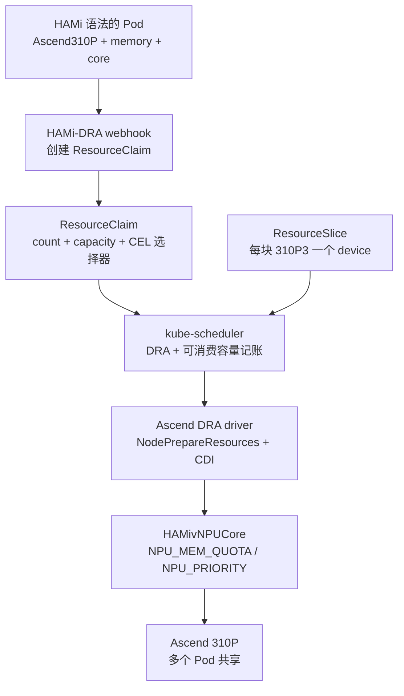

本实验在昇腾硬件上走完 HAMi DRA 的完整链路：安装 HAMi DRA 0.2.3 与 Ascend DRA Driver，提交一个使用普通 HAMi 语法（`huawei.com/Ascend310P` 加 `-memory` 与 `-core`）的 Pod，观察 admission webhook 把这个请求转换成 Kubernetes 原生的 ResourceClaim。随后 kube-scheduler 在一块物理 310P3 上分配切片，两个 Pod 以独立配额共享同一块卡，超额请求保持 Pending 直到容量被释放。本实验中所有输出块均来自验证服务器的真实采集。

## 实验目标

- HAMi DRA 如何把 HAMi 风格的 Extended Resource 转换成带 CEL 选择器与容量请求的 ResourceClaim
- 如何读懂 ResourceSlice：每块 NPU 一个 device，携带 `uuid`、`productName`、显存与算力容量、`allowMultipleAllocations`
- kube-scheduler 如何按 shareID 记账已消费容量，并把多个 Pod 放到同一块 NPU 上
- HAMivNPUCore 如何在容器内强制显存配额，把超限分配转成容器内 OOM
- Pod 删除后容量如何释放与再分配，以及与存量 HAMi core 部署共存时什么会出问题

## 实验概览



三个组件，三段职责，整个实验期间要分清：

- **HAMi-DRA** 负责“请求怎么声明”。它是一组 admission webhook，不做任何 NPU 虚拟化，也不部署 kubelet plugin。
- **Ascend DRA driver**（driver 名 `ascend.project-hami.io`，来自 [Project-HAMi/ascend-dra-driver](https://github.com/Project-HAMi/ascend-dra-driver)）负责“设备怎么分配”：设备发现、ResourceSlice 发布、kubelet Prepare/Unprepare、CDI 注入。
- **HAMivNPUCore** 负责“设备怎么共享”：`libvnpu.so` 拦截加容器内 limiter，强制显存配额（`NPU_MEM_QUOTA`）与算力时间片（`NPU_PRIORITY`）。

## 前置条件

- Kubernetes 1.34 或更高版本（DRA 核心 API 自 1.34 起 GA）。本实验在 1.35.7 上验证，单节点，control-plane 与 worker 同机。
- kube-apiserver、kube-controller-manager、kube-scheduler、kubelet 四处均开启 `DRAConsumableCapacity` feature gate（该 gate 在 1.36 之前为 alpha 且默认关闭，需显式开启）。容量请求与 `allowMultipleAllocations` 记账都依赖它。
- containerd 开启 CDI：`enable_cdi = true` 且 `cdi_spec_dirs = ["/etc/cdi", "/var/run/cdi"]`。
- ARM（aarch64）宿主机，昇腾驱动 25.5 或更高，用于软切分的每块 NPU 都开启 device-share 模式。
- `ascend` RuntimeClass 存在（Pod 需要 `runtimeClassName: ascend`）。
- cert-manager（HAMi-DRA 用它签发 webhook 证书）。

### 验证环境

| 组件 | 版本 / 取值 |
| :-- | :-- |
| 硬件 | 2 × Ascend 310P3（NPU ID 4 / 5，PCIe 0000:81:00.0 / 0000:85:00.0，每卡显存 21525 MB） |
| 操作系统 | 麒麟 Kylin Linux Advanced Server V10（Lance），aarch64，内核 4.19.90-52.48.v2207.ky10 |
| Kubernetes | v1.35.7，单节点 |
| 容器运行时 | containerd 1.7.29，已开启 CDI |
| Feature gates | kube-apiserver / kube-scheduler / kubelet 均开启 `DRAConsumableCapacity=true` |
| 昇腾驱动 / 固件 | 25.5.1 / 7.8.0.6.201 |
| HAMi-DRA | 0.2.3（chart 与镜像 tag 一致） |
| Ascend DRA driver | chart `ascend-dra-driver-0.1.1`（app 0.1.0），镜像 `projecthami/ascend-dra-driver:uuid-fix-20260909`（开发构建，见步骤 2） |
| 共存组件 | HAMi v2.10.0（hami-scheduler、hami-ascend-device-plugin）、cert-manager v1.21.1 |

### 检查 feature gate

```bash
ps -ef | grep -E "kube-apiserver|kube-controller-manager|kube-scheduler|kubelet" | grep -o "feature-gates=.*"
```

```text
feature-gates=DRAConsumableCapacity=true
feature-gates=DRAConsumableCapacity=true
```

列出的每个控制面组件都应带此 gate。任何一处缺失，容量请求会被拒绝，或者记账静默失效。

### 检查 containerd CDI

```bash
grep -E "enable_cdi|cdi_spec_dirs" /etc/containerd/config.toml
```

```text
    cdi_spec_dirs = ["/etc/cdi", "/var/run/cdi"]
    enable_cdi = true
```

### 为 NPU 开启 device-share

`-i` 为 `npu-smi info -l` 中的 NPU id（验证机上为 4 和 5）。该命令对指定 NPU 上所有 chip 生效：

```bash
npu-smi set -t device-share -i 4 -d 1
npu-smi set -t device-share -i 5 -d 1
npu-smi info -t device-share
```

```text
        NPU ID                         : 4
        Chip Count                     : 1

        Device-share Status            : True
        Chip ID                        : 0

        NPU ID                         : 5
        Chip Count                     : 1

        Device-share Status            : True
        Chip ID                        : 0
```

计划共享的每块卡都应是 `Device-share Status: True`。再确认 RuntimeClass 存在：

```bash
kubectl get runtimeclass ascend
```

```text
NAME      HANDLER   AGE
ascend    ascend    ...
```

### 与存量 HAMi core 部署共存

如果集群已在运行 HAMi core（hami-scheduler、hami-webhook、hami-ascend-device-plugin），它们的 mutating webhook 同样会拦截 `huawei.com/Ascend310P*` 资源请求，对同一个 Pod 二次改写。DRA 的 workload 必须在两层上同时豁免：

```bash
kubectl create ns dra-ascend-e2e
kubectl label ns dra-ascend-e2e hami.io/webhook=ignore
```

本实验的 Pod 另外带有标签 `hami.io/webhook: ignore`。在没有 HAMi core 的干净集群上，这一步无害但非必需。

## 步骤 1：安装 HAMi DRA 0.2.3

cert-manager 是前置依赖；验证集群已有 v1.21.1。干净集群先安装 cert-manager。

官方 Helm 仓库方式：

```bash
helm repo add hami-dra https://project-hami.github.io/HAMi-DRA
helm repo update
helm search repo hami-dra   # 确认 0.2.3
helm install hami-dra hami-dra/hami-dra -n hami-system \
  --version 0.2.3 -f ascend-values.yaml
```

`ascend-values.yaml` 只开启昇腾转换：

```yaml
deviceVendors:
  - ascend # 只开 Ascend 转换（910A/B2/B3/B4/B4-1/310P/910C）

drivers:
  nvidia:
    enabled: false # 不部署 NVIDIA kubelet driver
  fake:
    enabled: false

monitor:
  enabled: false # 可选的 Prometheus 指标组件，本实验未开启

certs:
  certManager:
    enabled: true
```

确认 webhook 正常：

```bash
kubectl get pods -n hami-system
kubectl get mutatingwebhookconfigurations,validatingwebhookconfigurations | grep hami-dra
```

```text
NAME                                          READY   STATUS    RESTARTS   AGE
hami-ascend-device-plugin-vp6tm               1/1     Running   0          5h22m
hami-dra-webhook-5b85c54c78-hbtjc             1/1     Running   0          13s
hami-resource-pool-manager-7b6bd856fb-phd7r   1/1     Running   0          5h23m
hami-scheduler-7dccfd9b96-7spsm               2/2     Running   0          5h28m
```

```text
mutatingwebhookconfiguration.admissionregistration.k8s.io/hami-dra-mutatingwebhookconfiguration
validatingwebhookconfiguration.admissionregistration.k8s.io/hami-dra-validatingwebhookconfiguration
```

这份列表里的 hami-scheduler 与 hami-ascend-device-plugin 属于先前已存在的 HAMi 安装，不属于 HAMi-DRA。HAMi-DRA 自身只运行一个 deployment，即 webhook。它不部署任何 kubelet plugin：昇腾的节点侧 driver 来自下一步。

## 步骤 2：安装 Ascend DRA Driver

```bash
git clone --recurse-submodules https://github.com/Project-HAMi/ascend-dra-driver.git
cd ascend-dra-driver
git checkout 91d82a28 # 本实验验证时使用的 commit
helm upgrade --install ascend-dra-driver \
  deployments/helm/ascend-dra-driver \
  --set image.tag=uuid-fix-20260909 \
  -n ascend-dra-driver --create-namespace
```

chart 默认开启 HAMivNPUCore 模式。不要设置 `kubeletPlugin.fullCardAndTraditionalVNPU.enabled=true`：那会切换到整卡 / 模板 vNPU 路径，该路径仍在开发中，且会关闭 HAMivNPUCore gate。

:::note 关于本实验使用的镜像版本

验证运行使用 chart `ascend-dra-driver-0.1.1`，镜像覆盖为开发构建 `projecthami/ascend-dra-driver:uuid-fix-20260909`，该构建修复了早期版本 ResourceSlice uuid 生成的 bug。正式发布前行为可能变化；请固定你实际测试过的版本。

:::

检查 driver DaemonSet 与它发布的 DRA 对象：

```bash
kubectl get pods -n ascend-dra-driver
kubectl get deviceclass
kubectl get resourceslice
```

预期：driver Pod 全部 Running，一个名为 `hami-vnpu-core.project-hami.io` 的 DeviceClass，每个节点一条 driver 为 `ascend.project-hami.io` 的 ResourceSlice。

## 步骤 3：查看 DeviceClass 与 ResourceSlice

DeviceClass 用 CEL 表达式按 driver 与 type 过滤设备：

```bash
kubectl get deviceclass hami-vnpu-core.project-hami.io -o yaml
```

```yaml
apiVersion: resource.k8s.io/v1
kind: DeviceClass
metadata:
  name: hami-vnpu-core.project-hami.io
spec:
  selectors:
    - cel:
        expression: |-
          device.driver == "ascend.project-hami.io" &&
          device.attributes["ascend.project-hami.io"].type == "HAMivNPUCore"
```

ResourceSlice 是 Kubernetes 第一次“看见”NPU 的地方：

```bash
kubectl get resourceslice
```

```text
NAME                                       DRIVER                    NODE            AGE
aio-node74-arm-ascend.project-hami.io-gktzs   ascend.project-hami.io   aio-node74-arm   3m
```

展开查看（节选；完整对象用 `kubectl get resourceslice -o yaml`）：

```yaml
apiVersion: resource.k8s.io/v1
kind: ResourceSlice
metadata:
  name: aio-node74-arm-ascend.project-hami.io-gktzs
  ownerReferences:
    - kind: Node
      name: aio-node74-arm
spec:
  driver: ascend.project-hami.io
  nodeName: aio-node74-arm
  pool:
    name: aio-node74-arm
    resourceSliceCount: 1
  devices:
    - allowMultipleAllocations: true # 允许多个 claim 消费同一设备
      name: npu-0-0
      attributes:
        brand: { string: Huawei }
        index: { int: 0 }
        model: { string: 310P3 }
        physicalID: { int: 0 }
        productName: { string: 310P3 }
        type: { string: HAMivNPUCore }
        uuid: { string: 68496E64-20E05477-92C31323-6E78030A-BD003019 }
      capacity:
        cores:
          value: "100" # 整卡算力记为 100
          requestPolicy: { default: "100", validRange: { min: "0", max: "100", step: "1" } }
        memory:
          value: 21525Mi # 与 npu-smi 一致
          requestPolicy: { default: 21525Mi, validRange: { min: 1Mi, max: 21525Mi, step: 1Mi } }
    - allowMultipleAllocations: true
      name: npu-1-0
      attributes:
        index: { int: 1 }
        physicalID: { int: 2 }
        productName: { string: 310P3 }
        type: { string: HAMivNPUCore }
        uuid: { string: D8496E64-20C101B1-C0D42F23-AED8030A-40003039 }
      capacity:
        cores: { value: "100", ... }
        memory: { value: 21525Mi, ... }
```

四处细节对后续步骤至关重要：

- 每块 310P3 是一个 device（`npu-0-0`、`npu-1-0`），不是节点上的卡数计数。
- `uuid` attribute 是芯片 UUID，例如 `68496E64-20E05477-92C31323-6E78030A-BD003019`，**不是**“节点名 - 序号”格式的字符串。选卡注解的值必须从这里抄，不能凭记忆手写。
- 容量沿两个维度发布：`memory`（MiB）与 `cores`（整卡百分比），各自的 `requestPolicy` 声明合法请求范围与步长。
- `allowMultipleAllocations: true` 允许同一设备被多个 ResourceClaim 分配。没有它就没有 NPU 共享。

ResourceSlice device 与物理卡的对应关系（共享实验期间用 `npu-smi info` 进程列表交叉验证）：

| ResourceSlice device | uuid（前 8 位） | npu-smi NPU ID | PCIe 总线    |
| :------------------- | :-------------- | :------------- | :----------- |
| npu-0-0              | 68496E64        | 4              | 0000:81:00.0 |
| npu-1-0              | D8496E64        | 5              | 0000:85:00.0 |

## 步骤 4：运行第一个昇腾 Workload

资源请求语法与 HAMi 完全一致：

- 计数：`huawei.com/Ascend310P`（整数，张数）
- 显存：`huawei.com/Ascend310P-memory`（MiB）
- 算力：`huawei.com/Ascend310P-core`（百分比）
- 选卡：`hami.io/use-Ascend310P-uuid`，值从 ResourceSlice 的 `uuid` 抄写
- 选型：`hami.io/use-nputype`，与 `productName` 匹配（本实验未使用）

```yaml
apiVersion: v1
kind: Pod
metadata:
  name: ascend-share-a
  namespace: dra-ascend-e2e
  labels:
    hami.io/webhook: ignore
  annotations:
    hami.io/use-Ascend310P-uuid: "68496E64-20E05477-92C31323-6E78030A-BD003019" # 固定到 npu-0-0
spec:
  runtimeClassName: ascend
  containers:
    - name: app
      image: quay.io/ascend/vllm-ascend:v0.23.0-310p
      command: ["sh", "-c", "sleep 3600"]
      resources:
        limits:
          huawei.com/Ascend310P: 1
          huawei.com/Ascend310P-memory: "8192"
          huawei.com/Ascend310P-core: "50"
```

manifest 里的三个选择：`hami.io/webhook: ignore` 标签让共存的 HAMi core webhook 不碰这个 Pod；`runtimeClassName: ascend` 让 containerd 走 Ascend Docker Runtime；`vllm-ascend` 镜像内含 CANN、torch_npu 与 npu-smi，方便稍后从容器内部检查设备。

```bash
kubectl apply -f pod.yaml
kubectl get pod ascend-share-a -n dra-ascend-e2e
```

```text
NAME            READY   STATUS    RESTARTS   AGE     IP            NODE
ascend-share-a  1/1     Running   0          3m45s   10.244.0.28   aio-node74-arm
```

Running 只说明 Kubernetes 层面满足了。在信任它之前，先看 webhook 到底做了什么。

## 步骤 5：观察请求到 ResourceClaim 的转换

保存改写后的 Pod，与提交的内容对比：

```bash
kubectl get pod ascend-share-a -n dra-ascend-e2e -o yaml > mutated-pod.yaml
```

`resources.limits` 里的三个 `huawei.com/*` 条目消失了。取而代之：

```yaml
apiVersion: v1
kind: Pod
metadata:
  name: ascend-share-a
  namespace: dra-ascend-e2e
  labels:
    hami.io/dra: "true" # webhook 新增
    hami.io/webhook: ignore
  annotations:
    hami.io/use-Ascend310P-uuid: 68496E64-20E05477-92C31323-6E78030A-BD003019
spec:
  runtimeClassName: ascend
  containers:
    - name: app
      image: quay.io/ascend/vllm-ascend:v0.23.0-310p
      resources:
        claims: # 容器级引用
          - name: dra-ascend-e2e-ascend-share-a-app-ascend310p
  resourceClaims: # Pod 级引用
    - name: dra-ascend-e2e-ascend-share-a-app-ascend310p
      resourceClaimName: dra-ascend-e2e-ascend-share-a-app-ascend310p
```

生成的 ResourceClaim（已分配后的状态）：

```bash
kubectl get resourceclaim -n dra-ascend-e2e
kubectl get resourceclaim dra-ascend-e2e-ascend-share-a-app-ascend310p -n dra-ascend-e2e -o yaml
```

```text
NAME                                           STATE              AGE
dra-ascend-e2e-ascend-share-a-app-ascend310p   allocated,reserved 3m
```

```yaml
apiVersion: resource.k8s.io/v1
kind: ResourceClaim
metadata:
  name: dra-ascend-e2e-ascend-share-a-app-ascend310p
  namespace: dra-ascend-e2e
  finalizers:
    - resource.kubernetes.io/delete-protection
spec:
  devices:
    requests:
      - name: npu
        exactly:
          allocationMode: ExactCount
          count: 1
          deviceClassName: hami-vnpu-core.project-hami.io
          capacity:
            requests:
              cores: "50" # 百分比直传
              memory: "8589934592" # 8192 MiB × 1024 × 1024 = 8 GiB（字节）
          selectors:
            - cel:
                expression: device.driver == "ascend.project-hami.io" && device.attributes["ascend.project-hami.io"].type == "HAMivNPUCore"
            - cel:
                expression: device.attributes["ascend.project-hami.io"].uuid in ["68496E64-20E05477-92C31323-6E78030A-BD003019"]
status:
  allocation:
    devices:
      results:
        - consumedCapacity:
            cores: "50"
            memory: 8Gi
          device: npu-0-0 # 调度器选中的设备
          driver: ascend.project-hami.io
          pool: aio-node74-arm
          request: npu
          shareID: be06132e-0aff-4efc-bd8e-42a4e06ed385
    nodeSelector:
      nodeSelectorTerms:
        - matchFields:
            - key: metadata.name
              operator: In
              values: [aio-node74-arm]
  reservedFor:
    - name: ascend-share-a
      resource: pods
```

逐字段对照，HAMi 语义就是这样进入 DRA 语义的：

| ResourceClaim 字段 | 来源 | 转换规则 |
| :-- | :-- | :-- |
| `count: 1` | `huawei.com/Ascend310P: 1` | 整数直传 |
| `capacity.requests.memory: 8589934592` | `-memory: 8192`（MiB） | MiB 转字节，`value × 1024 × 1024` |
| `capacity.requests.cores: "50"` | `-core: 50` | 百分比直传 |
| selectors 第 1 条 | 固定 | 匹配 driver 加 `type == HAMivNPUCore`，与 DeviceClass 同源 |
| selectors 第 2 条 | 注解 `hami.io/use-Ascend310P-uuid` | `uuid in ["..."]`；`no-use-*` 反选注解生成取反表达式 |
| （如使用）第 3 条 | 注解 `hami.io/use-nputype` | 与 `productName` 匹配 |
| claim 名称 | namespace + pod + container | 超过 DNS-1123 的 63 字符时截断并附加 sha256 后缀 |

两个细节值得停留。单位转换：HAMi 的 `-memory` 是 MiB 语义，DRA 的 capacity 是 Quantity（字节），所以 8192 MiB 变成 `8589934592`；用户写的是 HAMi 语法，记账落在 DRA 上。`shareID`：每个已分配的 claim 都有一个，它是 `DRAConsumableCapacity`（KEP-5075）记账模型的凭证，同一设备上的多份消费各自独立记账，共享步骤会看到两个不同的 shareID。

## 步骤 6：验证 NPU 分配

从集群到节点，分三层。

**Kubernetes 层。** claim 为 `allocated,reserved`，`status.allocation.devices.results[0].device` 为 `npu-0-0`，见上一节采集。

**容器层。** 配额与设备环境变量：

```bash
kubectl exec -it ascend-share-a -n dra-ascend-e2e -- env | grep -E "NPU_|ASCEND_"
kubectl exec -it ascend-share-a -n dra-ascend-e2e -- ls /dev/davinci* /dev/davinci_manager /dev/devmm_svm
```

```text
NPU_PRIORITY=50
ASCEND_VISIBLE_DEVICES=0
NPU_GLOBAL_SHM_PATH=/hami-shared-region/0_global_registry
NPU_LOCAL_SHM_PATH=/hami-vnpu-shmem/vnpu_local_shmem
NPU_MEM_QUOTA=8192
```

```text
/dev/davinci0
/dev/davinci_manager
/dev/devmm_svm
```

`NPU_MEM_QUOTA=8192` 与 `NPU_PRIORITY=50` 是 HAMivNPUCore 的显存配额（MiB）与算力时间片，与请求的 `-memory 8192`、`-core 50` 一一对应。`ASCEND_VISIBLE_DEVICES=0` 与 `/dev/davinci0` 来自 CDI 注入；容器内由 `ld.so.preload` 指向的 `libvnpu.so` 同样由 CDI 挂载，这是拦截的入口。

**节点层。** driver 在 Prepare 阶段为每个 claim 生成 CDI spec（`CDI_ROOT=/var/run/cdi`）：

```bash
ls /var/run/cdi/
```

```text
k8s.ascend.project-hami.io-npu_8ec6bbf9-8ce0-4aa1-bc57-7078653d090c.yaml   # 本 claim，uid 命名
k8s.ascend.project-hami.io-npu_common.yaml
```

开启 `enable_cdi` 的 containerd 在创建容器时按 spec 注入设备与环境变量。DRA 的分配结果通过 CDI 这个标准接口落到容器运行时。设备层的最终证明在步骤 8：真实 workload 运行后，容器的 torch_npu 报告 8 GiB 设备而不是 21 GiB 整卡。

## 步骤 7：两个 Pod 共享一块 NPU

核心实验：两个 Pod 请求同一块物理 310P3 的部分容量。关键是两个 Pod 使用同一个 uuid 注解。本机有两块卡，不固定的话调度器可能把 Pod 分散到两块卡上，什么也证明不了：

```text
物理 Ascend 310P（uuid 68496E64-...，device npu-0-0，容量 21525 MiB / 100 cores）

+-- Pod A（ascend-share-a）：memory 8192 MiB + core 50
+-- Pod B（ascend-share-b）：memory 8192 MiB + core 50
```

复制第一个 Pod 创建第二个：

```bash
sed 's/ascend-share-a/ascend-share-b/' pod.yaml | kubectl apply -f -
kubectl get resourceclaim -n dra-ascend-e2e
```

```text
NAME                                           STATE              AGE
dra-ascend-e2e-ascend-share-a-app-ascend310p   allocated,reserved 6m
dra-ascend-e2e-ascend-share-b-app-ascend310p   allocated,reserved 2m
```

对比两个 claim 的分配结果：

```yaml
# claim-a
results:
  - device: npu-0-0 # 同一个 device
    consumedCapacity: { cores: "50", memory: 8Gi }
    shareID: be06132e-0aff-4efc-bd8e-42a4e06ed385

# claim-b
results:
  - device: npu-0-0 # 同一个 device
    consumedCapacity: { cores: "50", memory: 8Gi }
    shareID: 5554db84-1574-46bd-a3ea-0b7197fbbbda # 各自独立的记账凭证
```

两个 claim 都落在 `npu-0-0` 上，各有独立 shareID。分配 B 之前，调度器已把 A 消费的 8 GiB、50 cores 记在账上；这正是 `DRAConsumableCapacity` 加 `allowMultipleAllocations: true` 带来的能力。Pod 与设备层面：

```bash
kubectl get pods -n dra-ascend-e2e -o wide
```

```text
NAME             READY   STATUS    IP            NODE
ascend-share-a   1/1     Running   10.244.0.28   aio-node74-arm
ascend-share-b   1/1     Running   10.244.0.29   aio-node74-arm
```

两个容器看到同一个设备节点与各自的配额：

```text
pod a: /dev/davinci0  NPU_MEM_QUOTA=8192  NPU_PRIORITY=50  ASCEND_VISIBLE_DEVICES=0
pod b: /dev/davinci0  NPU_MEM_QUOTA=8192  NPU_PRIORITY=50  ASCEND_VISIBLE_DEVICES=0
```

软切分模式下两个容器看到的是同一个 `/dev/davinci0`，不是两个 vNPU 设备节点；隔离由 libvnpu 在用户态完成。步骤 8 中真实 workload 运行后，节点 `npu-smi` 的进程列表会在 NPU 4 上同时出现两个容器的进程。

## 步骤 8：验证隔离与配额强制

在 Pod A 的容器内运行 PyTorch/torch_npu 张量分配测试（镜像内含完整 CANN 运行时）。先分配到接近配额，再尝试超限：

```text
# limiter（HAMivNPUCore 容器内管理器）注册进程
[2026-09-17T10:18:46Z INFO  limiter::worker] [Worker PID:381] Initialize SchedulerClient...
[2026-09-17T10:18:46Z INFO  limiter::worker] [Worker PID:381] Registered at proc slot 1

# 已用 ~6150 MB 时再申请 2050 MB：被拒
[2026-09-17T10:22:22Z WARN  limiter::worker] [Worker PID:1139] Memory Quota Exceeded!
  Request: 2050 MB, Used: 6150 MB, Limit: 8192 MB

# 应用侧表现为容器内的 OOM（注意 total capacity 显示 8.00 GiB，不是整卡 21 GiB）
torch.OutOfMemoryError: NPU out of memory. Tried to allocate 2.00 GiB
  (NPU 0; 8.00 GiB total capacity; 2.00 GiB already allocated; ...)
```

这段采集同时证明两件事：配额由 libvnpu 与 limiter 在用户态强制执行，超限请求被转成容器内 OOM；容器视角的设备已被虚拟化为 8 GiB，与 `-memory 8192` 请求一致，而不是物理的 21525 MB。节点侧，两个容器的进程落在同一块物理卡上：

```bash
npu-smi info   # 进程列表（节选）
```

```text
| NPU   Chip   | Process id   | Process name   | Process memory(MB)   |
| 4     0      | 44533        | python3        | 2156                 |
| 4     0      | 49806        | python3        | 2156                 |
```

`NPU_PRIORITY=50` 同样被注入，通过时间片调度约束算力。本实验验证了注入，但没有运行长时间的满载对照 workload，因此不对 310P 上时间片隔离的实际强度下结论；算力维度在调度层的记账由下一步完整覆盖。

## 步骤 9：耗尽容量、释放与再分配

Pod A 与 B 此时占住 `npu-0-0` 的 16384 MiB / 100 cores；该设备只剩 5141 MiB / 0 cores。将 `pod.yaml` 改名派生出 Pod C（仍为 8192 MiB / 50 cores，uuid 注解相同）：

```bash
sed 's/ascend-share-a/ascend-share-c/' pod.yaml | kubectl apply -f -
kubectl get pod ascend-share-c -n dra-ascend-e2e
kubectl describe pod ascend-share-c -n dra-ascend-e2e | tail -4
kubectl get resourceclaim -n dra-ascend-e2e
```

```text
NAME            READY   STATUS    RESTARTS   AGE
ascend-share-c  0/1     Pending   0          133m
```

```text
  Warning  FailedScheduling  3m3s (x27 over 133m)  default-scheduler
  0/1 nodes are available: 1 cannot allocate all claims. still not schedulable,
  preemption: 0/1 nodes are available: 1 Preemption is not helpful for scheduling.
```

```text
NAME                                           STATE                AGE
dra-ascend-e2e-ascend-share-a-app-ascend310p   allocated,reserved   157m
dra-ascend-e2e-ascend-share-b-app-ascend310p   allocated,reserved   153m
dra-ascend-e2e-ascend-share-c-app-ascend310p   pending              133m
```

Pod C 的 claim 停在 `pending`，没有分配结果。第二块卡 `npu-1-0` 空闲，但 uuid 注解把 Pod C 钉死在 `npu-0-0` 上，调度器如实拒绝。拒绝发生在调度器内部，不依赖节点上的 device plugin 汇报。

### 对照实验：单独验证 memory 维度

Pod C 同时超了两个维度（memory 8192 > 5141，cores 50 > 0），单靠它无法区分是哪个维度拒绝的。在第二块卡上做一组对照，单独隔离 memory 维度：

| Pod | 请求 | npu-1-0 状态 | 结果 |
| :-- | :-- | :-- | :-- |
| ascend-ctrl-a | 8192 MiB / 50 cores（uuid D8496E64） | 初始 21525 / 100 | Running，分配后剩 13333 MiB / 50 cores |
| ascend-ctrl-b | 14000 MiB / 40 cores（同 uuid） | 剩余 13333 / 50 | Pending |

ctrl-b 的算力请求满足（40 ≤ 50），显存请求不满足（14000 > 13333）：

```text
  Warning  FailedScheduling  4m16s (x2 over 9m17s)  default-scheduler
  0/1 nodes are available: 1 cannot allocate all claims. still not schedulable, ...
```

memory 与 cores 是两个独立记账维度：调度器逐维度对账所有已分配 claim 的 `consumedCapacity` 与 ResourceSlice 的 `capacity.value`。

### 释放与再分配

删除 Pod A，观察三个层面的恢复：

```bash
kubectl delete pod ascend-share-a -n dra-ascend-e2e
kubectl get resourceclaim -n dra-ascend-e2e
```

```text
NAME                                           STATE                AGE
dra-ascend-e2e-ascend-ctrl-a-app-ascend310p    allocated,reserved   10m
dra-ascend-e2e-ascend-ctrl-b-app-ascend310p    pending              10m
dra-ascend-e2e-ascend-share-b-app-ascend310p   allocated,reserved   164m
dra-ascend-e2e-ascend-share-c-app-ascend310p   allocated,reserved   143m   # 由 pending 转为已分配
```

share-a 的 claim 消失了：HAMi-DRA 的 validating webhook 监听带 `hami.io/dra` 标签的 Pod 删除事件，主动删除对应 ResourceClaim。节点侧，driver 的 Unprepare 删除了 share-a 的 CDI spec，并为 share-c 生成新的：

```text
# before
k8s.ascend.project-hami.io-npu_1b737f89-...yaml   (share-b)
k8s.ascend.project-hami.io-npu_8ec6bbf9-...yaml   (share-a，待回收)
# after
k8s.ascend.project-hami.io-npu_1b737f89-...yaml   (share-b)
k8s.ascend.project-hami.io-npu_8a2fd648-...yaml   (share-c，新分配)
```

容量恢复后（16384 - 8192 = 8192 MiB 已用，剩余 13333 ≥ 8192，cores 50 ≤ 50），Pod C 在 18 秒内被重新调度，并分配到同一设备：

```text
  Warning  FailedScheduling  3m42s (x29 over 143m)  default-scheduler  (此前 29 次拒绝)
  Normal   Scheduled         18s   default-scheduler
  Successfully assigned dra-ascend-e2e/ascend-share-c to aio-node74-arm
  Normal   Started           16s   kubelet  Container started

# share-c 的分配：同一个 npu-0-0，继承被释放的容量
{"consumedCapacity":{"cores":"50","memory":"8Gi"},"device":"npu-0-0",
 "driver":"ascend.project-hami.io","pool":"aio-node74-arm",
 "shareID":"70cbda02-b70e-47d3-b9c8-c5c5c608a1fb"}
```

完整生命周期闭环：allocate(A)、share(A + B 共享 npu-0-0)、reject(C，容量不足)、release(A)、reallocate(C 落到同一 device)。

:::note claim 清理的边界

claim 的删除由 HAMi-DRA validating webhook 负责。如果 Pod 删除时 webhook 宕机，claim 可能残留（在记账中继续占住容量），需要手动清理或等 webhook 恢复；见故障排查。

:::

## 故障排查

### 与 HAMi core webhook 冲突

- **症状**：集群中已有 HAMi core 时，DRA 的 Pod 被二次改写、携带非预期注解，或调度行为异常。
- **原因**：HAMi core 的 mutating webhook 同样拦截 `huawei.com/Ascend310P*` 资源请求。
- **检查**：`kubectl get mutatingwebhookconfigurations | grep hami`；对比 Pod 提交前后的 spec。
- **修复**：namespace 与 Pod 双层打 `hami.io/webhook: ignore` 标签，与本实验一致。

### CEL 选择器与 ResourceSlice 不匹配

- **症状**：Pod 一直 Pending，事件为 `cannot allocate all claims`；claim 停在 `pending`。
- **原因**：uuid 注解与实际发布的 uuid 不一致（例如凭印象写成“节点名 - 序号”）。早期 driver 版本的 uuid 生成也有 bug，本实验因此使用 `uuid-fix-20260909` 构建。
- **检查**：`kubectl get resourceslice -o yaml | grep -A2 uuid`，对照 Pod 注解。
- **修复**：uuid 永远从 ResourceSlice 抄写；`hami.io/use-nputype` 的值对 `productName`（如 `310P3`）。

### DRAConsumableCapacity 未开启

- **症状**：带 `capacity.requests` 的 ResourceClaim 被拒，或调度不记账（超额也能调度、共享行为异常）。
- **原因**：容量请求与 `allowMultipleAllocations` 记账依赖该 gate。
- **检查**：`ps -ef | grep -E "kube-apiserver|kube-controller-manager|kube-scheduler|kubelet" | grep -o "feature-gates=.*"`。
- **修复**：四个组件统一加 `DRAConsumableCapacity=true` 并重启。

### device-share 未开启

- **症状**：driver Prepare 失败，或容器无法正常使用软切分设备。
- **原因**：HAMivNPUCore 要求芯片开启容器共享模式、昇腾驱动 25.5 或更高、ARM 平台。
- **检查**：`npu-smi info -t device-share`；`/usr/local/Ascend/driver/version.info`。
- **修复**：`npu-smi set -t device-share -i <NPU id> -d 1`（对指定 NPU 上所有 chip 生效）。

### Pod Running 但容器里看不到 NPU

- **症状**：claim 已分配、Pod Running，但容器内没有 `/dev/davinci*`，也没有配额环境变量。
- **原因**：缺 `runtimeClassName: ascend`，或镜像内缺少 CANN 与 npu-smi（设备注入靠 CDI 加 RuntimeClass；用户态工具来自镜像）。
- **检查**：`kubectl get pod <pod> -o jsonpath='{.spec.runtimeClassName}'`；`kubectl exec ... -- ls /dev/davinci*`。
- **修复**：补 RuntimeClass；换带 CANN 运行时的镜像（本实验用 `quay.io/ascend/vllm-ascend:v0.23.0-310p`）。

### ResourceClaim 泄漏

- **症状**：Pod 已删除但 ResourceClaim 残留（`allocated,reserved`），占住容量，导致后续 Pod 无故 Pending。
- **原因**：Pod 删除时 validating webhook 宕机或漏配 RBAC。claim 自带 `resource.kubernetes.io/delete-protection` finalizer，不会被误删，反过来也意味着不会自动消失。
- **检查**：`kubectl get resourceclaim -A` 对照存活的 `hami.io/dra=true` Pod。
- **修复**：手动删除孤儿 claim；检查 hami-dra-webhook Pod 状态与日志。

## 清理

```bash
kubectl delete pod ascend-share-a ascend-share-b ascend-share-c \
  ascend-ctrl-a ascend-ctrl-b -n dra-ascend-e2e --ignore-not-found
kubectl get resourceclaim -A | grep ascend310p | awk '{print $1, $2}' | \
  xargs -n2 kubectl delete resourceclaim -n 2>/dev/null || true
kubectl delete ns dra-ascend-e2e --ignore-not-found

helm uninstall ascend-dra-driver -n ascend-dra-driver
kubectl delete ns ascend-dra-driver --ignore-not-found

helm uninstall hami-dra -n hami-system
```

如果其他 workload 还在用，feature gate 与 `ascend` RuntimeClass 可以保留。共享实验机上 `device-share` 也可以保持开启；关闭它会影响该卡上的所有 workload，包括 HAMi core 的。

## 本实验证明了什么

| 结论 | 证据 |
| :-- | :-- |
| 昇腾 310P 设备发现与 ResourceSlice 发布 | 2 个 device，携带 uuid、capacity、requestPolicy |
| HAMi 请求到 ResourceClaim 的转换 | 改写后的 Pod、claim YAML、MiB 转字节 `8589934592`、CEL 选择器 |
| 原生 DRA 调度分配 | `allocated,reserved` claim，含 shareID 的分配结果 |
| 通过 CDI 注入设备 | 容器内环境变量与 `/dev/davinci0`，`/var/run/cdi` 下的 spec |
| 两个 Pod 共享一块物理 NPU | 两个 claim 均在 `npu-0-0`，独立 shareID |
| 显存隔离 | limiter 在 8192 MB 处拒绝，容器 OOM，torch_npu 报告 8.00 GiB |
| 算力隔离 | `NPU_PRIORITY=50` 注入（注入已验证；时间片强度未量化） |
| memory 与 cores 独立记账 | Pod C Pending；对照组单独隔离出 memory 维度 |
| 释放与再分配 | claim 删除、CDI spec 更换、Pod C 18 秒内重新调度 |

## 下一步

- 这条链路背后的概念与设计：[如何使用 HAMi DRA](/zh/docs/installation/how-to-use-hami-dra)
- NVIDIA GPU 上的同一套转换流程：[实验 4：用 DRA 切分 GPU](/zh/tutorials/labs/hami-dra) 与 [实验 11：KServe 推理与 HAMi DRA GPU 共享](/zh/tutorials/labs/kserve-hami-dra)
- 同一块硬件走 device-plugin 路径：[实验 13：用 Volcano + HAMi-core 软切分昇腾 310P3 vNPU](/zh/tutorials/labs/volcano-ascend-vnpu)
- 相关组件：[Project-HAMi/HAMi-DRA](https://github.com/Project-HAMi/HAMi-DRA) · [Project-HAMi/ascend-dra-driver](https://github.com/Project-HAMi/ascend-dra-driver) · [Project-HAMi/hami-vnpu-core](https://github.com/Project-HAMi/hami-vnpu-core)
