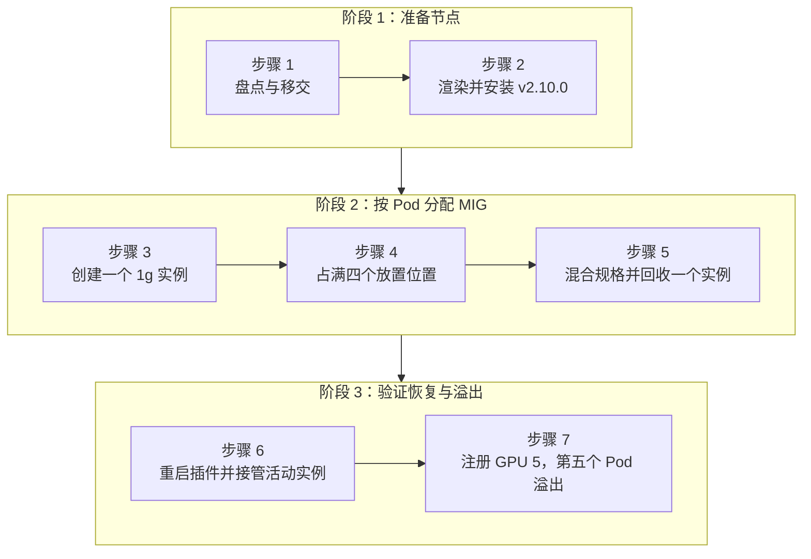

本实验安装官方 HAMi v2.10.0 Chart，并跟踪一次 MIG 分配的完整生命周期：创建、容量饱和、混合规格放置、选择性回收、设备插件接管，以及溢出到第二张 GPU。Pod 通过 HAMi 的标准资源 API 请求显存；HAMi 选择显存足够且存在合法空闲位置的最小 NVIDIA MIG 规格，随后创建该 Pod 的 GPU Instance（GI）和 Compute Instance（CI），并在 Pod 结束后将其回收。

本流程源自 [Shubham Katara](https://github.com/shkatara) 和 [Saiyam Pathak](https://github.com/saiyam1814) 共同发表于 kubesimplify 博客的[首次验证测试](https://blog.kubesimplify.com/dynamic-mig-in-kubernetes-with-hami)。完整的 Dynamic MIG 生命周期及下方输出已于 2026-09-15 使用官方 v2.10.0 Chart 和 `projecthami/hami:v2.10.0` 发布镜像重新验证；生命周期测试结束后还重复执行了文档中的全新安装流程，并恢复到相同的健康单 GPU 基线。HAMi v2.10.0 包含引入 Per-Pod Dynamic MIG 实现的 [HAMi PR #2378](https://github.com/Project-HAMi/HAMi/pull/2378)。

## 你将学习的内容

- 固定官方HAMi chart并将其所有三个HAMi运行时容器版本锁定为v2.10.0。
- 区分HAMi的每节点`operatingmode: "mig"`与NVIDIA的静态`migStrategy`。
- 验证一个8000 MiB请求，四放置饱和度，以及混合`1g.24gb`和`2g.48gb`放置。
- 证明删除一个Pod仅回收其GI/CI，同时相邻的CUDA循环继续进行。
- 证明在设备插件重启且保持相同MIG UUID的情况下，完整的实时分配能够存活。
- 露出第二个GPU，并验证第五个小型Pod溢出而不是过度占用第一个GPU。

## 实验概述



## 前提条件

已验证的环境为:

| 组件           | 测试值                                           |
| -------------- | ------------------------------------------------ |
| GPUs           | 7 × NVIDIA RTX PRO 6000 Blackwell Server Edition |
| GPU 内存       | 每块物理 GPU 97,887 MiB                          |
| NVIDIA 驱动    | `610.43.02`                                      |
| Kubernetes     | `v1.35.6`                                        |
| 操作系统       | Ubuntu 24.04.4 LTS, 内核`6.8.0-138-generic`      |
| 容器运行时     | containerd `2.2.1`                               |
| HAMi 图表/镜像 | `2.10.0` / `projecthami/hami:v2.10.0`            |

您还需要：

- 对GPU节点进行root访问，运行中`nvidia-smi`，MIG-capable GPU，并无未管理的CUDA进程；
- Helm, `kubectl`, 和 `jq`;
- 具有集群管理员访问权限以替换现有HAMi安装；
- 本地克隆此网站仓库以获取 [`tutorials/labs/examples/16-dynamic-mig-rtx-pro/`](https://github.com/Project-HAMi/website/tree/master/tutorials/labs/examples/16-dynamic-mig-rtx-pro) 下的文件；和
- 为整个 GPU 节点安排明确的维护窗口，而不仅仅是 HAMi 将要注册的 GPU。

提供的 values 文件面向已验证的七 GPU 节点，最初只注册 GPU 索引 4。如果拓扑不同，请在步骤 1 中选择自己的主 GPU 和溢出 GPU 索引；步骤 2 和步骤 7 会根据这些选择以及节点的 GPU 清单生成 `filterdevices.index` 排除列表。要复现步骤 7，至少需要两张兼容的 GPU。

Pod名称、物理和MIG UUID、GI/CI ID、放置顺序和进度计数器在输出块中被捕获，是来自验证服务器的证据。您的值会不同；验证相同的关系和不变量而不是字面匹配这些标识符。

:::danger[分配一个MIG硬件负责人]

NVIDIA GPU Operator MIG Manager 和 HAMi Dynamic MIG 都会创建和销毁 GI/CI 状态。两者**绝不能同时控制同一张物理 GPU**。GPU Operator 可以继续提供驱动程序、Container Toolkit 和监控，但在移交之前，必须停止目标节点上的 MIG Manager 调谐。若控制器会重新创建 MIG Manager Pod，仅删除其中一个 Pod 并不足够。HAMi 还必须是目标节点上唯一注册父级 `nvidia.com/gpu` 资源的设备插件。

现有 MIG Manager 或旧版 `knownMigGeometries` 用户必须遵循固定版本的 [Dynamic MIG 迁移指南](https://github.com/Project-HAMi/HAMi/blob/v2.10.0/docs/develop/dynamic-mig-migration.md)：盘点现状、隔离节点、驱逐旧版 GPU Pod、转移状态变更控制权，然后逐节点验证。

:::

主机级别的`nvidia-smi`命令在GPU节点上运行。`kubectl`和Helm可以在具有预期kubeconfig的任何地方运行；验证的单节点运行在该节点上执行了所有内容。

## 步骤 1: 备份并建立闲置手递

选择单个Kubernetes节点，选择本实验室使用的两个GPU索引，并设置一个持久的工作目录。如果集群有其他节点，请将`NODE`明确设置为多GPU节点。

```bash
export NODE=$(kubectl get nodes -o jsonpath='{.items[0].metadata.name}')
export PRIMARY_GPU=4   # the only GPU registered with HAMi until Step 7
export SECONDARY_GPU=5 # the spillover GPU added in Step 7
export LAB=/root/hami-dynamic-mig-v2.10.0
export EXAMPLES=tutorials/labs/examples/16-dynamic-mig-rtx-pro

mkdir -p "$LAB"
```

已验证的运行使用 GPU 4 和 GPU 5。后续所有涉及这些 GPU 的命令都会读取这两个变量，步骤 2 和步骤 7 会根据它们生成 `filterdevices.index` 排除列表。

步骤 6 和 7 重启 `hami-device-plugin` DaemonSet。该图表将其调度到标记为 `gpu=on` 的每个节点上，因此在继续之前，请确认 `$NODE` 是唯一符合条件的节点：

```bash
kubectl get nodes -l gpu=on -o name
```

该验证的单节点集群返回了恰好一个设备插件目标:

```plaintext
node/utho-gpu-rtxpro6000-8-62383
```

如果该命令返回多个节点，则后续的DaemonSet重启将影响所有节点；请不要继续执行此单节点流程。

如果名为`hami`的发布已在`hami-system`中存在，保存Helm存储的状态和运行中的对象；它们可能不同。

```bash
if helm status hami -n hami-system >/dev/null 2>&1; then
  helm get values hami -n hami-system --all -o yaml \
    > "$LAB/helm-values-before.yaml"
  helm get manifest hami -n hami-system \
    > "$LAB/helm-manifest-before.yaml"
  kubectl get configmaps -n hami-system -o yaml \
    > "$LAB/live-configmaps-before.yaml"
fi
kubectl get node "$NODE" -o yaml > "$LAB/node-before.yaml"
kubectl get pods -A --field-selector spec.nodeName="$NODE" -o wide
nvidia-smi -L > "$LAB/nvidia-smi-L-before.txt"
```

MIG 模式下的库存及活跃计算进程:

```bash
nvidia-smi \
  --query-gpu=index,name,uuid,driver_version,memory.total,mig.mode.current \
  --format=csv

nvidia-smi \
  --query-compute-apps=gpu_uuid,pid,process_name,used_gpu_memory \
  --format=csv
```

这七张卡在移交前报告MIG模式已禁用。这两行稍后使用；HAMi在受控插件启动期间启用了MIG模式：

```plaintext
4, NVIDIA RTX PRO 6000 Blackwell Server Edition, GPU-4c395b7a-a7e6-d90f-1ced-d96e8dd68288, 610.43.02, 97887 MiB, Disabled
5, NVIDIA RTX PRO 6000 Blackwell Server Edition, GPU-f4f5db98-143f-0a8d-47ce-956fab39a736, 610.43.02, 97887 MiB, Disabled
```

进程查询仅返回了其表头：

```plaintext
gpu_uuid, pid, process_name, used_gpu_memory [MiB]
```

停止或迁移所有不能被接管操作中断的 GPU 工作负载，停止 MIG Manager 调谐，然后再次执行进程查询。在节点具有明确空基线之前，请勿继续。启用MIG模式、清除旧布局和初始插件启动可以重置GPU。

## 第2步：渲染并执行受控安装

创建节点特定的副本，包含提供的值和工作负载manifest。排除列表是`nvidia-smi`报告的所有GPU索引，除了`$PRIMARY_GPU`，因此在GPU节点上运行此命令：

```bash
ONE_GPU_EXCLUDES=$(nvidia-smi --query-gpu=index --format=csv,noheader | tr -d ' ' |
  grep -vx "$PRIMARY_GPU" | paste -sd ',' - | sed 's/,/, /g')

sed -e "s/__NODE_NAME__/${NODE}/g" \
  -e "s/__EXCLUDED_GPU_INDICES__/${ONE_GPU_EXCLUDES}/" \
  "$EXAMPLES/hami-values.yaml" > "$LAB/hami-values-one-gpu.yaml"
sed "s/__NODE_NAME__/${NODE}/g" "$EXAMPLES/mig-small-pack.yaml" \
  > "$LAB/mig-small-pack.yaml"

grep -n '"index"' "$LAB/hami-values-one-gpu.yaml"
```

渲染后的排除列表仅注册了 GPU 4:

```plaintext
32:              "index": [0, 1, 2, 3, 5, 6]
```

两个同名的设置具有不同的职责：

- `devicePlugin.nodeConfiguration.config` 配置 `operatingmode: "mig"`，激活 HAMi 动态 MIG 于此节点。
- 高级`devicePlugin.migStrategy: none`防止NVIDIA设备插件路径发布预先创建的MIG资源如`nvidia.com/mig-1g.24gb`。工作负载仍然请求`nvidia.com/gpu`；HAMi动态创建其MIG实例。

`filterdevices.index` 字段是排除列表；渲染的 `[0, 1, 2, 3, 5, 6]` 只注册了 GPU 4。这并非启动安全边界；第 6 步表明插件仍然会同步过滤后的 GPU。

添加官方图表仓库并在更改集群之前渲染 v2.10.0:

```bash
helm repo add hami-charts https://project-hami.github.io/HAMi/
helm repo update hami-charts

helm template hami hami-charts/hami \
  --version 2.10.0 \
  --namespace hami-system \
  --kube-version 1.35.6 \
  -f "$LAB/hami-values-one-gpu.yaml" \
  > "$LAB/rendered-hami-v2.10.0.yaml"

grep -n -A 25 'migProfileAllowlist' \
  "$LAB/rendered-hami-v2.10.0.yaml"
grep -n -E 'image:|imagePullPolicy:' \
  "$LAB/rendered-hami-v2.10.0.yaml"
! grep -q 'projecthami/hami:v2.9.0' \
  "$LAB/rendered-hami-v2.10.0.yaml"
```

确认渲染的允许列表包括`1g.24gb`、`2g.48gb`和`4g.96gb`，且`RTX PRO 6000 Blackwell Server Edition`的所有调度扩展器、设备插件和监控均使用`projecthami/hami:v2.10.0`。

:::warning[破坏性接管]

经过验证的运行仅在所有GPU Pod和进程消失后才进行全新的重新安装。这并非一般的原地升级流程。请按照上方链接的固定迁移指南进行现有部署的迁移。

:::

```bash
if helm status hami -n hami-system >/dev/null 2>&1; then
  helm uninstall hami -n hami-system --wait --timeout 5m
fi

helm upgrade --install hami hami-charts/hami \
  --version 2.10.0 \
  -n hami-system \
  --create-namespace \
  --reset-values \
  -f "$LAB/hami-values-one-gpu.yaml" \
  --wait \
  --timeout 10m

kubectl get pods -n hami-system \
  -o custom-columns='POD:.metadata.name,CONTAINERS:.spec.containers[*].name,IMAGES:.spec.containers[*].image'
```

设备插件、监控器和调度器扩展必须全部使用v2.10.0版本镜像。单独的`kube-scheduler`辅助容器保持其与Kubernetes版本匹配的镜像：

```plaintext
POD                               CONTAINERS                               IMAGES
hami-device-plugin-kjj75          device-plugin,vgpu-monitor               docker.io/projecthami/hami:v2.10.0,docker.io/projecthami/hami:v2.10.0
hami-scheduler-7f4f4d866c-tmjss   kube-scheduler,vgpu-scheduler-extender   registry.cn-hangzhou.aliyuncs.com/google_containers/kube-scheduler:v1.35.6,docker.io/projecthami/hami:v2.10.0
```

确认每个HAMi Pod中的两个容器均已就绪且未发生容器重启：

```bash
kubectl get pods -n hami-system
```

全新安装 v2.10.0 后的输出如下：

```plaintext
NAME                              READY   STATUS    RESTARTS   AGE
hami-device-plugin-kjj75          2/2     Running   0          29s
hami-scheduler-7f4f4d866c-tmjss   2/2     Running   0          29s
```

Pod 名称和运行时长会有所不同。两行所需的结果都是 `2/2`、`Running` 和 `0` 次重启。由于两个 Pod 都未重启，已验证的运行中没有 previous container 日志。只有在重启计数非零时，才应在继续之前检查已终止的容器：

```bash
kubectl logs -n hami-system \
  -l app.kubernetes.io/component=hami-device-plugin \
  --all-containers=true --previous --tail=100
```

那故障排查输出是针对特定故障的，因此故意未将其呈现为预期输出。

## 第3步: 发现部署位置并创建一个`1g.24gb`

检查插件从NVML学习到的内容：

```bash
kubectl get node "$NODE" -o json |
jq '
  .metadata.annotations["hami.io/node-nvidia-register"]
  | fromjson
  | .[]
  | {id, index, type, mode, count, migProfiles}
'
```

GPU 4 注册了这些能力：

| 介绍      | `memoryMB` | 核心 | `sliceCount` | 合法的NVML放置位置（`start`, `size`） |
| --------- | ---------- | ---- | ------------ | ------------------------------------- |
| `1g.24gb` | 24,192     | 25   | 1            | `(0,3)`, `(3,3)`, `(6,3)`, `(9,3)`    |
| `2g.48gb` | 48,512     | 50   | 2            | `(0,6)`, `(6,6)`                      |
| `4g.96gb` | 97,408     | 100  | 4            | `(0,12)`                              |

`start` 和 `size` 描述一个半开区间 `[start, start + size)`；它们不是 GiB。注册的 `count: 4` 只是一个粗略的最大值。实际容量取决于非重叠的合法放置。

创建命名空间并运行一个可重复的CUDA工作负载。该工作负载以非根UID/GID 65532连续运行NVIDIA的`vectorAdd`示例，禁用特权提升和Linux能力，并在每次成功迭代后递增`/tmp/gpu-progress`。

```bash
kubectl create namespace hami-mig-retest
kubectl apply -f "$LAB/mig-small-pack.yaml"
kubectl rollout status deployment/mig-small-pack \
  -n hami-mig-retest --timeout=180s

POD=$(kubectl get pods -n hami-mig-retest \
  -l app=mig-small-pack \
  -o jsonpath='{.items[0].metadata.name}')
```

检查HAMi控制器拥有的分配标识。用户可以阅读此注解但必须 never 创建或编辑它。

```bash
kubectl get pod "$POD" -n hami-mig-retest -o json |
jq '.metadata.annotations["hami.io/vgpu-mig-allocations"] | fromjson'
```

8,000 MiB 请求选择了满足要求的最小允许规格：

```json
[
  {
    "containerIndex": 0,
    "deviceIndex": 0,
    "gpuUUID": "GPU-4c395b7a-a7e6-d90f-1ced-d96e8dd68288",
    "profile": "1g.24gb",
    "placement": { "start": 9, "size": 3 },
    "migUUID": "MIG-a5fa6120-f6fa-51b6-9820-a42112640629",
    "gpuInstanceID": 6,
    "computeInstanceID": 0
  }
]
```

在动态MIG节点上，`nvidia.com/gpumem: 8000`是最低配置要求，而不是8,000 MiB的软件上限。此GPU没有8 GiB配置文件，因此容器接收完整的24,192 MiB实例。`nvidia.com/gpucores`不选择MIG配置文件，硬件配置固定了计算比例。

确认主机和容器暴露相同的MIG UUID，然后证明工作负载得以推进：

```bash
nvidia-smi -L
kubectl exec -n hami-mig-retest "$POD" -- nvidia-smi -L

before=$(kubectl exec -n hami-mig-retest "$POD" -- cat /tmp/gpu-progress)
sleep 3
after=$(kubectl exec -n hami-mig-retest "$POD" -- cat /tmp/gpu-progress)
printf 'before=%s after=%s\n' "$before" "$after"
test "$after" -gt "$before"
```

```plaintext
before=2 after=13
```

第一个放置位置不一定从 0 开始；已验证运行中的第一次分配合法地从 9 开始。

## 第4步：填满所有四个合法位置

将同一个Deployment扩展为四个Pod：

```bash
kubectl scale deployment/mig-small-pack \
  -n hami-mig-retest --replicas=4
kubectl rollout status deployment/mig-small-pack \
  -n hami-mig-retest --timeout=180s
nvidia-smi -L

kubectl get pods -n hami-mig-retest -l app=mig-small-pack -o json |
jq -r '
  ["PARENT_GPU", "PROFILE", "START", "SIZE"],
  (
    .items[]
    | (.metadata.annotations["hami.io/vgpu-mig-allocations"] | fromjson | .[0]) as $a
    | [$a.gpuUUID, $a.profile, ($a.placement.start | tostring), ($a.placement.size | tostring)]
  )
  | @tsv
'
```

所有四个合法的`1g.24gb`开始位置都被占用：

```plaintext
PARENT_GPU                                PROFILE  START  SIZE
GPU-4c395b7a-a7e6-d90f-1ced-d96e8dd68288  1g.24gb  0      3
GPU-4c395b7a-a7e6-d90f-1ced-d96e8dd68288  1g.24gb  3      3
GPU-4c395b7a-a7e6-d90f-1ced-d96e8dd68288  1g.24gb  6      3
GPU-4c395b7a-a7e6-d90f-1ced-d96e8dd68288  1g.24gb  9      3
```

由于仅注册了4块GPU，第五个副本未绑定而是选择不超额占用该显卡：

```bash
kubectl scale deployment/mig-small-pack \
  -n hami-mig-retest --replicas=5
sleep 15
kubectl get pods -n hami-mig-retest -o wide

PENDING_POD=$(kubectl get pods -n hami-mig-retest \
  -l app=mig-small-pack --field-selector=status.phase=Pending \
  -o jsonpath='{.items[0].metadata.name}')
kubectl describe pod "$PENDING_POD" -n hami-mig-retest | \
  grep 'CardTimeSlicingExhausted'
```

其调度事件包括：

```plaintext
0/1 nodes are available: 1 1/1 CardTimeSlicingExhausted.
```

继承的事件名称在此处具有误导性：此测试未使用时间片划分。这意味着注册的GPU上不再有合法的Dynamic MIG放置。在继续之前返回四个副本：

```bash
kubectl scale deployment/mig-small-pack \
  -n hami-mig-retest --replicas=4
```

## 第5步：混合配置文件并回收仅一个实例

移除打包的Pods，提取本机主要GPU的UUID，并运行提供的脚本。该脚本创建一个8,000 MiB的Pod和一个30,000 MiB的Pod，两者具有相同的CUDA进度循环，并将两者绑定到同一物理卡上。

```bash
kubectl scale deployment/mig-small-pack \
  -n hami-mig-retest --replicas=0
kubectl wait -n hami-mig-retest \
  --for=delete pod -l app=mig-small-pack --timeout=180s

export GPU_UUID=$(nvidia-smi -i "$PRIMARY_GPU" --query-gpu=uuid --format=csv,noheader)
"$EXAMPLES/create-mixed-pods.sh"
```

检查两个分配记录：

```bash
kubectl get pods mixed-small mixed-large -n hami-mig-retest -o json |
jq -r '
  ["POD", "PROFILE", "START", "SIZE", "MIG_UUID", "GI", "CI"],
  (
    .items
    | sort_by(.metadata.name)[]
    | . as $pod
    | ($pod.metadata.annotations["hami.io/vgpu-mig-allocations"] | fromjson | .[0]) as $a
    | [
        $pod.metadata.name,
        $a.profile,
        ($a.placement.start | tostring),
        ($a.placement.size | tostring),
        $a.migUUID,
        ($a.gpuInstanceID | tostring),
        ($a.computeInstanceID | tostring)
      ]
  )
  | @tsv
'
```

实时分配表为:

```plaintext
POD          PROFILE    START  SIZE  MIG_UUID                                      GI  CI
mixed-large  2g.48gb    0      6     MIG-b23491d8-d784-58d9-bcfa-3c171ead22da      1   0
mixed-small  1g.24gb    9      3     MIG-a5fa6120-f6fa-51b6-9820-a42112640629      6   0
```

间隔 `[0,6)` 和 `[9,12)` 不重叠，因此两个配置都适用。在同一三秒窗口内，两个循环都进行了进度。

```bash
small_before=$(kubectl exec -n hami-mig-retest mixed-small -- cat /tmp/gpu-progress)
large_before=$(kubectl exec -n hami-mig-retest mixed-large -- cat /tmp/gpu-progress)
sleep 3
small_after=$(kubectl exec -n hami-mig-retest mixed-small -- cat /tmp/gpu-progress)
large_after=$(kubectl exec -n hami-mig-retest mixed-large -- cat /tmp/gpu-progress)
printf 'small: %s -> %s\nlarge: %s -> %s\n' \
  "$small_before" "$small_after" "$large_before" "$large_after"
test "$small_after" -gt "$small_before"
test "$large_after" -gt "$large_before"
```

```plaintext
small: 23 -> 30
large: 14 -> 21
```

现在捕获小实例的身份标识，仅删除其Pod，并轮询主机因为回收是异步的：

```bash
small_mig_uuid=$(kubectl get pod mixed-small -n hami-mig-retest -o json |
  jq -r '.metadata.annotations["hami.io/vgpu-mig-allocations"] | fromjson | .[0].migUUID')
large_before=$(kubectl exec -n hami-mig-retest mixed-large -- \
  cat /tmp/gpu-progress)

kubectl delete pod mixed-small -n hami-mig-retest

until ! nvidia-smi -L | grep -Fq "$small_mig_uuid"; do
  sleep 1
done
nvidia-smi -L | grep '^  MIG '
```

仅剩下一个大型实例：

```plaintext
MIG 2g.48gb Device 0: (UUID: MIG-b23491d8-d784-58d9-bcfa-3c171ead22da)
```

验证邻居在回收过程中持续计算：

```bash
large_after=$(kubectl exec -n hami-mig-retest mixed-large -- \
  cat /tmp/gpu-progress)
printf 'large: %s -> %s\n' "$large_before" "$large_after"
test "$large_after" -gt "$large_before" \
  && echo 'PASS: 2g workload survived 1g reclamation'
```

```plaintext
large: 37 -> 101
PASS: 2g workload survived 1g reclamation
```

在该GPU和驱动上，重新创建释放后的放置后来产生了相同的`MIG-a5fa...` UUID。MIG UUID不是一个代数计数器：观察到消失证明了回收，而不同的UUID不是重新创建所必需的。

## 第6步: 重启设备插件并验证UUID稳定性

这是一个颠覆性控制器测试。仅保留有效的，由HAMi管理的`mixed-large`分配活跃。节点上的每个其他GPU必须保持无未管理工作的状态，因为插件启动具有节点级硬件范围，在v2.10.0中。

记录分配的UUID和进度，替换运行在`$NODE`上的device-plugin Pod，并等待DaemonSet：

```bash
LARGE_MIG_UUID=$(kubectl get pod mixed-large -n hami-mig-retest -o json |
  jq -r '.metadata.annotations["hami.io/vgpu-mig-allocations"] | fromjson | .[0].migUUID')
OLD_DP_POD=$(kubectl get pods -n hami-system \
  -l app.kubernetes.io/component=hami-device-plugin \
  --field-selector spec.nodeName="$NODE" \
  -o jsonpath='{.items[0].metadata.name}')
progress_before=$(kubectl exec -n hami-mig-retest mixed-large -- \
  cat /tmp/gpu-progress)

kubectl delete pod "$OLD_DP_POD" -n hami-system
kubectl rollout status daemonset/hami-device-plugin \
  -n hami-system --timeout=180s

NEW_DP_POD=$(kubectl get pods -n hami-system \
  -l app.kubernetes.io/component=hami-device-plugin \
  --field-selector spec.nodeName="$NODE" \
  -o jsonpath='{.items[0].metadata.name}')
kubectl logs "$NEW_DP_POD" -n hami-system --all-containers=true |
  grep 'mig init: resolved startup layout'
```

该替换插件将GPU 4分类为已使用，并将所有其他GPU分类为重置候选：

```plaintext
mig init: resolved startup layout inUseGPUs=[4] resetGPUs=[0,1,2,3,5,6]
```

它验证了完整的Pod注解与NVML，并采用了实时分配。确认精确的UUID仍存在且CUDA循环已推进：

```bash
nvidia-smi -L | grep -F "$LARGE_MIG_UUID"

progress_after=$(kubectl exec -n hami-mig-retest mixed-large -- \
  cat /tmp/gpu-progress)
printf 'progress: %s -> %s\n' "$progress_before" "$progress_after"
test "$progress_after" -gt "$progress_before" \
  && echo 'PASS: MIG UUID and CUDA workload survived device-plugin restart'
```

```plaintext
progress: 133 -> 151
PASS: MIG UUID and CUDA workload survived device-plugin restart
```

:::danger[过滤不会限制启动时的状态变更]

日志证明，在 v2.10.0 中，`filterdevices` 只限制注册和调度，并不会限制 Dynamic MIG 的启动清理。插件会调谐全部七张物理 GPU，包括已过滤的 GPU。因此，首次安装和每次插件重启都必须按全节点维护处理。此恢复场景还假设分配注解完整且有效；它不承诺接管格式错误的状态。

:::

## 第7步：暴露GPU 5并验证第五个Pod的溢出

删除混合配置的工作负载，并等待所有测试MIG实例消失：

```bash
kubectl delete pod mixed-large -n hami-mig-retest

until ! nvidia-smi -L | grep -q '^  MIG '; do
  sleep 2
done
```

渲染一个第二份 values 文件，其排除列表省略了 both `$PRIMARY_GPU` 和 `$SECONDARY_GPU`。在验证运行中，这将列表从 `[0, 1, 2, 3, 5, 6]` 更改为 `[0, 1, 2, 3, 6]`，注册了 GPU 4 和 5。

```bash
TWO_GPU_EXCLUDES=$(nvidia-smi --query-gpu=index --format=csv,noheader | tr -d ' ' |
  grep -vx -e "$PRIMARY_GPU" -e "$SECONDARY_GPU" | paste -sd ',' - | sed 's/,/, /g')

sed -e "s/__NODE_NAME__/${NODE}/g" \
  -e "s/__EXCLUDED_GPU_INDICES__/${TWO_GPU_EXCLUDES}/" \
  "$EXAMPLES/hami-values.yaml" > "$LAB/hami-values-two-gpus.yaml"
grep -n '"index"' "$LAB/hami-values-two-gpus.yaml"
```

第二个渲染的排除列表注册了GPU 4和5:

```plaintext
32:              "index": [0, 1, 2, 3, 6]
```

应用更新后的值：

```bash
helm upgrade hami hami-charts/hami \
  --version 2.10.0 \
  -n hami-system \
  --reset-values \
  -f "$LAB/hami-values-two-gpus.yaml" \
  --wait \
  --timeout 10m

# This ConfigMap change did not trigger a plugin rollout in the verified chart.
kubectl rollout restart daemonset/hami-device-plugin -n hami-system
kubectl rollout status daemonset/hami-device-plugin \
  -n hami-system --timeout=180s
```

不要仅依赖 Helm 安装成功。验证活节点注册：

```bash
kubectl get node "$NODE" -o json |
jq -r '
  .metadata.annotations["hami.io/node-nvidia-register"]
  | fromjson
  | map(.index)
  | sort
  | join(",")
'
```

```plaintext
4,5
```

将现有 Deployment 从零扩展到五，并检查每个父 GPU:

```bash
kubectl scale deployment/mig-small-pack \
  -n hami-mig-retest --replicas=5
kubectl rollout status deployment/mig-small-pack \
  -n hami-mig-retest --timeout=180s

kubectl get pods -n hami-mig-retest -l app=mig-small-pack -o json |
jq -r '
  ["POD", "PARENT_GPU", "PROFILE", "START"],
  (
    .items
    | sort_by(.metadata.name)[]
    | . as $pod
    | ($pod.metadata.annotations["hami.io/vgpu-mig-allocations"] | fromjson | .[0]) as $a
    | [
        $pod.metadata.name,
        $a.gpuUUID,
        $a.profile,
        ($a.placement.start | tostring)
      ]
  )
  | @tsv
'
```

已验证的 bin-packing 结果填满了 GPU 4 的四个放置位置，然后将第五个 Pod 放置在 GPU 5 上：

```plaintext
POD                                PARENT_GPU                                 PROFILE   START
mig-small-pack-6784898ddb-5pwjh    GPU-4c395b7a-a7e6-d90f-1ced-d96e8dd68288   1g.24gb   6
mig-small-pack-6784898ddb-65tvf    GPU-4c395b7a-a7e6-d90f-1ced-d96e8dd68288   1g.24gb   0
mig-small-pack-6784898ddb-jgq6k    GPU-4c395b7a-a7e6-d90f-1ced-d96e8dd68288   1g.24gb   9
mig-small-pack-6784898ddb-vhw7l    GPU-f4f5db98-143f-0a8d-47ce-956fab39a736   1g.24gb   9
mig-small-pack-6784898ddb-zjldp    GPU-4c395b7a-a7e6-d90f-1ced-d96e8dd68288   1g.24gb   3
```

放置起始位置表示合法选择，而不是分配顺序；GPU 5 的第一次分配可能从 9 开始。

## 清理

删除测试命名空间，并在另一个插件重启前验证所有Per-Pod实例均已消失:

```bash
kubectl delete namespace hami-mig-retest \
  --wait=true --timeout=180s

if nvidia-smi -L | grep -q '^  MIG '; then
  echo 'FAIL: MIG instances remain'
  nvidia-smi -L
else
  echo 'PASS: no MIG instances remain'
fi
```

```plaintext
PASS: no MIG instances remain
```

恢复原始的排除列表，然后在整节点空闲时故意重启插件:

```bash
helm upgrade hami hami-charts/hami \
  --version 2.10.0 \
  -n hami-system \
  --reset-values \
  -f "$LAB/hami-values-one-gpu.yaml" \
  --wait \
  --timeout 10m
kubectl rollout restart daemonset/hami-device-plugin -n hami-system
kubectl rollout status daemonset/hami-device-plugin \
  -n hami-system --timeout=180s

printf 'Registered GPU indices: '
kubectl get node "$NODE" -o json |
jq -r '
  .metadata.annotations["hami.io/node-nvidia-register"]
  | fromjson
  | map(.index)
  | join(",")
'

if nvidia-smi -L | grep -q '^  MIG '; then
  echo 'MIG state: FAIL - instances remain'
else
  echo 'MIG state: PASS - no instances remain'
fi
kubectl get pods -n hami-system
```

已验证的最终状态是:

```plaintext
Registered GPU indices: 4
MIG state: PASS - no instances remain
NAME                              READY   STATUS    RESTARTS
hami-device-plugin-fpw2j          2/2     Running   0
hami-scheduler-7f4f4d866c-tmjss   2/2     Running   0
```

最终保留 HAMi v2.10.0 运行，并且只注册 GPU 4。在确认接受此安装，或按照文档中的迁移或回滚流程恢复原部署之前，请保留步骤 1 创建的备份。存在新格式的活动分配时，不要直接将组件二进制文件回滚到旧版 Dynamic MIG 实现。

## 运营陷阱

- **固定图表和运行时版本。** 使用 `--version 2.10.0` 检查扩展器、插件和监控镜像；不要使用未版本化的图表或 `latest` 镜像。
- **`operatingmode` 不是 `migStrategy`。** 节点 JSON 选择 HAMi 动态 MIG；顶层 Helm 值控制 NVIDIA 静态资源暴露路径。
- **MIG Manager 和 HAMi 不能共享变更所有权。** 在 HAMi 开始管理 GI/CI 状态之前，必须停止 MIG Manager 调谐，而不只是删除一个 Pod。
- **`filterdevices` 不是硬件保护边界。** 它只排除设备注册；启动时的状态调谐仍可能触及节点上的每张 GPU。
- **Helm 升级可能不会重启插件。** 已测试的 DaemonSet 没有针对节点配置 ConfigMap 的校验和。只能在安全维护窗口内重启，然后检查实时注册注解。
- **调度原因可以使用继承的语言。**`CardTimeSlicingExhausted` 表示此处为 MIG 分配耗尽，而非切换到时间片分割。
- **回收是最终的，UUID可能会被重用。**删除后轮询主机状态。消失后再出现的证据比期待新的UUID更强。
- **动态放置仍然受限。** 仅当 NVML 报告非重叠合法区间时，配置文件才共存；HAMi 不会移动或销毁一个活动邻居以满足新请求。
- **同构测试不等同于异构节点验证。** 已验证节点配备有七个相同的受支持GPU。请单独验证混合型号节点。

## 本实验验证了什么

| 结论 | 证据 |
| --- | --- |
| 8,000 MiB 请求会获得真实的硬件隔离 | Pod 获得一个 `1g.24gb` GI/CI，并且宿主机与容器中出现相同的 MIG UUID |
| 一张 RTX PRO 6000 有四个小规格放置位置 | 起始位置 0、3、6 和 9 均被占用；仅注册 GPU 4 时，第五个 Pod 保持 `Pending` |
| 不同规格可以共存 | 位于 `[0,6)` 的 `2g.48gb` 与位于 `[9,12)` 的 `1g.24gb` 同时运行 CUDA |
| 回收具有选择性 | 删除 `mixed-small` 只移除其 GI/CI，而 `mixed-large` 的进度从 37 增长到 101 |
| 有效分配状态可以恢复 | 插件重启后保留 `2g.48gb` UUID，CUDA 进度从 133 增长到 151 |
| 容量可以跨 GPU 溢出 | 注册 GPU 4 和 GPU 5 后，四个 Pod 被打包到 GPU 4，第五个使用 GPU 5 |

## 下一步操作

- 在从固定几何形状或MIG管理器迁移生产节点之前，请阅读已固定的[migration guide](https://github.com/Project-HAMi/HAMi/blob/v2.10.0/docs/develop/dynamic-mig-migration.md)。
- 将此硬件隔离路径与[Lab 7: 无需GPU操作符在k3s上实现GPU隔离](./hami-isolation-k3s.md)进行比较，该实验验证了HAMi-core软件隔离。
- 验证每块GPU型号和驱动程序在您的集群中的[NVIDIA支持的MIG配置文件](https://docs.nvidia.com/datacenter/tesla/mig-user-guide/latest/supported-mig-profiles.html)。
