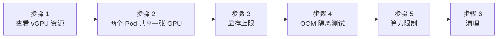

本实验在 [实验 1](./online-install.md) 的基础上继续。你有一块拥有 15360 MiB 显存的物理 Tesla T4。在本实验中，你将在这一张卡上运行多个 Pod，每个 Pod 都有独立的显存和算力上限，并验证隔离的真实性：当一个 Pod 尝试分配超出其配额的显存时，会触发 CUDA OOM，而相邻 Pod 不受影响继续运行。

本实验中的每条命令和输出均来自使用实验 1 搭建的实际集群（HAMi v2.9.0、GPU Operator v25.3.0、Kubernetes v1.34）。

## 你将学到什么

- HAMi 为 Kubernetes 添加的 vGPU 资源类型
- 在一张物理 GPU 上运行多个 Pod
- HAMi 如何在容器内部强制执行显存上限
- 通过 OOM 测试验证显存隔离
- 使用 `gpucores` 限制算力及两种利用率策略
- 在哪里查看 HAMi 调度器的决策

## 实验概览



## 前提条件

- 已完成 [实验 1: 在线安装](./online-install.md) 的集群：HAMi 已安装，GPU 节点已标记 `gpu=on`
- 来自 [`tutorials/labs/examples/03-gpu-partitioning/`](https://github.com/Project-HAMi/website/tree/master/tutorials/labs/examples/03-gpu-partitioning) 的清单文件

## 步骤 1: 了解 HAMi 资源类型

HAMi 通过自定义 GPU 资源扩展 Kubernetes。Pod 组合使用这些资源来描述其所需的 GPU 切片：

| 资源                           | 含义                                                  |
| ------------------------------ | ----------------------------------------------------- |
| `nvidia.com/gpu`               | 容器请求的 vGPU 数量                                  |
| `nvidia.com/gpumem`            | 每个 vGPU 的显存，单位 MiB                            |
| `nvidia.com/gpumem-percentage` | 每个 vGPU 的显存占整卡的百分比（`gpumem` 的替代方案） |
| `nvidia.com/gpucores`          | 每个 vGPU 的算力，占显卡 SM 的百分比                  |

查看节点提供的资源：

```bash
NODE_NAME=$(kubectl get nodes -o jsonpath='{.items[0].metadata.name}')
kubectl get node ${NODE_NAME} -o jsonpath='{.status.allocatable.nvidia\.com/gpu}'
```

```plaintext
10
```

> 一张物理 T4 被注册为 10 个可调度的 vGPU（即你在实验 1 中验证过的注册注解中的 `count` 字段）。每个 vGPU 可以携带独立的 `gpumem` 和 `gpucores` 限制。

## 步骤 2: 两个 Pod 共享一张 GPU

部署两个 Pod，每个请求 1 个 vGPU 和 4000 MiB 显存切片。先看清单文件：

```yaml
apiVersion: v1
kind: Pod
metadata:
  name: gpumem-pod-a
spec:
  restartPolicy: Never
  containers:
    - name: app
      image: nvidia/cuda:12.4.1-base-ubuntu22.04
      command: ["sleep", "infinity"]
      resources:
        limits:
          nvidia.com/gpu: 1 # 请求 1 个 vGPU
          nvidia.com/gpumem: 4000 # 限制此 Pod 的显存为 4000 MiB
```

`gpumem-pod-b.yaml` 除了名称不同外完全相同。部署两个 Pod：

```bash
kubectl apply -f tutorials/labs/examples/03-gpu-partitioning/gpumem-pod-a.yaml -f tutorials/labs/examples/03-gpu-partitioning/gpumem-pod-b.yaml
kubectl get pods gpumem-pod-a gpumem-pod-b -o wide
```

```plaintext
NAME           READY   STATUS    RESTARTS   AGE   IP               NODE            NOMINATED NODE   READINESS GATES
gpumem-pod-a   1/1     Running   0          27s   10.244.218.156   hami-workshop   <none>           <none>
gpumem-pod-b   1/1     Running   0          27s   10.244.218.157   hami-workshop   <none>           <none>
```

两个 Pod 都在只有一张物理 GPU 的节点上运行。通过读取 HAMi 调度器写入每个 Pod 的分配注解，验证它们确实运行在**同一张卡**上：

```bash
kubectl get pod gpumem-pod-a -o jsonpath='{.metadata.annotations.hami\.io/vgpu-devices-allocated}'; echo
kubectl get pod gpumem-pod-b -o jsonpath='{.metadata.annotations.hami\.io/vgpu-devices-allocated}'; echo
```

```plaintext
GPU-859b872c-0ba2-97b0-10b4-8b7185c55039,NVIDIA,4000,0:;
GPU-859b872c-0ba2-97b0-10b4-8b7185c55039,NVIDIA,4000,0:;
```

> 相同的设备 UUID，各 4000 MiB。两个 Pod，一张物理 T4。注解格式为 `{UUID},{厂商},{显存 MiB},{算力 %}`。

## 步骤 3: 显存上限

关键问题：从 Pod **内部**看，GPU 是什么样的？

```bash
kubectl exec gpumem-pod-a -- nvidia-smi
```

```plaintext
+-----------------------------------------------------------------------------------------+
| NVIDIA-SMI 570.124.06             Driver Version: 570.124.06     CUDA Version: 12.8     |
|-----------------------------------------+------------------------+----------------------+
| GPU  Name                 Persistence-M | Bus-Id          Disp.A | Volatile Uncorr. ECC |
| Fan  Temp   Perf          Pwr:Usage/Cap |           Memory-Usage | GPU-Util  Compute M. |
|=========================================+========================+======================|
|   0  Tesla T4                       On  |   00000000:00:04.0 Off |                    0 |
| N/A   57C    P8             16W /   70W |       0MiB /   4000MiB |      0%      Default |
+-----------------------------------------+------------------------+----------------------+
```

> **`0MiB / 4000MiB`**：容器看到的是一块 4000 MiB 的 GPU，而不是物理的 15360 MiB。这是 HAMi-core 的核心能力：一个通过 `LD_PRELOAD` 注入到容器中的库，它拦截 CUDA 和 NVML 调用并重写内存数值。另一个 Pod 在同一张物理卡上看到的是独立的 4000 MiB 上限。

## 步骤 4: 通过 OOM 测试验证显存隔离

`nvidia-smi` 输出中的上限看起来不错，但限制是否真正生效？`oom-test-pod.yaml` 每次分配 512 MiB GPU 显存，直到分配失败：

```yaml
apiVersion: v1
kind: Pod
metadata:
  name: oom-test-pod
spec:
  restartPolicy: Never
  containers:
    - name: app
      image: pytorch/pytorch:2.4.0-cuda12.1-cudnn9-runtime
      command:
        - python
        - -c
        - |
          import torch
          chunks = []
          try:
              while True:
                  # 每次迭代分配 512 MiB
                  chunks.append(torch.empty(512, 1024, 1024, dtype=torch.uint8, device="cuda"))
                  print(f"Allocated {len(chunks) * 512} MiB", flush=True)
          except RuntimeError as e:
              print(f"Hit the limit after {len(chunks) * 512} MiB:", flush=True)
              print(str(e).split(".")[0], flush=True)
      resources:
        limits:
          nvidia.com/gpu: 1 # 请求 1 个 vGPU
          nvidia.com/gpumem: 4000 # 限制此 Pod 的显存为 4000 MiB
```

```bash
kubectl apply -f tutorials/labs/examples/03-gpu-partitioning/oom-test-pod.yaml
```

在镜像拉取期间，观察 HAMi 调度器的决策：

```bash
kubectl describe pod oom-test-pod | tail -3
```

```plaintext
  Normal  FilteringSucceed  96s   hami-scheduler  find fit node(hami-workshop), 0 nodes not fit, 1 nodes fit(hami-workshop:7.21)
  Normal  BindingSucceed    96s   hami-scheduler  Successfully binding node [hami-workshop] to default/oom-test-pod
  Normal  Pulling           95s   kubelet         Pulling image "pytorch/pytorch:2.4.0-cuda12.1-cudnn9-runtime"
```

> `FilteringSucceed` 显示调度器对节点的评分（此处 `hami-workshop:7.21`），`BindingSucceed` 显示它绑定了该 Pod。这些事件来自 hami-scheduler，而非默认调度器。注意即使两个 Pod 已经占用了 GPU，调度器仍然找到了合适的节点：8000 / 15360 MiB 已被预留，第三个 4000 MiB 的切片仍然放得下。

等待 Pod 完成后，查看其日志：

```bash
kubectl logs oom-test-pod | tail -8
```

```plaintext
Allocated 2560 MiB
Allocated 3072 MiB
Allocated 3584 MiB
[HAMI-core ERROR (pid:1 thread=... allocator.c:52)]: Device 0 OOM 4399824896 / 4194304000
Hit the limit after 3584 MiB:
CUDA out of memory
```

> 分配循环正常运行到 3584 MiB。下一个 512 MiB 的分配会使总量（加上 CUDA 上下文开销）超出切片配额，HAMi-core 拒绝了此次分配：它尝试使用 4399824896 字节，但限制为 4194304000 字节（4000 MiB）。应用程序收到的是标准的 `CUDA out of memory` 错误，与在真实 4 GB 显卡上看到的完全一致。

同时，检查相邻 Pod 的状态：

```bash
kubectl get pods gpumem-pod-a gpumem-pod-b
```

```plaintext
NAME           READY   STATUS    RESTARTS   AGE
gpumem-pod-a   1/1     Running   0          5m12s
gpumem-pod-b   1/1     Running   0          5m12s
```

> OOM 被完全限制在触发 OOM 的 Pod 内部。这就是使得在一张卡上安全打包多个工作负载的隔离特性。

## 步骤 5: 使用 gpucores 限制算力

显存是一个维度；算力是另一个维度。`gpucores-pod.yaml` 请求 30% 的显卡算力并运行一个无限矩阵乘法：

```yaml
env:
  # "force" 严格将利用率限制在 gpucores 值。
  # 默认策略允许在 GPU 空闲时突破上限。
  - name: GPU_CORE_UTILIZATION_POLICY
    value: "force"
resources:
  limits:
    nvidia.com/gpu: 1 # 请求 1 个 vGPU
    nvidia.com/gpumem: 4000 # 限制此 Pod 的显存为 4000 MiB
    nvidia.com/gpucores: 30 # 限制此 Pod 使用 30% 的 GPU 算力
```

```bash
kubectl apply -f tutorials/labs/examples/03-gpu-partitioning/gpucores-pod.yaml
```

检查 HAMi 注入到容器中的环境变量：

```bash
kubectl exec gpucores-pod -- env | grep -E 'CUDA_DEVICE|NVIDIA_VISIBLE'
```

```plaintext
NVIDIA_VISIBLE_DEVICES=GPU-859b872c-0ba2-97b0-10b4-8b7185c55039
CUDA_DEVICE_MEMORY_LIMIT_0=4000m
CUDA_DEVICE_SM_LIMIT=30
CUDA_DEVICE_MEMORY_SHARED_CACHE=/usr/local/vgpu/b08c450f-718b-4c25-ae0b-e02251097ed9.cache
```

> `CUDA_DEVICE_MEMORY_LIMIT_0` 和 `CUDA_DEVICE_SM_LIMIT` 由 HAMi-core 读取，用于强制执行显存上限和算力上限。共享缓存文件用于协调同一张卡上多个 Pod 之间的用量统计。在工作负载运行期间，从宿主机侧（通过驱动 Pod）观察 GPU 利用率：

```bash
DRIVER_POD=$(kubectl get pods -n gpu-operator -l app=nvidia-driver-daemonset -o name | head -1)
for i in $(seq 1 12); do
  kubectl -n gpu-operator exec ${DRIVER_POD} -- nvidia-smi --query-gpu=utilization.gpu --format=csv,noheader
  sleep 5
done
```

```plaintext
32 %
82 %
0 %
84 %
0 %
60 %
0 %
57 %
11 %
25 %
0 %
9 %
```

> HAMi-core 通过占空比进行限流：工作突发后跟随强制空闲期。单次采样波动较大，但这 12 次采样的平均值恰好为 30%。Prometheus 在更长时间窗口内也证实了这一点：

```bash
kubectl exec -n monitoring prometheus-prometheus-kube-prometheus-prometheus-0 -c prometheus -- \
  promtool query instant http://localhost:9090 'avg_over_time(DCGM_FI_DEV_GPU_UTIL[3m])'
```

```plaintext
{..., UUID="GPU-859b872c-...", modelName="Tesla T4", ...} => 27.555555555555557
```

> 约 30%，与请求一致。注意两种策略：
>
> - **default**（默认）：Pod 可以在 GPU 空闲时突破 `gpucores` 份额。有利于提高利用率，隔离较宽松。
> - **force**（`GPU_CORE_UTILIZATION_POLICY=force`）：始终严格限制，如上测量所示。适合需要可预测性能隔离的场景。
>
> 如果不设置 `force` 环境变量，你会看到同样的工作负载在空闲卡上以 100% 利用率运行，这是设计如此：HAMi 会将空闲容量分配出去，而不是浪费它。

## 步骤 6: 清理

```bash
kubectl delete pod gpumem-pod-a gpumem-pod-b oom-test-pod gpucores-pod --ignore-not-found
```

## 本实验验证了什么

| 声明 | 证据 |
| --- | --- |
| 多个 Pod 可以共享一张物理 GPU | 两个 Running 的 Pod，分配注解中的设备 UUID 相同 |
| 显存限制是真正强制执行的，而非仅显示 | `nvidia-smi` 显示 4000 MiB 上限；超出限制时分配被拒绝并返回 CUDA OOM |
| 触发限制的 Pod 不会干扰相邻 Pod | OOM Pod 已 Completed，而两个相邻 Pod 保持 Running |
| 算力限制有效 | 请求 30%；12 次采样平均值恰好 30%，DCGM 3 分钟平均值 27.6% |

## 下一步

阅读 [HAMi 集群架构](/zh/docs/core-concepts/hami-architecture) 来映射你刚才练习的每个组件，或继续实验：尝试 `nvidia.com/gpumem-percentage`，在显卡上运行超过两个 Pod，或填满显卡的 10 个 vGPU 槽位后观察调度器如何拒绝第 11 个 Pod。
