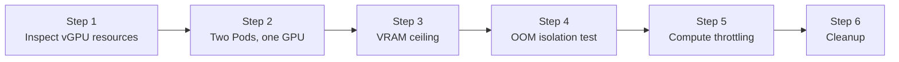

:::note

本页的中文翻译整理中，以下内容暂为英文版。

:::


This lab continues from [Lab 1](./online-install.md). You have one physical Tesla T4 with 15360 MiB of VRAM. In this lab you will run multiple Pods on that single card, each with its own enforced VRAM and compute limit, and verify that the isolation is real: a Pod that tries to allocate past its slice gets a CUDA OOM while its neighbors keep running.

Every command and output in this lab was captured from a live cluster built with Lab 1 (HAMi v2.9.0, GPU Operator v25.3.0, Kubernetes v1.34).

## What You'll Learn

- The vGPU resource types HAMi adds to Kubernetes
- Running multiple Pods on one physical GPU
- How HAMi enforces VRAM ceilings inside containers
- Proving memory isolation with an OOM test
- Limiting compute with `gpucores` and the two utilization policies
- Where to see the HAMi scheduler's decisions

## Lab Overview



## Prerequisites

- A cluster from [Lab 1: Online Installation](./online-install.md): HAMi installed, GPU node labeled `gpu=on`
- The manifests from [`examples/03-gpu-partitioning/`](https://github.com/Project-HAMi/hami-workshop/tree/main/examples/03-gpu-partitioning)

## Step 1: Understand HAMi Resource Types

HAMi extends Kubernetes with custom GPU resources. A Pod combines them to describe its slice:

| Resource | Meaning |
| --- | --- |
| `nvidia.com/gpu` | Number of vGPUs the container requests |
| `nvidia.com/gpumem` | VRAM per vGPU, in MiB |
| `nvidia.com/gpumem-percentage` | VRAM per vGPU as a percentage of the card (alternative to `gpumem`) |
| `nvidia.com/gpucores` | Compute capacity per vGPU, as a percentage of the card's SMs |

Check what the node offers:

```bash
NODE_NAME=$(kubectl get nodes -o jsonpath='{.items[0].metadata.name}')
kubectl get node ${NODE_NAME} -o jsonpath='{.status.allocatable.nvidia\.com/gpu}'
```

```plaintext
10
```

> One physical T4 is registered as 10 schedulable vGPUs (the `count` field of the registration annotation you verified in Lab 1). Each can carry its own `gpumem` and `gpucores` limits.

## Step 2: Two Pods Sharing One GPU

Deploy two Pods that each request 1 vGPU with a 4000 MiB VRAM slice. Review the manifest first:

```yaml
apiVersion: v1
kind: Pod
metadata:
  name: gpumem-pod-a
spec:
  restartPolicy: Never
  containers:
  - name: app
    image: nvidia/cuda:12.4.1-base-ubuntu22.04
    command: ["sleep", "infinity"]
    resources:
      limits:
        nvidia.com/gpu: 1       # request 1 vGPU
        nvidia.com/gpumem: 4000 # limit this Pod to 4000 MiB of VRAM
```

`gpumem-pod-b.yaml` is identical except for the name. Apply both:

```bash
kubectl apply -f gpumem-pod-a.yaml -f gpumem-pod-b.yaml
kubectl get pods gpumem-pod-a gpumem-pod-b -o wide
```

```plaintext
NAME           READY   STATUS    RESTARTS   AGE   IP               NODE            NOMINATED NODE   READINESS GATES
gpumem-pod-a   1/1     Running   0          27s   10.244.218.156   hami-workshop   <none>           <none>
gpumem-pod-b   1/1     Running   0          27s   10.244.218.157   hami-workshop   <none>           <none>
```

Both Pods are Running on a node that has only one physical GPU. Verify they actually landed on the **same card** by reading the allocation annotation the HAMi scheduler writes on each Pod:

```bash
kubectl get pod gpumem-pod-a -o jsonpath='{.metadata.annotations.hami\.io/vgpu-devices-allocated}'; echo
kubectl get pod gpumem-pod-b -o jsonpath='{.metadata.annotations.hami\.io/vgpu-devices-allocated}'; echo
```

```plaintext
GPU-859b872c-0ba2-97b0-10b4-8b7185c55039,NVIDIA,4000,0:;
GPU-859b872c-0ba2-97b0-10b4-8b7185c55039,NVIDIA,4000,0:;
```

> Same device UUID, 4000 MiB each. Two Pods, one physical T4. The annotation format is `{UUID},{vendor},{VRAM MiB},{compute %}`.

## Step 3: The VRAM Ceiling

The critical question: what does the GPU look like from **inside** a Pod?

```bash
kubectl exec gpumem-pod-a -- nvidia-smi
```

```plaintext
+-----------------------------------------------------------------------------------------+
| NVIDIA-SMI 570.124.06             Driver Version: 570.124.06     CUDA Version: 12.8     |
|-----------------------------------------+------------------------+----------------------+
| GPU  Name                 Persistence-M | Bus-Id          Disp.A | Volatile Uncorr. ECC |
| Fan  Temp   Perf          Pwr:Usage/Cap |           Memory-Usage | GPU-Util  Compute M. |
|=========================================+========================+======================|
|   0  Tesla T4                       On  |   00000000:00:04.0 Off |                    0 |
| N/A   57C    P8             16W /   70W |       0MiB /   4000MiB |      0%      Default |
+-----------------------------------------+------------------------+----------------------+
```

> **`0MiB / 4000MiB`**: the container sees a 4000 MiB GPU, not the physical 15360 MiB. This is HAMi-core at work, a library injected into the container via `LD_PRELOAD` that intercepts CUDA and NVML calls and rewrites the memory numbers. The other Pod sees its own independent 4000 MiB ceiling on the same physical card.

## Step 4: Prove Memory Isolation with an OOM Test

A ceiling in `nvidia-smi` output is nice, but does the limit actually hold? `oom-test-pod.yaml` allocates GPU memory in 512 MiB chunks until it fails:

```yaml
apiVersion: v1
kind: Pod
metadata:
  name: oom-test-pod
spec:
  restartPolicy: Never
  containers:
  - name: app
    image: pytorch/pytorch:2.4.0-cuda12.1-cudnn9-runtime
    command:
    - python
    - -c
    - |
      import torch
      chunks = []
      try:
          while True:
              # allocate 512 MiB per iteration
              chunks.append(torch.empty(512, 1024, 1024, dtype=torch.uint8, device="cuda"))
              print(f"Allocated {len(chunks) * 512} MiB", flush=True)
      except RuntimeError as e:
          print(f"Hit the limit after {len(chunks) * 512} MiB:", flush=True)
          print(str(e).split(".")[0], flush=True)
    resources:
      limits:
        nvidia.com/gpu: 1       # request 1 vGPU
        nvidia.com/gpumem: 4000 # limit this Pod to 4000 MiB of VRAM
```

```bash
kubectl apply -f oom-test-pod.yaml
```

While the image pulls, watch the HAMi scheduler make its decision:

```bash
kubectl describe pod oom-test-pod | tail -3
```

```plaintext
  Normal  FilteringSucceed  96s   hami-scheduler  find fit node(hami-workshop), 0 nodes not fit, 1 nodes fit(hami-workshop:7.21)
  Normal  BindingSucceed    96s   hami-scheduler  Successfully binding node [hami-workshop] to default/oom-test-pod
  Normal  Pulling           95s   kubelet         Pulling image "pytorch/pytorch:2.4.0-cuda12.1-cudnn9-runtime"
```

> `FilteringSucceed` shows the scheduler scoring nodes (here `hami-workshop:7.21`), and `BindingSucceed` shows it binding the Pod. These events come from hami-scheduler, not the default scheduler. Note it found a fit even though two Pods already occupy the GPU: 8000 of 15360 MiB are reserved, so a third 4000 MiB slice still fits.

Wait for the Pod to complete, then read its logs:

```bash
kubectl logs oom-test-pod | tail -8
```

```plaintext
Allocated 2560 MiB
Allocated 3072 MiB
Allocated 3584 MiB
[HAMI-core ERROR (pid:1 thread=... allocator.c:52)]: Device 0 OOM 4399824896 / 4194304000
Hit the limit after 3584 MiB:
CUDA out of memory
```

> The allocation loop runs fine up to 3584 MiB. The next 512 MiB chunk would put the total (plus CUDA context overhead) past the slice, and HAMi-core denies it: it tried to use 4399824896 bytes against the 4194304000-byte (4000 MiB) limit. The application receives a standard `CUDA out of memory` error, exactly what it would get on a real 4 GB card.

Meanwhile, check the neighbors:

```bash
kubectl get pods gpumem-pod-a gpumem-pod-b
```

```plaintext
NAME           READY   STATUS    RESTARTS   AGE
gpumem-pod-a   1/1     Running   0          5m12s
gpumem-pod-b   1/1     Running   0          5m12s
```

> The OOM was contained entirely inside the offending Pod. This is the isolation property that makes it safe to pack multiple workloads on one card.

## Step 5: Limit Compute with gpucores

VRAM is one dimension; compute is the other. `gpucores-pod.yaml` requests 30% of the card's compute and runs an infinite matrix multiplication:

```yaml
    env:
    # "force" caps utilization strictly at gpucores.
    # The default policy allows bursting above the cap while the GPU is idle.
    - name: GPU_CORE_UTILIZATION_POLICY
      value: "force"
    resources:
      limits:
        nvidia.com/gpu: 1        # request 1 vGPU
        nvidia.com/gpumem: 4000  # limit this Pod to 4000 MiB of VRAM
        nvidia.com/gpucores: 30  # limit this Pod to 30% of GPU compute
```

```bash
kubectl apply -f gpucores-pod.yaml
```

Check the environment HAMi injected into the container:

```bash
kubectl exec gpucores-pod -- env | grep -E 'CUDA_DEVICE|NVIDIA_VISIBLE'
```

```plaintext
NVIDIA_VISIBLE_DEVICES=GPU-859b872c-0ba2-97b0-10b4-8b7185c55039
CUDA_DEVICE_MEMORY_LIMIT_0=4000m
CUDA_DEVICE_SM_LIMIT=30
CUDA_DEVICE_MEMORY_SHARED_CACHE=/usr/local/vgpu/b08c450f-718b-4c25-ae0b-e02251097ed9.cache
```

> `CUDA_DEVICE_MEMORY_LIMIT_0` and `CUDA_DEVICE_SM_LIMIT` are read by HAMi-core to enforce the VRAM ceiling and the compute cap. The shared cache file coordinates usage accounting between Pods on the same card. Watch the GPU utilization from the host side (via the driver Pod) while the workload runs:

```bash
DRIVER_POD=$(kubectl get pods -n gpu-operator -l app=nvidia-driver-daemonset -o name | head -1)
for i in $(seq 1 12); do
  kubectl -n gpu-operator exec ${DRIVER_POD} -- nvidia-smi --query-gpu=utilization.gpu --format=csv,noheader
  sleep 5
done
```

```plaintext
32 %
82 %
0 %
84 %
0 %
60 %
0 %
57 %
11 %
25 %
0 %
9 %
```

> HAMi-core throttles by duty cycle: bursts of work followed by enforced idle periods. Individual samples jump around, but the average of these 12 samples is exactly 30%. Prometheus confirms it over a longer window:

```bash
kubectl exec -n monitoring prometheus-prometheus-kube-prometheus-prometheus-0 -c prometheus -- \
  promtool query instant http://localhost:9090 'avg_over_time(DCGM_FI_DEV_GPU_UTIL[3m])'
```

```plaintext
{..., UUID="GPU-859b872c-...", modelName="Tesla T4", ...} => 27.555555555555557
```

> About 30%, as requested. Note the two policies:
>
> - **default**: the Pod may burst above its `gpucores` share while the GPU is otherwise idle. Good for utilization, looser isolation.
> - **force** (`GPU_CORE_UTILIZATION_POLICY=force`): strict cap at all times, as measured above. Good for predictable performance isolation.
>
> Without the `force` env, you would see this same workload run at 100% utilization on an idle card, which is intentional: HAMi gives idle capacity away rather than wasting it.

## Step 6: Cleanup

```bash
kubectl delete pod gpumem-pod-a gpumem-pod-b oom-test-pod gpucores-pod --ignore-not-found
```

## What This Lab Proved

| Claim | Evidence |
| --- | --- |
| Multiple Pods can share one physical GPU | Two Running Pods, same device UUID in their allocation annotations |
| VRAM limits are enforced, not cosmetic | `nvidia-smi` ceiling of 4000 MiB; allocation denied past the limit with CUDA OOM |
| A Pod hitting its limit does not disturb neighbors | OOM Pod Completed while both neighbors stayed Running |
| Compute limits hold | 30% requested; 12-sample average exactly 30%, DCGM 3-minute average 27.6% |

## Next Steps

Read [HAMi Cluster Architecture](../concepts/hami-architecture.md) to map every component you just exercised, or continue experimenting: try `nvidia.com/gpumem-percentage`, run more than two Pods on the card, or fill the card's 10 vGPU slots and watch the scheduler refuse the 11th Pod.
