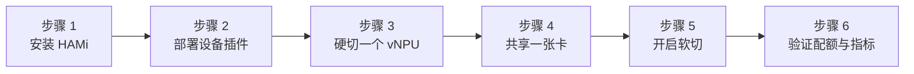

本实验在单张 Ascend 910B4 上安装 HAMi 2.9.0 和固定版本的 `ascend-device-plugin` v1.4.0，然后依次体验 HAMi 提供的两种 NPU 共享路径：**模板硬切**，由 HAMi 根据显存请求匹配 `vir05_1c_8g` 这类固定 AVI 模板；**hami-vnpu-core 软切**，由运行时为 Pod 下发并强制执行显存与 AI Core 配额。实验过程中，两个硬切 Pod 会共享同一张物理卡，软切 Pod 的配额还可以通过设备插件的监控指标观测。

:::note 关于输出示例

下文输出来自 2026-09-17 的实测记录。节点名、Pod 名和设备 UUID 与环境相关；请对比组件名称、就绪状态、模板取值和实测数值。

:::

## 你将学到什么

- HAMi 为 910B4 暴露哪些昇腾资源键，以及节点上报的可调度数量如何由最小模板推导；
- 安装带昇腾支持的 HAMi，并部署固定版本 v1.4.0 设备插件；
- 运行模板硬切 Pod，并在 HAMi 的分配注解和容器内确认选中的模板；
- 让两个硬切 Pod 共享同一张物理 NPU；
- 把同一节点切换到 `hami-vnpu-core` 软切，并为 Pod 指定显存与算力配额；以及
- 从设备插件读取按设备维度的显存与利用率指标。

## 实验概览



## 前提条件

- 一个可正常访问的单节点 Kubernetes 集群，配备空闲的 Ascend 910B4，宿主机 `npu-smi info` 可见设备，节点允许普通 Pod 运行。软切（`hami-vnpu-core`）仅支持 ARM 平台且要求驱动 ≥ 25.5；实测环境为 ARM 节点、驱动 25.5.1。
- 已配置为 `ascend` containerd runtime handler 的 [Ascend Docker Runtime](https://gitcode.com/Ascend/mind-cluster/tree/master/component/ascend-docker-runtime)。工作负载使用 `runtimeClassName: ascend`。
- `kubectl`、Helm 3、集群管理员权限，以及创建 `RuntimeClass`、ConfigMap、DaemonSet 和工作负载 Pod 的权限。
- 一个与宿主机驱动及节点架构兼容的 CANN/torch-npu 镜像。示例使用 `quay.io/ascend/torch-npu:2.10.0-910b-ubuntu22.04-py3.11`。Ascend Docker Runtime 会注入宿主机的 `npu-smi` 和驱动库，镜像无需自带 `npu-smi`。
- 本 website 仓库的本地检出；下方命令会引用 [`tutorials/labs/examples/18-hami-ascend-vnpu-slicing/`](https://github.com/Project-HAMi/website/tree/master/tutorials/labs/examples/18-hami-ascend-vnpu-slicing) 下的文件。

## 步骤 1：安装带昇腾支持的 HAMi

安装 HAMi，开启昇腾资源支持：

```bash
helm repo add hami-charts https://project-hami.github.io/HAMi/
helm repo update

helm install hami hami-charts/hami \
  --version 2.9.0 \
  --namespace kube-system --create-namespace \
  --set devices.ascend.enabled=true

kubectl -n kube-system rollout status deploy/hami-scheduler --timeout=5m
```

`devices.ascend.enabled=true` 开启昇腾资源支持。chart 的 `devices.ascend.hamiVnpuCore` 默认为 `false`，因此集群初始处于模板硬切模式；步骤 5 会为软切打开它。

确认 HAMi 为该芯片型号加载的模板，并与硬件实际支持的模板对照：

```bash
kubectl -n kube-system get cm hami-scheduler-device \
  -o jsonpath='{.data.device-config\.yaml}' \
  | grep -A16 'chipName: 910B4'
```

```text
      - chipName: 910B4
        commonWord: Ascend910B4
        resourceName: huawei.com/Ascend910B4
        resourceMemoryName: huawei.com/Ascend910B4-memory
        memoryAllocatable: 32768
        memoryCapacity: 32768
        aiCore: 20
        aiCPU: 7
        templates:
          - name: vir05_1c_8g
            memory: 8192
            aiCore: 5
            aiCPU: 1
          - name: vir10_3c_16g
            memory: 16384
            aiCore: 10
            aiCPU: 3
```

在宿主机上查询 NPU 及其支持的模板——不同昇腾型号的模板集合不同：

```bash
npu-smi info -l
npu-smi info -t template-info
```

## 步骤 2：部署昇腾设备插件

按[昇腾共享官方指南](/zh/docs/userguide/ascend-device/enable-ascend-sharing)的顺序部署，插件清单固定为 v1.4.0。

### 标记节点

设备插件通过 `ascend=on` 标签选择节点。将 `YOUR_ASCEND_NODE` 替换为昇腾节点名：

```bash
kubectl get nodes -o wide
export NODE=YOUR_ASCEND_NODE
kubectl label node "$NODE" ascend=on --overwrite
```

### 部署 RuntimeClass

确认节点上已安装 Ascend Docker Runtime 并注册了 `ascend` handler，然后创建 `RuntimeClass` 对象：

```bash
kubectl apply -f https://raw.githubusercontent.com/Project-HAMi/ascend-device-plugin/refs/tags/v1.4.0/ascend-runtimeclass.yaml
```

### 创建节点 ConfigMap

创建 v1.4.0 插件清单所要求的 `hami-device-node-config`：

```bash
kubectl apply -f tutorials/labs/examples/18-hami-ascend-vnpu-slicing/01-ascend-node-config.yaml
```

示例中 `nodes` 列表为空，表示所有节点都跟随全局模式开关。节点级 `hami-vnpu-core: true` 条目的优先级高于全局开关，步骤 5 会说明何时需要它。

### 部署 ascend-device-plugin

部署固定版本的设备插件清单：

```bash
kubectl apply -f https://raw.githubusercontent.com/Project-HAMi/ascend-device-plugin/refs/tags/v1.4.0/ascend-device-plugin.yaml
kubectl -n kube-system rollout status daemonset/hami-ascend-device-plugin --timeout=5m
```

确认插件已在打标的节点上注册昇腾资源：

```bash
kubectl get node "$NODE" \
  -o custom-columns='NAME:.metadata.name,ASCEND:.status.allocatable.huawei\.com/Ascend910B4'
kubectl -n kube-system get pods -l app.kubernetes.io/component=hami-ascend-device-plugin -o wide
```

对默认配置下的一张 910B4，`huawei.com/Ascend910B4` 上报 `4`：插件用可调度显存 32768 MiB 除以最小模板的 8192 MiB，得到 `floor(32768 / 8192) = 4`。这是按最小模板粒度对外通告的可共享份额，不代表 4 张物理卡，也不代表每种资源都被均分成 4 份——HAMi 在调度每个 Pod 时仍会检查选中的模板和剩余显存。

## 步骤 3：硬切一个基于模板的 vNPU

提交单 Pod 硬切工作负载：

```bash
kubectl apply -f tutorials/labs/examples/18-hami-ascend-vnpu-slicing/02-hard-slice-pod.yaml
kubectl wait --for=condition=Ready pod/hami-ascend910b4-hard-slice --timeout=5m
kubectl get pod hami-ascend910b4-hard-slice -o wide
```

```text
pod/hami-ascend910b4-hard-slice created
pod/hami-ascend910b4-hard-slice condition met
NAME                          READY   STATUS    RESTARTS   AGE   NODE
hami-ascend910b4-hard-slice   1/1     Running   0          8s    ascend-240
```

关键字段如下：

```yaml
spec:
  schedulerName: hami-scheduler
  runtimeClassName: ascend
  containers:
    - resources:
        limits:
          huawei.com/Ascend910B4: "1"
          huawei.com/Ascend910B4-memory: "8192"
```

资源键 `huawei.com/Ascend910B4` 来自 `resourceName`；`resourceMemoryName` 定义了 `-memory` 键，`commonWord: Ascend910B4` 决定分配注解的名称。不指定 `-memory` 表示申请整卡；指定后 HAMi 会匹配一个模板。

查看记录分配结果的两个注解：

```bash
kubectl get pod hami-ascend910b4-hard-slice \
  -o jsonpath='{.metadata.annotations.hami\.io/Ascend910B4-devices-allocated}{"\n"}{.metadata.annotations.huawei\.com/Ascend910B4}{"\n"}'
```

```text
C43DA66C-012042DB-63088372-CC500485-104301E3,Ascend910B4,8192,0:;
[{"UUID":"C43DA66C-012042DB-63088372-CC500485-104301E3","temp":"vir05_1c_8g"}]
```

`temp: vir05_1c_8g` 说明这是模板硬切而不是整卡请求：HAMi 选择了能满足 8192 MiB 请求的最小模板。在当前配置下，该模板预留 8192 MiB 显存、5 个 AI Core 和 1 个 AI CPU：

| Pod 请求 | 选中模板 | 模板资源 | 含义 |
| :-- | :-- | :-- | :-- |
| `huawei.com/Ascend910B4: 1` + `huawei.com/Ascend910B4-memory: 8192` | `vir05_1c_8g` | 8192 MiB、5 AI Core、1 AI CPU | 这张 910B4 上满足请求的最小模板 |

模板名称与容量因芯片型号和版本而异——插件或 HAMi 版本变化后，应重新读取 `hami-scheduler-device` ConfigMap。

验证容器内实际可见的设备。设备插件把分配结果转换为 `ASCEND_VISIBLE_DEVICES` 和 `ASCEND_VNPU_SPECS`，Ascend 运行时让 vNPU 对容器可见：

```bash
kubectl exec hami-ascend910b4-hard-slice -- bash -c '
  printf "ASCEND_VISIBLE_DEVICES=%s\n" "$ASCEND_VISIBLE_DEVICES"
  printf "ASCEND_VNPU_SPECS=%s\n" "$ASCEND_VNPU_SPECS"
  npu-smi info
'
```

```text
ASCEND_VISIBLE_DEVICES=0
ASCEND_VNPU_SPECS=vir05_1c_8g
NPU 2  910B4vir05_1c_8g
```

`npu-smi` 的完整表格与主机环境相关；不变的是 `ASCEND_VNPU_SPECS=vir05_1c_8g` 和设备名 `910B4vir05_1c_8g`。两者同时出现，说明调度、设备分配、vNPU 配置和容器可见性整条链路已经打通。

## 步骤 4：让两个 Pod 共享一张物理 NPU

提交双 Pod 示例，两个 Pod 申请相同的 8192 MiB：

```bash
kubectl apply -f tutorials/labs/examples/18-hami-ascend-vnpu-slicing/03-hard-slice-two-pods.yaml
kubectl wait --for=condition=Ready pod/hami-ascend910b4-hard-slice-a pod/hami-ascend910b4-hard-slice-b --timeout=5m
for pod in hami-ascend910b4-hard-slice-a hami-ascend910b4-hard-slice-b; do
  echo "--- $pod ---"
  kubectl get pod "$pod" \
    -o jsonpath='{.metadata.annotations.huawei\.com/Ascend910B4}{"\n"}'
done
```

两个 Pod 都落在同一节点、使用同一模板：

```text
--- hami-ascend910b4-hard-slice-a ---
[{"UUID":"C43DA66C-012042DB-63088372-CC500485-104301E3","temp":"vir05_1c_8g"}]
--- hami-ascend910b4-hard-slice-b ---
[{"UUID":"C43DA66C-012042DB-63088372-CC500485-104301E3","temp":"vir05_1c_8g"}]
```

设备 UUID 相同，说明两个 Pod 以 vNPU 切片的形式运行在同一张物理卡上，各自持有独立的 `vir05_1c_8g` 模板。

**注意模式边界。** 同一张物理 NPU 不能同时作为整卡资源和切片资源使用：卡被切片 Pod 占用后，整卡请求只能落到其他空闲 NPU 上（没有空闲卡时会一直 Pending）。同样，避免把同一张卡同时用作硬切池和软切池。在本文这样的单节点集群上，两种模式应先后运行并在中间完成清理；在混合集群上，应通过全局或节点级配置把硬切节点和软切节点区分开。

## 步骤 5：把节点切换到 hami-vnpu-core 软切

模板硬切分配固定的 AVI 模板，资源粒度受芯片模板集合限制。从 HAMi 2.9.0 开始，`hami-vnpu-core` 模式引入了运行时软切：通过 `libvnpu.so` 拦截和 `limiter` 令牌调度，以比任何模板都细的粒度强制执行每个 Pod 的显存与算力配额。

### 释放 NPU 并启用 device-share

软切有额外前提：启用 `device-share` 模式。NPU 必须没有正在运行的容器，因此先删除步骤 3 和步骤 4 的 Pod：

```bash
kubectl delete -f tutorials/labs/examples/18-hami-ascend-vnpu-slicing/03-hard-slice-two-pods.yaml --ignore-not-found
kubectl delete -f tutorials/labs/examples/18-hami-ascend-vnpu-slicing/02-hard-slice-pod.yaml --ignore-not-found
```

查询 NPU ID 并在其上启用 `device-share`（要求驱动 ≥ 25.5）：

```bash
npu-smi info -l
# ...
# NPU ID : 2

echo Y | npu-smi set -t device-share -i 2 -d 1
```

```text
Status : OK
Device-share Status : True
```

### 开启 hamiVnpuCore

全局开关位于 `hami-scheduler-device` ConfigMap。把 `vnpus.hamiVnpuCore` 设置为 `true`：

```bash
kubectl -n kube-system edit cm hami-scheduler-device
# 将 vnpus.hamiVnpuCore 设置为 true
kubectl -n kube-system get cm hami-scheduler-device \
  -o yaml | grep hamiVnpuCore
```

```text
hamiVnpuCore: true
```

这会对所有没有节点级覆盖的节点启用 `hami-vnpu-core`。如果只想在部分节点启用软切，可以在 `hami-device-node-config` 中为每个目标节点添加 `hami-vnpu-core: true` 条目；节点级设置优先于全局开关：

```yaml
nodes:
  - name: "ascend-240"
    hami-vnpu-core: true
```

HAMi 会自动加载 ConfigMap 的变更。如果下一步的 Pod 一直 Pending，确认配置已生效，然后重启 `hami-scheduler` Deployment 和设备插件 DaemonSet。

## 步骤 6：运行带显式配额的软切 Pod

软切 Pod 与硬切 Pod 有两点区别：

- 注解 `huawei.com/vnpu-mode: hami-core` 选择软切路径；
- 资源 limits 中显式携带 `-memory` 和 `-core` 配额，而不依赖模板匹配。

完整工作负载见 [`04-soft-slice-pod.yaml`](https://github.com/Project-HAMi/website/blob/master/tutorials/labs/examples/18-hami-ascend-vnpu-slicing/04-soft-slice-pod.yaml)：

```yaml
apiVersion: v1
kind: Pod
metadata:
  name: hami-ascend910b4-soft-slice
  labels:
    hami.run/lab-18: "true"
  annotations:
    huawei.com/vnpu-mode: "hami-core"
spec:
  schedulerName: hami-scheduler
  runtimeClassName: ascend
  restartPolicy: Never
  containers:
    - name: npu
      image: quay.io/ascend/torch-npu:2.10.0-910b-ubuntu22.04-py3.11
      command: ["bash", "-c", "sleep 86400"]
      resources:
        limits:
          huawei.com/Ascend910B4: "1"
          huawei.com/Ascend910B4-memory: "8192"  # 显存配额（MiB）
          huawei.com/Ascend910B4-core: "40"      # 可选：40% 的 AI Core
```

提交并读取模式注解与分配注解：

```bash
kubectl apply -f tutorials/labs/examples/18-hami-ascend-vnpu-slicing/04-soft-slice-pod.yaml
kubectl wait --for=condition=Ready pod/hami-ascend910b4-soft-slice --timeout=5m
kubectl get pod hami-ascend910b4-soft-slice -o wide
kubectl get pod hami-ascend910b4-soft-slice \
  -o jsonpath='{.metadata.annotations.huawei\.com/vnpu-mode}{"\n"}{.metadata.annotations.hami\.io/Ascend910B4-devices-allocated}{"\n"}'
```

```text
NAME                        READY   STATUS    RESTARTS   AGE   NODE
hami-ascend910b4-soft-slice 1/1     Running   0          5s    ascend-240
hami-core
C43DA66C-012042DB-63088372-CC500485-104301E3,Ascend910B4,8192,0:;
```

Pod 处于 Running 状态，模式注解为 `hami-core`，分配记录包含设备和 8192 MiB 配额——记账格式与硬切 Pod 相同，但背后的保障来自运行时强制的配额而不是 AVI 模板。Pod 申请了 40% 的算力，limiter 通过 `libvnpu.so` 把它强制执行为芯片 20 个 AI Core 中的 8 个，同时还有 8192 MiB 的显存配额。

## 步骤 7：通过指标验证配额

设备插件在 9395 端口导出按设备维度的指标：

```bash
POD_IP=$(kubectl -n kube-system get pod -l app.kubernetes.io/component=hami-ascend-device-plugin \
  -o jsonpath='{.items[0].status.podIP}')
curl -sS "http://${POD_IP}:9395/metrics" | grep hami_
```

```text
hami_host_gpu_memory_used_bytes{device_index="0",device_type="Ascend-",device_uuid="C43DA66C-012042DB-63088372-CC500485-104301E3"} 0
hami_host_gpu_utilization_ratio{device_index="0",device_type="Ascend-",device_uuid="C43DA66C-012042DB-63088372-CC500485-104301E3"} 0
```

两个指标都携带与分配注解相同的设备 UUID，因此显存占用和利用率都能归因到这张被共享的 NPU。这里数值为 `0` 是因为测试 Pod 只在 sleep；运行真实负载即可看到变化。

## 故障排查

### 节点上没有 `huawei.com/Ascend910B4` 可调度资源

检查 `ascend=on` 标签、DaemonSet 状态和日志：

```bash
kubectl get node "$NODE" --show-labels | grep 'ascend=on'
kubectl -n kube-system get pods -l app.kubernetes.io/component=hami-ascend-device-plugin -o wide
kubectl -n kube-system logs ds/hami-ascend-device-plugin --tail=100
```

插件还需要 `hami-scheduler-device` 和 `hami-device-node-config` 两个 ConfigMap；缺少节点 ConfigMap 会导致 v1.4.0 清单无法启动。

### Pod 一直 Pending

确认资源键是 `huawei.com/Ascend910B4`（不是 ConfigMap 中另一个芯片条目 `huawei.com/Ascend910B4-1`），并且没有整卡请求与切片竞争同一张卡。然后查看调度事件：

```bash
kubectl describe pod hami-ascend910b4-soft-slice
kubectl -n kube-system logs deploy/hami-scheduler --tail=100
```

如果问题出现在刚开启 `hamiVnpuCore` 之后，重启 `hami-scheduler` Deployment 和设备插件 DaemonSet，让两侧重新加载配置。

### `npu-smi set -t device-share` 执行失败

目标 NPU 仍被占用。删除所有持有该设备切片或整卡的 Pod，等容器退出后重试。

### Pod 报 unknown RuntimeClass 或 runtime-handler 错误

确认 `kubectl get runtimeclass ascend` 成功，且目标节点已安装并配置 Ascend Docker Runtime。`RuntimeClass` 对象只是选择已存在的 runtime handler，不会安装运行时。

### 软切 Pod 拿到的是模板而不是 hami-core 配额

分配注解里出现了 `temp` 模板且模式注解缺失。确认 Pod 带 `huawei.com/vnpu-mode: "hami-core"` 注解，且提交前 `hami-scheduler-device` ConfigMap 中已开启 `vnpus.hamiVnpuCore`。

## 清理

如果你负责 HAMi 和昇腾插件的安装，执行下面的命令。在共享集群上，只删除本实验创建的资源，保留已有的 HAMi release 和设备配置。

```bash
kubectl delete pod -l hami.run/lab-18=true --ignore-not-found
kubectl delete -f https://raw.githubusercontent.com/Project-HAMi/ascend-device-plugin/refs/tags/v1.4.0/ascend-device-plugin.yaml --ignore-not-found
kubectl delete -f tutorials/labs/examples/18-hami-ascend-vnpu-slicing/01-ascend-node-config.yaml --ignore-not-found
kubectl delete runtimeclass ascend --ignore-not-found
helm uninstall hami --namespace kube-system
kubectl label node "$NODE" ascend-

# 可选，在宿主机上：关闭 device-share
# echo Y | npu-smi set -t device-share -i 2 -d 0
```

## 成功标准

| 检查项 | 预期结果 |
| :-- | :-- |
| 硬切 Pod 状态 | Pod Running，无重启。 |
| 模板分配 | 分配注解包含 `temp: vir05_1c_8g` 和 8192 MiB 配额。 |
| 共享一张卡 | 两个硬切 Pod 的注解引用同一个设备 UUID。 |
| 容器内设备 | `ASCEND_VNPU_SPECS=vir05_1c_8g`，`npu-smi` 显示 `910B4vir05_1c_8g`。 |
| 软切 Pod 状态 | Pod Running，模式注解为 `hami-core`。 |
| 可观测性 | 9395 端口导出所分配设备 UUID 的 `hami_host_gpu_memory_used_bytes` 和 `hami_host_gpu_utilization_ratio`。 |

## 延伸阅读

- 对比[实验 13：用 Volcano 和 HAMi-core 软切分昇腾 310P3 vNPU](./volcano-ascend-vnpu.md)：同一软切模式改由 Volcano 驱动，包含 binpack 共卡和按容器配额。
- 阅读[昇腾共享官方指南](/zh/docs/userguide/ascend-device/enable-ascend-sharing)和[设备模板参考](/zh/docs/userguide/ascend-device/device-template)，了解完整的硬切与软切配置。
- 把 `sleep` 工作负载换成真实的 torch-npu 任务，观察 `hami_host_gpu_memory_used_bytes` 向 8192 MiB 配额逼近。
