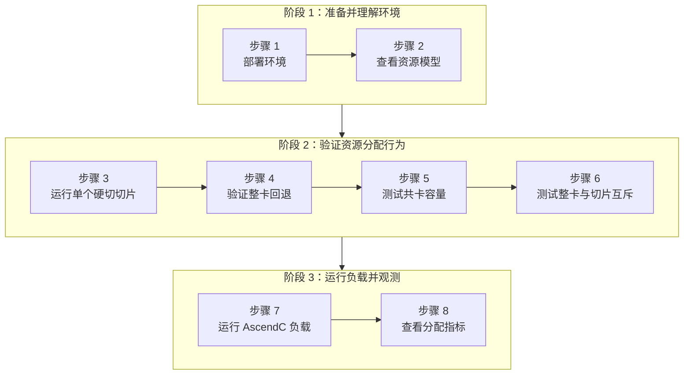

本实验在单张 Ascend 310P3 上安装 HAMi 2.10.0 和固定版本的 `ascend-device-plugin` v1.4.1。你将通过 Kubernetes 资源请求固定的 vNPU 模板，在 Pod 内确认选中的模板，让多个 Pod 共享一张物理 NPU，并观察调度器的容量与分配记账。

如果要了解 Volcano + `hami-vnpu-core` 在 Ascend 310P3 上的软切路径，请参阅[实验 13：用 Volcano + HAMi-core 软切分昇腾 310P3 vNPU](./volcano-ascend-vnpu.md)。本文介绍的是 HAMi 原生模板硬切路径。

:::note

下面的输出采集于 2026-09-19 的实测环境。节点名、Pod 名、IP 地址和设备 UUID 都与环境有关；请重点对比资源名、模板名、就绪状态、节点落点和调度原因。

:::

## 你将学到什么

- 安装带昇腾支持的 HAMi，并部署固定版本的昇腾设备插件；
- 理解 `huawei.com/Ascend310P` 和 `-memory` 资源键；
- 理解 HAMi 如何根据 Pod 的显存请求匹配 vNPU 模板；
- 通过 HAMi 注解、环境变量和 `npu-smi` 确认选中的 vNPU；
- 让多个硬切 Pod 共享同一张物理 NPU；
- 观察七个最小模板的容量上限，以及整卡请求与切片之间的互斥；以及
- 读取 HAMi 的共卡和分配指标，并区分调度分配量与真实负载使用量。

## 实验概览



## 前提条件

- 一个单节点 Kubernetes 集群，节点上有一张空闲的 Ascend 310P3。实测环境为 Ubuntu 20.04.6 LTS、Kubernetes v1.37.0，Ascend driver 版本为 22.0.4。
- 节点已安装昇腾驱动/工具包和 [Ascend Docker Runtime](https://gitcode.com/Ascend/mind-cluster/tree/master/component/ascend-docker-runtime)，并在 containerd 中配置了 `ascend` runtime handler。
- 本 website 仓库的本地检出。下方命令从仓库根目录执行；示例文件位于 [`tutorials/labs/examples/18-hami-ascend-vnpu-slicing/`](https://github.com/Project-HAMi/website/tree/master/tutorials/labs/examples/18-hami-ascend-vnpu-slicing)。

> 如果要运行 `hami-vnpu-core` 软切分，需要使用高于 25.5 的 Ascend Driver。

实测组件版本如下：

| 组件                 | 版本或配置                 |
| :------------------- | :------------------------- |
| 操作系统             | Ubuntu 20.04.6 LTS，x86_64 |
| 节点                 | `lixd-npu-test2`           |
| Kubernetes           | v1.37.0                    |
| Ascend driver        | 22.0.4                     |
| HAMi                 | v2.10.0                    |
| Ascend device plugin | v1.4.1                     |
| NPU                  | 1 张 Ascend 310P3          |

先确认主机能看到健康的设备：

```bash
npu-smi info
```

```text
+--------------------------------------------------------------------------------------------------------+
| npu-smi 22.0.4                                   Version: 22.0.4                                       |
+-------------------------------+-----------------+------------------------------------------------------+
| NPU     Name                  | Health          | Power(W)     Temp(C)     Hugepages-Usage(page)     |
| Chip    Device                | Bus-Id          | AICore(%)    Memory-Usage(MB)                        |
+===============================+=================+======================================================+
| 7       310P3                 | OK              | NA           28                0    / 0              |
| 0       0                     | 0000:00:07.0    | 0            1805 / 21527                            |
+-------------------------------+-----------------+------------------------------------------------------+
```

## 步骤 1：环境部署

### 部署 HAMi

添加 HAMi chart 仓库，并安装实测版本，同时开启昇腾支持：

```bash
helm repo add hami-charts https://project-hami.github.io/HAMi/
helm repo update
helm search repo hami-charts/hami --versions | head

helm install hami hami-charts/hami \
  --version 2.10.0 \
  -n kube-system \
  --set devices.ascend.enabled=true
```

> `devices.ascend.enabled=true` 开启昇腾资源支持。

确认调度器启动成功：

```bash
kubectl -n kube-system get pods -l app.kubernetes.io/component=hami-scheduler
```

```text
NAME                              READY   STATUS    RESTARTS   AGE
hami-scheduler-7f554bd479-rsrb9   2/2     Running   0          3m33s
```

### 标记节点

昇腾的 device-plugin 默认通过 `ascend=on` 选择节点，因此需要给节点打上 label。

```bash
kubectl get nodes -o wide

# 将这里替换为上面列出的昇腾节点名。
export NODE_NAME="your-ascend-node-name"
kubectl label node "$NODE_NAME" ascend=on --overwrite
```

### 部署 RuntimeClass

> 需要节点上已经装好 Ascend Docker Runtime 并注册了 `ascend` handler。

然后从固定版本的设备插件发布内容创建 `RuntimeClass`：

```bash
kubectl apply -f https://raw.githubusercontent.com/Project-HAMi/ascend-device-plugin/refs/tags/v1.4.1/ascend-runtimeclass.yaml
```

### 部署 ConfigMap

安装 HAMi 后已经自动创建了全局配置 `hami-scheduler-device`，其中包含 Ascend 的 resourceName、切分模式和 vNPU 模板，不需要重复部署。

后续 device-plugin 还会挂载 `hami-device-node-config`，因此需要先手动创建节点级 ConfigMap：

> v1.4.1 的节点配置示例针对 `cnst-dev-w2`，并启用了 `hami-vnpu-core`。本实验只使用模板硬切，请勿原样应用；节点级配置应将其设为 `false`。

```bash
curl -fsSL \
  https://raw.githubusercontent.com/Project-HAMi/ascend-device-plugin/refs/tags/v1.4.1/ascend-device-node-configmap.yaml \
  | sed \
    -e "s/cnst-dev-w2/${NODE_NAME}/" \
    -e 's/hami-vnpu-core: true/hami-vnpu-core: false/' \
  | kubectl apply -f -
```

> 节点级别的设置优先级高于全局。

### 部署 ascend-device-plugin

使用 v1.4.1 tag 下的官方 YAML 部署。该 YAML 默认镜像仍然是 `v1.4.0`，因此部署后手动把 DaemonSet 镜像更新为 v1.4.1：

```bash
kubectl apply -f https://raw.githubusercontent.com/Project-HAMi/ascend-device-plugin/refs/tags/v1.4.1/ascend-device-plugin.yaml
kubectl -n kube-system set image \
  daemonset/hami-ascend-device-plugin \
  device-plugin=projecthami/ascend-device-plugin:v1.4.1
```

确认 DevicePlugin 启动成功：

```bash
kubectl -n kube-system get pod -l app.kubernetes.io/component=hami-ascend-device-plugin
```

```text
NAME                              READY   STATUS    RESTARTS   AGE
hami-ascend-device-plugin-2z52v   1/1     Running   0          8m26s
```

DevicePlugin 启动后，验证节点资源情况：

```bash
kubectl describe node "$NODE_NAME" | grep "Capacity:" -A 7
```

```text
Capacity:
  cpu:                    16
  ephemeral-storage:      100676120576
  huawei.com/Ascend310P:  7
  hugepages-1Gi:          0
  hugepages-2Mi:          0
  memory:                 65866796Ki
  pods:                   110
```

为什么一张物理卡会显示 `huawei.com/Ascend310P: 7`？

> 节点上出现的 `huawei.com/Ascend310P: 7` 是 HAMi/device-plugin 按最小 vNPU 模板折算后，向 Kubernetes 上报的可调度资源份额，不代表节点上有 7 张物理 NPU。当前 310P3 配置中的最小模板是 `vir01=3072 MiB`，所以计算是 `floor(21527 / 3072) = 7`。这里使用的是 `memoryAllocatable`。因此 device-plugin 会按最小模板折算虚拟设备数量，并向 Kubernetes 上报 Ascend310P: 7；具体 Pod 能否继续分配到这张物理卡，则由 HAMi 结合设备显存等资源进行判断。

## 步骤 2：查看 310P3 资源模型

### HAMi 里的资源

310P3 模板硬切使用设备数量和显存两个资源键：

```yaml
resources:
  limits:
    huawei.com/Ascend310P: "1"
    huawei.com/Ascend310P-memory: "1024"
```

- `huawei.com/Ascend310P`：Ascend 设备数量资源。模板硬切时设置为 `1`，再结合 `-memory` 选择 vNPU 模板；
- `huawei.com/Ascend310P-memory`：显存请求。HAMi 会选择能够满足请求的最小模板；
- 不指定 `-memory` 时表示申请整卡。

### 查看 310P3 支持的模板

查看 NPU 硬件支持的 vNPU 模板：

```bash
root@lixd-npu-test2:~# npu-smi info -t template-info -i 7
+------------------------------------------------------------------------------------------+
|NPU instance template info is:                                                            |
|Name                AICORE    Memory    AICPU     VPC            VENC           JPEGD     |
|                               GB                 PNGD           VDEC           JPEGE     |
+==========================================================================================+
|vir01               1         3         1         1              0              2         |
|                                                  0              1              1         |
+------------------------------------------------------------------------------------------+
|vir02               2         6         2         3              1              4         |
|                                                  0              3              2         |
+------------------------------------------------------------------------------------------+
|vir02_1c            2         6         1         3              0              4         |
|                                                  0              3              2         |
+------------------------------------------------------------------------------------------+
|vir04               4         12        4         6              2              8         |
|                                                  0              6              4         |
+------------------------------------------------------------------------------------------+
|vir04_3c            4         12        3         6              1              8         |
|                                                  0              6              4         |
+------------------------------------------------------------------------------------------+
|vir04_3c_ndvpp      4         12        3         0              0              0         |
|                                                  0              0              0         |
+------------------------------------------------------------------------------------------+
|vir04_4c_dvpp       4         12        4         12             3              16        |
|                                                  0              12             8         |
+------------------------------------------------------------------------------------------+
```

然后查看 HAMi 实际加载的 ConfigMap：

```bash
kubectl -n kube-system get cm hami-scheduler-device \
  -o jsonpath='{.data.device-config\.yaml}' \
  | grep -A24 'chipName: 310P3'
```

HAMi 当前针对 310P3 的默认配置只启用了三种模板：

| 模板    | 配置显存  | AI Core | AI CPU |
| :------ | :-------- | :------ | :----- |
| `vir01` | 3072 MiB  | 1       | 1      |
| `vir02` | 6144 MiB  | 2       | 2      |
| `vir04` | 12288 MiB | 4       | 4      |

对应配置如下：

```yaml
- chipName: 310P3
  commonWord: Ascend310P
  resourceName: huawei.com/Ascend310P
  resourceMemoryName: huawei.com/Ascend310P-memory
  resourceCoreName: huawei.com/Ascend310P-core
  memoryAllocatable: 21527
  memoryCapacity: 24576
  aiCore: 8
  aiCPU: 7
  runtimeClassName: ascend
  templates:
    - name: vir01
      memory: 3072
      aiCore: 1
      aiCPU: 1
    - name: vir02
      memory: 6144
      aiCore: 2
      aiCPU: 2
    - name: vir04
      memory: 12288
      aiCore: 4
      aiCPU: 4
```

## 步骤 3：运行单个硬切 Pod

先从最小场景开始，创建一个申请 `1024 MiB` 显存的 Pod：

```yaml
apiVersion: v1
kind: Pod
metadata:
  name: auto-1024
spec:
  schedulerName: hami-scheduler
  runtimeClassName: ascend
  restartPolicy: Never
  containers:
    - name: npu-test
      image: docker.io/ascendai/cann:7.0.1-310p-openeuler20.03-py3.8
      imagePullPolicy: IfNotPresent
      securityContext:
        allowPrivilegeEscalation: false
      command: ["bash", "-lc"]
      args:
        - |
          echo "ASCEND_VISIBLE_DEVICES=$ASCEND_VISIBLE_DEVICES"
          echo "ASCEND_VNPU_SPECS=$ASCEND_VNPU_SPECS"
          npu-smi info
          sleep 3600
      resources:
        limits:
          huawei.com/Ascend310P: "1"
          huawei.com/Ascend310P-memory: "1024"
```

同一份完整清单也保存为 [`01-single-hard-slice-pod.yaml`](https://github.com/Project-HAMi/website/blob/master/tutorials/labs/examples/18-hami-ascend-vnpu-slicing/01-single-hard-slice-pod.yaml)，便于复用；本文演示仍以这里内嵌的完整 YAML 为准。

本文固定的 CANN 镜像以 root 身份运行，步骤 7 还会在保留的容器中安装编译工具。因此这里保留 `allowPrivilegeEscalation: false`，但不填写镜像不支持的任意非 root UID。如果集群强制要求非 root，应制作一个预装工具链、包含专用用户且已验证能够访问昇腾设备的派生镜像。

确认 Pod 已经 Running：

```bash
kubectl get pod auto-1024 -o wide
```

```text
NAME        READY   STATUS    RESTARTS   AGE   IP             NODE
auto-1024   1/1     Running   0          21s   172.25.49.46   lixd-npu-test2
```

HAMi 把这次请求匹配为 `vir01`，分配注解如下：

```bash
kubectl get pod auto-1024 \
  -o jsonpath='{.metadata.annotations.hami\.io/Ascend310P-devices-allocated}{"\n"}{.metadata.annotations.huawei\.com/Ascend310P}{"\n"}'
```

```text
E0766E64-20C0E5F1-27941064-AED8030A-F6003019,Ascend310P,3072,0:;
[{"UUID":"E0766E64-20C0E5F1-27941064-AED8030A-F6003019","temp":"vir01","memory":3072}]
```

进入 Pod 查看环境变量和设备信息：

```bash
kubectl exec auto-1024 -- bash -lc '
  echo "ASCEND_VISIBLE_DEVICES=$ASCEND_VISIBLE_DEVICES"
  echo "ASCEND_VNPU_SPECS=$ASCEND_VNPU_SPECS"
  npu-smi info
'
```

完整输出：

```text
ASCEND_VISIBLE_DEVICES=0
ASCEND_VNPU_SPECS=vir01
+--------------------------------------------------------------------------------------------------------+
| npu-smi 22.0.4                                   Version: 22.0.4                                       |
+-------------------------------+-----------------+------------------------------------------------------+
| NPU     Name                  | Health          | Power(W)     Temp(C)           Hugepages-Usage(page) |
| Chip    Device                | Bus-Id          | AICore(%)    Memory-Usage(MB)                        |
+===============================+=================+======================================================+
| 7       310Pvir01             | OK              | NA           28                0    / 0              |
| 0       0                     | 0000:00:07.0    | 0            249  / 2690                             |
+===============================+=================+======================================================+
```

Pod 已经 Running，`ASCEND_VNPU_SPECS=vir01`、分配注解里的 `temp: vir01` 和 Pod 内的 `310Pvir01` 三处证据也能互相对应，说明最基本的硬切链路正常。

接下来验证 HAMi 是否真的会按请求自动选择模板。我分别申请 `1024`、`4096` 和 `7000 MiB`，这些值都不是模板的精确显存。

另外两个 Pod 的完整清单在 `tutorials/labs/examples/18-hami-ascend-vnpu-slicing/02-template-matching-pods.yaml`，直接部署：

```bash
kubectl apply -f tutorials/labs/examples/18-hami-ascend-vnpu-slicing/02-template-matching-pods.yaml
kubectl wait \
  --for=condition=Ready \
  pod/auto-4096 pod/auto-7000 \
  --timeout=5m
kubectl get pods auto-1024 auto-4096 auto-7000 \
  -o custom-columns='NAME:.metadata.name,READY:.status.containerStatuses[0].ready,STATUS:.status.phase,NODE:.spec.nodeName'
```

三个 Pod 全部 Running：

```text
NAME        READY   STATUS    NODE
auto-1024   1/1     Running   lixd-npu-test2
auto-4096   1/1     Running   lixd-npu-test2
auto-7000   1/1     Running   lixd-npu-test2
```

匹配结果如下：

| 原始申请 | webhook 调整后 | HAMi 选择模板 | 容器内可见容量 |
| :------- | :------------- | :------------ | :------------- |
| 1024 MiB | 3072 MiB       | `vir01`       | 2690 MiB       |
| 4096 MiB | 6144 MiB       | `vir02`       | 5381 MiB       |
| 7000 MiB | 12288 MiB      | `vir04`       | 10763 MiB      |

`4096 MiB` 请求在 Pod 内显示为 `vir02`：

```text
ASCEND_VISIBLE_DEVICES=0
ASCEND_VNPU_SPECS=vir02
+===============================+=================+======================================================+
| 7       310Pvir02             | OK              | NA           28                0    / 0              |
| 0       0                     | 0000:00:07.0    | 0            497  / 5381                             |
+===============================+=================+======================================================+
```

`7000 MiB` 请求在 Pod 内显示为 `vir04`：

```text
ASCEND_VISIBLE_DEVICES=0
ASCEND_VNPU_SPECS=vir04
+===============================+=================+======================================================+
| 7       310Pvir04             | OK              | NA           29                0    / 0              |
| 0       0                     | 0000:00:07.0    | 0            995  / 10763                            |
+===============================+=================+======================================================+
```

宿主机同时看到三个 vNPU：

```text
| Total number of vnpu: 3                                                       |
+-------------------------------------------------------------------------------+
|  Vnpu ID  |  Vgroup ID     |  Container ID  |  Status  |  Template Name       |
+-------------------------------------------------------------------------------+
|  100      |  0             |  ffffffffffff  |  1       |  vir01               |
|  101      |  1             |  ffffffffffff  |  1       |  vir02               |
|  102      |  2             |  ffffffffffff  |  1       |  vir04               |
+-------------------------------------------------------------------------------+
```

这说明 HAMi 会选择能够满足请求的最小模板。

> admission webhook 还会把 Pod 里的显存值改成选中模板的配置值，因此 Pod 创建后再执行 `kubectl get pod -o yaml`，看到的是 `3072/6144/12288`。模板配置显存与容器中 `npu-smi` 显示的可用容量并不完全相等，这是 Ascend vNPU 自身的保留开销。

## 步骤 4：验证超过最大模板时的整卡回退

310P3 最大模板是 `vir04=12288 MiB`。删除前面的切片并确认 NPU 空闲后，我又申请了 `13000 MiB`：

完整清单在 `tutorials/labs/examples/18-hami-ascend-vnpu-slicing/03-over-max-memory-idle-card.yaml`，先清理模板 Pod，再直接部署：

```bash
kubectl delete pod auto-1024 auto-4096 auto-7000 --ignore-not-found
kubectl apply -f tutorials/labs/examples/18-hami-ascend-vnpu-slicing/03-over-max-memory-idle-card.yaml
kubectl wait --for=condition=Ready pod/over-max-memory-idle-card --timeout=5m
```

Pod 成功调度并运行：

```text
pod/over-max-memory-idle-card created
pod/over-max-memory-idle-card condition met

NAME                        READY   STATUS    RESTARTS   AGE     IP             NODE
over-max-memory-idle-card   1/1     Running   0          3m15s   172.25.49.59   lixd-npu-test2
```

再看 API Server 中保存的资源和 HAMi 分配注解，原始的 `13000 MiB` 已经被 webhook 提升为整卡可调度显存 `21527 MiB`：

```json
{
  "allocated": "E0766E64-20C0E5F1-27941064-AED8030A-F6003019,Ascend310P,21527,0:;",
  "device": "[{\"UUID\":\"E0766E64-20C0E5F1-27941064-AED8030A-F6003019\",\"memory\":21527}]",
  "resources": {
    "limits": {
      "huawei.com/Ascend310P": "1",
      "huawei.com/Ascend310P-memory": "21527"
    },
    "requests": {
      "huawei.com/Ascend310P": "1",
      "huawei.com/Ascend310P-memory": "21527"
    }
  }
}
```

Pod 内没有 `ASCEND_VNPU_SPECS`，`npu-smi info` 看到的是完整的物理 `310P3`：

```text
ASCEND_AICPU_PATH=/usr/local/Ascend/ascend-toolkit/latest
ASCEND_DOCKER_RUNTIME=True
ASCEND_HOME_PATH=/usr/local/Ascend/ascend-toolkit/latest
ASCEND_OPP_PATH=/usr/local/Ascend/ascend-toolkit/latest/opp
ASCEND_TOOLKIT_HOME=/usr/local/Ascend/ascend-toolkit/latest
ASCEND_VISIBLE_DEVICES=0
+--------------------------------------------------------------------------------------------------------+
| npu-smi 22.0.4                                   Version: 22.0.4                                       |
+-------------------------------+-----------------+------------------------------------------------------+
| NPU     Name                  | Health          | Power(W)     Temp(C)           Hugepages-Usage(page) |
| Chip    Device                | Bus-Id          | AICore(%)    Memory-Usage(MB)                        |
+===============================+=================+======================================================+
| 7       310P3                 | OK              | NA           28                0    / 0              |
| 0       0                     | 0000:00:07.0    | 0            1805 / 21527                            |
+===============================+=================+======================================================+
```

宿主机同时显示 `Total number of vnpu: 0`。所以 `13000 MiB` 并没有匹配到一个更大的 vNPU，而是被转换成整卡申请。空闲卡上可以运行；卡上已有切片时，同样的请求会因 `CardInsufficientMemory` 保持 Pending。

## 步骤 5：验证多 Pod 共卡与容量耗尽

单 Pod 跑通只能证明链路没断，真正使用时更关心多个任务能不能共卡。

直接启动 8 个相同的 `vir01` Pod。8 个 Pod 的完整清单在 `tutorials/labs/examples/18-hami-ascend-vnpu-slicing/04-hard-slice-capacity.yaml`：

```bash
kubectl delete -f tutorials/labs/examples/18-hami-ascend-vnpu-slicing/03-over-max-memory-idle-card.yaml --ignore-not-found
kubectl apply -f tutorials/labs/examples/18-hami-ascend-vnpu-slicing/04-hard-slice-capacity.yaml
kubectl get pods -l app=hami-310p-oversubscribe \
  -o custom-columns='NAME:.metadata.name,READY:.status.containerStatuses[0].ready,STATUS:.status.phase,NODE:.spec.nodeName'
```

一张 310P3 物理卡最多容纳 7 个 `vir01` 模板，预期结果是 7 个 Pod Running，第 8 个 Pod Pending：

```text
NAME                         READY   STATUS    NODE
hami-310p-oversubscribe-0    1/1     Running   lixd-npu-test2
hami-310p-oversubscribe-1    1/1     Running   lixd-npu-test2
hami-310p-oversubscribe-2    1/1     Running   lixd-npu-test2
hami-310p-oversubscribe-3    1/1     Running   lixd-npu-test2
hami-310p-oversubscribe-4    1/1     Running   lixd-npu-test2
hami-310p-oversubscribe-5    1/1     Running   lixd-npu-test2
hami-310p-oversubscribe-6    1/1     Running   lixd-npu-test2
hami-310p-oversubscribe-7    0/1     Pending   <none>
```

查看 Pending Pod 的事件：

```bash
kubectl describe pod \
  -l app=hami-310p-oversubscribe \
  | grep -A2 -E 'FailedScheduling|CardTimeSlicingExhausted'
```

宿主机也正好看到 7 个 `vir01`：

```text
| Total number of vnpu: 7                                                       |
+-------------------------------------------------------------------------------+
|  100      |  0             |  ffffffffffff  |  1       |  vir01               |
|  101      |  0             |  ffffffffffff  |  1       |  vir01               |
|  102      |  1             |  ffffffffffff  |  1       |  vir01               |
|  103      |  1             |  ffffffffffff  |  1       |  vir01               |
|  104      |  2             |  ffffffffffff  |  1       |  vir01               |
|  105      |  2             |  ffffffffffff  |  1       |  vir01               |
|  106      |  3             |  ffffffffffff  |  1       |  vir01               |
+-------------------------------------------------------------------------------+
```

这里同时验证了 Kubernetes 上报的 `Ascend310P: 7` 确实对应七个最小模板，以及容量用尽后 HAMi 会给出明确的 `CardTimeSlicingExhausted`，而不是把第 8 个 Pod 错误绑到节点。

再查看前两个 Pod 的分配注解，可以确认它们共享同一个物理设备 UUID，但各自使用独立的 `vir01` vNPU：

```bash
kubectl get pod hami-310p-oversubscribe-0 \
  -o jsonpath='{.metadata.name}{"\t"}{.metadata.annotations.hami\.io/Ascend310P-devices-allocated}{"\n"}'
kubectl get pod hami-310p-oversubscribe-1 \
  -o jsonpath='{.metadata.name}{"\t"}{.metadata.annotations.hami\.io/Ascend310P-devices-allocated}{"\n"}'
```

```text
hami-310p-oversubscribe-0  E0766E64-20C0E5F1-27941064-AED8030A-F6003019,Ascend310P,3072,0:;
hami-310p-oversubscribe-1  E0766E64-20C0E5F1-27941064-AED8030A-F6003019,Ascend310P,3072,0:;
```

UUID 与环境有关，重点是两个 Pod 的 UUID 相同，且都分配到了 `3072 MiB` 的 `vir01`。

## 步骤 6：验证整卡与切片互斥

不设置 `huawei.com/Ascend310P-memory` 就表示申请整卡：

```yaml
resources:
  limits:
    huawei.com/Ascend310P: "1"
```

webhook 会自动补成整卡可调度显存：

```yaml
huawei.com/Ascend310P-memory: "21527"
```

整卡 Pod 的完整清单在 `tutorials/labs/examples/18-hami-ascend-vnpu-slicing/05-whole-card-pod.yaml`，直接部署：

```bash
kubectl delete -f tutorials/labs/examples/18-hami-ascend-vnpu-slicing/04-hard-slice-capacity.yaml --ignore-not-found
kubectl apply -f tutorials/labs/examples/18-hami-ascend-vnpu-slicing/05-whole-card-pod.yaml
kubectl wait --for=condition=Ready pod/whole-after-slices --timeout=5m
```

整卡 Pod 先运行，再创建两个硬切 Pod：

```bash
kubectl apply -f tutorials/labs/examples/18-hami-ascend-vnpu-slicing/02-template-matching-pods.yaml
kubectl get pods auto-4096 auto-7000 \
  -o custom-columns='NAME:.metadata.name,READY:.status.containerStatuses[0].ready,STATUS:.status.phase,NODE:.spec.nodeName'
kubectl describe pod auto-4096 \
  | grep -A2 -E 'FailedScheduling|CardInsufficientMemory'
```

两个切片 Pod 都因为整卡占用而 Pending：

```text
NAME        READY   STATUS    NODE
auto-4096   0/1     Pending   <none>
auto-7000   0/1     Pending   <none>

Warning  FailedScheduling  hami-scheduler
0/1 nodes are available: 1 1/1 CardInsufficientMemory.
```

删除整卡 Pod 后，两个切片会继续调度并运行；此时再申请整卡：

```bash
kubectl delete -f tutorials/labs/examples/18-hami-ascend-vnpu-slicing/05-whole-card-pod.yaml --ignore-not-found
kubectl wait --for=condition=Ready pod/auto-4096 pod/auto-7000 --timeout=5m
kubectl apply -f tutorials/labs/examples/18-hami-ascend-vnpu-slicing/05-whole-card-pod.yaml
kubectl get pods auto-4096 auto-7000 whole-after-slices \
  -o custom-columns='NAME:.metadata.name,READY:.status.containerStatuses[0].ready,STATUS:.status.phase,NODE:.spec.nodeName'
kubectl describe pod whole-after-slices \
  | grep -A2 -E 'FailedScheduling|CardInsufficientMemory'
```

整卡 Pod 同样 Pending：

```text
NAME                 READY   STATUS    NODE
auto-4096            1/1     Running   lixd-npu-test2
auto-7000            1/1     Running   lixd-npu-test2
whole-after-slices   0/1     Pending   <none>

Warning  FailedScheduling  hami-scheduler
0/1 nodes are available: 1 1/1 CardInsufficientMemory.
```

所以整卡与切片的互斥在 HAMi 2.10 上仍然成立，调度器会通过设备显存记账阻止两类工作负载同时使用同一张卡。

删除 Pending 的整卡 Pod，保留两个切片 Pod，后面的 Demo 继续使用其中的 `auto-7000`：

```bash
kubectl delete -f tutorials/labs/examples/18-hami-ascend-vnpu-slicing/05-whole-card-pod.yaml --ignore-not-found
```

## 步骤 7：Pod 内运行真实 AscendC 负载

### 显存实际分配与释放

前面的 Pod 都只运行 `npu-smi` 和 `sleep`，最多证明设备能创建出来。

为了确认 vNPU 里真的可以使用显存，下面在前一步保留下来的 `auto-7000`（对应 `vir04`）容器中，通过 ACL 初始化设备并申请约 6 GiB 内存。空闲时 Pod 内看到：

```bash
kubectl exec auto-7000 -- bash -lc 'echo "ASCEND_VNPU_SPECS=$ASCEND_VNPU_SPECS"; npu-smi info'
```

```text
| 7       310Pvir04             | OK              | NA           33                0    / 0              |
| 0       0                     | 0000:00:07.0    | 0            995  / 10763                            |
```

在第一个终端执行下面的 ACL 程序。它会分 12 次申请 512 MiB，保持 60 秒后再释放：

```bash
kubectl exec -i auto-7000 -- bash -lc 'python3 -' <<'PY'
import acl
import time

chunk = 512 * 1024 * 1024
chunks = []
print("acl.init", acl.init(), flush=True)
print("acl.rt.set_device", acl.rt.set_device(0), flush=True)
context, ret = acl.rt.create_context(0)
print("acl.rt.create_context", context, ret, flush=True)
for index in range(12):
    pointer, ret = acl.rt.malloc(chunk, 0)
    print("malloc", index + 1, "size", chunk, "ptr", pointer, "ret", ret, flush=True)
    if ret != 0:
        break
    chunks.append(pointer)
print("allocated_bytes", len(chunks) * chunk, flush=True)
time.sleep(60)
for pointer in chunks:
    print("free", pointer, acl.rt.free(pointer), flush=True)
print("destroy_context", acl.rt.destroy_context(context), flush=True)
print("reset_device", acl.rt.reset_device(0), flush=True)
print("acl.finalize", acl.finalize(), flush=True)
PY
```

程序等待期间，在第二个终端观察 Pod 内的显存变化：

```bash
kubectl exec auto-7000 -- npu-smi info
```

分配期间变成：

```text
+===============================+=================+======================================================+
| 7       310Pvir04             | OK              | NA           33                3092 / 3092           |
| 0       0                     | 0000:00:07.0    | 0            10763/ 10763                            |
+===============================+=================+======================================================+
```

释放后又恢复到：

```text
| 7       310Pvir04             | OK              | NA           33                0    / 0              |
| 0       0                     | 0000:00:07.0    | 0            995  / 10763                            |
```

这个结果证明 ACL 工作负载可以在 `vir04` 内分配和释放设备内存，也说明该 vir04 容器中的设备视图和显存分配受对应 vNPU 容量约束。

宿主机物理卡的 `Memory-Usage` 没有按相同幅度增长，因此不能用宿主机这一个字段反推单个硬切 Pod 的实时显存。310P3 旧驱动下，vNPU 内部统计、HugePages 和物理卡统计的口径并不相同。

### 编译并运行 CANN 自带的 AscendC 基础算子

固定的 CANN 镜像已经包含 AscendC kernel 示例。安装编译依赖，将示例复制到可写目录，然后按 `vir04` 编译并运行：

```bash
kubectl exec auto-7000 -- bash -lc '
dnf install -y cmake make gcc gcc-c++
rm -rf /tmp/ascendc-vir04
cp -a /usr/local/Ascend/ascend-toolkit/7.0.1/tools/ascendc_kernel_sample \
  /tmp/ascendc-vir04
cd /tmp/ascendc-vir04
cmake -S . -B build \
  -DSOC_VERSION=ascend310p3vir04 \
  -DCMAKE_BUILD_TYPE=Release
cmake --build build -j"$(nproc)"
./build/main
'
```

构建过程生成了 AI Core 目标文件并完成链接：

```text
[100%] Building CXX object ... auto_gen_add_custom.cpp.o
[100%] Building CXX object ... auto_gen_matmul_custom.cpp.o
/usr/local/Ascend/ascend-toolkit/latest/compiler/ccec_compiler/bin/ld.lld -m aicorelinux ...
[100%] Built target main
```

加法算子输出：

```text
output of add_custom:
8.000000 8.000000 8.000000 8.000000 ...
```

矩阵乘算子输出：

```text
output of matmul:
8192.000000 8192.000000 8192.000000 8192.000000 ...
```

循环运行期间，宿主机采样到过 20% 的 AICore 利用率：

```text
20:51:39.865
| 7       310P3                 | OK              | NA           34                20   / 20             |

20:51:41.424
| 7       310P3                 | OK              | NA           34                0    / 0              |
```

这是短算子脉冲负载，所以采样值在 0% 和 20% 之间跳动。它能证明任务确实进入 AI Core 执行，不能据此宣称 `vir04` 始终占用固定百分比算力。

## 步骤 8：查看 HAMi 调度侧指标

HAMi scheduler 容器内部监听 `9395`，Service 的 `monitor` 端口映射到该端口。先在一个终端建立本地端口转发：

```bash
kubectl -n kube-system port-forward svc/hami-scheduler 9395:monitor
```

然后在第二个终端查询指标：

```bash
curl -s http://127.0.0.1:9395/metrics \
  | grep -E 'hami_(gpu_shared_count|vgpu_memory_allocated_bytes|resource_quota_used)'
```

以下指标为缩略示例，省略了与本实验验证无关的标签；完整标签以实际 `/metrics` 输出为准。

前面保留的两个模板同时运行时：

```text
hami_gpu_shared_count{
  device_type="Ascend310P",
  node="lixd-npu-test2"
} 2

hami_resource_quota_used{
  namespace="default",
  quota_name="huawei.com/Ascend310P-memory"
} 18432
```

Pod 维度的分配量也能看到：

```text
hami_vgpu_memory_allocated_bytes{pod="auto-4096",namespace="default"} 6.442450944e+09
hami_vgpu_memory_allocated_bytes{pod="auto-7000",namespace="default"} 1.2884901888e+10
```

这两个值分别是 6144 和 12288 MiB 换算成字节后的结果，属于**调度分配量**，不是 Pod 的实时使用量。

同一组调度分配指标也可以在 Grafana 中查看：


本实验使用的 Grafana 面板可在 [hami-lab-dashboard.json](https://raw.githubusercontent.com/Project-HAMi/website/refs/heads/master/tutorials/labs/examples/18-hami-ascend-vnpu-slicing/hami-lab-dashboard.json) 中找到。

## 故障排查

### 节点上没有 `huawei.com/Ascend310P` 可调度资源

检查节点标签、DevicePlugin、日志和两个 ConfigMap：

```bash
kubectl get node "$NODE_NAME" --show-labels | grep 'ascend=on'
kubectl -n kube-system get pods \
  -l app.kubernetes.io/component=hami-ascend-device-plugin -o wide
kubectl -n kube-system logs ds/hami-ascend-device-plugin --tail=100
kubectl -n kube-system get cm hami-scheduler-device hami-device-node-config
```

### 硬切 Pod 一直 Pending

确认资源键准确写成 `huawei.com/Ascend310P`，请求没有超过已配置模板或卡上剩余显存，并且没有整卡 Pod 占用这张 NPU：

```bash
kubectl describe pod POD_NAME
kubectl -n kube-system logs deploy/hami-scheduler --tail=100
kubectl get node "$NODE_NAME" \
  -o jsonpath='{.status.allocatable.huawei\.com/Ascend310P}{"\n"}'
```

`CardTimeSlicingExhausted` 表示可用模板槽位已经用尽；`CardInsufficientMemory` 通常表示整卡请求正在与已有切片竞争，或者请求的模板无法放入设备剩余显存。

## 清理

> 下面卸载 HAMi、Ascend device-plugin 和 RuntimeClass 的命令会删除本实验安装的集群级资源。仅在本实验负责这些组件安装时执行；共享集群只删除本实验创建的 Pod，并且仅在本实验创建过 `ascend=on` 标签时移除该标签。

### 清理 Pod

删除本实验创建的 Pod：

```bash
kubectl delete pod -l hami.run/lab-18=true --ignore-not-found
kubectl delete pod \
  auto-1024 auto-4096 auto-7000 over-max-memory-idle-card whole-after-slices \
  --ignore-not-found
```

### 卸载 HAMi

```bash
helm uninstall hami --namespace kube-system
```

### 卸载 DevicePlugin

删除本实验部署的 Ascend device-plugin 及其节点级 ConfigMap：

```bash
kubectl delete -f https://raw.githubusercontent.com/Project-HAMi/ascend-device-plugin/refs/tags/v1.4.1/ascend-device-plugin.yaml --ignore-not-found
kubectl -n kube-system delete cm hami-device-node-config --ignore-not-found
```

### 清理节点配置

删除本实验创建的 RuntimeClass 和节点标签：

```bash
kubectl delete -f https://raw.githubusercontent.com/Project-HAMi/ascend-device-plugin/refs/tags/v1.4.1/ascend-runtimeclass.yaml --ignore-not-found
kubectl label node "$NODE_NAME" ascend-
```

## 本实验证明了什么

| 检查项       | 预期结果                                                                 |
| :----------- | :----------------------------------------------------------------------- |
| 插件注册     | 节点上报 `huawei.com/Ascend310P: 7`。                                    |
| 模板匹配     | 1024、4096、7000 MiB 分别选择 `vir01`、`vir02`、`vir04`。                |
| 容器设备视图 | `ASCEND_VNPU_SPECS` 和 `npu-smi` 报告选中的模板。                        |
| 多 Pod 共卡  | 多个 Pod 共享同一个物理设备 UUID，并作为独立的 `vir01` 切片运行。        |
| 容量耗尽     | 7 个 `vir01` Pod Running，第 8 个因 `CardTimeSlicingExhausted` Pending。 |
| 整卡互斥     | 整卡请求和模板切片不能同时消费同一张物理 NPU。                           |
| 指标         | HAMi 报告 Ascend 资源的共卡和调度分配值。                                |
