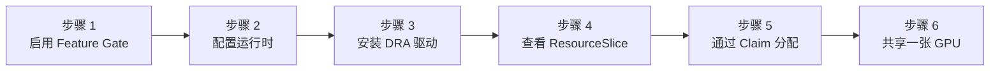

:::warning[实验性功能]

HAMi DRA 驱动尚处于快速发展阶段。本实验安装的是已在 Tesla T4 集群上实际验证过的 DaemonSet 清单（驱动版本 `projecthami/k8s-dra-driver:v0.1.0`）。驱动仓库此后新增了同一 v0.1.0 驱动的 Helm Chart（位于仓库 `chart/hami-dra-driver`，包含适用于 GPU Operator 集群的 `nvidiaDriverRoot` 值）；该路径验证完成后，本实验将切换为使用 Chart。可消耗容量（Consumable Capacity）特性目前仍需要通过 Kubernetes Feature Gate 启用。

:::

在 [实验 3](./gpu-partitioning.md) 中，你使用 HAMi 的扩展资源（`nvidia.com/gpumem`、`nvidia.com/gpucores`）对 GPU 进行了切片。本实验通过**动态资源分配（Dynamic Resource Allocation，DRA）**实现相同的效果——这是在 v1.34 中正式发布（GA）的 Kubernetes 原生设备 API。Pod 不再使用不透明的资源名称，而是通过 `ResourceClaim` 以结构化的、经过 Schema 验证的容量请求来申请设备。

## 为什么 DRA 很重要

|  | 扩展资源（实验 3） | DRA（本实验） |
| --- | --- | --- |
| API | 资源 limits 中的 `nvidia.com/gpumem: 4000` | `ResourceClaim` 的 `capacity.requests: {memory: 4Gi, cores: 30}` |
| 调度 | HAMi 调度器扩展 + Webhook | 原生 kube-scheduler DRA 插件 |
| 设备清单 | 设备插件写入的节点注解 | 带类型化属性的 `ResourceSlice` API 对象 |
| 设备选择 | 诸如 `nvidia.com/use-gputype` 的注解 | 基于设备属性的 CEL 表达式 |
| 验证 | 无（准入时接受任何数值） | 由 API Server 强制执行的 `requestPolicy`（含 min/max/step） |

HAMi DRA 驱动实现了 [DRA Consumable Capacity](https://github.com/kubernetes/enhancements/tree/master/keps/sig-scheduling/5075-dra-consumable-capacity) 特性：多个 Pod 从同一设备抽取容量，由调度器负责记账。

## 前提条件

- 已完成 [实验 1](./online-install.md) 的集群，Kubernetes **v1.34 或更高版本**，已安装 HAMi 和 GPU Operator
- 来自 [`tutorials/labs/examples/04-hami-dra/`](https://github.com/Project-HAMi/website/tree/master/tutorials/labs/examples/04-hami-dra) 的清单文件

## 实验概览



## 步骤 1: 启用 DRAConsumableCapacity Feature Gate

DRA 本身在 v1.34 中已 GA，但*可消耗容量*（多个 Pod 从同一设备的容量池中抽取）需要在控制面组件和 kubelet 上启用 `DRAConsumableCapacity` Feature Gate。以 root 身份运行 [`enable-dra-feature-gates.sh`](https://github.com/Project-HAMi/website/blob/master/tutorials/labs/examples/04-hami-dra/enable-dra-feature-gates.sh)：

```bash
for f in kube-apiserver kube-scheduler kube-controller-manager; do
  sed -i "/    - $f/a\\    - --feature-gates=DRAConsumableCapacity=true" /etc/kubernetes/manifests/$f.yaml
done

cat >> /var/lib/kubelet/config.yaml <<EOF
featureGates:
  DRAConsumableCapacity: true
EOF
systemctl restart kubelet
```

> 编辑 `/etc/kubernetes/manifests/` 下的静态 Pod 清单会使 kubelet 自动重启该组件。API Server 会中断约 20 秒；请等待 `kubectl get nodes` 再次响应。

验证 DRA API 组可用：

```bash
kubectl api-resources --api-group=resource.k8s.io
```

```plaintext
NAME                     SHORTNAMES   APIVERSION           NAMESPACED   KIND
deviceclasses                         resource.k8s.io/v1   false        DeviceClass
resourceclaims                        resource.k8s.io/v1   true         ResourceClaim
resourceclaimtemplates                resource.k8s.io/v1   true         ResourceClaimTemplate
resourceslices                        resource.k8s.io/v1   false        ResourceSlice
```

## 步骤 2: 配置容器运行时

DRA 驱动通过卷挂载而非 `NVIDIA_VISIBLE_DEVICES` 环境变量来选择设备，这需要一个额外的 NVIDIA 容器运行时选项。如果由 GPU Operator 管理 toolkit，通过 Helm 设置（Operator 会重写运行时配置并自动重启 containerd）：

```bash
RELEASE=$(helm list -n gpu-operator -o json | python3 -c "import json,sys; print(json.load(sys.stdin)[0]['name'])")

helm upgrade ${RELEASE} nvidia/gpu-operator -n gpu-operator --reuse-values \
  --set-json 'toolkit.env=[{"name":"ACCEPT_NVIDIA_VISIBLE_DEVICES_AS_VOLUME_MOUNTS","value":"true"},{"name":"CONTAINERD_SET_AS_DEFAULT","value":"true"}]' \
  --version=v25.3.0
```

toolkit Pod 重启后验证：

```bash
grep default_runtime_name /etc/containerd/config.toml
grep accept-nvidia-visible-devices-as-volume-mounts /usr/local/nvidia/toolkit/.config/nvidia-container-runtime/config.toml
```

```plaintext
      default_runtime_name = "nvidia"
accept-nvidia-visible-devices-as-volume-mounts = true
```

## 步骤 3: 安装 HAMi DRA 驱动

驱动以 kubelet 插件 DaemonSet 方式运行。两个清单文件：先 RBAC，再 DaemonSet。

```bash
kubectl apply -f rbac.yaml
kubectl apply -f ds-gpu-operator.yaml

kubectl get pods -n hami-dra-driver
```

```plaintext
NAME                                   READY   STATUS    RESTARTS   AGE
hami-dra-driver-kubelet-plugin-r4jtt   1/1     Running   0          31s
```

> `ds-gpu-operator.yaml` 是上游 DaemonSet 的微调版本：`NVIDIA_DRIVER_ROOT` 和 `driver-root` hostPath 指向 `/run/nvidia/driver`，因为 GPU Operator 将驱动放在容器内而非宿主机上。如果你的驱动直接安装在宿主机上，请使用未修改的[上游 `ds.yaml`](https://github.com/Project-HAMi/k8s-dra-driver/blob/main/demo/yaml/ds.yaml)。

## 步骤 4: 查看 ResourceSlice

在 DRA 世界中，驱动通过 `ResourceSlice` 对象而非节点注解来发布设备。查看驱动发布的内容：

```bash
kubectl get resourceslices -o jsonpath='{.items[0].spec.devices[0].capacity}' | python3 -m json.tool
```

```json
{
  "cores": {
    "requestPolicy": {
      "default": "100",
      "validRange": { "max": "100", "min": "0", "step": "1" }
    },
    "value": "100"
  },
  "memory": {
    "requestPolicy": {
      "default": "15Gi",
      "validRange": { "max": "15Gi", "min": "1Mi", "step": "1Mi" }
    },
    "value": "15Gi"
  }
}
```

> T4 被发布为一个拥有两种可消耗容量的设备：`cores`（0-100，步长 1）和 `memory`（最高 15Gi，步长 1Mi）。`requestPolicy` 由调度器强制执行，这是扩展资源从未具备的能力。设备还携带类型化属性（`productName: Tesla T4`、`architecture: Turing`、`cudaComputeCapability: 7.5.0`、UUID 等），Claim 可以通过 CEL 表达式进行选择，此外还有 `allowMultipleAllocations: true`，即可消耗容量开关。

## 步骤 5: 通过 ResourceClaim 分配 GPU 切片

`setup.yaml` 创建一个 `DeviceClass`（通过 CEL 选择 HAMi GPU）、一个 `test-dra` 命名空间和若干 Claim。关键部分：

```yaml
apiVersion: resource.k8s.io/v1
kind: ResourceClaim
metadata:
  namespace: test-dra
  name: single-gpu-0
spec:
  devices:
    requests:
      - name: single-gpu
        exactly:
          deviceClassName: hami-core-gpu.project-hami.io
          capacity:
            requests:
              cores: 30
              memory: "4Gi"
```

`pod-0.yaml` 通过引用 Claim 来替代请求 `nvidia.com/*` 资源：

```yaml
    resources:
      claims:
      - name: single-gpu
  resourceClaims:
  - name: single-gpu
    resourceClaimName: single-gpu-0
```

部署并验证：

```bash
kubectl apply -f setup.yaml
kubectl create -f pod-0.yaml
kubectl get pod pod-0 -n test-dra
kubectl get resourceclaim single-gpu-0 -n test-dra -o jsonpath='{.status.allocation.devices.results[0]}' | python3 -m json.tool
```

```json
{
  "consumedCapacity": {
    "cores": "30",
    "memory": "4Gi"
  },
  "device": "hami-gpu-0",
  "driver": "hami-core-gpu.project-hami.io",
  "pool": "hami-workshop",
  "request": "single-gpu",
  "shareID": "225b5df7-3753-45b1-9043-81c00616b384"
}
```

> Claim 已分配到设备 `hami-gpu-0`，并精确记录了它消耗了多少容量。`shareID` 的存在是因为该设备允许分配给多个 Pod。

在容器内部，你会看到与实验 3 相同的 HAMi-core 上限，但现在由 Claim 驱动：

```bash
kubectl exec -n test-dra pod-0 -- nvidia-smi | head -11
```

```plaintext
|   0  Tesla T4                       On  |   00000000:00:04.0 Off |                    0 |
| N/A   59C    P8             16W /   70W |       0MiB /   4096MiB |      0%      Default |
```

> `4096MiB` 总量：即 4Gi 的容量请求，由 HAMi-core 在容器内强制执行。

## 步骤 6: 两个 Pod 从同一设备抽取容量

`pod-tpl-0.yaml` 使用 `ResourceClaimTemplate`，因此每个 Pod 会获得自动生成的独立 Claim：

```bash
kubectl create -f pod-tpl-0.yaml
kubectl get pods -n test-dra
kubectl get resourceclaims -n test-dra
```

```plaintext
NAME        READY   STATUS    RESTARTS   AGE
pod-0       1/1     Running   0          2m6s
pod-tpl-1   1/1     Running   0          25s

NAME                  STATE                AGE
double-gpu-0          pending              2m6s
pod-tpl-1-gpu-j6lrf   allocated,reserved   25s
single-gpu-0          allocated,reserved   2m6s
```

> 两个 Claim 状态为 `allocated,reserved`，各自从同一设备消耗 30 核和 4Gi，拥有独立的 `shareID`。（`double-gpu-0` 保持 `pending` 仅仅是因为没有 Pod 引用它；DRA 在消费者到来时才分配 Claim。）

确认两个 Pod 运行在同一张物理卡上：

```bash
kubectl exec -n test-dra pod-0 -- nvidia-smi --query-gpu=uuid --format=csv,noheader
kubectl exec -n test-dra pod-tpl-1 -- nvidia-smi --query-gpu=uuid --format=csv,noheader
```

```plaintext
GPU-859b872c-0ba2-97b0-10b4-8b7185c55039
GPU-859b872c-0ba2-97b0-10b4-8b7185c55039
```

> 相同的 UUID。两个 Pod 共享一张 T4，完全通过 Kubernetes 原生 DRA API 进行调度和记账。无需调度器扩展，无需 Webhook，无需扩展资源。

## 清理

```bash
kubectl delete namespace test-dra
kubectl delete -f ds-gpu-operator.yaml -f rbac.yaml
kubectl delete deviceclass hami-core-gpu.project-hami.io
```

## 本实验验证了什么

| 声明 | 证据 |
| --- | --- |
| DRA 可以驱动 HAMi-core GPU 切片 | 具有 4Gi/30 核 Claim 的 Pod 看到 4096 MiB 的 GPU |
| 可消耗容量记账有效 | Claim 状态记录了每次分配的 `consumedCapacity` 及 `shareID` |
| 多个 Pod 原生共享同一设备 | 两个 Claim 在 `hami-gpu-0` 上状态为 `allocated,reserved`，两个 Pod 内 UUID 相同 |
| 容量请求经过 Schema 验证 | ResourceSlice 中的 `requestPolicy` 包含 min/max/step 约束 |

## 下一步

- 在同一集群上运行[实验 3](./gpu-partitioning.md)，并排比较两种分配路径：扩展资源目前可在任何 Kubernetes 版本上使用，而 DRA 则提供了类型化设备选择、Schema 验证的容量请求以及原生调度器记账。
- 尝试修改 Claim：在 `setup.yaml` 中更改 `cores` 和 `memory`，请求超过设备剩余容量的值，观察 Claim 保持 `pending` 而非过度分配。
- 在多 GPU 节点上，尝试 `double-gpu-0` Claim：它在单个 Claim 中请求两个具有不同容量的设备——这是扩展资源无法表达的。
- 驱动仓库现已提供 Helm Chart（`chart/hami-dra-driver`）；关注 [HAMi DRA 驱动发布](https://github.com/Project-HAMi/k8s-dra-driver/releases)了解本实验何时切换到 Chart，以及 [HAMi v2.10 路线图](https://github.com/Project-HAMi/HAMi/issues/1889)了解 DRA 支持的下一步计划。
