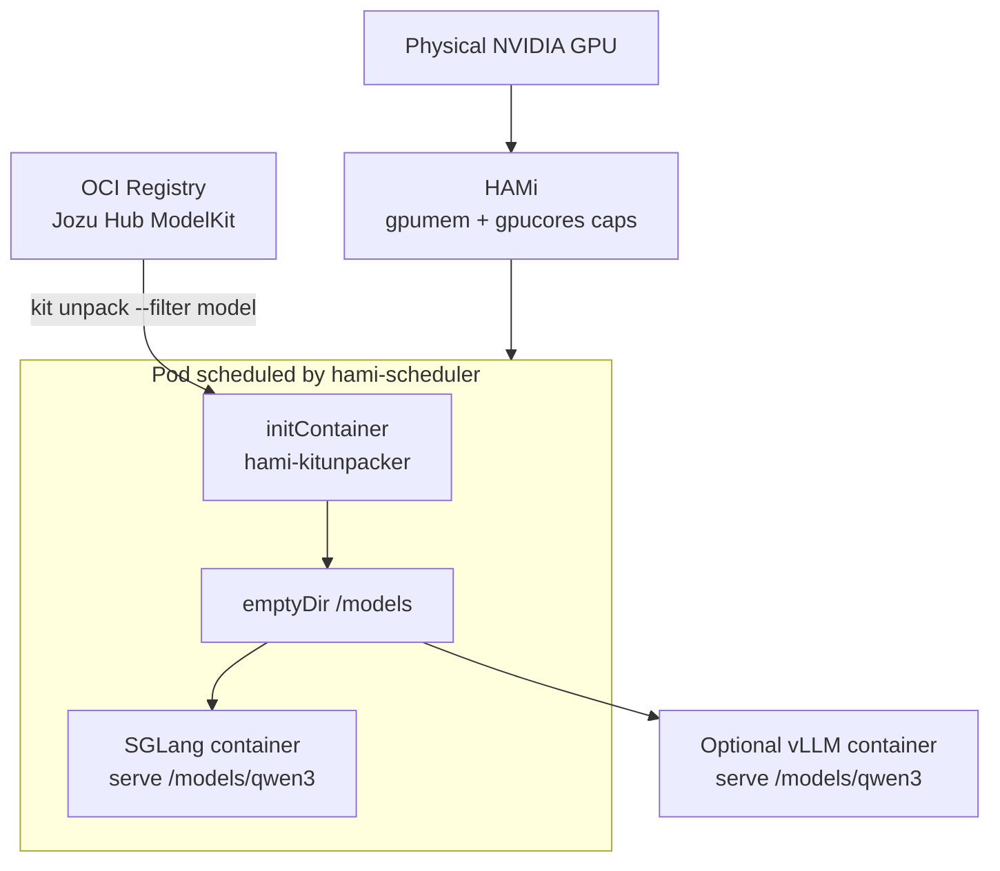

本实验演示如何将模型打包为 **[KitOps](https://kitops.org/) ModelKit**（一种带版本的 OCI 制品），使用 KitOps `initContainer` 从 OCI 注册表（示例中使用 **[Jozu Hub](https://jozu.ml)**）下载到 Pod，然后通过 [SGLang](https://github.com/sgl-project/sglang)（主要示例）或 vLLM（可选的共置示例）从**本地目录**在 HAMi 虚拟化 GPU 共享资源上提供服务。

与[实验 6（vLLM）](./hami-vllm)和实验 11（SGLang）一样，推理引擎运行在 HAMi 资源上。本实验采用注册表原生的**模型供应链**：模型被打包为 ModelKit，在 Jozu Hub 上进行版本管理和存储，以 OCI 制品的形式拉取到 Pod，并从本地路径提供服务。

## 学习目标

- 检查 OCI 注册表中的公共 KitOps ModelKit
- 构建精简的 `kitunpacker` 初始化镜像和自定义 SGLang 服务镜像
- 部署一个通过 `initContainer` 拉取并解包 ModelKit 的 Pod，主容器从 KitOps 提供的卷中加载模型
- 使用 HAMi 的 `nvidia.com/gpu`、`gpumem` 和 `gpucores` 调度工作负载
- 通过兼容 OpenAI 的 SGLang API 验证推理
- 可选地在同一物理 GPU 上共置一个使用相同 ModelKit 的 vLLM Pod

## 实验概览

```mermaid
%% title: HAMi + KitOps ModelKit Lab Flowchart
flowchart LR
    Step1["Step 1<br/>Prereqs + HAMi"] --> Step2["Step 2<br/>Inspect ModelKit"]
    Step2 --> Step3["Step 3<br/>Build Images"]
    Step3 --> Step4["Step 4<br/>Deploy SGLang+ModelKit"]
    Step4 --> Step5["Step 5<br/>Watch Unpack"]
    Step5 --> Step6["Step 6<br/>Test Inference"]
    Step6 --> Step7["Step 7<br/>Verify HAMi Caps"]
    Step7 --> Step8["Step 8<br/>Optional vLLM"]
    Step8 --> Step9["Step 9<br/>Cleanup"]
```



## 部署架构



## 前置条件

- 实验 11（或实验 6）的全部前置条件：配备 NVIDIA GPU 的 Kubernetes 集群、正常运行的 HAMi，以及 `kubectl` 和 `helm`
- Docker（或等效的构建工具），用于构建镜像并将其加载到集群
- 工作站上的 [`kit`](https://github.com/jozu-ai/kitops) CLI（可选，但建议用于 `kit inspect`）
- 能够从公共注册表 `jozu.ml` 拉取制品（示例 ModelKit 无需登录）

本实验假设已经按照实验 11 安装 HAMi。若尚未安装，请先完成实验 11 的步骤 1 至 3。

## 示例集群状态

验证使用与实验 11 相同的 kind + H100 集群。HAMi 公布 10 个 vGPU，`hami-scheduler` 和 `hami-device-plugin` 均处于 Running 状态。

本实验使用以下公共 ModelKit：

```plaintext
jozu.ml/jonathangamer202002/qwen3-4b-instruct@sha256:df4629f6a10bba7bec45e12bd15f910ed1024699bfbb44b63240899f71bb1c19
```

## 步骤 1：确认 HAMi 已就绪

```bash
kubectl get pods -n kube-system -l app.kubernetes.io/instance=hami -o wide
kubectl get nodes -o 'custom-columns=NAME:.metadata.name,GPU:.status.allocatable.nvidia\.com/gpu'
```

预期结果：设备插件和调度器处于 Running 状态，GPU 节点显示可分配的 `nvidia.com/gpu`（例如 `10`）。

检查当前使用 GPU 共享资源的工作负载，并缩容本实验不需要的工作负载。下面示例中的 ModelKit 和 4B 模型需要 30 GiB 的 HAMi 显存共享资源。

```bash
kubectl get pods --all-namespaces \
  -o custom-columns='NAMESPACE:.metadata.namespace,NAME:.metadata.name,GPU-MEM:.spec.containers[*].resources.limits.nvidia\.com/gpumem'
```

## 步骤 2：检查 ModelKit

在安装了 `kit` CLI 的计算机上运行：

```bash
kit inspect --remote jozu.ml/jonathangamer202002/qwen3-4b-instruct@sha256:df4629f6a10bba7bec45e12bd15f910ed1024699bfbb44b63240899f71bb1c19
```

验证环境中的输出示例（已截断）：

```json
{
  "digest": "sha256:df4629f6a10bba7bec45e12bd15f910ed1024699bfbb44b63240899f71bb1c19",
  "kitfile": {
    "package": { "name": "Qwen3-4B-Instruct-2507", "version": "1.0" },
    "model": {
      "name": "qwen3-4b-instruct",
      "path": "qwen3-4b-instruct/model",
      "license": "Apache 2.0"
    }
  },
  "manifest": {
    "artifactType": "application/vnd.kitops.modelkit.manifest.v1+json"
  }
}
```

ModelKit 将 safetensors 权重、分词器和配置作为 OCI 层保存。initContainer 会将它们解包并整理为扁平的模型目录（`config.json` + `*.safetensors`），供 SGLang 或 vLLM 从本地加载。

## 步骤 3：构建流水线镜像

创建工作目录和以下文件。

### 3.1 `kitunpacker` 初始化镜像

`kitunpacker/Dockerfile`:

```dockerfile
FROM alpine:3.20

ARG KITOPS_VERSION=v1.11.0

RUN apk add --no-cache bash coreutils findutils ca-certificates curl tar \
    && curl -fsSL "https://github.com/kitops-ml/kitops/releases/download/${KITOPS_VERSION}/kitops-linux-x86_64.tar.gz" -o /tmp/kit.tgz \
    && tar -xzf /tmp/kit.tgz -C /usr/local/bin kit \
    && rm -f /tmp/kit.tgz \
    && kit version

ENV MODELKIT_REF="jozu.ml/jonathangamer202002/qwen3-4b-instruct@sha256:df4629f6a10bba7bec45e12bd15f910ed1024699bfbb44b63240899f71bb1c19" \
    UNPACK_PATH="/models" \
    MODEL_SUBDIR="qwen3"

COPY unpack.sh /usr/local/bin/unpack.sh
RUN chmod +x /usr/local/bin/unpack.sh

ENTRYPOINT ["/usr/local/bin/unpack.sh"]
```

`kitunpacker/unpack.sh`:

```sh
#!/usr/bin/env sh
# kitunpacker: pull a ModelKit from an OCI registry (Jozu Hub by default) and
# unpack the model into a flat directory (config.json + *.safetensors) that
# vLLM / SGLang can load directly from local disk.
#
# Env (all overridable from the Pod spec):
#   MODELKIT_REF   full ModelKit reference, e.g. jozu.ml/<org>/<repo>:<tag>
#   UNPACK_PATH    root volume to unpack into                 (default /models)
#   MODEL_SUBDIR   final model dir under UNPACK_PATH          (default qwen3)
#   REGISTRY_URL/USERNAME/PASSWORD  optional creds for PRIVATE registries
set -eu

MODELKIT_REF="${MODELKIT_REF:?MODELKIT_REF is required}"
UNPACK_PATH="${UNPACK_PATH:-/models}"
MODEL_SUBDIR="${MODEL_SUBDIR:-qwen3}"
DEST="${UNPACK_PATH}/${MODEL_SUBDIR}"
RAW="${UNPACK_PATH}/.raw-${MODEL_SUBDIR}"
LOCK="${UNPACK_PATH}/.lock-${MODEL_SUBDIR}"

# keep the kit pull cache on the (large) mounted volume, not the tiny rootfs
export KITOPS_HOME="${UNPACK_PATH}/.kitcache"

ready() { [ -f "${DEST}/config.json" ] && ls "${DEST}"/*.safetensors >/dev/null 2>&1; }

echo "[kitunpacker] ref=${MODELKIT_REF} -> ${DEST}"

if ready; then
  echo "[kitunpacker] model already present, skipping unpack"
  exit 0
fi

# This lock only coordinates Pods when they mount the same shared PVC. With
# the emptyDir used in this lab, every Pod has an isolated volume and lock.
# mkdir is atomic, so Pods sharing a PVC do not race to write the same files.
if ! mkdir "${LOCK}" 2>/dev/null; then
  echo "[kitunpacker] another unpack in progress, waiting for it to finish..."
  i=0
  while [ "${i}" -lt 360 ]; do
    ready && { echo "[kitunpacker] model became ready"; exit 0; }
    i=$((i + 1)); sleep 5
  done
  echo "[kitunpacker] timed out waiting for peer unpack" >&2
  exit 1
fi
# shellcheck disable=SC2064
trap "rmdir '${LOCK}' 2>/dev/null || true" EXIT INT TERM

# optional login for private registries (public Jozu Hub needs none)
if [ -n "${REGISTRY_URL:-}" ] && [ -n "${USERNAME:-}" ] && [ -n "${PASSWORD:-}" ]; then
  echo "[kitunpacker] logging in to ${REGISTRY_URL} as ${USERNAME}"
  echo "${PASSWORD}" | kit login "${REGISTRY_URL}" -u "${USERNAME}" --password-stdin
fi

rm -rf "${RAW}"; mkdir -p "${RAW}"
echo "[kitunpacker] pulling + unpacking model layers from registry..."
kit unpack --filter model "${MODELKIT_REF}" -d "${RAW}"

# Flatten: ModelKits may store the .safetensors shards in a model/ subdir while
# config.json / *.index.json / tokenizer sit one level up. vLLM/transformers
# need them all in one directory, so collect everything into DEST.
SRC_CFG="$(find "${RAW}" -name config.json | head -1)"
[ -n "${SRC_CFG}" ] || { echo "[kitunpacker] config.json not found after unpack" >&2; exit 1; }
SRC="$(dirname "${SRC_CFG}")"

mkdir -p "${DEST}"
# all weight shards, wherever they live under the unpacked tree
find "${SRC}" -name '*.safetensors' -exec mv -f {} "${DEST}/" \;
# all top-level metadata files (config, index, tokenizer, vocab, generation cfg)
find "${SRC}" -maxdepth 1 -type f -exec mv -f {} "${DEST}/" \;

rm -rf "${RAW}" "${KITOPS_HOME}"

echo "[kitunpacker] final model directory:"
ls -la "${DEST}"
ready || { echo "[kitunpacker] validation failed: missing config or shards" >&2; exit 1; }
echo "[kitunpacker] done."

```

构建镜像：

```bash
docker build -t hami-kitunpacker:latest ./kitunpacker
```

### 3.2 自定义 SGLang 镜像（从本地模型路径提供服务）

`sglang/Dockerfile`:

```dockerfile
FROM lmsysorg/sglang:v0.5.7

ENV MODEL_DIR="/models/qwen3" \
    SERVED_NAME="qwen3-4b-instruct" \
    CONTEXT_LEN="8192" \
    MEM_FRACTION="0.8" \
    PORT="30000" \
    ATTENTION_BACKEND="triton"

COPY serve.sh /usr/local/bin/serve.sh
RUN chmod +x /usr/local/bin/serve.sh

ENTRYPOINT ["/usr/local/bin/serve.sh"]
```

`sglang/serve.sh`:

```bash
#!/usr/bin/env bash
# Custom SGLang entrypoint: serve a model unpacked from a KitOps ModelKit that
# the kitunpacker initContainer placed on a shared volume. Serves from a LOCAL
# directory (--model-path) delivered straight from the Jozu Hub ModelKit.
set -euo pipefail

MODEL_DIR="${MODEL_DIR:-/models/qwen3}"
SERVED_NAME="${SERVED_NAME:-qwen3-4b-instruct}"
CONTEXT_LEN="${CONTEXT_LEN:-8192}"
MEM_FRACTION="${MEM_FRACTION:-0.8}"
PORT="${PORT:-30000}"
ATTENTION_BACKEND="${ATTENTION_BACKEND:-triton}"

echo "[sglang-jozu] serving KitOps model from ${MODEL_DIR} (source: Jozu Hub ModelKit)"
if [ ! -f "${MODEL_DIR}/config.json" ]; then
  echo "[sglang-jozu] ERROR: ${MODEL_DIR}/config.json not found -- did the kitunpacker init run?" >&2
  exit 1
fi

exec python3 -m sglang.launch_server \
  --model-path "${MODEL_DIR}" \
  --served-model-name "${SERVED_NAME}" \
  --host 0.0.0.0 \
  --port "${PORT}" \
  --mem-fraction-static "${MEM_FRACTION}" \
  --context-length "${CONTEXT_LEN}" \
  --attention-backend "${ATTENTION_BACKEND}"

```

构建镜像：

```bash
docker build -t hami-sglang-jozu:latest ./sglang
```

### 3.3 将镜像加载到集群

对于 kind：

```bash
kind load docker-image hami-kitunpacker:latest --name <your-cluster>
kind load docker-image hami-sglang-jozu:latest --name <your-cluster>
```

对于其他集群，请将镜像推送到节点可以访问的注册表，并相应更新 Deployment 中的镜像字段。

### 3.4 可选：自定义 vLLM 镜像（用于步骤 8）

`vllm/Dockerfile`:

```dockerfile
FROM vllm/vllm-openai:v0.23.0

ENV MODEL_DIR="/models/qwen3" \
    SERVED_NAME="qwen3-4b-instruct" \
    MAX_MODEL_LEN="8192" \
    GPU_MEM_UTIL="0.85" \
    PORT="8000"

COPY serve.sh /usr/local/bin/serve.sh
RUN chmod +x /usr/local/bin/serve.sh

ENTRYPOINT ["/usr/local/bin/serve.sh"]
```

`vllm/serve.sh`:

```bash
#!/usr/bin/env bash
# Custom vLLM entrypoint: serve a model unpacked from a KitOps ModelKit that the
# kitunpacker initContainer placed on a shared volume. It serves from a LOCAL
# directory (--model-path) populated from the Jozu Hub ModelKit.
set -euo pipefail

MODEL_DIR="${MODEL_DIR:-/models/qwen3}"
SERVED_NAME="${SERVED_NAME:-qwen3-4b-instruct}"
MAX_MODEL_LEN="${MAX_MODEL_LEN:-8192}"
GPU_MEM_UTIL="${GPU_MEM_UTIL:-0.85}"
PORT="${PORT:-8000}"

echo "[vllm-jozu] serving KitOps model from ${MODEL_DIR} (source: Jozu Hub ModelKit)"
if [ ! -f "${MODEL_DIR}/config.json" ]; then
  echo "[vllm-jozu] ERROR: ${MODEL_DIR}/config.json not found -- did the kitunpacker init run?" >&2
  exit 1
fi

exec vllm serve "${MODEL_DIR}" \
  --served-model-name "${SERVED_NAME}" \
  --max-model-len "${MAX_MODEL_LEN}" \
  --gpu-memory-utilization "${GPU_MEM_UTIL}" \
  --host 0.0.0.0 \
  --port "${PORT}"

```

```bash
docker build -t hami-vllm-jozu:latest ./vllm
# kind load docker-image hami-vllm-jozu:latest --name <your-cluster>
```

## 步骤 4：部署使用 ModelKit 的 SGLang 服务

该 Deployment 使用以下组件：

1. `initContainer: kitops-init`，将 ModelKit 拉取并整理到 `/models/qwen3`
2. 主容器 `hami-sglang-jozu`，从该本地目录提供服务
3. HAMi 调度器以及 `gpumem` 和 `gpucores` 限制
4. 用于模型卷的 `emptyDir`（便于移植，生产环境请使用 PVC）

模型层约为 7.5 GiB。解包期间，模型同时存在于 `KITOPS_HOME` 和暂存目录中，因此峰值用量约为 15 GiB。请将示例卷保持为 20 GiB 或更大。

```bash
kubectl apply -f - <<'EOF'
apiVersion: v1
kind: Namespace
metadata:
  name: kitops
---
apiVersion: apps/v1
kind: Deployment
metadata:
  name: sglang-modelkit
  namespace: kitops
  labels:
    app.kubernetes.io/name: sglang-modelkit
spec:
  replicas: 1
  selector:
    matchLabels:
      app.kubernetes.io/name: sglang-modelkit
  template:
    metadata:
      labels:
        app.kubernetes.io/name: sglang-modelkit
      annotations:
        hami.io/node-scheduler-policy: binpack
        hami.io/gpu-scheduler-policy: binpack
    spec:
      schedulerName: hami-scheduler
      initContainers:
        - name: kitops-init
          image: hami-kitunpacker:latest
          imagePullPolicy: IfNotPresent
          env:
            - name: MODELKIT_REF
              value: "jozu.ml/jonathangamer202002/qwen3-4b-instruct@sha256:df4629f6a10bba7bec45e12bd15f910ed1024699bfbb44b63240899f71bb1c19"
            - name: UNPACK_PATH
              value: "/models"
            - name: MODEL_SUBDIR
              value: "qwen3"
          volumeMounts:
            - name: modelkit
              mountPath: /models
      containers:
        - name: sglang
          image: hami-sglang-jozu:latest
          imagePullPolicy: IfNotPresent
          env:
            - name: MODEL_DIR
              value: "/models/qwen3"
            - name: SERVED_NAME
              value: "qwen3-4b-instruct"
            - name: CONTEXT_LEN
              value: "8192"
            - name: MEM_FRACTION
              value: "0.8"
          ports:
            - name: http
              containerPort: 30000
          resources:
            requests:
              cpu: "2"
              memory: 8Gi
              nvidia.com/gpu: "1"
              nvidia.com/gpumem: "30000"
              nvidia.com/gpucores: "30"
            limits:
              cpu: "8"
              memory: 32Gi
              nvidia.com/gpu: "1"
              nvidia.com/gpumem: "30000"
              nvidia.com/gpucores: "30"
          readinessProbe:
            httpGet:
              path: /health
              port: 30000
            initialDelaySeconds: 40
            periodSeconds: 10
            timeoutSeconds: 5
            failureThreshold: 90
          volumeMounts:
            - name: modelkit
              mountPath: /models
            - name: dshm
              mountPath: /dev/shm
      volumes:
        - name: modelkit
          emptyDir:
            sizeLimit: 20Gi
        - name: dshm
          emptyDir:
            medium: Memory
            sizeLimit: 8Gi
---
apiVersion: v1
kind: Service
metadata:
  name: sglang-modelkit
  namespace: kitops
spec:
  type: ClusterIP
  selector:
    app.kubernetes.io/name: sglang-modelkit
  ports:
    - name: http
      port: 8001
      targetPort: http
EOF
```

对于**私有**注册表，请通过 Secret 向 `kitops-init` 添加 `REGISTRY_URL`、`USERNAME` 和 `PASSWORD` 环境变量。`unpack.sh` 会在拉取前运行 `kit login`。

## 步骤 5：观察 ModelKit 解包过程

```bash
kubectl -n kitops get pods -w
kubectl -n kitops logs -l app.kubernetes.io/name=sglang-modelkit -c kitops-init -f
```

成功解包时输出如下：

```plaintext
[kitunpacker] ref=jozu.ml/jonathangamer202002/qwen3-4b-instruct@sha256:df4629f6a10bba7bec45e12bd15f910ed1024699bfbb44b63240899f71bb1c19 -> /models/qwen3
[kitunpacker] pulling + unpacking model layers from registry...
Unpacking to /models/.raw-qwen3
...
[kitunpacker] final model directory:
... config.json ... model-00001-of-00003.safetensors ... tokenizer.json ...
[kitunpacker] done.
```

然后等待 SGLang 容器就绪：

```bash
kubectl -n kitops rollout status deploy/sglang-modelkit --timeout=30m
kubectl -n kitops logs -l app.kubernetes.io/name=sglang-modelkit -c sglang --tail=50
```

自定义入口点会输出以下消息，确认模型从 ModelKit 的**本地**路径提供服务：

```plaintext
[sglang-jozu] serving KitOps model from /models/qwen3 (source: Jozu Hub ModelKit)
... model_path='/models/qwen3' ... served_model_name='qwen3-4b-instruct' ...
```

## 步骤 6：测试推理

```bash
kubectl -n kitops port-forward svc/sglang-modelkit 8001:8001
```

在另一个终端中运行：

```bash
curl -s http://127.0.0.1:8001/v1/models | python3 -m json.tool
```

输出示例：

```json
{
  "object": "list",
  "data": [
    {
      "id": "qwen3-4b-instruct",
      "object": "model",
      "owned_by": "sglang",
      "max_model_len": 8192
    }
  ]
}
```

聊天补全：

```bash
curl -s http://127.0.0.1:8001/v1/chat/completions \
  -H "Content-Type: application/json" \
  -d '{
    "model": "qwen3-4b-instruct",
    "messages": [
      {"role": "user", "content": "In one sentence, what is a KitOps ModelKit?"}
    ],
    "max_tokens": 96,
    "temperature": 0.2
  }' | python3 -m json.tool
```

如果存在 `choices[0].message.content`，则说明 ModelKit 到本地 SGLang 的推理流程正常工作。

## 步骤 7：验证 HAMi 资源限制

```bash
POD=$(kubectl get pod -n kitops -l app.kubernetes.io/name=sglang-modelkit -o jsonpath='{.items[0].metadata.name}')
kubectl get pod -n kitops ${POD} \
  -o jsonpath='{.spec.schedulerName}{"\n"}{.spec.containers[0].resources.limits}{"\n"}'
kubectl exec -n kitops ${POD} -c sglang -- env | grep -E 'CUDA_DEVICE|NVIDIA_VISIBLE'
kubectl exec -n kitops ${POD} -c sglang -- nvidia-smi
```

验证集群中的结果：

```plaintext
hami-scheduler
... nvidia.com/gpumem:30000 nvidia.com/gpucores:30 ...

NVIDIA_VISIBLE_DEVICES=GPU-...
CUDA_DEVICE_MEMORY_LIMIT_0=30000m
CUDA_DEVICE_SM_LIMIT=30

| NVIDIA H100 80GB HBM3 ... | 24745MiB / 30000MiB |
```

主容器从 `/models/qwen3`（OCI ModelKit）加载权重，同时 HAMi 在共享 H100 上仍将 Pod 内显存上限限制为 **30000 MiB**。

## 步骤 8（可选）：使用相同 ModelKit 模式共置 vLLM

构建并加载 `hami-vllm-jozu:latest` 后，部署使用独立 HAMi 共享资源的第二个引擎。如果希望两个 Pod 复用同一个已解包的 ModelKit，请使用 **PVC**（或节点本地缓存）。使用 `emptyDir` 时，每个 Pod 都会独立解包。

```bash
kubectl apply -f - <<'EOF'
apiVersion: apps/v1
kind: Deployment
metadata:
  name: vllm-modelkit
  namespace: kitops
  labels:
    app.kubernetes.io/name: vllm-modelkit
spec:
  replicas: 1
  selector:
    matchLabels:
      app.kubernetes.io/name: vllm-modelkit
  template:
    metadata:
      labels:
        app.kubernetes.io/name: vllm-modelkit
      annotations:
        hami.io/node-scheduler-policy: binpack
        hami.io/gpu-scheduler-policy: binpack
    spec:
      schedulerName: hami-scheduler
      initContainers:
        - name: kitops-init
          image: hami-kitunpacker:latest
          imagePullPolicy: IfNotPresent
          env:
            - name: MODELKIT_REF
              value: "jozu.ml/jonathangamer202002/qwen3-4b-instruct@sha256:df4629f6a10bba7bec45e12bd15f910ed1024699bfbb44b63240899f71bb1c19"
            - name: UNPACK_PATH
              value: "/models"
            - name: MODEL_SUBDIR
              value: "qwen3"
          volumeMounts:
            - name: modelkit
              mountPath: /models
      containers:
        - name: vllm
          image: hami-vllm-jozu:latest
          imagePullPolicy: IfNotPresent
          env:
            - name: MODEL_DIR
              value: "/models/qwen3"
            - name: SERVED_NAME
              value: "qwen3-4b-instruct"
          ports:
            - name: http
              containerPort: 8000
          resources:
            limits:
              cpu: "8"
              memory: 32Gi
              nvidia.com/gpu: "1"
              nvidia.com/gpumem: "30000"
              nvidia.com/gpucores: "30"
          readinessProbe:
            httpGet:
              path: /health
              port: 8000
            initialDelaySeconds: 40
            periodSeconds: 10
            failureThreshold: 90
          volumeMounts:
            - name: modelkit
              mountPath: /models
            - name: dshm
              mountPath: /dev/shm
      volumes:
        - name: modelkit
          emptyDir:
            sizeLimit: 20Gi
        - name: dshm
          emptyDir:
            medium: Memory
            sizeLimit: 8Gi
---
apiVersion: v1
kind: Service
metadata:
  name: vllm-modelkit
  namespace: kitops
spec:
  selector:
    app.kubernetes.io/name: vllm-modelkit
  ports:
    - name: http
      port: 8000
      targetPort: http
EOF
```

使用以下命令测试：

```bash
kubectl -n kitops port-forward svc/vllm-modelkit 8000:8000
curl -s http://127.0.0.1:8000/v1/models
```

确保合计的 `gpumem` 请求能够容纳在物理 GPU 上。例如，两个 30000 MiB 的请求需要该 GPU 至少有 60 GiB 可用显存。

## 参考：Kitfile（重新打包自己的 ModelKit）

```yaml
# Reference Kitfile for the Qwen3-4B-Instruct ModelKit used in this demo.
#
# The demo PULLS a pre-built public ModelKit from Jozu Hub:
#     jozu.ml/jonathangamer202002/qwen3-4b-instruct@sha256:df4629f6a10bba7bec45e12bd15f910ed1024699bfbb44b63240899f71bb1c19
#
# This Kitfile is provided so you can (re)pack and push your OWN ModelKit to a
# registry (Jozu Hub, ACR, GHCR, ...) from a local model directory (config.json + safetensors):
#
#     # 1) get a model directory (e.g. via `kit unpack` or `kit import`)
#     # 2) place this Kitfile next to a ./qwen3 directory of safetensors + config
#     kit pack . -t jozu.ml/<your-org>/qwen3-4b-instruct:latest
#     kit login jozu.ml -u <user> --password-stdin   # needed only for push
#     kit push jozu.ml/<your-org>/qwen3-4b-instruct:latest
manifestVersion: "1.0"
package:
  name: qwen3-4b-instruct
  version: "1.0"
  authors:
    - HAMi KubeCon Demo
  description: >
    Qwen3-4B-Instruct-2507 packaged as a KitOps ModelKit (safetensors layout), served on HAMi-virtualized GPUs by vLLM and SGLang.


model:
  name: qwen3-4b-instruct
  path: ./qwen3
  license: Apache-2.0
  description: Qwen3 4B instruct, safetensors (Qwen3ForCausalLM)
```

```bash
# After placing a safetensors-layout model directory at ./qwen3 next to the Kitfile:
kit pack . -t jozu.ml/<your-org>/qwen3-4b-instruct:latest
kit push jozu.ml/<your-org>/qwen3-4b-instruct:latest
```

然后将 Deployment 中的 `MODELKIT_REF` 指向你的标签。

## 故障排查

| 现象 | 检查内容 |
| --- | --- |
| initContainer 一直处于拉取状态 | 检查节点到注册表的连通性以及 `emptyDir` 的磁盘压力，必要时增大 `sizeLimit`。 |
| `config.json not found after unpack` | ModelKit 布局不同。使用 `kit inspect --remote` 检查，并调整整理逻辑或 `MODEL_SUBDIR`。 |
| SGLang 退出并提示模型目录缺失 | initContainer 失败。查看 `kubectl logs ... -c kitops-init`。 |
| 自定义镜像出现 ImagePullBackOff | 使用 `kind load` 或推送到你的注册表。本地标签请设置 `imagePullPolicy: IfNotPresent`。 |
| GPU Pod 处于 Pending 状态 | 释放 HAMi 共享资源、降低 `gpumem`，并检查 `hami-scheduler` 事件。 |
| 私有注册表返回 401 | 在 `kitops-init` 上设置 `REGISTRY_URL`、`USERNAME` 和 `PASSWORD`。 |
| Pod 内仍显示完整 GPU 显存 | 与实验 11 相同，请检查 HAMi 环境变量和 `schedulerName`。 |

## 清理

```bash
kubectl delete namespace kitops --ignore-not-found
# optional: remove local images
# docker rmi hami-kitunpacker:latest hami-sglang-jozu:latest hami-vllm-jozu:latest
```

## 验证结果

| 验证项 | 证据 |
| --- | --- |
| 模型是 OCI ModelKit | `kit inspect --remote` 返回 KitOps 清单和模型层。 |
| 模型从 ModelKit 交付到主容器 | initContainer 日志显示 `kit unpack`，SGLang 日志显示 `serving KitOps model from /models/qwen3` 和 `model_path='/models/qwen3'`。 |
| HAMi 调度工作负载 | `schedulerName: hami-scheduler` 以及 Filtering 和 Binding 事件。 |
| GPU 显存和计算限制生效 | `CUDA_DEVICE_MEMORY_LIMIT_0=30000m`、`CUDA_DEVICE_SM_LIMIT=30`，Pod 内的 `nvidia-smi` 显示 `... / 30000MiB`。 |
| 推理正常工作 | `/v1/models` 列出 `qwen3-4b-instruct`，聊天补全返回内容。 |

## 后续步骤

- 将公共 Jozu ModelKit 换成内部注册表中的 ModelKit，并配置 imagePullSecrets 或 `kit login` Secret。
- 在 SGLang 和 vLLM 之间共享一个 PVC，使 ModelKit 只需解包一次。
- 结合[实验 3：GPU 切分](./gpu-partitioning)，在每个 GPU 上容纳更多租户。
- 返回实验 11：SGLang，了解引擎在启动时直接拉取模型的简化方式。该方式适合在不涉及供应链的情况下独立调试推理引擎。
