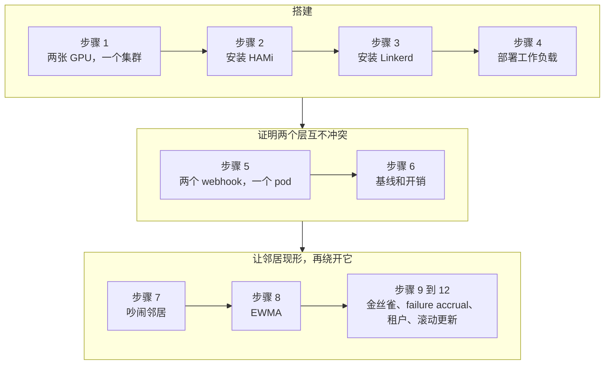
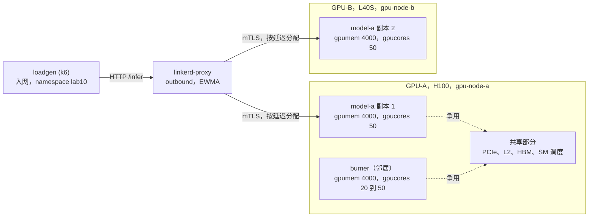
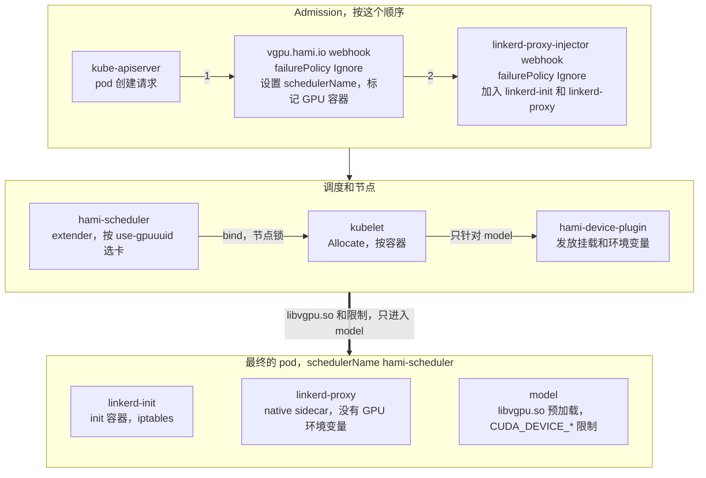

第一批看到这个实验标题的人大概会先笑一下。也许笑得有道理。HAMi 和 Linkerd 是工作在不同层上的两个不同系统。HAMi 切分 GPU，而 Linkerd 路由 HTTP 请求。那证书又能跟这些扯上什么关系？两者之间连一行共用的代码都没有。为了弄清这个想法在现实中到底是怎么回事，我在 Nebius Cloud 上搭了一个有两张 GPU 的集群，测了一整天。这个实验就是那个星期天的逐步复现。

把本该在结尾说的话放在开头说。是的，它们工作在不同的层上，而这本来就恰恰是重点。HAMi 把硅片切开，没错，但它藏不住邻居在切片里造成的延迟。藏延迟也不是它的工作。而 Linkerd 完全看不见 GPU，但它看得见每一个请求的延迟，并据此分配流量。我刚才提到的证书问题，答案也是从同一个地方来的。阻止共享同一张卡的两个租户访问对方 endpoint 的，是 Linkerd 给每个 pod 的 mTLS 身份。怎么做到的？答案你一定能在下面找到。

本实验的每一条命令和每一段输出都来自 2026-09-26/27 的一次真实运行，同一个 k3s 集群里的两台 Nebius 虚拟机，server 节点上一张 H100 80GB，agent 节点上一张 L40S 48GB，来自官方 chart 的 HAMi 2.10.0，Linkerd edge-26.9.3，Gateway API CRD v1.5.1。

## 你将学到什么

- HAMi 的显存和算力限制圈住了什么，卡上又有什么依然是共享的（PCIe、L2、HBM、SM 调度）
- HAMi 和 Linkerd 的 mutating webhook 如何改动同一个 pod，并证明 HAMi-core 只落在 GPU 容器里
- 用对照组测量吵闹邻居对同卡副本的影响，并读懂为什么 `gpucores` 消除不了它
- 看着 Linkerd 的 EWMA 负载均衡把客户端的 p99 稳住，而不入网的调用方多付 2 到 3 倍的代价
- 在小切片上用 HTTPRoute 权重做金丝雀，对逐请求失败的切片做 failure accrual，用 `Server` 和 `AuthorizationPolicy` 做租户隔离
- `CardInsufficientCore` 会悄悄拦下的两件事，一个 100 core 的邻居，和一个 Deployment 的 surge pod

## 实验概览



## 前提条件

- 同一个 k3s 集群中的两个节点，各有一张 NVIDIA GPU。唯一不能跳过的决定是**至少要有 2 张物理 GPU**。只有一张卡的话，负载均衡就没有一个安静的副本可以把流量挪过去，步骤 8 也就无从展示。
- 两个节点上都装好 NVIDIA 驱动和 container toolkit，每台主机上 `nvidia-smi` 可用，节点已打上 `gpu=on` 标签。
- 执行命令的机器上有 `kubectl`、`helm` 和 `jq`。`linkerd` 在步骤 3 安装。
- 清单文件位于 [`tutorials/labs/examples/18-hami-linkerd-noisy-neighbor/`](https://github.com/Project-HAMi/website/tree/master/tutorials/labs/examples/18-hami-linkerd-noisy-neighbor)。它们也全部内嵌在下文中，所以不需要克隆任何仓库。

| 组件            | 版本                                             |
| --------------- | ------------------------------------------------ |
| Kubernetes      | v1.36.3+k3s1                                     |
| HAMi chart      | 2.10.0，镜像 `projecthami/hami:v2.10.0`          |
| Linkerd         | edge-26.9.3，CLI、控制平面和 Viz                 |
| Gateway API CRD | v1.5.1                                           |
| 工作负载镜像    | `pytorch/pytorch:2.14.0-cuda12.6-cudnn9-runtime` |
| 负载生成器      | `grafana/k6:2.3.0`                               |
| 租户客户端      | `curlimages/curl:8.22.0`                         |

在你自己的环境里改动任何东西之前，先把这张表看一遍。几个月后把实验搞坏的，几乎总是版本漂移。

:::note[HAMi 隔离了什么，没隔离什么]

一张 H100，不管是一个服务用掉 80 GB 里的 4 GB，还是十个服务各用 4 GB，价格都一样。[HAMi](https://github.com/Project-HAMi/HAMi) 让你能跑这十个。pod 申请 `nvidia.com/gpu: 1`、`nvidia.com/gpumem: 4000` 和 `nvidia.com/gpucores: 50`。HAMi 的 scheduler extender 挑一张还有这么多空间的卡。在节点上，device plugin 通过 `/etc/ld.so.preload` 把 [libvgpu.so](https://github.com/Project-HAMi/HAMi-core) 注入容器。这个库强制执行显存限制，并把 kernel 启动节流到算力份额。

有些部分仍然是共享的，PCIe 链路、L2 缓存、HBM 带宽，以及节流窗口内 SM 上的 kernel 调度。另一个切片里的计算密集型邻居会在不碰你任何限制的情况下推高你 kernel 的延迟。这就是本实验的问题。如果共享损害了某个服务的延迟，你怎么看见它，又怎么管理它？

:::

做完之后，你手里会有这 12 项证明。

| # | 论断 | 在这个集群上的结果 |
| --- | --- | --- |
| 1 | 两个 webhook 作用于同一个 pod | `schedulerName: hami-scheduler`、native sidecar `linkerd-proxy`、两套 annotation 出现在同一个 pod 上 |
| 2 | HAMi-core 只在 GPU 容器里 | `libvgpu.so` 预加载和 `CUDA_DEVICE_*` 限制在 `model` 里有，`linkerd-proxy` 里没有 |
| 3 | 有 sidecar 时隔离依然成立 | 2000 MiB 分配成功，6000 MiB 以 `OutOfMemoryError` 失败，容量显示为 3.91 GiB |
| 4 | 流量经过代理且走 mTLS | `linkerd viz edges` 显示 SECURED，`tap` 显示 `tls=true` |
| 5 | 副本在不同的物理卡上 | H100 和 L40S 的 UUID 与 `nvidia-smi -L` 一致 |
| 6 | 邻居效应是因果的 | 副本 1 的 p50 从 1 ms 到 5 ms，p99 从 8 到 20 ms，邻居挪到另一张卡时回到基线 |
| 7 | EWMA 会转移流量 | 邻居开启时，入网客户端 p99 为 16 ms，不入网 25 到 48 ms |
| 8 | 网格开销可以忽略 | 单副本，p50 9.43 对 9.37 ms，p99 11.84 对 11.85 ms |
| 9 | 金丝雀权重生效 | 请求 90/10，测得 90.1/9.9，请求 50/50，测得 49.7/50.3 |
| 10 | failure accrual 踢出坏切片 | 到达坏 pod 的请求从 1,251 降到 10，成功率从 97.09% 升到 99.98% |
| 11 | 租户隔离在网络上也成立 | tenant-a 得到 403，tenant-b 得到 200，两条边都是 SECURED |
| 12 | 生命周期干净，但有一个陷阱 | 滚动更新 26 秒，切片释放后以完全相同的分配重新发放，卡上有邻居时 surge pod 因 `CardInsufficientCore` 卡在 Pending |

## 步骤 1 设计环境



图里两个层从不接触。HAMi 给每个切片画出各自的显存限制和算力份额，而卡的下半部分并没有被切分。而 Linkerd 的代理完全看不见卡。它唯一看见的是两个副本的请求延迟。本实验中的每一次测量都是在这张图之上读的。

| 角色 | 节点 | GPU | UUID |
| --- | --- | --- | --- |
| GPU-A，model-a 副本 1 和吵闹邻居 | `gpu-node-a` | NVIDIA H100 80GB HBM3 | `GPU-7023a4c2-4128-840d-2b86-ab87d8bf7f47` |
| GPU-B，model-a 副本 2，安静 | `gpu-node-b` | NVIDIA L40S 48GB | `GPU-4dc50575-f241-9f14-1e6e-ecb4a93c3299` |

我的环境里两张卡不是同一个型号。如果你有两张相同的卡，数字会更干净。如果没有，步骤 7 里的对照组会让这种不对称变得无害。

到这里我还需要加一点关于命名的说明。本实验中我把节点叫作 `gpu-node-a` 和 `gpu-node-b`。在我真实的集群里，它们的名字是云厂商分配的长实例 ID，会让正文没法读。你需要把自己的节点名填到两个地方。一个是步骤 2 里的 `scheduler.nodeName` 值，以及步骤 4 中 loadgen 清单里的 `nodeSelector`。输出里的 `gpu-node-a` 也同样要读作你自己的名字。

在每台主机上取得你自己的 UUID。

```bash
nvidia-smi -L
```

```plaintext
GPU 0: NVIDIA H100 80GB HBM3 (UUID: GPU-7023a4c2-4128-840d-2b86-ab87d8bf7f47)
GPU 0: NVIDIA L40S (UUID: GPU-4dc50575-f241-9f14-1e6e-ecb4a93c3299)
```

把这两个值写进下面清单中每一处 `nvidia.com/use-gpuuuid` annotation。这个 annotation 名在 HAMi v2.10.0 的 `pkg/device/nvidia/device.go` 中定义为 `GPUUseUUID`。它的兄弟 `nvidia.com/nouse-gpuuuid` 用来排除卡。

你会在事件里看到绑定在起作用。pod 的调度事件对另一个节点显示 `CardUuidMismatch`，意思是 extender 因为 UUID 把那张卡剔除了。

```plaintext
FilteringFailed   1 nodes CardUuidMismatch(gpu-node-b)
```

别跳过绑定。chart 默认的节点策略是 `binpack`，GPU 策略是 `spread`。你可以在 `helm show values hami-charts/hami --version 2.10.0` 输出的 `scheduler.defaultSchedulerPolicy` 下看到。binpack 会尽量把已经满的节点填满。如果把两个副本交给策略，它们完全可能落到同一张卡上，那样步骤 8 就没有安静的副本可以转移了。所以在这个实验里我们不信任策略，把每个副本按名字绑死。

我的第二个节点和早先一次实验一样，是一个跑在 privileged 容器里、带 `--network host` 的 k3s agent。这是实验室的捷径，host 网络上的 privileged 容器不是生产节点可接受的形态，生产上请把 agent 直接装在主机上。机器重启时有两件事咬了我一口。它自己的 k3s server 又起来了并占住了 `127.0.0.1:6444`，inotify 限制也被重置了。两者都在主机上修好。

```bash
sudo systemctl stop k3s
echo "fs.inotify.max_user_instances=8192" | sudo tee /etc/sysctl.d/99-k3s-agent.conf
sudo sysctl -p /etc/sysctl.d/99-k3s-agent.conf
sudo docker restart k3s-agent
```

在动其他任何东西之前，先验证跨节点的 pod 网络。第二个 GPU 节点上的 pod 能访问控制平面节点上的 pod 吗？

```bash
kubectl run nettest --image=busybox:1.36 --overrides='{"spec":{"nodeName":"gpu-node-b"}}' \
  -- wget -qO- http://<coredns-pod-ip>:8181/ready
```

```plaintext
OK
```

我的集群里有一个早先实验留下的、挂在 docker bridge 上的无 GPU 节点。第一次安装 Linkerd 时 `linkerd-identity` 落到了那里，第二个 GPU 节点上的代理拿不到证书。我没删这个节点，而是把它 cordon 了。如果你也有这样的节点，在进入步骤 3 之前先 cordon 它。

## 步骤 2 安装 HAMi

环境就绪，轮到 HAMi。但先做一点我不得不做的清理。如果你在用 GPU Operator，它自己的 device plugin 必须关掉。我一开始跳过了这一步，结果两个 plugin 把同一张卡注册了两次，那种状态下下面的任何数字都不可信。在两个 GPU 节点上打下面这个标签就够了。

```bash
kubectl label node <gpu-node> nvidia.com/gpu.deploy.device-plugin=false --overwrite
```

现在是真正的安装。如果我照原样装 chart，这一节就只有两行。在 k3s 上不是这么回事，有三个值必须和默认值不同。三个都是我试出来的，也就是错出来的，写在这里是为了你不必再试。

```bash
helm repo add hami-charts https://project-hami.github.io/HAMi/ && helm repo update
helm upgrade --install hami hami-charts/hami --version 2.10.0 -n kube-system \
  --set scheduler.nodeName=gpu-node-a \
  --set scheduler.kubeScheduler.image.registry=registry.k8s.io \
  --set scheduler.kubeScheduler.image.repository=kube-scheduler \
  --set scheduler.kubeScheduler.image.tag=v1.36.3 \
  --set devicePlugin.runtimeClassName=nvidia
```

这一部分在其他教程里有专门讲解，网站上也有安装路线图，但我还是按顺序过一遍。`scheduler.nodeName` 把 extender 钉在控制平面节点上，因为 API server 访问不到 agent 节点上的 webhook。我们在步骤 1 就遇到过。kube-scheduler 的 tag 必须和你的集群版本一致。chart 的默认值是一个 tag 为空的阿里云镜像，那种形态下它并不知道你的集群跑的是哪个版本。第三个是 `devicePlugin.runtimeClassName=nvidia`，就是它花了我一个小时。k3s 的 containerd 默认用 `runc`，没有 RuntimeClass 的话 plugin 找不到 NVML，反复报下面这个错。

```plaintext
E0925 19:53:51.423171 factory.go:135] Incompatible strategy detected auto
E0925 19:53:51.428513 main.go:201] error starting plugins: ... invalid device discovery strategy
E0925 19:53:51.599960 main.go:128] Received error: failed to initialize NVML: ERROR_LIBRARY_NOT_FOUND
```

看到这个错我先怪了一阵驱动，然后看 kubelet，然后考虑重装 toolkit。结果是 chart 里的一行。这个值还有个好的副作用。HAMi 的 webhook 现在会给每个 GPU pod 加上 `runtimeClassName: nvidia`，而这正是 k3s 上的工作负载本来就需要的。安装完成后，我想亲眼看到两张卡都以 `hami-core` 模式注册。

```bash
kubectl get node gpu-node-b -o jsonpath='{.metadata.annotations.hami\.io/node-nvidia-register}'
```

```plaintext
[{"id":"GPU-4dc50575-f241-9f14-1e6e-ecb4a93c3299","count":10,"devmem":46068,"devcore":100,"type":"NVIDIA L40S","mode":"hami-core","health":true}]
```

```bash
kubectl get nodes -o custom-columns='NODE:.metadata.name,GPU:.status.allocatable.nvidia\.com/gpu'
```

两个 GPU 节点上你都应该看到 10。这里第一眼有个容易糊涂的地方。那个 10 不是卡数，更准确地说，是 10 个槽位。`deviceSplitCount: 10` 的默认值表示每张物理卡最多可以被 10 个 pod 共享。申请 `nvidia.com/gpu: 1` 的 pod 占一个槽位，而它拿到卡的多少由 `gpumem` 和 `gpucores` 决定。你会在步骤 7 看到，卡可能在槽位用完之前就满了。我自己也在那里又经历了一遍。

## 步骤 3 安装 Gateway API 和 Linkerd

HAMi 起来了，现在轮到网格。Linkerd 安装前有一个前提。Gateway API 的 CRD 必须已经就位，而且它对版本相当严格。我查了[兼容性表](https://linkerd.io/2-edge/features/gateway-api/)。对 Linkerd 2.20 它止于 1.5.1。我用的 edge 版本比 2.20 新，但表还没更新，所以我保守地选了 1.5.1。

```bash
kubectl apply -f https://github.com/kubernetes-sigs/gateway-api/releases/download/v1.5.1/standard-install.yaml
```

CRD 就位后是 Linkerd 本身。出于和步骤 1 相同的原因，我把控制平面钉在控制平面节点上。第一次尝试时我没这么做。identity 服务落到了那个访问不到的旧节点上，代理拿不到证书，injector 一直起不来。这花了我半小时。

把安装脚本先下载下来读一遍再交给 `sh` 是个好习惯，我也这么做了。下面这行和 Linkerd 官方文档里的一模一样，我原样保留。

```bash
curl --proto '=https' --tlsv1.2 -sSfL https://run.linkerd.io/install-edge | sh
export PATH=$HOME/.linkerd2/bin:$PATH
linkerd check --pre
linkerd install --crds | kubectl apply -f -
linkerd install --set "nodeSelector.kubernetes\.io/hostname=gpu-node-a" | kubectl apply -f -
linkerd check
linkerd viz install --set "nodeSelector.kubernetes\.io/hostname=gpu-node-a" | kubectl apply -f -
```

这里冒出了一件我没预料到的事。Viz chart 把那个 `nodeSelector` 值应用到了 `web`、`tap` 和 `tap-injector`，却没有应用到 `metrics-api` 和 `prometheus`。我没时间去查原因。我手动 patch 了这两个然后继续。你会看到同样的现象。

```bash
for d in metrics-api prometheus; do
  kubectl patch deploy -n linkerd-viz $d -p '{"spec":{"template":{"spec":{"nodeSelector":{"kubernetes.io/hostname":"gpu-node-a"}}}}}'
done
```

继续之前我想确认两边都真的起来了，因为从这里开始的一切都建立在这两者之上。

```bash
linkerd check
```

```plaintext
Status check results are √
```

```bash
kubectl get pods -n kube-system -l app.kubernetes.io/name=hami -o wide
```

```plaintext
hami-device-plugin-cm87j          2/2   Running   gpu-node-b
hami-device-plugin-t4kjv          2/2   Running   gpu-node-a
hami-scheduler-7dcb498cc8-cqg9v   2/2   Running   gpu-node-a
```

:::warning[让 HAMi 的命名空间留在网格之外]

这里让我记下一个警告，以后它可能会让你吃苦头。如果 HAMi 跑在 `kube-system` 里，没问题。Linkerd 的 injector 已经用自己的 selector 把这个命名空间排除了。但如果你把 HAMi 装在了别的命名空间，请给那个命名空间打上 `config.linkerd.io/admission-webhooks=disabled` 标签。HAMi 的 webhook 服务是由 API server 调用的，而 API server 不在网格里。要是中间夹进一个代理，webhook 调用可能会坏掉。

:::

## 步骤 4 部署工作负载

基础设施就绪，现在需要在上面跑点东西。我故意选了一个无聊的工作负载，因为我要测的不是模型，而是模型周围的系统。FastAPI 后面一个固定尺寸的 PyTorch 矩阵乘法。每个请求让一个 512 行的 fp16 batch 通过一个 8192 乘 8192 的权重矩阵 8 次，然后 `torch.cuda.synchronize()` 并返回。启动时预热 20 轮。不下载模型，没有 tokenizer，没有流式输出。让我解释一下原因。如果是 LLM 服务，Linkerd 测到的延迟就不是 time-to-first-token，而是到流结束的时间，那对我毫无意义。要做确定性的测量，非流式的 endpoint 是必须的。应用还在 `/stats` 下维护一个按 pod 计数的请求计数器。这是我后来加的，因为容器日志在 1000 rps 下会滚动，`kubectl logs | grep -c` 会少数。第一次尝试时，我发出的 65,563 个请求只数到了 18,747 个，找了好一阵它们去哪了。

我想这里还得再加两个关于镜像的小提示。两个都在第一次尝试时拦住了我。`pip install` 需要 `--break-system-packages`，因为镜像里的 Python 受 PEP 668 管理，不让你碰系统包。另外 `nvidia-smi` 不在 L40S 容器的 PATH 里，所以从这里开始每次检查都用一次真实的 CUDA 分配来代替 `nvidia-smi`。后来我觉得这反而是更好的证据。

关于放置。一个 Service 后面有两个 Deployment，各自绑定到自己的卡。我知道，一个 Deployment 两个副本看起来更自然，但那样我就没法给两个副本两个不同的 UUID。所以是两个 Deployment。

<details>
<summary>00-namespaces.yaml</summary>

```yaml
apiVersion: v1
kind: Namespace
metadata:
  name: lab10
  annotations:
    linkerd.io/inject: enabled
---
apiVersion: v1
kind: Namespace
metadata:
  name: lab10-unmeshed
```

</details>

<details>
<summary>10-model-a.yaml</summary>

```yaml
# model-a, two Deployments behind one Service, each pinned to its card
apiVersion: v1
kind: ConfigMap
metadata:
  name: model-a-app
  namespace: lab10
data:
  app.py: |
    import os, time, torch
    from fastapi import FastAPI
    N = int(os.environ.get("N", "8192"))
    BATCH = int(os.environ.get("BATCH", "512"))
    ITERS = int(os.environ.get("ITERS", "8"))
    EXTRA_MIB = int(os.environ.get("EXTRA_MIB", "0"))  # scenario 5
    app = FastAPI()
    SERVED = {"infer": 0}  # per-pod request counter
    W = torch.randn(N, N, device="cuda", dtype=torch.float16)
    X = torch.randn(BATCH, N, device="cuda", dtype=torch.float16)
    def step():
        y = X
        for _ in range(ITERS):
            y = (y @ W) * 1e-3
        torch.cuda.synchronize()
        return float(y[0, 0])
    for _ in range(20):
        step()  # warm-up
    @app.get("/healthz")
    def healthz():
        return {"ok": True, "gpu": torch.cuda.get_device_name(0)}
    @app.get("/stats")
    def stats():
        return {"pod": os.environ.get("HOSTNAME"), "served": SERVED["infer"]}
    @app.get("/infer")
    def infer():
        SERVED["infer"] += 1
        t0 = time.perf_counter()
        scratch = torch.empty(EXTRA_MIB * 1024 * 1024 // 2, dtype=torch.float16, device="cuda") if EXTRA_MIB else None
        v = step()
        del scratch
        return {"gpu_ms": round((time.perf_counter() - t0) * 1000, 3), "v": v, "pod": os.environ.get("HOSTNAME")}
---
apiVersion: v1
kind: Service
metadata:
  name: model-a
  namespace: lab10
spec:
  selector:
    app: model-a
  ports:
    - name: http
      port: 8000
      targetPort: 8000
---
apiVersion: apps/v1
kind: Deployment
metadata:
  name: model-a-gpu-a
  namespace: lab10
spec:
  replicas: 1
  selector:
    matchLabels: { app: model-a, gpu: a }
  template:
    metadata:
      labels: { app: model-a, gpu: a }
      annotations:
        nvidia.com/use-gpuuuid: "GPU-7023a4c2-4128-840d-2b86-ab87d8bf7f47"
    spec:
      containers:
        - name: model
          image: pytorch/pytorch:2.14.0-cuda12.6-cudnn9-runtime
          command:
            [
              "sh",
              "-c",
              "pip install -q --break-system-packages fastapi uvicorn && cd /app && exec uvicorn app:app --host 0.0.0.0 --port 8000",
            ]
          ports: [{ containerPort: 8000, name: http }]
          volumeMounts: [{ name: app, mountPath: /app }]
          resources:
            limits:
              nvidia.com/gpu: 1
              nvidia.com/gpumem: 4000
              nvidia.com/gpucores: 50
          startupProbe:
            httpGet: { path: /healthz, port: 8000 }
            periodSeconds: 5
            failureThreshold: 120
          readinessProbe:
            httpGet: { path: /healthz, port: 8000 }
            periodSeconds: 5
      volumes:
        - name: app
          configMap: { name: model-a-app }
---
apiVersion: apps/v1
kind: Deployment
metadata:
  name: model-a-gpu-b
  namespace: lab10
spec:
  replicas: 1
  selector:
    matchLabels: { app: model-a, gpu: b }
  template:
    metadata:
      labels: { app: model-a, gpu: b }
      annotations:
        nvidia.com/use-gpuuuid: "GPU-4dc50575-f241-9f14-1e6e-ecb4a93c3299"
    spec:
      containers:
        - name: model
          image: pytorch/pytorch:2.14.0-cuda12.6-cudnn9-runtime
          command:
            [
              "sh",
              "-c",
              "pip install -q --break-system-packages fastapi uvicorn && cd /app && exec uvicorn app:app --host 0.0.0.0 --port 8000",
            ]
          ports: [{ containerPort: 8000, name: http }]
          volumeMounts: [{ name: app, mountPath: /app }]
          resources:
            limits:
              nvidia.com/gpu: 1
              nvidia.com/gpumem: 4000
              nvidia.com/gpucores: 50
          startupProbe:
            httpGet: { path: /healthz, port: 8000 }
            periodSeconds: 5
            failureThreshold: 120
          readinessProbe:
            httpGet: { path: /healthz, port: 8000 }
            periodSeconds: 5
      volumes:
        - name: app
          configMap: { name: model-a-app }
```

</details>

故事里的"反派"角色，也就是吵闹邻居，在下面的清单里。它在 GPU-A 上自己的切片里，对一个 8192 乘 8192 的 fp16 矩阵无限循环地做 `a = a @ a`。`burner-b` 是同样的东西绑到 GPU-B 上。我留着它做对照组。两者都从 0 副本开始，到时候再打开。

<details>
<summary>20-burner.yaml</summary>

```yaml
# noisy neighbor, burner on GPU-A, burner-b on GPU-B as the control group
apiVersion: v1
kind: ConfigMap
metadata:
  name: burner-app
  namespace: lab10
data:
  burn.py: |
    import torch
    a = torch.randn(8192, 8192, device="cuda", dtype=torch.float16)
    while True:
        a = (a @ a) * 1e-4
---
apiVersion: apps/v1
kind: Deployment
metadata:
  name: burner
  namespace: lab10
spec:
  replicas: 0
  selector:
    matchLabels: { app: burner }
  template:
    metadata:
      labels: { app: burner }
      annotations:
        linkerd.io/inject: disabled
        nvidia.com/use-gpuuuid: "GPU-7023a4c2-4128-840d-2b86-ab87d8bf7f47"
    spec:
      containers:
        - name: burner
          image: pytorch/pytorch:2.14.0-cuda12.6-cudnn9-runtime
          command: ["python", "/app/burn.py"]
          volumeMounts: [{ name: app, mountPath: /app }]
          resources:
            limits:
              nvidia.com/gpu: 1
              nvidia.com/gpumem: 4000
              nvidia.com/gpucores: 50
      volumes:
        - name: app
          configMap: { name: burner-app }
---
apiVersion: apps/v1
kind: Deployment
metadata:
  name: burner-b
  namespace: lab10
spec:
  replicas: 0
  selector:
    matchLabels: { app: burner-b }
  template:
    metadata:
      labels: { app: burner-b }
      annotations:
        linkerd.io/inject: disabled
        nvidia.com/use-gpuuuid: "GPU-4dc50575-f241-9f14-1e6e-ecb4a93c3299"
    spec:
      containers:
        - name: burner-b
          image: pytorch/pytorch:2.14.0-cuda12.6-cudnn9-runtime
          command: ["python", "/app/burn.py"]
          volumeMounts: [{ name: app, mountPath: /app }]
          resources:
            limits:
              nvidia.com/gpu: 1
              nvidia.com/gpumem: 4000
              nvidia.com/gpucores: 50
      volumes:
        - name: app
          configMap: { name: burner-app }
```

</details>

然后是我们的负载生成器 k6，两份。为什么是两份，是本实验最关键的一点，到步骤 8 会清楚。现在只说这么多。一份在 `lab10` 命名空间里并且入网，另一份在 `lab10-unmeshed` 里不入网。两者调用同一个地址 `model-a.lab10.svc.cluster.local:8000/infer`。脚本里的 `REUSE=false` 让每个请求都新开一条连接，这正是让 kube-proxy 的按连接分发看起来像轮询的窍门。

<details>
<summary>30-loadgen.yaml</summary>

```yaml
# k6 load generators, one meshed and one not
apiVersion: v1
kind: ConfigMap
metadata:
  name: loadgen-script
  namespace: lab10
data:
  load.js: |
    import http from 'k6/http';
    import { check } from 'k6';
    export const options = {
      vus: Number(__ENV.VUS || 8),
      duration: __ENV.DURATION || '60s',
      noConnectionReuse: (__ENV.REUSE || 'true') !== 'true',
      summaryTrendStats: ['avg', 'p(50)', 'p(90)', 'p(99)', 'max'],
    };
    export default function () {
      const r = http.get('http://model-a.lab10.svc.cluster.local:8000/infer');
      check(r, { 'status 200': (res) => res.status === 200 });
    }
---
apiVersion: v1
kind: ConfigMap
metadata:
  name: loadgen-script
  namespace: lab10-unmeshed
data:
  load.js: |
    import http from 'k6/http';
    import { check } from 'k6';
    export const options = {
      vus: Number(__ENV.VUS || 8),
      duration: __ENV.DURATION || '60s',
      noConnectionReuse: (__ENV.REUSE || 'true') !== 'true',
      summaryTrendStats: ['avg', 'p(50)', 'p(90)', 'p(99)', 'max'],
    };
    export default function () {
      const r = http.get('http://model-a.lab10.svc.cluster.local:8000/infer');
      check(r, { 'status 200': (res) => res.status === 200 });
    }
---
apiVersion: apps/v1
kind: Deployment
metadata:
  name: loadgen
  namespace: lab10
spec:
  replicas: 1
  selector:
    matchLabels: { app: loadgen }
  template:
    metadata:
      labels: { app: loadgen }
    spec:
      nodeSelector: { kubernetes.io/hostname: gpu-node-a }
      containers:
        - name: k6
          image: grafana/k6:2.3.0
          command: ["sleep", "infinity"]
          volumeMounts: [{ name: scripts, mountPath: /scripts }]
      volumes:
        - name: scripts
          configMap: { name: loadgen-script }
---
apiVersion: apps/v1
kind: Deployment
metadata:
  name: loadgen
  namespace: lab10-unmeshed
spec:
  replicas: 1
  selector:
    matchLabels: { app: loadgen }
  template:
    metadata:
      labels: { app: loadgen }
    spec:
      nodeSelector: { kubernetes.io/hostname: gpu-node-a }
      containers:
        - name: k6
          image: grafana/k6:2.3.0
          command: ["sleep", "infinity"]
          volumeMounts: [{ name: scripts, mountPath: /scripts }]
      volumes:
        - name: scripts
          configMap: { name: loadgen-script }
```

</details>

把上面四份清单按这些文件名保存到同一个目录，并在那个目录里运行命令。如果你克隆了网站仓库，前提条件里提到的 examples 目录已经有它们了。

```bash
kubectl apply -f 00-namespaces.yaml -f 10-model-a.yaml -f 20-burner.yaml -f 30-loadgen.yaml
kubectl get pods -n lab10 -o wide
```

```plaintext
loadgen-79fd95d599-ldp96         2/2   Running   10.42.0.119   gpu-node-a
model-a-gpu-a-7877c85fb-wglk8    2/2   Running   10.42.0.122   gpu-node-a
model-a-gpu-b-5d845c65fd-kcmpv   2/2   Running   10.42.12.44   gpu-node-b
```

三个都起来了。给每个发一个请求，看看卡各自有多快。

```bash
kubectl exec -n lab10 deploy/loadgen -c k6 -- wget -qO- http://model-a.lab10.svc.cluster.local:8000/infer
```

```plaintext
{"gpu_ms":1.68,"v":-0.0,"pod":"model-a-gpu-a-7877c85fb-wglk8"}
{"gpu_ms":3.418,"v":0.0,"pod":"model-a-gpu-b-5d845c65fd-kcmpv"}
```

H100 用 1.7 ms 完成一步，L40S 用 3.4 ms，都是 50 core。把这两个数记在脑子的角落里，后面每张表都要对着它们读。

再加一个小的实用提示。下面的命令假设 `kubectl` 和 `linkerd` 在 PATH 里。如果你在 k3s 上，用 `sudo k3s kubectl` 代替 `kubectl`。如果 CLI 在你的 home 目录下，用 `$HOME/.linkerd2/bin/linkerd` 代替 `linkerd`。我就是这么做的。

## 步骤 5 证明两个 webhook 作用于同一个 pod

现在来到实验的核心。这是没人写过的部分。当你在带有 `linkerd.io/inject: enabled` 标签的命名空间里创建一个申请 GPU 的 pod 时，这个 pod 会被两个独立的 [mutating admission webhook](https://kubernetes.io/docs/reference/access-authn-authz/extensible-admission-controllers/) 改动。我很想知道它们会不会互相破坏。



这里顺序很重要。HAMi 的 webhook 先执行，改掉 `schedulerName` 并标记申请了 GPU 的容器，Linkerd 的随后执行，加入它自己的两个容器。选卡发生在调度器里。挂载和环境变量在节点上按容器发放。最后这一步就是代理永远拿不到 GPU 份额的原因，我马上证明。先把图放一边，看看集群上到底有什么。

```bash
kubectl get mutatingwebhookconfigurations -o json | jq -r '.items[].webhooks[] | "\(.name) failurePolicy=\(.failurePolicy) reinvocation=\(.reinvocationPolicy // "Never")"'
```

```plaintext
vgpu.hami.io                          failurePolicy=Ignore  reinvocation=Never
linkerd-proxy-injector.linkerd.io     failurePolicy=Ignore  reinvocation=Never
tap-injector.linkerd.io               failurePolicy=Ignore  reinvocation=IfNeeded
```

两个都是 `Ignore`，看到这个我停了一下。现在我想在这里来一场小小的头脑风暴。如果 HAMi 的 webhook 在 admission 时不可达，pod 会用默认调度器创建。kube-scheduler 把 `nvidia.com/gpu: 1` 当作一整个设备，pod 要么一直 Pending，要么占走整张卡。没有任何东西会告诉你。如果 Linkerd 的不可达，pod 会以不入网的状态起来，你的网格指标里就多了一个洞。两者的 `reinvocationPolicy` 都是 `Never`，而且其实也不需要，因为 HAMi 只改申请了 GPU 的容器和调度器名字，Linkerd 只加自己的容器。它们不会踩到对方的字段。尽管如此，还是要把 failurePolicy 变成一个有意识的决定，别用默认值凑合。

**证明 1。** 现在到真正的问题。两个 webhook 真的作用于同一个 pod 吗？

```bash
for p in $(kubectl get pods -n lab10 -l app=model-a -o name); do
  echo "== $p"
  kubectl get -n lab10 $p -o json | jq -r '"  schedulerName: \(.spec.schedulerName) | runtimeClassName: \(.spec.runtimeClassName)\n  initContainers: \([.spec.initContainers[]?.name]) | containers: \([.spec.containers[].name])\n  hami.io/vgpu-devices-allocated: \(.metadata.annotations["hami.io/vgpu-devices-allocated"])\n  linkerd.io/proxy-version: \(.metadata.annotations["linkerd.io/proxy-version"]) | created-by: \(.metadata.annotations["linkerd.io/created-by"])"'
done
```

```plaintext
== pod/model-a-gpu-a-7877c85fb-wglk8
  schedulerName: hami-scheduler | runtimeClassName: nvidia
  initContainers: ["linkerd-init","linkerd-proxy"] | containers: ["model"]
  hami.io/vgpu-devices-allocated: GPU-7023a4c2-4128-840d-2b86-ab87d8bf7f47,NVIDIA,4000,50:;
  linkerd.io/proxy-version: edge-26.9.3 | created-by: linkerd/proxy-injector edge-26.9.3
== pod/model-a-gpu-b-5d845c65fd-kcmpv
  schedulerName: hami-scheduler | runtimeClassName: nvidia
  initContainers: ["linkerd-init","linkerd-proxy"] | containers: ["model"]
  hami.io/vgpu-devices-allocated: GPU-4dc50575-f241-9f14-1e6e-ecb4a93c3299,NVIDIA,4000,50:;
  linkerd.io/proxy-version: edge-26.9.3 | created-by: linkerd/proxy-injector edge-26.9.3
```

答案是肯定的。但输出里有个细节让我吃了一惊。看 `linkerd-proxy` 在哪，就在 `initContainers` 下面。第一次看到时我以为出了问题，其实没有。edge-26.9.3 是以 `proxy.nativeSidecar: true` 安装的。你可以从 `linkerd-config` ConfigMap 里读回来。代理现在是一个 Kubernetes [native sidecar](https://kubernetes.io/docs/concepts/workloads/pods/sidecar-containers/)，也就是一个带 `restartPolicy: Always` 的 init 容器（[Linkerd 自己的页面](https://linkerd.io/2-edge/features/native-sidecars/)）。设置 iptables 的 `linkerd-init` 在两种模式下都是普通的 init 容器。

**证明 2。** 第二个问题更加隐蔽。HAMi 的预加载会不会漏进错误的容器？我的预期是 HAMi-core 只会出现在有 GPU 的地方，但预期不是证明。

```bash
kubectl exec -n lab10 deploy/model-a-gpu-a -c model -- sh -c 'env | grep -E "^(CUDA_DEVICE_SM_LIMIT|CUDA_DEVICE_MEMORY_LIMIT_0|NVIDIA_VISIBLE_DEVICES)"; echo "ld.so.preload: $(cat /etc/ld.so.preload)"'
kubectl get pods -n lab10 -l app=model-a -o json | jq -r '.items[] | .spec.initContainers[]?, .spec.containers[] | select(.name=="linkerd-proxy") | "linkerd-proxy gpu env: \([.env[]?.name | select(startswith("CUDA_") or startswith("NVIDIA_"))]) | gpu limits: \(.resources.limits // {} | with_entries(select(.key | contains("nvidia"))))"'
```

```plaintext
CUDA_DEVICE_SM_LIMIT=50
CUDA_DEVICE_MEMORY_LIMIT_0=4000m
NVIDIA_VISIBLE_DEVICES=GPU-7023a4c2-4128-840d-2b86-ab87d8bf7f47
ld.so.preload: /usr/local/vgpu/libvgpu.so
linkerd-proxy gpu env: [] | gpu limits: {}
linkerd-proxy gpu env: [] | gpu limits: {}
```

model 这边和预期完全一致。代理那边更难看清，因为镜像是 distroless 的，你没法 exec 进去。折腾了一会儿之后，我决定在节点上直接问 containerd。

```bash
crictl inspect $(crictl ps -a --name linkerd-proxy -q | head -1) | jq '.info.runtimeSpec | {env: [.process.env[] | select(startswith("CUDA_") or startswith("NVIDIA_") or startswith("LD_PRELOAD"))], mounts: [.mounts[].destination | select(contains("vgpu") or contains("ld.so.preload"))]}'
```

```plaintext
{
  "env": [],
  "mounts": []
}
```

没有限制，好。也没有预加载，也没有设备。我松了口气。原因其实很简单。HAMi 的 device plugin 按容器回答 kubelet 的 `Allocate` 调用，只有申请了 `nvidia.com/gpu` 的容器才拿到挂载。代理没申请 GPU，所以什么也拿不到。

**证明 3。** 还有最重要的问题。sidecar 在旁边时，显存限制还成立吗？我认为这是实验里最重要的证明，因为如果它不成立，其余一切都白费。`nvidia-smi` 不会告诉你，一次真实的分配才会。我试了 2000 MiB 和 6000 MiB，切片是 4000。

```bash
for p in $(kubectl get pods -n lab10 -l app=model-a -o name); do
  echo "== $p"
  kubectl exec -n lab10 $p -c model -- python -c '
import torch
def alloc(mib):
    try:
        x=torch.empty(mib*1024*1024//2, dtype=torch.float16, device="cuda"); torch.cuda.synchronize(); print(f"  alloc {mib} MiB: ok"); del x
    except Exception as e: print(f"  alloc {mib} MiB: FAILED {type(e).__name__}: {str(e)[:100]}")
alloc(2000); alloc(6000)' 2>&1 | grep -vE "HAMI-core|CUDACachingAllocator"
done
```

```plaintext
== pod/model-a-gpu-a-7877c85fb-wglk8
  alloc 2000 MiB: ok
  alloc 6000 MiB: FAILED OutOfMemoryError: CUDA out of memory. Tried to allocate 5.86 GiB. GPU 0 has a total capacity of 3.91 GiB
== pod/model-a-gpu-b-5d845c65fd-kcmpv
  alloc 2000 MiB: ok
  alloc 6000 MiB: FAILED OutOfMemoryError: CUDA out of memory. Tried to allocate 5.86 GiB. GPU 0 has a total capacity of 3.91 GiB
```

成立！PyTorch 在 80 GB 的卡和 48 GB 的卡上看到的都是 3.91 GiB。这是 `libvgpu.so` 对 `cuMemGetInfo` 的回答，pod 里的代理丝毫没有改变它。看到这个之后，剩下的部分我做得放松多了。

**关闭 native sidecar。** 就在这里有件事让我放不下。native sidecar 相对较新，不是所有人都在用。旧模式下也一样吗？很容易试。用设为 `"false"` 的 `config.linkerd.io/proxy-enable-native-sidecar` annotation 创建同样的 pod。

```plaintext
initContainers: ['linkerd-init'] containers: ['linkerd-proxy', 'model'] schedulerName: hami-scheduler
allocated: GPU-7023a4c2-4128-840d-2b86-ab87d8bf7f47,NVIDIA,4000,20:; proxy: edge-26.9.3
CUDA_DEVICE_SM_LIMIT=20
CUDA_DEVICE_MEMORY_LIMIT_0=4000m
/usr/local/vgpu/libvgpu.so
alloc 2000 MiB ok, total 4000 MiB
```

代理挪到了 `containers` 列表里。HAMi 的分配和限制完全一样。所以对 HAMi 没有区别。对 Linkerd 有一个区别。用旧式 sidecar 时，model 容器可能在代理就绪之前启动，它最初的请求可能绕过网格。native sidecar 修正了这个顺序，这也是它成为默认值的原因。

**证明 5。** 结束这一节之前，我还想记录一件事。副本真的在不同的卡上吗？整个实验都建立在这个假设上，所以我不想让它停留在假设。

```bash
kubectl get pods -n lab10 -l app=model-a -o custom-columns='POD:.metadata.name,NODE:.spec.nodeName,ALLOCATED:.metadata.annotations.hami\.io/vgpu-devices-allocated'
```

```plaintext
POD                              NODE         ALLOCATED
model-a-gpu-a-7877c85fb-wglk8    gpu-node-a   GPU-7023a4c2-4128-840d-2b86-ab87d8bf7f47,NVIDIA,4000,50:;
model-a-gpu-b-5d845c65fd-kcmpv   gpu-node-b   GPU-4dc50575-f241-9f14-1e6e-ecb4a93c3299,NVIDIA,4000,50:;
```

这些 UUID 和步骤 1 里 `nvidia-smi -L` 给出的值一致。搞定。

还有最后一个细节。它没发生在我身上，但可能发生在你身上。sidecar 有自己的资源请求，代理默认申请 `100m` CPU 和 `20Mi` 内存。HAMi 的 extender 只看 GPU 请求，而 kube-scheduler 会为整个 pod（包括代理）自己计算 CPU 和内存。在 16 vCPU 的节点上你永远不会注意到。但在一个 CPU 已经塞满的节点上，让 pod 停在 Pending 的是代理的请求而不是 GPU，事件也来自 kube-scheduler 而不是 HAMi。不知道这一点，你就会找错地方。

## 步骤 6 测量基线和开销

到此证明完成。现在可以开始测量了。首先需要一个一切平静的参照，否则后面的表要对着什么读呢？我用入网的负载生成器开了 8 个虚拟用户，通过 keep-alive 连接压了 60 秒，邻居关闭。k6 给我客户端看到的，`linkerd viz stat` 给我每个副本在自己门口看到的。每次测量我都会把这两个视角并排放，因为它们有时讲的是不同的故事。

```bash
kubectl exec -n lab10 deploy/loadgen -c k6 -- k6 run -e VUS=8 -e DURATION=60s /scripts/load.js
```

```plaintext
checks_succeeded...: 100.00% 64583 out of 64583
http_req_duration..: avg=7.37ms p(50)=6.11ms p(90)=11.51ms p(99)=15.22ms max=23.85ms
http_reqs..........: 64583  1076.2/s
```

```bash
linkerd viz stat -n lab10 pod -t 60s
```

```plaintext
NAME                             MESHED  SUCCESS      RPS  LATENCY_P50  LATENCY_P95  LATENCY_P99
model-a-gpu-a-7985f45795-nfhnw      1/1  100.00%  780.5rps          5ms          9ms         10ms
model-a-gpu-b-55558c94f5-8wcgw      1/1  100.00%  273.6rps          8ms         13ms         19ms
```

按 `/stats` 计数器，gpu-a 收到 48,196 个请求，gpu-b 收到 16,387 个。第一次看到时我怀疑了一下。分布怎么这么不均匀，是不是哪里坏了？然后当然明白了。即使什么问题都没有，EWMA 也会把四分之三的流量送到更快的卡上。因为这毕竟就是它的工作。读步骤 8 时记住这一点。那里的转移是叠加在这个分布之上的。

**证明 4。** 既然流量在跑，我想顺便确认它真的经过代理并且走了 mTLS。

```bash
kubectl exec -n lab10 deploy/loadgen -c k6 -- k6 run --quiet -e VUS=4 -e DURATION=10s /scripts/load.js >/dev/null
linkerd viz edges -n lab10 po
timeout 6 linkerd viz tap -n lab10 deploy/model-a-gpu-a | head -3 &
kubectl exec -n lab10 deploy/loadgen -c k6 -- k6 run --quiet -e VUS=4 -e DURATION=8s /scripts/load.js >/dev/null; wait
```

```plaintext
SRC                        DST                              SRC_NS  DST_NS  SECURED
loadgen-79fd95d599-ldp96   model-a-gpu-a-7877c85fb-wglk8    lab10   lab10   √
loadgen-79fd95d599-ldp96   model-a-gpu-b-5d845c65fd-kcmpv   lab10   lab10   √
req id=0:0 proxy=in  src=10.42.0.119:50584 dst=10.42.0.122:8000 tls=true :method=GET :authority=model-a.lab10.svc.cluster.local:8000 :path=/infer
```

**证明 8。** 到这里，每个人都会问的那个问题来了！代理的代价是什么？不回答这个，没人会往下读。换我也不读。为此我只留一个副本，把邻居关掉。然后用同样的参数压测，先用入网的生成器，再用不入网的。

```bash
kubectl scale deploy -n lab10 model-a-gpu-b burner burner-b --replicas=0
kubectl wait --for=delete pod -n lab10 -l app=model-a,gpu=b --timeout=120s
kubectl exec -n lab10 deploy/loadgen -c k6 -- k6 run -e VUS=8 -e DURATION=60s /scripts/load.js
kubectl exec -n lab10-unmeshed deploy/loadgen -c k6 -- k6 run -e VUS=8 -e DURATION=60s /scripts/load.js
kubectl exec -n lab10 deploy/loadgen -c k6 -- k6 run -e VUS=1 -e DURATION=30s /scripts/load.js
kubectl exec -n lab10-unmeshed deploy/loadgen -c k6 -- k6 run -e VUS=1 -e DURATION=30s /scripts/load.js
kubectl scale deploy -n lab10 model-a-gpu-b --replicas=1 && kubectl rollout status -n lab10 deploy/model-a-gpu-b
```

| 调用方         | 请求数 | RPS | p50     | p90      | p99      |
| -------------- | ------ | --- | ------- | -------- | -------- |
| 入网，8 用户   | 50,241 | 837 | 9.43 ms | 10.62 ms | 11.84 ms |
| 不入网，8 用户 | 50,600 | 843 | 9.37 ms | 10.57 ms | 11.85 ms |
| 入网，1 用户   | 18,773 | 626 | 1.51 ms |          | 1.99 ms  |
| 不入网，1 用户 | 21,255 | 708 | 1.34 ms |          | 1.75 ms  |

8 个并发客户端时，代理在 p50 上加了 0.06 ms。p99 上什么都没加。我把两行叠在一起看了好几遍。差别真的在测量噪声之内。单客户端时，请求端到端耗时 1.4 ms，代理的份额是 0.17 ms，也就是吞吐量的 11%。这个数字看起来可能不小，但和一个每 token 花几十毫秒的真实模型相比，它就是噪声。

## 步骤 7 让邻居现形

有了参照，现在把邻居放进来。邻居进入 GPU-A，就在副本 1 旁边。为了单独读出这个副本的延迟，这一节我用带 `REUSE=false` 的不入网生成器。kube-proxy 把新连接均匀分配，两个副本得到相同的请求速率，各自的 inbound 代理报告各自的 p50 和 p99。这一节我故意把网格排除在外。它做了什么，我们到步骤 8 再看。

我的计划是在 100、50 和 20 core 下试邻居。计划在第一档就破了。100 根本没跑起来，而这教了我一件关于 HAMi 我原本不知道的事。HAMi 的算力预算是一个调度约束，而不只是运行时的节流。

```bash
kubectl set resources deploy/burner -n lab10 -c burner --limits=nvidia.com/gpucores=100
kubectl scale deploy -n lab10 burner --replicas=1
kubectl describe pod -n lab10 -l app=burner | grep -A3 Events
```

```plaintext
Warning  FilteringFailed  1 nodes CardInsufficientCore(gpu-node-a)
```

原因很简单。副本 1 占着卡的 50 core，extender 不接受任何会把卡推过 100 的东西。能放下的档位是 50、40 和 20。这就是 burner 清单默认带 50 的原因。这句话值得写在每一份 HAMi 设计的角落里。一张卡上各 pod 的 `gpucores` 之和最多为 100，超过时唯一的信号就是一个带 `CardInsufficientCore` 卡在 Pending 的 pod。

```bash
# 邻居关闭，然后放到 GPU-A 上跑 20、40 和 50 core，然后放到 GPU-B 做对照，每种状态下都是同样的两条命令
kubectl scale deploy -n lab10 burner --replicas=0   # 清掉 100 core 的那次尝试
kubectl exec -n lab10-unmeshed deploy/loadgen -c k6 -- k6 run -e VUS=8 -e DURATION=60s -e REUSE=false /scripts/load.js
linkerd viz stat -n lab10 pod -t 60s
kubectl set resources deploy/burner -n lab10 -c burner --limits=nvidia.com/gpucores=20 && kubectl scale deploy -n lab10 burner --replicas=1 && kubectl rollout status -n lab10 deploy/burner   # GPU-A 上的邻居，40 和 50 同样做
kubectl scale deploy -n lab10 burner --replicas=0 && kubectl scale deploy -n lab10 burner-b --replicas=1 && kubectl rollout status -n lab10 deploy/burner-b   # 对照组
```

我依次跑了剩下的三档。下表是每个副本在自己门口看到的延迟。调用方是不入网的生成器，每个请求新开一条连接，8 个用户压 60 秒。

| GPU-A 上的邻居 | 副本 1（H100）rps、p50、p99 | 副本 2（L40S）rps、p50、p99 |
| -------------- | --------------------------- | --------------------------- |
| 关闭           | 279、1 ms、8 ms             | 279、24 ms、35 ms           |
| gpucores 20    | 274、5 ms、20 ms            | 275、21 ms、35 ms           |
| gpucores 40    | 273、3 ms、20 ms            | 269、22 ms、35 ms           |
| gpucores 50    | 276、5 ms、20 ms            | 274、22 ms、30 ms           |

现在我们看到邻居了。副本 1 的 p50 涨了 3 到 5 倍，p99 涨了 2.5 倍，而这期间它的 4000 MiB 和 50 core 限制纹丝未动。另一张卡上的副本 2 连动都没动。

再多看一会儿这张表，第二个信息就出来了。我觉得它比第一个更有意思。20 core 的邻居造成的伤害几乎和 50 core 的一样大。我没料到这一点。然后想通了。`gpucores` 是在一个时间窗口内节流邻居的 kernel 启动。在窗口之内，邻居的 kernel 依然和你的争夺 SM、L2 和 HBM。这个限制封顶的是邻居的平均份额。它不会让邻居的 kernel 变小。

**对照组。** 看着目前的表，我想说"好，是共享造成的"。但我还没有资格这么说。两张卡不一样。也许 H100 就是这个脾气，也许那天发生了什么。唯一能分清的办法是把邻居挪到另一张卡上。`burner-b` 在 GPU-B 上跑 50 core，GPU-A 完全空着。这就是上面命令的第三轮。

| GPU-B 上的邻居 | 副本 1（H100）rps、p50、p99 | 副本 2（L40S）rps、p50、p99 |
| -------------- | --------------------------- | --------------------------- |
| gpucores 50    | 146、1 ms、5 ms             | 145、63 ms、99 ms           |

副本 1 回到了基线。现在共享一张卡的是副本 2，它的 p50 从 24 ms 涨到了 63 ms。因为轮询的调用方要等它，两个副本的请求速率也都减半了。你把邻居带到哪张卡上，效应就跟到哪张卡上。这正是"由共享造成"的含义。

写这一节时我犯了一个错误，而纠正它成了我认为实验里最有教益的部分。所以我没删。我一开始把副本 2 的 24 ms p50 归因于连接成本。每个请求新建 TCP 连接，经 VXLAN 到另一个节点，再加上 inbound 代理的协议探测。听起来非常有道理。我甚至已经写下来了。然后我测了。我用一个客户端直连 pod IP，先用 keep-alive，再每个请求新开连接。测量结果如下。

| 目标             | Keep-alive p50、p99 | 每请求新连接 p50、p99 |
| ---------------- | ------------------- | --------------------- |
| 副本 1，同一节点 | 1.32 ms、1.71 ms    | 1.47 ms、1.90 ms      |
| 副本 2，另一节点 | 3.63 ms、3.80 ms    | 3.65 ms、3.86 ms      |

听起来有道理的解释没能扛住数字。建连在同一节点上花 0.15 ms，跨节点没有增加任何可测量的量。L40S 用 3.6 ms 完成一个请求。那 24 ms 从哪来？当然是排队。轮询的调用方把 550 rps 的一半送给一个每秒只能做 280 份 3.6 ms 工作的副本。那是这个副本的整整一秒，没有任何余量。入网的调用方以相近的速率给同一个副本发请求，它的 inbound p50 读数是 8 ms。代理如何把请求打包到几条热连接上，与 4 个客户端各自新开连接打进一个正忙于 GPU 的 Python 服务，这两者之间的差异我在本实验中没有拆开，坦白说。我拆开的是这个。在相同的请求速率下，副本 1 的延迟只在邻居在它自己的卡上时才动了。

再补一句。`gpucores` 是在一个窗口内节流的，所以单次 60 秒的运行展示的是效应的形状，不是它的精确数值。在引用某个数字之前，把邻居测量多跑几次。我跑了三次，形状都一样。

## 步骤 8 展示 EWMA 绕开它

邻居的伤害已经很清楚了，我想。现在我们来到实验真正的问题。网格看得见它吗，会做点什么吗？Linkerd 的 outbound 代理用 [EWMA](https://linkerd.io/2-edge/features/load-balancing/) 平衡每个请求。也就是按每个 endpoint 延迟的指数加权移动平均。理论上变慢的副本应该拿到更少的请求。实践中怎么样，我们来看看。

```bash
kubectl get pods -n lab10 -l app=loadgen -o custom-columns='POD:.metadata.name,PROXY:.metadata.annotations.linkerd\.io/proxy-version'
kubectl scale deploy -n lab10 burner-b --replicas=0   # 步骤 7 的对照组在这里保持关闭
kubectl set resources deploy/burner -n lab10 -c burner --limits=nvidia.com/gpucores=20 && kubectl scale deploy -n lab10 burner --replicas=1 && kubectl rollout status -n lab10 deploy/burner   # 下面三次运行先在邻居关闭时做，再在 20、40 和 50 时做
kubectl exec -n lab10-unmeshed deploy/loadgen -c k6 -- k6 run -e VUS=16 -e DURATION=60s /scripts/load.js
kubectl exec -n lab10-unmeshed deploy/loadgen -c k6 -- k6 run -e VUS=8 -e DURATION=60s -e REUSE=false /scripts/load.js
kubectl exec -n lab10 deploy/loadgen -c k6 -- k6 run -e VUS=8 -e DURATION=60s /scripts/load.js
linkerd viz stat -n lab10 pod -t 60s
```

这次我用三种不同的调用方去对付同一个邻居，因为"不入网"不是一回事。第一种是 RR，不入网的生成器，每个请求一条新连接。第二种是 16 连接，还是不入网的生成器，但用 16 条 keep-alive 连接，这是一个带连接池的普通应用通过 kube-proxy 看到的样子。第三种是入网，Linkerd 代理后面的生成器，8 个用户。

| GPU-A 上的邻居 | 调用方 | 服务量 gpu-a、gpu-b | gpu-a 份额 | RPS | 客户端 p50 | 客户端 p99 |
| --- | --- | --- | --- | --- | --- | --- |
| 关闭 | 入网 | 48,418、16,083 | 75% | 1,075 | 6.14 ms | 15.29 ms |
| 关闭 | 不入网，16 连接 | 50,393、16,674 | 75% | 1,118 | 12.22 ms | 23.42 ms |
| 关闭 | 不入网，RR | 16,663、16,723 | 50% | 556 | 8.87 ms | 31.65 ms |
| 20 | 入网 | 27,167、15,922 | 63% | 718 | 10.45 ms | 15.91 ms |
| 20 | 不入网，16 连接 | 28,383、16,424 | 63% | 747 | 21.31 ms | 24.97 ms |
| 20 | 不入网，RR | 16,472、16,425 | 50% | 548 | 12.67 ms | 31.16 ms |
| 40 | 入网 | 28,612、16,036 | 64% | 744 | 9.81 ms | 15.85 ms |
| 40 | 不入网，16 连接 | 26,676、16,117 | 62% | 713 | 10.38 ms | 47.53 ms |
| 40 | 不入网，RR | 16,257、16,442 | 50% | 545 | 12.82 ms | 30.96 ms |
| 50 | 入网 | 27,948、15,956 | 64% | 732 | 10.24 ms | 16.52 ms |
| 50 | 不入网，16 连接 | 25,007、16,015 | 61% | 683 | 15.00 ms | 39.99 ms |
| 50 | 不入网，RR | 16,487、16,455 | 50% | 549 | 12.81 ms | 30.80 ms |

表看着很挤，对吧？先看最后一列。邻居开启时，入网客户端的 p99 在 20、40 和 50 core 下都停在 15.9 到 16.5 ms 之间。也就是离它自己的基线不到 1 ms。所有不入网的变体都在 25 到 48 ms 之间。轮询的调用方继续把一半的请求送给变慢的副本，因为它不知道别的。连接池的调用方在整个运行期间把每条连接钉在一个副本上，拿到什么就过什么日子。

份额那一列需要仔细看。第一次读时它骗了我。入网的调用方把副本 1 的份额从 75% 降到了 63%，不错。但 16 连接的不入网调用方显示了类似的份额，而那里根本没有 EWMA。那怎么回事？k6 跑的是闭环。每个虚拟用户在上一个响应回来后才发下一个请求。所以钉在更快副本上的连接自己就会每秒产生更多请求。单看份额分不清"均衡器选的"和"快的先答了"。能分清的是按副本的 inbound 视角。在 50 core 邻居下，入网调用方之下副本 1 以 p50 8 ms、p99 19 ms 服务了 470 rps。16 连接调用方之下它以 p50 15 ms 服务了 417 rps，而副本 2 因为被砸了太多连接，停在 35 ms 的 p50。Linkerd 的 outbound 代理把 8 个用户全部复用到自己的连接上，按观测到的延迟逐请求选副本，所以没有哪个副本会背上它不该背的队列。再加上平稳的 p99，这就是 EWMA 的结果。

我又把邻居挪到 GPU-B，50 core。服务量 49,063 对 8,984，副本 1 的份额 85%，客户端 p99 20.9 ms。这次均衡器往另一个方向挪，远离变慢的那张卡。所以方向无所谓。它看见慢的那个，然后从那里挪开。

这个场景在你自己的环境里唯一可能悄悄失败的点是这个。EWMA 跑在调用方的 outbound 代理里。如果负载生成器不入网，流量走 kube-proxy，EWMA 根本不会运行。场景会说"没起作用"，却不说为什么。所以上面第一条命令打印的是生成器的代理版本。我就是这么抓到的。

```plaintext
POD                        PROXY
loadgen-79fd95d599-ldp96   edge-26.9.3
```

## 步骤 9 小切片上的金丝雀

到目前为止我们谈的是网格看见了什么并绕开它。有了同一套机制，还有两样东西是白送的，第一样是金丝雀。`model-a-v2` 在 GPU-B 上一个 1500 MiB、20 core 的小切片里，紧挨着副本 2 的 4000 MiB、50 core 切片。一个以 `model-a` Service 为 parent 的 HTTPRoute 拆分流量。

<details>
<summary>40-canary.yaml</summary>

```yaml
# canary, model-a-v2 on a small slice with HTTPRoute weights
apiVersion: v1
kind: Service
metadata:
  name: model-a-v2
  namespace: lab10
spec:
  selector: { app: model-a-v2 }
  ports: [{ name: http, port: 8000, targetPort: 8000 }]
---
apiVersion: apps/v1
kind: Deployment
metadata:
  name: model-a-v2
  namespace: lab10
spec:
  replicas: 1
  selector:
    matchLabels: { app: model-a-v2 }
  template:
    metadata:
      labels: { app: model-a-v2 }
      annotations:
        nvidia.com/use-gpuuuid: "GPU-4dc50575-f241-9f14-1e6e-ecb4a93c3299"
    spec:
      containers:
        - name: model
          image: pytorch/pytorch:2.14.0-cuda12.6-cudnn9-runtime
          command:
            [
              "sh",
              "-c",
              "pip install -q --break-system-packages fastapi uvicorn && cd /app && exec uvicorn app:app --host 0.0.0.0 --port 8000",
            ]
          ports: [{ containerPort: 8000, name: http }]
          volumeMounts: [{ name: app, mountPath: /app }]
          resources:
            limits:
              nvidia.com/gpu: 1
              nvidia.com/gpumem: 1500
              nvidia.com/gpucores: 20
          startupProbe:
            httpGet: { path: /healthz, port: 8000 }
            periodSeconds: 5
            failureThreshold: 120
          readinessProbe:
            httpGet: { path: /healthz, port: 8000 }
            periodSeconds: 5
      volumes:
        - name: app
          configMap: { name: model-a-app }
---
apiVersion: gateway.networking.k8s.io/v1
kind: HTTPRoute
metadata:
  name: model-a-canary
  namespace: lab10
spec:
  parentRefs:
    - name: model-a
      kind: Service
      group: core
      port: 8000
  rules:
    - backendRefs:
        - name: model-a
          port: 8000
          weight: 90
        - name: model-a-v2
          port: 8000
          weight: 10
```

</details>

```bash
kubectl scale deploy -n lab10 burner burner-b --replicas=0   # 金丝雀之前两个邻居都关闭
kubectl apply -f 40-canary.yaml
kubectl rollout status -n lab10 deploy/model-a-v2
kubectl exec -n lab10 deploy/loadgen -c k6 -- k6 run -e VUS=8 -e DURATION=60s /scripts/load.js
kubectl patch httproute -n lab10 model-a-canary --type=json -p '[{"op":"replace","path":"/spec/rules/0/backendRefs/0/weight","value":50},{"op":"replace","path":"/spec/rules/0/backendRefs/1/weight","value":50}]'
kubectl exec -n lab10 deploy/loadgen -c k6 -- k6 run -e VUS=8 -e DURATION=60s /scripts/load.js
kubectl delete httproute -n lab10 model-a-canary   # 后面的场景需要普通的 Service
```

```plaintext
POD                             NODE         ALLOC
model-a-v2-7485bdc9bf-7rxnz     gpu-node-b   GPU-4dc50575-f241-9f14-1e6e-ecb4a93c3299,NVIDIA,1500,20:;
```

**证明 9。** 权重真的生效了，还是停留在纸面上？为了看清，我在入网的生成器上开了 8 个用户，每个权重压 60 秒。

| 权重 model-a、v2 | 服务量 model-a、v2 | 测得的拆分   | v2 inbound p50、p99 |
| ---------------- | ------------------ | ------------ | ------------------- |
| 90、10           | 57,733、6,342      | 90.1%、9.9%  | 17 ms、39 ms        |
| 50、50           | 15,031、15,235     | 49.7%、50.3% | 26 ms、39 ms        |

生效了，精确到小数点后。你还能看到 20 core 的切片明显更慢，p99 39 ms，而全速的 H100 副本是 10 ms。这正是金丝雀的用处，在你把整张卡交给它之前先告诉你。50/50 时总吞吐从 1,070 降到了 500 rps，因为现在每个请求有一半要等小切片。那是实验的代价，不是故障。

出于好奇，我用不入网的调用方试了同一个 HTTPRoute。

```plaintext
=== same weights, UNMESHED caller (HTTPRoute not applied)
--- served by v2: 0
```

零。流量拆分是 outbound 代理的功能，kube-proxy 根本不知道 HTTPRoute 是什么。这是步骤 8 那个陷阱的另一面。

## 步骤 10 把坏切片踢出轮转

第二样白送的东西是把坏切片踢出轮转。这里有个观察让我思考。一个对其工作负载来说太小的切片不会崩溃，它会逐请求失败。所以它在 Kubernetes 眼里是健康的，在用户眼里是坏的。为了展示这一点，我做了一个故意坏掉的副本。`model-a-bad`，清单在下面，以一个 1500 MiB 的切片和 `EXTRA_MIB=1200` 加入 `model-a` Service，并在每次 `/infer` 时尝试分配 1200 MiB 的临时显存。启动和 `/healthz` 都正常，所以 Kubernetes 的 readiness 把它留在 endpoints 里。

<details>
<summary>50-failure.yaml</summary>

```yaml
# deliberately broken replica, slice smaller than its per-request allocation
apiVersion: apps/v1
kind: Deployment
metadata:
  name: model-a-bad
  namespace: lab10
spec:
  replicas: 1
  selector:
    matchLabels: { app: model-a, gpu: b-bad }
  template:
    metadata:
      labels: { app: model-a, gpu: b-bad }
      annotations:
        nvidia.com/use-gpuuuid: "GPU-4dc50575-f241-9f14-1e6e-ecb4a93c3299"
    spec:
      containers:
        - name: model
          image: pytorch/pytorch:2.14.0-cuda12.6-cudnn9-runtime
          command:
            [
              "sh",
              "-c",
              "pip install -q --break-system-packages fastapi uvicorn && cd /app && exec uvicorn app:app --host 0.0.0.0 --port 8000",
            ]
          env: [{ name: EXTRA_MIB, value: "1200" }]
          ports: [{ containerPort: 8000, name: http }]
          volumeMounts: [{ name: app, mountPath: /app }]
          resources:
            limits:
              nvidia.com/gpu: 1
              nvidia.com/gpumem: 1500
              nvidia.com/gpucores: 20
          startupProbe:
            httpGet: { path: /healthz, port: 8000 }
            periodSeconds: 5
            failureThreshold: 120
          readinessProbe:
            httpGet: { path: /healthz, port: 8000 }
            periodSeconds: 5
      volumes:
        - name: app
          configMap: { name: model-a-app }
```

</details>

```bash
kubectl apply -f 50-failure.yaml
kubectl rollout status -n lab10 deploy/model-a-bad
kubectl exec -n lab10 deploy/loadgen -c k6 -- k6 run -e VUS=8 -e DURATION=60s /scripts/load.js
kubectl apply -f 55-failure-accrual.yaml
kubectl exec -n lab10 deploy/loadgen -c k6 -- k6 run -e VUS=8 -e DURATION=60s /scripts/load.js
linkerd viz stat -n lab10 pod -t 60s
```

```plaintext
POD                           READY   ALLOC
model-a-bad-79c588b54-xkgn5   true    GPU-4dc50575-f241-9f14-1e6e-ecb4a93c3299,NVIDIA,1500,20:;
--- one direct request to the bad pod:
  HTTP/1.1 500 Internal Server Error
```

**证明 10。** Kubernetes 以为这个 pod 是健康的。网格会做什么？我把同样的负载压了两次，入网的生成器，8 个用户，60 秒。第一次没有 failure accrual。第二次我给 Service 加上了 annotation。annotation 的名字取自 [Linkerd 的熔断器页面](https://linkerd.io/2-edge/tasks/circuit-breakers/)。加了 annotation 的 Service 在下面。

<details>
<summary>55-failure-accrual.yaml</summary>

```yaml
# failure accrual on the Service
apiVersion: v1
kind: Service
metadata:
  name: model-a
  namespace: lab10
  annotations:
    balancer.linkerd.io/failure-accrual: consecutive
    balancer.linkerd.io/failure-accrual-consecutive-max-failures: "7"
    balancer.linkerd.io/failure-accrual-consecutive-min-penalty: 5s
    balancer.linkerd.io/failure-accrual-consecutive-max-penalty: 60s
spec:
  selector:
    app: model-a
  ports:
    - name: http
      port: 8000
      targetPort: 8000
```

</details>

| 状态               | 成功率 | 失败请求          | 到达坏 pod | 客户端 p99、max     |
| ------------------ | ------ | ----------------- | ---------- | ------------------- |
| 无 accrual         | 97.09% | 66,714 中的 1,937 | 1,251      | 15.67 ms、166.67 ms |
| accrual，第 1 分钟 | 99.98% | 64,731 中的 12    | 10         | 15.24 ms、19.37 ms  |
| accrual，第 2 分钟 | 99.99% | 64,739 中的 1     | 1          | 14.78 ms、21.83 ms  |

差别很清楚。没有 accrual 时，坏 pod 继续拿走它那份流量，它的 inbound 一侧显示 `success=1.70% rps=29.4rps`，客户端有 3% 的请求失败。开启 accrual 后，连续 7 次失败之后这个 endpoint 进入惩罚箱，只是偶尔被探测一下。第一分钟有 10 个请求到达它，第二分钟 1 个。Kubernetes 没看见的，网格看见了。

到这里你可能想到了重试。我也想到了。我故意没开重试和超时。它们的名字是 `retry.linkerd.io/http`、`retry.linkerd.io/limit`、`timeout.linkerd.io/request` 和 `timeout.linkerd.io/response`，都在 [Linkerd 的页面](https://linkerd.io/2-edge/features/retries-and-timeouts/)上。对这个工作负载，重试一个 500 是管用的。但在一个流式输出 token 的 LLM endpoint 上不管用，还可能有害。重试会在客户端已经看到部分答案之后，把 prompt 从头再对一个新后端重放一遍，而按 6 ms 矩阵乘法定的请求超时会把一次 40 秒的生成拦腰杀掉。按路由设置它们，并且设得长一些。

## 步骤 11 同一张卡上的两个租户

回到开头。那个质疑的后半句还立在那里。证书跟这些有什么关系？为了回答，我把两个租户放到了同一张卡上。`tenant-b` 在 GPU-A 上、与副本 1 同一张卡的一个 2000 MiB、10 core 切片里跑一个小模型。`tenant-a` 只有一个客户端 pod。两个命名空间都入网。策略由 3 个对象组成。我也记一下 edge-26.9.3 提供的 CRD 版本。`Server` 是 v1beta3，`AuthorizationPolicy` 和 `MeshTLSAuthentication` 是 v1alpha1。

<details>
<summary>60-tenants.yaml</summary>

```yaml
# two tenants on one card, tenant-b accepts only its own identities
apiVersion: v1
kind: Namespace
metadata:
  name: tenant-a
  annotations: { linkerd.io/inject: enabled }
---
apiVersion: v1
kind: Namespace
metadata:
  name: tenant-b
  annotations: { linkerd.io/inject: enabled }
---
apiVersion: v1
kind: ConfigMap
metadata:
  name: model-a-app
  namespace: tenant-b
data:
  app.py: |
    import os, torch
    from fastapi import FastAPI
    app = FastAPI()
    W = torch.randn(4096, 4096, device="cuda", dtype=torch.float16)
    @app.get("/healthz")
    def healthz(): return {"ok": True}
    @app.get("/infer")
    def infer():
        y = (W @ W); torch.cuda.synchronize()
        return {"tenant": "b", "pod": os.environ.get("HOSTNAME"), "v": float(y[0, 0])}
---
apiVersion: v1
kind: Service
metadata:
  name: model
  namespace: tenant-b
spec:
  selector: { app: tenant-b-model }
  ports: [{ name: http, port: 8000, targetPort: 8000 }]
---
apiVersion: apps/v1
kind: Deployment
metadata:
  name: model
  namespace: tenant-b
spec:
  replicas: 1
  selector:
    matchLabels: { app: tenant-b-model }
  template:
    metadata:
      labels: { app: tenant-b-model }
      annotations:
        nvidia.com/use-gpuuuid: "GPU-7023a4c2-4128-840d-2b86-ab87d8bf7f47"
    spec:
      containers:
        - name: model
          image: pytorch/pytorch:2.14.0-cuda12.6-cudnn9-runtime
          command:
            [
              "sh",
              "-c",
              "pip install -q --break-system-packages fastapi uvicorn && cd /app && exec uvicorn app:app --host 0.0.0.0 --port 8000",
            ]
          ports: [{ containerPort: 8000, name: http }]
          volumeMounts: [{ name: app, mountPath: /app }]
          resources:
            limits:
              nvidia.com/gpu: 1
              nvidia.com/gpumem: 2000
              nvidia.com/gpucores: 10
          startupProbe:
            httpGet: { path: /healthz, port: 8000 }
            periodSeconds: 5
            failureThreshold: 120
          readinessProbe:
            httpGet: { path: /healthz, port: 8000 }
            periodSeconds: 5
      volumes:
        - name: app
          configMap: { name: model-a-app }
---
apiVersion: apps/v1
kind: Deployment
metadata:
  name: client
  namespace: tenant-a
spec:
  replicas: 1
  selector:
    matchLabels: { app: client }
  template:
    metadata:
      labels: { app: client }
    spec:
      containers:
        - name: curl
          image: curlimages/curl:8.22.0
          command: ["sleep", "infinity"]
---
apiVersion: apps/v1
kind: Deployment
metadata:
  name: client
  namespace: tenant-b
spec:
  replicas: 1
  selector:
    matchLabels: { app: client }
  template:
    metadata:
      labels: { app: client }
    spec:
      containers:
        - name: curl
          image: curlimages/curl:8.22.0
          command: ["sleep", "infinity"]
---
apiVersion: policy.linkerd.io/v1beta3
kind: Server
metadata:
  name: model
  namespace: tenant-b
spec:
  podSelector:
    matchLabels: { app: tenant-b-model }
  port: 8000
  proxyProtocol: HTTP/1
---
apiVersion: policy.linkerd.io/v1alpha1
kind: MeshTLSAuthentication
metadata:
  name: tenant-b-only
  namespace: tenant-b
spec:
  identities:
    - "*.tenant-b.serviceaccount.identity.linkerd.cluster.local"
---
apiVersion: policy.linkerd.io/v1alpha1
kind: AuthorizationPolicy
metadata:
  name: model-tenant-b-only
  namespace: tenant-b
spec:
  targetRef:
    group: policy.linkerd.io
    kind: Server
    name: model
  requiredAuthenticationRefs:
    - group: policy.linkerd.io
      kind: MeshTLSAuthentication
      name: tenant-b-only
```

</details>

```bash
kubectl apply -f 60-tenants.yaml
kubectl rollout status -n tenant-b deploy/model
for t in tenant-a tenant-b; do
  echo "== from $t: $(kubectl exec -n $t deploy/client -c curl -- curl -s -o /dev/null -w '%{http_code}' --max-time 5 http://model.tenant-b.svc.cluster.local:8000/infer)"
done
linkerd viz edges -n tenant-b po
```

**证明 11。** 我从两个客户端向同一个 endpoint 各发了一个请求。

```plaintext
== from tenant-a: 403
== from tenant-b: 200
--- body from tenant-b:
{"tenant":"b","pod":"model-85856b88c7-g8pmz","v":-71.625}

SRC                        DST                      SRC_NS    DST_NS    SECURED
client-745fc5c7c6-6bmxg    model-85856b88c7-g8pmz   tenant-a  tenant-b  √
client-745fc5c7c6-wqtgd    model-85856b88c7-g8pmz   tenant-b  tenant-b  √
```

注意两条边都是 SECURED。tenant-a 的请求被拒绝，并不意味着它是明文发出去的。tenant-a 的请求是带着有效证书通过 [mTLS](https://linkerd.io/2-edge/features/automatic-mtls/) 到达的，被拒绝是因为证书的身份是 `default.tenant-a.serviceaccount.identity.linkerd.cluster.local`，而[策略](https://linkerd.io/2-edge/features/server-policy/)不认这个身份。现在我可以回答那个质疑了。HAMi 决定哪些 pod 共享这张卡。Linkerd 的身份决定哪些 pod 可以互相通信。共享一张 GPU 不会给租户任何它原本没有的网络路径。这就是证书和这一切的关系。kubelet 的探针继续正常工作，因为 policy controller 单独授权了它们。你会在 `linkerd viz authz` 里看到它们显示为 `default/probe`。

:::warning[默认策略接受所有人]

同一段输出里的 `default:all-unauthenticated` 那一行是个警告。那是集群的默认策略。对于每一个你没有写 `Server` 和 `AuthorizationPolicy` 的端口，网格接受任何调用方，有没有身份都一样。租户隔离不会自己出现，它是写出来的。

:::

## 步骤 12 生命周期，以及最后的意外

收尾之前我还想检查一件事。pod 被删掉再回来时，HAMi 真的释放了切片吗？看这个最干净的地方是 HAMi 的调度器指标。它们在 `:31993` 上报告每张卡承诺了什么。

:::warning[指标端口是一个 NodePort]

再加一个小小的安全提示。那是一个 NodePort，也是 chart 的默认值，所以如果节点有一个外部可达的地址，指标也就外部可达。我的节点有公网 IP，我在安全组里把这个端口关着。你也这么做，或者改掉 `scheduler.service.monitorPort` 并在前面挡点东西。

:::

```bash
curl -s http://<control-plane-node>:31993/metrics | grep -E '^hami_(gpu_core_allocated_ratio|gpu_shared_count)\{' | grep 7023a4c2
```

```plaintext
hami_gpu_core_allocated_ratio{device_uuid="GPU-7023a4c2-…"}  60      # replica 1 (50) + tenant-b (10)
hami_gpu_shared_count{device_uuid="GPU-7023a4c2-…"}          2
```

在这个状态下我对副本 1 做了一次滚动更新，然后收到了这一天最后的意外。滚动更新没有完成，一直在等。

```plaintext
FilteringFailed  1 nodes CardInsufficientCore(gpu-node-a)
```

等了五分钟后我明白了原因，就是早上那条预算规则。只是换了个伪装。Deployment 默认的滚动更新会在移除旧 pod 之前先多开一个 pod。surge pod 要 50 core。GPU-A 只剩 40 空闲。HAMi 说不，于是滚动更新永远等下去，旧 pod 继续服务。干净的复现如下。

```plaintext
##### PROOF 12a: rollout with headroom (GPU-A: model-a 50 cores, 50 free)
deployment "model-a-gpu-a" successfully rolled out
--- after rollout (26s): allocatable=10 gpu-slots-requested=1 GPU-A cores=50 mem=4000 MiB

##### PROOF 12b: the same rollout with a 10-core neighbour on GPU-A (surge pod needs 50, only 40 free)
--- 45s in: model-a-gpu-a-6588dff694-xlfvq Running; model-a-gpu-a-84fbd4d9ff-vtfdq Pending
0/4 nodes are available: 1 1/1 CardInsufficientCore, ...
--- fix: strategy maxSurge=0 maxUnavailable=1
deployment "model-a-gpu-a" successfully rolled out
--- after fix (72s total)
```

**证明 12。** 两种情况并排一放，图景就完整了。有余量时滚动更新用了 26 秒。旧切片被释放。core 回到 50，显存回到 4000 MiB。新 pod 拿到完全相同的分配。卡上有邻居时它根本起不来，唯一的痕迹是 surge pod 上的 `FailedScheduling` 事件。解决办法是 `maxSurge` 0 和 `maxUnavailable` 1。这样切片会原地重建。代价是那个副本上一小段空档。而网格用另一个副本把它补上了。代理什么都没拖住，每个旧 pod 都自己进入了 `Completed`。

```bash
kubectl patch deploy -n lab10 model-a-gpu-a -p '{"spec":{"strategy":{"rollingUpdate":{"maxSurge":0,"maxUnavailable":1}}}}'
kubectl rollout restart -n lab10 deploy/model-a-gpu-a
kubectl rollout status -n lab10 deploy/model-a-gpu-a
```

## 步骤 13 从 bind 到 Allocate 要多久

实验的主线到这里结束，但我还有两件我认为读者会觉得有用的事。第一件是这个问题。调度器把 pod 绑定到节点之后，device plugin 的 `Allocate` 调用什么时候到，中间发生了什么？HAMi 为此在节点上用了一把锁。bind 时它在节点上写一个 `hami.io/mutex.lock` annotation，值是时间戳和 pod 名。在 `Allocate` 里 device plugin 读这把锁来知道自己在服务哪个 pod，完成后释放它。锁被持有期间到来的第二个 bind 会以 `node lock contention` 被拒绝，kube-scheduler 稍后重试。

出于好奇，我在同一张 H100 上用 50 个 pod 测了一下。20 个顺序发，30 个一次性发。我测的是调度器的 `Successfully bound pod to node` 那一行和 plugin 的 `Allocate pod name is` 那一行之间的时间。两者都在同一台主机的时钟上，所以可比。

| 测量                                | 值                              |
| ----------------------------------- | ------------------------------- |
| bind 到 Allocate，50 个 pod         | 最小 4 ms，中位 5 ms，最大 6 ms |
| 30 个 pod 突发中因锁争用重试的 bind | 16                              |
| 从未完成的 pod                      | 0                               |

这个窗口在毫秒量级。锁默认的 5 分钟超时比它高 5 个数量级。所以正常情况下没人需要考虑锁超时。突发中有 16 个 bind 被拒绝并重试，全部完成了。实际的结论显而易见。如果你一次向同一个节点发送很多 GPU pod，会看到 `BindingFailed` 事件。别担心，它们不是错误，是锁在按顺序工作。

## 错误特征

搭这个实验时我卡在了很多地方，每次都是先搜日志里那一行。下面是所有这些行。带原因和解决办法。这样你在自己的环境里看到同样的东西时就不用再搜了。

| 你看到的 | 原因 | 解决办法 |
| --- | --- | --- |
| device plugin 报 `ERROR_LIBRARY_NOT_FOUND`、`invalid device discovery strategy` | containerd 的默认运行时是 `runc`，plugin 找不到 NVML | `devicePlugin.runtimeClassName=nvidia` |
| `linkerd-proxy-injector` 在 `Init:1/2` 反复重启，代理日志里有 `Failed to obtain identity` | 控制平面 pod 在代理访问不到的节点上 | 用 `nodeSelector` 把控制平面钉在可达节点上，cordon 不可达的节点 |
| pod Pending，事件里是 `CardInsufficientCore` | 卡上 `gpucores` 之和会超过 100 | 降低邻居的 core，滚动更新用 `maxSurge` 0 |
| pod Pending，事件里是 `CardUuidMismatch` | `use-gpuuuid` 与该节点上的卡不匹配 | 预期行为，在另一个节点上匹配就没问题 |
| 容器在 `pip` 处以 `externally-managed-environment` 退出 | 镜像的 Python 受 PEP 668 管理 | `pip install --break-system-packages` |
| 容器以 `error while loading shared libraries: libdl.so.2` 退出码 127 | HAMi 的 `libvgpu.so` 预加载需要 glibc，镜像基于 musl | 用基于 glibc 的镜像代替 busybox 或 alpine，例如 `nvcr.io/nvidia/cuda` |
| k3s agent 容器反复报 `listen tcp 127.0.0.1:6444: bind: address already in use` | 主机上的 k3s server 占着这个端口 | `sudo systemctl stop k3s`，然后重启容器 |
| 容器化 agent 里 pod 起不来，kubelet 抱怨无法创建 inotify 实例 | 主机的 inotify 限制是 128，并且重启后重置 | `fs.inotify.max_user_instances=8192`，持久化到 `/etc/sysctl.d` 下 |
| 拉大镜像时其他镜像被删除 | kubelet 的镜像垃圾回收在磁盘超过 85% 时启动 | 腾出磁盘，`docker volume prune` 给我腾出了 19.79 GB |
| 用 `kubectl logs` 数到的请求比发出的少 | 容器日志滚动了，`--since` 只读当前文件，1000 rps 下一分钟里 65,563 个请求只数到了 18,747 个 | 在应用里计数 |
| Viz 的 `metrics-api` 和 `prometheus` pod 在错误的节点上 | Viz chart 没有把全局 `nodeSelector` 应用到这两个上 | patch 这两个 Deployment |

## 本实验没有展示的

老实说，本实验没有声称的东西和它声称的一样重要。按顺序。

- HAMi 不隔离显存带宽和缓存。一个 20 core 的邻居在所有限制都在的情况下把副本 1 的 p50 从 1 ms 推到了 5 ms，50 core 也没更糟。Linkerd 修不了这个。它测量它，然后往那边少发一些。
- Linkerd 不感知 GPU。EWMA 看见了一个慢的 endpoint，别的什么也没看见。如果邻居把两个副本拖慢得一样，网格就无处可去。
- `gpucores` 既是节流也是预算。它拦下了 100 core 的邻居和一次滚动更新。两种情况下唯一的痕迹都是 `CardInsufficientCore`。
- 单次 60 秒的窗口。`gpucores` 是随时间节流的。这些是效应的形状。引用数字之前多跑几次测量。
- 这是在 Linkerd 的 edge 版本上做的。edge 每周都在动，稳定线是 Buoyant Enterprise for Linkerd。钉住你测试过的 tag。

下一步，我想把 DCGM 的按卡指标和 HAMi 的按切片指标放到 Linkerd 黄金指标旁边的同一条时间轴上，让一次 p99 尖峰能和 `hami_gpu_core_allocated_ratio` 并排读。

## 清理

```bash
kubectl delete ns lab10 lab10-unmeshed tenant-a tenant-b
```

四个命名空间没了。跑完这个之后，我看到两张卡都报告 10 个空闲槽位，`hami_gpu_shared_count` 回到 0。你也应该看到同样的结果。HAMi、Linkerd 和 Viz 保持安装。

## 本实验证明了什么

| 论断 | 证据 |
| --- | --- |
| 两个 webhook 作用于同一个 pod | `schedulerName: hami-scheduler`、native sidecar `linkerd-proxy`、HAMi 和 Linkerd 的 annotation 在同一个 pod spec 上 |
| HAMi-core 只落在 GPU 容器里 | `libvgpu.so` 预加载和 `CUDA_DEVICE_*` 在 `model` 里，containerd 显示 `linkerd-proxy` 上没有 GPU 环境变量或挂载 |
| 有 sidecar 时显存上限依然成立 | 2000 MiB 分配成功，6000 MiB 被拒绝，PyTorch 在 80 GB 和 48 GB 的卡上都看到 3.91 GiB |
| 邻居效应是真实的，且由共享造成 | burner 在同卡时副本 1 的 p50 从 1 到 5 ms、p99 从 8 到 20 ms，burner 在另一张卡时不变 |
| `gpucores` 封顶的是平均值，不是干扰 | 20、40 和 50 core 造成的伤害差不多 |
| EWMA 稳住了客户端的尾延迟 | 邻居开启时入网 p99 为 15.9 到 16.5 ms，不入网 25 到 48 ms |
| 8 用户下网格没有可测量的开销 | p50 9.43 对 9.37 ms，p99 11.84 对 11.85 ms |
| 金丝雀权重和 failure accrual 在切片上有效 | 90/10 测得 90.1/9.9，到达坏切片的请求从 1,251 降到 10 |
| 共享一张卡不授予任何网络路径 | tenant-a 带着有效的 mTLS 身份得到 403，tenant-b 得到 200 |
| 算力预算也会拦住滚动更新 | surge pod 因 `CardInsufficientCore` Pending，`maxSurge: 0` 修复它 |

回到开头，这两个工具确实工作在不同的层上。测了一天之后，我能说的是这个。网格不管理 GPU。它在请求里倾听那些卡没有告诉你的事。
