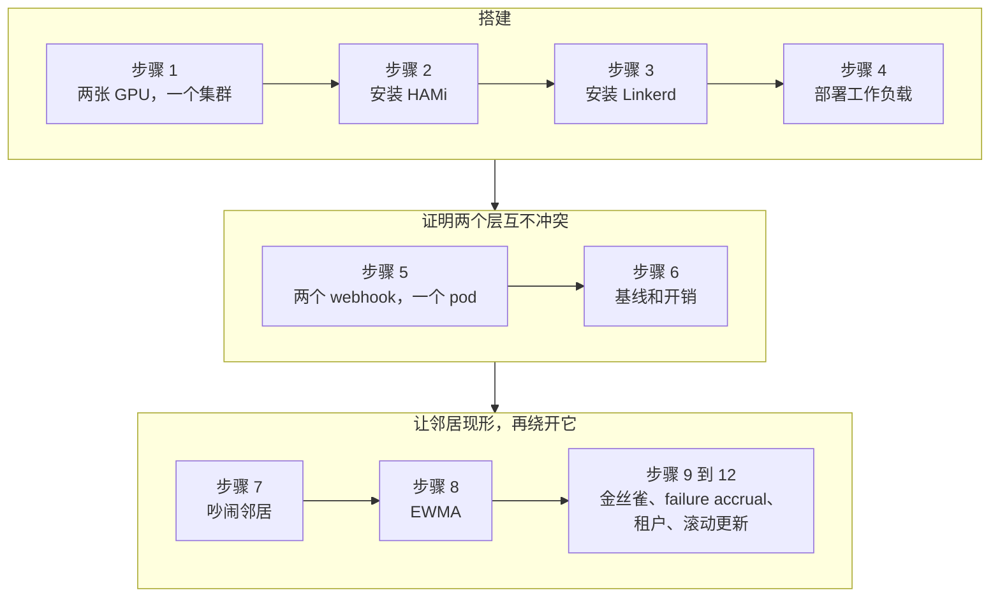
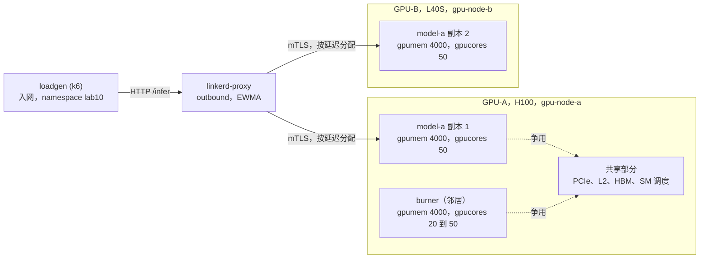
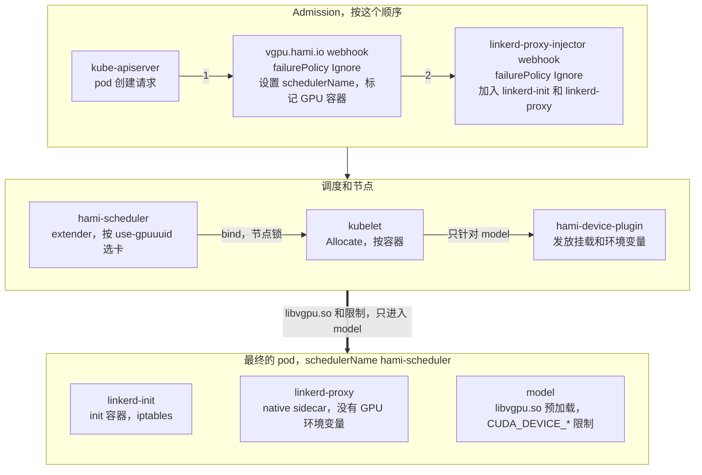

刚看到这个实验标题，你可能会觉得奇怪：HAMi 和 Linkerd 是两个不同层面的系统。HAMi 切分 GPU，Linkerd 路由 HTTP 请求，两者没有任何共用代码。证书又和这些有什么关系？为了弄清楚，我在 Nebius Cloud 上搭了一个有两张 GPU 的集群，测了一整天。本实验就是那天的完整复现步骤。

先说结论。它们确实工作在不同的层，而这正是重点。HAMi 切分 GPU 资源，但它无法隐藏邻居带来的延迟，这也不是它的职责。Linkerd 看不到 GPU，却能看到每个请求的延迟，并据此分配流量。前面提到的证书问题，答案也在这里：Linkerd 给每个 pod 发放 mTLS 身份，正是这个身份阻止了同卡的两个租户访问对方的 endpoint。具体怎么做到的，后面会演示。

本实验中所有命令和输出都来自 2026-09-26/27 的一次真实运行。环境是同一个 K3s 集群里的两台 Nebius 虚拟机：server 节点有一张 H100 80GB，agent 节点有一张 L40S 48GB。软件版本是官方 chart 的 HAMi 2.10.0、Linkerd edge-26.9.3 和 Gateway API CRD v1.5.1。

## 你将学到什么

- HAMi 的显存和算力限制能管住什么，哪些资源仍然是共享的（PCIe、L2、HBM、SM 调度）
- HAMi 和 Linkerd 的 mutating webhook 如何修改同一个 pod，并证明 HAMi-core 只作用于 GPU 容器
- 用对照组测量吵闹邻居对同卡副本的影响，并理解为什么 `gpucores` 消除不了这种影响
- 观察 Linkerd 的 EWMA 负载均衡如何稳住客户端 p99，而未入网的调用方要多付出 2 到 3 倍的延迟
- 在小切片上用 HTTPRoute 权重做金丝雀发布，用 failure accrual 隔离逐请求失败的切片，用 `Server` 和 `AuthorizationPolicy` 做租户隔离
- `CardInsufficientCore` 会悄悄拦住的两种情况：占 100 core 的邻居，以及 Deployment 滚动更新时多出的 surge pod

## 实验概览



## 前提条件

- 同一个 K3s 集群里有两个节点，每个节点一张 NVIDIA GPU。**至少需要 2 张物理 GPU**，这一点不能省。只有一张卡的话，负载均衡没有安静的副本可以切换，步骤 8 就无法演示。
- 两个节点都已安装 NVIDIA 驱动和 container toolkit，主机上 `nvidia-smi` 可以正常运行，节点已打上 `gpu=on` 标签。
- 执行命令的机器上已安装 `kubectl`、`helm` 和 `jq`。`linkerd` 会在步骤 3 安装。
- 清单文件在 [`tutorials/labs/examples/18-hami-linkerd-noisy-neighbor/`](https://github.com/Project-HAMi/website/tree/master/tutorials/labs/examples/18-hami-linkerd-noisy-neighbor)。正文里也完整贴出了所有清单，所以不需要克隆仓库。

| 组件            | 版本                                             |
| --------------- | ------------------------------------------------ |
| Kubernetes      | v1.36.3+k3s1                                     |
| HAMi chart      | 2.10.0，镜像 `projecthami/hami:v2.10.0`          |
| Linkerd         | edge-26.9.3，CLI、控制平面和 Viz                 |
| Gateway API CRD | v1.5.1                                           |
| 工作负载镜像    | `pytorch/pytorch:2.14.0-cuda12.6-cudnn9-runtime` |
| 负载生成器      | `grafana/k6:2.3.0`                               |
| 租户客户端      | `curlimages/curl:8.22.0`                         |

在自己的环境里改动之前，请先对照这张版本表。过几个月实验跑不通，多半是因为版本变了。

:::note[HAMi 隔离了什么，没隔离什么]

一张 H100 的价格是固定的，不管是一个服务只用 80 GB 里的 4 GB，还是十个服务各用 4 GB。[HAMi](https://github.com/Project-HAMi/HAMi) 让你可以在一张卡上跑这十个服务。pod 申请 `nvidia.com/gpu: 1`、`nvidia.com/gpumem: 4000` 和 `nvidia.com/gpucores: 50`。HAMi 的 scheduler extender 会选一张还有足够空间的卡。在节点上，device plugin 通过 `/etc/ld.so.preload` 把 [libvgpu.so](https://github.com/Project-HAMi/HAMi-core) 注入容器。这个库负责限制显存，并把 kernel 的启动频率限制在分配的算力份额内。

但有些资源仍然是共享的：PCIe 链路、L2 缓存、HBM 带宽，以及一个节流窗口内 SM 上的 kernel 调度。另一个切片里的计算密集型邻居，不需要突破自己的任何限制，就能拉高受影响工作负载的 kernel 延迟。这就是本实验要解决的问题：共享损害了服务延迟时，怎么发现它，又怎么应对？

:::

做完之后，你会得到下面 12 项证明的结果。

| # | 要证明的结论 | 本集群上的结果 |
| --- | --- | --- |
| 1 | 两个 webhook 同时修改一个 pod | 同一个 pod 上同时出现 `schedulerName: hami-scheduler`、native sidecar `linkerd-proxy` 和两套 annotation |
| 2 | HAMi-core 只作用于 GPU 容器 | `model` 容器里有 `libvgpu.so` 预加载和 `CUDA_DEVICE_*` 限制，`linkerd-proxy` 里没有 |
| 3 | 加了 sidecar，隔离仍然有效 | 分配 2000 MiB 成功，分配 6000 MiB 报 `OutOfMemoryError`，显存总容量显示为 3.91 GiB |
| 4 | 流量经过代理并使用 mTLS | `linkerd viz edges` 显示 SECURED，`tap` 显示 `tls=true` |
| 5 | 两个副本在不同的物理卡上 | H100 和 L40S 的 UUID 与 `nvidia-smi -L` 一致 |
| 6 | 邻居确实是造成影响的原因 | 邻居在同一张卡上时，副本 1 的 p50 从 1 ms 升到 5 ms，p99 从 8 ms 升到 20 ms；把邻居挪到另一张卡，恢复基线 |
| 7 | EWMA 会把流量转走 | 邻居开启时，入网客户端 p99 为 16 ms，未入网为 25 到 48 ms |
| 8 | 网格开销可以忽略 | 单副本下，p50 为 9.43 ms 对 9.37 ms，p99 为 11.84 ms 对 11.85 ms |
| 9 | 金丝雀权重有效 | 设置 90/10，实测 90.1/9.9；设置 50/50，实测 49.7/50.3 |
| 10 | failure accrual 能把坏切片踢出轮转 | 到达坏 pod 的请求从 1,251 降到 10，成功率从 97.09% 升到 99.98% |
| 11 | 租户隔离在网络层也有效 | tenant-a 得到 403，tenant-b 得到 200，两条边都是 SECURED |
| 12 | 生命周期正常，但有一个陷阱 | 滚动更新耗时 26 秒，旧切片释放后以完全相同的分配重新发放；卡上有邻居时，surge pod 因 `CardInsufficientCore` 一直 Pending |

## 步骤 1 设计环境



图中两个层从不接触。HAMi 给每个切片划定各自的显存上限和算力份额，但卡的底层资源并没有被切开。Linkerd 的代理完全看不到卡，它只能看到两个副本的请求延迟。本实验的所有测量，都是在这张图的基础上解读的。

| 角色 | 节点 | GPU | UUID |
| --- | --- | --- | --- |
| GPU-A，model-a 副本 1 和吵闹邻居 | `gpu-node-a` | NVIDIA H100 80GB HBM3 | `GPU-7023a4c2-4128-840d-2b86-ab87d8bf7f47` |
| GPU-B，model-a 副本 2，安静 | `gpu-node-b` | NVIDIA L40S 48GB | `GPU-4dc50575-f241-9f14-1e6e-ecb4a93c3299` |

我的环境里两张卡型号不同。如果你有两张相同的卡，数据会更干净。如果没有，步骤 7 的对照组可以消除这种不对称带来的影响。

关于命名：本实验里我把节点叫作 `gpu-node-a` 和 `gpu-node-b`。我真实集群里的节点名是云厂商分配的长实例 ID，放在正文里没法读。命令和清单里出现节点名的地方，都要换成你自己的节点名：步骤 1 网络测试里的 `nodeName`，步骤 2 里的 `kubectl get node` 检查和 `scheduler.nodeName`，步骤 3 里 Linkerd 和 Viz 安装命令以及 `metrics-api`、`prometheus` patch 里的 `nodeSelector`，还有步骤 4 里 loadgen 清单的 `nodeSelector`。输出里的 `gpu-node-a` 和 `gpu-node-b` 也请读作你自己的节点名。

在每台主机上查看自己的 UUID。

```bash
nvidia-smi -L
```

```plaintext
GPU 0: NVIDIA H100 80GB HBM3 (UUID: GPU-7023a4c2-4128-840d-2b86-ab87d8bf7f47)
GPU 0: NVIDIA L40S (UUID: GPU-4dc50575-f241-9f14-1e6e-ecb4a93c3299)
```

把这两个 UUID 填进下面清单里每一处 `nvidia.com/use-gpuuuid` annotation。这个 annotation 在 HAMi v2.10.0 的 `pkg/device/nvidia/device.go` 中定义为 `GPUUseUUID`。与它对应的 `nvidia.com/nouse-gpuuuid` 用来排除某张卡。

绑定是否生效，可以从事件里看出来。pod 的调度事件会对另一个节点显示 `CardUuidMismatch`，表示 extender 因为 UUID 不匹配，排除了那张卡。

```plaintext
FilteringFailed   1 nodes CardUuidMismatch(gpu-node-b)
```

不要跳过绑定。chart 默认的节点策略是 `binpack`，GPU 策略是 `spread`，可以在 `helm show values hami-charts/hami --version 2.10.0` 输出的 `scheduler.defaultSchedulerPolicy` 下看到。binpack 会尽量先把已经比较满的节点填满。如果把放置交给策略，两个副本很可能落到同一张卡上，步骤 8 就没有安静的副本可以切换了。所以本实验不依赖策略，而是按名字把每个副本绑定到指定的卡。

我的第二个节点和之前的实验一样，是一个运行在 privileged 容器里的 K3s agent，使用 `--network host`。这只是实验室里的省事做法，生产环境不应该这样用，请直接在主机上安装 agent。机器重启时我遇到了两个问题：主机自己的 K3s server 重新启动并占用了 `127.0.0.1:6444`，inotify 限制也被重置了。两个问题都在主机上修复。

```bash
sudo systemctl stop k3s
echo "fs.inotify.max_user_instances=8192" | sudo tee /etc/sysctl.d/99-k3s-agent.conf
sudo sysctl -p /etc/sysctl.d/99-k3s-agent.conf
sudo docker restart k3s-agent
```

先验证跨节点的 pod 网络，再做其他操作。第二个 GPU 节点上的 pod 能访问控制平面节点上的 pod 吗？

```bash
kubectl run nettest --image=busybox:1.36 --overrides='{"spec":{"nodeName":"gpu-node-b"}}' \
  -- wget -qO- http://<coredns-pod-ip>:8181/ready
```

```plaintext
OK
```

我的集群里有一个之前实验留下的无 GPU 节点，挂在 docker bridge 上。第一次安装 Linkerd 时，`linkerd-identity` 被调度到了这个节点，第二个 GPU 节点上的代理因此拿不到证书。我没有删除这个节点，而是把它 cordon 了。如果你也有这样的节点，进入步骤 3 之前先 cordon 它。

## 步骤 2 安装 HAMi

环境准备好了，接下来安装 HAMi。先做一步清理：如果你在用 GPU Operator，必须关掉它自带的 device plugin。我一开始跳过了这一步，结果两个 plugin 把同一张卡注册了两次，之后的所有数字都不可信。在两个 GPU 节点上打下面的标签即可。

```bash
kubectl label node <gpu-node> nvidia.com/gpu.deploy.device-plugin=false --overwrite
```

接下来是正式安装。在别的环境里，直接安装 chart 就行，只需两行命令。但在 K3s 上，有三个值必须改成非默认值（另见 [K3s 安装指南](https://project-hami.io/zh/docs/installation/k3s-installation)）。这三个都是我踩坑后才发现的，写在这里是为了让你少走弯路。

```bash
helm repo add hami-charts https://project-hami.github.io/HAMi/ && helm repo update
helm upgrade --install hami hami-charts/hami --version 2.10.0 -n kube-system \
  --set scheduler.nodeName=gpu-node-a \
  --set scheduler.kubeScheduler.image.registry=registry.k8s.io \
  --set scheduler.kubeScheduler.image.repository=kube-scheduler \
  --set scheduler.kubeScheduler.image.tag=v1.36.3 \
  --set devicePlugin.runtimeClassName=nvidia
```

这部分在其他教程里有专门讲解，网站上也有安装路线图，这里简单过一遍。`scheduler.nodeName` 把 extender 固定在控制平面节点上，因为 API server 访问不到 agent 节点上的 webhook，这一点我们在步骤 1 已经遇到过。kube-scheduler 的 tag 必须和你的集群版本一致。chart 默认使用一个 tag 为空的阿里云镜像，这种情况下它不知道你的集群版本。第三个是 `devicePlugin.runtimeClassName=nvidia`，这个问题花了我一个小时。K3s 的 containerd 默认使用 `runc`，没有 RuntimeClass，plugin 就找不到 NVML，会反复报下面的错误。

```plaintext
E0925 19:53:51.423171 factory.go:135] Incompatible strategy detected auto
E0925 19:53:51.428513 main.go:201] error starting plugins: ... invalid device discovery strategy
E0925 19:53:51.599960 main.go:128] Received error: failed to initialize NVML: ERROR_LIBRARY_NOT_FOUND
```

看到这个错误，我先怀疑驱动，再检查 kubelet，还考虑过重装 toolkit，最后发现只是 chart 里的一个参数。这个参数还有一个好处：HAMi 的 webhook 现在会给每个 GPU pod 加上 `runtimeClassName: nvidia`，而 K3s 上的 GPU 工作负载本来就需要它。安装完成后，确认两张卡都以 `hami-core` 模式注册。

```bash
kubectl get node gpu-node-b -o jsonpath='{.metadata.annotations.hami\.io/node-nvidia-register}'
```

```plaintext
[{"id":"GPU-4dc50575-f241-9f14-1e6e-ecb4a93c3299","count":10,"devmem":46068,"devcore":100,"type":"NVIDIA L40S","mode":"hami-core","health":true}]
```

```bash
kubectl get nodes -o custom-columns='NODE:.metadata.name,GPU:.status.allocatable.nvidia\.com/gpu'
```

两个 GPU 节点上都应该看到 10。注意，这个 10 不是卡的数量，而是槽位数。`deviceSplitCount: 10` 是默认值，表示每张物理卡最多可以被 10 个 pod 共享。申请 `nvidia.com/gpu: 1` 的 pod 占一个槽位，它实际能用多少卡资源，由 `gpumem` 和 `gpucores` 决定。步骤 7 会看到，槽位还没用完，卡可能就已经满了。我自己也在那里又踩了一次这个坑。

## 步骤 3 安装 Gateway API 和 Linkerd

HAMi 已经运行，接下来安装服务网格。安装 Linkerd 之前有一个前提：必须先装好 Gateway API 的 CRD，而且对版本要求很严。我查了[兼容性表](https://linkerd.io/2-edge/features/gateway-api/)，对 Linkerd 2.20 最高支持到 1.5.1。我用的 edge 版本比 2.20 新，但表还没有更新，所以保守地选了 1.5.1。

```bash
kubectl apply -f https://github.com/kubernetes-sigs/gateway-api/releases/download/v1.5.1/standard-install.yaml
```

CRD 就绪后，安装 Linkerd 本身。出于和步骤 1 相同的原因，我把控制平面固定在控制平面节点上。第一次安装时我没这么做，identity 服务被调度到了那个访问不到的旧节点上，代理拿不到证书，injector 一直起不来，白白花了半小时。

先把安装脚本下载下来读一遍，再交给 `sh` 执行，是个好习惯，我也是这么做的。下面这一行和 Linkerd 官方文档完全一样，我原样保留。

```bash
curl --proto '=https' --tlsv1.2 -sSfL https://run.linkerd.io/install-edge | sh
export PATH=$HOME/.linkerd2/bin:$PATH
linkerd check --pre
linkerd install --crds | kubectl apply -f -
linkerd install --set "nodeSelector.kubernetes\.io/hostname=gpu-node-a" | kubectl apply -f -
linkerd check
linkerd viz install --set "nodeSelector.kubernetes\.io/hostname=gpu-node-a" | kubectl apply -f -
```

这里出现了一个我没预料到的情况：Viz chart 把 `nodeSelector` 应用到了 `web`、`tap` 和 `tap-injector`，却没有应用到 `metrics-api` 和 `prometheus`。我没有时间深究原因，直接手动 patch 了这两个 Deployment 就继续了。你可能也会遇到同样的情况。

```bash
for d in metrics-api prometheus; do
  kubectl patch deploy -n linkerd-viz $d -p '{"spec":{"template":{"spec":{"nodeSelector":{"kubernetes.io/hostname":"gpu-node-a"}}}}}'
done
```

继续之前，先确认两边都已正常运行，因为后面的所有步骤都依赖它们。

```bash
linkerd check
```

```plaintext
Status check results are √
```

```bash
kubectl get pods -n kube-system -l app.kubernetes.io/name=hami -o wide
```

```plaintext
hami-device-plugin-cm87j          2/2   Running   gpu-node-b
hami-device-plugin-t4kjv          2/2   Running   gpu-node-a
hami-scheduler-7dcb498cc8-cqg9v   2/2   Running   gpu-node-a
```

:::warning[让 HAMi 的命名空间留在网格之外]

这里有一个警告，以后可能让你吃亏。HAMi 运行在 `kube-system` 里是没问题的，因为 Linkerd 的 injector 已经用自己的 selector 把这个命名空间排除了。但如果你把 HAMi 装在别的命名空间，请给那个命名空间打上 `config.linkerd.io/admission-webhooks=disabled` 标签。HAMi 的 webhook 服务由 API server 调用，而 API server 不在网格里。中间多一层代理，webhook 调用可能会失败。

:::

## 步骤 4 部署工作负载

基础设施准备好了，现在需要跑点东西。我故意选了一个很简单的工作负载，因为要测的不是模型，而是模型周围的系统。它是 FastAPI 背后的一个固定大小的 PyTorch 矩阵乘法：每个请求让一个 512 行的 fp16 batch 通过 8192 乘 8192 的权重矩阵 8 次，然后调用 `torch.cuda.synchronize()` 并返回。启动时预热 20 轮。不下载模型，没有 tokenizer，也没有流式输出。原因是：如果用 LLM 服务，Linkerd 测到的延迟是到流结束的时间，而不是首 token 时间，这对本实验没有意义。要做可重复的测量，必须用非流式的 endpoint。应用还在 `/stats` 下为每个 pod 维护一个请求计数器。这是我后来加的，因为容器日志在 1000 rps 下会滚动，`kubectl logs | grep -c` 会少数。第一次尝试时，我发出了 65,563 个请求，却只数到 18,747 个，找了很久才明白原因。

关于镜像，还有两个小提示，都是第一次尝试时遇到的。一是 `pip install` 需要加 `--break-system-packages`，因为镜像里的 Python 受 PEP 668 管理，不允许修改系统包。二是 L40S 容器的 PATH 里没有 `nvidia-smi`，所以从这里开始，每次检查都改用一次真实的 CUDA 分配来代替它。后来我发现，这样反而是更有力的证据。

关于放置：一个 Service 后面放两个 Deployment，每个绑定到自己的卡。一个 Deployment 两个副本看起来更自然，但那样没法给两个副本指定不同的 UUID，所以用两个 Deployment。

<details>
<summary>00-namespaces.yaml</summary>

```yaml
apiVersion: v1
kind: Namespace
metadata:
  name: lab10
  annotations:
    linkerd.io/inject: enabled
---
apiVersion: v1
kind: Namespace
metadata:
  name: lab10-unmeshed
```

</details>

<details>
<summary>10-model-a.yaml</summary>

```yaml
# model-a, two Deployments behind one Service, each pinned to its card
apiVersion: v1
kind: ConfigMap
metadata:
  name: model-a-app
  namespace: lab10
data:
  app.py: |
    import os, time, torch
    from fastapi import FastAPI
    N = int(os.environ.get("N", "8192"))
    BATCH = int(os.environ.get("BATCH", "512"))
    ITERS = int(os.environ.get("ITERS", "8"))
    EXTRA_MIB = int(os.environ.get("EXTRA_MIB", "0"))  # scenario 5
    app = FastAPI()
    SERVED = {"infer": 0}  # per-pod request counter
    W = torch.randn(N, N, device="cuda", dtype=torch.float16)
    X = torch.randn(BATCH, N, device="cuda", dtype=torch.float16)
    def step():
        y = X
        for _ in range(ITERS):
            y = (y @ W) * 1e-3
        torch.cuda.synchronize()
        return float(y[0, 0])
    for _ in range(20):
        step()  # warm-up
    @app.get("/healthz")
    def healthz():
        return {"ok": True, "gpu": torch.cuda.get_device_name(0)}
    @app.get("/stats")
    def stats():
        return {"pod": os.environ.get("HOSTNAME"), "served": SERVED["infer"]}
    @app.get("/infer")
    def infer():
        SERVED["infer"] += 1
        t0 = time.perf_counter()
        scratch = torch.empty(EXTRA_MIB * 1024 * 1024 // 2, dtype=torch.float16, device="cuda") if EXTRA_MIB else None
        v = step()
        del scratch
        return {"gpu_ms": round((time.perf_counter() - t0) * 1000, 3), "v": v, "pod": os.environ.get("HOSTNAME")}
---
apiVersion: v1
kind: Service
metadata:
  name: model-a
  namespace: lab10
spec:
  selector:
    app: model-a
  ports:
    - name: http
      port: 8000
      targetPort: 8000
---
apiVersion: apps/v1
kind: Deployment
metadata:
  name: model-a-gpu-a
  namespace: lab10
spec:
  replicas: 1
  selector:
    matchLabels: { app: model-a, gpu: a }
  template:
    metadata:
      labels: { app: model-a, gpu: a }
      annotations:
        nvidia.com/use-gpuuuid: "GPU-7023a4c2-4128-840d-2b86-ab87d8bf7f47"
    spec:
      containers:
        - name: model
          image: pytorch/pytorch:2.14.0-cuda12.6-cudnn9-runtime
          command:
            [
              "sh",
              "-c",
              "pip install -q --break-system-packages fastapi uvicorn && cd /app && exec uvicorn app:app --host 0.0.0.0 --port 8000",
            ]
          ports: [{ containerPort: 8000, name: http }]
          volumeMounts: [{ name: app, mountPath: /app }]
          resources:
            limits:
              nvidia.com/gpu: 1
              nvidia.com/gpumem: 4000
              nvidia.com/gpucores: 50
          startupProbe:
            httpGet: { path: /healthz, port: 8000 }
            periodSeconds: 5
            failureThreshold: 120
          readinessProbe:
            httpGet: { path: /healthz, port: 8000 }
            periodSeconds: 5
      volumes:
        - name: app
          configMap: { name: model-a-app }
---
apiVersion: apps/v1
kind: Deployment
metadata:
  name: model-a-gpu-b
  namespace: lab10
spec:
  replicas: 1
  selector:
    matchLabels: { app: model-a, gpu: b }
  template:
    metadata:
      labels: { app: model-a, gpu: b }
      annotations:
        nvidia.com/use-gpuuuid: "GPU-4dc50575-f241-9f14-1e6e-ecb4a93c3299"
    spec:
      containers:
        - name: model
          image: pytorch/pytorch:2.14.0-cuda12.6-cudnn9-runtime
          command:
            [
              "sh",
              "-c",
              "pip install -q --break-system-packages fastapi uvicorn && cd /app && exec uvicorn app:app --host 0.0.0.0 --port 8000",
            ]
          ports: [{ containerPort: 8000, name: http }]
          volumeMounts: [{ name: app, mountPath: /app }]
          resources:
            limits:
              nvidia.com/gpu: 1
              nvidia.com/gpumem: 4000
              nvidia.com/gpucores: 50
          startupProbe:
            httpGet: { path: /healthz, port: 8000 }
            periodSeconds: 5
            failureThreshold: 120
          readinessProbe:
            httpGet: { path: /healthz, port: 8000 }
            periodSeconds: 5
      volumes:
        - name: app
          configMap: { name: model-a-app }
```

</details>

故事里的“反派”，也就是吵闹邻居，在下面的清单里。它在 GPU-A 上自己的切片里，对一个 8192 乘 8192 的 fp16 矩阵无限循环执行 `a = a @ a`。`burner-b` 是同样的负载，绑定到 GPU-B，作为对照组。两者一开始都是 0 个副本，需要时再启动。

<details>
<summary>20-burner.yaml</summary>

```yaml
# noisy neighbor, burner on GPU-A, burner-b on GPU-B as the control group
apiVersion: v1
kind: ConfigMap
metadata:
  name: burner-app
  namespace: lab10
data:
  burn.py: |
    import torch
    a = torch.randn(8192, 8192, device="cuda", dtype=torch.float16)
    while True:
        a = (a @ a) * 1e-4
---
apiVersion: apps/v1
kind: Deployment
metadata:
  name: burner
  namespace: lab10
spec:
  replicas: 0
  selector:
    matchLabels: { app: burner }
  template:
    metadata:
      labels: { app: burner }
      annotations:
        linkerd.io/inject: disabled
        nvidia.com/use-gpuuuid: "GPU-7023a4c2-4128-840d-2b86-ab87d8bf7f47"
    spec:
      containers:
        - name: burner
          image: pytorch/pytorch:2.14.0-cuda12.6-cudnn9-runtime
          command: ["python", "/app/burn.py"]
          volumeMounts: [{ name: app, mountPath: /app }]
          resources:
            limits:
              nvidia.com/gpu: 1
              nvidia.com/gpumem: 4000
              nvidia.com/gpucores: 50
      volumes:
        - name: app
          configMap: { name: burner-app }
---
apiVersion: apps/v1
kind: Deployment
metadata:
  name: burner-b
  namespace: lab10
spec:
  replicas: 0
  selector:
    matchLabels: { app: burner-b }
  template:
    metadata:
      labels: { app: burner-b }
      annotations:
        linkerd.io/inject: disabled
        nvidia.com/use-gpuuuid: "GPU-4dc50575-f241-9f14-1e6e-ecb4a93c3299"
    spec:
      containers:
        - name: burner-b
          image: pytorch/pytorch:2.14.0-cuda12.6-cudnn9-runtime
          command: ["python", "/app/burn.py"]
          volumeMounts: [{ name: app, mountPath: /app }]
          resources:
            limits:
              nvidia.com/gpu: 1
              nvidia.com/gpumem: 4000
              nvidia.com/gpucores: 50
      volumes:
        - name: app
          configMap: { name: burner-app }
```

</details>

然后是负载生成器 k6，共两份。为什么要两份，是本实验最关键的一点，到步骤 8 就清楚了。现在只需知道：一份在 `lab10` 命名空间里并且入网，另一份在 `lab10-unmeshed` 里不入网。两者调用同一个地址 `model-a.lab10.svc.cluster.local:8000/infer`。脚本里的 `REUSE=false` 让每个请求都新建一条连接，这样 kube-proxy 按连接分发的效果就和轮询一样。

<details>
<summary>30-loadgen.yaml</summary>

```yaml
# k6 load generators, one meshed and one not
apiVersion: v1
kind: ConfigMap
metadata:
  name: loadgen-script
  namespace: lab10
data:
  load.js: |
    import http from 'k6/http';
    import { check } from 'k6';
    export const options = {
      vus: Number(__ENV.VUS || 8),
      duration: __ENV.DURATION || '60s',
      noConnectionReuse: (__ENV.REUSE || 'true') !== 'true',
      summaryTrendStats: ['avg', 'p(50)', 'p(90)', 'p(99)', 'max'],
    };
    export default function () {
      const r = http.get('http://model-a.lab10.svc.cluster.local:8000/infer');
      check(r, { 'status 200': (res) => res.status === 200 });
    }
---
apiVersion: v1
kind: ConfigMap
metadata:
  name: loadgen-script
  namespace: lab10-unmeshed
data:
  load.js: |
    import http from 'k6/http';
    import { check } from 'k6';
    export const options = {
      vus: Number(__ENV.VUS || 8),
      duration: __ENV.DURATION || '60s',
      noConnectionReuse: (__ENV.REUSE || 'true') !== 'true',
      summaryTrendStats: ['avg', 'p(50)', 'p(90)', 'p(99)', 'max'],
    };
    export default function () {
      const r = http.get('http://model-a.lab10.svc.cluster.local:8000/infer');
      check(r, { 'status 200': (res) => res.status === 200 });
    }
---
apiVersion: apps/v1
kind: Deployment
metadata:
  name: loadgen
  namespace: lab10
spec:
  replicas: 1
  selector:
    matchLabels: { app: loadgen }
  template:
    metadata:
      labels: { app: loadgen }
    spec:
      nodeSelector: { kubernetes.io/hostname: gpu-node-a }
      containers:
        - name: k6
          image: grafana/k6:2.3.0
          command: ["sleep", "infinity"]
          volumeMounts: [{ name: scripts, mountPath: /scripts }]
      volumes:
        - name: scripts
          configMap: { name: loadgen-script }
---
apiVersion: apps/v1
kind: Deployment
metadata:
  name: loadgen
  namespace: lab10-unmeshed
spec:
  replicas: 1
  selector:
    matchLabels: { app: loadgen }
  template:
    metadata:
      labels: { app: loadgen }
    spec:
      nodeSelector: { kubernetes.io/hostname: gpu-node-a }
      containers:
        - name: k6
          image: grafana/k6:2.3.0
          command: ["sleep", "infinity"]
          volumeMounts: [{ name: scripts, mountPath: /scripts }]
      volumes:
        - name: scripts
          configMap: { name: loadgen-script }
```

</details>

把上面四份清单按文件名保存到同一个目录，并在这个目录里运行命令。如果你克隆了网站仓库，前提条件里提到的 examples 目录已经包含这些文件。

```bash
kubectl apply -f 00-namespaces.yaml -f 10-model-a.yaml -f 20-burner.yaml -f 30-loadgen.yaml
kubectl get pods -n lab10 -o wide
```

```plaintext
loadgen-79fd95d599-ldp96         2/2   Running   10.42.0.119   gpu-node-a
model-a-gpu-a-7877c85fb-wglk8    2/2   Running   10.42.0.122   gpu-node-a
model-a-gpu-b-5d845c65fd-kcmpv   2/2   Running   10.42.12.44   gpu-node-b
```

三个都起来了。Service 每次只会把请求发给一个后端，所以我们用 pod IP 分别访问每个副本，这样每张卡各得到一个响应，看看每张卡的速度。

```bash
for g in a b; do
  IP=$(kubectl get pod -n lab10 -l app=model-a,gpu=$g -o jsonpath='{.items[0].status.podIP}')
  kubectl exec -n lab10 deploy/loadgen -c k6 -- wget -qO- "http://$IP:8000/infer"
done
```

```plaintext
{"gpu_ms":1.68,"v":-0.0,"pod":"model-a-gpu-a-7877c85fb-wglk8"}
{"gpu_ms":3.418,"v":0.0,"pod":"model-a-gpu-b-5d845c65fd-kcmpv"}
```

H100 完成一步用时 1.7 ms，L40S 用时 3.4 ms，都是 50 core。请记住这两个数，后面每张表都要以它们为参照。

再提示一点：下面的命令假设 `kubectl` 和 `linkerd` 在 PATH 里。如果你用的是 K3s，请用 `sudo k3s kubectl` 代替 `kubectl`。如果 CLI 装在 home 目录下，请用 `$HOME/.linkerd2/bin/linkerd` 代替 `linkerd`。我就是这样做的。

## 步骤 5 证明两个 webhook 作用于同一个 pod

现在进入实验的核心，这部分以前没人写过。在带有 `linkerd.io/inject: enabled` 标签的命名空间里创建一个申请 GPU 的 pod，它会被两个独立的 [mutating admission webhook](https://kubernetes.io/docs/reference/access-authn-authz/extensible-admission-controllers/) 修改。我想知道它们会不会互相破坏。



顺序很重要。HAMi 的 webhook 先执行：修改 `schedulerName`，并标记申请了 GPU 的容器。Linkerd 的 webhook 随后执行：加入它自己的两个容器。选卡在调度器里完成，挂载和环境变量则在节点上按容器发放。最后一点正是代理永远拿不到 GPU 份额的原因，下面会证明。先不看图，看看集群上实际是什么样。

```bash
kubectl get mutatingwebhookconfigurations -o json | jq -r '.items[].webhooks[] | "\(.name) failurePolicy=\(.failurePolicy) reinvocation=\(.reinvocationPolicy // "Never")"'
```

```plaintext
vgpu.hami.io                          failurePolicy=Ignore  reinvocation=Never
linkerd-proxy-injector.linkerd.io     failurePolicy=Ignore  reinvocation=Never
tap-injector.linkerd.io               failurePolicy=Ignore  reinvocation=IfNeeded
```

两个都是 `Ignore`，这一点值得注意。如果 HAMi 的 webhook 在 admission 时不可达，pod 会用默认调度器创建。kube-scheduler 会把 `nvidia.com/gpu: 1` 当作一整个设备，pod 要么一直 Pending，要么占走整张卡，而且没有任何提示。如果 Linkerd 的不可达，pod 会以未入网的状态启动，网格指标里就会出现一个空洞。两者的 `reinvocationPolicy` 都是 `Never`，实际上也不需要重复调用：HAMi 只修改申请了 GPU 的容器和调度器名称，Linkerd 只添加自己的容器，两者不会改到对方的字段。尽管如此，failurePolicy 应该是一个有意识的选择，不要直接用默认值。

**证明 1。** 现在来回答真正的问题：两个 webhook 真的作用于同一个 pod 吗？

```bash
for p in $(kubectl get pods -n lab10 -l app=model-a -o name); do
  echo "== $p"
  kubectl get -n lab10 $p -o json | jq -r '"  schedulerName: \(.spec.schedulerName) | runtimeClassName: \(.spec.runtimeClassName)\n  initContainers: \([.spec.initContainers[]?.name]) | containers: \([.spec.containers[].name])\n  hami.io/vgpu-devices-allocated: \(.metadata.annotations["hami.io/vgpu-devices-allocated"])\n  linkerd.io/proxy-version: \(.metadata.annotations["linkerd.io/proxy-version"]) | created-by: \(.metadata.annotations["linkerd.io/created-by"])"'
done
```

```plaintext
== pod/model-a-gpu-a-7877c85fb-wglk8
  schedulerName: hami-scheduler | runtimeClassName: nvidia
  initContainers: ["linkerd-init","linkerd-proxy"] | containers: ["model"]
  hami.io/vgpu-devices-allocated: GPU-7023a4c2-4128-840d-2b86-ab87d8bf7f47,NVIDIA,4000,50:;
  linkerd.io/proxy-version: edge-26.9.3 | created-by: linkerd/proxy-injector edge-26.9.3
== pod/model-a-gpu-b-5d845c65fd-kcmpv
  schedulerName: hami-scheduler | runtimeClassName: nvidia
  initContainers: ["linkerd-init","linkerd-proxy"] | containers: ["model"]
  hami.io/vgpu-devices-allocated: GPU-4dc50575-f241-9f14-1e6e-ecb4a93c3299,NVIDIA,4000,50:;
  linkerd.io/proxy-version: edge-26.9.3 | created-by: linkerd/proxy-injector edge-26.9.3
```

答案是肯定的。不过输出里有个细节让我意外：`linkerd-proxy` 在 `initContainers` 下面。我第一次看到时以为出了问题，其实没有。edge-26.9.3 是以 `proxy.nativeSidecar: true` 安装的，可以从 `linkerd-config` ConfigMap 里读到这个设置。代理现在是一个 Kubernetes [native sidecar](https://kubernetes.io/docs/concepts/workloads/pods/sidecar-containers/)，也就是带 `restartPolicy: Always` 的 init 容器（见 [Linkerd 官方页面](https://linkerd.io/2-edge/features/native-sidecars/)）。负责设置 iptables 的 `linkerd-init`，在两种模式下都是普通的 init 容器。

**证明 2。** 第二个问题更隐蔽：HAMi 的预加载会不会漏进错误的容器？我预期 HAMi-core 只出现在有 GPU 的容器里，但预期不等于证明。

```bash
kubectl exec -n lab10 deploy/model-a-gpu-a -c model -- sh -c 'env | grep -E "^(CUDA_DEVICE_SM_LIMIT|CUDA_DEVICE_MEMORY_LIMIT_0|NVIDIA_VISIBLE_DEVICES)"; echo "ld.so.preload: $(cat /etc/ld.so.preload)"'
kubectl get pods -n lab10 -l app=model-a -o json | jq -r '.items[] | .spec.initContainers[]?, .spec.containers[] | select(.name=="linkerd-proxy") | "linkerd-proxy gpu env: \([.env[]?.name | select(startswith("CUDA_") or startswith("NVIDIA_"))]) | gpu limits: \(.resources.limits // {} | with_entries(select(.key | contains("nvidia"))))"'
```

```plaintext
CUDA_DEVICE_SM_LIMIT=50
CUDA_DEVICE_MEMORY_LIMIT_0=4000m
NVIDIA_VISIBLE_DEVICES=GPU-7023a4c2-4128-840d-2b86-ab87d8bf7f47
ld.so.preload: /usr/local/vgpu/libvgpu.so
linkerd-proxy gpu env: [] | gpu limits: {}
linkerd-proxy gpu env: [] | gpu limits: {}
```

model 容器这边和预期完全一致。代理这边更难查，因为它的镜像是 distroless，没法 exec 进去。试了一会儿之后，我决定直接在节点上问 containerd。

```bash
crictl inspect $(crictl ps -a --name linkerd-proxy -q | head -1) | jq '.info.runtimeSpec | {env: [.process.env[] | select(startswith("CUDA_") or startswith("NVIDIA_") or startswith("LD_PRELOAD"))], mounts: [.mounts[].destination | select(contains("vgpu") or contains("ld.so.preload"))]}'
```

```plaintext
{
  "env": [],
  "mounts": []
}
```

没有限制，很好。也没有预加载和设备。原因很简单：HAMi 的 device plugin 按容器响应 kubelet 的 `Allocate` 调用，只有申请了 `nvidia.com/gpu` 的容器才会拿到挂载。代理没有申请 GPU，所以什么都拿不到。

**证明 3。** 还有最重要的问题：有 sidecar 在旁边时，显存限制还有效吗？我认为这是本实验最重要的证明，因为如果它不成立，后面的一切都没有意义。`nvidia-smi` 回答不了这个问题，只有一次真实的分配才可以。切片是 4000 MiB，我分别试了 2000 MiB 和 6000 MiB。

```bash
for p in $(kubectl get pods -n lab10 -l app=model-a -o name); do
  echo "== $p"
  kubectl exec -n lab10 $p -c model -- python -c '
import torch
def alloc(mib):
    try:
        x=torch.empty(mib*1024*1024//2, dtype=torch.float16, device="cuda"); torch.cuda.synchronize(); print(f"  alloc {mib} MiB: ok"); del x
    except Exception as e: print(f"  alloc {mib} MiB: FAILED {type(e).__name__}: {str(e)[:100]}")
alloc(2000); alloc(6000)' 2>&1 | grep -vE "HAMI-core|CUDACachingAllocator"
done
```

```plaintext
== pod/model-a-gpu-a-7877c85fb-wglk8
  alloc 2000 MiB: ok
  alloc 6000 MiB: FAILED OutOfMemoryError: CUDA out of memory. Tried to allocate 5.86 GiB. GPU 0 has a total capacity of 3.91 GiB
== pod/model-a-gpu-b-5d845c65fd-kcmpv
  alloc 2000 MiB: ok
  alloc 6000 MiB: FAILED OutOfMemoryError: CUDA out of memory. Tried to allocate 5.86 GiB. GPU 0 has a total capacity of 3.91 GiB
```

有效！PyTorch 在 80 GB 的卡和 48 GB 的卡上看到的都是 3.91 GiB。这是 `libvgpu.so` 对 `cuMemGetInfo` 的回答，pod 里的代理完全没有改变它。看到这个结果后，我对后面的部分放心多了。

**关闭 native sidecar。** 这里我还有一个疑问：native sidecar 相对较新，不是所有人都在用，旧模式下结果也一样吗？很容易验证。创建同样的 pod，并加上 annotation `config.linkerd.io/proxy-enable-native-sidecar`，值设为 `"false"`。

```plaintext
initContainers: ['linkerd-init'] containers: ['linkerd-proxy', 'model'] schedulerName: hami-scheduler
allocated: GPU-7023a4c2-4128-840d-2b86-ab87d8bf7f47,NVIDIA,4000,20:; proxy: edge-26.9.3
CUDA_DEVICE_SM_LIMIT=20
CUDA_DEVICE_MEMORY_LIMIT_0=4000m
/usr/local/vgpu/libvgpu.so
alloc 2000 MiB ok, total 4000 MiB
```

代理移到了 `containers` 列表里，HAMi 的分配和限制完全不变，所以对 HAMi 没有区别。对 Linkerd 有一点区别：用旧式 sidecar 时，model 容器可能在代理就绪之前启动，最初的请求可能绕过网格。native sidecar 修正了这个启动顺序，这也是它成为默认值的原因。

**证明 5。** 结束这一节之前，我还想记录一件事：两个副本真的在不同的卡上吗？整个实验都建立在这个假设上，所以我不想只是假设。

```bash
kubectl get pods -n lab10 -l app=model-a -o custom-columns='POD:.metadata.name,NODE:.spec.nodeName,ALLOCATED:.metadata.annotations.hami\.io/vgpu-devices-allocated'
```

```plaintext
POD                              NODE         ALLOCATED
model-a-gpu-a-7877c85fb-wglk8    gpu-node-a   GPU-7023a4c2-4128-840d-2b86-ab87d8bf7f47,NVIDIA,4000,50:;
model-a-gpu-b-5d845c65fd-kcmpv   gpu-node-b   GPU-4dc50575-f241-9f14-1e6e-ecb4a93c3299,NVIDIA,4000,50:;
```

这些 UUID 和步骤 1 里 `nvidia-smi -L` 的结果一致，确认无误。

最后还有一个细节。它没有发生在我身上，但可能发生在你身上：sidecar 有自己的资源请求，代理默认申请 `100m` CPU 和 `20Mi` 内存。HAMi 的 extender 只看 GPU 请求，而 kube-scheduler 会为整个 pod（包括代理）计算 CPU 和内存。在 16 vCPU 的节点上你不会注意到。但如果节点的 CPU 已经很满，让 pod 一直 Pending 的会是代理的请求，而不是 GPU，事件也来自 kube-scheduler，而不是 HAMi。不知道这一点，就会找错方向。

## 步骤 6 测量基线和开销

证明阶段结束，现在开始测量。首先需要一个一切平静的参照，否则后面的表没有可比较的对象。我用入网的负载生成器开了 8 个虚拟用户，通过 keep-alive 连接压测 60 秒，邻居保持关闭。k6 给出客户端看到的结果，`linkerd viz stat` 给出每个副本自己看到的结果。每次测量我都会把这两个视角放在一起，因为它们有时反映的情况并不一样。

```bash
kubectl exec -n lab10 deploy/loadgen -c k6 -- k6 run -e VUS=8 -e DURATION=60s /scripts/load.js
```

```plaintext
checks_succeeded...: 100.00% 64583 out of 64583
http_req_duration..: avg=7.37ms p(50)=6.11ms p(90)=11.51ms p(99)=15.22ms max=23.85ms
http_reqs..........: 64583  1076.2/s
```

```bash
linkerd viz stat -n lab10 pod -t 60s
```

```plaintext
NAME                             MESHED  SUCCESS      RPS  LATENCY_P50  LATENCY_P95  LATENCY_P99
model-a-gpu-a-7985f45795-nfhnw      1/1  100.00%  780.5rps          5ms          9ms         10ms
model-a-gpu-b-55558c94f5-8wcgw      1/1  100.00%  273.6rps          8ms         13ms         19ms
```

按 `/stats` 计数器，gpu-a 收到 48,196 个请求，gpu-b 收到 16,387 个。我第一次看到时怀疑是不是哪里坏了，分布怎么这么不均匀？后来才明白：即使一切正常，EWMA 也会把大约四分之三的流量送到更快的那张卡，这本来就是它的工作。读步骤 8 时请记住这一点，那里的流量转移是叠加在这个分布之上的。

**证明 4。** 流量正在跑，我顺便确认它是否真的经过了代理并使用了 mTLS。

```bash
kubectl exec -n lab10 deploy/loadgen -c k6 -- k6 run --quiet -e VUS=4 -e DURATION=10s /scripts/load.js >/dev/null
linkerd viz edges -n lab10 po
timeout 6 linkerd viz tap -n lab10 deploy/model-a-gpu-a | head -3 &
kubectl exec -n lab10 deploy/loadgen -c k6 -- k6 run --quiet -e VUS=4 -e DURATION=8s /scripts/load.js >/dev/null; wait
```

```plaintext
SRC                        DST                              SRC_NS  DST_NS  SECURED
loadgen-79fd95d599-ldp96   model-a-gpu-a-7877c85fb-wglk8    lab10   lab10   √
loadgen-79fd95d599-ldp96   model-a-gpu-b-5d845c65fd-kcmpv   lab10   lab10   √
req id=0:0 proxy=in  src=10.42.0.119:50584 dst=10.42.0.122:8000 tls=true :method=GET :authority=model-a.lab10.svc.cluster.local:8000 :path=/infer
```

**证明 8。** 现在到了每个人都会问的问题：代理有多大开销？不回答这个，没人会继续往下读。为此，我只保留一个副本，关掉邻居，然后用相同的参数压测，先用入网的生成器，再用未入网的。

```bash
kubectl scale deploy -n lab10 model-a-gpu-b burner burner-b --replicas=0
kubectl wait --for=delete pod -n lab10 -l app=model-a,gpu=b --timeout=120s
kubectl exec -n lab10 deploy/loadgen -c k6 -- k6 run -e VUS=8 -e DURATION=60s /scripts/load.js
kubectl exec -n lab10-unmeshed deploy/loadgen -c k6 -- k6 run -e VUS=8 -e DURATION=60s /scripts/load.js
kubectl exec -n lab10 deploy/loadgen -c k6 -- k6 run -e VUS=1 -e DURATION=30s /scripts/load.js
kubectl exec -n lab10-unmeshed deploy/loadgen -c k6 -- k6 run -e VUS=1 -e DURATION=30s /scripts/load.js
kubectl scale deploy -n lab10 model-a-gpu-b --replicas=1 && kubectl rollout status -n lab10 deploy/model-a-gpu-b
```

| 调用方         | 请求数 | RPS | p50     | p90      | p99      |
| -------------- | ------ | --- | ------- | -------- | -------- |
| 入网，8 用户   | 50,241 | 837 | 9.43 ms | 10.62 ms | 11.84 ms |
| 不入网，8 用户 | 50,600 | 843 | 9.37 ms | 10.57 ms | 11.85 ms |
| 入网，1 用户   | 18,773 | 626 | 1.51 ms |          | 1.99 ms  |
| 不入网，1 用户 | 21,255 | 708 | 1.34 ms |          | 1.75 ms  |

8 个并发客户端时，代理在 p50 上只增加了 0.06 ms，p99 上没有增加。我把两行数据对比了好几遍，差别确实在测量噪声范围内。单个客户端时，一个请求的端到端耗时是 1.4 ms，其中代理占 0.17 ms，吞吐量下降 11%。这个数字看起来不小，但对比一个每个 token 要几十毫秒的真实模型，它就是噪声。

## 步骤 7 让邻居现形

有了参照，现在放入邻居。邻居放在 GPU-A 上，紧挨着副本 1。为了单独读出这个副本的延迟，这一节我用带 `REUSE=false` 的未入网生成器。kube-proxy 会把新连接均匀分配，两个副本得到相同的请求速率，各自的 inbound 代理分别报告各自的 p50 和 p99。这一节我故意把网格排除在外，它的作用留到步骤 8 再看。

我原本计划用 100、50 和 20 core 三档来测邻居，但第一档就失败了：100 core 的邻居根本没能运行。这让我学到了一件关于 HAMi 的事：HAMi 的算力预算是调度约束，而不只是运行时的节流。

```bash
kubectl set resources deploy/burner -n lab10 -c burner --limits=nvidia.com/gpucores=100
kubectl scale deploy -n lab10 burner --replicas=1
kubectl describe pod -n lab10 -l app=burner | grep -A3 Events
```

```plaintext
Warning  FilteringFailed  1 nodes CardInsufficientCore(gpu-node-a)
```

原因很简单：副本 1 已经占了这张卡的 50 core，extender 不会接受任何让总量超过 100 的请求。所以能放下的档位是 50、40 和 20。这也是 burner 清单默认写 50 的原因。这一点值得记在每份 HAMi 设计里：同一张卡上各个 pod 的 `gpucores` 之和不能超过 100，超过时唯一的信号就是 pod 带着 `CardInsufficientCore` 一直 Pending。

```bash
# 邻居关闭，然后放到 GPU-A 上跑 20、40 和 50 core，再放到 GPU-B 做对照，每种状态都用同样的两条命令
kubectl scale deploy -n lab10 burner --replicas=0   # 清掉 100 core 的那次尝试
kubectl exec -n lab10-unmeshed deploy/loadgen -c k6 -- k6 run -e VUS=8 -e DURATION=60s -e REUSE=false /scripts/load.js
linkerd viz stat -n lab10 pod -t 60s
kubectl set resources deploy/burner -n lab10 -c burner --limits=nvidia.com/gpucores=20 && kubectl scale deploy -n lab10 burner --replicas=1 && kubectl rollout status -n lab10 deploy/burner   # GPU-A 上的邻居，40 和 50 同样做
kubectl scale deploy -n lab10 burner --replicas=0 && kubectl scale deploy -n lab10 burner-b --replicas=1 && kubectl rollout status -n lab10 deploy/burner-b   # 对照组
```

我依次跑了剩下的三档。下表是每个副本的入站代理观测到的请求延迟。调用方是未入网的生成器，每个请求新建一条连接，8 个用户压测 60 秒。

| GPU-A 上的邻居 | 副本 1（H100）rps、p50、p99 | 副本 2（L40S）rps、p50、p99 |
| -------------- | --------------------------- | --------------------------- |
| 关闭           | 279、1 ms、8 ms             | 279、24 ms、35 ms           |
| gpucores 20    | 274、5 ms、20 ms            | 275、21 ms、35 ms           |
| gpucores 40    | 273、3 ms、20 ms            | 269、22 ms、35 ms           |
| gpucores 50    | 276、5 ms、20 ms            | 274、22 ms、30 ms           |

现在能看到邻居的影响了。副本 1 的 p50 上升了 3 到 5 倍，p99 上升了 2.5 倍，而这期间它的 4000 MiB 和 50 core 限制没有任何变化。另一张卡上的副本 2 则完全没有受影响。

再看一会儿这张表，还能发现第二个信息，我觉得比第一个更有意思：20 core 的邻居造成的影响，几乎和 50 core 的一样大。我一开始没想到，后来想明白了。`gpucores` 限制的是一个时间窗口内邻居启动 kernel 的频率。在窗口内部，邻居的 kernel 仍然会和你的 kernel 争夺 SM、L2 和 HBM。这个限制封顶的是邻居的平均份额，并不会让邻居的单个 kernel 变小。

**对照组。** 看到目前的表，我很想直接说“是共享造成的”，但还不能这么说。两张卡型号不同，也许 H100 本身就是这个表现，也许当天有别的因素。唯一能区分的办法，是把邻居挪到另一张卡上：让 `burner-b` 在 GPU-B 上以 50 core 运行，GPU-A 完全空着。这就是上面命令的第三轮。

| GPU-B 上的邻居 | 副本 1（H100）rps、p50、p99 | 副本 2（L40S）rps、p50、p99 |
| -------------- | --------------------------- | --------------------------- |
| gpucores 50    | 146、1 ms、5 ms             | 145、63 ms、99 ms           |

副本 1 回到了基线。现在和邻居共享卡的是副本 2，它的 p50 从 24 ms 涨到了 63 ms。因为轮询的调用方要等它，两个副本的请求速率也都减半了。邻居在哪张卡上，影响就出现在哪张卡上。这正是“由共享造成”的含义。

写这一节时我犯了一个错误，而纠正它的过程是实验里最有价值的部分，所以我没有删掉。我一开始把副本 2 的 24 ms p50 归因于连接成本：每个请求新建 TCP 连接，经 VXLAN 到另一个节点，再加上 inbound 代理的协议探测。这个解释听起来很合理，我甚至已经写下来了。然后我做了测量：用一个客户端直连 pod IP，先用 keep-alive，再每个请求新建连接。结果如下。

| 目标             | Keep-alive p50、p99 | 每请求新连接 p50、p99 |
| ---------------- | ------------------- | --------------------- |
| 副本 1，同一节点 | 1.32 ms、1.71 ms    | 1.47 ms、1.90 ms      |
| 副本 2，另一节点 | 3.63 ms、3.80 ms    | 3.65 ms、3.86 ms      |

这个听起来合理的解释，没能经受住数据的检验。同一节点上建连只花 0.15 ms，跨节点没有增加任何可测量的延迟。L40S 处理一个请求需要 3.6 ms。那 24 ms 从哪来？答案是排队。轮询的调用方把 550 rps 的一半发给一个每秒只能处理 280 个请求（每个 3.6 ms）的副本，280 个乘 3.6 ms 刚好是 1 秒，副本已经满负荷，没有任何余量。入网的调用方以相近的速率给同一个副本发请求，它的 inbound p50 读数是 8 ms。代理通过连接复用，把请求分摊到少数几条热连接上，与 4 个客户端各自新建连接去访问一个正忙于 GPU 的 Python 服务，这两者的差别我在本实验中没有拆开，这里坦白说明。我拆开的是这一点：在相同的请求速率下，只有当邻居在副本 1 自己的卡上时，副本 1 的延迟才会变化。

补充一点：`gpucores` 是按时间窗口节流的，所以单次 60 秒的测试只能反映影响的大致趋势，不是精确数值。引用某个数字之前，请把邻居测量多跑几次。我跑了三次，三次测量的变化趋势一致。

## 步骤 8 展示 EWMA 绕开它

邻居造成的影响已经很清楚了。现在回到实验真正的问题：网格能看见它吗？会做点什么吗？Linkerd 的 outbound 代理用 [EWMA](https://linkerd.io/2-edge/features/load-balancing/) 平衡每个请求，也就是按每个 endpoint 延迟的指数加权移动平均来选择。理论上，变慢的副本会收到更少的请求。实际效果如何，我们来看。

```bash
kubectl get pods -n lab10 -l app=loadgen -o custom-columns='POD:.metadata.name,PROXY:.metadata.annotations.linkerd\.io/proxy-version'
kubectl scale deploy -n lab10 burner-b --replicas=0   # 步骤 7 的对照组在这里保持关闭
for CORES in off 20 40 50; do
  echo "=== neighbor on GPU-A: $CORES ==="
  kubectl scale deploy -n lab10 burner --replicas=0   # 每次都从空卡开始，这样新的档位不会和旧 pod 抢资源
  if [ "$CORES" != off ]; then
    kubectl set resources deploy/burner -n lab10 -c burner --limits=nvidia.com/gpucores=$CORES
    kubectl scale deploy -n lab10 burner --replicas=1
    kubectl rollout status -n lab10 deploy/burner
  fi
  kubectl exec -n lab10-unmeshed deploy/loadgen -c k6 -- k6 run -e VUS=16 -e DURATION=60s /scripts/load.js
  kubectl exec -n lab10-unmeshed deploy/loadgen -c k6 -- k6 run -e VUS=8 -e DURATION=60s -e REUSE=false /scripts/load.js
  kubectl exec -n lab10 deploy/loadgen -c k6 -- k6 run -e VUS=8 -e DURATION=60s /scripts/load.js
  linkerd viz stat -n lab10 pod -t 60s
done
```

这个循环依次走过表里的四种邻居状态：关闭、20、40 和 50 core，每种状态下都跑全部三种调用方。这次我用三种不同的调用方，去对付同一个邻居，因为“不入网”并不是单一的情况。第一种是 RR：未入网的生成器，每个请求新建一条连接。第二种是 16 连接：同样是未入网的生成器，但使用 16 条 keep-alive 连接，相当于带连接池的普通应用通过 kube-proxy 访问的情形。第三种是入网：Linkerd 代理后面的生成器，8 个用户。

| GPU-A 上的邻居 | 调用方 | 服务量 gpu-a、gpu-b | gpu-a 份额 | RPS | 客户端 p50 | 客户端 p99 |
| --- | --- | --- | --- | --- | --- | --- |
| 关闭 | 入网 | 48,418、16,083 | 75% | 1,075 | 6.14 ms | 15.29 ms |
| 关闭 | 不入网，16 连接 | 50,393、16,674 | 75% | 1,118 | 12.22 ms | 23.42 ms |
| 关闭 | 不入网，RR | 16,663、16,723 | 50% | 556 | 8.87 ms | 31.65 ms |
| 20 | 入网 | 27,167、15,922 | 63% | 718 | 10.45 ms | 15.91 ms |
| 20 | 不入网，16 连接 | 28,383、16,424 | 63% | 747 | 21.31 ms | 24.97 ms |
| 20 | 不入网，RR | 16,472、16,425 | 50% | 548 | 12.67 ms | 31.16 ms |
| 40 | 入网 | 28,612、16,036 | 64% | 744 | 9.81 ms | 15.85 ms |
| 40 | 不入网，16 连接 | 26,676、16,117 | 62% | 713 | 10.38 ms | 47.53 ms |
| 40 | 不入网，RR | 16,257、16,442 | 50% | 545 | 12.82 ms | 30.96 ms |
| 50 | 入网 | 27,948、15,956 | 64% | 732 | 10.24 ms | 16.52 ms |
| 50 | 不入网，16 连接 | 25,007、16,015 | 61% | 683 | 15.00 ms | 39.99 ms |
| 50 | 不入网，RR | 16,487、16,455 | 50% | 549 | 12.81 ms | 30.80 ms |

这张表很挤，先看最后一列。邻居开启时，入网客户端的 p99 在 20、40 和 50 core 下都稳定在 15.9 到 16.5 ms，离它自己的基线不到 1 ms。所有未入网的变体都在 25 到 48 ms 之间。轮询的调用方会继续把一半请求发给变慢的副本，因为它不知道别的。连接池的调用方在整个测试期间把每条连接固定在一个副本上，分到什么就是什么。

份额这一列需要仔细看，我第一次读时被它误导了。入网的调用方把副本 1 的份额从 75% 降到了 63%，这符合预期。但 16 连接的未入网调用方显示了类似的份额，而那里根本没有 EWMA。这是怎么回事？因为 k6 是闭环压测：每个虚拟用户要等上一个响应回来，才发下一个请求。所以固定在更快副本上的连接，自己就会每秒发出更多请求。光看份额，分不清是“均衡器选的”还是“快的先答了”。能区分的是每个副本的 inbound 视角。在 50 core 邻居下，入网调用方让副本 1 以 p50 8 ms、p99 19 ms 处理了 470 rps。16 连接调用方让它以 p50 15 ms 处理了 417 rps，而副本 2 因为被大量连接压着，p50 停在 35 ms。Linkerd 的 outbound 代理把 8 个用户都复用到自己的连接上，按观测到的延迟逐请求选择副本，所以没有哪个副本会背上不该背的队列。再加上平稳的 p99，这就是 EWMA 的效果。

我又把邻居挪到 GPU-B，同样 50 core。服务量是 49,063 对 8,984，副本 1 的份额是 85%，客户端 p99 是 20.9 ms。这次均衡器往相反方向调整，远离变慢的那张卡。所以方向并不重要：它发现慢的那个，然后从那里挪开。

在你自己的环境里，这个场景最容易悄悄失败的地方在这里：EWMA 运行在调用方的 outbound 代理里。如果负载生成器没有入网，流量走 kube-proxy，EWMA 根本不会运行。场景只会显示“没起作用”，却不告诉你原因。所以上面第一条命令会打印生成器的代理版本，我就是这样发现问题的。

```plaintext
POD                        PROXY
loadgen-79fd95d599-ldp96   edge-26.9.3
```

## 步骤 9 小切片上的金丝雀

到目前为止，我们看的是网格如何发现并绕开邻居的影响。同样的机制还带来两个额外的好处，第一个是金丝雀发布。`model-a-v2` 运行在 GPU-B 上一个 1500 MiB、20 core 的小切片里，紧挨着副本 2 的 4000 MiB、50 core 切片。一个以 `model-a` Service 为 parent 的 HTTPRoute 负责拆分流量。

<details>
<summary>40-canary.yaml</summary>

```yaml
# canary, model-a-v2 on a small slice with HTTPRoute weights
apiVersion: v1
kind: Service
metadata:
  name: model-a-v2
  namespace: lab10
spec:
  selector: { app: model-a-v2 }
  ports: [{ name: http, port: 8000, targetPort: 8000 }]
---
apiVersion: apps/v1
kind: Deployment
metadata:
  name: model-a-v2
  namespace: lab10
spec:
  replicas: 1
  selector:
    matchLabels: { app: model-a-v2 }
  template:
    metadata:
      labels: { app: model-a-v2 }
      annotations:
        nvidia.com/use-gpuuuid: "GPU-4dc50575-f241-9f14-1e6e-ecb4a93c3299"
    spec:
      containers:
        - name: model
          image: pytorch/pytorch:2.14.0-cuda12.6-cudnn9-runtime
          command:
            [
              "sh",
              "-c",
              "pip install -q --break-system-packages fastapi uvicorn && cd /app && exec uvicorn app:app --host 0.0.0.0 --port 8000",
            ]
          ports: [{ containerPort: 8000, name: http }]
          volumeMounts: [{ name: app, mountPath: /app }]
          resources:
            limits:
              nvidia.com/gpu: 1
              nvidia.com/gpumem: 1500
              nvidia.com/gpucores: 20
          startupProbe:
            httpGet: { path: /healthz, port: 8000 }
            periodSeconds: 5
            failureThreshold: 120
          readinessProbe:
            httpGet: { path: /healthz, port: 8000 }
            periodSeconds: 5
      volumes:
        - name: app
          configMap: { name: model-a-app }
---
apiVersion: gateway.networking.k8s.io/v1
kind: HTTPRoute
metadata:
  name: model-a-canary
  namespace: lab10
spec:
  parentRefs:
    - name: model-a
      kind: Service
      group: core
      port: 8000
  rules:
    - backendRefs:
        - name: model-a
          port: 8000
          weight: 90
        - name: model-a-v2
          port: 8000
          weight: 10
```

</details>

```bash
kubectl scale deploy -n lab10 burner burner-b --replicas=0   # 金丝雀之前两个邻居都关闭
kubectl apply -f 40-canary.yaml
kubectl rollout status -n lab10 deploy/model-a-v2
kubectl exec -n lab10 deploy/loadgen -c k6 -- k6 run -e VUS=8 -e DURATION=60s /scripts/load.js
kubectl patch httproute -n lab10 model-a-canary --type=json -p '[{"op":"replace","path":"/spec/rules/0/backendRefs/0/weight","value":50},{"op":"replace","path":"/spec/rules/0/backendRefs/1/weight","value":50}]'
kubectl exec -n lab10 deploy/loadgen -c k6 -- k6 run -e VUS=8 -e DURATION=60s /scripts/load.js
kubectl delete httproute -n lab10 model-a-canary   # 后面的场景需要普通的 Service
```

```plaintext
POD                             NODE         ALLOC
model-a-v2-7485bdc9bf-7rxnz     gpu-node-b   GPU-4dc50575-f241-9f14-1e6e-ecb4a93c3299,NVIDIA,1500,20:;
```

**证明 9。** 权重真的生效了，还是只停留在配置上？为了看清楚，我在入网的生成器上开了 8 个用户，每个权重压测 60 秒。

| 权重 model-a、v2 | 服务量 model-a、v2 | 测得的拆分   | v2 inbound p50、p99 |
| ---------------- | ------------------ | ------------ | ------------------- |
| 90、10           | 57,733、6,342      | 90.1%、9.9%  | 17 ms、39 ms        |
| 50、50           | 15,031、15,235     | 49.7%、50.3% | 26 ms、39 ms        |

权重生效了，精确到小数点后一位。还能看到 20 core 的切片明显更慢：p99 是 39 ms，而全速的 H100 副本是 10 ms。这正是金丝雀的作用：在把整张卡交给它之前，先告诉你结果。50/50 时总吞吐从 1,070 降到了 500 rps，因为现在一半的请求被分配给小切片，由较慢的后端处理。这是实验设计带来的代价，不是故障。

出于好奇，我用未入网的调用方试了同一个 HTTPRoute。

```plaintext
=== same weights, UNMESHED caller (HTTPRoute not applied)
--- served by v2: 0
```

结果是零。流量拆分是 outbound 代理的功能，kube-proxy 不知道 HTTPRoute 是什么。这和步骤 8 的陷阱是同一个问题。

## 步骤 10 把坏切片踢出轮转

第二个额外的好处，是把坏切片踢出轮转。我观察到一个现象：对工作负载来说太小的切片不会崩溃，而是逐请求失败。所以在 Kubernetes 看来它是健康的，在用户看来却是坏的。为了演示这一点，我故意做了一个会出问题的副本 `model-a-bad`，清单在下面。它使用 1500 MiB 的切片和 `EXTRA_MIB=1200`，加入 `model-a` Service，并在每次 `/infer` 时尝试分配 1200 MiB 的临时显存。启动和 `/healthz` 都正常，所以 Kubernetes 的 readiness 会把它留在 endpoints 里。

<details>
<summary>50-failure.yaml</summary>

```yaml
# deliberately broken replica, slice smaller than its per-request allocation
apiVersion: apps/v1
kind: Deployment
metadata:
  name: model-a-bad
  namespace: lab10
spec:
  replicas: 1
  selector:
    matchLabels: { app: model-a, gpu: b-bad }
  template:
    metadata:
      labels: { app: model-a, gpu: b-bad }
      annotations:
        nvidia.com/use-gpuuuid: "GPU-4dc50575-f241-9f14-1e6e-ecb4a93c3299"
    spec:
      containers:
        - name: model
          image: pytorch/pytorch:2.14.0-cuda12.6-cudnn9-runtime
          command:
            [
              "sh",
              "-c",
              "pip install -q --break-system-packages fastapi uvicorn && cd /app && exec uvicorn app:app --host 0.0.0.0 --port 8000",
            ]
          env: [{ name: EXTRA_MIB, value: "1200" }]
          ports: [{ containerPort: 8000, name: http }]
          volumeMounts: [{ name: app, mountPath: /app }]
          resources:
            limits:
              nvidia.com/gpu: 1
              nvidia.com/gpumem: 1500
              nvidia.com/gpucores: 20
          startupProbe:
            httpGet: { path: /healthz, port: 8000 }
            periodSeconds: 5
            failureThreshold: 120
          readinessProbe:
            httpGet: { path: /healthz, port: 8000 }
            periodSeconds: 5
      volumes:
        - name: app
          configMap: { name: model-a-app }
```

</details>

```bash
kubectl apply -f 50-failure.yaml
kubectl rollout status -n lab10 deploy/model-a-bad
kubectl exec -n lab10 deploy/loadgen -c k6 -- k6 run -e VUS=8 -e DURATION=60s /scripts/load.js
kubectl apply -f 55-failure-accrual.yaml
kubectl exec -n lab10 deploy/loadgen -c k6 -- k6 run -e VUS=8 -e DURATION=60s /scripts/load.js
linkerd viz stat -n lab10 pod -t 60s
```

```plaintext
POD                           READY   ALLOC
model-a-bad-79c588b54-xkgn5   true    GPU-4dc50575-f241-9f14-1e6e-ecb4a93c3299,NVIDIA,1500,20:;
--- one direct request to the bad pod:
  HTTP/1.1 500 Internal Server Error
```

**证明 10。** Kubernetes 认为这个 pod 是健康的，网格会怎么处理？我用相同的负载压测了两次：入网的生成器，8 个用户，60 秒。第一次没有 failure accrual，第二次给 Service 加上了 annotation。annotation 的名称来自 [Linkerd 的熔断器页面](https://linkerd.io/2-edge/tasks/circuit-breakers/)。加了 annotation 的 Service 在下面。

<details>
<summary>55-failure-accrual.yaml</summary>

```yaml
# failure accrual on the Service
apiVersion: v1
kind: Service
metadata:
  name: model-a
  namespace: lab10
  annotations:
    balancer.linkerd.io/failure-accrual: consecutive
    balancer.linkerd.io/failure-accrual-consecutive-max-failures: "7"
    balancer.linkerd.io/failure-accrual-consecutive-min-penalty: 5s
    balancer.linkerd.io/failure-accrual-consecutive-max-penalty: 60s
spec:
  selector:
    app: model-a
  ports:
    - name: http
      port: 8000
      targetPort: 8000
```

</details>

| 状态               | 成功率 | 失败请求          | 到达坏 pod | 客户端 p99、max     |
| ------------------ | ------ | ----------------- | ---------- | ------------------- |
| 无 accrual         | 97.09% | 66,714 中的 1,937 | 1,251      | 15.67 ms、166.67 ms |
| accrual，第 1 分钟 | 99.98% | 64,731 中的 12    | 10         | 15.24 ms、19.37 ms  |
| accrual，第 2 分钟 | 99.99% | 64,739 中的 1     | 1          | 14.78 ms、21.83 ms  |

差别很明显。没有 accrual 时，坏 pod 继续分到它那份流量，它的 inbound 一侧显示 `success=1.70% rps=29.4rps`，客户端有 3% 的请求失败。开启 accrual 后，连续 7 次失败，该后端会被暂时移出正常流量分配，只接受间歇性的探测请求。第一分钟有 10 个请求到达它，第二分钟只有 1 个。Kubernetes 没发现的问题，网格发现了。

你可能想到了重试，我也想到了。我故意没有开启重试和超时。相关的 annotation 是 `retry.linkerd.io/http`、`retry.linkerd.io/limit`、`timeout.linkerd.io/request` 和 `timeout.linkerd.io/response`，都在 [Linkerd 的页面](https://linkerd.io/2-edge/features/retries-and-timeouts/)上有说明。对这个工作负载，重试一个 500 是有效的。但对流式输出 token 的 LLM endpoint，重试不但没用，还可能有害：客户端已经收到部分回答后，重试会把 prompt 从头发给一个新后端重新生成；而按 6 ms 矩阵乘法设定的请求超时，会把一次 40 秒的生成直接中断。请按路由分别设置，并且超时设得长一些。

## 步骤 11 同一张卡上的两个租户

回到开头。那个质疑的后半句还没回答：证书和这些有什么关系？为了回答它，我把两个租户放到了同一张卡上。`tenant-b` 在 GPU-A 上、与副本 1 同一张卡的一个 2000 MiB、10 core 切片里运行一个小模型。`tenant-a` 只有一个客户端 pod。两个命名空间都已入网。策略由 3 个对象组成。edge-26.9.3 提供的 CRD 版本是：`Server` 为 v1beta3，`AuthorizationPolicy` 和 `MeshTLSAuthentication` 为 v1alpha1。

<details>
<summary>60-tenants.yaml</summary>

```yaml
# two tenants on one card, tenant-b accepts only its own identities
apiVersion: v1
kind: Namespace
metadata:
  name: tenant-a
  annotations: { linkerd.io/inject: enabled }
---
apiVersion: v1
kind: Namespace
metadata:
  name: tenant-b
  annotations: { linkerd.io/inject: enabled }
---
apiVersion: v1
kind: ConfigMap
metadata:
  name: model-a-app
  namespace: tenant-b
data:
  app.py: |
    import os, torch
    from fastapi import FastAPI
    app = FastAPI()
    W = torch.randn(4096, 4096, device="cuda", dtype=torch.float16)
    @app.get("/healthz")
    def healthz(): return {"ok": True}
    @app.get("/infer")
    def infer():
        y = (W @ W); torch.cuda.synchronize()
        return {"tenant": "b", "pod": os.environ.get("HOSTNAME"), "v": float(y[0, 0])}
---
apiVersion: v1
kind: Service
metadata:
  name: model
  namespace: tenant-b
spec:
  selector: { app: tenant-b-model }
  ports: [{ name: http, port: 8000, targetPort: 8000 }]
---
apiVersion: apps/v1
kind: Deployment
metadata:
  name: model
  namespace: tenant-b
spec:
  replicas: 1
  selector:
    matchLabels: { app: tenant-b-model }
  template:
    metadata:
      labels: { app: tenant-b-model }
      annotations:
        nvidia.com/use-gpuuuid: "GPU-7023a4c2-4128-840d-2b86-ab87d8bf7f47"
    spec:
      containers:
        - name: model
          image: pytorch/pytorch:2.14.0-cuda12.6-cudnn9-runtime
          command:
            [
              "sh",
              "-c",
              "pip install -q --break-system-packages fastapi uvicorn && cd /app && exec uvicorn app:app --host 0.0.0.0 --port 8000",
            ]
          ports: [{ containerPort: 8000, name: http }]
          volumeMounts: [{ name: app, mountPath: /app }]
          resources:
            limits:
              nvidia.com/gpu: 1
              nvidia.com/gpumem: 2000
              nvidia.com/gpucores: 10
          startupProbe:
            httpGet: { path: /healthz, port: 8000 }
            periodSeconds: 5
            failureThreshold: 120
          readinessProbe:
            httpGet: { path: /healthz, port: 8000 }
            periodSeconds: 5
      volumes:
        - name: app
          configMap: { name: model-a-app }
---
apiVersion: apps/v1
kind: Deployment
metadata:
  name: client
  namespace: tenant-a
spec:
  replicas: 1
  selector:
    matchLabels: { app: client }
  template:
    metadata:
      labels: { app: client }
    spec:
      containers:
        - name: curl
          image: curlimages/curl:8.22.0
          command: ["sleep", "infinity"]
---
apiVersion: apps/v1
kind: Deployment
metadata:
  name: client
  namespace: tenant-b
spec:
  replicas: 1
  selector:
    matchLabels: { app: client }
  template:
    metadata:
      labels: { app: client }
    spec:
      containers:
        - name: curl
          image: curlimages/curl:8.22.0
          command: ["sleep", "infinity"]
---
apiVersion: policy.linkerd.io/v1beta3
kind: Server
metadata:
  name: model
  namespace: tenant-b
spec:
  podSelector:
    matchLabels: { app: tenant-b-model }
  port: 8000
  proxyProtocol: HTTP/1
---
apiVersion: policy.linkerd.io/v1alpha1
kind: MeshTLSAuthentication
metadata:
  name: tenant-b-only
  namespace: tenant-b
spec:
  identities:
    - "*.tenant-b.serviceaccount.identity.linkerd.cluster.local"
---
apiVersion: policy.linkerd.io/v1alpha1
kind: AuthorizationPolicy
metadata:
  name: model-tenant-b-only
  namespace: tenant-b
spec:
  targetRef:
    group: policy.linkerd.io
    kind: Server
    name: model
  requiredAuthenticationRefs:
    - group: policy.linkerd.io
      kind: MeshTLSAuthentication
      name: tenant-b-only
```

</details>

```bash
kubectl apply -f 60-tenants.yaml
kubectl rollout status -n tenant-b deploy/model
for t in tenant-a tenant-b; do
  echo "== from $t: $(kubectl exec -n $t deploy/client -c curl -- curl -s -o /dev/null -w '%{http_code}' --max-time 5 http://model.tenant-b.svc.cluster.local:8000/infer)"
done
linkerd viz edges -n tenant-b po
```

**证明 11。** 我从两个客户端分别向同一个 endpoint 发送了一个请求。

```plaintext
== from tenant-a: 403
== from tenant-b: 200
--- body from tenant-b:
{"tenant":"b","pod":"model-85856b88c7-g8pmz","v":-71.625}

SRC                        DST                      SRC_NS    DST_NS    SECURED
client-745fc5c7c6-6bmxg    model-85856b88c7-g8pmz   tenant-a  tenant-b  √
client-745fc5c7c6-wqtgd    model-85856b88c7-g8pmz   tenant-b  tenant-b  √
```

注意，两条边都是 SECURED。tenant-a 的请求被拒绝，并不是因为它以明文发送。它带着有效证书，通过 [mTLS](https://linkerd.io/2-edge/features/automatic-mtls/) 到达，被拒绝是因为证书里的身份是 `default.tenant-a.serviceaccount.identity.linkerd.cluster.local`，而[策略](https://linkerd.io/2-edge/features/server-policy/)不认可这个身份。现在可以回答前面的质疑了：HAMi 决定哪些 pod 共享这张卡，Linkerd 的身份决定哪些 pod 可以互相通信。共享一张 GPU，不会给租户带来任何它原本没有的网络路径。这就是证书和这一切的关系。kubelet 的探针继续正常工作，因为 policy controller 单独授权了它们，在 `linkerd viz authz` 里显示为 `default/probe`。

:::warning[默认策略接受所有人]

同一段输出里的 `default:all-unauthenticated` 这一行是个警告。它是集群的默认策略：对于每一个你没有写 `Server` 和 `AuthorizationPolicy` 的端口，网格接受任何调用方，不管有没有身份。租户隔离不会自动出现，必须自己写策略。

:::

## 步骤 12 生命周期，以及最后的意外

收尾之前，我还想检查一件事：pod 被删除后重新创建时，HAMi 真的释放了切片吗？最直接的办法是看 HAMi 调度器的指标，它们在 `:31993` 上报告每张卡已经分配了什么。

:::warning[指标端口是一个 NodePort]

再提醒一点安全问题：这个端口是 NodePort，是 chart 的默认配置，所以如果节点有外部可达的地址，指标也会外部可达。我的节点有公网 IP，我在安全组里关闭了这个端口。你也应该这样做，或者修改 `scheduler.service.monitorPort` 并在前面加一层保护。

:::

```bash
curl -s http://<control-plane-node>:31993/metrics | grep -E '^hami_(gpu_core_allocated_ratio|gpu_shared_count)\{' | grep 7023a4c2
```

```plaintext
hami_gpu_core_allocated_ratio{device_uuid="GPU-7023a4c2-…"}  60      # replica 1 (50) + tenant-b (10)
hami_gpu_shared_count{device_uuid="GPU-7023a4c2-…"}          2
```

在这个状态下，我对副本 1 做了一次滚动更新，然后遇到了这一天最后的意外：滚动更新一直没有完成，在等待。

```plaintext
FilteringFailed  1 nodes CardInsufficientCore(gpu-node-a)
```

等了五分钟后我明白了原因，就是早上那条预算规则，只是换了个形式出现。Deployment 默认的滚动更新会先多启动一个 pod，再移除旧 pod。这个 surge pod 需要 50 core，而 GPU-A 只剩 40 core 空闲。HAMi 拒绝分配，滚动更新就一直等下去，旧 pod 继续提供服务。下面是干净的复现步骤。

```plaintext
##### PROOF 12a: rollout with headroom (GPU-A: model-a 50 cores, 50 free)
deployment "model-a-gpu-a" successfully rolled out
--- after rollout (26s): allocatable=10 gpu-slots-requested=1 GPU-A cores=50 mem=4000 MiB

##### PROOF 12b: the same rollout with a 10-core neighbour on GPU-A (surge pod needs 50, only 40 free)
--- 45s in: model-a-gpu-a-6588dff694-xlfvq Running; model-a-gpu-a-84fbd4d9ff-vtfdq Pending
0/4 nodes are available: 1 1/1 CardInsufficientCore, ...
--- fix: strategy maxSurge=0 maxUnavailable=1
deployment "model-a-gpu-a" successfully rolled out
--- after fix (72s total)
```

**证明 12。** 把两种情况放在一起，就完整了。有余量时，滚动更新用了 26 秒：旧切片被释放，core 回到 50，显存回到 4000 MiB，新 pod 拿到完全相同的分配。卡上有邻居时，新 pod 根本起不来，唯一的痕迹是 surge pod 上的 `FailedScheduling` 事件。解决办法是设置 `maxSurge` 为 0、`maxUnavailable` 为 1，这样切片会原地重建，代价是那个副本会有一小段空档，而网格用另一个副本把流量接住了。代理没有拖慢任何过程，每个旧 pod 都自己进入了 `Completed`。

```bash
kubectl patch deploy -n lab10 model-a-gpu-a -p '{"spec":{"strategy":{"rollingUpdate":{"maxSurge":0,"maxUnavailable":1}}}}'
kubectl rollout restart -n lab10 deploy/model-a-gpu-a
kubectl rollout status -n lab10 deploy/model-a-gpu-a
```

## 步骤 13 从 bind 到 Allocate 要多久

实验的主线到这里结束，不过还有两件我认为对读者有用的事。第一件是：调度器把 pod 绑定到节点之后，device plugin 的 `Allocate` 调用什么时候到达，中间发生了什么？HAMi 在节点上用了一把锁：bind 时在节点上写一个 `hami.io/mutex.lock` annotation，值是时间戳和 pod 名；在 `Allocate` 里，device plugin 读取这把锁来确定自己在服务哪个 pod，完成后释放它。锁被持有期间到来的第二个 bind 会被拒绝，报 `node lock contention`，kube-scheduler 稍后会重试。

出于好奇，我在同一张 H100 上用 50 个 pod 做了测试：20 个按顺序发送，30 个一次性发送。我测量的是调度器日志里 `Successfully bound pod to node` 那一行，和 plugin 日志里 `Allocate pod name is` 那一行之间的时间。两者在同一台主机上，使用同一个时钟，所以可以直接比较。

| 测量                                | 值                              |
| ----------------------------------- | ------------------------------- |
| bind 到 Allocate，50 个 pod         | 最小 4 ms，中位 5 ms，最大 6 ms |
| 30 个 pod 突发中因锁争用重试的 bind | 16                              |
| 从未完成的 pod                      | 0                               |

这个时间窗口在毫秒量级，而锁默认的 5 分钟超时比它高 5 个数量级，所以正常情况下不需要考虑锁超时。突发中有 16 个 bind 被拒绝后重试，最终全部完成。实际结论很直接：如果你一次向同一个节点发送很多 GPU pod，会看到 `BindingFailed` 事件。不用担心，这不是错误，而是锁在按顺序工作。

## 错误特征

搭建这个实验时我卡在了很多地方，每次都是先去搜日志里的那一行。下面列出所有这些现象，附上原因和解决办法，这样你在自己的环境里遇到同样的情况时，就不用再去搜了。

| 你看到的 | 原因 | 解决办法 |
| --- | --- | --- |
| device plugin 报 `ERROR_LIBRARY_NOT_FOUND`、`invalid device discovery strategy` | containerd 的默认运行时是 `runc`，plugin 找不到 NVML | `devicePlugin.runtimeClassName=nvidia` |
| `linkerd-proxy-injector` 在 `Init:1/2` 反复重启，代理日志里有 `Failed to obtain identity` | 控制平面 pod 在代理访问不到的节点上 | 用 `nodeSelector` 把控制平面钉在可达节点上，cordon 不可达的节点 |
| pod Pending，事件里是 `CardInsufficientCore` | 卡上 `gpucores` 之和会超过 100 | 降低邻居的 core，滚动更新用 `maxSurge` 0 |
| pod Pending，事件里是 `CardUuidMismatch` | `use-gpuuuid` 与该节点上的卡不匹配 | 另一个节点的 GPU UUID 匹配时，此处出现不匹配属于预期现象 |
| 容器在 `pip` 处以 `externally-managed-environment` 退出 | 镜像的 Python 受 PEP 668 管理 | `pip install --break-system-packages` |
| 容器以 `error while loading shared libraries: libdl.so.2` 退出码 127 | HAMi 的 `libvgpu.so` 预加载需要 glibc，镜像基于 musl | 用基于 glibc 的镜像代替 busybox 或 alpine，例如 `nvcr.io/nvidia/cuda` |
| K3s agent 容器反复报 `listen tcp 127.0.0.1:6444: bind: address already in use` | 主机上的 K3s server 占着这个端口 | `sudo systemctl stop k3s`，然后重启容器 |
| 容器化 agent 里 pod 起不来，kubelet 抱怨无法创建 inotify 实例 | 主机的 inotify 限制是 128，并且重启后重置 | `fs.inotify.max_user_instances=8192`，持久化到 `/etc/sysctl.d` 下 |
| 拉取大镜像时，其他镜像被删除 | 磁盘使用率超过 85% 时，kubelet 会触发镜像垃圾回收 | 腾出磁盘空间，`docker volume prune` 帮我腾出了 19.79 GB |
| 用 `kubectl logs` 数到的请求比实际发出的少 | 容器日志会滚动，`--since` 只读当前文件；1000 rps 下一分钟发出 65,563 个请求，只数到 18,747 个 | 在应用里自己计数 |
| Viz 的 `metrics-api` 和 `prometheus` pod 在错误的节点上 | Viz chart 没有把全局 `nodeSelector` 应用到这两个上 | patch 这两个 Deployment |

## 本实验没有展示的

老实说，说明本实验没有证明什么，和说明它证明了什么同样重要。下面逐条列出。

- HAMi 不隔离显存带宽和缓存。在所有限制都生效的情况下，一个 20 core 的邻居就把副本 1 的 p50 从 1 ms 推到了 5 ms，50 core 也没有更糟。Linkerd 解决不了这个问题，它只是测量延迟，然后往那边少发一些请求。
- Linkerd 不感知 GPU。EWMA 只能看到一个慢的 endpoint，其他什么都看不到。如果邻居把两个副本拖慢得一样，网格就没有地方可以转移流量。
- `gpucores` 既是节流，也是预算。它拦住了 100 core 的邻居，也拦住了一次滚动更新。两种情况下，唯一的痕迹都是 `CardInsufficientCore`。
- 只测了单次 60 秒的窗口。`gpucores` 是随时间节流的，所以这些结果只能反映影响的大致趋势。引用具体数字之前，请多测几次。
- 本实验用的是 Linkerd 的 edge 版本。edge 每周都在更新，稳定版本线是 Buoyant Enterprise for Linkerd。请固定你自己测试过的 tag。

下一步，我想把 DCGM 的按卡指标和 HAMi 的按切片指标，与 Linkerd 的黄金指标放在同一条时间轴上，这样一次 p99 尖峰就可以和 `hami_gpu_core_allocated_ratio` 并排对照。

## 清理

```bash
kubectl delete ns lab10 lab10-unmeshed tenant-a tenant-b
```

四个命名空间都已删除。运行完之后，我看到两张卡都报告 10 个空闲槽位，`hami_gpu_shared_count` 回到 0。你也应该看到同样的结果。HAMi、Linkerd 和 Viz 保持安装。

## 本实验证明了什么

| 要证明的结论 | 证据 |
| --- | --- |
| 两个 webhook 作用于同一个 pod | `schedulerName: hami-scheduler`、native sidecar `linkerd-proxy`，以及 HAMi 和 Linkerd 的 annotation 同时出现在一个 pod spec 里 |
| HAMi-core 只作用于 GPU 容器 | `model` 容器里有 `libvgpu.so` 预加载和 `CUDA_DEVICE_*`，containerd 显示 `linkerd-proxy` 上没有 GPU 环境变量或挂载 |
| 有 sidecar 时显存上限依然有效 | 分配 2000 MiB 成功，6000 MiB 被拒绝，PyTorch 在 80 GB 和 48 GB 的卡上都看到 3.91 GiB |
| 邻居的影响是真实的，由共享造成 | burner 在同一张卡上时，副本 1 的 p50 从 1 ms 升到 5 ms，p99 从 8 ms 升到 20 ms；burner 在另一张卡上时不变 |
| `gpucores` 限制的是平均份额，不是干扰 | 20、40 和 50 core 造成的影响差不多 |
| EWMA 稳住了客户端的尾延迟 | 邻居开启时，入网 p99 为 15.9 到 16.5 ms，未入网为 25 到 48 ms |
| 8 用户下，网格没有可测量的开销 | p50 为 9.43 ms 对 9.37 ms，p99 为 11.84 ms 对 11.85 ms |
| 金丝雀权重和 failure accrual 在切片上有效 | 90/10 实测 90.1/9.9，到达坏切片的请求从 1,251 降到 10 |
| 共享一张卡不会带来额外的网络路径 | tenant-a 带着有效的 mTLS 身份仍得到 403，tenant-b 得到 200 |
| 算力预算也会拦住滚动更新 | surge pod 因 `CardInsufficientCore` 一直 Pending，设置 `maxSurge: 0` 后解决 |

回到开头：这两个工具确实工作在不同的层。测了一整天，我的结论是：网格不管理 GPU，它只是在请求里倾听那些卡不会告诉你的信息。
