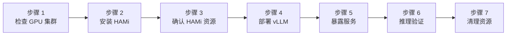
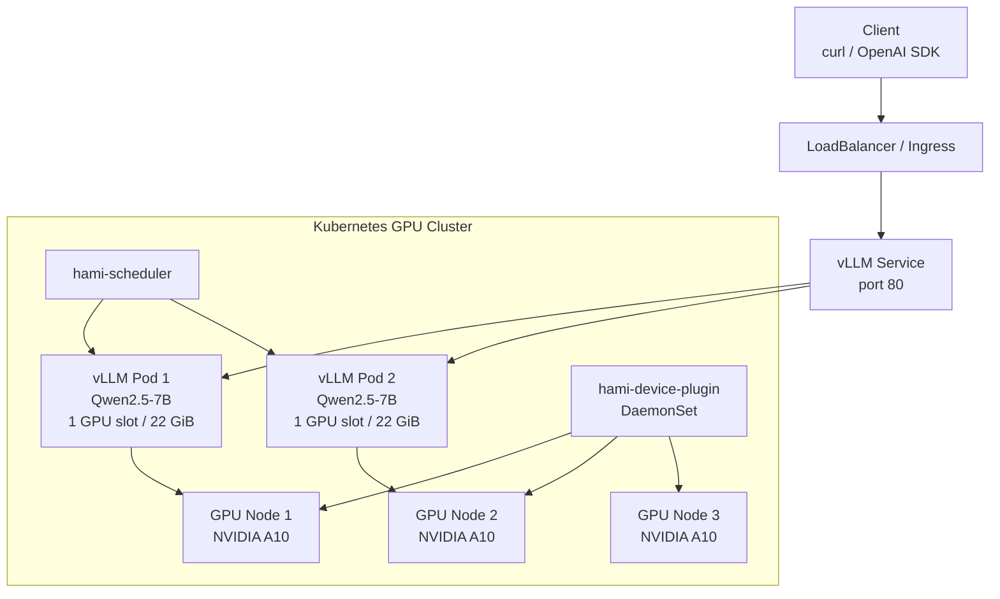

本实验演示如何在一个已经具备 NVIDIA GPU 的 Kubernetes 集群中安装 HAMi，并用 HAMi 调度 vLLM 推理服务。完成后，你将得到一个 OpenAI-compatible 的模型服务，可以通过 `/v1/models` 和 `/v1/chat/completions` 验证。

本文使用一个阿里云 ACK GPU 集群作为参考环境，但步骤并不绑定 ACK。只要你的 Kubernetes 集群已经有可用 NVIDIA GPU、NVIDIA 驱动和容器运行时支持，就可以按同样方式复现；云厂商相关的 LoadBalancer 和 ALB Ingress 配置可以替换为你自己的暴露方式。

## 学习目标

- 检查已有 GPU Kubernetes 集群是否满足 HAMi 和 vLLM 的前提条件
- 安装 HAMi scheduler 和 device plugin
- 给 GPU 节点补充 HAMi DaemonSet 所需标签
- 用 HAMi 的 `nvidia.com/gpu`、`nvidia.com/gpumem`、`nvidia.com/gpucores` 资源运行 vLLM
- 通过公网 LoadBalancer 或端口转发测试 vLLM 的 OpenAI-compatible API

## 实验概览



## 部署架构



## 前提条件

你需要提前准备：

- 一个已经可用的 Kubernetes 集群
- 至少 1 个 NVIDIA GPU 节点；本文示例使用 3 个 NVIDIA A10 节点
- `kubectl` 已经连接到该集群
- `helm` 3.x
- GPU 节点已经安装 NVIDIA 驱动和容器运行时支持
- 集群可以拉取 vLLM 镜像和模型文件

本文的配置文件如下：

| 文件 | 用途 |
| --- | --- |
| [`hami-values-ack.yaml`](./hami-vllm/hami-values-ack.yaml) | ACK 示例 HAMi values，使用 DaoCloud 镜像代理并匹配 ACK GPU 节点标签。 |
| [`vllm-qwen25-7b.yaml`](./hami-vllm/vllm-qwen25-7b.yaml) | vLLM Deployment 和 `vllm-qwen25-7b-engine-service` ClusterIP Service。 |
| [`vllm-public-service-aliyun.yaml`](./hami-vllm/vllm-public-service-aliyun.yaml) | 阿里云公网 LoadBalancer Service 示例。 |
| [`vllm-ingress-aliyun.yaml`](./hami-vllm/vllm-ingress-aliyun.yaml) | 阿里云 ALB Ingress 示例。 |

> 如果你不是在 ACK 上运行，仍然可以使用 `vllm-qwen25-7b.yaml`。只需要把镜像、节点标签和服务暴露方式改成你的环境可用的配置。

## 示例集群状态

下面是本文验证时使用的 ACK 集群状态。这个集群位于 `cn-hangzhou`，有 3 个 GPU 节点，每个节点是 `ecs.gn7i-c8g1.2xlarge`，带 1 张 NVIDIA A10。

```bash
kubectl get nodes -o wide
```

```plaintext
NAME                     STATUS   ROLES    AGE   VERSION            INTERNAL-IP   OS-IMAGE                                                CONTAINER-RUNTIME
cn-hangzhou.10.10.1.73   Ready    <none>   17h   v1.36.1-aliyun.1   10.10.1.73    Alibaba Cloud Linux 3.2104 U13.1 (OpenAnolis Edition)   containerd://1.6.28
cn-hangzhou.10.10.1.74   Ready    <none>   17h   v1.36.1-aliyun.1   10.10.1.74    Alibaba Cloud Linux 3.2104 U13.1 (OpenAnolis Edition)   containerd://1.6.28
cn-hangzhou.10.10.1.75   Ready    <none>   17h   v1.36.1-aliyun.1   10.10.1.75    Alibaba Cloud Linux 3.2104 U13.1 (OpenAnolis Edition)   containerd://1.6.28
```

检查 GPU 节点标签和 HAMi 暴露的 GPU 资源：

```bash
kubectl get nodes -L gpu,aliyun.accelerator/xpu_type \
  -o 'custom-columns=NAME:.metadata.name,GPU_LABEL:.metadata.labels.gpu,XPU:.metadata.labels.aliyun\.accelerator/xpu_type,ALLOC_GPU:.status.allocatable.nvidia\.com/gpu'
```

```plaintext
NAME                     GPU_LABEL   XPU      ALLOC_GPU
cn-hangzhou.10.10.1.73   on          nvidia   10
cn-hangzhou.10.10.1.74   on          nvidia   10
cn-hangzhou.10.10.1.75   on          nvidia   10
```

每个物理 A10 被 HAMi 注册为 10 个可调度 GPU 份额。这里的 `nvidia.com/gpu: 10` 表示这个节点最多可以分配 10 个 HAMi GPU 设备份额；每个工作负载真正能使用多少显存和算力，还要看它同时请求的 `nvidia.com/gpumem` 和 `nvidia.com/gpucores`。节点上还能看到云厂商提供的 GPU 标签：

```plaintext
aliyun.accelerator/nvidia_count=1
aliyun.accelerator/nvidia_mem=23028MiB
aliyun.accelerator/nvidia_name=NVIDIA-A10
aliyun.accelerator/xpu_type=nvidia
node.kubernetes.io/instance-type=ecs.gn7i-c8g1.2xlarge
```

NVIDIA A10 是 24 GB 级别的 GPU；在这个 ACK 集群里，节点标签上报的可用显存是 `23028MiB` 或 `24564MiB`，具体以节点标签和容器内 `nvidia-smi` 为准。

当前集群的关键 Helm release：

```bash
helm list -A
```

```plaintext
NAME                     NAMESPACE     STATUS     CHART
ack-nvidia-device-plugin kube-system   deployed   ack-nvidia-device-plugin-0.7.0
hami                     kube-system   deployed   hami-2.9.0
vllm                     vllm          deployed   vllm-stack-0.1.11
```

HAMi 组件状态：

```bash
kubectl get pods -n kube-system -l app.kubernetes.io/instance=hami -o wide
kubectl get ds hami-device-plugin -n kube-system -o wide
```

```plaintext
NAME                       READY   STATUS    NODE
hami-device-plugin-8jz8x   2/2     Running   cn-hangzhou.10.10.1.73
hami-device-plugin-whtkm   2/2     Running   cn-hangzhou.10.10.1.74
hami-device-plugin-9db54   2/2     Running   cn-hangzhou.10.10.1.75
hami-scheduler-...         2/2     Running   cn-hangzhou.10.10.1.75

NAME                 DESIRED   CURRENT   READY   NODE SELECTOR
hami-device-plugin   3         3         3       aliyun.accelerator/xpu_type=nvidia,gpu=on
```

vLLM 运行状态：

```bash
kubectl get pods,svc,ingress -n vllm -o wide
```

```plaintext
NAME                                      READY   STATUS    NODE
pod/vllm-qwen25-7b-deployment-...-g8gct   1/1     Running   cn-hangzhou.10.10.1.73
pod/vllm-qwen25-7b-deployment-...-znpb5   1/1     Running   cn-hangzhou.10.10.1.74

NAME                                      TYPE           EXTERNAL-IP      PORT(S)
service/vllm-qwen25-7b-public             LoadBalancer   120.27.251.192   80:30835/TCP
service/vllm-qwen25-7b-engine-service     ClusterIP      <none>           80/TCP

NAME                                       CLASS   HOSTS            ADDRESS
ingress.networking.k8s.io/vllm-qwen25-7b   alb     llm.kubecon.ai   alb-aqaj06ms8ogcxwg16o.cn-hangzhou.alb.aliyuncsslb.com
```

这套参考集群里已经运行的 vLLM 服务通过 vLLM Production Stack Helm chart 部署，并已显式使用 `hami-scheduler`、`nvidia.com/gpumem: "22000"` 和 `nvidia.com/gpucores: "100"`。下面 Lab 使用独立 manifest 部署同类服务，保留这些关键配置，方便你直接观察 HAMi 资源约束是否生效。

## 步骤 1: 检查 GPU 集群

先确认 Kubernetes 能看到 GPU 节点：

```bash
kubectl get nodes -o wide
kubectl describe node | grep -A8 -E "Capacity:|Allocatable:" | grep -E "nvidia.com/gpu|cpu:|memory:"
```

如果集群已经安装了云厂商的 NVIDIA device plugin，你可能已经能看到 `nvidia.com/gpu`。安装 HAMi 后，`nvidia.com/gpu` 会变成 HAMi 暴露的 vGPU 数量。

在 ACK 上，GPU 节点通常带有下面的标签：

```bash
kubectl get nodes -L aliyun.accelerator/xpu_type,aliyun.accelerator/nvidia_name
```

```plaintext
NAME                     XPU      NVIDIA_NAME
cn-hangzhou.10.10.1.73   nvidia   NVIDIA-A10
```

HAMi 的 device plugin 默认还会匹配 `gpu=on`，所以先给 GPU 节点补标签：

```bash
kubectl label nodes \
  -l aliyun.accelerator/xpu_type=nvidia \
  gpu=on \
  --overwrite
```

非 ACK 环境请把 label selector 换成你的 GPU 节点标签，例如：

```bash
kubectl label node <gpu-node-name> gpu=on --overwrite
```

## 步骤 2: 安装 HAMi

添加 HAMi Helm repo：

```bash
helm repo add hami https://Project-HAMi.github.io/HAMi
helm repo update hami
```

ACK 示例使用 [`hami-values-ack.yaml`](./hami-vllm/hami-values-ack.yaml)：

```yaml
device:
  nvidia:
    driver:
      enabled: false

global:
  managedNodeSelectorEnable: true
  managedNodeSelector:
    gpu: "on"

devicePlugin:
  deviceSplitCount: 10
  image:
    registry: docker.m.daocloud.io
    repository: projecthami/hami
```

关键配置说明：

| 配置 | 说明 |
| --- | --- |
| `device.nvidia.driver.enabled: false` | ACK GPU 节点已经有 NVIDIA 驱动，不需要 HAMi 再安装驱动。 |
| `global.managedNodeSelectorEnable: true` | 给 HAMi device plugin DaemonSet 加节点选择器。 |
| `global.managedNodeSelector.gpu: "on"` | 只把 HAMi device plugin 调度到打了 `gpu=on` 的 GPU 节点。 |
| `devicePlugin.deviceSplitCount: 10` | 每张物理 GPU 注册为 10 个 vGPU。 |
| `scheduler.leaderElect: false` | 本 Lab 使用单副本 HAMi scheduler，关闭 leader election，避免 extender 在 ACK 环境中一直等待成为 leader。 |
| `docker.m.daocloud.io/projecthami/hami` | 示例使用的镜像代理，避免某些国内节点拉 Docker Hub 超时。 |

安装 HAMi：

```bash
helm upgrade --install hami hami/hami \
  -n kube-system \
  -f tutorials/labs/hami-vllm/hami-values-ack.yaml
```

ACK 的 Kubernetes 1.36 集群上，HAMi 内置的 kube-scheduler 还需要读取 DRA 相关资源。应用下面的 RBAC，否则 scheduler 容器可能因为缺少 `resource.k8s.io` 权限而无法完成调度：

```bash
kubectl apply -f tutorials/labs/hami-vllm/hami-scheduler-dra-rbac.yaml
```

等待组件运行：

```bash
kubectl rollout status deployment/hami-scheduler -n kube-system
kubectl rollout status daemonset/hami-device-plugin -n kube-system
```

期望结果：

```plaintext
deployment "hami-scheduler" successfully rolled out
daemon set "hami-device-plugin" successfully rolled out
```

## 步骤 3: 验证 HAMi 资源

检查 HAMi Pod：

```bash
kubectl get pods -n kube-system -l app.kubernetes.io/instance=hami -o wide
```

你应该看到：

```plaintext
hami-scheduler-...       2/2   Running
hami-device-plugin-...   2/2   Running
```

检查每个 GPU 节点暴露的 vGPU：

```bash
kubectl get nodes -o 'custom-columns=NAME:.metadata.name,GPU:.status.allocatable.nvidia\.com/gpu'
```

示例输出：

```plaintext
NAME                     GPU
cn-hangzhou.10.10.1.73   10
cn-hangzhou.10.10.1.74   10
cn-hangzhou.10.10.1.75   10
```

如果某些节点没有运行 `hami-device-plugin`，优先检查标签：

```bash
kubectl get nodes -L gpu,aliyun.accelerator/xpu_type
kubectl get ds hami-device-plugin -n kube-system -o wide
```

## 步骤 4: 使用 HAMi 资源部署 vLLM

本文使用 [`vllm-qwen25-7b.yaml`](./hami-vllm/vllm-qwen25-7b.yaml) 部署 Qwen2.5-7B-Instruct：

```yaml
resources:
  requests:
    cpu: "2"
    memory: 8Gi
  limits:
    cpu: "4"
    memory: 16Gi
    nvidia.com/gpu: "1"
    nvidia.com/gpumem: "22000"
    nvidia.com/gpucores: "100"
```

关键点：

| 配置 | 说明 |
| --- | --- |
| `schedulerName: hami-scheduler` | 显式交给 HAMi scheduler 调度。 |
| `nvidia.com/gpu: "1"` | 每个 vLLM Pod 请求 1 个 HAMi GPU 设备份额。它不是固定大小的小切片；实际显存大小由 `nvidia.com/gpumem` 决定。 |
| `nvidia.com/gpumem: "22000"` | 每个 vLLM Pod 请求 22000 MiB 显存，基本接近独占一张 A10。当前参考集群中未配置 `gpumem` 的 vLLM Pod 在 `max_model_len=4096` 下实测 GPU 显存占用约 20.8 GiB，因此这里用 22 GiB 作为接近实际需求的限制值。 |
| `nvidia.com/gpucores: "100"` | 每个 Pod 使用 100% GPU 算力。这个配置适合推理服务稳定性验证，不适合在同一张 A10 上再混部另一个大模型。 |
| `VLLM_USE_MODELSCOPE=True` | 在国内网络环境下优先使用 ModelScope 下载模型。 |

> 一个 vLLM 实例到底需要多少显存，取决于模型大小、权重精度、`max_model_len`、并发量、KV cache 策略和 vLLM 版本。7B BF16/FP16 模型的权重通常约 14-16 GiB，再加上 CUDA/vLLM runtime、KV cache 和碎片开销后，A10 上运行 Qwen2.5-7B-Instruct 通常需要 20 GiB 以上显存。量化模型、较短上下文或更低并发可以降低需求；更长上下文和更高并发会增加需求。

应用配置：

```bash
kubectl apply -f tutorials/labs/hami-vllm/vllm-qwen25-7b.yaml
```

等待 vLLM 启动：

```bash
kubectl rollout status deployment/vllm-qwen25-7b -n vllm --timeout=30m
kubectl get pods -n vllm -o wide
```

模型首次下载和加载需要几分钟。示例输出：

```plaintext
NAME                              READY   STATUS    NODE
vllm-qwen25-7b-7dff7f7d8c-4q2x9   1/1     Running   cn-hangzhou.10.10.1.73
vllm-qwen25-7b-7dff7f7d8c-9h6xw   1/1     Running   cn-hangzhou.10.10.1.74
```

查看 HAMi 调度事件：

```bash
kubectl describe pod -n vllm -l app.kubernetes.io/name=qwen25-7b | grep -E "hami-scheduler|Filtering|Binding" -A2
```

你应该能看到 HAMi scheduler 的调度或绑定事件。

## 步骤 5: 暴露 vLLM 服务

如果只在本地验证，使用端口转发即可：

```bash
kubectl -n vllm port-forward svc/vllm-qwen25-7b-engine-service 8000:80
```

另开一个终端访问：

```bash
curl http://127.0.0.1:8000/v1/models
```

在 ACK 上可以创建公网 LoadBalancer：

```bash
kubectl apply -f tutorials/labs/hami-vllm/vllm-public-service-aliyun.yaml
kubectl get svc -n vllm vllm-qwen25-7b-public
```

示例输出：

```plaintext
NAME                    TYPE           EXTERNAL-IP      PORT(S)
vllm-qwen25-7b-public   LoadBalancer   120.27.251.192   80:30835/TCP
```

如果你已经有 ALB IngressClass，可以参考 [`vllm-ingress-aliyun.yaml`](./hami-vllm/vllm-ingress-aliyun.yaml)。使用前把 host 改成你的域名：

```yaml
rules:
  - host: llm.example.com
```

然后应用：

```bash
kubectl apply -f tutorials/labs/hami-vllm/vllm-ingress-aliyun.yaml
kubectl get ingress -n vllm
```

> 排障时建议先用 LoadBalancer 或 port-forward 验证 vLLM 服务本身，再排查 DNS、ALB 监听和健康检查。

## 步骤 6: 测试推理

先检查模型列表：

```bash
VLLM_HOST=$(kubectl get svc -n vllm vllm-qwen25-7b-public -o jsonpath='{.status.loadBalancer.ingress[0].ip}')
curl "http://${VLLM_HOST}/v1/models"
```

示例输出：

```json
{
  "object": "list",
  "data": [
    {
      "id": "Qwen/Qwen2.5-7B-Instruct",
      "object": "model",
      "owned_by": "vllm",
      "max_model_len": 4096
    }
  ]
}
```

发送一次聊天请求：

```bash
curl "http://${VLLM_HOST}/v1/chat/completions" \
  -H "Content-Type: application/json" \
  -d '{
    "model": "Qwen/Qwen2.5-7B-Instruct",
    "messages": [
      {"role": "user", "content": "用一句话解释 HAMi 和 vLLM 如何配合。"}
    ],
    "max_tokens": 128,
    "temperature": 0.2
  }'
```

如果返回 `choices[0].message.content`，说明 vLLM 推理服务已经可用。

## 步骤 7: 检查 GPU 分配

查看 Pod 请求的 HAMi 资源：

```bash
kubectl get pod -n vllm -l app.kubernetes.io/name=qwen25-7b \
  -o jsonpath='{range .items[*]}{.metadata.name}{"\t"}{.spec.nodeName}{"\t"}{.spec.containers[0].resources.limits}{"\n"}{end}'
```

示例输出：

```plaintext
vllm-qwen25-7b-...   cn-hangzhou.10.10.1.73   {"cpu":"4","memory":"16Gi","nvidia.com/gpu":"1","nvidia.com/gpumem":"22000","nvidia.com/gpucores":"100"}
vllm-qwen25-7b-...   cn-hangzhou.10.10.1.74   {"cpu":"4","memory":"16Gi","nvidia.com/gpu":"1","nvidia.com/gpumem":"22000","nvidia.com/gpucores":"100"}
```

先确认这个 Pod 确实走了 HAMi 调度，并且资源限制包含 `gpumem`：

```bash
POD=$(kubectl get pod -n vllm -l app.kubernetes.io/name=qwen25-7b -o jsonpath='{.items[0].metadata.name}')
kubectl get pod -n vllm ${POD} \
  -o jsonpath='{.spec.schedulerName}{"\n"}{.spec.containers[0].resources.limits}{"\n"}'
```

期望输出里应该包含：

```plaintext
hami-scheduler
map[cpu:4 memory:16Gi nvidia.com/gpu:1 nvidia.com/gpumem:22000 nvidia.com/gpucores:100]
```

再查看 HAMi 注入的环境变量：

```bash
kubectl exec -n vllm ${POD} -- env | grep -E 'CUDA_DEVICE|NVIDIA_VISIBLE'
```

你应该能看到类似：

```plaintext
NVIDIA_VISIBLE_DEVICES=GPU-...
CUDA_DEVICE_MEMORY_LIMIT_0=22000m
CUDA_DEVICE_SM_LIMIT=100
```

如果只看到 `NVIDIA_VISIBLE_DEVICES=0`，但没有 `CUDA_DEVICE_MEMORY_LIMIT_0`，通常说明这个 Pod 没有使用 HAMi 的显存限制路径，应该回到 Pod 的 `schedulerName`、资源限制和 HAMi webhook / scheduler 事件继续排查。

最后从容器内看 `nvidia-smi`：

```bash
kubectl exec -n vllm ${POD} -- nvidia-smi
```

当 `gpumem` 生效时，容器内看到的 GPU 总显存应该接近 `22000MiB`，而不是完整物理卡的 `23028MiB` / `24564MiB`。这才是判断 `nvidia.com/gpumem` 是否生效的关键证据。

在本文的 ACK 参考集群中，两个 vLLM 副本的实测结果如下：

```plaintext
CUDA_DEVICE_MEMORY_LIMIT_0=22000m
CUDA_DEVICE_SM_LIMIT=100
NVIDIA_VISIBLE_DEVICES=GPU-...
NVIDIA A10, 22000, 20126
```

这表示 HAMi 已经把容器内可见的 A10 显存限制为 22000 MiB，vLLM 当前实际使用约 20126 MiB。如果 `nvidia-smi` 仍然显示完整物理显存，才说明 `nvidia.com/gpumem` 没有生效。

## 排障

| 现象 | 检查项 |
| --- | --- |
| `hami-device-plugin` 不是 3/3 Ready | 检查 GPU 节点是否有 `gpu=on` 和云厂商 GPU 标签。 |
| HAMi 镜像拉取失败 | 将 `hami-values-ack.yaml` 中的镜像改成你自己的 ACR 镜像仓库。 |
| `hami-scheduler` 日志出现 DRA 资源权限错误 | 在 ACK Kubernetes 1.36 上应用 `hami-scheduler-dra-rbac.yaml`。 |
| `vgpu-scheduler-extender` 一直提示没有成为 leader | 确认 `hami-values-ack.yaml` 中 `scheduler.leaderElect: false` 已生效，并重启 `hami-scheduler`。 |
| vLLM Pod 一直 Pending | 检查 `kubectl describe pod` 中 HAMi scheduler 事件，确认 `gpumem` 没有超过单卡显存。 |
| vLLM Pod 启动很慢 | 首次下载 Qwen2.5-7B 模型需要时间，检查 Pod 日志。 |
| `/v1/models` 不通 | 先用 `kubectl port-forward` 验证 ClusterIP Service，再检查 LoadBalancer 或 Ingress。 |
| ALB Ingress 返回 502 | 检查 ALB health check path 是否为 `/v1/models`，并确认后端 Service 可以通过 port-forward 访问。 |

常用排障命令：

```bash
kubectl get pods -A -o wide
kubectl describe pod -n vllm -l app.kubernetes.io/name=qwen25-7b
kubectl logs -n vllm -l app.kubernetes.io/name=qwen25-7b --tail=100
kubectl logs -n kube-system deploy/hami-scheduler --tail=100
kubectl get ds hami-device-plugin -n kube-system -o wide
```

## 清理

删除 vLLM：

```bash
kubectl delete -f tutorials/labs/hami-vllm/vllm-ingress-aliyun.yaml --ignore-not-found
kubectl delete -f tutorials/labs/hami-vllm/vllm-public-service-aliyun.yaml --ignore-not-found
kubectl delete -f tutorials/labs/hami-vllm/vllm-qwen25-7b.yaml --ignore-not-found
```

如果这个集群只用于本 Lab，也可以卸载 HAMi：

```bash
helm uninstall hami -n kube-system
```

保留 GPU 节点标签通常没有副作用；如需清理：

```bash
kubectl label nodes -l aliyun.accelerator/xpu_type=nvidia gpu-
```

## 验证结果

| Claim | Evidence |
| --- | --- |
| HAMi 已经接管 GPU 调度路径 | vLLM Pod 使用 `schedulerName: hami-scheduler`，并请求 `nvidia.com/gpu`、`nvidia.com/gpumem`、`nvidia.com/gpucores`。 |
| GPU 节点可以运行 HAMi device plugin | 3 个 ACK GPU 节点上 `hami-device-plugin` DaemonSet 都是 Ready。 |
| vLLM 可以在 HAMi 资源上运行 | 2 个 Qwen2.5-7B vLLM Pod 分别在 GPU 节点上 Running。 |
| 推理服务可访问 | `/v1/models` 返回 `Qwen/Qwen2.5-7B-Instruct`，聊天接口可以返回内容。 |

## 下一步

尝试把 `replicas` 增加到 3，观察 HAMi 如何在多节点 GPU 集群中调度 vLLM Pod。不要在这份 7B 示例里直接把 `nvidia.com/gpumem` 大幅调低；如果要演示细粒度显存切分，应换成更小模型或量化模型。对于显存隔离和小切片共享，可以继续阅读 [实验 3: GPU 分区](./gpu-partitioning)。
