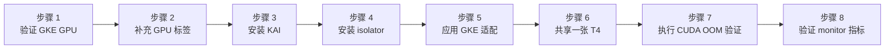

本实验在 GKE 上部署 KAI Scheduler v0.17.0 与 `kai-resource-isolator` 1.1.0-chart，并验证共享一张 Tesla T4 的两个 Pod 都无法越过各自的显存配额。实验还记录了验证环境中实际遇到的 GKE 1.35/COS/CDI 兼容问题。

:::warning 环境特有的 workaround

本文的 RuntimeClass、Kyverno、hostPath、PriorityClass 和特权容器调整只适用于验证过的 GKE 1.35/COS/CDI 路径，不是 KAI + HAMi-core 的标准安装方式。只有确认出现对应症状时才应用相应修复。

:::

## 你将学到什么

- 启用 KAI GPU sharing 与 `hamicore` binder 插件；
- 让 `kai-resource-isolator` 适配 GKE 的只读根文件系统与 CDI 设备注入；
- 证明两个 Pod 使用同一张 GPU，并分别只看到 4147 MiB；
- 用 `cudaMalloc` 验证配额内成功、越界失败和两个 Pod 互不影响。

## 实验概览



## 前提条件

- 已启用 GKE 与 Compute Engine API 的 GCP 项目。
- 一套使用 COS 节点的 GKE 1.35 集群，至少有一张 NVIDIA T4。验证集群有三个 `n1-standard-2` 节点，每节点一张 T4。
- 使用 GKE 管理的 NVIDIA 驱动、device plugin 与 container toolkit。不要在 GKE 驱动之上重复安装 GPU Operator。
- 具有集群管理员权限的 `gcloud`、与 GKE API Server 相差不超过一个次版本的 `kubectl`，以及 Helm 3 或 4。
- [`tutorials/labs/examples/12-kai-scheduler-hami-gke/`](https://github.com/Project-HAMi/website/tree/master/tutorials/labs/examples/12-kai-scheduler-hami-gke) 下的实验文件。

验证集群的控制面与节点版本均为 GKE `1.35.6-gke.1250000`。GKE 补丁版本会逐渐下线，因此先从目标可用区选择当前可用的 1.35 版本，再创建集群：

```bash
export GKE_VERSION=$(gcloud container get-server-config \
  --zone=asia-northeast1-a \
  --format='value(validMasterVersions)' | tr ';' '\n' | grep '^1\.35\.' | head -1)
test -n "$GKE_VERSION"

gcloud container clusters create kai-hami-test --zone=asia-northeast1-a \
  --cluster-version="$GKE_VERSION" \
  --machine-type=n1-standard-2 --num-nodes=3 \
  --image-type=COS_CONTAINERD \
  --accelerator=type=nvidia-tesla-t4,count=1,gpu-driver-version=default
gcloud container clusters get-credentials kai-hami-test \
  --zone=asia-northeast1-a
```

GPU 节点会产生费用，完成实验后请执行清理步骤。

:::note 关于输出块

下文输出均采集自 2026-08-12 的验证运行。Pod 后缀、运行时长、IP 地址和节点名称因环境而异；复现时应重点比较组件名称、就绪状态、调度位置和测量值。

:::

## 步骤 1: 验证 GKE GPU 栈

确认 GPU 节点已经上报 `nvidia.com/gpu`：

```bash
kubectl get nodes \
  -o custom-columns="NAME:.metadata.name,GPU:.status.capacity.nvidia\.com/gpu,ACCEL:.metadata.labels.cloud\.google\.com/gke-accelerator"
```

验证集群包含三个 T4 节点：

```plaintext
NAME                                           GPU   ACCEL
gke-kai-hami-test-default-pool-370c394b-fxh2   1     nvidia-tesla-t4
gke-kai-hami-test-default-pool-370c394b-pm4j   1     nvidia-tesla-t4
gke-kai-hami-test-default-pool-370c394b-r8n5   1     nvidia-tesla-t4
```

如果 `GPU` 为空，且节点带有 `gke-no-default-nvidia-gpu-device-plugin=true`，启用 GKE device plugin：

```bash
kubectl label node -l cloud.google.com/gke-accelerator=nvidia-tesla-t4 \
  gke-no-default-nvidia-gpu-device-plugin-
```

安装 KAI 前先运行普通整卡 Pod：

```bash
kubectl apply -f - <<'EOF'
apiVersion: v1
kind: Pod
metadata:
  name: gpu-smi-test
spec:
  restartPolicy: Never
  containers:
    - name: cuda
      image: nvidia/cuda:12.4.1-base-ubuntu22.04
      command: ["nvidia-smi"]
      resources:
        limits:
          nvidia.com/gpu: 1
EOF
kubectl wait --for=jsonpath='{.status.phase}'=Succeeded \
  pod/gpu-smi-test --timeout=180s
kubectl logs gpu-smi-test
kubectl delete pod gpu-smi-test
```

实测 `nvidia-smi` 中与本实验相关的输出为：

```plaintext
GPU  Name        Persistence-M | Bus-Id        Disp.A | Volatile Uncorr. ECC
  0  Tesla T4               Off | 00000000:00:04.0 Off |                    0
...                         0MiB / 15360MiB
```

驱动补丁版本可能不同，但业务镜像必须与之兼容。记录这里报告的显存值，供步骤 2 使用。

## 步骤 2: 添加 KAI 所需的 GPU 标签

GKE 默认 device plugin 不提供完整的 GPU Feature Discovery 标签。KAI 在注册节点时读取 `nvidia.com/gpu.memory`，因此要在安装 KAI 前添加：

```bash
kubectl label node -l cloud.google.com/gke-accelerator=nvidia-tesla-t4 \
  nvidia.com/gpu.memory=15360 \
  nvidia.com/gpu.product=NVIDIA-Tesla-T4 \
  nvidia.com/gpu.count=1 \
  nvidia.com/gpu.present=true --overwrite

kubectl get nodes -o custom-columns=\
'NAME:.metadata.name,GPU.MEMORY:.metadata.labels.nvidia\.com/gpu\.memory,GPU.PRODUCT:.metadata.labels.nvidia\.com/gpu\.product'
```

实测节点随后暴露了 KAI 读取的标签值：

```plaintext
NAME                                           GPU.MEMORY   GPU.PRODUCT
gke-kai-hami-test-default-pool-370c394b-fxh2   15360        NVIDIA-Tesla-T4
gke-kai-hami-test-default-pool-370c394b-pm4j   15360        NVIDIA-Tesla-T4
gke-kai-hami-test-default-pool-370c394b-r8n5   15360        NVIDIA-Tesla-T4
```

显存值应来自 `nvidia-smi`，不要使用 T4 标称的 16 GiB。如果 KAI 启动后才补标签，需要重启 `kai-scheduler` 刷新节点缓存。

## 步骤 3: 安装 KAI Scheduler 与默认队列

安装 KAI v0.17.0，启用 GPU sharing、HAMi-core 集成和 CDI：

```bash
helm install kai-scheduler \
  oci://ghcr.io/kai-scheduler/kai-scheduler/kai-scheduler \
  --namespace kai-scheduler --create-namespace \
  --version v0.17.0 \
  --set global.gpuSharing=true \
  --set binder.plugins.hamicore.enabled=true \
  --set-string binder.plugins.gpusharing.arguments.cdiEnabled=true

kubectl -n kai-scheduler wait --for=condition=available \
  --timeout=180s deploy --all
kubectl -n kai-scheduler wait --for=condition=Ready \
  --timeout=300s config/kai-config
kubectl get pods -n kai-scheduler
kubectl get queues
```

实测安装中的七个 KAI 控制面组件均处于运行状态。自动生成的 Pod 后缀会不同：

```plaintext
NAME                                      READY   STATUS    RESTARTS   AGE
admission-759b9bb99c-...                   1/1     Running   0          4m
binder-54665cc5d9-...                      1/1     Running   0          4m
kai-operator-997c6886c-...                 1/1     Running   0          4m
kai-scheduler-default-d85d7dbdf-...        1/1     Running   0          4m
pod-grouper-68f4fb47-...                   1/1     Running   0          4m
podgroup-controller-5947b5b4dd-...         1/1     Running   0          4m
queue-controller-6cc8c844c8-...            1/1     Running   0          4m
```

KAI v0.17.0 还会自动创建默认的父子队列：

```plaintext
NAME                   PARENT
default-parent-queue
default-queue          default-parent-queue
```

:::important `cdiEnabled` 必须是字符串

这里必须使用 `--set-string`，不能使用普通的 `--set`。KAI v0.17.0 的 Helm values 虽然能接受两种写法，但生成的 `Config` CRD 字段类型是字符串。普通的 `--set ...=true` 会渲染成布尔值，使 `kai-config-deployer` hook 报错：`cdiEnabled ... must be of type string: "boolean"`。上面的正确命令已经过 Chart 渲染，并通过当前 GKE API Server 的 server-side dry-run。

:::

## 步骤 4: 安装 kai-resource-isolator

COS 的根文件系统只读，因此将 HAMi-core 写入 GKE 可写的 NVIDIA 目录：

```bash
helm install kai-resource-isolator \
  oci://docker.io/projecthami/kai-resource-isolator \
  --namespace kai-resource-isolator --create-namespace \
  --version 1.1.0-chart \
  --set paths.containerVgpuMount=/home/kubernetes/bin/nvidia/vgpu \
  --set-string librarySync.priorityClassName= \
  --set-string monitor.priorityClassName= \
  --set monitor.enabled=true
```

`containerVgpuMount` 是 1.1.0-chart 中真正控制 libsync 目标目录、preload 文件、webhook 注入路径和 monitor 缓存的值。不要使用 `paths.hostInstallBase`：它虽然出现在该 Chart 的 values 中，但模板没有引用它。两个空 PriorityClass 值用于避免 GKE 拒绝系统命名空间之外使用 `system-node-critical` 的 Pod。

检查渲染后的路径并等待组件就绪：

```bash
kubectl get cm kai-resource-isolator-ldpreload \
  -n kai-resource-isolator -o jsonpath='{.data.ld\.so\.preload}'
kubectl rollout status ds/kai-resource-isolator-libsync \
  -n kai-resource-isolator --timeout=300s
kubectl rollout status ds/kai-resource-isolator-monitor \
  -n kai-resource-isolator --timeout=300s
kubectl rollout status deploy/kai-resource-isolator-webhook \
  -n kai-resource-isolator --timeout=300s
kubectl get pods -n kai-resource-isolator
```

实测路径和组件状态如下：

```plaintext
/home/kubernetes/bin/nvidia/vgpu/libvgpu.so

NAME                                        READY   STATUS    RESTARTS   AGE
kai-resource-isolator-libsync-...           1/1     Running   0          2m
kai-resource-isolator-libsync-...           1/1     Running   0          2m
kai-resource-isolator-libsync-...           1/1     Running   0          2m
kai-resource-isolator-monitor-26bj8         1/1     Running   0          2m
kai-resource-isolator-monitor-hf67f         1/1     Running   0          2m
kai-resource-isolator-monitor-tnj9l         1/1     Running   0          2m
kai-resource-isolator-webhook-...           1/1     Running   0          2m
```

每个 GPU 节点都应有一个 libsync 和一个 monitor Pod，并且 webhook Pod 已就绪。

## 步骤 5: 适配 GKE CDI 设备路径

验证集群使用 CDI，没有注册 `nvidia` runtime handler，但 KAI reservation Pod 引用了 `runtimeClassName: nvidia`。只有 RuntimeClass 不存在时才创建兼容对象：

```bash
kubectl get runtimeclass nvidia || kubectl apply \
  -f tutorials/labs/examples/12-kai-scheduler-hami-gke/02-runtimeclass.yaml
```

GKE device plugin 只向申请 `nvidia.com/gpu` 的 Pod 注入设备；KAI 共享 Pod 使用 `gpu-memory`，因此验证环境需要显式挂载设备与库。安装 Kyverno 并应用两条策略：

```bash
helm repo add kyverno https://kyverno.github.io/kyverno/
helm repo update
helm install kyverno kyverno/kyverno \
  --namespace kyverno --create-namespace
kubectl wait -n kyverno --for=condition=Ready pod \
  -l app.kubernetes.io/component=admission-controller --timeout=300s
kubectl apply \
  -f tutorials/labs/examples/12-kai-scheduler-hami-gke/03-gke-policies.yaml
kubectl wait --for=condition=Ready --timeout=180s \
  clusterpolicy/inject-nvidia-library-path \
  clusterpolicy/inject-gpu-devices
kubectl get runtimeclass nvidia
kubectl get pods -n kyverno
kubectl get clusterpolicy \
  inject-nvidia-library-path inject-gpu-devices
```

实测时兼容对象与 Kyverno 控制器均已就绪：

```plaintext
NAME     HANDLER   AGE
nvidia   runc      3m

NAME                                             READY   STATUS    RESTARTS   AGE
kyverno-admission-controller-7cdf5b9c-...         1/1     Running   0          2m
kyverno-background-controller-7b54965bf9-...      1/1     Running   0          2m
kyverno-cleanup-controller-59c8fdfb66-...         1/1     Running   0          2m
kyverno-reports-controller-5c96886c9-...          1/1     Running   0          2m

NAME                          ADMISSION   BACKGROUND   READY
inject-nvidia-library-path    true        true         true
inject-gpu-devices            true        true         true
```

第一条策略给 reservation Pod 添加 NVML 库路径；第二条给共享 Pod 挂载 `/dev/nvidia*`、`nvidia-smi` 与 NVIDIA 库。使用这条 workaround 时，共享 Pod 还需要 `privileged: true`。

:::caution 安全边界

本实验验证 CUDA API 层的显存限制，不是 MIG 一类硬件安全边界。GKE workaround 还使用了特权业务容器，不应将其作为不可信多租户安全方案。

:::

## 步骤 6: 让两个 Pod 共享一张 T4

选择一台没有其他共享工作负载、且只有一张 T4 的节点。不要选择已经运行 `gpu-memory` 工作负载的节点：两个 4 GiB 实验 Pod 需要该卡至少还有 8 GiB 未被 KAI 分配。先列出候选节点与当前 Pod 分布：

```bash
kubectl get nodes -l cloud.google.com/gke-accelerator=nvidia-tesla-t4
kubectl get pods -A -o wide

# 将下面的值替换为上面输出中的一台空闲单卡 T4 节点。
export TEST_NODE=<your-idle-t4-node>
test "$(kubectl get node "$TEST_NODE" \
  -o jsonpath='{.status.capacity.nvidia\.com/gpu}')" = "1"
kubectl label node "$TEST_NODE" hami.run/lab-12=true --overwrite

kubectl create configmap kai-hami-lab12-source \
  --from-file=memory-limit.cu=tutorials/labs/examples/12-kai-scheduler-hami-gke/memory-limit.cu \
  --dry-run=client -o yaml | kubectl apply -f -
kubectl apply \
  -f tutorials/labs/examples/12-kai-scheduler-hami-gke/04-shared-pods.yaml
kubectl wait --for=condition=Ready \
  pod/kai-hami-lab12-a pod/kai-hami-lab12-b \
  --timeout=10m
```

检查节点位置，并从两个 Pod 的启动日志读取注入配额、物理 UUID 与可见显存：

```bash
kubectl get pod kai-hami-lab12-a kai-hami-lab12-b -o wide
for pod in kai-hami-lab12-a kai-hami-lab12-b; do
  echo "=== $pod ==="
  kubectl logs "$pod"
done
```

实测时两个 Pod 在同一节点就绪：

```plaintext
NAME                READY   STATUS    RESTARTS   IP           NODE
kai-hami-lab12-a    1/1     Running   0          10.84.2.66   gke-kai-hami-test-default-pool-370c394b-pm4j
kai-hami-lab12-b    1/1     Running   0          10.84.2.67   gke-kai-hami-test-default-pool-370c394b-pm4j
```

两者的启动日志都返回：

```plaintext
limit=4147m
GPU-9acc8878-3967-5fb4-c534-43d6fd820fa6, 4147 MiB
```

相同 UUID 证明两个 Pod 使用同一张 T4。4147 MiB 是 KAI 把 15360 MiB 卡上的 4096 MiB 请求换算为两位小数 fraction 后的舍入结果。

## 步骤 7: 验证 CUDA 显存上限

步骤 6 创建的源码 ConfigMap 已挂载到 `/lab-source`。每个 Pod 启动时会自动编译程序，成功申请 3 GiB 后保持 30 秒，再尝试追加 2 GiB。验证通过后，Pod 会再次启动程序并持续持有 3 GiB，供步骤 8 验证实时监控指标。两个阶段均成功启动后，readiness probe 才会成功。

查看两个 Pod 日志中的测试区间与结果：

```bash
for pod in kai-hami-lab12-a kai-hami-lab12-b; do
  kubectl logs "$pod" | grep -E \
    'test_(start|end)=|allocate |PASS:'
done
```

实测时间区间互相重叠，并且每个 Pod 都返回 `PASS`：

```plaintext
=== kai-hami-lab12-a ===
test_start=2026-08-12T05:11:13Z
allocate 3 GiB: no error
allocate another 2 GiB: out of memory
PASS: in-quota allocation succeeded and over-quota allocation failed
test_end=2026-08-12T05:11:44Z

=== kai-hami-lab12-b ===
test_start=2026-08-12T05:11:11Z
allocate 3 GiB: no error
allocate another 2 GiB: out of memory
PASS: in-quota allocation succeeded and over-quota allocation failed
test_end=2026-08-12T05:11:43Z
```

比较 `test_start` 与 `test_end`，两个 30 秒区间必须重叠。实测时两个 Pod 在同时持有 3 GiB 的情况下都返回 `PASS`。各自累计申请 5 GiB 时，HAMi-core 都记录 `Device 0 OOM 5475663872 / 4348444672`。将验证程序作为容器启动命令执行，也避免了长时间 `kubectl exec` WebSocket 中断影响判断。

## 步骤 8: 验证 monitor 指标

monitor 是 DaemonSet：每个实例只读取本节点上的 HAMi 共享内存缓存。通过 Service 访问时可能被转发到其他节点的 monitor，从而看不到这两个 Pod 的序列。因此要直接查询工作负载所在节点的 monitor 实例。这里重新从运行中的 Pod 获取节点，不再依赖步骤 6 所在 shell 导出的临时变量。

创建一个临时 curl Pod，读取该 monitor 的 `:9394/metrics`：

```bash
export TEST_NODE=$(kubectl get pod kai-hami-lab12-a \
  -o jsonpath='{.spec.nodeName}')
test -n "$TEST_NODE"

export MONITOR_IP=$(kubectl get pods -n kai-resource-isolator \
  -l app.kubernetes.io/component=kai-vgpu-monitor \
  --field-selector="spec.nodeName=$TEST_NODE" \
  -o jsonpath='{range .items[*]}{.status.podIP}{"\n"}{end}' | head -n 1)

if test -z "$MONITOR_IP"; then
  echo "$TEST_NODE 上没有运行 monitor Pod" >&2
  kubectl get pods -n kai-resource-isolator \
    -l app.kubernetes.io/component=kai-vgpu-monitor -o wide
  exit 1
fi

kubectl delete pod lab12-monitor-check --ignore-not-found
kubectl run lab12-monitor-check \
  --image=curlimages/curl:8.15.0 --restart=Never \
  --command -- sh -lc \
  "curl -fsS http://$MONITOR_IP:9394/metrics"
kubectl wait --for=jsonpath='{.status.phase}'=Succeeded \
  pod/lab12-monitor-check --timeout=180s
kubectl logs lab12-monitor-check | grep -E \
  '^hami_vgpu_memory_(used|limit)_bytes.*pod="kai-hami-lab12-[ab]"'
```

实测端点为每个 Pod 分别返回一条 `used` 和 `limit` 序列：

```plaintext
hami_vgpu_memory_limit_bytes{...,pod="kai-hami-lab12-a",...} 4.348444672e+09
hami_vgpu_memory_limit_bytes{...,pod="kai-hami-lab12-b",...} 4.348444672e+09
hami_vgpu_memory_used_bytes{...,pod="kai-hami-lab12-a",...} 3.328180224e+09
hami_vgpu_memory_used_bytes{...,pod="kai-hami-lab12-b",...} 3.328180224e+09
```

limit 等于 4147 MiB 对应的字节数；used 略高于 3 GiB，因为其中包含 CUDA context 与分配器开销。这证明 monitor 确实发现了两个容器的缓存并导出了实时用量，而不是只提供一个没有业务序列的 Prometheus 端点。

## 故障排查

| 现象 | 验证环境中的原因 | 处理方式 |
| :-- | :-- | :-- |
| 共享 Pod Pending，提示 `didn't have enough resources: GPU memory` | KAI 缓存节点时缺少 `nvidia.com/gpu.memory` | 补标签并重启 `kai-scheduler` |
| Queue 被拒绝 | KAI admission webhook 尚未就绪 | 等待 KAI Deployment 后再创建队列 |
| `RuntimeClass "nvidia" not found` | GKE CDI 使用 `runc`，没有 NVIDIA handler | 应用 `02-runtimeclass.yaml` |
| reservation Pod 报 `ERROR_LIBRARY_NOT_FOUND` | NVML 位于 `/usr/local/nvidia/lib64`，但不在搜索路径 | 应用 Kyverno 库路径策略 |
| 共享 Pod 看不到 `/dev/nvidia*` | 它只申请 `gpu-memory`，GKE device plugin 不执行 Allocate | 应用 Kyverno 设备挂载策略 |
| libsync 报 `Read-only file system` | COS 根文件系统只读 | 设置 `paths.containerVgpuMount=/home/kubernetes/bin/nvidia/vgpu` |
| `libvgpu.so` 无法 preload | 实际挂载路径仍指向 `/usr/local/vgpu` | 使用验证过的 `containerVgpuMount` 值重新安装 |
| DaemonSet 因 `system-node-critical` 被拒绝 | GKE PriorityClass 配额限制用户命名空间 | 将 Chart 中两个 PriorityClass 值设为空字符串 |
| `CUDA driver version is insufficient` | CUDA 镜像版本超过节点驱动支持范围 | 使用实测的 CUDA 12.4.1 或其他兼容版本 |
| `kubectl exec` 出现 WebSocket EOF | 控制面 exec 流被重置，或客户端/服务端版本偏差不受支持 | 使用兼容的 `kubectl`；本实验在容器启动时执行验证，并通过 `kubectl logs` 读取 |
| monitor 查询不到 Pod 或没有实验序列 | `$TEST_NODE` 已失效，或工作负载节点上没有 monitor | 从 `kai-hami-lab12-a` 重新获取节点，再用 `kubectl get pods -n kai-resource-isolator -l app.kubernetes.io/component=kai-vgpu-monitor -o wide` 检查 DaemonSet |

## 清理

删除业务 Pod 与测试标签：

```bash
kubectl delete \
  -f tutorials/labs/examples/12-kai-scheduler-hami-gke/04-shared-pods.yaml
kubectl delete pod lab12-monitor-check --ignore-not-found
kubectl delete configmap kai-hami-lab12-source --ignore-not-found
kubectl label node "$TEST_NODE" hami.run/lab-12- --overwrite
```

如果集群只用于本实验，再删除其余组件：

```bash
kubectl delete \
  -f tutorials/labs/examples/12-kai-scheduler-hami-gke/03-gke-policies.yaml
helm uninstall kyverno -n kyverno
helm uninstall kai-resource-isolator -n kai-resource-isolator
kubectl delete queues default-queue default-parent-queue --ignore-not-found
helm uninstall kai-scheduler -n kai-scheduler
```

这里显式删除 Queue 是有意为之：KAI 给默认队列添加了 `helm.sh/resource-policy: keep` 注解，因此 Helm 卸载时会保留它们。

只有步骤 5 创建了 RuntimeClass 时才删除 `02-runtimeclass.yaml`；如果该 RuntimeClass 原本就属于集群，应予以保留：

```bash
kubectl delete \
  -f tutorials/labs/examples/12-kai-scheduler-hami-gke/02-runtimeclass.yaml
```

如果 GKE 集群专门为本实验创建，可将其删除：

```bash
gcloud container clusters delete kai-hami-test \
  --zone=asia-northeast1-a
```

## 本实验验证了什么

| 结论 | 证据 |
| :-- | :-- |
| KAI 把两个分片工作负载调度到同一张 T4 | 两个 Pod 节点相同、GPU UUID 相同 |
| HAMi-core 改写每个 Pod 可见的显存上限 | 两个 Pod 均显示 4147 MiB，而非 15360 MiB |
| 上限被真正执行，而非只修改显示 | 3 GiB 成功，累计 5 GiB 返回 CUDA OOM |
| 一个 Pod 无法占用另一个 Pod 的配额 | Pod A 持有 3 GiB 时，Pod B 仍成功分配 3 GiB |
| 可选 monitor 能读取每容器缓存 | `:9394/metrics` 返回两个 Pod 的 4147 MiB 上限与实时 3 GiB 用量 |

## 下一步

- 阅读[《KAI Scheduler 与 HAMi 的 GPU 显存硬隔离》](/zh/blog/kai-scheduler-hami-gpu-memory-hard-isolation)，了解架构与集成背景。
- 对比[实验 3：HAMi GPU 切分](./gpu-partitioning.md)和[实验 7：k3s GPU 隔离](./hami-isolation-k3s.md)。
- 关注 KAI 与 `kai-resource-isolator` 后续版本；当 GKE CDI 获得原生支持后，删除本实验中对应的 workaround。
