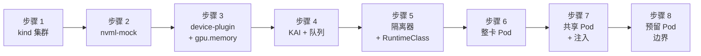

本实验在 [实验 5](./nvml-mock.md) 的 **nvml-mock** 环境之上——即本地 **kind** 集群中的 8 块假 A100 GPU——安装 **NVIDIA KAI Scheduler**（启用 `hamicore` 插件）以及 [kai-resource-isolator](https://github.com/Project-HAMi/KAI-resource-isolator)，然后走通整条控制面：整卡调度、按显存分数的分配核算，以及 HAMi-core（`libvgpu.so`）的注入。KAI 负责调度与 GPU 共享，HAMi-core 仅用于显存隔离，这正是两个项目在生产环境中的分工方式。由于假 GPU 的 Pod 内部没有 CUDA/NVML 运行时，本实验验证调度与注入控制面，并有意在 KAI 的预留 Pod（reservation Pod）边界处停止（步骤 8）。

:::note

nvml-mock 提供 GPU 发现能力和节点级 NVML，因此 KAI 调度、显存核算以及隔离器的注入都能正常工作。但它**不会**把 `libnvidia-ml.so` 注入到任意 Pod 中，所以一个真正**运行中**的共享 Pod、`nvidia-smi` 的显存切分显示，以及 `cudaMalloc` 的强制限制，仍然需要真实 GPU（或完整的 NVIDIA 容器工具链 / CDI）。步骤 8 会精确指出这条边界在哪里。

:::

## 你将学到什么

- NVIDIA device-plugin 如何在 nvml-mock 上通告整卡资源（`nvidia.com/gpu: 8`）
- KAI 为何需要 `nvidia.com/gpu.memory` 标签，以及为何该标签必须在 KAI 读取节点之前就存在
- KAI 队列、`hamicore` 插件与隔离器 webhook 如何协同工作
- GPU **共享**在哪一步开始需要真实（或由工具链注入的）NVML，以及原因

## 实验概览



## 前提条件

- 一台运行着 **Docker** 的 Linux 或 macOS 笔记本，至少空闲 4 核 CPU / 8 GB 内存
- `kind` v0.20+、`kubectl` v1.31+、`helm` 3.x、`git`、`go`（安装命令见 [实验 5](./nvml-mock.md)）
- **KAI Scheduler ≥ v0.17.0**（`hamicore` 插件和 `1.1.0-chart` 隔离器所要求）
- 可访问 GitHub、GHCR、Docker Hub 以及 NVCR/NGC（`nvcr.io`，用于 device-plugin 镜像）

## 步骤 1: 创建 kind 集群

启动一个单节点集群，并把节点名保存到变量中，供后续步骤复用。

```bash
kind create cluster --name kai-hami-test
NODE_NAME=$(kubectl get nodes -o jsonpath='{.items[0].metadata.name}')
echo "NODE_NAME=${NODE_NAME}"
```

```plaintext
NODE_NAME=kai-hami-test-control-plane
```

## 步骤 2: 部署 nvml-mock

nvml-mock 提供假的 `libnvidia-ml.so`、虚拟设备和 PCI 拓扑，使节点报告 8 块 A100 GPU。这与实验 5 使用的是同一个模拟器。

```bash
git clone https://github.com/NVIDIA/k8s-test-infra.git
cd k8s-test-infra
docker build -t nvml-mock:local -f deployments/nvml-mock/Dockerfile .
kind load docker-image nvml-mock:local --name kai-hami-test

helm install nvml-mock oci://ghcr.io/nvidia/k8s-test-infra/chart/nvml-mock \
  --set image.repository=nvml-mock --set image.tag=local \
  --wait --timeout 120s

kubectl get node ${NODE_NAME} \
  -o custom-columns=NAME:.metadata.name,GPU_PRESENT:.metadata.labels.nvidia\\.com/gpu\\.present
```

```plaintext
NAME                          GPU_PRESENT
kai-hami-test-control-plane   true
```

> `GPU_PRESENT=true` 表示该节点已成为 GPU 节点。如果该列为空，说明 nvml-mock 的 Pod 尚未启动完成——稍等片刻后重新运行最后一条命令。

## 步骤 3: 安装 device-plugin 并发布 GPU 显存

KAI 依据 `nvidia.com/gpu` 进行调度，因此需要安装 NVIDIA device-plugin。请使用 nvml-mock 自带的清单——它会以 hostPath 方式挂载 `/var/lib/nvml-mock`，并传入正确的 driver-root 和 NVML 发现参数，而普通 Helm chart 不会这样做（那会导致 `ERROR_LIBRARY_NOT_FOUND`）。随后发布每卡显存，KAI 需要它来把 `gpu-memory` 请求换算成分数。

```bash
kubectl apply -f https://raw.githubusercontent.com/NVIDIA/k8s-test-infra/main/tests/e2e/device-plugin-mock.yaml
kubectl -n kube-system wait --for=condition=ready \
  pod -l name=nvidia-device-plugin-mock --timeout=120s

kubectl get node ${NODE_NAME} -o jsonpath='{.status.allocatable.nvidia\.com/gpu}{"\n"}'

kubectl label node ${NODE_NAME} \
  nvidia.com/gpu.memory=40960 \
  nvidia.com/gpu.product=NVIDIA-A100-SXM4-40GB \
  nvidia.com/gpu.count=8 --overwrite
```

```plaintext
8
node/kai-hami-test-control-plane labeled
```

> `8`（而非 `80`）确认 KAI 拿到的是 8 块整卡，由 KAI 自己去做分数级共享。请务必在安装 KAI **之前**打上 `nvidia.com/gpu.memory` 标签：KAI 在首次注册节点时会缓存每卡显存，若标签是之后才添加的，KAI 会把显存记为 0，导致每个共享 Pod 都停留在 `Pending` 状态并报 `didn't have enough resources: GPU memory`，直到重启调度器为止。

## 步骤 4: 安装 KAI Scheduler 并创建队列

`global.gpuSharing=true` 启用 GPU 共享；`binder.plugins.hamicore.enabled=true` 让 KAI 向共享容器注入 `CUDA_DEVICE_MEMORY_LIMIT`。在 Pod 的 `kai.scheduler/queue` 标签所指向的队列存在之前，KAI 不会调度该 Pod。

```bash
helm install kai-scheduler oci://ghcr.io/kai-scheduler/kai-scheduler/kai-scheduler \
  --namespace kai-scheduler --create-namespace \
  --set global.gpuSharing=true \
  --set binder.plugins.hamicore.enabled=true \
  --version v0.17.0

# 在创建队列之前，先等待 KAI（尤其是 admission webhook）就绪，
# 否则证书尚未就绪时 Queue 的创建可能会被拒绝。
kubectl -n kai-scheduler wait --for=condition=available --timeout=180s deploy --all

kubectl apply -f - <<'EOF'
apiVersion: scheduling.run.ai/v2
kind: Queue
metadata:
  name: default
spec:
  resources:
    cpu:    { quota: -1, limit: -1, overQuotaWeight: 1 }
    memory: { quota: -1, limit: -1, overQuotaWeight: 1 }
    gpu:    { quota: -1, limit: -1, overQuotaWeight: 1 }
---
apiVersion: scheduling.run.ai/v2
kind: Queue
metadata:
  name: default-queue
spec:
  parentQueue: default
  resources:
    cpu:    { quota: -1, limit: -1, overQuotaWeight: 1 }
    memory: { quota: -1, limit: -1, overQuotaWeight: 1 }
    gpu:    { quota: -1, limit: -1, overQuotaWeight: 1 }
EOF

kubectl get pods -n kai-scheduler
kubectl get queues
```

```plaintext
NAME                                     READY   STATUS    RESTARTS   AGE
admission-759b9bb99c-4wx9q               1/1     Running   0          2m
binder-69bf5f648-k572n                   1/1     Running   0          2m
kai-operator-997c6886c-dthws             1/1     Running   0          2m
kai-scheduler-default-5dfbc85f96-6kp9v   1/1     Running   0          2m
pod-grouper-68f4fb47-5q99f               1/1     Running   0          2m
podgroup-controller-5947b5b4dd-f66pj     1/1     Running   0          2m
queue-controller-6cc8c844c8-sdl67        1/1     Running   0          2m

NAME                   PRIORITY   PARENT    CHILDREN            DISPLAYNAME
default                                     ["default-queue"]
default-parent-queue
default-queue                     default
```

> 所有 KAI Pod 大约在两分钟内进入 `Running`（admission/webhook 的证书最后就绪）。`default-parent-queue` 由 operator 自动创建；你的 Pod 使用 `default-queue`。

## 步骤 5: 部署隔离器与 RuntimeClass 垫片

隔离器会把 HAMi-core 分发到节点，并运行一个 webhook，向共享 Pod 注入 `libvgpu.so` 和 `ld.so.preload`。该 webhook 还会添加 `runtimeClassName: nvidia`；而 kind 集群没有这个运行时，因此需要把 `nvidia` 映射到 `runc`，否则创建 Pod 时会被拒绝并报 `RuntimeClass "nvidia" not found`。

```bash
helm install kai-resource-isolator oci://docker.io/projecthami/kai-resource-isolator \
  --namespace kai-resource-isolator --create-namespace \
  --set monitor.enabled=true --version 1.1.0-chart

kubectl apply -f - <<'EOF'
apiVersion: node.k8s.io/v1
kind: RuntimeClass
metadata:
  name: nvidia
handler: runc
EOF

kubectl get pods -n kai-resource-isolator
kubectl logs -n kai-resource-isolator deploy/kai-resource-isolator-webhook | tail -1
```

```plaintext
NAME                                             READY   STATUS    RESTARTS   AGE
kai-resource-isolator-libsync-w7vms              1/1     Running   0          40s
kai-resource-isolator-monitor-wmh4f              1/1     Running   0          40s
kai-resource-isolator-webhook-776dd4c45c-nk6sn   1/1     Running   0          40s

2026/08/05 02:27:08 webhook starting listen=:8443 containerVgpuMount=/usr/local/vgpu annotationKeys=gpu-fraction|gpu-memory
```

> `annotationKeys=gpu-fraction|gpu-memory` 确认该 webhook 会对携带任一注解的 Pod 进行改写。`monitor` Pod 在 mock 上探测 NVML 时可能短暂显示 `0/1`，这不影响本实验的其余部分。

## 步骤 6: 用整卡 Pod 验证基础调度

整卡请求（`nvidia.com/gpu: 1`，不带共享注解）不会触发预留 Pod，因此能干净地运行起来，从而证明 KAI 的调度、绑定以及 RuntimeClass 在 mock 上都工作正常。

```bash
kubectl apply -f - <<'EOF'
apiVersion: v1
kind: Pod
metadata:
  name: kai-whole-gpu
  labels:
    kai.scheduler/queue: default-queue
spec:
  schedulerName: kai-scheduler
  runtimeClassName: nvidia
  containers:
    - name: app
      image: busybox
      command: ["sleep","3600"]
      resources:
        limits:
          nvidia.com/gpu: 1
EOF

kubectl get pod kai-whole-gpu -o wide -w
```

```plaintext
NAME            READY   STATUS    RESTARTS   AGE   IP            NODE
kai-whole-gpu   1/1     Running   0          10s   10.244.0.22   kai-hami-test-control-plane
```

> `Running` 端到端确认了基础 GPU 通路。保留该 Pod 不删——步骤 7 会用它来展示 KAI 的队列核算。

## 步骤 7: 调度共享 GPU Pod 并检查注入

`gpu-memory` 注解使其成为共享 Pod，且不带 `nvidia.com/gpu` 请求——由 KAI 预留分数。`20480` MiB 是半块 A100。`CUDA_DISABLE_CONTROL=true` 可避免 HAMi-core 因缺少 CUDA 驱动而中止。

```bash
kubectl apply -f - <<'EOF'
apiVersion: v1
kind: Pod
metadata:
  name: gpu-sharing-with-isolation
  labels:
    kai.scheduler/queue: default-queue
  annotations:
    gpu-memory: "20480"
spec:
  schedulerName: kai-scheduler
  containers:
    - name: gpu-workload
      image: busybox
      command: ["sleep", "3600"]
      env:
        - name: CUDA_DISABLE_CONTROL
          value: "true"
EOF

kubectl logs -n kai-scheduler deploy/kai-scheduler-default --tail=40 \
  | grep -iE 'resource division result for queue <default-queue>'

kubectl get pod gpu-sharing-with-isolation -o yaml \
  | grep -iE 'runtimeClassName|ld.so.preload|vgpu'
```

```plaintext
Resource division result for queue <default-queue>: ... GPU: requested: <1.51>, allocated: <1.51>, fairShare: <1.51> ...

    - name: CONTAINER_VGPU_MOUNT
      value: /usr/local/vgpu
    - mountPath: /usr/local/vgpu
      name: kai-resource-isolator-vgpu
    - mountPath: /etc/ld.so.preload
      name: kai-resource-isolator-vgpu
      subPath: ld.so.preload
    - mountPath: /usr/local/vgpu/containers
    - mountPath: /tmp/vgpulock
      name: kai-resource-isolator-vgpulock
  runtimeClassName: nvidia
      path: /usr/local/vgpu
    name: kai-resource-isolator-vgpu
      path: /usr/local/vgpu/containers
      path: /tmp/vgpulock
    name: kai-resource-isolator-vgpulock
```

> KAI 读取了 GPU 显存并分配了分数：`1.51` 是队列总量——即步骤 6 的整卡 Pod（`1.0`）加上这个共享 Pod 的切片。该切片为整卡 `40960` MiB 中的 `20480` MiB，约为一半；KAI 会按两位小数精度把它换算为 GPU 分数（向上取整，因此是 `0.51` 而非 `0.50`）。第二段是隔离器的注入：`/etc/ld.so.preload` 和 `/usr/local/vgpu`（HAMi-core），以及步骤 5 所处理的 `runtimeClassName: nvidia`。这两者在 mock 上都已完全验证。

## 步骤 8: 观察预留 Pod 边界

共享 Pod 会保持 `Pending`——这是假 GPU 的诚实边界。为了共享一张卡，KAI 会启动一个预留 Pod，它在**容器内部**调用 NVML 来占用设备，而这个调用会失败。

```bash
kubectl describe pod gpu-sharing-with-isolation | sed -n '/Events/,$p' | tail -3

# KAI 每次绑定尝试都会重建预留 Pod，其名称会变化。
# 抓取当前存在的那一个并查看它的日志。
RPOD=$(kubectl get pods -n kai-resource-reservation \
  -o jsonpath='{.items[0].metadata.name}')
kubectl logs -n kai-resource-reservation "$RPOD" --all-containers
```

```plaintext
  Warning  BindingError  ...  binder  Failed to bind pod default/gpu-sharing-with-isolation ...:
    failed to reserve GPUs ...: failed waiting for GPU reservation pod to allocate:
    kai-resource-reservation/gpu-reservation-fc9757493a36c25e

INFO  Looking for GPU device id for pod  {"name": "gpu-reservation-5df74f36086ed6c5"}
Error while running the app: unable to initialize NVML: ERROR_LIBRARY_NOT_FOUND
```

> KAI 每次绑定尝试都会重建预留 Pod，因此上面 `BindingError` 中的名称和你这里读到的名称会不同——这是预期行为，每次尝试都以同样的方式失败。预留 Pod 拿到了 GPU 设备节点，但没有拿到驱动**库**——把 nvml-mock 的 `libnvidia-ml.so` 注入 Pod 是 NVIDIA 容器工具链 / CDI 的职责，而普通 kind 集群并未配置它。于是 NVML 初始化失败，绑定始终无法完成。跨越这条边界需要真实 GPU，或针对 mock 驱动根目录配置完整的工具链 / CDI 栈——两者都超出了笔记本实验的范围。

## 清理

```bash
kubectl delete pod gpu-sharing-with-isolation kai-whole-gpu --ignore-not-found
kubectl delete queue default-queue default --ignore-not-found
kubectl delete runtimeclass nvidia --ignore-not-found

helm uninstall kai-resource-isolator -n kai-resource-isolator
helm uninstall kai-scheduler -n kai-scheduler
kubectl delete -f https://raw.githubusercontent.com/NVIDIA/k8s-test-infra/main/tests/e2e/device-plugin-mock.yaml --ignore-not-found
helm uninstall nvml-mock

kind delete cluster --name kai-hami-test
```

## 本实验验证了什么

| 声明                    | 证据                                                     |
| ----------------------- | -------------------------------------------------------- |
| mock 通告整卡 GPU       | 可分配 `nvidia.com/gpu: 8`（步骤 3）                     |
| KAI 安装并运行          | 所有 `kai-scheduler` Pod 均为 `Running`（步骤 4）        |
| 队列对调度生效          | 创建了 `default` / `default-queue`（步骤 4）             |
| 隔离器 webhook 已激活   | `annotationKeys=gpu-fraction\|gpu-memory`（步骤 5）      |
| KAI 基础调度正常        | `kai-whole-gpu` 进入 `Running`（步骤 6）                 |
| KAI 读取每卡显存        | 分数级 `allocated: <1.51>`（步骤 7）                     |
| 隔离器注入 HAMi-core    | Pod 上出现 `ld.so.preload` + `/usr/local/vgpu`（步骤 7） |
| 边界：共享 Pod 无法运行 | 预留 Pod 报 `NVML: ERROR_LIBRARY_NOT_FOUND`（步骤 8）    |

## 下一步

- 在真实 GPU 节点上运行步骤 7 的清单，即可看到预留 Pod 成功、共享 Pod 强制执行其上限——参见 [如何将 KAI Scheduler 与 HAMi 一起使用](https://project-hami.io/docs/next/userguide/kai-scheduler/how-to-use-kai-scheduler)。
- 与 [实验 5: nvml-mock](./nvml-mock.md) 对比：那里 HAMi 自带的调度器和 device-plugin 会把每块 GPU 切成 10 份——这条路径无需预留 Pod，可以在 mock 上完整运行。
- 阅读 [kai-resource-isolator 仓库](https://github.com/Project-HAMi/KAI-resource-isolator) 了解隔离器内部实现。
