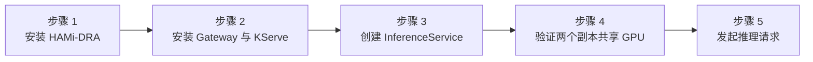

本实验通过原生动态资源分配（DRA）把 KServe 模型服务与 HAMi GPU 共享结合起来。KServe 负责管理 vLLM 推理服务，HAMi 负责为每个 Predictor Pod 分配显存和算力。你将通过两份独立的 `ResourceClaim`，让两个 Predictor 副本共享同一张 Tesla T4，并分别获得 `3 GiB` 显存和 `20` 算力配额。

文中的实测环境为 Kubernetes 1.36.1、KServe 0.18.0、HAMi-DRA 0.2.1，以及一张 15 GiB Tesla T4。

:::warning 版本相关 API

本实验使用 KServe 0.18 的原生 DRA 字段和 HAMi-DRA 0.2.1 Chart。KServe 和 HAMi-DRA 的 API 仍在演进，在其他版本上应用这些清单前请先查看对应的发布说明。

:::

## 你将学到什么

- 检查集群是否已经暴露 GPU 和 DRA 容量；
- 使用 Gateway API 和 Envoy Gateway 安装 KServe Standard 模式；
- 使用 KServe Storage Initializer 下载公开的 Qwen 模型；
- 使用 HAMi 原生 `ResourceClaimTemplate` 声明显存与算力；
- 验证两个 KServe Predictor 副本共享同一张物理 GPU，并且各自只能看到 3 GiB 显存。

## 实验概览



## 前提条件

- Kubernetes 1.34 或更高版本的集群，并且至少有一个 NVIDIA GPU 节点。实测节点使用 15 GiB Tesla T4。
- 已安装 Helm 3、`kubectl`、`curl` 和 `python3`。
- GPU Operator 或等价组件已提供 NVIDIA Driver 和 GPU Feature Discovery 标签。
- NVIDIA Device Plugin 已关闭。本实验由 HAMi 接管 GPU 设备路径。
- 具有集群管理员权限。本实验会创建 CRD、GatewayClass 和集群级 DRA 资源。
- 集群可以访问 Hugging Face，以便 KServe 下载公开的 Qwen 模型。
- 集群可以访问 `docker.io` 和 `ghcr.io` OCI 镜像仓库，或配置等价镜像站，以拉取 Envoy Gateway、KServe Chart 及其镜像。
- GPU 节点有足够的临时存储空间存放模型文件和容器镜像。开始前请通过节点访问方式检查，例如执行 `df -h /var/lib/containerd /var/lib/kubelet`。
- 控制面与 kubelet 已启用 DRA Consumable Capacity。尚未启用时，请参考[实验 4 的功能门控步骤](./hami-dra.md#步骤-1-启用-draconsumablecapacity-feature-gate)。
- 容器运行时已启用 CDI 与 NVIDIA volume mount。GPU Operator 用户可以参考[实验 4 的容器运行时配置](./hami-dra.md#步骤-2-配置容器运行时)。
- 已获取 [`tutorials/labs/examples/11-kserve-hami-dra/`](https://github.com/Project-HAMi/website/tree/master/tutorials/labs/examples/11-kserve-hami-dra) 中的实验清单。

开始前检查节点：

```bash
kubectl get nodes -o 'custom-columns=NAME:.metadata.name,GPU:.status.allocatable.nvidia\.com/gpu'
kubectl get nodes -l nvidia.com/gpu.product
```

## 步骤 1: 安装 cert-manager 与 HAMi-DRA

HAMi-DRA 和 KServe 的 Webhook 都使用 cert-manager，安装一次即可：

```bash
helm repo add cert-manager https://charts.jetstack.io
helm repo update

helm upgrade --install cert-manager cert-manager/cert-manager \
  --namespace cert-manager --create-namespace \
  --version v1.21.0 \
  --set crds.enabled=true \
  --wait --timeout=10m
```

安装实测版本的 HAMi-DRA Chart，并为 GPU 节点添加标签。`GPU_NODE` 必须替换为实际节点名：

```bash
helm repo add hami-dra https://project-hami.github.io/HAMi-DRA/
helm repo update

export GPU_NODE=$(kubectl get nodes -l nvidia.com/gpu.product=Tesla-T4 \
  -o jsonpath='{.items[0].metadata.name}')
if [ -z "${GPU_NODE}" ]; then
  echo "未找到 Tesla-T4 GPU 节点。请将 GPU_NODE 设置为可用的 GPU 节点后再继续。" >&2
  exit 1
fi
echo "GPU_NODE=${GPU_NODE}"
kubectl label node "${GPU_NODE}" gpu=on --overwrite

helm upgrade --install hami-dra hami-dra/hami-dra \
  --namespace hami-system --create-namespace \
  --version 0.2.1 \
  --wait --timeout=10m
```

如果 NVIDIA Driver 直接安装在宿主机上，还要增加 `--set drivers.nvidia.containerDriver=false`。检查驱动和它发布的容量：

```bash
kubectl get pods -n hami-system
kubectl get deviceclass,resourceslice
kubectl get resourceslice -o jsonpath='{.items[0].spec.devices[0]}' | python3 -m json.tool
```

设备应包含 `allowMultipleAllocations: true`、`memory: 15Gi` 和 `cores: 100`。两个 Predictor Claim 都会从这个容量池中扣减资源。

## 步骤 2: 安装 Envoy Gateway 与 KServe

安装 Envoy Gateway。实测集群没有云 LoadBalancer，因此清单将 Envoy Service 配置为 NodePort：

```bash
helm upgrade --install eg \
  oci://docker.io/envoyproxy/gateway-helm \
  --version v1.8.2 \
  --namespace envoy-gateway-system --create-namespace \
  --wait --timeout=10m

kubectl apply -f tutorials/labs/examples/11-kserve-hami-dra/01-gateway.yaml
kubectl wait --for=condition=Programmed \
  gateway/kserve-ingress-gateway -n kserve --timeout=5m
```

安装 KServe CRD、Controller 和默认 Runtime，并选择 Standard 模式：

```bash
helm upgrade --install kserve-crd \
  oci://ghcr.io/kserve/charts/kserve-crd \
  --version v0.18.0 --namespace kserve --create-namespace \
  --wait --timeout=10m

helm upgrade --install kserve \
  oci://ghcr.io/kserve/charts/kserve-resources \
  --version v0.18.0 --namespace kserve \
  --set kserve.controller.deploymentMode=Standard \
  --set kserve.controller.gateway.disableIstioVirtualHost=true \
  --set kserve.controller.gateway.ingressGateway.enableGatewayApi=true \
  --set kserve.controller.gateway.ingressGateway.kserveGateway=kserve/kserve-ingress-gateway \
  --wait --timeout=10m

helm upgrade --install kserve-runtime-configs \
  oci://ghcr.io/kserve/charts/kserve-runtime-configs \
  --version v0.18.0 --namespace kserve \
  --set kserve.servingruntime.enabled=true \
  --set kserve.llmisvcConfigs.enabled=false \
  --wait --timeout=10m
```

确认 Hugging Face Runtime 已经创建：

```bash
kubectl get clusterservingruntime kserve-huggingfaceserver
```

为模型下载提高 Storage Initializer 的内存上限：

```bash
kubectl patch clusterstoragecontainer default --type=merge -p \
  '{"spec":{"container":{"resources":{"limits":{"memory":"4Gi"}}}}}'
```

## 步骤 3: 使用 HAMi 原生 Claim 创建 KServe 服务

应用 ResourceClaimTemplate 和 InferenceService：

```bash
kubectl apply -f tutorials/labs/examples/11-kserve-hami-dra/02-inference-service.yaml
kubectl wait --for=condition=Ready \
  inferenceservice/qwen-llm -n kserve-test --timeout=30m
```

KServe 会在模型容器启动前下载 `hf://Qwen/Qwen2.5-0.5B-Instruct`。GPU 共享的核心配置是 Predictor 与 Claim Template 之间的两级引用：

```yaml
predictor:
  minReplicas: 2
  resourceClaims:
    - name: gpu
      resourceClaimTemplateName: qwen-hami-gpu
  model:
    resources:
      claims:
        - name: gpu
```

模板申请一份包含 `3Gi` 显存和 `20` 算力的 HAMi 设备。KServe 将引用写入生成的 Deployment，Kubernetes 再为每个 Pod 创建独立的 ResourceClaim。不能把它替换成一个固定的 `resourceClaimName`，两个副本需要分别获得自己的 Claim。

检查 KServe 创建的资源：

```bash
kubectl get inferenceservice,deploy,pod,resourceclaim,httproute -n kserve-test
kubectl get resourceclaim -n kserve-test -o jsonpath='{range .items[*]}{.metadata.name}{" device="}{.status.allocation.devices.results[0].device}{" memory="}{.status.allocation.devices.results[0].consumedCapacity.memory}{" cores="}{.status.allocation.devices.results[0].consumedCapacity.cores}{"\n"}{end}'
```

两份 Claim 都应指向 `hami-gpu-0`，并分别显示 `3Gi` 和 `20`。

## 步骤 4: 验证共享 GPU 的显存上限

查看两个 Predictor Pod，确认它们被调度到同一节点：

```bash
kubectl get pod -n kserve-test \
  -l serving.kserve.io/inferenceservice=qwen-llm -o wide
```

分别在两个容器中执行 `nvidia-smi`：

```bash
for pod in $(kubectl get pod -n kserve-test \
  -l serving.kserve.io/inferenceservice=qwen-llm -o name); do
  kubectl exec -n kserve-test "${pod}" -- \
    nvidia-smi --query-gpu=name,memory.total --format=csv,noheader
done
```

预期输出：

```text
Tesla T4, 3072 MiB
Tesla T4, 3072 MiB
```

两个容器分别看到 3 GiB 的显存上限，而 Claim 状态表明两份分配都使用同一张物理 `hami-gpu-0`。DRA Driver 准备好设备后，HAMi-core 会把显存限制应用到容器内部。

## 步骤 5: 发起推理请求

读取 Envoy NodePort 和节点地址：

```bash
ENVOY_SERVICE=$(kubectl get service -n envoy-gateway-system \
  -l gateway.envoyproxy.io/owning-gateway-name=kserve-ingress-gateway \
  -o jsonpath='{.items[0].metadata.name}')
NODE_PORT=$(kubectl get service -n envoy-gateway-system "${ENVOY_SERVICE}" \
  -o jsonpath='{.spec.ports[?(@.port==80)].nodePort}')
NODE_IP=$(kubectl get node -o jsonpath='{.items[0].status.addresses[?(@.type=="InternalIP")].address}')
export GATEWAY_ADDR="${NODE_IP}:${NODE_PORT}"
INFERENCE_HOST=$(kubectl get inferenceservice qwen-llm -n kserve-test \
  -o jsonpath='{.status.url}' | sed -E 's#^https?://##')
```

通过 KServe HTTPRoute 调用 OpenAI 兼容接口：

```bash
curl -H "Host: ${INFERENCE_HOST}" \
  -H 'Content-Type: application/json' \
  "http://${GATEWAY_ADDR}/openai/v1/chat/completions" \
  -d '{
    "model": "qwen",
    "messages": [{"role": "user", "content": "Answer only with the number: 2+3"}],
    "max_tokens": 8,
    "temperature": 0
  }'
```

成功返回 `chat.completion`，说明完整链路已经打通：

```text
Client -> Envoy Proxy -> HTTPRoute -> Predictor Service -> HuggingFaceServer -> vLLM -> HAMi GPU 切片
```

## 清理

先删除推理服务。如果集群只用于本实验，再删除 Gateway 和各个 Controller：

```bash
kubectl delete -f tutorials/labs/examples/11-kserve-hami-dra/02-inference-service.yaml
kubectl delete -f tutorials/labs/examples/11-kserve-hami-dra/01-gateway.yaml
helm uninstall kserve-runtime-configs kserve kserve-crd -n kserve
helm uninstall eg -n envoy-gateway-system
helm uninstall hami-dra -n hami-system
```

## 本实验验证了什么

| 结论 | 证据 |
| --- | --- |
| KServe 可以直接使用原生 DRA Claim | 生成的 Deployment 同时包含 `resourceClaims` 和容器级 `resources.claims` |
| HAMi 可以让多个 KServe 副本共享同一张物理 GPU | 两份独立生成的 Claim 都分配到 `hami-gpu-0` |
| 容量限制已经进入容器 | 两个 Predictor 容器中的 `nvidia-smi` 都显示 `3072 MiB` |
| 共享 GPU 后推理链路仍然可用 | 通过 Envoy Gateway 成功返回 OpenAI 兼容的 Chat Completion |

## 下一步

- 需要固定模型版本时，在 Hugging Face URI 中指定 revision。
- 把 Claim 调整为 `6Gi` 和 `40` 算力，再观察 `ResourceSlice` 剩余容量和 Claim 状态。
- 与[实验 4](./hami-dra.md)对比，后者直接在 Pod 层使用 Claim，没有模型服务 Controller。
