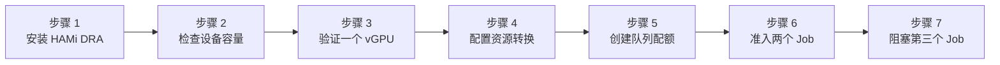

本实验把 HAMi GPU 切分与 Kueue 准入控制接到一起。HAMi 为 Pod 分配显存和算力切片，Kueue 在 Job 准入前统计这些切片。你将提交三个相同规格的 Job：前两个正常运行，第三个因为 vGPU、显存和算力配额已经用完而保持挂起。

文中的输出来自一套实际环境：Kubernetes 1.36.1、containerd 2.2.4、Kueue 0.18.1、HAMi 2.9.0，GPU 为一张 15 GiB Tesla T4。

:::warning 版本相关的 API

本实验使用 Kueue 0.18.1 提供的 `v1beta2` API 和 `ResourceTransformation` 配置。若使用其他 Kueue 版本，请先核对对应版本的发布说明。

:::

## 你将学到什么

- 以 DRA 兼容模式安装 HAMi 2.9.0；
- 验证 `4 GiB / 50%` 扩展资源请求如何转换为 DRA `ResourceClaim`；
- 把 HAMi 按单个 vGPU 表达的显存和算力请求转换成 Kueue 总量配额；
- 在准入阶段挂起超额 Job，避免 Pod 进入调度阶段后才 Pending。

## 实验概览



## 前提条件

- Kubernetes 1.36 集群，已安装 Kueue 0.18.1，并启用 `batch/job` 集成。
- 一个 NVIDIA GPU 节点。本文验证环境使用 15 GiB Tesla T4。
- GPU Operator 或等价组件已提供 NVIDIA 驱动和 GPU Feature Discovery 标签。
- NVIDIA Device Plugin 已关闭。本实验由 HAMi 接管 GPU 设备路径。
- 有权限安装集群级资源、编辑 Kueue manager 配置的 `kubectl` 和 Helm 环境。
- 已安装 cert-manager，HAMi DRA webhook 需要用它签发 TLS 证书。
- [`tutorials/labs/examples/09-kueue-hami-vgpu/`](https://github.com/Project-HAMi/website/tree/master/tutorials/labs/examples/09-kueue-hami-vgpu) 中的实验清单。

如果 GPU Operator 管理 GPU 节点，安装或升级时需关闭它的 device plugin：

```text
--set devicePlugin.enabled=false
```

## 步骤 1: 以 DRA 兼容模式安装 HAMi

创建实验命名空间。通过 GPU Feature Discovery 标签选择 T4 节点，不要照抄验证环境里的节点名，然后为 HAMi 添加标签：

```bash
kubectl create namespace hami-kueue-demo
export GPU_NODE=$(kubectl get nodes -l nvidia.com/gpu.product=Tesla-T4 \
  -o jsonpath='{.items[0].metadata.name}')
test -n "${GPU_NODE}" && echo "GPU_NODE=${GPU_NODE}"
kubectl label node "${GPU_NODE}" gpu=on --overwrite
```

安装 HAMi 2.9.0，开启 DRA，关闭传统 device plugin：

```bash
helm repo add hami-charts https://project-hami.github.io/HAMi/
helm repo update

helm install hami hami-charts/hami \
  --namespace hami-system \
  --create-namespace \
  --version 2.9.0 \
  --set dra.enabled=true \
  --set devicePlugin.enabled=false
```

:::important

不要同时开启 HAMi DRA 和传统 device plugin 模式。如果 NVIDIA 驱动直接安装在主机上，而不是由 GPU Operator 管理，还需设置 `hami-dra.drivers.nvidia.containerDriver=false`。

:::

等待三个 DRA 组件启动：

```bash
kubectl get pods -n hami-system
```

```plaintext
NAME                                     READY   STATUS
hami-dra-driver-kubelet-plugin-fb4zm     1/1     Running
hami-hami-dra-monitor-7b8df84bd-jsjrd    1/1     Running
hami-hami-dra-webhook-7bb65cbcc5-g5742   1/1     Running
```

## 步骤 2: 检查 HAMi 发布的 GPU 容量

HAMi 会发布一个 `DeviceClass` 和一个节点级 `ResourceSlice`：

```bash
kubectl get deviceclass,resourceslice
```

```plaintext
NAME                                                        AGE
deviceclass.resource.k8s.io/hami-core-gpu.project-hami.io   32m

NAME                                                                              NODE            DRIVER
resourceslice.resource.k8s.io/lixd-test-gpu-hami-core-gpu.project-hami.io-2drs2   lixd-test-gpu   hami-core-gpu.project-hami.io
```

查看设备容量：

```bash
kubectl get resourceslice \
  -o jsonpath='{.items[0].spec.devices[0]}' | python3 -m json.tool
```

验证环境中的 T4 包含以下字段：

```json
{
  "allowMultipleAllocations": true,
  "capacity": {
    "cores": { "value": "100" },
    "memory": { "value": "15Gi" }
  },
  "name": "hami-gpu-0"
}
```

`allowMultipleAllocations: true` 表示同一张物理 GPU 可以分配给多个 Claim，直到显存或算力容量用完。

## 步骤 3: 验证一个 HAMi vGPU 切片

兼容模式允许现有业务继续使用 HAMi 扩展资源。下面的请求表示一个 vGPU、4096 MiB 显存和 50% 算力：

```bash
kubectl apply -f tutorials/labs/examples/09-kueue-hami-vgpu/01-smoke-pod.yaml
kubectl wait -n hami-kueue-demo \
  --for=condition=Ready pod/hami-compatible-smoke --timeout=5m
```

HAMi webhook 会把请求转换成 DRA Claim：

```bash
kubectl get resourceclaim -n hami-kueue-demo \
  hami-kueue-demo-hami-compatible-smoke-cuda \
  -o jsonpath='{.status.allocation.devices.results[0]}' | python3 -m json.tool
```

```json
{
  "consumedCapacity": {
    "cores": "50",
    "memory": "4Gi"
  },
  "device": "hami-gpu-0",
  "driver": "hami-core-gpu.project-hami.io"
}
```

容器中可以看到切分后的显存上限：

```bash
kubectl exec -n hami-kueue-demo hami-compatible-smoke -- nvidia-smi
```

```plaintext
|   0  Tesla T4  ...  |       0MiB /   4096MiB |      0%      Default |
```

删除 smoke Pod，避免它影响后面的队列测试：

```bash
kubectl delete pod -n hami-kueue-demo hami-compatible-smoke
```

## 步骤 4: 配置 Kueue 资源转换

HAMi 的 `gpumem` 和 `gpucores` 按单个 vGPU 表达，Kueue 需要统计总量。两个相同 Job 各申请一个 vGPU、4096 MiB 和 50% 算力时，总用量为：

```text
vGPU 实例数：2
显存总量：  2 x 4096 MiB = 8192 MiB
算力总量：  2 x 50 = 100
```

编辑 Kueue manager 配置：

```bash
kubectl edit configmap kueue-manager-config -n kueue-system
```

在 `controller_manager_config.yaml` 的现有 `Configuration` 文档中加入 `resources.transformations`：

```yaml
apiVersion: config.kueue.x-k8s.io/v1beta2
kind: Configuration
integrations:
  frameworks:
    - batch/job
resources:
  transformations:
    - input: nvidia.com/gpumem
      strategy: Replace
      outputs:
        nvidia.com/total-gpumem: 1
      multiplyBy: nvidia.com/gpu
    - input: nvidia.com/gpucores
      strategy: Replace
      outputs:
        nvidia.com/total-gpucores: 1
      multiplyBy: nvidia.com/gpu
```

保留原有配置的其余部分。重启 Kueue，并等待 rollout 完成：

```bash
kubectl rollout restart deployment/kueue-controller-manager -n kueue-system
kubectl rollout status deployment/kueue-controller-manager -n kueue-system
```

```plaintext
deployment "kueue-controller-manager" successfully rolled out
```

`Replace` 会从 Kueue 记账中移除按设备表达的输入资源；`multiplyBy: nvidia.com/gpu` 根据 vGPU 实例数计算显存和算力总量。

## 步骤 5: 创建 Kueue 配额

本实验的队列允许两个 vGPU 实例、8192 MiB 显存总量和 100 点算力总量：

```bash
kubectl apply -f tutorials/labs/examples/09-kueue-hami-vgpu/02-queues.yaml
kubectl get resourceflavor,clusterqueue
kubectl get localqueue -n hami-kueue-demo
```

```plaintext
NAME                                          AGE
resourceflavor.kueue.x-k8s.io/hami-t4         8s

NAME                                      COHORT   PENDING WORKLOADS   ADMITTED WORKLOADS
clusterqueue.kueue.x-k8s.io/hami-cq                 0                   0

NAME                                    CLUSTERQUEUE   PENDING WORKLOADS   ADMITTED WORKLOADS
localqueue.kueue.x-k8s.io/hami-queue    hami-cq       0                   0
```

显存配额以 MiB 为单位，与工作负载里的 `nvidia.com/gpumem: 4096` 一致。`ResourceFlavor` 的节点标签必须与 GPU 节点匹配；如果不是 T4，请修改清单中的 `Tesla-T4`。

## 步骤 6: 准入两个 vGPU Job

创建三个相同规格的 Job：

```bash
kubectl apply -f tutorials/labs/examples/09-kueue-hami-vgpu/03-jobs.yaml
kubectl get job,workload -n hami-kueue-demo
```

```plaintext
NAME                             STATUS
job.batch/hami-kueue-running-a   Running
job.batch/hami-kueue-running-b   Running
job.batch/hami-kueue-pending-c   Suspended

NAME                                                     QUEUE        RESERVED IN   ADMITTED
workload.kueue.x-k8s.io/job-hami-kueue-running-a-59997   hami-queue   hami-cq       True
workload.kueue.x-k8s.io/job-hami-kueue-running-b-9d737   hami-queue   hami-cq       True
workload.kueue.x-k8s.io/job-hami-kueue-pending-c-d854d   hami-queue
```

查看任意一个已准入 Workload：

```bash
kubectl get workload -n hami-kueue-demo \
  -l kueue.x-k8s.io/job-name=hami-kueue-running-a \
  -o jsonpath='{.items[0].status.admission.podSetAssignments[0].resourceUsage}' \
  | python3 -m json.tool
```

```json
{
  "nvidia.com/gpu": "1",
  "nvidia.com/total-gpucores": "50",
  "nvidia.com/total-gpumem": "4096"
}
```

HAMi 分配 DRA Claim、Pod 进入常规调度之前，Kueue 已经扣除了三项配额。

## 步骤 7: 验证第三个 Job 留在队列中

查看 ClusterQueue 用量：

```bash
kubectl get clusterqueue hami-cq -o yaml
```

```yaml
status:
  admittedWorkloads: 2
  flavorsUsage:
    - name: hami-t4
      resources:
        - name: nvidia.com/gpu
          total: "2"
        - name: nvidia.com/total-gpucores
          total: "100"
        - name: nvidia.com/total-gpumem
          total: "8192"
  pendingWorkloads: 1
```

Pending Workload 同时记录了转换后的请求和未准入原因：

```bash
kubectl get workload -n hami-kueue-demo \
  -l kueue.x-k8s.io/job-name=hami-kueue-pending-c -o yaml
```

```yaml
status:
  conditions:
    - reason: Pending
      message: >-
        couldn't assign flavors to pod set main: insufficient unused quota for nvidia.com/gpu in flavor hami-t4, 1 more needed, insufficient unused quota for nvidia.com/total-gpucores in flavor hami-t4, 50 more needed


  resourceRequests:
    - resources:
        nvidia.com/gpu: "1"
        nvidia.com/total-gpucores: "50"
        nvidia.com/total-gpumem: "4096"
```

第三个 Job 保持 `Suspended`，不会创建 Pod 去竞争已经用完的 GPU 容量。

## 清理

删除工作负载和队列资源：

```bash
kubectl delete -f tutorials/labs/examples/09-kueue-hami-vgpu/03-jobs.yaml
kubectl delete -f tutorials/labs/examples/09-kueue-hami-vgpu/02-queues.yaml
kubectl delete namespace hami-kueue-demo
```

从 `kueue-manager-config` 删除两项 `resources.transformations`，然后重启 Kueue：

```bash
kubectl edit configmap kueue-manager-config -n kueue-system
kubectl rollout restart deployment/kueue-controller-manager -n kueue-system
kubectl rollout status deployment/kueue-controller-manager -n kueue-system
```

如果集群只用于本实验，可以卸载 HAMi：

```bash
helm uninstall hami -n hami-system
kubectl delete namespace hami-system
```

## 本实验验证了什么

| 结论 | 证据 |
| --- | --- |
| HAMi 把扩展资源请求转换成 DRA 分配 | 生成的 `ResourceClaim` 从 `hami-gpu-0` 消耗 `4Gi` 显存和 `50` cores |
| vGPU 显存上限进入了容器 | `nvidia-smi` 显示 4096 MiB 上限 |
| Kueue 把单个 vGPU 资源折算成总量 | 每个已准入 Workload 使用一个 vGPU、4096 MiB 总显存和 50 点总算力 |
| 队列准入阻止了超额任务 | 两个 Job 运行，第三个因配额不足保持挂起 |

## 后续练习

- 只调整显存配额，观察最先触发阻塞的配额维度。
- 为不同团队创建独立 `ClusterQueue`，分配不同的 GPU 预算。
- 对比 [实验 4](./hami-dra.md) 中直接使用 `ResourceClaim` 的原生 DRA 流程。
