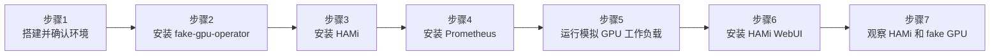

import Tabs from '@theme/Tabs'; import TabItem from '@theme/TabItem';

本实验将引导你搭建一个纯本地 Kubernetes 集群，使用 **OrbStack**（macOS）或 **kind**（Linux/Ubuntu），配合 [run-ai/fake-gpu-operator](https://github.com/run-ai/fake-gpu-operator)，然后在线安装 HAMi。

这个实验不需要真实 NVIDIA GPU，适合用于课堂预习、讲解 HAMi 组件组成、验证 GPU Pod 调度流程，以及在个人电脑上快速熟悉 HAMi 的基础使用方式。

## 你将得到什么

完成本实验后，你会得到一个本地 Kubernetes 集群：

- fake-gpu-operator 在 CPU 节点上模拟 `nvidia.com/gpu` 资源
- HAMi scheduler、admission webhook 等控制面组件正常运行
- 普通 Pod 可以通过 `nvidia.com/gpu` 申请模拟 GPU
- 可以观察 fake GPU 资源从节点发现、Pod 申请、调度到运行的完整链路

:::note

fake GPU 不能代表真实 GPU 的显存隔离、算力隔离、CUDA 运行时和驱动能力。本实验用于理解 HAMi 组成和基础调度链路；涉及真实显存切分、`nvidia.com/gpumem`、`nvidia.com/gpucores`、CUDA 程序运行和性能隔离时，仍需要真实 NVIDIA GPU 环境。

:::

## 安装全景图

整个本地安装过程分 7 步：



| 步骤 | 目的 | 解决什么问题 |
| --- | --- | --- |
| 搭建并确认环境 | 创建/验证集群，检查 kubectl 和 Helm | 确保 Kubernetes 集群可用 |
| 安装 fake-gpu-operator | 模拟 NVIDIA GPU 资源 | 让无 GPU 节点也能上报 `nvidia.com/gpu` |
| 安装 HAMi | 部署 HAMi 控制面 | 观察 HAMi scheduler、webhook 等组件 |
| 安装 Prometheus | 部署监控栈 | 采集 GPU 指标，给 HAMi WebUI 提供数据源 |
| 运行模拟 GPU 工作负载 | 验证调度链路 | 体验 Pod 申请 GPU 后被调度运行 |
| 安装 HAMi WebUI | 部署可视化管理界面 | 图形化查看 GPU 节点、资源分配和使用趋势 |
| 观察 HAMi 和 fake GPU | 理解组件职责边界 | 明确哪些能力需要真实 GPU |

## 前提条件

<Tabs groupId="os">
<TabItem value="macos" label="macOS (OrbStack)" default>

- macOS，Intel 或 Apple Silicon 均可
- 已安装 [OrbStack](https://orbstack.dev/) 并启用内置 Kubernetes
- 能访问 GitHub、GHCR 和 HAMi Helm 仓库
- 本机至少 4 CPU、8 GB 内存可用

:::tip[为什么用 OrbStack？]

OrbStack 自带 Kubernetes（基于 k3s），无需额外安装 kind 或 Docker Desktop。资源占用更少，启动更快，macOS 上做本地实验首选。

:::

检查 Helm（后面安装 fake-gpu-operator 和 HAMi 都需要）：

```bash
helm version
```

如果 Helm 未安装：

```bash
brew install helm
```

</TabItem>
<TabItem value="linux" label="Linux (Ubuntu + kind)">

- Ubuntu 20.04 LTS 或更高版本，x86_64 或 ARM64
- 已安装 [Docker Engine](https://docs.docker.com/engine/install/ubuntu/) 且正在运行
- 已安装 [`kind`](https://kind.sigs.k8s.io/docs/user/quick-start/#installation) v0.20.0 或更高版本
- 已安装 [`kubectl`](https://kubernetes.io/docs/tasks/tools/install-kubectl-linux/)
- 已安装 [Helm](https://helm.sh/docs/intro/install/) 3.x 或更高版本
- 能访问 GitHub、GHCR 和 HAMi Helm 仓库
- 本机至少 4 CPU、8 GB 内存可用

:::tip[为什么用 kind？]

kind（Kubernetes IN Docker）在 Docker 容器内运行完整的 Kubernetes 集群。它适用于任何安装了 Docker 的 Linux 发行版，无需特殊系统集成，是 Linux 上本地 Kubernetes 开发的标准工具。

:::

如需安装前置依赖，请执行以下命令：

```bash
# Docker Engine
curl -fsSL https://get.docker.com | sudo sh
sudo usermod -aG docker $USER
newgrp docker

# kind
KIND_VERSION=v0.23.0
curl -Lo ./kind "https://kind.sigs.k8s.io/dl/${KIND_VERSION}/kind-linux-amd64"
chmod +x ./kind && sudo mv ./kind /usr/local/bin/kind

# kubectl
curl -LO "https://dl.k8s.io/release/$(curl -L -s https://dl.k8s.io/release/stable.txt)/bin/linux/amd64/kubectl"
sudo install -o root -g root -m 0755 kubectl /usr/local/bin/kubectl && rm kubectl

# Helm
curl https://raw.githubusercontent.com/helm/helm/main/scripts/get-helm-3 | bash
```

</TabItem>
</Tabs>

## 步骤 1: 搭建并确认本地环境

<Tabs groupId="os">
<TabItem value="macos" label="macOS" default>

OrbStack 的 Kubernetes 在你通过 OrbStack UI 启用后会自动运行。验证集群是否就绪：

```bash
kubectl version
```

输出示例：

```plaintext
Client Version: v1.33.9
Kustomize Version: v5.6.0
Server Version: v1.33.9+orb1
```

:::note

`Server Version` 中的 `+orb1` 后缀标识这是 OrbStack 内置的 Kubernetes 发行版。

:::

查看集群节点：

```bash
kubectl get nodes -o wide
```

输出示例：

```plaintext
NAME       STATUS   ROLES                  AGE    VERSION        INTERNAL-IP     EXTERNAL-IP   OS-IMAGE   KERNEL-VERSION                            CONTAINER-RUNTIME
orbstack   Ready    control-plane,master   148d   v1.33.9+orb1   192.168.139.2   <none>        OrbStack   7.0.5-orbstack-00330-ge3df4e19b0a0-dirty  docker://29.4.0
```

</TabItem>
<TabItem value="linux" label="Linux">

创建本地 Kubernetes 集群：

```bash
kind create cluster --name hami-lab
```

输出示例：

```plaintext
Creating cluster "hami-lab" ...
 ✓ Ensuring node image (kindest/node:v1.32.2) 🖼
 ✓ Preparing nodes 📦
 ✓ Writing configuration 📜
 ✓ Starting control-plane 🕹️
 ✓ Installing CNI 🔌
 ✓ Installing StorageClass 💾
Set kubectl context to "kind-hami-lab"
```

:::note

`--name hami-lab` 标志指定了集群名称。生成的节点将命名为 `hami-lab-control-plane`。kind 会自动将 kubectl 上下文设置为新集群。

:::

验证集群是否就绪：

```bash
kubectl version
```

输出示例：

```plaintext
Client Version: v1.32.2
Kustomize Version: v5.5.0
Server Version: v1.32.2
```

查看集群节点：

```bash
kubectl get nodes -o wide
```

输出示例：

```plaintext
NAME                     STATUS   ROLES           AGE   VERSION   INTERNAL-IP   EXTERNAL-IP   OS-IMAGE                        KERNEL-VERSION      CONTAINER-RUNTIME
hami-lab-control-plane   Ready    control-plane   2m    v1.32.2   172.18.0.2    <none>        Debian GNU/Linux 12 (bookworm)  6.5.0-41-generic    containerd://1.7.18
```

</TabItem>
</Tabs>

### 设置 NODE_NAME 变量

本实验后续部分使用 `NODE_NAME` shell 变量来避免硬编码节点名称。在这里设置一次，后续所有命令都会自动使用：

```bash
NODE_NAME=$(kubectl get nodes -o jsonpath='{.items[0].metadata.name}')
echo "NODE_NAME=${NODE_NAME}"
```

| 平台  | 示例值                   |
| ----- | ------------------------ |
| macOS | `orbstack`               |
| Linux | `hami-lab-control-plane` |

---

:::info[步骤 2–7 在两个平台上完全相同]

从这里开始，所有命令在 macOS 和 Linux 上完全一致。你唯一会注意到的区别是示例输出中的节点名称。

:::

## 步骤 2: 安装 fake-gpu-operator

fake-gpu-operator 会在没有 NVIDIA GPU 的节点上模拟 GPU 资源，并把节点容量写成 `nvidia.com/gpu`。这一步替代了真实 GPU 环境中的 NVIDIA GPU Operator、驱动、device-plugin 和 DCGM 指标采集链路。

### 2.1 创建命名空间并设置安全策略

```bash
kubectl create namespace gpu-operator
kubectl label namespace gpu-operator pod-security.kubernetes.io/enforce=privileged
```

```plaintext
namespace/gpu-operator created
namespace/gpu-operator labeled
```

> `gpu-operator` 命名空间专门放 fake-gpu-operator 相关组件。`privileged` 标签允许 Pod 以特权模式运行；fake-gpu-operator 的 device-plugin 需要访问宿主机设备文件。

### 2.2 给节点打标签

fake-gpu-operator 通过节点标签来决定在哪些节点上模拟 GPU：

```bash
kubectl label node ${NODE_NAME} run.ai/simulated-gpu-node-pool=default
```

```plaintext
node/<NODE_NAME> labeled
```

> 标签 `run.ai/simulated-gpu-node-pool=default` 告诉 fake-gpu-operator："在这个节点上模拟 GPU"。

### 2.3 安装 fake-gpu-operator

```bash
export FAKE_GPU_OPERATOR_VERSION=0.0.80

helm upgrade -i gpu-operator \
    oci://ghcr.io/run-ai/fake-gpu-operator/fake-gpu-operator \
    --namespace gpu-operator \
    --create-namespace \
    --version ${FAKE_GPU_OPERATOR_VERSION}
```

```plaintext
Release "gpu-operator" does not exist. Installing it now.
Pulled: ghcr.io/run-ai/fake-gpu-operator/fake-gpu-operator:0.0.80
Digest: sha256:...
NAME: gpu-operator
LAST DEPLOYED: ...
NAMESPACE: gpu-operator
STATUS: deployed
REVISION: 1
TEST SUITE: None
```

> `helm upgrade -i`：如果 release 不存在则安装，存在则升级。`oci://` 前缀表示从 GitHub Container Registry 拉取 Helm Chart。`0.0.80` 是 2026-04 发布的稳定版本。

### 2.4 等待组件运行

```bash
kubectl get pods -n gpu-operator
```

输出示例：

```plaintext
NAME                                       READY   STATUS    RESTARTS   AGE
device-plugin-l8m6j                        1/1     Running   0          31m
kwok-gpu-device-plugin-5996cdf4f9-mfvpm    1/1     Running   0          31m
nvidia-dcgm-exporter-knfsn                 1/1     Running   0          31m
nvidia-dcgm-exporter-kwok-b8fd4976-blb8c   1/1     Running   0          31m
status-updater-59965d7bc6-fbkmk            1/1     Running   0          31m
topology-server-9d57b6c79-7dv6h            1/1     Running   0          31m
```

> 各组件说明：
>
> - `device-plugin`：DaemonSet，在每个 GPU 节点上运行，向 Kubernetes 上报 GPU 资源
> - `kwok-gpu-device-plugin`：用 KWOK（Kubernetes WithOut Kubelet）模拟 GPU 设备
> - `nvidia-dcgm-exporter`：模拟 DCGM 指标导出（GPU 温度、利用率等）
> - `status-updater`：更新节点 GPU 状态
> - `topology-server`：管理 GPU 拓扑信息

如果所有 Pod 都 `Running` 且 `READY` 为 `1/1`，说明安装成功。

### 2.5 验证模拟 GPU 资源

检查节点是否上报了 GPU 容量：

```bash
kubectl get node ${NODE_NAME} \
    -o custom-columns=NAME:.metadata.name,GPU:.status.capacity.nvidia\\.com/gpu
```

```plaintext
NAME       GPU
orbstack   2
```

> `GPU` 列显示 `2`，说明 fake-gpu-operator 已经在节点上模拟了 2 块 GPU。这个数字可以在 fake-gpu-operator 配置中调整。

进一步查看节点的 GPU 详细标签：

```bash
kubectl get node ${NODE_NAME} --show-labels | tr ',' '\n' | grep -E 'nvidia.com/gpu|run.ai'
```

```plaintext
nvidia.com/gpu.count=2
nvidia.com/gpu.deploy.dcgm-exporter=true
nvidia.com/gpu.deploy.device-plugin=true
nvidia.com/gpu.memory=11441
nvidia.com/gpu.present=true
nvidia.com/gpu.product=Tesla-K80
run.ai/fake.gpu=true
run.ai/simulated-gpu-node-pool=default
```

> 这些标签模拟了一台真实 GPU 节点的信息：
>
> - `nvidia.com/gpu.count=2`：模拟 2 块 GPU
> - `nvidia.com/gpu.product=Tesla-K80`：模拟 GPU 型号为 Tesla K80
> - `nvidia.com/gpu.memory=11441`：模拟每块 GPU 有 11441 MiB 显存
> - `run.ai/fake.gpu=true`：标记这是模拟 GPU

如果 `GPU` 列为空，检查节点标签：

```bash
kubectl get node ${NODE_NAME} --show-labels | grep run.ai/simulated-gpu-node-pool
```

## 步骤 3: 安装 HAMi

本步骤安装 HAMi 的控制面组件：

- `hami-scheduler`：调度增强组件，参与 GPU Pod 的调度决策
- admission webhook：自动改写 GPU Pod 的调度器配置
- Helm release：统一管理 HAMi 相关 Kubernetes 资源

在 fake GPU 环境中，GPU 资源由 fake-gpu-operator 提供。为了避免两个 device-plugin 同时注册 `nvidia.com/gpu`，本实验不让 HAMi device-plugin 接管 fake 节点。

### 3.1 添加 HAMi Helm 仓库

```bash
helm repo add hami-charts https://project-hami.github.io/HAMi/
helm repo update
```

```plaintext
"hami-charts" has been added to your repositories
Hang tight while we grab the latest from your chart repositories...
...Successfully got an update from the "hami-charts" chart repository
Update Complete. ⎈Happy Helming!⎈
```

### 3.2 安装 HAMi

```bash
helm install hami hami-charts/hami \
    -n kube-system \
    --set devicePlugin.enabled=false
```

```plaintext
NAME: hami
LAST DEPLOYED: ...
NAMESPACE: kube-system
STATUS: deployed
REVISION: 1
TEST SUITE: None
```

> `--set devicePlugin.enabled=false` 是关键参数。因为 fake-gpu-operator 已经在管理 GPU 设备，如果 HAMi 的 device-plugin 也启动，两个组件会冲突。所以这里只安装 HAMi 的调度增强组件。

### 3.3 验证 HAMi 组件

```bash
kubectl get pods -n kube-system | grep hami
```

```plaintext
hami-scheduler-5d9678f989-dnf65          2/2     Running   0             28m
```

> `2/2` 表示这个 Pod 里有 2 个容器（scheduler 容器 + webhook 容器），都运行正常。

查看 HAMi 安装的控制面资源：

```bash
kubectl get deploy,svc,cm,sa -n kube-system | grep hami
```

```plaintext
deployment.apps/hami-scheduler           1/1     1            1           28m
service/hami-scheduler   NodePort    192.168.194.156   <none>        443:31998/TCP,31993:31993/TCP   28m
configmap/hami-scheduler                                         1      28m
configmap/hami-scheduler-device                                  1      28m
serviceaccount/hami-scheduler                                0         28m
```

> 各资源说明：
>
> - `deployment.apps/hami-scheduler`：HAMi 调度器 Deployment
> - `service/hami-scheduler`：调度器 Service，`NodePort` 类型，端口 `31998`（webhook）和 `31993`（调度）
> - `configmap/hami-scheduler`：调度器配置
> - `configmap/hami-scheduler-device`：设备配置
> - `serviceaccount/hami-scheduler`：调度器使用的服务账号

### 3.4 确认所有 Helm Release

```bash
helm list -A
```

```plaintext
NAME         NAMESPACE    REVISION UPDATED                              STATUS   CHART                    APP VERSION
gpu-operator gpu-operator 1        2026-05-21 16:12:01.872099 +0800 CST deployed fake-gpu-operator-0.0.80 0.0.80
hami         kube-system  1        2026-05-21 16:15:24.295479 +0800 CST deployed hami-2.9.0               2.9.0
```

> 两个 Helm Release 都 `deployed`。`gpu-operator` 在 `gpu-operator` 命名空间，`hami` 在 `kube-system` 命名空间。

## 步骤 4: 安装 Prometheus

HAMi WebUI 需要从 Prometheus 读取 GPU 指标数据。本步骤使用 [kube-prometheus-stack](https://github.com/prometheus-community/helm-charts/tree/main/charts/kube-prometheus-stack) 部署完整的监控栈。

> **为什么要装 Prometheus？** HAMi WebUI 的集群概览、GPU 利用率、显存使用率等图表数据全部来自 Prometheus。没有 Prometheus，WebUI 只能显示空白页面。

### 4.1 添加 Helm 仓库

```bash
helm repo add prometheus-community https://prometheus-community.github.io/helm-charts
helm repo update
```

### 4.2 安装 kube-prometheus-stack

```bash
helm install prometheus prometheus-community/kube-prometheus-stack \
    -n monitoring --create-namespace \
    --set grafana.enabled=false \
    --version=75.15.1
```

```plaintext
NAME: prometheus
LAST DEPLOYED: ...
NAMESPACE: monitoring
STATUS: deployed
REVISION: 1
```

> `--set grafana.enabled=false`：不安装 Grafana，本实验只用 Prometheus 作为 HAMi WebUI 的数据源。如果你需要 Grafana 做更丰富的可视化，可以去掉这个参数。

### 4.3 等待 Prometheus 就绪

```bash
kubectl get pods -n monitoring
```

输出示例：

```plaintext
NAME                                                     READY   STATUS    RESTARTS   AGE
alertmanager-prometheus-kube-prometheus-alertmanager-0   2/2     Running   0          2m
prometheus-kube-prometheus-operator-d89fb8945-htjjd      1/1     Running   0          2m
prometheus-kube-state-metrics-7f5f75c85d-mbsbh           1/1     Running   0          2m
prometheus-prometheus-kube-prometheus-prometheus-0       2/2     Running   0          2m
prometheus-prometheus-node-exporter-77pxd                1/1     Running   0          2m
```

> 所有 Pod `Running` 即可。其中 `prometheus-prometheus-kube-prometheus-prometheus-0` 是核心 Prometheus 实例。

### 4.4 创建 ServiceMonitor 采集 GPU 指标

kube-prometheus-stack 自带的 ServiceMonitor 不包含 fake-gpu-operator 的 GPU 指标。需要手动创建：

```bash
kubectl apply -f - <<'EOF'
apiVersion: monitoring.coreos.com/v1
kind: ServiceMonitor
metadata:
  name: nvidia-dcgm-exporter
  namespace: gpu-operator
  labels:
    release: prometheus
spec:
  selector:
    matchLabels:
      app: nvidia-dcgm-exporter
  namespaceSelector:
    matchNames:
      - gpu-operator
  endpoints:
    - port: gpu-metrics
      path: /metrics
      interval: 15s
EOF
```

```plaintext
servicemonitor.monitoring.coreos.com/nvidia-dcgm-exporter created
```

> ServiceMonitor 告诉 Prometheus："去 `gpu-operator` 命名空间找 label 为 `app: nvidia-dcgm-exporter` 的 Service，从它的 `gpu-metrics` 端口每 15 秒采集一次 `/metrics`"。`release: prometheus` label 是 kube-prometheus-stack 的 ServiceMonitor 选择器要求的。

等待约 30 秒后验证 GPU 指标已采集：

```bash
kubectl exec -n monitoring prometheus-prometheus-kube-prometheus-prometheus-0 -- \
    promtool query instant http://localhost:9090 'DCGM_FI_DEV_GPU_UTIL'
```

```plaintext
DCGM_FI_DEV_GPU_UTIL{..., device="nvidia1", ..., modelName="Tesla-K80", ...} => 0
DCGM_FI_DEV_GPU_UTIL{..., device="nvidia0", ..., modelName="Tesla-K80", ...} => 0
```

> 看到 `DCGM_FI_DEV_GPU_UTIL` 数据说明 Prometheus 已经在采集 fake GPU 指标了。利用率为 0 是正常的，当前没有真实 GPU 计算任务在运行。

## 步骤 5: 运行模拟 GPU 工作负载

验证 Kubernetes 可以把申请 `nvidia.com/gpu` 的 Pod 调度到 fake GPU 节点。fake-gpu-operator 会为 GPU Pod 注入模拟 `nvidia-smi` 工具，便于观察 GPU 可见性。

由于本实验没有启用 HAMi device-plugin，HAMi 不会写入真实环境中的 `hami.io/node-nvidia-register` 节点注册信息。因此测试 Pod 会显式绕过 HAMi webhook，使用 Kubernetes 默认调度器和 fake-gpu-operator 提供的模拟 GPU 资源。

### 5.1 创建测试 Pod

先看一下 Pod YAML：

```yaml
apiVersion: v1
kind: Pod
metadata:
  name: fake-gpu-pod
  labels:
    hami.io/webhook: ignore
  annotations:
    run.ai/simulated-gpu-utilization: "10-30"
spec:
  restartPolicy: Never
  containers:
    - name: app
      image: ubuntu:22.04
      command: ["bash", "-lc", "sleep 3600"]
      resources:
        requests:
          cpu: "100m"
          memory: "128Mi"
        limits:
          cpu: "500m"
          memory: "512Mi"
          nvidia.com/gpu: 1
      env:
        - name: NODE_NAME
          valueFrom:
            fieldRef:
              fieldPath: spec.nodeName
```

> YAML 要点：
>
> - `hami.io/webhook: ignore` 标签：告诉 HAMi webhook 不要拦截这个 Pod，使用默认调度器
> - `run.ai/simulated-gpu-utilization: "10-30"` 注解：fake-gpu-operator 会让 `nvidia-smi` 报告 10%-30% 的 GPU 利用率
> - `resources.limits.nvidia.com/gpu: 1`：申请 1 块 GPU
> - `sleep 3600`：让容器保持运行 1 小时，方便我们进入容器观察

创建 Pod：

```bash
kubectl apply -f fake-gpu-pod.yaml
```

```plaintext
pod/fake-gpu-pod created
```

### 5.2 等待 Pod 运行

```bash
kubectl get pod fake-gpu-pod -o wide
```

```plaintext
NAME           READY   STATUS    RESTARTS   AGE   IP               NODE       NOMINATED NODE   READINESS GATES
fake-gpu-pod   1/1     Running   0          7m    192.168.194.22   orbstack   <none>           <none>
```

> `STATUS` 为 `Running`，`NODE` 为你的节点名称，说明 Pod 成功调度到本地节点。如果第一次拉取 `ubuntu:22.04` 镜像，可能需要几十秒。

### 5.3 查看 Pod 的 GPU 资源申请

```bash
kubectl describe pod fake-gpu-pod | grep -A6 "Limits"
```

```plaintext
    Limits:
      nvidia.com/gpu:  1
    Requests:
      nvidia.com/gpu:  1
    Environment:
      NODE_NAME:   (v1:spec.nodeName)
```

> `Limits` 和 `Requests` 都是 `nvidia.com/gpu: 1`，说明这个 Pod 申请了 1 块 GPU。Kubernetes 只在 requests 和 limits 都设置了 `nvidia.com/gpu` 时才会把 Pod 调度到有 GPU 的节点。

### 5.4 查看节点的 GPU 资源分配情况

```bash
kubectl describe node ${NODE_NAME} | grep -A10 "Allocated resources"
```

```plaintext
Allocated resources:
  (Total limits may be over 100 percent, i.e., overcommitted.)
  Resource           Requests     Limits
  --------           --------     ------
  cpu                750m (7%)    1700m (17%)
  memory             870Mi (10%)  1996Mi (24%)
  ephemeral-storage  0 (0%)       0 (0%)
  nvidia.com/gpu     1            1
```

> `nvidia.com/gpu` 列显示 Requests 和 Limits 都是 `1`，说明已经有 1 块 GPU 被这个 Pod 占用。节点总共有 2 块 GPU，还可以再分配 1 块给其他 Pod。

### 5.5 执行模拟 nvidia-smi

这是最关键的验证步骤，在 Pod 内执行 `nvidia-smi`，看 fake-gpu-operator 是否成功注入了模拟 GPU 工具：

```bash
kubectl exec fake-gpu-pod -- nvidia-smi
```

```plaintext
Thu May 21 08:44:31 2026
+------------------------------------------------------------------------------+
| NVIDIA-SMI 470.129.06   Driver Version: 470.129.06   CUDA Version: 11.4      |
+--------------------------------+----------------------+----------------------+
| GPU  Name        Persistence-M | Bus-Id        Disp.A | Volatile Uncorr. ECC |
| Fan  Temp  Perf  Pwr:Usage/Cap |         Memory-Usage | GPU-Util  Compute M. |
|                                |                      |               MIG M. |
+--------------------------------+----------------------+----------------------+
|   0  Tesla-K80             Off | 00000001:00:00.0 Off |                  Off |
| N/A   33C    P8    11W /  70W  |  11441MiB / 11441MiB |      18%     Default |
|                                |                      |                  N/A |
+--------------------------------+----------------------+----------------------+

+------------------------------------------------------------------------------+
| Processes:                                                                   |
|  GPU   GI   CI        PID   Type   Process name                  GPU Memory  |
|        ID   ID                                                   Usage       |
+------------------------------------------------------------------------------+
|    0   N/A  N/A       23       G   sleep 3600                       11441MiB |
+------------------------------------------------------------------------------+
```

> 输出解读：
>
> - **Driver Version: 470.129.06**：模拟的 NVIDIA 驱动版本
> - **CUDA Version: 11.4**：模拟支持的 CUDA 版本
> - **GPU 0: Tesla-K80**：模拟的 GPU 型号，与节点标签 `nvidia.com/gpu.product=Tesla-K80` 一致
> - **11441MiB / 11441MiB**：显存使用/总量，与节点标签 `nvidia.com/gpu.memory=11441` 一致
> - **GPU-Util: 18%**：GPU 利用率，在注解 `run.ai/simulated-gpu-utilization: "10-30"` 指定的范围内
> - **Processes: sleep 3600, 11441MiB**：显示当前进程占用的 GPU 显存
>
> 这就是 fake-gpu-operator 的核心能力：在没有物理 GPU 的机器上，让容器看到 "好像有一块 GPU" 的环境。`nvidia-smi` 输出的所有数据都是模拟的。

## 步骤 6: 安装 HAMi WebUI

HAMi WebUI 提供图形化的 GPU 资源管理界面，可以查看节点 GPU 信息、资源分配率、使用趋势等。

### 6.1 添加 HAMi WebUI Helm 仓库

```bash
helm repo add hami-webui https://Project-HAMi.github.io/HAMi-WebUI/
helm repo update
```

### 6.2 给节点添加 GPU 标签

HAMi WebUI 通过节点标签 `gpu=on` 来发现 GPU 节点：

```bash
kubectl label node ${NODE_NAME} gpu=on
```

```plaintext
node/<NODE_NAME> labeled
```

### 6.3 添加模拟 GPU 注册信息

在真实环境中，HAMi device-plugin 会自动在节点上写入 `hami.io/node-nvidia-register` annotation，包含 GPU UUID、型号、显存等信息。由于本实验禁用了 device-plugin（避免与 fake-gpu-operator 冲突），需要手动添加：

```bash
kubectl annotate node ${NODE_NAME} \
  hami.io/node-nvidia-register='[{"id":"GPU-3cef3724-8228-5a66-b391-b0901788f5d0","count":10,"devmem":11441,"devcore":100,"type":"NVIDIA-Tesla-K80","mode":"hami-core","health":true},{"id":"GPU-5127182e-f297-5a25-bb44-0444c3be540c","index":1,"count":10,"devmem":11441,"devcore":100,"type":"NVIDIA-Tesla-K80","mode":"hami-core","health":true}]' \
  hami.io/node-handshake="Requesting_$(date '+%Y.%m.%d %H:%M:%S')"
```

> annotation 格式说明：每块 GPU 一个 JSON 对象，与 HAMi v2.9.0 device plugin 在真实 GPU 节点上写入的格式一致。`id` 是设备 UUID，`count` 是每张卡的 vGPU 切分数量（HAMi 默认 10），`devmem` 是显存（MiB），`devcore` 是算力容量（%），`mode` 为 `hami-core` 表示软件层切分。这里的 UUID 和显存值来自 fake-gpu-operator 的 dcgm-exporter 指标。

### 6.4 安装 HAMi WebUI

```bash
helm install my-hami-webui hami-webui/hami-webui \
    --set externalPrometheus.enabled=true \
    --set externalPrometheus.address="http://prometheus-kube-prometheus-prometheus.monitoring.svc.cluster.local:9090" \
    --set dcgm-exporter.enabled=false \
    -n kube-system
```

```plaintext
NAME: my-hami-webui
LAST DEPLOYED: ...
NAMESPACE: kube-system
STATUS: deployed
REVISION: 1
```

> 参数说明：
>
> - `externalPrometheus.enabled=true`：使用外部 Prometheus（即步骤 4 安装的 kube-prometheus-stack）
> - `externalPrometheus.address`：Prometheus 的集群内 Service 地址
> - `dcgm-exporter.enabled=false`：不安装额外的 dcgm-exporter，fake-gpu-operator 已经自带了

### 6.5 等待 WebUI 就绪

```bash
kubectl get pods -n kube-system | grep webui
```

```plaintext
my-hami-webui-85686fd65-77crx            2/2     Running   0          2m
```

> `2/2` 表示前端（FE）和后端（BE）两个容器都正常运行。如果遇到 `ErrImagePull`，可能是 Docker Hub 网络问题，等几分钟自动重试即可。

### 6.6 访问 WebUI

通过端口转发在本地访问：

```bash
kubectl -n kube-system port-forward svc/my-hami-webui 8080:3000
```

浏览器打开 `http://localhost:8080/admin/vgpu/monitor/overview`，可以看到集群概览页面：


> 集群概览页面展示：
>
> - **节点总数**: 1，**GPU 卡数**: 2
> - **资源概览**: CPU 总核、内存总量、GPU 显存总量
> - **GPU 类型分布**: 显示模拟的 Tesla-K80
> - **GPU 算力/显存趋势图**: 来自 Prometheus 的 DCGM 指标

点击左侧菜单「节点管理」查看 GPU 节点详情：


> 节点管理页面可以看到每个节点的 GPU 设备列表、显存分配情况和运行的工作负载。

## 步骤 7: 观察 HAMi 和 fake GPU 的边界

### HAMi 在本实验中负责什么

```bash
kubectl get deploy,svc,cm,sa -n kube-system | grep hami
```

```plaintext
deployment.apps/hami-scheduler           1/1     1            1           28m
service/hami-scheduler   NodePort    192.168.194.156   <none>        443:31998/TCP,31993:31993/TCP   28m
configmap/hami-scheduler                                         1      28m
configmap/hami-scheduler-device                                  1      28m
serviceaccount/hami-scheduler                                0         28m
```

> HAMi 在本实验中只部署了调度器（scheduler）。由于设置了 `devicePlugin.enabled=false`，HAMi 的 device-plugin 并未运行。这意味着 HAMi 的核心 GPU 切分能力没有启用。

### fake-gpu-operator 在本实验中负责什么

```bash
kubectl get daemonset,deploy,pod -n gpu-operator
```

```plaintext
NAME                                  DESIRED   CURRENT   READY   UP-TO-DATE   AVAILABLE   NODE SELECTOR                                    AGE
daemonset.apps/device-plugin          1         1         1       1            1           nvidia.com/gpu.deploy.device-plugin=true         31m
daemonset.apps/mig-faker              0         0         0       0            0           node-role.kubernetes.io/runai-dynamic-mig=true   31m
daemonset.apps/nvidia-dcgm-exporter   1         1         1       1            1           nvidia.com/gpu.deploy.dcgm-exporter=true         31m
...
```

> fake-gpu-operator 负责模拟设备的整个生命周期：设备发现、资源上报、指标导出。它在模拟真实 GPU Operator 的行为。

查看节点容量：

```bash
kubectl describe node ${NODE_NAME} | grep -A10 "Capacity:"
```

```plaintext
Capacity:
  cpu:                10
  ephemeral-storage:  148577276Ki
  memory:             8185404Ki
  nvidia.com/gpu:     2
  pods:               110
```

> `nvidia.com/gpu: 2` 出现在节点容量中，说明 fake-gpu-operator 成功注册了模拟 GPU 资源。Kubernetes 调度器会把这个节点视为有 2 块 GPU 的节点。

### 这个实验不能验证什么

以下能力需要真实 NVIDIA GPU 环境：

- HAMi device-plugin 真实注册 GPU 并写入 `hami.io/node-nvidia-register`
- `nvidia.com/gpumem` 显存切分
- `nvidia.com/gpucores` 算力比例限制
- CUDA 程序真实运行
- 显存超配、显存分析、显存覆盖
- DCGM 真实 GPU 指标

如果要继续完整学习这些能力，请使用 [实验 1: 在线安装 HAMi](./online-install.md) 的真实 GPU 环境。

## 清理环境

删除测试 Pod：

```bash
kubectl delete pod fake-gpu-pod
```

```plaintext
pod "fake-gpu-pod" deleted
```

卸载 HAMi WebUI：

```bash
helm uninstall my-hami-webui -n kube-system
```

卸载 HAMi：

```bash
helm uninstall hami -n kube-system
```

卸载 Prometheus：

```bash
helm uninstall prometheus -n monitoring
kubectl delete namespace monitoring
```

卸载 fake-gpu-operator：

```bash
helm uninstall gpu-operator -n gpu-operator
kubectl delete namespace gpu-operator
```

清理节点标签和 annotation：

```bash
kubectl label node ${NODE_NAME} gpu- run.ai/simulated-gpu-node-pool-
kubectl annotate node ${NODE_NAME} hami.io/node-nvidia-register- hami.io/node-handshake-
```

> 如果想保留环境继续实验，可以跳过清理。

如果是 Linux 环境，可以删除 kind 集群：

```bash
kind delete cluster --name hami-lab
```

## 下一步

完成本实验后，建议继续阅读 [HAMi 集群架构](/zh/docs/core-concepts/hami-architecture)，重点理解 scheduler、device-plugin、webhook 和 GPU Operator 的职责边界
