import Tabs from '@theme/Tabs'; import TabItem from '@theme/TabItem';

本实验使用 NVIDIA 的 **nvml-mock** 库在本地 **kind** 集群中模拟一个高端 GPU 节点，8 张虚拟 A100 GPU。你将直接基于 `main` 分支构建 HAMi，然后验证 GPU 调度功能：共享、显存/算力限制、百分比显存申请以及多 GPU 分配，全部无需物理硬件。

## 你将得到什么

完成本实验后，你将得到一个本地 Kubernetes 集群：

- **nvml-mock** 让节点上报 8 张虚拟 A100 GPU（HAMi 将每张物理 GPU 切成 10 个虚拟槽位后，节点显示 `nvidia.com/gpu: 80`）
- **HAMi** device-plugin 和调度器使用当前 `main` 分支镜像运行
- 验证的 Pod 包括：单 GPU、GPU 共享、显存/算力限制、百分比显存以及多 GPU 分配

:::note

此环境中不存在真实的 CUDA 运行时。Pod 使用 `busybox` 并设置 `CUDA_DISABLE_CONTROL=true`，以阻止 HAMi 的控制库尝试真实设备访问。显存和算力限制的运行时强制执行仍需要物理 GPU。

:::

## 安装全景图

整个安装过程共 10 步：

```mermaid
%% title: Fake-GPU 调度安装全景图
flowchart LR
    Step1["步骤 1<br/>创建 kind 集群"] --> Step2["步骤 2<br/>构建并部署 nvml-mock"]
    Step2 --> Step3["步骤 3<br/>基于 main 构建 HAMi"]
    Step3 --> Step4["步骤 4<br/>部署 HAMi"]
    Step4 --> Step5["步骤 5<br/>验证 GPU 资源"]
    Step5 --> Step6["步骤 6<br/>基础 GPU 调度"]
    Step6 --> Step7["步骤 7<br/>GPU 共享"]
    Step7 --> Step8["步骤 8<br/>显存与算力限制"]
    Step8 --> Step9["步骤 9<br/>百分比显存"]
    Step9 --> Step10["步骤 10<br/>多 GPU 分配"]
```



| 步骤                 | 目的                             | 解决什么问题            |
| -------------------- | -------------------------------- | ----------------------- |
| 创建 kind 集群       | 引导本地 Kubernetes              | 提供测试环境            |
| 构建并部署 nvml-mock | 模拟 8 张虚拟 A100 GPU           | 无需硬件即可发现 GPU    |
| 基于 main 构建 HAMi  | 编译最新的调度器和 device-plugin | 确保 MIG 修复已包含在内 |
| 部署 HAMi            | 安装控制面组件                   | 启用 GPU 切分和调度     |
| 验证 GPU 资源        | 检查 `nvidia.com/gpu: 80`        | 确认虚拟 GPU 槽位已注册 |
| 基础 GPU 调度        | 单 GPU Pod 分配                  | 验证调度器基本功能      |
| GPU 共享             | 在同一 GPU 上时间片共享 4 个 Pod | 测试并发 GPU 访问       |
| 显存与算力限制       | 强制执行 `gpumem` 和 `gpucores`  | 验证资源约束            |
| 百分比显存           | 申请 30% GPU 显存                | 测试百分比分配          |
| 多 GPU 分配          | 单 Pod 绑定 2 张 GPU             | 验证多 GPU 绑定         |

## 前提条件

<Tabs groupId="os">
<TabItem value="macos" label="macOS" default>

- macOS，Intel 或 Apple Silicon 均可
- 已安装并运行 [Docker Desktop](https://www.docker.com/products/docker-desktop/) 或 [OrbStack](https://orbstack.dev/)
- 可使用 [Homebrew](https://brew.sh/)

安装前提工具：

```bash
brew install kind kubectl helm git go
```

验证版本：

```bash
kind version                     # 0.20+
kubectl version --client --short # 1.31+
helm version                     # 3.x
go version                       # 1.21+
```

</TabItem>
<TabItem value="linux" label="Linux (Ubuntu)">

- Ubuntu 20.04 LTS 或更高版本，x86_64
- 已安装并运行 [Docker Engine](https://docs.docker.com/engine/install/ubuntu/)

安装前提工具：

```bash
# kind
KIND_VERSION=v0.23.0
curl -Lo ./kind "https://kind.sigs.k8s.io/dl/${KIND_VERSION}/kind-linux-amd64"
chmod +x ./kind && sudo mv ./kind /usr/local/bin/kind

# kubectl
curl -LO "https://dl.k8s.io/release/$(curl -L -s https://dl.k8s.io/release/stable.txt)/bin/linux/amd64/kubectl"
sudo install -o root -g root -m 0755 kubectl /usr/local/bin/kubectl && rm kubectl

# Helm
curl https://raw.githubusercontent.com/helm/helm/main/scripts/get-helm-3 | bash

# Go
GO_VERSION=1.24.0
curl -LO "https://go.dev/dl/go${GO_VERSION}.linux-amd64.tar.gz"
sudo rm -rf /usr/local/go && sudo tar -C /usr/local -xzf go${GO_VERSION}.linux-amd64.tar.gz
echo 'export PATH=$PATH:/usr/local/go/bin' >> ~/.bashrc && source ~/.bashrc
```

验证版本：

```bash
kind version                     # 0.20+
kubectl version --client --short # 1.31+
helm version                     # 3.x
go version                       # 1.21+
```

</TabItem>
</Tabs>

:::tip

Windows 用户请使用 [WSL2](https://learn.microsoft.com/zh-cn/windows/wsl/install) 配合 Ubuntu，并按照上面的 Linux 选项卡操作。

:::

---

## 步骤 1：创建 kind 集群

```bash
kind create cluster --name nvml-mock-test
```

设置一次 `NODE_NAME` 变量，后续所有命令都会用到它：

```bash
NODE_NAME=$(kubectl get nodes -o jsonpath='{.items[0].metadata.name}')
echo "NODE_NAME=${NODE_NAME}"
```

示例输出：

```plaintext
NODE_NAME=nvml-mock-test-control-plane
```

---

## 步骤 2：构建并部署 nvml-mock

nvml-mock 提供一个虚假的 `libnvidia-ml.so`、虚拟的 `/dev/nvidia*` 设备节点以及 PCI 拓扑条目，让 HAMi 的 device-plugin 在节点上看到 8 张 A100 GPU。

### 2.1 克隆并构建

```bash
git clone https://github.com/NVIDIA/k8s-test-infra.git
cd k8s-test-infra
docker build -t nvml-mock:local -f deployments/nvml-mock/Dockerfile .
```

:::note

首次构建会下载基础镜像层，可能需要 5–10 分钟。后续构建会使用 Docker 层缓存。

:::

### 2.2 加载到 kind

```bash
kind load docker-image nvml-mock:local --name nvml-mock-test
```

### 2.3 通过 Helm 安装

```bash
helm install nvml-mock oci://ghcr.io/nvidia/k8s-test-infra/chart/nvml-mock \
  --set image.repository=nvml-mock \
  --set image.tag=local \
  --wait --timeout 120s
```

该 Chart 默认配置 A100 配置文件：每节点 8 张 GPU，驱动版本 `550.163.01`，虚假驱动根目录位于 `/var/lib/nvml-mock/driver`。这个驱动根路径会在步骤 4 中传给 HAMi。

### 2.4 验证 GPU 发现

```bash
kubectl get node ${NODE_NAME} \
  -o custom-columns=NAME:.metadata.name,GPU_PRESENT:.metadata.labels.nvidia\\.com/gpu\\.present
```

预期输出：

```plaintext
NAME                             GPU_PRESENT
nvml-mock-test-control-plane     true
```

---

## 步骤 3：基于 `main` 分支构建 HAMi

`main` 分支包含一个修复：当未启用 MIG 时，阻止调用 `nvidia-mig-parted`。从源码构建可确保该修复已包含在内，无需等待正式发布版本。

### 3.1 克隆并初始化子模块

```bash
cd ~
git clone https://github.com/Project-HAMi/HAMi.git
cd HAMi
git submodule update --init --recursive
```

### 3.2 构建 Docker 镜像

```bash
docker build -t hami:local -f docker/Dockerfile .
```

:::note

HAMi 使用三阶段 Dockerfile：Go 构建阶段、CUDA 库构建阶段以及最终运行时阶段。首次构建需要数分钟，因为它要拉取 CUDA 基础镜像；后续运行会使用层缓存。

:::

### 3.3 加载到 kind

```bash
kind load docker-image hami:local --name nvml-mock-test
```

调度器和 device-plugin 二进制文件都打包在单个 `hami:local` 镜像中。

---

## 步骤 4：部署 HAMi

### 4.1 通过 Helm 安装

```bash
helm install hami ./charts/hami \
  -n kube-system \
  --set devicePlugin.image.repository=hami \
  --set devicePlugin.image.tag=local \
  --set scheduler.image.repository=hami \
  --set scheduler.image.tag=local \
  --set devicePlugin.nvidiaDriverRoot=/var/lib/nvml-mock/driver \
  --set scheduler.kubeScheduler.imageTag=v1.35.0
```

`devicePlugin.nvidiaDriverRoot` 让 HAMi 指向由 nvml-mock 安装的虚假驱动库。

### 4.2 给节点打标签

:::warning

device-plugin 启动前必须执行此操作 HAMi device-plugin DaemonSet 的 NODE SELECTOR 为 `gpu=on`。如果没有这个标签，`DESIRED` 会保持为 `0`，不会调度任何 Pod，也不会注册任何 GPU。

:::

```bash
kubectl label node ${NODE_NAME} gpu=on
```

确认 DaemonSet 现在调度了一个 Pod：

```bash
kubectl -n kube-system get daemonset hami-device-plugin
```

预期输出：

```plaintext
NAME                 DESIRED   CURRENT   READY   UP-TO-DATE   AVAILABLE   NODE SELECTOR   AGE
hami-device-plugin   1         1         0       1            0           gpu=on          4m22s
```

### 4.3 设置 NVML 设备发现策略

```bash
kubectl -n kube-system set env daemonset/hami-device-plugin \
  -c device-plugin \
  DEVICE_DISCOVERY_STRATEGY=nvml
```

这告诉 device-plugin 通过 NVML API 枚举 GPU，而不是扫描 `/dev`。否则插件默认使用基于文件的策略，无法看到 nvml-mock 的虚拟设备。

### 4.4 滚动发布并验证

```bash
kubectl -n kube-system rollout restart daemonset/hami-device-plugin
kubectl -n kube-system rollout status daemonset/hami-device-plugin --timeout=120s
```

检查是否有 MIG 相关错误，空响应即为预期输出：

```bash
kubectl -n kube-system logs daemonset/hami-device-plugin -c device-plugin | grep -i mig
```

检查 Pod 整体状态：

```bash
kubectl -n kube-system get pods -l app.kubernetes.io/name=hami
```

预期输出：

```plaintext
NAME                              READY   STATUS             RESTARTS   AGE
hami-device-plugin-lbctx          1/2     CrashLoopBackOff   6          9m24s
hami-scheduler-7858c744cc-7pb79   2/2     Running            0          13m
```

:::note

`vgpu-monitor` sidecar 会崩溃，因为它需要真实的 GPU 监控基础设施。`device-plugin` 容器运行正常，此处 `1/2` 是预期状态，不影响 GPU 调度。

:::

---

## 步骤 5：验证 GPU 资源

HAMi 将每张物理 GPU 切分成 10 个虚拟槽位。节点有 8 张物理 GPU，因此应该对外提供 **80** 个可分配的虚拟 GPU。

```bash
kubectl describe node ${NODE_NAME} | grep nvidia.com/gpu
```

预期输出：

```plaintext
                    nvidia.com/gpu.present=true
  nvidia.com/gpu:     80
  nvidia.com/gpu:     80
  nvidia.com/gpu     0           0
```

`Capacity` 和 `Allocatable` 都显示 `80`，确认 device-plugin 已注册全部虚拟 GPU 槽位。最后一行是 `Allocated resources` 表，当前为 `0`，因为还没有 Pod 申请 GPU。

---

## 步骤 6：测试基础 GPU 调度

部署一个最小化的 Pod，申请一张 GPU。`CUDA_DISABLE_CONTROL=true` 阻止 HAMi 注入的 CUDA shim 尝试真实设备访问：

```bash
kubectl apply -f - <<'EOF'
apiVersion: v1
kind: Pod
metadata:
  name: gpu-test-1
spec:
  containers:
  - name: sleep
    image: busybox
    command: ["sleep", "3600"]
    env:
    - name: CUDA_DISABLE_CONTROL
      value: "true"
    resources:
      limits:
        nvidia.com/gpu: 1
EOF
```

等待 Pod 运行：

```bash
kubectl get pod gpu-test-1 -w
```

预期输出：

```plaintext
NAME         READY   STATUS    RESTARTS   AGE
gpu-test-1   1/1     Running   0          9s
```

验证分配注解：

```bash
kubectl describe pod gpu-test-1 | grep vgpu-devices-allocated
```

预期输出：

```plaintext
hami.io/vgpu-devices-allocated: GPU-12345678-1234-1234-1234-123456780006,NVIDIA,40960,100:;
```

> 注解格式为 `<UUID>,<厂商>,<显存MiB>,<算力>`。A100 GPU 有 40960 MiB 显存，看到这个注解即确认调度器分配并记录了一个虚拟 GPU。

---

## 步骤 7：测试 GPU 共享（时间片）

再部署三个 Pod，每个申请 1 张 GPU：

```bash
for i in 2 3 4; do
kubectl apply -f - <<EOF
apiVersion: v1
kind: Pod
metadata:
  name: gpu-test-$i
spec:
  containers:
  - name: sleep
    image: busybox
    command: ["sleep", "3600"]
    env:
    - name: CUDA_DISABLE_CONTROL
      value: "true"
    resources:
      limits:
        nvidia.com/gpu: 1
EOF
done
```

:::warning

循环内请使用 `<<EOF`，而不是 `<<'EOF'` 单引号分隔符会抑制 shell 展开。`$i` 不会被替换，三个 Pod 都会得到相同的名字。

:::

验证所有 Pod 都在运行：

```bash
kubectl get pods | grep gpu-test
```

预期输出：

```plaintext
gpu-test-1   1/1     Running   0          3m19s
gpu-test-2   1/1     Running   0          10s
gpu-test-3   1/1     Running   0          10s
gpu-test-4   1/1     Running   0          9s
```

四个 Pod 并发运行在 80 个虚拟 GPU 槽位的资源池上。调度器通过各自独立的 `vgpu-devices-allocated` 注解独立跟踪每次分配。

---

## 步骤 8：测试显存和算力限制

```bash
kubectl apply -f - <<'EOF'
apiVersion: v1
kind: Pod
metadata:
  name: gpu-limits
spec:
  containers:
  - name: sleep
    image: busybox
    command: ["sleep", "3600"]
    env:
    - name: CUDA_DISABLE_CONTROL
      value: "true"
    resources:
      limits:
        nvidia.com/gpu: 1
        nvidia.com/gpumem: "10"
        nvidia.com/gpucores: "30"
EOF
```

:::info

资源限制格式 `nvidia.com/gpumem` 接受**以 MiB 为单位的绝对值**：`"10"` 表示 10 MiB。`nvidia.com/gpucores: "30"` 表示在所选 GPU 上申请 30 个计算核心。

:::

验证分配：

```bash
kubectl describe pod gpu-limits | grep vgpu-devices-allocated
```

预期输出：

```plaintext
hami.io/vgpu-devices-allocated: GPU-12345678-1234-1234-1234-123456780002,NVIDIA,10,30:;
```

注解记录了 `10` MiB 和 `30` 个核心，正是所申请的值。

---

## 步骤 9：测试百分比显存申请

除了固定的 MiB 值，`nvidia.com/gpumem-percentage` 让你申请 GPU 总显存的一个比例。在 A100（40960 MiB）上，申请 30% 会分配约 12288 MiB。

:::tip

为什么要用百分比分配？当你想让工作负载在不同 GPU 型号上按比例扩展，而不必硬编码绝对大小时，这非常有用。

:::

创建 Pod：

```bash
kubectl apply -f - <<'EOF'
apiVersion: v1
kind: Pod
metadata:
  name: gpu-mem-30pct
spec:
  containers:
  - name: sleep
    image: busybox
    command: ["sleep", "3600"]
    env:
    - name: CUDA_DISABLE_CONTROL
      value: "true"
    resources:
      limits:
        nvidia.com/gpu: 1
        nvidia.com/gpumem-percentage: "30"
EOF
```

等待 Pod 进入 `Running` 状态：

```bash
kubectl get pod gpu-mem-30pct -w
```

预期输出：

```plaintext
NAME            READY   STATUS    RESTARTS   AGE
gpu-mem-30pct   1/1     Running   0          8s
```

查看分配注解：

```bash
kubectl get pod gpu-mem-30pct \
  -o jsonpath='{.metadata.annotations.hami\.io/vgpu-devices-allocated}'
```

预期输出：

```plaintext
GPU-12345678-1234-1234-1234-123456780003,NVIDIA,12288,100:;
```

> 第三个字段显示 `12288` MiB（即 40960 MiB 的 30%），确认调度器正确地将百分比转换为本次分配的绝对显存预算。

---

## 步骤 10：测试多 GPU 分配

```bash
kubectl apply -f - <<'EOF'
apiVersion: v1
kind: Pod
metadata:
  name: gpu-multi
spec:
  containers:
  - name: sleep
    image: busybox
    command: ["sleep", "3600"]
    env:
    - name: CUDA_DISABLE_CONTROL
      value: "true"
    resources:
      limits:
        nvidia.com/gpu: "2"
EOF
```

验证 Pod 正在运行：

```bash
kubectl get pod gpu-multi
```

预期输出：

```plaintext
NAME        READY   STATUS    RESTARTS   AGE
gpu-multi   1/1     Running   0          64s
```

查看调度器事件：

```bash
kubectl describe pod gpu-multi | tail -20
```

预期输出：

```plaintext
Events:
  Type    Reason            Age   From            Message
  ----    ------            ----  ----            -------
  Normal  Scheduled         70s   hami-scheduler  Successfully assigned default/gpu-multi to nvml-mock-test-control-plane
  Normal  FilteringSucceed  70s   hami-scheduler  find fit node(nvml-mock-test-control-plane), 0 nodes not fit, 1 nodes fit(nvml-mock-test-control-plane:13.63)
  Normal  BindingSucceed    70s   hami-scheduler  Successfully binding node [nvml-mock-test-control-plane] to default/gpu-multi
  Normal  Pulling           69s   kubelet         spec.containers{sleep}: Pulling image "busybox"
  Normal  Pulled            67s   kubelet         Successfully pulled image "busybox" in 3.548s
  Normal  Created           67s   kubelet         Container created
  Normal  Started           67s   kubelet         Container started
```

`hami-scheduler` 事件：`FilteringSucceed`、`Scheduled` 和 `BindingSucceed`，确认 HAMi 的调度器处理了这个 Pod，并成功将其绑定到带 2 个 GPU 槽位的节点。

:::tip 查看完整的 vgpu-devices-allocated 注解

```bash
kubectl get pod gpu-multi \
  -o jsonpath='{.metadata.annotations.hami\.io/vgpu-devices-allocated}'
```

你会看到两个以分号分隔的设备条目，每个对应一个已分配的 vGPU 槽位。

:::

---

## 已验证功能总结

| 功能 | 测试 Pod | 如何验证 |
| --- | --- | --- |
| 基础 GPU 调度 | `gpu-test-1` | 注解显示 1 个 vGPU UUID + 40960 MiB |
| GPU 共享（时间片） | `gpu-test-1` 到 `gpu-test-4` | 4 个 Pod 并发运行 |
| 显存限制（`gpumem`） | `gpu-limits` | 注解显示 `10` MiB |
| 算力限制（`gpucores`） | `gpu-limits` | 注解显示 `30` 个核心 |
| 百分比显存（`gpumem-percentage`） | `gpu-mem-30pct` | 注解显示 `12288` MiB（A100 的 30%） |
| 多 GPU 分配 | `gpu-multi` | hami-scheduler 事件显示 `BindingSucceed` |

:::warning 以下功能仍需要真实 GPU

- 实际 CUDA 程序执行
- `gpumem` 和 `gpucores` 限制的运行时强制执行
- 真实的 DCGM GPU 指标（温度、利用率）
- 显存超卖和显存覆盖功能

:::

---

## 清理

删除所有测试 Pod：

```bash
kubectl delete pod gpu-test-1 gpu-test-2 gpu-test-3 gpu-test-4 \
  gpu-limits gpu-mem-30pct gpu-multi
```

移除 GPU 节点标签：

```bash
kubectl label node ${NODE_NAME} gpu-
```

卸载 HAMi：

```bash
helm uninstall hami -n kube-system
```

卸载 nvml-mock：

```bash
helm uninstall nvml-mock
```

删除 kind 集群：

```bash
kind delete cluster --name nvml-mock-test
```

:::tip

如果你想保留环境以便继续实验，可以跳过删除集群这一步。

:::

---

## 下一步

- 切换到真实 GPU 集群（参见 [实验 1：在线安装 HAMi](/tutorials/labs/online-install)），用真实 CUDA 工作负载测试显存和算力隔离。
- 安装 Prometheus 和 HAMi WebUI 进行可视化资源跟踪（参见 [实验 2：本地 Fake GPU 安装](/tutorials/labs/local-fake-gpu)）。
