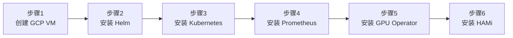
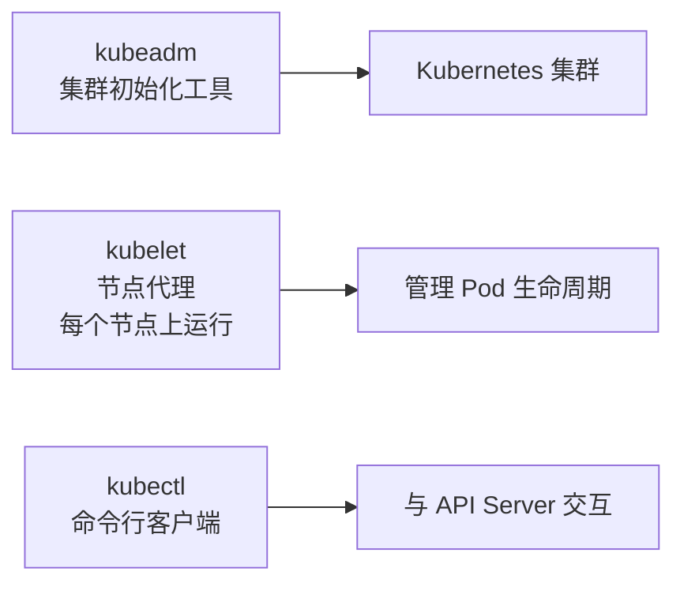

本实验将在一台 Google Cloud GPU 虚拟机上，从零搭建 Kubernetes 集群并在线安装 HAMi，形成完整的 GPU 虚拟化运行环境。

## 你将得到什么

完成本实验后，你将拥有一台完整的 GPU 虚拟化 Kubernetes 集群。关于集群架构和各组件职责的详细解释，参见 [HAMi 集群架构](/zh/docs/core-concepts/hami-architecture)。

## 安装全景图

整个安装过程分 6 步，每一步都在解决一个具体问题：



| 步骤 | 目的 | 解决什么问题 |
| ------ | ------ | ------------- |
| 创建 GCP VM | 准备一台带 GPU 的 Linux 服务器 | Kubernetes 需要 GPU 硬件才能调度 GPU 工作负载 |
| 安装 Helm | Kubernetes 的包管理器 | 后续所有组件都通过 Helm 安装，类似 apt/yum |
| 安装 Kubernetes | 容器编排平台 | HAMi 运行在 Kubernetes 之上，所有 GPU 资源由 K8s 管理 |
| 安装 Prometheus | 监控系统 | HAMi 和 GPU Operator 依赖 Prometheus 采集和存储指标 |
| 安装 GPU Operator | NVIDIA GPU 软件栈自动化管理 | 自动安装 GPU 驱动、容器工具包、指标采集器等组件 |
| 安装 HAMi | GPU 虚拟化与共享 | 让多个 Pod 共享同一张 GPU，实现显存切分和算力分配 |

## 前提条件

- Google Cloud 账号，已启用 Compute Engine API
- 已安装 `gcloud` CLI 并完成认证（`gcloud auth login`）
- GCP 配额中有 NVIDIA T4 GPU 可用

> 费用提示：`n1-standard-4` + T4 虚拟机约 $0.55/小时。[实验 3](./gpu-partitioning.md) 和[实验 4](./hami-dra.md) 直接复用这套集群，一次开机即可完成全部三个实验。实验结束后请删除虚拟机。

---

## 步骤 1: 创建 GCP 虚拟机

### 目的

创建一台带 GPU 的虚拟机，作为整个实验的基础环境。HAMi 需要物理 GPU 硬件（或直通虚拟 GPU）才能工作，它不是模拟 GPU，而是在真实 GPU 之上做切分和共享。

### 操作

设置环境变量：

```bash
export PROJECT_ID=$(gcloud config get-value project)
export ZONE=us-central1-a
export VM_NAME=hami-workshop
export MACHINE_TYPE=n1-standard-4
export GPU_TYPE=nvidia-tesla-t4
export IMAGE_FAMILY=ubuntu-2204-lts
export IMAGE_PROJECT=ubuntu-os-cloud
export DISK_SIZE=100
```

创建虚拟机：

```bash
gcloud compute instances create ${VM_NAME} \
    --project=${PROJECT_ID} \
    --zone=${ZONE} \
    --machine-type=${MACHINE_TYPE} \
    --accelerator=type=${GPU_TYPE},count=1 \
    --maintenance-policy=TERMINATE \
    --image-family=${IMAGE_FAMILY} \
    --image-project=${IMAGE_PROJECT} \
    --boot-disk-size=${DISK_SIZE}GB \
    --boot-disk-type=pd-ssd
```

> `--maintenance-policy=TERMINATE` 是必须的，GPU 不支持在线迁移，如果 GCP 要维护宿主机，VM 会被终止而不是迁移。

SSH 登录：

```bash
gcloud compute ssh ${VM_NAME} --zone=${ZONE}
```

登录后切换到 root：

```bash
sudo su -
```

## 步骤 2: 安装 Helm

### 目的

Helm 是 Kubernetes 的包管理器，后续安装 Prometheus、GPU Operator、HAMi 都通过 Helm 完成。你可以把它理解成 Kubernetes 世界里的 `apt` 或 `yum`。

### 操作

```bash
curl -fsSL -o get_helm.sh https://raw.githubusercontent.com/helm/helm/master/scripts/get-helm-3
chmod 700 get_helm.sh
./get_helm.sh
```

验证：

```bash
helm version
```

## 步骤 3: 安装 Kubernetes

### 目的

HAMi 是 Kubernetes 上的 GPU 调度增强层，它以 Pod 形式运行在 Kubernetes 中。没有 Kubernetes，HAMi 没有运行的基础。

本步骤使用 kubeadm 搭建一个单节点集群。在单节点上，这个节点既是 Master（控制平面）也是 Worker（运行工作负载）。

### 操作

#### 3.1 关闭 swap

Kubernetes 要求关闭 swap，因为 Kubernetes 的资源调度假设内存是固定的，swap 会导致性能不可预测。

```bash
swapoff -a
sed -i '/ swap / s/^\(.*\)$/#\1/g' /etc/fstab
```

#### 3.2 加载内核模块

容器网络需要 `overlay` 和 `br_netfilter` 内核模块。overlay 用于容器文件系统层叠，br_netfilter 用于让 iptables 正确处理桥接流量。

```bash
cat <<EOF | tee /etc/modules-load.d/k8s.conf
overlay
br_netfilter
EOF

modprobe overlay
modprobe br_netfilter
```

#### 3.3 配置内核网络参数

这些参数确保容器之间的网络流量能被正确路由和转发。

```bash
cat <<EOF | tee /etc/sysctl.d/k8s.conf
net.bridge.bridge-nf-call-iptables  = 1
net.bridge.bridge-nf-call-ip6tables = 1
net.ipv4.ip_forward                 = 1
EOF

sysctl --system
```

#### 3.4 安装 containerd

containerd 是 Kubernetes 默认的容器运行时，负责真正创建和运行容器。Docker 在 Kubernetes 1.24 后已不再是默认运行时。

```bash
apt-get update
apt-get install -y containerd

mkdir -p /etc/containerd
containerd config default | tee /etc/containerd/config.toml

# 启用 systemd cgroup 驱动，Kubernetes 要求运行时和 kubelet 使用相同的 cgroup 驱动
sed -i 's/SystemdCgroup \= false/SystemdCgroup \= true/g' /etc/containerd/config.toml

systemctl restart containerd
systemctl enable containerd
```

#### 3.5 安装 kubeadm、kubelet、kubectl

这三个工具的关系：



- **kubeadm**：一次性工具，用来初始化集群
- **kubelet**：常驻进程，负责本节点上 Pod 的创建和销毁
- **kubectl**：日常运维使用的命令行工具

```bash
apt-get install -y apt-transport-https ca-certificates curl gpg

mkdir -p /etc/apt/keyrings

curl -fsSL https://pkgs.k8s.io/core:/stable:/v1.34/deb/Release.key | \
    gpg --dearmor -o /etc/apt/keyrings/kubernetes-apt-keyring.gpg

echo 'deb [signed-by=/etc/apt/keyrings/kubernetes-apt-keyring.gpg] https://pkgs.k8s.io/core:/stable:/v1.34/deb/ /' | \
    tee /etc/apt/sources.list.d/kubernetes.list

apt-get update
apt-get install -y kubelet kubeadm kubectl
apt-mark hold kubelet kubeadm kubectl
```

> `apt-mark hold` 防止这些包被自动升级，Kubernetes 组件版本需要手动控制。

#### 3.6 初始化集群

```bash
kubeadm init --pod-network-cidr=10.244.0.0/16
```

初始化完成后，配置 kubectl 访问权限：

```bash
mkdir -p $HOME/.kube
cp -i /etc/kubernetes/admin.conf $HOME/.kube/config
chown $(id -u):$(id -g) $HOME/.kube/config
```

#### 3.7 安装网络插件（Calico）

Pod 之间需要网络通信。Calico 是一个 CNI（Container Network Interface）插件，负责为 Pod 分配 IP 地址并处理网络路由。没有 CNI 插件，Pod 无法相互通信，节点会一直处于 `NotReady` 状态。

```bash
kubectl create -f https://raw.githubusercontent.com/projectcalico/calico/v3.28.0/manifests/tigera-operator.yaml

curl -fsSL https://raw.githubusercontent.com/projectcalico/calico/v3.28.0/manifests/custom-resources.yaml | \
    sed 's|192.168.0.0/16|10.244.0.0/16|' | kubectl create -f -
```

> 第一个 manifest 安装 tigera-operator，负责管理 Calico 的生命周期。第二个创建 `Installation` 资源，告诉 operator 部署 Calico 本身。`sed` 把 Calico 默认的 IP 池（`192.168.0.0/16`）替换为 `kubeadm init` 时指定的 `--pod-network-cidr` 网段。如果不替换，tigera-operator 会报 `Degraded`（`IPPool 192.168.0.0/16 is not within the platform's configured pod network CIDR(s)`），节点永远不会变成 Ready。各 Calico 组件的职责参见 [HAMi 集群架构](/zh/docs/core-concepts/hami-architecture)。

等待 Calico Pod 就绪：

```bash
kubectl get pods -n calico-system
```

#### 3.8 允许 Master 节点调度 Pod

单节点集群中，这个节点既是控制平面又是工作节点。默认情况下 Kubernetes 不会在 Master 节点上调度工作负载，需要手动移除这个限制：

```bash
kubectl taint nodes --all node-role.kubernetes.io/control-plane-
```

#### 3.9 验证集群状态

```bash
kubectl get nodes
```

预期输出（STATUS 为 Ready 表示集群就绪）：

```plaintext
NAME            STATUS   ROLES           AGE    VERSION
hami-workshop   Ready    control-plane   2m     v1.34.8
```

## 步骤 4: 安装 Prometheus

### 目的

Prometheus 是集群监控系统，负责采集和存储所有组件的指标数据。HAMi 和 GPU Operator 都依赖 Prometheus，HAMi 的调度器指标、设备插件指标、GPU 利用率指标都需要 Prometheus 来采集。

### 为什么先装 Prometheus

因为后续安装的 GPU Operator 和 HAMi 都会创建 ServiceMonitor（告诉 Prometheus 采集哪些指标）。如果 Prometheus 没准备好，这些 ServiceMonitor 就没有消费者。

### 操作

```bash
helm repo add prometheus-community https://prometheus-community.github.io/helm-charts
helm repo update

helm install prometheus prometheus-community/kube-prometheus-stack \
    -n monitoring --create-namespace \
    --set grafana.enabled=false \
    --set prometheus.prometheusSpec.serviceMonitorSelectorNilUsesHelmValues=false \
    --version=75.15.1
```

> `--set grafana.enabled=false` 禁用了 Grafana，因为后续 HAMi WebUI 会提供 GPU 可视化界面。
>
> `serviceMonitorSelectorNilUsesHelmValues=false` 让 Prometheus 采集所有命名空间的 ServiceMonitor，不受标签限制。如果不加这个参数，Prometheus 只会选择带 `release: prometheus` 标签的 ServiceMonitor，GPU Operator 为 dcgm-exporter 创建的 ServiceMonitor 会被静默忽略，最终一条 GPU 指标都采不到。

验证 Prometheus 组件状态：

```bash
kubectl get po -n monitoring
```

预期所有 Pod 状态为 `Running`：

```plaintext
NAME                                                   READY   STATUS    RESTARTS   AGE
prometheus-kube-prometheus-operator-xxxxxxxxxx-xxxxx   1/1     Running   0          2m
prometheus-kube-state-metrics-xxxxxxxxxx-xxxxx         1/1     Running   0          2m
prometheus-prometheus-kube-prometheus-prometheus-0     2/2     Running   0          2m
prometheus-prometheus-node-exporter-xxxxx              1/1     Running   0          2m
```

> 如果安装失败，需要先卸载再重装：`helm uninstall -n monitoring prometheus`

---

## 步骤 5: 安装 GPU Operator

### 目的

NVIDIA GPU Operator 自动管理 GPU 软件栈（驱动、容器工具包、指标采集、特征发现）。GPU Operator 各组件的详细说明参见 [HAMi 集群架构](/zh/docs/core-concepts/hami-architecture)。

> **关键：** 必须禁用 GPU Operator 自带的 device-plugin（`--set devicePlugin.enabled=false`），因为 HAMi 会提供自己的增强版 device-plugin 来支持显存切分和 GPU 共享。两者不能共存。

### 操作

```bash
helm repo add nvidia https://helm.ngc.nvidia.com/nvidia
helm repo update

helm install --wait --generate-name \
    -n gpu-operator --create-namespace \
    nvidia/gpu-operator \
    --set devicePlugin.enabled=false \
    --set dcgmExporter.serviceMonitor.enabled=true \
    --version=v25.3.0
```

> `--wait` 参数会等待所有 Pod 就绪后才返回。首次安装需要几分钟下载 NVIDIA 驱动镜像。

等待所有 Pod 就绪：

```bash
kubectl get pods -n gpu-operator
```

预期输出（驱动编译耗时最长，整个软件栈大约 10 分钟达到这个状态）：

```plaintext
NAME                                                              READY   STATUS      RESTARTS   AGE
gpu-feature-discovery-4hjmc                                       1/1     Running     0          8m47s
gpu-operator-1780588875-node-feature-discovery-gc-585cccbdtvxgf   1/1     Running     0          9m34s
gpu-operator-1780588875-node-feature-discovery-master-d7cdrtkgv   1/1     Running     0          9m34s
gpu-operator-1780588875-node-feature-discovery-worker-2t5nw       1/1     Running     0          9m34s
gpu-operator-75ccfb6b7b-zmctx                                     1/1     Running     0          9m34s
nvidia-container-toolkit-daemonset-phf4g                          1/1     Running     0          8m47s
nvidia-cuda-validator-jdcsm                                       0/1     Completed   0          23s
nvidia-dcgm-exporter-f5tdt                                        1/1     Running     0          8m47s
nvidia-driver-daemonset-bccs7                                     1/1     Running     0          9m13s
nvidia-operator-validator-2jctf                                   1/1     Running     0          8m47s
```

> `nvidia-cuda-validator` 状态为 `Completed` 是正常的，它是一个一次性 Job，验证 CUDA 可用后退出。`node-feature-discovery` 系列 Pod 是 GPU Operator 的依赖组件，负责检测硬件特征并给节点打标签。

### 验证 GPU 驱动

进入 nvidia-driver-daemonset Pod 验证 GPU 驱动是否正常加载（关于 nvidia-smi 背后的调用链，参见 [理解 GPU 驱动](/zh/docs/core-concepts/gpu-driver)）：

```bash
kubectl -n gpu-operator exec -it $(kubectl get pods -n gpu-operator -l app=nvidia-driver-daemonset -o name | head -1) -- nvidia-smi
```

预期输出包含 GPU 信息（驱动版本、CUDA 版本、GPU 型号）：

```plaintext
+-----------------------------------------------------------------------------------------+
| NVIDIA-SMI 570.124.06             Driver Version: 570.124.06     CUDA Version: 12.8     |
|-----------------------------------------+------------------------+----------------------+
| GPU  Name                 Persistence-M | Bus-Id          Disp.A | Volatile Uncorr. ECC |
| Fan  Temp   Perf          Pwr:Usage/Cap |           Memory-Usage | GPU-Util  Compute M. |
|=========================================+========================+======================|
|   0  Tesla T4                       On  |   00000000:00:04.0 Off |                    0 |
| N/A   64C    P8             17W /   70W |       1MiB /  15360MiB |      0%      Default |
+-----------------------------------------------------------------------------------------+
```

---

## 步骤 6: 安装 HAMi

### 目的

安装 HAMi GPU 虚拟化平台，让多个 Pod 可以共享同一张 GPU。HAMi 的架构和组件说明参见 [HAMi 集群架构](/zh/docs/core-concepts/hami-architecture)。

### 操作

通过 Helm 仓库在线安装 HAMi 开源版：

```bash
# 添加 HAMi Helm 仓库
helm repo add hami-charts https://project-hami.github.io/HAMi/

# 安装 HAMi
helm install hami hami-charts/hami -n kube-system --version 2.9.0
```

> HAMi 开源版安装在 `kube-system` 命名空间中。

验证：

```bash
kubectl get pods -n kube-system | grep -E 'hami-scheduler|hami-device'
```

预期输出：

```plaintext
hami-scheduler-6d659887fc-j5ngc   2/2     Running   0          1m
```

> 此时只有 scheduler 在运行。device plugin DaemonSet 的节点选择器是 `gpu=on`，要等下一步给节点打标签后才会启动。

### 开启 GPU 节点

HAMi 不会自动接管所有 GPU 节点，需要手动标记哪些节点由 HAMi 管理。这种设计是为了让 HAMi 和非 HAMi 节点可以在同一个集群中共存。

```bash
# 获取节点名称
NODE_NAME=$(kubectl get nodes -o jsonpath='{.items[0].metadata.name}')

# 标记节点由 HAMi 管理
kubectl label nodes ${NODE_NAME} gpu=on
```

打完标签后，device plugin 在节点上启动：

```bash
kubectl get pods -n kube-system | grep -E 'hami-scheduler|hami-device'
```

```plaintext
hami-device-plugin-bbrjj          2/2     Running   0          30s
hami-scheduler-6d659887fc-j5ngc   2/2     Running   0          95s
```

验证 GPU 注册信息：

```bash
kubectl get node ${NODE_NAME} -o jsonpath='{.metadata.annotations.hami\.io/node-nvidia-register}'
```

预期输出是每张 GPU 一个 JSON 对象：

```json
[{"id":"GPU-859b872c-0ba2-97b0-10b4-8b7185c55039","count":10,"devmem":15360,"devcore":100,"type":"NVIDIA-Tesla T4","mode":"hami-core","health":true,"devicepairscore":{}}]
```

这个 annotation 的字段含义：

| 字段 | 含义 |
| --- | --- |
| `id` | 设备 UUID |
| `count` | 这张卡的 vGPU 切分数量 |
| `devmem` | 显存（MiB） |
| `devcore` | 算力容量（%） |
| `type` | GPU 型号 |
| `mode` | `hami-core` 表示软件层切分；配置了 MIG 的卡显示 `mig` |
| `health` | 设备健康状态 |

其中 **count=10** 表示这张 GPU 被虚拟化为 10 个 vGPU，可以被最多 10 个 Pod 共享。节点的 allocatable 资源中 `nvidia.com/gpu` 会从 `1` 变成 `10`。HAMi v2.9.0 以 JSON 格式写入这个 annotation，旧版本使用逗号分隔的字符串格式。

### （可选）安装 HAMi WebUI

HAMi WebUI 提供 GPU 资源的可视化管理界面：

```bash
helm repo add hami-webui https://project-hami.github.io/HAMi-WebUI

helm install my-hami-webui hami-webui/hami-webui \
    --set externalPrometheus.enabled=true \
    --set externalPrometheus.address="http://prometheus-kube-prometheus-prometheus.monitoring.svc.cluster.local:9090" \
    --set dcgm-exporter.enabled=false \
    -n kube-system
```

> `--set dcgm-exporter.enabled=false` 因为 GPU Operator 已经安装了 dcgm-exporter，避免重复部署。

通过端口转发访问 WebUI：

```bash
kubectl port-forward service/my-hami-webui 3000:3000 --namespace=kube-system
```

访问 `http://localhost:3000` 即可打开 HAMi WebUI。
