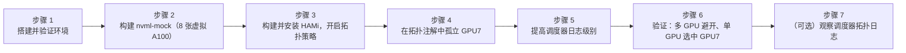

import Tabs from '@theme/Tabs'; import TabItem from '@theme/TabItem';

本实验将带你在单节点本地集群上使用 **nvml-mock** 和 **HAMi** 模拟一套非对称的 PCIe 拓扑。你将启用 HAMi 的拓扑感知调度器，注入自定义的连接性分数来孤立某一张 GPU，然后验证：多 GPU 请求会**避开**这张被孤立的 GPU，而单 GPU 请求则会**选中**它。无需物理 GPU —— 一切都在本地 Kubernetes 集群内完成。

## 你将得到什么

完成本实验后，你将获得：

- 一个使用 nvml-mock 模拟 8 张 A100 GPU 的本地集群（HAMi 将每张 GPU 切分为 10 份后共 80 个虚拟槽位）
- 从已验证的提交构建并安装 HAMi，启用拓扑感知调度（`gpuSchedulerPolicy=topology-aware`）
- 一个节点注解（`hami.io/node-nvidia-score`），定义了一套自定义拓扑，其中 GPU7 与其余所有 GPU 的连接都很差
- 证明调度器在为单个 Pod 分配 2 张 GPU（多 GPU 请求）时会避开 GPU7，而在单 GPU 请求时会选中 GPU7 —— 这两种行为都来自同一个 `topology-aware` 策略，无需额外开关
- 通过调度器自身日志洞察其拓扑决策过程

:::note

本实验中的虚拟 GPU 拓扑分数是人为构造的 —— nvml-mock 默认上报对称的连接性，我们手动覆盖节点注解来人为制造一张"连接最差"的 GPU。本实验验证的是**调度器**针对已知拓扑的处理逻辑，而不是真实的 PCIe/NVLink 测量结果。

**分数方向很重要。** 在 HAMi 实际的调度代码中（`pkg/device/nvidia/device.go`），成对分数**越高**代表连接性**越好**（类似 NVLink），分数**越低**代表越差。多 GPU 请求会选择总分**最高**的组合（通过 `computeBestCombination`）；单 GPU 请求会选择分数**最低**的设备（通过 `computeWorstSingleCard`）—— 这两条路径都由 `Fit()` 中同一个 `needTopology` 判断门控，完全由 `gpuSchedulerPolicy=topology-aware` 驱动。单 GPU 评分没有单独的开关；策略一旦设置，它默认就是开启的。为了让 GPU7 成为连接最差的设备，我们把它的分数设在 50 基准线**以下**，而不是以上。

:::

## 安装概览

整个实验共分 7 个步骤：



| 步骤 | 目的 | 解决的问题 |
| --- | --- | --- |
| 搭建并验证环境 | 创建/验证集群，检查工具 | 确保有可用的 Kubernetes 集群 |
| 构建 nvml-mock | 模拟 8 张 A100 GPU | 为 device plugin 提供可读取的 NVML 拓扑 |
| 构建并安装 HAMi | 部署带 `topology-aware` 策略的调度器 | 使调度器在单 GPU 和多 GPU 请求中都能考虑连接性分数 |
| 孤立 GPU7 | 冻结 device plugin 并覆盖拓扑注解 | 制造一张已知连接性差的 GPU 用于测试 |
| 提高调度器日志级别 | 将调度器日志级别调到 `-v=6` | 暴露 `best device combination` / `worst device` 拓扑日志行 |
| 验证调度行为 | 多 GPU Pod + 单 GPU Pod | 确认避开/选中行为与注入的拓扑一致 |
| 观察逐设备分数 | `-v=6` 级别的调度器日志 | 展示真实的 `best device combination` / `worst device` 日志行 |

## 前提条件

<Tabs groupId="os">
<TabItem value="macos" label="macOS (OrbStack)" default>

- macOS，Intel 或 Apple Silicon
- 已安装 [OrbStack](https://orbstack.dev/) 并启用内置 Kubernetes
- `docker`、`go`（1.21+）、`git`、`python3`
- 可访问 GitHub、GHCR 和 HAMi Helm 仓库
- 至少 8 GB 空闲内存和 4 个 CPU 核心

:::tip[为什么选择 OrbStack？]

OrbStack 自带内置 Kubernetes（基于 k3s），无需单独安装 kind 或 Docker Desktop。它占用资源更少、启动更快，是 macOS 上本地实验的首选。

:::

检查 Helm：

```bash
helm version
```

如果未安装 Helm：

```bash
brew install helm
```

</TabItem>
<TabItem value="linux" label="Linux (Ubuntu + kind)">

- Ubuntu 20.04 LTS 或更高版本，x86_64 或 ARM64
- [Docker Engine](https://docs.docker.com/engine/install/ubuntu/)、[`kind`](https://kind.sigs.k8s.io/docs/user/quick-start/#installation) v0.20+、[`kubectl`](https://kubernetes.io/docs/tasks/tools/install-kubectl-linux/)、Helm 3.x
- `go`（1.21+）、`git`、`python3`
- 可访问 GitHub、GHCR 和 HAMi Helm 仓库
- 至少 8 GB 空闲内存和 4 个 CPU 核心

:::tip[为什么选择 kind？]

kind（Kubernetes IN Docker）在 Docker 容器内运行完整的 Kubernetes 集群。它可以在任何安装了 Docker 的 Linux 发行版上运行，无需特殊的系统集成，是 Linux 上本地 Kubernetes 开发的标准工具。

:::

如果需要安装以上前提条件，运行以下命令块：

```bash
# Docker Engine
curl -fsSL https://get.docker.com | sudo sh
sudo usermod -aG docker $USER
newgrp docker

# kind
KIND_VERSION=v0.23.0
curl -Lo ./kind "https://kind.sigs.k8s.io/dl/${KIND_VERSION}/kind-linux-amd64"
chmod +x ./kind && sudo mv ./kind /usr/local/bin/kind

# kubectl
curl -LO "https://dl.k8s.io/release/$(curl -L -s https://dl.k8s.io/release/stable.txt)/bin/linux/amd64/kubectl"
sudo install -o root -g root -m 0755 kubectl /usr/local/bin/kubectl && rm kubectl

# Helm
curl https://raw.githubusercontent.com/helm/helm/main/scripts/get-helm-3 | bash
```

</TabItem>
</Tabs>

## 步骤 1：搭建并验证本地环境

_为什么：我们需要一个可用的 Kubernetes 集群来部署 nvml-mock 和 HAMi。_

<Tabs groupId="os">
<TabItem value="macos" label="macOS" default>

在 OrbStack UI 中启用后，其内置的 Kubernetes 会自动启动。验证集群是否就绪：

```bash
kubectl version
```

示例输出：

```plaintext
Client Version: v1.33.9
Kustomize Version: v5.6.0
Server Version: v1.33.9+orb1
```

:::note

`Server Version` 中的 `+orb1` 后缀标识了 OrbStack 内置的 Kubernetes 发行版。

:::

</TabItem>
<TabItem value="linux" label="Linux">

创建本地 Kubernetes 集群：

```bash
kind create cluster --name topo-lab
```

示例输出：

```plaintext
Creating cluster "topo-lab" ...
 ✓ Ensuring node image (kindest/node:v1.35.0) 🖼
 ✓ Preparing nodes 📦
 ✓ Writing configuration 📜
 ✓ Starting control-plane 🕹️
 ✓ Installing CNI 🔌
 ✓ Installing StorageClass 💾
Set kubectl context to "kind-topo-lab"
```

:::note

`--name topo-lab` 参数为集群命名，生成的节点将被称为 `topo-lab-control-plane`。kind 会自动将 kubectl 上下文切换到新集群。

:::

</TabItem>
</Tabs>

### 设置 NODE_NAME 变量

本实验后续步骤都使用 `NODE_NAME` 这个 shell 变量，避免在命令中硬编码节点名。**每次打开新的终端会话时都要重新设置**，因为关闭 shell 后该变量会丢失。

```bash
NODE_NAME=$(kubectl get nodes -o jsonpath='{.items[0].metadata.name}')
echo "NODE_NAME=${NODE_NAME}"
```

---

:::info[后续大部分步骤在两个平台上是一致的]

从这里开始，大多数命令在 macOS 和 Linux 上是一致的。仍有少数步骤存在差异 —— 步骤 2.3 和步骤 3.1 中分别有一条仅 Linux 需要执行的额外 `kind load` 命令 —— 其余部分完全相同，只是示例输出中的节点名不同。

:::

## 步骤 2：构建并部署 nvml-mock（8 张模拟 A100 GPU）

_为什么：nvml-mock 提供虚拟 GPU 设备和 NVML 拓扑数据，供 HAMi 发现并评分。_

### 2.1 克隆 NVIDIA 测试基础设施仓库

```bash
git clone https://github.com/NVIDIA/k8s-test-infra.git
cd k8s-test-infra
```

### 2.2 构建 Mock Docker 镜像

```bash
docker build -t nvml-mock:local -f deployments/nvml-mock/Dockerfile .
```

### 2.3 将镜像加载到集群并安装

<Tabs groupId="os">
<TabItem value="macos" label="macOS" default>

在 macOS 上使用 OrbStack 时，本地 Docker 镜像可直接被集群访问 —— 无需 `kind load`。

```bash
helm install nvml-mock oci://ghcr.io/nvidia/k8s-test-infra/chart/nvml-mock \
  --set image.repository=nvml-mock \
  --set image.tag=local \
  --wait --timeout 120s
```

</TabItem>
<TabItem value="linux" label="Linux">

在 Linux 上使用 kind 时，**必须先将镜像加载到集群，再安装 chart**。如果跳过 `kind load`，GPU 标签会显示为 `<none>`。

```bash
kind load docker-image nvml-mock:local --name topo-lab

helm install nvml-mock oci://ghcr.io/nvidia/k8s-test-infra/chart/nvml-mock \
  --set image.repository=nvml-mock \
  --set image.tag=local \
  --wait --timeout 120s
```

</TabItem>
</Tabs>

### 2.4 验证 GPU 标签已生效

```bash
kubectl get node ${NODE_NAME} -o custom-columns=NAME:.metadata.name,GPU:.metadata.labels.nvidia\\.com/gpu\\.present
```

```plaintext
NAME                     GPU
topo-lab-control-plane   true
```

> `GPU` 列显示 `true`，说明 nvml-mock 已经在节点上注册了模拟 GPU 设备。

## 步骤 3：从 main 分支构建 HAMi，并以拓扑感知调度模式安装

_为什么：HAMi 的调度器会替代默认 Kubernetes 调度器处理 GPU Pod，启用 `topology-aware` 策略后可以做出拓扑感知的调度决策。_

### 3.1 克隆 HAMi 并检出已验证的提交

本实验基于 2026-07-14 时的 HAMi `main` 分支验证通过。如果你当前的 `main` 分支表现不符合预期，请使用确切的提交 `a1b418c`：

```bash
cd ~
git clone https://github.com/Project-HAMi/HAMi.git
cd HAMi
git log --until=2026-07-14 --oneline -1
git checkout a1b418c
git submodule update --init --recursive
docker build -t hami:local -f docker/Dockerfile .
```

<Tabs groupId="os">
<TabItem value="macos" label="macOS" default>

```bash
# 镜像已在本地可用，无需加载
```

</TabItem>
<TabItem value="linux" label="Linux">

```bash
kind load docker-image hami:local --name topo-lab
```

</TabItem>
</Tabs>

### 3.2 以拓扑感知策略安装 HAMi

直接从运行中的集群读取 Kubernetes 服务端版本，让调度器内置的 `kube-scheduler` 二进制文件与实际的 API server 版本保持一致。OrbStack 上报的版本类似 `v1.33.9+orb1`，而 kind 上报的是 `v1.35.0`，如果写死一个固定标签，只可能在其中一个平台上正确：

```bash
K8S_VERSION=$(kubectl version -o json | python3 -c "import json,sys; print(json.load(sys.stdin)['serverVersion']['gitVersion'].split('+')[0])")
echo "K8S_VERSION=${K8S_VERSION}"
```

```bash
helm install hami ./charts/hami \
  -n kube-system \
  --set devicePlugin.image.repository=hami \
  --set devicePlugin.image.tag=local \
  --set scheduler.image.repository=hami \
  --set scheduler.image.tag=local \
  --set devicePlugin.nvidiaDriverRoot=/var/lib/nvml-mock/driver \
  --set scheduler.kubeScheduler.imageTag=${K8S_VERSION} \
  --set scheduler.defaultSchedulerPolicy.gpuSchedulerPolicy=topology-aware
```

> `gpuSchedulerPolicy=topology-aware` 告诉调度器在选择 GPU 时使用节点注解中的成对连接性分数。这一个设置同时覆盖多 GPU 和单 GPU 两种请求 —— HAMi 的 `Fit()` 函数（`pkg/device/nvidia/device.go`）只检查一次该策略，然后在内部分支处理：多 GPU 请求走 `computeBestCombination()`，单 GPU 请求走 `computeWorstSingleCard()`。单 GPU 评分没有单独需要打开的开关。`scheduler.kubeScheduler.imageTag` 是从实际运行的集群读取的，而不是写死的，因为 OrbStack 和 kind 提供的 Kubernetes 版本不同，这样可以让调度器内置的 `kube-scheduler` 二进制文件始终与实际运行的 API server 保持一致。

### 3.3 为节点打标签并配置 NVML 发现

:::danger[运行本节命令前，请先确认 NODE_NAME 已设置]

如果你在步骤 1 之后打开了新终端，或者 `NODE_NAME` 因其他原因变成了空值，下面的打标签命令不会在**节点**层面明确报错，而是悄悄降级 —— 但打标签这件事本身就会失败：

```bash
kubectl label node ${NODE_NAME} gpu=on --overwrite
error: resource(s) were provided, but no name was specified
```

这个报错说明 `${NODE_NAME}` 被展开成了空字符串，命令实际变成了 `kubectl label node gpu=on --overwrite`，完全没有节点名。**节点永远不会获得 `gpu=on` 标签**，后续所有步骤都会悄无声息地失败：

- 如果 `hami-device-plugin` 的 DaemonSet 配置了要求 `gpu=on` 的 `nodeSelector`，现在它将匹配**零个**节点。
- 对一个期望副本数为零的 DaemonSet 执行 `kubectl rollout restart` / `rollout status` 会显示 **"successfully rolled out"** —— 因为根本没有 Pod 需要滚动更新，所以这不会给出任何异常提示。
- `kubectl get pods | grep hami-device-plugin` **什么都不返回**（不是 `Pending`，也不是 `CrashLoopBackOff` —— 压根不存在任何 Pod）。
- 之后所有依赖 device plugin 运行的步骤（拓扑注解、GPU 容量、实际 Pod 调度）都会在后面以令人困惑、看似无关的错误失败。

在运行下面的命令块之前，先确认 `NODE_NAME` 非空：

```bash
echo "NODE_NAME=${NODE_NAME}"
NODE_NAME=$(kubectl get nodes -o jsonpath='{.items[0].metadata.name}')
```

:::

```bash
kubectl label node ${NODE_NAME} gpu=on --overwrite
kubectl -n kube-system set env daemonset/hami-device-plugin -c device-plugin DEVICE_DISCOVERY_STRATEGY=nvml
kubectl -n kube-system rollout restart daemonset/hami-device-plugin
kubectl -n kube-system rollout status daemonset/hami-device-plugin --timeout=120s
```

继续之前，先确认 Pod 确实存在 —— 干净的 `rollout status` 输出本身不能作为证明：

```bash
kubectl -n kube-system get pods -o wide | grep hami-device-plugin
```

如果这条命令没有任何输出，请停下来，回到上面的 `NODE_NAME` / 标签检查步骤，而不要继续步骤 3.4 —— 根本没有 Pod 可以变成 `Running`，再等下去也没用。

:::danger[如果超时，请在此停下]

如果看到 `error: timed out waiting for the condition`，说明 device plugin 启动耗时可能超过了 120 秒。**在 Pod 变为 `Running` 且 `1/1 Ready` 之前，不要继续。**

可以用以下命令检查 Pod 状态：

```bash
kubectl -n kube-system get pods -o wide | grep hami-device-plugin
kubectl -n kube-system describe pod <hami-device-plugin-pod-name>
kubectl -n kube-system logs <hami-device-plugin-pod-name> -c device-plugin --tail=200
```

常见问题：

1. **Pod 卡在 `Pending`** —— 检查 nodeSelector/affinity/taint 是否匹配。确认节点带有 `nvidia.com/gpu.present=true`（由 nvml-mock 设置）和 `gpu=on`（上面设置）标签。
2. **`device-plugin` 容器 `CrashLoopBackOff`** —— device plugin 找不到 NVML mock 库。确认 `devicePlugin.nvidiaDriverRoot` 中使用的路径与 nvml-mock 实际安装 `libnvidia-ml.so.*` 的路径一致（通常是 `/var/lib/nvml-mock/driver`）。可从 nvml-mock 的 Pod 日志或 NOTES 输出中查看正确路径。
3. **完全没有 Pod（连 `Pending` 都没有）** —— 这是上面提到的 `NODE_NAME` 失败模式，不是超时问题。用 `kubectl get node ${NODE_NAME} --show-labels | grep gpu=on` 检查节点是否真的带有 `gpu=on` 标签。
4. **`vgpu-monitor` 容器不断重启，Pod 显示 `1/2`** —— 这在本实验中是预期行为，无害，不是真正的故障。`vgpu-monitor` 监视真实的容器运行时（`/run/docker`、`/run/containerd`）以上报实际使用 GPU 的工作负载；由于 nvml-mock 没有真实的 GPU 工作负载可供它监视，它会正常退出（`Exit Code: 0`，`Reason: Completed`），kubelet 随后将其重启，仅仅因为重启过快就可能触发 `BackOff` 警告。本实验真正关心的是 **`device-plugin` 容器本身** —— 单独检查它的就绪状态：

   ```bash
   kubectl -n kube-system get pod <hami-device-plugin-pod-name> -o jsonpath='{range .status.containerStatuses[*]}{.name}{": ready="}{.ready}{"\n"}{end}'
   ```

   如果显示 `device-plugin: ready=true`，即使 `vgpu-monitor` 在重启、Pod 整体 `READY` 列显示 `1/2`，也可以放心继续。同样这种非致命的超时也可能在步骤 4.4 的 `rollout status` 中再次出现 —— 原因相同，解法也相同：单独检查 `device-plugin`，而不是看 Pod 整体的就绪计数。

一旦 `device-plugin` 就绪，你可以重新运行 `rollout status` 命令，或直接进入下一步。

:::

### 3.4 检查节点的 GPU 容量

```bash
kubectl describe node ${NODE_NAME} | grep nvidia.com/gpu
```

```plaintext
nvidia.com/gpu: 80
```

> 80 来自 8 张虚拟 GPU，每张被 HAMi 切分为 10 个 vGPU 单元。

## 步骤 4：创建孤立 GPU7 的自定义拓扑

_为什么：默认情况下，所有 GPU 两两之间的连接性分数都相同（50）。我们将手动构造一套拓扑，让 GPU7 与其余每张 GPU 的分数都很低（5），然后冻结 device plugin，防止它覆盖我们的自定义数值。这样就能让 GPU7 成为"连接最差"的设备。_

:::danger[本步骤必不可少 —— 跳过它很容易导致注解为空]

在 Helm 安装时（步骤 3.2）设置 `gpuSchedulerPolicy=topology-aware` 只打开了**调度器**这一侧的拓扑感知能力，并不会让 **device plugin** 去计算或发布拓扑分数。那是另一个独立的开关：`hami-device-plugin` DaemonSet 上的 `ENABLE_TOPOLOGY_SCORE` 环境变量，未设置时默认是 `false`/关闭。如果跳过下面的 4.1，`hami.io/node-nvidia-score` 会是一个空字符串 —— 本步骤中的 Python 脚本会以 `JSONDecodeError` 失败。容量注册和拓扑分数发布是两条不同的代码路径；一个能正常工作不代表另一个也已开启。

:::

### 4.1 在 Device Plugin 上启用拓扑评分

```bash
kubectl -n kube-system set env daemonset/hami-device-plugin -c device-plugin ENABLE_TOPOLOGY_SCORE=true
kubectl -n kube-system rollout restart daemonset/hami-device-plugin
kubectl -n kube-system rollout status daemonset/hami-device-plugin --timeout=120s
```

等待超过一个注册周期（device plugin 每 30 秒更新一次注解），然后检查注解是否已被填充：

```bash
sleep 40
kubectl get node ${NODE_NAME} -o jsonpath='{.metadata.annotations.hami\.io/node-nvidia-score}'
```

这应该打印出一个包含 8 个对象的 JSON 数组（每张虚拟 GPU 一个），每个对象都有 `uuid` 和 `score` 映射。

- **如果看到 JSON 数组：** 注解已存在，继续 4.2。
- **如果没有输出或报错：** 注解为空。这种情况下，我们将使用已知的 UUID 手动创建一个默认拓扑文件。请按照 4.2 中的回退方案操作。

> 如果步骤 3.3 中的 `hami-device-plugin` Pod 根本没有启动成功（用 `kubectl -n kube-system get pods | grep hami-device-plugin` 检查），这里注解为空是意料之中的 —— 没有任何东西在运行来填充它。请先回去修复步骤 3.3，而不是直接跳到手动回退方案；虽然回退方案在两种情况下都能用，但清楚自己处于哪种情况仍然是有价值的。

### 4.2 获取当前拓扑（或创建默认拓扑）

首先，尝试从节点拉取注解：

```bash
kubectl get node ${NODE_NAME} -o jsonpath="{.metadata.annotations.hami\.io/node-nvidia-score}" > /tmp/orig-topo.json
```

现在测试文件是否包含合法的 JSON：

```bash
python3 -c "import json; d=json.load(open('/tmp/orig-topo.json')); print(f'Devices: {len(d)}')"
```

**如果命令成功执行并打印 `Devices: 8`**，可以跳过下面的回退方案，直接进行 GPU7 UUID 提取。

**如果命令失败**（例如 `JSONDecodeError: Expecting value`），说明文件为空。使用下面的手动回退方案创建默认拓扑。

:::danger[之后不要再重新运行拉取命令]

一旦你写入了下面的回退文件，**不要**再重新运行本页前面的 `kubectl get node ... > /tmp/orig-topo.json` 命令。如果真实注解仍然为空（例如 device plugin 依然没有运行），该命令会悄悄把 `/tmp/orig-topo.json` 截断回 0 字节，覆盖掉你即将创建的可用回退数据。这正是导致后续每一步都出现 `JSONDecodeError: Expecting value: line 1 column 1 (char 0)`、包括 `GPU7_UUID` 为空的根源。

如果需要检查真实注解是否后来出现了，请先重定向到**另一个**文件（例如 `/tmp/check-topo.json`）并检查它，而不要直接覆盖 `/tmp/orig-topo.json`：

```bash
kubectl get node ${NODE_NAME} -o jsonpath="{.metadata.annotations.hami\.io/node-nvidia-score}" > /tmp/check-topo.json
python3 -c "import json; d=json.load(open('/tmp/check-topo.json')); print(f'Devices: {len(d)}')"
# 仅在此命令成功时才复制覆盖：cp /tmp/check-topo.json /tmp/orig-topo.json
```

:::

#### 回退方案：手动创建默认拓扑

nvml-mock 的 `a100` profile 生成的 GPU UUID 以 `GPU-12345678-1234-1234-1234-12345678` 开头，以设备索引（0–7）结尾。我们将用这些 UUID 构建拓扑文件。

```bash
cat > /tmp/orig-topo.json <<'ENDJSON'
[
  {"uuid":"GPU-12345678-1234-1234-1234-123456780000","score":{"GPU-12345678-1234-1234-1234-123456780001":50,"GPU-12345678-1234-1234-1234-123456780002":50,"GPU-12345678-1234-1234-1234-123456780003":50,"GPU-12345678-1234-1234-1234-123456780004":50,"GPU-12345678-1234-1234-1234-123456780005":50,"GPU-12345678-1234-1234-1234-123456780006":50,"GPU-12345678-1234-1234-1234-123456780007":50}},
  {"uuid":"GPU-12345678-1234-1234-1234-123456780001","score":{"GPU-12345678-1234-1234-1234-123456780000":50,"GPU-12345678-1234-1234-1234-123456780002":50,"GPU-12345678-1234-1234-1234-123456780003":50,"GPU-12345678-1234-1234-1234-123456780004":50,"GPU-12345678-1234-1234-1234-123456780005":50,"GPU-12345678-1234-1234-1234-123456780006":50,"GPU-12345678-1234-1234-1234-123456780007":50}},
  {"uuid":"GPU-12345678-1234-1234-1234-123456780002","score":{"GPU-12345678-1234-1234-1234-123456780000":50,"GPU-12345678-1234-1234-1234-123456780001":50,"GPU-12345678-1234-1234-1234-123456780003":50,"GPU-12345678-1234-1234-1234-123456780004":50,"GPU-12345678-1234-1234-1234-123456780005":50,"GPU-12345678-1234-1234-1234-123456780006":50,"GPU-12345678-1234-1234-1234-123456780007":50}},
  {"uuid":"GPU-12345678-1234-1234-1234-123456780003","score":{"GPU-12345678-1234-1234-1234-123456780000":50,"GPU-12345678-1234-1234-1234-123456780001":50,"GPU-12345678-1234-1234-1234-123456780002":50,"GPU-12345678-1234-1234-1234-123456780004":50,"GPU-12345678-1234-1234-1234-123456780005":50,"GPU-12345678-1234-1234-1234-123456780006":50,"GPU-12345678-1234-1234-1234-123456780007":50}},
  {"uuid":"GPU-12345678-1234-1234-1234-123456780004","score":{"GPU-12345678-1234-1234-1234-123456780000":50,"GPU-12345678-1234-1234-1234-123456780001":50,"GPU-12345678-1234-1234-1234-123456780002":50,"GPU-12345678-1234-1234-1234-123456780003":50,"GPU-12345678-1234-1234-1234-123456780005":50,"GPU-12345678-1234-1234-1234-123456780006":50,"GPU-12345678-1234-1234-1234-123456780007":50}},
  {"uuid":"GPU-12345678-1234-1234-1234-123456780005","score":{"GPU-12345678-1234-1234-1234-123456780000":50,"GPU-12345678-1234-1234-1234-123456780001":50,"GPU-12345678-1234-1234-1234-123456780002":50,"GPU-12345678-1234-1234-1234-123456780003":50,"GPU-12345678-1234-1234-1234-123456780004":50,"GPU-12345678-1234-1234-1234-123456780006":50,"GPU-12345678-1234-1234-1234-123456780007":50}},
  {"uuid":"GPU-12345678-1234-1234-1234-123456780006","score":{"GPU-12345678-1234-1234-1234-123456780000":50,"GPU-12345678-1234-1234-1234-123456780001":50,"GPU-12345678-1234-1234-1234-123456780002":50,"GPU-12345678-1234-1234-1234-123456780003":50,"GPU-12345678-1234-1234-1234-123456780004":50,"GPU-12345678-1234-1234-1234-123456780005":50,"GPU-12345678-1234-1234-1234-123456780007":50}},
  {"uuid":"GPU-12345678-1234-1234-1234-123456780007","score":{"GPU-12345678-1234-1234-1234-123456780000":50,"GPU-12345678-1234-1234-1234-123456780001":50,"GPU-12345678-1234-1234-1234-123456780002":50,"GPU-12345678-1234-1234-1234-123456780003":50,"GPU-12345678-1234-1234-1234-123456780004":50,"GPU-12345678-1234-1234-1234-123456780005":50,"GPU-12345678-1234-1234-1234-123456780006":50}}
]
ENDJSON
```

验证文件是否合法：

```bash
python3 -c "import json; d=json.load(open('/tmp/orig-topo.json')); print(f'Devices: {len(d)}'); print('GPU7 UUID:', [x['uuid'] for x in d if x['uuid'].endswith('780007')][0])"
```

预期输出：

```
Devices: 8
GPU7 UUID: GPU-12345678-1234-1234-1234-123456780007
```

### 4.2.1 定位 GPU7 的 UUID

现在提取 GPU7 的 UUID（无论来自真实注解还是手动创建的文件）：

```bash
GPU7_UUID=$(python3 -c "
import json
data = json.load(open('/tmp/orig-topo.json'))
for d in data:
    if d['uuid'].endswith('780007'):
        print(d['uuid'])
        break
")
echo "GPU7 UUID = $GPU7_UUID"
```

:::danger[如果为空，请停下 —— 不要继续 4.3]

如果 `GPU7_UUID` 打印为空（`GPU7 UUID =`等号后面什么都没有），**不要继续步骤 4.3**。最常见的原因是 `$GPU7_UUID` 是在之前的 shell 会话中设置的，而现在是一个全新的终端 —— 变量在这里根本还不存在，`$GPU7_UUID` 会在下一条命令中悄悄展开为空字符串，Python 也会毫无异议地接受 `gpu7 = ''`，不会抛出任何错误。

后果很严重，而且很容易被忽略：4.3 中的分数生成脚本会正常运行完成，产出一个看起来合理的 `custom-topo.json`，应用也很顺利，语法检查全部通过 —— 但它实际上根本没有触碰任何真实 GPU 的分数，而是悄悄给每个设备的 `score` 映射加了一个虚假的 `''` 键。4.6 中的注解检查会看起来几乎正确（每个真实设备仍显示旧的基准值 50），只是多了一个游离的额外键：`'': 5`。如果你在拓扑 JSON 中的任何位置看到这个游离的空字符串键，就是这个原因导致的 —— 请回到上面的提取命令，在**当前** shell 中重新运行。

在继续之前加上这道硬性检查：

```bash
if [ -z "$GPU7_UUID" ]; then
  echo "ERROR: GPU7_UUID is empty. Re-run the extraction command above in this shell before continuing." >&2
  exit 1
else
  echo "OK: GPU7_UUID is set to $GPU7_UUID"
fi
```

:::

:::warning[按 UUID 后缀匹配，而不是数组下标]

数组顺序并不按设备索引排序。请始终按 UUID 后缀（设备索引 N 对应 `...78000N`）来匹配，切勿假定 `data[7]` 就是 GPU7。

:::

### 4.3 生成孤立 GPU7 的修改版拓扑（分数 = 5）

```bash
python3 -c "
import json
data = json.load(open('/tmp/orig-topo.json'))
gpu7 = '$GPU7_UUID'
for entry in data:
    if entry['uuid'] == gpu7:
        for other in data:
            if other['uuid'] != gpu7:
                entry['score'][other['uuid']] = 5
    else:
        entry['score'][gpu7] = 5
print(json.dumps(data))
" > /tmp/custom-topo.json
```

> 默认分数为 50，**分数越高，连接性越好**。把 GPU7 的成对分数设为 5，使它成为连接最差的设备：涉及 GPU7 的多 GPU 组合总分最低，因而被避开；单 GPU 请求选择总分最低的设备，也就是 GPU7。

### 4.4 冻结 Device Plugin，防止它覆盖自定义分数

现在把同一个环境变量翻转回 `false` —— 这会阻止 device plugin 重新计算并覆盖我们手动设置的分数：

```bash
kubectl -n kube-system set env daemonset/hami-device-plugin -c device-plugin ENABLE_TOPOLOGY_SCORE=false
kubectl -n kube-system rollout restart daemonset/hami-device-plugin
kubectl -n kube-system rollout status daemonset/hami-device-plugin --timeout=120s
```

:::note[超时不影响本步骤]

如果这个 `rollout status` 超时，几乎总是步骤 3.3 中描述的那种无害的 `vgpu-monitor` 容器重启循环，不是真正的问题 —— 在这个虚拟 GPU 实验中 `vgpu-monitor` 无事可监视，所以它会正常退出并重启，这可能导致 Pod 整体的 `READY` 计数低于 DaemonSet 的期望值。真正重要的是 `device-plugin` 本身是否就绪，以及环境变量是否已生效：

```bash
kubectl -n kube-system get pods -o wide | grep hami-device-plugin
kubectl -n kube-system get pod <hami-device-plugin-pod-name> -o jsonpath='{range .status.containerStatuses[*]}{.name}{": ready="}{.ready}{"\n"}{end}'
```

如果显示 `device-plugin: ready=true`，说明冻结已经生效，无论 `vgpu-monitor` 状态如何，都可以继续步骤 4.5。

:::

### 4.5 应用自定义注解

重要：`NODE_NAME` 变量必须仍然有效。如果你打开了新终端，请重新运行：

```bash
NODE_NAME=$(kubectl get nodes -o jsonpath='{.items[0].metadata.name}')
```

然后应用注解：

```bash
kubectl annotate node ${NODE_NAME} hami.io/node-nvidia-score="$(cat /tmp/custom-topo.json)" --overwrite
```

预期输出：`node/<NODE_NAME> annotated`。

### 4.6 验证 GPU7 现在与所有其他 GPU 的分数都很低

等待超过一个注册周期（30 秒）以确认冻结生效：

```bash
sleep 40
kubectl get node ${NODE_NAME} -o jsonpath='{.metadata.annotations.hami\.io/node-nvidia-score}' | python3 -c "
import sys, json
data = json.load(sys.stdin)
for d in data:
    if d['uuid'].endswith('780007'):
        print(d['score'])
        break
"
```

预期结果：一个字典，其中每个其他 GPU 的 UUID 都映射到 `5`，而不是 `50`。示例：

```
{'GPU-12345678-...-780000': 5, 'GPU-12345678-...-780001': 5, ...}
```

### 4.7 重启调度器以加载新拓扑

```bash
kubectl -n kube-system rollout restart deployment hami-scheduler
kubectl -n kube-system rollout status deployment hami-scheduler --timeout=60s
kubectl delete pod multi-gpu single-gpu --ignore-not-found
```

## 步骤 5：提高调度器日志级别

_为什么：单 GPU 拓扑评分不需要额外的开关 —— 早在步骤 3.2 设置 `gpuSchedulerPolicy=topology-aware` 时它就已经生效了。把日志级别调高到 `-v=6` 会暴露出 `best device combination` / `worst device` 日志行，证明调度器确实使用了你自定义的分数。_

### 5.1 把调度器日志级别调到 6

```bash
kubectl -n kube-system get deployment hami-scheduler -o json > /tmp/hami-scheduler.json
python3 -c "
import json
d = json.load(open('/tmp/hami-scheduler.json'))
for c in d['spec']['template']['spec']['containers']:
    cmd = c.get('command') or []
    for i, a in enumerate(cmd):
        if a.startswith('-v='):
            cmd[i] = '-v=6'
json.dump(d, open('/tmp/hami-scheduler.json', 'w'))
"
kubectl apply -f /tmp/hami-scheduler.json
kubectl -n kube-system rollout status deployment hami-scheduler --timeout=60s
kubectl -n kube-system get deployment hami-scheduler -o yaml | grep -- '-v='
```

你应该会看到 `kube-scheduler` 和 `vgpu-scheduler-extender` 两个容器都显示 `-v=6`。

## 步骤 6：验证测试

_为什么：我们运行一个请求 2 张 GPU 的 Pod（应避开 GPU7）和另一个请求 1 张 GPU 的 Pod（应选中 GPU7）。调度器日志和 Pod 注解共同确认这一行为。_

### 6.1 多 GPU Pod —— 必须避开 GPU7

编写 Pod 清单：

```bash
cat > multi-gpu-pod.yaml <<'EOF'
apiVersion: v1
kind: Pod
metadata:
  name: multi-gpu
spec:
  containers:
    - name: sleep
      image: busybox
      command: ["sleep", "3600"]
      env:
        - name: CUDA_DISABLE_CONTROL
          value: "true"
      resources:
        limits:
          nvidia.com/gpu: 2
EOF
```

> 我们使用 `busybox` 而不是 CUDA 镜像，因为 nvml-mock 和 HAMi 在这里只是模拟 GPU 的**调度和计量**。`CUDA_DISABLE_CONTROL: "true"` 可以防止 HAMi 的容器内控制层去拦截一个根本不存在的真实驱动。

检查并应用：

```bash
kubectl apply -f multi-gpu-pod.yaml
```

等待它运行起来，然后检查它分配到了哪些 GPU：

```bash
kubectl get pod multi-gpu -w   # 等待变为 Running，然后按 Ctrl+C
kubectl get pod multi-gpu -o jsonpath='{.metadata.annotations.hami\.io/vgpu-devices-allocated}'
```

**预期输出**：应列出两张 UUID 不以 `780007` 结尾的 GPU。例如：`GPU-...780001,GPU-...780000`。

检查调度器日志：

```bash
kubectl -n kube-system logs deployment/hami-scheduler -c vgpu-scheduler-extender | grep "best device combination" | tail -1
```

预期输出（索引 ≠ 7）：

```plaintext
I0717 01:51:55.073459       1 device.go:859] "device allocate success" pod="default/multi-gpu" best device combination={"NVIDIA":[{"Idx":1,"UUID":"GPU-12345678-...-780001",...},{"Idx":0,"UUID":"GPU-12345678-...-780000",...}]}
```

### 6.2 单 GPU Pod —— 应选中 GPU7

编写 Pod 清单：

```bash
cat > single-gpu-pod.yaml <<'EOF'
apiVersion: v1
kind: Pod
metadata:
  name: single-gpu
spec:
  containers:
    - name: sleep
      image: busybox
      command: ["sleep", "3600"]
      env:
        - name: CUDA_DISABLE_CONTROL
          value: "true"
      resources:
        limits:
          nvidia.com/gpu: 1
EOF
```

检查并应用：

```bash
kubectl apply -f single-gpu-pod.yaml
```

等待它运行起来，然后检查分配到的 GPU：

```bash
kubectl get pod single-gpu -w   # 等待变为 Running，然后按 Ctrl+C
kubectl describe pod single-gpu | grep vgpu-devices-allocated
```

**预期输出**：`hami.io/vgpu-devices-allocated: GPU-...780007`。

检查调度器日志：

```bash
kubectl -n kube-system logs deployment/hami-scheduler -c vgpu-scheduler-extender | grep "worst device" | tail -1
```

预期输出（Idx=7）：

```plaintext
I0717 01:52:XX.XXXXXX       1 device.go:853] "device allocate success" pod="default/single-gpu" worst device=[{"Idx":7,"UUID":"GPU-12345678-...-780007",...}]
```

## 步骤 7：（可选）观察调度器的拓扑决策

_为什么：`best device combination` / `worst device` 日志行是调度器确实使用了你自定义拓扑分数的直接证据。_

同时查找两类日志行：

```bash
kubectl -n kube-system logs deployment/hami-scheduler -c vgpu-scheduler-extender | grep -E "best device combination|worst device"
```

你应该能看到多 GPU Pod 对应一行（`best combination`）、单 GPU Pod 对应一行（`worst device`），分别体现出 GPU7 被避开和被选中。

## 已验证特性汇总

| 特性 | 测试方式 | 预期行为 | 证据 |
| --- | --- | --- | --- |
| 拓扑感知调度已启用 | Helm 安装参数 + 调度器日志 | 调度器使用 `topology-aware` 策略 | 日志：`--gpu-scheduler-policy=topology-aware` |
| 单 GPU 拓扑评分 | 无需额外开关 —— 沿用步骤 3 的 `topology-aware` 策略 | 单 GPU Pod 自动遵循分数 | Pod 注解显示 GPU7 的 UUID |
| 多 GPU 避开被孤立的 GPU | 请求 2 张 GPU 的 Pod | 未分配到 GPU7 | 注解只显示 0-6 号 GPU |
| 单 GPU 选中被孤立的 GPU | 请求 1 张 GPU 的 Pod | 分配到 GPU7（当注解持续存在时） | 注解显示 GPU7 的 UUID |
| 调度器评估拓扑分数 | `-v=6` 详细日志 | 选择结果体现了你为 GPU7 注入的低分 | 日志：`best device combination` / `worst device` |

## 清理

删除测试 Pod：

```bash
kubectl delete pod multi-gpu single-gpu --ignore-not-found
```

卸载 HAMi 和 nvml-mock：

```bash
helm uninstall hami -n kube-system
helm uninstall nvml-mock
```

<Tabs groupId="os">
<TabItem value="macos" label="macOS" default>

要停止 Kubernetes 集群，可在 OrbStack UI 中禁用它，或直接退出 OrbStack。

</TabItem>
<TabItem value="linux" label="Linux">

删除 kind 集群：

```bash
kind delete cluster --name topo-lab
```

```plaintext
Deleting cluster "topo-lab" ...
Deleted nodes: ["topo-lab-control-plane"]
```

</TabItem>
</Tabs>

:::tip

如果想保留环境用于进一步实验，可以跳过清理步骤。

:::

## 后续练习

- 迁移到真实 GPU 集群，测试拓扑感知下实际的显存/算力隔离效果。
- 尝试不同的拓扑矩阵（例如分成 2 组、每组 4 张 GPU），观察调度偏好。
- 把本实验整合进 CI 流水线，用于 HAMi 调度器的回归测试。
