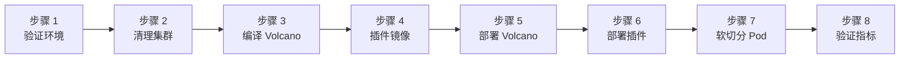

本实验从昇腾 310P3 aarch64 服务器上的干净 Kubernetes 集群开始，最终让两个 Pod 通过 `hami-vnpu-core` 软切分共享一张物理 NPU：各自锁定独立的 8192 MiB 显存窗口，并且都能被 Prometheus 指标观测到。

软切分要求 [Volcano](https://github.com/volcano-sh/volcano) ≥ 1.16，而验证时（最新稳定版 v1.15.1）仅有 `1.16.0-alpha.1` chart、尚无稳定版本，因此本实验从源码编译 Volcano master，插件直接使用官方 `v1.4.0` 镜像部署。如果你运行本实验时已发布稳定的 Volcano 1.16 chart，可以用 chart 安装替代第 3、5 步，其余步骤不变。

:::note 关于本文中的输出

下述输出均采集自 2026-08-14 的真机验证。节点名、IP、Pod 后缀与 UUID 因环境而异；请对比组件名、就绪状态、调度位置与测量值。

:::

## 你将学到什么

- 在宿主机编译 Volcano 并把二进制打包成 containerd 可用的镜像；
- 拉取插件镜像并校验其 `libvnpu.so` 资产与 NPU 驱动匹配；
- 配置 Volcano 的 `deviceshare` 插件以 HAMi 模式 + `binpack` 调度 vNPU；
- 全局打开 `hamiVnpuCore`、按节点打开 `hami-vnpu-core`；
- 用 `npu-smi` 验证容器内显存隔离；
- 通过让两个 Pod 落在同一张物理卡验证 binpack 共享；以及
- 从插件的 `:9395` 端点读取容器级 vNPU 指标。

## 实验概览



## 前提条件

- 一台带昇腾 310P（或 310P3）NPU 的 aarch64 服务器，驱动/npu-smi **≥ 25.5**，并安装了 [ascend-docker-runtime](https://gitcode.com/Ascend/mind-cluster/tree/master/component/ascend-docker-runtime)（软切分仅支持 ARM）。
- 该服务器上一个使用 containerd 的 Kubernetes ≥ 1.20 集群。验证集群为单节点 kubeadm 集群（节点 `aio-node74-arm`，同时是控制面和工作节点），麒麟 V10、Kubernetes v1.28.15、containerd 1.7.1。
- 宿主机上：Go 1.26（验证机为 `go1.26.2 linux/arm64`）、带 Buildx 的 Docker 24（仅用于打包镜像；其镜像存储与 containerd 隔离）、Helm 3、`ctr`（随 containerd 提供）。
- [`tutorials/labs/examples/13-volcano-ascend-vnpu/`](https://github.com/Project-HAMi/website/tree/master/tutorials/labs/examples/13-volcano-ascend-vnpu) 下的实验文件。下文命令中所有 `tutorials/labs/examples/...` 路径均相对 website 仓库检出根目录，请在仓库根目录执行（步骤 3、4 会 `cd` 进 Volcano 与插件源码目录，应用清单前请先切回）。

验证机硬件清单供参考：

| 项目               | 值                                                                 |
| :----------------- | :----------------------------------------------------------------- |
| 操作系统           | 麒麟 V10 Lance（aarch64），内核 4.19.90                            |
| NPU                | 2× 昇腾 310P3，每卡 21525 MB（Bus-Id 0000:81:00.0 / 0000:85:00.0） |
| 驱动 / npu-smi     | 25.5.1                                                             |
| Kubernetes         | v1.28.15 单节点，Flannel，containerd 1.7.1                         |
| Go / Docker / Helm | go1.26.2、Docker 24.0.4 + Buildx v0.27.0、Helm v3.9.0              |
| 测试镜像           | `quay.io/ascend/vllm-ascend:v0.18.0-310p`                          |

## 步骤 1：验证环境

确认驱动能看到健康的 NPU：

```bash
npu-smi info
```

```text
+--------------------------------------------------------------------------------------------------------+
| npu-smi 25.5.1                                   Version: 25.5.1                                       |
+-------------------------------+-----------------+------------------------------------------------------+
| NPU     Name                  | Health          | Power(W)     Temp(C)           Hugepages-Usage(page) |
| Chip    Device                | Bus-Id          | AICore(%)    Memory-Usage(MB)                        |
+===============================+=================+======================================================+
| 4       310P3                 | OK              | NA           37                0     / 0             |
| 0       0                     | 0000:81:00.0    | 0            1848 / 21525                            |
+===============================+=================+======================================================+
| 5       310P3                 | OK              | NA           40                0     / 0             |
| 0       1                     | 0000:85:00.0    | 0            1849 / 21525                            |
+===============================+----------------=+======================================================+
```

HAMi-core 模式要求节点带 `ascend=on` 标签（插件的 DaemonSet 按它选择节点）。检查节点与标签，节点名换成你的：

```bash
kubectl get nodes -o wide
kubectl get node aio-node74-arm -o jsonpath-as-json='{.metadata.labels}' \
  | python3 -m json.tool | grep -iE "ascend|accelerator|servertype"
```

```text
NAME             STATUS   ROLES                  AGE    VERSION    INTERNAL-IP   OS-IMAGE                                  KERNEL-VERSION                     CONTAINER-RUNTIME
aio-node74-arm   Ready    control-plane,worker   358d   v1.28.15   172.26.1.74   Kylin Linux Advanced Server V10 (Lance)   4.19.90-52.48.v2207.ky10.aarch64   containerd://1.7.1

    "accelerator": "huawei-Ascend310P",
    "ascend": "on",
    "servertype": "Ascend310P-8",
```

如果缺少 `ascend=on`，补上：

```bash
kubectl label node aio-node74-arm ascend=on --overwrite
```

最后确认 containerd 已配置 Ascend 运行时 handler。业务 Pod 会声明 `runtimeClassName: ascend`，经由它做设备注入：

```bash
grep -A3 'runtimes.ascend' /etc/containerd/config.toml
```

```text
[plugins."io.containerd.grpc.v1.cri".containerd.runtimes.ascend]
  runtime_type = "io.containerd.runc.v2"
  [plugins."io.containerd.grpc.v1.cri".containerd.runtimes.ascend.options]
    BinaryName = "/usr/local/Ascend/Ascend-Docker-Runtime/ascend-docker-runtime"
```

该配置随昇腾驱动/容器运行时套件安装。如果没有，先安装 ascend-docker-runtime 并重启 containerd 再继续。

## 步骤 2：清理已有部署

如果机器上已装 Volcano 或 HAMi 昇腾插件，先全部清理，让实验从已知状态开始：

```bash
helm uninstall volcano -n volcano-system

kubectl -n kube-system delete ds hami-ascend-device-plugin
kubectl -n kube-system delete cm hami-scheduler-device hami-device-node-config
kubectl delete clusterrole,clusterrolebinding hami-ascend
kubectl -n kube-system delete sa hami-ascend
kubectl delete runtimeclass ascend

rm -rf /usr/local/hami-vnpu-core/containers/*
rm -rf /usr/local/hami-shared-region/*
```

如果卸载后 `volcano-system` 一直卡在 `Terminating`（webhook 删除后的已知现象），先触发删除再清掉 finalizer：

```bash
kubectl delete ns volcano-system --wait=false
kubectl get ns volcano-system -o json | python3 -c "
import json,sys
ns = json.load(sys.stdin)
ns['spec']['finalizers'] = []
json.dump(ns, sys.stdout)
" | kubectl replace --raw "/api/v1/namespaces/volcano-system/finalize" -f -
```

确认已清理干净：

```bash
kubectl get clusterrole,clusterrolebinding,validatingwebhookconfiguration,mutatingwebhookconfiguration,crd 2>&1 \
  | grep -iE "volcano|hami" || echo CLEAN
```

```text
CLEAN
```

## 步骤 3：源码编译 Volcano 镜像

克隆 Volcano 并签出验证时的 commit（当时的 master）：

```bash
git clone https://github.com/volcano-sh/volcano.git /root/temp/volcano
cd /root/temp/volcano
git checkout 7d9504320533a9f4e9bfbb59f79ec5c53a68f3e8
```

Volcano 官方 `make images` 会在 builder 容器内执行 `go mod download`，在受限网络上很不稳定（连 `proxy.golang.org` 超时、换 `goproxy.cn` 也会被断连）。本实验改为**宿主机编译**（模块缓存是热的），Docker 只负责打包静态二进制：

```bash
make vc-scheduler vc-controller-manager vc-webhook-manager
```

```text
$ ls -lh _output/bin/
total 157M
-rwxr-xr-x 1 root root 51M  vc-controller-manager
-rwxr-xr-x 1 root root 60M  vc-scheduler
-rwxr-xr-x 1 root root 48M  vc-webhook-manager
```

Volcano 以 `CGO_ENABLED=0` 编译，任意基础镜像都可用。scheduler 与 controller-manager 只需 alpine + 二进制；webhook-manager 还需要 kubectl（admission init job 生成证书用）与仓库的 `gen-admission-secret.sh`：

```bash
cat <<'EOF' | docker buildx build -t volcanosh/vc-scheduler:latest -f - . --load
FROM alpine:3.24.1
COPY _output/bin/vc-scheduler /vc-scheduler
ENTRYPOINT ["/vc-scheduler"]
EOF

cat <<'EOF' | docker buildx build -t volcanosh/vc-controller-manager:latest -f - . --load
FROM alpine:3.24.1
COPY _output/bin/vc-controller-manager /vc-controller-manager
ENTRYPOINT ["/vc-controller-manager"]
EOF

cat <<'EOF' | docker buildx build -t volcanosh/vc-webhook-manager:latest -f - . --load
FROM alpine:3.24.1
RUN apk add --update ca-certificates && \
    apk add --update openssl && \
    apk add --update -t deps curl && \
    curl -L https://dl.k8s.io/release/v1.28.15/bin/linux/arm64/kubectl -o /usr/local/bin/kubectl && \
    chmod +x /usr/local/bin/kubectl && \
    apk del --purge deps && \
    rm /var/cache/apk/*
COPY _output/bin/vc-webhook-manager /vc-webhook-manager
ADD ./installer/dockerfile/webhook-manager/gen-admission-secret.sh /gen-admission-secret.sh
ENTRYPOINT ["/vc-webhook-manager"]
EOF
```

```text
$ docker images --format "{{.Repository}}:{{.Tag}}  {{.Size}}" | grep "volcanosh/vc-.*:latest"
volcanosh/vc-webhook-manager:latest  114MB
volcanosh/vc-controller-manager:latest  61.7MB
volcanosh/vc-scheduler:latest  70.8MB
```

集群运行时是 containerd，而 Docker 的镜像存储对 kubelet 不可见，因此要把三个镜像全部导入 containerd 的 `k8s.io` namespace：

```bash
for img in vc-scheduler vc-controller-manager vc-webhook-manager; do
  docker save volcanosh/$img:latest | ctr -n k8s.io images import -
done
```

```text
unpacking docker.io/volcanosh/vc-scheduler:latest (sha256:63e40eb5...)...done
unpacking docker.io/volcanosh/vc-controller-manager:latest (sha256:1de7438d...)...done
unpacking docker.io/volcanosh/vc-webhook-manager:latest (sha256:afe553d5...)...done
```

抽查一个镜像（版本号是经 ldflags 注入的 commit SHA）：

```bash
docker run --rm volcanosh/vc-scheduler:latest --version
```

```text
API Version: v1alpha1
Version: 7d9504320533a9f4e9bfbb59f79ec5c53a68f3e8
Git SHA: 7d9504320533a9f4e9bfbb59f79ec5c53a68f3e8
Built At: 2026-08-14 15:25:14
Go Version: go1.26.2
```

## 步骤 4：获取 ascend-device-plugin 镜像

从 [Project-HAMi/ascend-device-plugin](https://github.com/Project-HAMi/ascend-device-plugin) 拉取官方镜像（多架构，含 arm64）并导入 containerd：

```bash
docker pull projecthami/ascend-device-plugin:v1.4.0
docker save projecthami/ascend-device-plugin:v1.4.0 | ctr -n k8s.io images import -
```

镜像内置了 [Project-HAMi/hami-vnpu-core](https://github.com/Project-HAMi/hami-vnpu-core) 的 `libvnpu.so` 拦截库（由插件 CI 在 CANN 环境中构建）：插件把它拷贝到宿主机 `/usr/local/hami-vnpu-core/`，再由 Ascend 运行时通过 `ld.so.preload` 注入业务容器。**库的版本必须与 NPU 驱动匹配。** 不匹配不会报错，容器内 `npu-smi` 只会永远卡在 `Initialize SchedulerClient...`。验证时就因两个月前缓存的 `libvnpu` 资产出现过完全相同的故障。如果遇到卡死，请对比镜像内资产与匹配驱动的镜像版本：

```bash
docker run --rm --entrypoint md5sum projecthami/ascend-device-plugin:v1.4.0 \
  /usr/local/hami-vnpu-core-assets/libvnpu.so
```

## 步骤 5：部署 Volcano 并开启 HAMi 模式 deviceshare

用本地 chart 安装 Volcano。注意镜像拉取策略的 key：是 `basic.image_pull_policy`（下划线）。写成 `scheduler.imagePullPolicy` 会静默无效，节点会去拉取只有本地才有的镜像：

```bash
helm install volcano /root/temp/volcano/installer/helm/chart/volcano \
  --namespace volcano-system --create-namespace \
  --set basic.image_pull_policy=IfNotPresent \
  --timeout 300s
```

```text
NAME: volcano
NAMESPACE: volcano-system
STATUS: deployed
REVISION: 1
```

三个组件全部基于本地编译的镜像运行：

```bash
kubectl -n volcano-system get pods -o wide
```

```text
NAME                                   READY   STATUS      RESTARTS   AGE   IP            NODE
volcano-admission-5bc7fb6d67-btbfp     1/1     Running     0          20s   10.244.0.86   aio-node74-arm
volcano-admission-init-kgcqb           0/1     Completed   0          25s   10.244.0.84   aio-node74-arm
volcano-controllers-557bd8d995-tz4st   1/1     Running     0          20s   10.244.0.85   aio-node74-arm
volcano-scheduler-ff5d85ffb-k7slw      1/1     Running     0          20s   10.244.0.87   aio-node74-arm
```

接着把调度器的 `deviceshare` 插件指向 HAMi 的 vNPU 规格。请在 website 仓库根目录执行下面的清单命令（示例路径相对该根目录）：

```bash
kubectl apply -f tutorials/labs/examples/13-volcano-ascend-vnpu/01-volcano-scheduler-configmap.yaml
kubectl -n volcano-system rollout restart deploy volcano-scheduler
```

所应用的 `volcano-scheduler.conf` 保留 Volcano 标准插件分层，只在 `deviceshare` 上追加 HAMi 模式参数：

```yaml
actions: "enqueue, allocate, backfill"
tiers:
  - plugins:
      - name: priority
      - name: gang
        enablePreemptable: false
      - name: conformance
  - plugins:
      - name: overcommit
      - name: drf
        enablePreemptable: false
      - name: predicates
      - name: deviceshare
        arguments:
          deviceshare.AscendHAMiVNPUEnable: "true"
          deviceshare.SchedulePolicy: binpack
          deviceshare.KnownGeometriesCMNamespace: kube-system
          deviceshare.KnownGeometriesCMName: hami-scheduler-device
      - name: proportion
      - name: nodeorder
      - name: binpack
```

验证调度器加载了新配置：

```bash
kubectl -n volcano-system logs deploy/volcano-scheduler | grep -A4 "name: deviceshare"
```

```text
I0814 07:40:47.668217     1 scheduler.go:160]       - name: deviceshare
I0814 07:40:47.668222     1 scheduler.go:160]           deviceshare.AscendHAMiVNPUEnable: "true"
I0814 07:40:47.668225     1 scheduler.go:160]           deviceshare.SchedulePolicy: binpack
I0814 07:40:47.668230     1 scheduler.go:160]           deviceshare.KnownGeometriesCMNamespace: kube-system
```

如果同一集群里还跑 Volcano vGPU（NVIDIA），需把两边的规格 ConfigMap 合并为一个并让 `KnownGeometriesCMName` 指向它，因为 volcano-vgpu 有自己的一套。

## 步骤 6：以 hami-core 模式部署插件

先应用插件仓库的 RuntimeClass，再应用打开 `hamiVnpuCore` 的设备配置（模板默认为 `false`）：

```bash
kubectl apply -f https://raw.githubusercontent.com/Project-HAMi/ascend-device-plugin/v1.4.0/ascend-runtimeclass.yaml

curl -s https://raw.githubusercontent.com/Project-HAMi/ascend-device-plugin/v1.4.0/ascend-device-configmap.yaml \
  | sed 's/hamiVnpuCore: false/hamiVnpuCore: true/' | kubectl apply -f -
```

```text
runtimeclass.node.k8s.io/ascend created
configmap/hami-scheduler-device created
```

ConfigMap 中 310P3 的条目就是 Pod 资源与硬件的对应关系（每卡 `memoryAllocatable: 21527` MB、8 个 AI 核心，最小模板 `vir01` 为 3072 MB）：

```yaml
vnpus:
  hamiVnpuCore: true
  configs:
    - chipName: 310P3
      commonWord: Ascend310P
      resourceName: huawei.com/Ascend310P
      resourceMemoryName: huawei.com/Ascend310P-memory
      memoryAllocatable: 21527
      memoryCapacity: 24576
      aiCore: 8
      aiCPU: 7
```

然后是按节点的开关。`vDeviceCount` 限制每张物理卡的 vNPU 数，插件会直接采用该值（支持由 [ascend-device-plugin PR #100](https://github.com/Project-HAMi/ascend-device-plugin/pull/100) 引入）；`7` 与下面的验证容量一致：

```bash
kubectl apply -f tutorials/labs/examples/13-volcano-ascend-vnpu/02-hami-device-node-config.yaml
```

```yaml
apiVersion: v1
kind: ConfigMap
metadata:
  labels:
    app.kubernetes.io/component: hami-scheduler
    app.kubernetes.io/name: hami
    app.kubernetes.io/instance: hami
  name: hami-device-node-config
  namespace: kube-system
data:
  node-config.yaml: |-
    nodes:
      - name: "aio-node74-arm"
        hami-vnpu-core: true
        vDeviceCount: 7
        filterDevices:
          index: []
          uuid: []
```

把 `aio-node74-arm` 换成你的节点名。最后应用 RBAC 与 DaemonSet（清单使用 `projecthami/ascend-device-plugin:v1.4.0` 且 `imagePullPolicy: IfNotPresent`，因此会运行步骤 4 导入的镜像）：

```bash
kubectl apply -f https://raw.githubusercontent.com/Project-HAMi/ascend-device-plugin/v1.4.0/ascend-device-plugin.yaml
```

```text
clusterrole.rbac.authorization.k8s.io/hami-ascend created
clusterrolebinding.rbac.authorization.k8s.io/hami-ascend created
serviceaccount/hami-ascend created
daemonset.apps/hami-ascend-device-plugin created
```

:::important 一次性应用完整清单

请完整应用 `ascend-device-plugin.yaml`。手工截取清单（比如只复制 DaemonSet 部分）会破坏 selector/label 匹配并产生费解的报错。

:::

等插件就绪后检查日志中 HAMi-core 健康启动的三个标志（节点配置匹配、metrics 服务启动、宿主机资产写入）：

```bash
kubectl -n kube-system get pods -o wide | grep ascend
kubectl -n kube-system logs ds/hami-ascend-device-plugin | grep -iE "matched|libvnpu|metrics|config file"
```

```text
hami-ascend-device-plugin-lnd4c   1/1   Running   0   20s   10.244.0.89   aio-node74-arm

I0814 07:47:39.795228       1 main.go:124] using config file: /device-config.yaml
I0814 07:47:40.290044       1 manager.go:72] Successfully matched node config for aio-node74-arm: {Name:aio-node74-arm HamiVnpuCore:true VDeviceCount:7}
I0814 07:47:40.391244       1 metrics.go:27] vNPU monitor metrics server starting on :9395
I0814 07:47:40.396783       1 server.go:192] ✓ Copied /usr/local/hami-vnpu-core-assets/libvnpu.so -> /usr/local/hami-vnpu-core/libvnpu.so
I0814 07:47:40.396900       1 server.go:180] ✓ /usr/local/hami-vnpu-core/ld.so.preload already up-to-date, skipping
```

此时节点应上报昇腾扩展资源（2 卡 × 7 vNPU = 14，显存 2 × 21527 MiB）：

```bash
kubectl describe node aio-node74-arm | grep huawei.com/Ascend310P
```

```text
  huawei.com/Ascend310P:         14
  huawei.com/Ascend310P-memory:  43054
```

注册显存按芯片配置的每卡 `memoryAllocatable: 21527` MB 计算，比步骤 1 中 `npu-smi` 显示的 21525 MB 每卡多 2 MiB，因此是 43054 而不是 43050。

## 步骤 7：运行软切分 Pod 并验证

部署第一个测试 Pod，申请 1 个 vNPU、8192 MiB 显存切片：

```bash
kubectl apply -f tutorials/labs/examples/13-volcano-ascend-vnpu/03-ascend-vnpu-check.yaml
kubectl wait --for=condition=Ready pod/ascend-vnpu-check --timeout=5m
kubectl get pod ascend-vnpu-check -o wide
```

清单里四个关键开关：

```yaml
apiVersion: v1
kind: Pod
metadata:
  name: ascend-vnpu-check
  annotations:
    huawei.com/vnpu-mode: hami-core
spec:
  schedulerName: volcano
  runtimeClassName: ascend
  containers:
    - name: npu
      image: quay.io/ascend/vllm-ascend:v0.18.0-310p
      command: ["sleep", "infinity"]
      resources:
        limits:
          huawei.com/Ascend310P: "1"
          huawei.com/Ascend310P-memory: "8192"
```

`schedulerName: volcano` 让调度走 `deviceshare`，`runtimeClassName: ascend` 让设备注入走 Ascend 运行时，注解 `huawei.com/vnpu-mode: hami-core` 选择软切分（缺了它 Pod 走模板路径，可能一直 Pending），两个 limits 定义切片大小。

```text
NAME                READY   STATUS    RESTARTS   AGE   IP            NODE
ascend-vnpu-check   1/1     Running   0          30s   10.244.0.90   aio-node74-arm
```

调度注解记录了 Volcano 分配的结果：

```bash
kubectl get pod ascend-vnpu-check -o jsonpath-as-json='{.metadata.annotations}' \
  | python3 -m json.tool | grep -iE "ascend|vnpu|bind"
```

```text
"hami.io/Ascend310P-devices-allocated": "68496E64-20E05477-92C31323-6E78030A-BD003019,Ascend310P,8192,0:;",
"hami.io/bind-phase": "success",
"huawei.com/Ascend310P": "[{\"UUID\":\"68496E64-...\",\"memory\":8192}]",
"huawei.com/vnpu-mode": "hami-core",
```

### 容器只看到自己的切片

在 Pod 内执行 `npu-smi`，与步骤 1 中宿主机视角（同一张卡 `1848 / 21525`）对比：

```bash
kubectl exec ascend-vnpu-check -- npu-smi info
```

```text
[INFO limiter::supervisor] [Supervisor PID:10] won manager election
[INFO limiter::manager] [Manager] Registered as Global Manager #0 (PID: 10). Compute limit: 1, Memory limit: 8192, FixedShare: false
open global registry path is "/hami-shared-region/0_global_registry"
[Global] Global Registry not exist, now creating...
connect to global registry
+--------------------------------------------------------------------------------------------------------+
| npu-smi 25.5.1                                   Version: 25.5.1                                       |
+-------------------------------+-----------------+------------------------------------------------------+
| NPU     Name                  | Health          | Power(W)     Temp(C)           Hugepages-Usage(page) |
| Chip    Device                | Bus-Id          | AICore(%)    Memory-Usage(MB)                        |
+===============================+=================+======================================================+
| 32768   310P3                 | OK              | NA           38                0     / 0             |
| 0       0                     | 0000:81:00.0    | 0            0    / 8192                             |
+===============================+----------------=+======================================================+
```

容器看到的是 `0 / 8192` MB，即 `libvnpu.so` 强制的显存窗口，而不是物理卡的 21525 MB。注入的环境变量印证了接线（先用 `crictl ps` 拿到容器 ID）：

```bash
crictl exec <CID> env | grep -E "NPU_|ASCEND_VIS"
```

```text
ASCEND_VISIBLE_DEVICES=0
NPU_LOCAL_SHM_PATH=/hami-vnpu-shmem/vnpu_local_shmem
NPU_GLOBAL_SHM_PATH=/hami-shared-region/0_global_registry
NPU_MEM_QUOTA=8192
```

### binpack 让两个 Pod 共享一张卡

启动第二个同规格 Pod（`04-ascend-vnpu-check-2.yaml`）：

```bash
kubectl apply -f tutorials/labs/examples/13-volcano-ascend-vnpu/04-ascend-vnpu-check-2.yaml
kubectl wait --for=condition=Ready pod/ascend-vnpu-check-2 --timeout=5m
kubectl exec ascend-vnpu-check-2 -- npu-smi info | grep -E "Memory limit|0000"
```

```text
[INFO limiter::manager] [Manager] Registered as Global Manager #1 (PID: 10). Compute limit: 1, Memory limit: 8192, FixedShare: false
| 0       0                     | 0000:81:00.0    | 0            0    / 8192                             |
```

两个 Pod 的 Bus-Id 都是 `0000:81:00.0`（**同一张物理卡**），各自拥有独立的 8192 MiB 窗口。`Global Manager #0` / `#1` 两行说明两个容器注册进了同一个共享注册表，HAMi-core 由此协调它们在这张卡上的算力调度。再看节点的计量：

```bash
kubectl describe node aio-node74-arm | grep huawei.com/Ascend310P
```

```text
  huawei.com/Ascend310P:         14
  huawei.com/Ascend310P-memory:  43054
  huawei.com/Ascend310P          2            2
  huawei.com/Ascend310P-memory   16384        16384
```

已分配 2 个 vNPU、2 × 8192 = 16384 MiB。同规格的第三个 Pod 仍能放进这张卡（3 × 8192 < 21527）；把数量加到总显存超过 `memoryAllocatable` 为止，超出的 Pod 会一直 Pending 直到释放容量，因为 binpack 会先把一张卡填满再碰第二张。

## 步骤 8：验证 vNPU 监控指标

metrics 端点在**device-plugin Pod**（9395 端口）上，不在业务 Pod 上。按 label 查询：

```bash
PLUGIN_IP=$(kubectl -n kube-system get pod \
  -l app.kubernetes.io/component=hami-ascend-device-plugin \
  -o jsonpath='{.items[0].status.podIP}')
curl -s "$PLUGIN_IP":9395/metrics | grep -E "^hami"
```

```text
hami_container_device_utilization_ratio{container="npu",device_uuid="68496E64-...",namespace="default",pod="ascend-vnpu-check",vdevice_index="0"} 0
hami_container_device_utilization_ratio{container="npu",device_uuid="68496E64-...",namespace="default",pod="ascend-vnpu-check-2",vdevice_index="0"} 0
hami_host_gpu_memory_used_bytes{device_index="0",device_type="Ascend-Atlas 300I Pro",device_uuid="68496E64-..."} 1.937768448e+09
hami_host_gpu_memory_used_bytes{device_index="1",device_type="Ascend-Atlas 300I Pro",device_uuid="D8496E64-..."} 1.938817024e+09
hami_vgpu_memory_limit_bytes{container="npu",...,pod="ascend-vnpu-check",vdevice_index="0"} 8.589934592e+09
hami_vgpu_memory_limit_bytes{container="npu",...,pod="ascend-vnpu-check-2",vdevice_index="0"} 8.589934592e+09
```

解读这些数字：

- `hami_vgpu_memory_limit_bytes = 8.589934592e+09` 字节 = 恰好 8192 MiB，与两个 Pod 的申请值一致；
- 两条 vdevice 序列共享物理卡 0 的 UUID，即步骤 7 的 binpack 结果；
- `hami_host_gpu_memory_used_bytes` 按卡上报宿主机用量（每张空闲卡约 1.9 GB 驱动开销）；
- 利用率指标为 `0`，因为 Pod 只在 `sleep`。

该端点还导出 `hami_vgpu_memory_used_bytes` 及 buffer/context/module 细分，以及 `hami_host_gpu_utilization_ratio`。也可以用 port-forward 代替直连 Pod IP：

```bash
PLUGIN_POD=$(kubectl -n kube-system get pod \
  -l app.kubernetes.io/component=hami-ascend-device-plugin \
  -o jsonpath='{.items[0].metadata.name}')
kubectl -n kube-system port-forward "pod/$PLUGIN_POD" 9395:9395 &
curl -s http://localhost:9395/metrics
```

## 故障排查

| 症状 | 验证环境中的原因 | 处理 |
| :-- | :-- | :-- |
| 容器内 `npu-smi info` 卡死在 `Initialize SchedulerClient...` | `libvnpu.so` 与 NPU 驱动不匹配（资产来源镜像过期） | 改用 `libvnpu.so` 资产与驱动匹配的发布镜像（校验 md5）；重启插件刷新宿主机副本 |
| Pod 报 `ErrImageNeverPull` | Docker 与 containerd 镜像存储隔离 | `docker save  \| ctr -n k8s.io images import -` |
| 节点仍尝试拉取本地才有的镜像 | Helm 拉取策略 key 写错 | 使用 `basic.image_pull_policy`（下划线） |
| 卸载后 `volcano-system` 卡在 `Terminating` | webhook 删除后 namespace finalizer 未释放 | 经 `finalize` 子资源清理 finalizer（步骤 2） |
| 手工复制的 DaemonSet `kubectl apply` 报 selector 错误 | 清单被截断 | 完整应用仓库清单；`sed` 只用于替换镜像 tag |
| 在业务 Pod 里 `curl :9395` 无响应 | metrics 由插件 DaemonSet 提供，不是业务 Pod | 按 label 选中插件 Pod（步骤 8） |
| `make images` 中 `go mod download` 失败 | 容器内下载在受限网络超时 | 宿主机编译；Docker 只打包二进制 |
| Pod 分配失败报 `cannot patch resource "pods"` | ClusterRole 丢了 `pods` 的 `patch`/`update` 权限 | 原样保留仓库 RBAC；插件必须回写 Pod 的分配注解 |

:::note 三个避免困惑的事实

- **`-core` 不会被注册。** v1.4.0 不会把 `huawei.com/Ascend310P-core` 注册为节点资源；配置中的 `resourceCoreName` 不会上报。Pod spec 只需卡数与显存 MiB。
- **是 `libvnpu.so`，不是 `libvgpu.so`。** HAMi 在 NVIDIA 上的拦截库是 `libvgpu.so`；昇腾 HAMi-core 用的是 `libvnpu.so`，经 `/etc/ld.so.preload` 注入，宿主机资产位于 `/usr/local/hami-vnpu-core/`。
- **资源名来自 `commonWord`。** 芯片叫 `310P3`，但 Kubernetes 资源是 `huawei.com/Ascend310P`；写成 `huawei.com/Ascend310P3` 或 `huawei.com/Ascend` Pod 会一直 Pending。

:::

## 清理

删除测试 Pod：

```bash
kubectl delete pod ascend-vnpu-check ascend-vnpu-check-2
```

删除插件及其资源：

```bash
kubectl -n kube-system delete ds hami-ascend-device-plugin
kubectl -n kube-system delete cm hami-scheduler-device hami-device-node-config
kubectl delete clusterrole,clusterrolebinding hami-ascend
kubectl -n kube-system delete sa hami-ascend
kubectl delete runtimeclass ascend
rm -rf /usr/local/hami-vnpu-core/containers/* /usr/local/hami-shared-region/*
```

卸载 Volcano（若卡住，按步骤 2 清理 finalizer）：

```bash
helm uninstall volcano -n volcano-system
```

Volcano 镜像仍留在 Docker 与 containerd 中，连同插件镜像一并删除：

```bash
for img in vc-scheduler vc-controller-manager vc-webhook-manager; do
  docker rmi volcanosh/$img:latest
  ctr -n k8s.io images remove docker.io/volcanosh/$img:latest
done
docker rmi projecthami/ascend-device-plugin:v1.4.0
ctr -n k8s.io images remove docker.io/projecthami/ascend-device-plugin:v1.4.0
```

## 本实验证明了什么

| 论断 | 证据 |
| :-- | :-- |
| Volcano 以 HAMi 模式调度源码构建镜像的 vNPU | 3 个组件 Running；调度器日志含 `AscendHAMiVNPUEnable: "true"` |
| 插件上报软切分容量 | 节点上报 `Ascend310P: 14`、`Ascend310P-memory: 43054` |
| 容器显存视图被限制，而非仅被调度 | 容器内 `npu-smi` 显示 `0 / 8192`；宿主机显示 `1848 / 21525` |
| 配额按容器下发 | 注入 `NPU_MEM_QUOTA=8192`；两个 Pod 均报 `Memory limit: 8192` |
| binpack 把多个 vNPU 装进一张卡 | 两个 Pod 同为 Bus-Id `0000:81:00.0`；节点分配 2 vNPU / 16384 MiB |
| 切片经同一注册表协调 | `/hami-shared-region/0_global_registry` 中的 `Global Manager #0` 与 `#1` |
| 整条链路可观测 | `:9395` 上报的容器级 limit 恰为 8192 MiB |

一个如实的边界说明：测试 Pod 只在 `sleep`，因此本实验证明的是配额被下发、按容器生效并在容器内可见，并未实际执行越配额的分配。要证明超过切片的分配会被拒绝，需要运行真正吃显存的负载（例如把显存参数设到 8192 MiB 以上的 vLLM），可作为本实验的扩展；GPU 上等价的越界验证可参考[实验 12](./kai-scheduler-hami-gke.md) 中超配额 `cudaMalloc` 的做法。

## 延伸阅读

- 架构背景与 Volcano vNPU 两种模式的对比：[用 Volcano + HAMi-core 软切分昇腾 vNPU](/zh/blog/volcano-ascend-vnpu-soft-slicing)
- 对比 [实验 8：Volcano vGPU、Gang 调度与队列限制](./volcano-vgpu-gang-queue.md)：同一套调度器在 NVIDIA GPU 上的用法
- 把测试 Pod 包进 Volcano `VCJob`（`tasks[].template`），在软切分之上叠加 Gang 调度与队列
- 参考 [Volcano 中的华为昇腾设备](/zh/docs/installation/how-to-use-volcano-ascend) 用户指南与上游 [ascend-device-plugin Volcano 指南](https://github.com/Project-HAMi/ascend-device-plugin/blob/main/docs/volcano.md)
