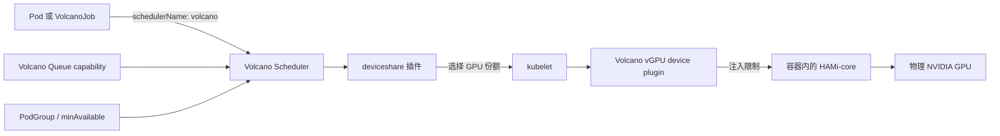

本实验组合了 AI 基础设施中经常同时出现的两类能力：

- Volcano vGPU 与 HAMi-core 负责共享一张物理 NVIDIA GPU，并向容器提供显存和算力限制。
- Volcano Scheduler 提供批任务调度语义，包括 Gang 调度和队列级资源上限。

你将先验证一个 vGPU Pod，然后运行一个双 worker VolcanoJob；接着故意制造 Gang 资源不足场景；最后证明即使节点本身还有足够资源，Queue 也能通过 `capability` 限制 vGPU 用量。

本文输出采集自一套单节点集群：一张 NVIDIA GeForce RTX 3070 Ti（8 GiB）、NVIDIA 驱动 580.159.03、Volcano Scheduler，以及以 HAMi-core 模式运行的 Volcano vGPU device plugin。其他 GPU 上的资源数值会有所不同。

:::important

本实验使用的是 **Volcano vGPU 路线**，不是标准 HAMi Helm 安装路线。不要在同一个 GPU 节点上同时安装标准 HAMi device plugin。一个 GPU 节点在同一时间应只由一种 device-plugin 路线管理。

:::

## 你将学到什么

完成本实验后，你将能够：

- 区分标准 HAMi 资源与 Volcano vGPU 资源；
- 为 Volcano 开启用于 vGPU 调度的 `deviceshare` 插件；
- 在 GPU 节点上注册 `volcano.sh/vgpu-*` 资源；
- 验证 HAMi-core 向容器注入显存和算力限制；
- 使用 `minAvailable` 为 VolcanoJob 设置 Gang 调度语义；
- 识别 Gang 无法满足时符合预期的 `Inqueue` 状态；
- 使用 Queue `capability` 限制 vGPU 数量、显存和算力；
- 区分 Queue 上限导致的失败和节点容量不足导致的失败。

## 标准 HAMi 与 Volcano vGPU

两条路线都使用 HAMi-core 实现用户态 GPU 隔离，但调度器、device plugin 和资源名不同。

| 路线 | 调度器与 device plugin | Pod 资源名 |
| --- | --- | --- |
| 标准 HAMi | HAMi scheduler、webhook 和 HAMi device plugin | `nvidia.com/gpu`、`nvidia.com/gpumem`、`nvidia.com/gpucores` |
| Volcano vGPU | Volcano Scheduler、`deviceshare` 和 `volcano-vgpu-device-plugin` | `volcano.sh/vgpu-number`、`volcano.sh/vgpu-memory`、`volcano.sh/vgpu-cores` |

本实验的每个 Pod 和 VolcanoJob 都显式设置：

```yaml
schedulerName: volcano
```

并且只申请 `volcano.sh/vgpu-*` 资源。不要在同一个工作负载中混用两套资源模型。

## 架构



Volcano Scheduler 决定工作负载能否运行以及运行在哪个节点；device plugin 注册 vGPU 资源并处理设备分配；HAMi-core 执行容器可见的 GPU 显存和算力设置。Queue 和 Gang 约束由调度器判断，不能替代容器自己的 `resources.limits`。

## 实验概览

| 步骤 | 目标 | 成功证据 |
| --- | --- | --- |
| 1. 记录基线 | 确认集群、GPU runtime 和 Volcano 健康 | 节点 `Ready`、宿主机 `nvidia-smi` 正常、Volcano Pod 正常 |
| 2. 开启 vGPU 调度 | 配置 `deviceshare` 插件 | Scheduler rollout 成功 |
| 3. 安装 device plugin | 注册 Volcano vGPU 扩展资源 | 节点出现 `volcano.sh/vgpu-*` capacity |
| 4. 测试单 Pod | 验证分配和 HAMi-core 注入 | 环境变量出现 2000 MiB/30% 限制；`nvidia-smi` 显示 2000 MiB |
| 5. 测试 Gang | 将两个 worker 作为整体启动 | VolcanoJob、PodGroup 和两个 worker 都是 `Running` |
| 6. 制造 GPU 资源不足 | 让完整 Gang 的申请超过单卡容量 | PodGroup 保持 `Inqueue` 并显示 `NotEnoughResources` |
| 7. 限制 Queue | 对比 Queue 上限以内和以上的 Job | 合规 Job 运行；超限 Job 在节点仍有容量时保持 `Pending` |

## 前提条件

- Kubernetes 1.16 或更高版本，并有一个健康的 NVIDIA GPU 节点。
- NVIDIA 驱动高于 440；宿主机执行 `nvidia-smi` 必须成功。
- NVIDIA container runtime 已配置为默认 runtime。
- 已安装 Volcano 1.9～1.15。本实验固定使用 vGPU plugin v1.11.0；该项目的兼容矩阵说明 v1.12.0 及更早版本与 Volcano 1.15.0 及更早版本兼容。
- `kubectl` 账号有权修改 Volcano Scheduler ConfigMap、创建集群级 Queue，并在 `kube-system` 中安装 DaemonSet。
- 已获取 [`tutorials/labs/examples/08-volcano-vgpu/`](https://github.com/Project-HAMi/website/tree/master/tutorials/labs/examples/08-volcano-vgpu/) 中的清单。

:::warning device plugin 互斥

如果已经有其他组件管理同一个 GPU 节点，请不要继续，例如 NVIDIA 官方 device plugin、标准 HAMi device plugin 或另一个 Volcano vGPU device plugin。多个插件可能注册冲突资源，使实验结果无法解释。

:::

下面的资源值针对 8 GiB GPU 设计：

- 成功 Gang 申请 `2 × 2000 MiB = 4000 MiB`；
- 资源不足 Gang 申请 `2 × 6000 MiB = 12000 MiB`；
- Queue 上限为 4000 MiB；
- Queue 负例申请 6000 MiB，高于 Queue 上限，但低于空闲节点约 8192 MiB 的容量。

如果你的 GPU 显存不同，调整清单时需要保持这些大小关系。

## 步骤 1：记录环境基线

设置一次节点名称：

```bash
export NODE_NAME=$(kubectl get nodes -o jsonpath='{.items[0].metadata.name}')
echo "NODE_NAME=${NODE_NAME}"
```

检查 Kubernetes 和节点：

```bash
kubectl version
kubectl get node "${NODE_NAME}" -o wide
```

确认宿主机驱动正常：

```bash
nvidia-smi
```

确认 Volcano 控制面和默认 Queue：

```bash
kubectl get pods -n volcano-system
kubectl get queue
```

你应该能看到 Volcano admission controller、controllers、scheduler 和 `default` Queue。未显式指定 Queue 的 VolcanoJob 会进入 `default`，但本实验始终写出 Queue 名称，使调度路径更加清楚。

记录组件精确版本，便于复现：

```bash
kubectl -n volcano-system get deploy volcano-scheduler \
  -o jsonpath='{.spec.template.spec.containers[*].image}'; echo

kubectl -n kube-system get daemonset \
  -o custom-columns=NAME:.metadata.name,IMAGES:.spec.template.spec.containers[*].image
```

检查现有 GPU device plugin：

```bash
kubectl -n kube-system get daemonset | grep -Ei 'nvidia|hami|volcano' || true
```

如果 NVIDIA 或标准 HAMi device plugin 已经管理该节点，请使用新集群，或按照对应组件的卸载流程移除它，再继续本实验。

创建实验命名空间：

```bash
kubectl create namespace volcano-demo
```

## 步骤 2：开启 Volcano vGPU 调度

修改前先备份 Scheduler 配置：

```bash
kubectl get configmap volcano-scheduler-configmap -n volcano-system -o yaml \
  > /tmp/volcano-scheduler-configmap.before-vgpu.yaml
```

打开 ConfigMap：

```bash
kubectl edit configmap volcano-scheduler-configmap -n volcano-system
```

确认第二个 scheduler tier 中包含开启 vGPU 的 `deviceshare`：

```yaml
data:
  volcano-scheduler.conf: |
    actions: "enqueue, allocate, backfill"
    tiers:
    - plugins:
      - name: priority
      - name: gang
      - name: conformance
    - plugins:
      - name: drf
      - name: deviceshare
        arguments:
          deviceshare.VGPUEnable: true
          deviceshare.SchedulePolicy: binpack
      - name: predicates
      - name: proportion
      - name: nodeorder
      - name: binpack
```

`deviceshare.VGPUEnable` 开启 Volcano vGPU 调度；`binpack` 倾向于集中放置 GPU 份额。在单 GPU 节点上，无论策略如何，放置结果都是确定的。

重启并检查 Scheduler：

```bash
kubectl rollout restart deployment/volcano-scheduler -n volcano-system
kubectl rollout status deployment/volcano-scheduler -n volcano-system --timeout=120s
kubectl get pods -n volcano-system
```

只有 Scheduler 处于 `Running` 且 rollout 成功后才能继续。

## 步骤 3：安装 Volcano vGPU device plugin

安装固定版本 v1.11.0 的清单：

```bash
kubectl apply -f \
  https://raw.githubusercontent.com/Project-HAMi/volcano-vgpu-device-plugin/v1.11.0/volcano-vgpu-device-plugin.yml
```

部分旧教程使用的未固定版本 URL 已经不在 `main` 根目录。使用已发布版本的固定清单，可以避免未来仓库目录变化导致实验失效。

等待 DaemonSet 就绪：

```bash
kubectl rollout status daemonset/volcano-device-plugin \
  -n kube-system --timeout=180s

kubectl get daemonset -n kube-system | grep volcano
kubectl get pods -n kube-system -o wide | grep volcano-device-plugin
```

确认镜像版本：

```bash
kubectl get daemonset volcano-device-plugin -n kube-system \
  -o jsonpath='{.spec.template.spec.containers[*].image}'; echo
```

查看节点注册的资源：

```bash
kubectl get node "${NODE_NAME}" \
  -o custom-columns='NAME:.metadata.name,NUMBER:.status.allocatable.volcano\.sh/vgpu-number,MEMORY:.status.allocatable.volcano\.sh/vgpu-memory,CORES:.status.allocatable.volcano\.sh/vgpu-cores'
```

在 8 GiB RTX 3070 Ti 上采集到的等价输出为：

```text
NAME        NUMBER   MEMORY   CORES
master-01   10       8192     100
```

需要正确理解这些值：

- `vgpu-number: 10` 不代表十张物理 GPU，而是该卡对外提供的可调度 vGPU 份额数。
- `vgpu-memory` 单位为 MiB，表示插件注册的显存容量。
- `vgpu-cores` 表示可分配算力容量。

后续负例应以你自己节点注册的值进行调整。

## 步骤 4：验证单个 vGPU Pod

检查 `01-single-pod.yaml` 的关键字段：

```yaml
spec:
  schedulerName: volcano
  containers:
    - name: cuda
      resources:
        limits:
          volcano.sh/vgpu-number: 1
          volcano.sh/vgpu-memory: 2000
          volcano.sh/vgpu-cores: 30
```

创建 Pod 并等待就绪：

```bash
kubectl apply -f tutorials/labs/examples/08-volcano-vgpu/01-single-pod.yaml
kubectl wait -n volcano-demo --for=condition=Ready \
  pod/volcano-vgpu-single --timeout=180s
```

检查注入的环境变量：

```bash
kubectl exec -n volcano-demo volcano-vgpu-single -- \
  env | grep -E 'CUDA_DEVICE|NVIDIA_VISIBLE_DEVICES|VGPU|VOLCANO'
```

采集输出：

```text
CUDA_DEVICE_MEMORY_LIMIT_0=2000m
CUDA_DEVICE_SM_LIMIT=30
CUDA_DEVICE_MEMORY_SHARED_CACHE=/tmp/vgpu/6446d246-5917-419d-bdc3-1a119044f857.cache
```

前两个值对应申请的 2000 MiB 显存和 30% 算力限制。

检查容器内 GPU 视图：

```bash
kubectl exec -n volcano-demo volcano-vgpu-single -- nvidia-smi
```

相关采集输出：

```text
[HAMI-core Msg(...:libvgpu.c:870)]: Initializing.....
|   0  NVIDIA GeForce RTX 3070 Ti ... |       0MiB /   2000MiB |      0%      Default |
```

HAMi-core 初始化日志和 2000 MiB 总显存说明 vGPU 设置已经进入容器，并改变了容器看到的 GPU 视图。

:::note 该证据的边界

本步骤证明资源分配和限制注入成功，但没有运行超过上限的 CUDA 显存分配程序，因此不能单独证明 OOM 的执行边界。更强的隔离验证请参考实验 3 或实验 7。

:::

进入 Gang 测试前删除单 Pod，避免它占用显存基线：

```bash
kubectl delete pod volcano-vgpu-single -n volcano-demo
```

## 步骤 5：运行双 worker Gang

成功 VolcanoJob 创建两个 worker。每个 worker 申请一个 vGPU 份额、2000 MiB 显存和 30% 算力，因此完整 Gang 总共需要 4000 MiB 和 60% 算力。

形成 Gang 约束的关键字段是：

```yaml
spec:
  schedulerName: volcano
  queue: default
  minAvailable: 2
  tasks:
    - name: vgpu-worker
      replicas: 2
```

创建 Job：

```bash
kubectl apply -f tutorials/labs/examples/08-volcano-vgpu/02-gang-job.yaml
```

检查 Job、自动生成的 PodGroup 和 Pod：

```bash
kubectl get vcjob,podgroup,pod -n volcano-demo
```

采集输出：

```text
NAME                                      STATUS    MINAVAILABLE   RUNNINGS
job.batch.volcano.sh/vcjob-vgpu-gang     Running   2              2

NAME                                                        STATUS    MINMEMBER   RUNNINGS
podgroup.scheduling.volcano.sh/vcjob-vgpu-gang-...          Running   2           2

NAME                                    READY   STATUS
pod/vcjob-vgpu-gang-vgpu-worker-0       1/1     Running
pod/vcjob-vgpu-gang-vgpu-worker-1       1/1     Running
```

`MINAVAILABLE=2`、`RUNNINGS=2` 和两个 `Running` worker 说明完整 Gang 可以放入集群并获得准入。

检查其中一个 worker 的 GPU 视图：

```bash
kubectl exec -n volcano-demo vcjob-vgpu-gang-vgpu-worker-0 -- nvidia-smi
```

采集结果同样显示 2000 MiB GPU 份额和 HAMi-core 初始化日志。

创建资源不足场景前删除成功 Job：

```bash
kubectl delete vcjob vcjob-vgpu-gang -n volcano-demo
kubectl wait -n volcano-demo --for=delete pod \
  -l volcano.sh/job-name=vcjob-vgpu-gang --timeout=120s || true
```

## 步骤 6：证明 Gang 调度会阻止部分启动

下一个 Job 仍需要两个 worker，但每个申请 6000 MiB。在空闲的 8 GiB 节点上，一个 worker 能放下，两个 worker 无法同时放下：

```text
单个 worker： 6000 MiB <= 8192 MiB
完整 Gang：  12000 MiB > 8192 MiB
```

创建 Job：

```bash
kubectl apply -f tutorials/labs/examples/08-volcano-vgpu/03-gang-insufficient.yaml
sleep 15
kubectl get vcjob,podgroup,pod -n volcano-demo
```

自动生成的 PodGroup 应保持 `Inqueue`，两个 Pod 都应保持 `Pending`。

获取 PodGroup 名称并检查条件：

```bash
export PG_NAME=$(kubectl get podgroup -n volcano-demo \
  -o jsonpath='{.items[0].metadata.name}')

kubectl describe podgroup "${PG_NAME}" -n volcano-demo
```

相关采集条件：

```text
Message: 1/2 tasks in gang unschedulable: pod group is not ready,
         2 Pending, 2 minAvailable; Pending: 1 Schedulable, 1 Unschedulable
Reason:  NotEnoughResources
Type:    Unschedulable
Phase:   Inqueue
```

关键证据是 `1 Schedulable, 1 Unschedulable` 与 `minAvailable: 2` 同时出现：Volcano 单独看可以放置一个 worker，但因为完整的双成员 Gang 无法满足，所以没有只启动其中一部分。

开始 Queue 测试前删除这个负例：

```bash
kubectl delete vcjob vcjob-vgpu-gang-insufficient -n volcano-demo
```

确认没有实验 Pod 继续占用 vGPU：

```bash
kubectl get pods -n volcano-demo
```

## 步骤 7：执行 Queue 级 vGPU 上限

本步骤需要刻意区分 Queue 容量和节点容量。开始前节点必须没有本实验留下的 vGPU 工作负载。

创建一个最多允许两个 vGPU 份额、4000 MiB 和 60% 算力的 Queue：

```bash
kubectl apply -f tutorials/labs/examples/08-volcano-vgpu/04-queue.yaml
kubectl get queue gpu-small-queue -o yaml
```

相关上限为：

```yaml
capability:
  volcano.sh/vgpu-number: "2"
  volcano.sh/vgpu-memory: "4000"
  volcano.sh/vgpu-cores: "60"
```

Queue `capability` 是该 Queue 中所有 Job 资源总用量的硬上限。它不会自行分配 GPU；每个 worker 仍需设置自己的 `resources.limits`。

### Queue 上限以内的 Job

合规 Job 包含两个 worker，每个申请 1000 MiB 和 30% 算力，总计 2000 MiB 和 60% 算力：

```bash
kubectl apply -f tutorials/labs/examples/08-volcano-vgpu/05-queue-fit-job.yaml
kubectl get vcjob,podgroup,pod -n volcano-demo
```

因为总申请未超过 Queue capability，两个 worker 都应该进入 `Running`。

删除合规 Job 并等待资源释放：

```bash
kubectl delete vcjob vcjob-vgpu-queue-fit -n volcano-demo
kubectl wait -n volcano-demo --for=delete pod \
  -l volcano.sh/job-name=vcjob-vgpu-queue-fit --timeout=120s || true
```

### 超过 Queue 上限的 Job

超限 Job 包含两个 worker，每个申请 3000 MiB：

```text
Job 总申请：     6000 MiB
Queue 上限：     4000 MiB
空闲节点容量：约 8192 MiB
```

该 Job 能放入空闲节点，但不能放入 `gpu-small-queue`。

创建 Job：

```bash
kubectl apply -f tutorials/labs/examples/08-volcano-vgpu/06-queue-exceeds-job.yaml
sleep 15
kubectl get vcjob,podgroup,pod -n volcano-demo
```

采集结果：

```text
NAME                                             READY   STATUS
vcjob-vgpu-queue-exceeds-vgpu-worker-0           0/1     Pending
vcjob-vgpu-queue-exceeds-vgpu-worker-1           0/1     Pending

NAME                                             STATUS    MINMEMBER
vcjob-vgpu-queue-exceeds-...                     Inqueue   2
```

检查 PodGroup 和 Queue：

```bash
export PG_NAME=$(kubectl get podgroup -n volcano-demo \
  -o jsonpath='{.items[0].metadata.name}')

kubectl describe podgroup "${PG_NAME}" -n volcano-demo
kubectl describe queue gpu-small-queue
```

PodGroup 指向 `gpu-small-queue`，保持 `Inqueue` 并报告 `NotEnoughResources`。因为前面的 vGPU 工作负载已经全部删除，而 6000 MiB Job 可以放入约 8192 MiB 的节点，所以剩余的限制边界就是 Queue 的 4000 MiB capability。

:::tip 在其他 GPU 上复现

需要选择满足 `Queue 上限 < Job 总申请 <= 节点当前空闲容量` 的数值。如果 Job 总申请也超过节点空闲容量，就无法单独证明 Queue 限制。

:::

## 故障排查

### 节点没有 `volcano.sh/vgpu-*` 资源

检查 plugin Pod、日志和 runtime：

```bash
kubectl get pods -n kube-system -o wide | grep volcano-device-plugin
kubectl logs -n kube-system daemonset/volcano-device-plugin --all-containers --tail=200
kubectl get node "${NODE_NAME}" -o yaml | grep 'volcano.sh/'
```

确认 NVIDIA 驱动正常、NVIDIA runtime 是默认 runtime，并检查是否有第二个 GPU device plugin 管理该节点。

### Pod 被默认调度器处理

确认清单包含：

```yaml
schedulerName: volcano
```

然后检查 Pod 事件：

```bash
kubectl describe pod -n volcano-demo <pod-name> | sed -n '/Events:/,$p'
```

### Gang 保持 `Inqueue`

在负例中，`Inqueue` 和 `NotEnoughResources` 是预期行为。判断为安装故障前，应检查 `minAvailable`、每个 worker 的申请、节点当前分配和所属 Queue。

### Queue 测试因为错误原因失败

删除之前所有实验 Job 和 Pod，并确认节点有足够的空闲 vGPU 显存容纳超限 Job。Job 必须超过 Queue capability，同时仍能放入节点。

### 容器看到完整 GPU 显存

如果缺少 `CUDA_DEVICE_MEMORY_LIMIT_0`，且 `nvidia-smi` 显示完整显存，说明 HAMi-core 没有注入。检查 device plugin 日志，并确认 NVIDIA runtime 是默认 runtime。

### 资源名不一致

不要从其他教程推断资源名，应读取节点实际注册结果：

```bash
kubectl get node "${NODE_NAME}" -o yaml | grep 'volcano.sh/'
```

本实验要求 `volcano.sh/vgpu-number`、`volcano.sh/vgpu-memory` 和 `volcano.sh/vgpu-cores`。

## 清理

删除实验工作负载、Queue 和命名空间：

```bash
kubectl delete vcjob --all -n volcano-demo --ignore-not-found
kubectl delete pod --all -n volcano-demo --ignore-not-found
kubectl delete queue gpu-small-queue --ignore-not-found
kubectl delete namespace volcano-demo
```

如果这是专用实验集群，删除 vGPU plugin：

```bash
kubectl delete -f \
  https://raw.githubusercontent.com/Project-HAMi/volcano-vgpu-device-plugin/v1.11.0/volcano-vgpu-device-plugin.yml
```

只有当备份确实来自本实验，并且没有其他用户依赖 vGPU 配置时，才恢复 Scheduler ConfigMap：

```bash
kubectl apply -f /tmp/volcano-scheduler-configmap.before-vgpu.yaml
kubectl rollout restart deployment/volcano-scheduler -n volcano-system
kubectl rollout status deployment/volcano-scheduler -n volcano-system --timeout=120s
```

## 本实验验证了什么

| 结论 | 证据 |
| --- | --- |
| Volcano 注册了可共享 GPU 资源 | 节点 allocatable 出现 `volcano.sh/vgpu-number`、`vgpu-memory` 和 `vgpu-cores` |
| HAMi-core 设置进入了容器 | 环境变量包含 `CUDA_DEVICE_MEMORY_LIMIT_0=2000m` 和 `CUDA_DEVICE_SM_LIMIT=30` |
| 容器只看到申请的 GPU 份额 | 容器内 `nvidia-smi` 显示 2000 MiB，而不是完整 8 GiB |
| 完整双 worker Gang 可以运行 | VolcanoJob 和 PodGroup 为 `Running`，两个 worker 都为 `Running` |
| Volcano 阻止了 Gang 部分启动 | 2 × 6000 MiB Job 保持 `Inqueue`；条件显示 `1 Schedulable, 1 Unschedulable` 且 `minAvailable: 2` |
| Queue 接受上限以内的 Job | 2 × 1000 MiB、60% 算力的 Job 在 `gpu-small-queue` 中运行 |
| Queue 阻止超过上限的 Job | 空闲 8 GiB 节点上，6000 MiB Job 在 4000 MiB Queue 上限下保持 `Pending`/`Inqueue` |

## 后续学习

- 运行[实验 3：HAMi GPU 切分](/zh/tutorials/labs/gpu-partitioning)或[实验 7：k3s GPU 隔离](/zh/tutorials/labs/hami-isolation-k3s)，使用真实 CUDA OOM 测试证明显存上限。
- 阅读 [Volcano Gang 插件文档](https://volcano.sh/docs/scheduler/plugins/gang/)，了解双 worker Job 之外的 Gang 调度语义。
- 阅读 [Volcano Queue 资源管理文档](https://volcano.sh/docs/keyfeatures/queueresourcemanagement/)，了解 `deserved`、`guarantee`、回收和层级 Queue。
- 升级前查看 [Volcano vGPU device plugin 仓库](https://github.com/Project-HAMi/volcano-vgpu-device-plugin)，确保 plugin 与 Volcano 版本符合已发布的兼容矩阵。
