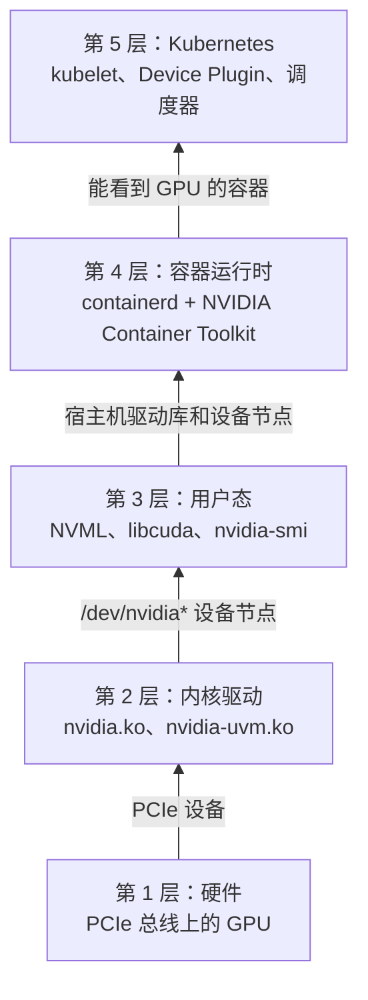

## 场景

一个小型 AI 团队准备在 Kubernetes 上部署第一个模型，手上有一个挂载单张 NVIDIA T4 的节点。在部署之前，他们需要先确认这个节点上的 GPU 环境可用，从硬件、驱动到容器运行时和 Kubernetes，每一层都要正常工作。

本章从硬件开始，逐层向上检查这个节点。

## 你将理解

- GPU 从硬件到 Kubernetes Pod 要经过的 5 层结构
- 为什么每一层只通过下一层暴露的接口来检查
- 为什么宿主机上 `nvidia-smi` 能用，容器没有 NVIDIA Container Toolkit 时却用不了 GPU
- 为什么本章结束时节点上没有 `nvidia.com/gpu` 资源

## 起始状态

本课程不包含集群搭建，起始环境是一个满足下表的节点：

| 层               | 预期状态                                                                    |
| ---------------- | --------------------------------------------------------------------------- |
| 硬件             | 一个带 NVIDIA GPU 的节点。课程使用 T4，任何未开启 MIG 的 NVIDIA GPU 均可。  |
| 内核驱动与用户态 | NVIDIA 驱动安装在宿主机上，`nvidia-smi` 在宿主机上可以正常运行。            |
| 容器运行时       | containerd，已安装 NVIDIA Container Toolkit，并将 `nvidia` 设为默认运行时。 |
| Kubernetes       | 集群正常运行，GPU 节点为 `Ready` 且可调度。                                 |
| Device Plugin    | **无。** GPU 节点上没有 NVIDIA Device Plugin，也没有 HAMi。                 |

第 2 章会安装原生 NVIDIA Device Plugin，展示没有 HAMi 时 Kubernetes 的行为，第 4 章再把它替换为 HAMi。一个节点上只能有一个 Device Plugin 注册 `nvidia.com/gpu`，因此开始本课程时，GPU 节点上不运行任何 Device Plugin。

如果你还没有这样的节点，可以参考[准备 NVIDIA GPU 节点：在宿主机上安装驱动和 Toolkit](/zh/docs/installation/prerequisites#在宿主机安装驱动和-toolkit)进行准备。本课程在这种环境下验证。

## 环境基线

本章使用下列版本验证。后续章节都基于这个节点。

| 组件                       | 版本                                                         |
| -------------------------- | ------------------------------------------------------------ |
| 节点                       | 腾讯云 `GN7.2XLARGE32`（8 vCPU，32 GiB），挂载一张 NVIDIA T4 |
| 操作系统                   | Ubuntu 24.04.4 LTS                                           |
| 内核                       | 6.8.0-138-generic                                            |
| NVIDIA 驱动                | 580.126.20（开源内核模块）                                   |
| CUDA（驱动支持的最高版本） | 13.0                                                         |
| containerd                 | 2.2.1                                                        |
| NVIDIA Container Toolkit   | 1.20.1                                                       |
| Kubernetes                 | v1.36.5                                                      |
| HAMi                       | 暂不安装（第 4 章）                                          |

下文除 `kubectl` 命令外，都在 GPU 节点上以 root 身份执行。`kubectl` 命令可以在任何能访问集群的地方执行。

## 先看问题

在宿主机上运行 `nvidia-smi`：

```bash
nvidia-smi -L
```

```plaintext
GPU 0: Tesla T4 (UUID: GPU-caf9bd30-b03c-04d8-9d4f-8a02f984cc23)
```

宿主机能识别到 GPU。接下来在 CUDA 容器里运行同样的命令，先拉取镜像：

```bash
ctr image pull docker.io/nvidia/cuda:12.4.1-base-ubuntu22.04
```

然后通过 containerd 直接启动容器，使用普通的 `runc` 运行时：

```bash
ctr run --rm docker.io/nvidia/cuda:12.4.1-base-ubuntu22.04 gpu-test nvidia-smi -L
```

```plaintext
ctr: failed to create shim task: OCI runtime create failed: runc create failed: unable to start container process: error during container init: exec: "nvidia-smi": executable file not found in $PATH
```

容器里找不到 `nvidia-smi`。镜像里有 CUDA 运行时，但缺少驱动的用户态库、`nvidia-smi` 和 `/dev/nvidia*` 设备节点。这些文件随驱动安装在宿主机上，版本要和宿主机加载的内核模块一致，因此不会打包进镜像。用普通 `runc` 启动的容器看不到它们。

要让容器使用 GPU，需要有组件把这些文件从宿主机带进容器。下一节说明这个组件在 GPU 软件栈中的位置。

## 背后的原理：5 层结构，自底向上检查

GPU 要经过 5 层才能到达 Pod。每一层只能看到下一层暴露出来的东西：



上面的问题出在第 3 层和第 4 层之间：驱动文件在宿主机上，没有进入容器。本章的检查遵循两条规则：

- **自底向上检查。** 低层出错，上面每一层都会跟着出错。Pod 看不到 GPU，可能是驱动问题、运行时问题，也可能是调度问题。从第 1 层开始检查，遇到第一个失败的层就停下来排查。
- **每项检查只依赖下一层。** `lspci` 只用到 PCIe 总线，`lsmod` 只用到内核，`nvidia-smi` 只用到驱动，所以每个失败的检查项都能对应到一层。

各层的详细说明见 [GPU 软件栈全景](/zh/docs/core-concepts/gpu-stack)。

## 步骤 1：第 1 层，硬件

PCIe 总线上有没有 NVIDIA GPU？

```bash
lspci | grep -i nvidia
```

```plaintext
00:08.0 3D controller: NVIDIA Corporation TU104GL [Tesla T4] (rev a1)
```

`lspci` 直接读取 PCIe 总线，不依赖 NVIDIA 驱动，安装驱动之前也能运行。

## 步骤 2：第 2 层，内核驱动

内核驱动负责管理 GPU 硬件。检查驱动模块是否已加载：

```bash
lsmod | grep nvidia
```

```plaintext
nvidia_uvm           2166784  4
nvidia_drm            139264  0
nvidia_modeset       1814528  1 nvidia_drm
nvidia              14409728  15 nvidia_uvm,nvidia_modeset
video                  77824  1 nvidia_modeset
ecc                    45056  1 nvidia
```

`nvidia` 是核心模块，`nvidia_uvm` 提供 CUDA 所需的统一内存。各模块及其依赖关系详见[理解 GPU 驱动](/zh/docs/core-concepts/gpu-driver)。

驱动以设备文件的形式把 GPU 暴露给用户态。检查这些文件是否存在：

```bash
ls -l /dev/nvidia*
```

```plaintext
crw-rw-rw- 1 root root 195,   0 Oct  6 23:36 /dev/nvidia0
crw-rw-rw- 1 root root 195, 255 Oct  6 23:36 /dev/nvidiactl
crw-rw-rw- 1 root root 195, 254 Oct  6 23:36 /dev/nvidia-modeset
crw-rw-rw- 1 root root 237,   0 Oct  6 23:37 /dev/nvidia-uvm
crw-rw-rw- 1 root root 237,   1 Oct  6 23:37 /dev/nvidia-uvm-tools

/dev/nvidia-caps:
total 0
cr-------- 1 root root 240, 1 Oct  6 23:37 nvidia-cap1
cr--r--r-- 1 root root 240, 2 Oct  6 23:37 nvidia-cap2
```

`/dev/nvidiactl` 是控制设备，`/dev/nvidia0` 是第一张 GPU，`/dev/nvidia-uvm` 属于统一内存模块。内核之上的程序都通过这些文件访问 GPU。步骤 4 会检查它们是否也出现在容器里。

检查已加载的内核模块版本：

```bash
cat /proc/driver/nvidia/version
```

```plaintext
NVRM version: NVIDIA UNIX Open Kernel Module for x86_64  580.126.20  Release Build  (dvs-builder@U22-I3-AF03-29-4)  Wed Feb 18 05:37:09 UTC 2026
GCC version:  gcc version 13.3.0 (Ubuntu 13.3.0-6ubuntu2~24.04.1)
```

## 步骤 3：第 3 层，用户态库和工具

用户态程序通过 NVML（`libnvidia-ml.so`）和 CUDA 驱动库（`libcuda.so`）等库访问内核模块。`nvidia-smi` 是 NVML 之上的一个轻量命令行工具，可以用来检查这一层：

```bash
nvidia-smi
```

```plaintext
Tue Oct  6 23:52:23 2026
+-----------------------------------------------------------------------------------------+
| NVIDIA-SMI 580.126.20             Driver Version: 580.126.20     CUDA Version: 13.0     |
+-----------------------------------------+------------------------+----------------------+
| GPU  Name                 Persistence-M | Bus-Id          Disp.A | Volatile Uncorr. ECC |
| Fan  Temp   Perf          Pwr:Usage/Cap |           Memory-Usage | GPU-Util  Compute M. |
|                                         |                        |               MIG M. |
|=========================================+========================+======================|
|   0  Tesla T4                       On  |   00000000:00:08.0 Off |                  Off |
| N/A   33C    P8             15W /   70W |       0MiB /  16384MiB |      0%      Default |
|                                         |                        |                  N/A |
+-----------------------------------------+------------------------+----------------------+

+-----------------------------------------------------------------------------------------+
| Processes:                                                                              |
|  GPU   GI   CI              PID   Type   Process name                        GPU Memory |
|        ID   ID                                                               Usage      |
|=========================================================================================|
|  No running processes found                                                             |
+-----------------------------------------------------------------------------------------+
```

从输出中读出三项信息：

- **Driver Version**：必须与步骤 2 中 `/proc/driver/nvidia/version` 的版本一致。
- **CUDA Version**：该驱动支持的最高 CUDA 版本。宿主机上不一定装有 CUDA Toolkit。容器会自带 CUDA 运行时，驱动只需要足够新即可。本章使用的镜像自带 CUDA 12.4，低于 13.0，可以在这个驱动上运行。
- **Memory-Usage**：这张 T4 共有 16384 MiB 显存。记下这个数字，到第 4 章，容器里看到的显存会比它小。

然后检查这些库所在的位置：

```bash
ldconfig -p | grep -E 'libnvidia-ml.so|libcuda.so'
```

```plaintext
        libnvidia-ml.so.1 (libc6,x86-64) => /lib/x86_64-linux-gnu/libnvidia-ml.so.1
        libnvidia-ml.so (libc6,x86-64) => /lib/x86_64-linux-gnu/libnvidia-ml.so
        libcuda.so.1 (libc6,x86-64) => /lib/x86_64-linux-gnu/libcuda.so.1
        libcuda.so (libc6,x86-64) => /lib/x86_64-linux-gnu/libcuda.so
```

步骤 4 中，容器运行时会把这些库带进容器。

## 步骤 4：第 4 层，容器运行时

kubelet 通过容器运行时接口（CRI）启动容器，这里的容器运行时是 containerd。NVIDIA Container Toolkit 接入 containerd：它会安装 `nvidia-container-runtime`，这是一个包装在 `runc` 外面的轻量运行时。当容器通过 `NVIDIA_VISIBLE_DEVICES` 环境变量申请 GPU 时，`nvidia-container-runtime` 会在容器启动前，把步骤 2 中宿主机的设备节点和步骤 3 中的库注入到容器中。

### 4.1 检查 containerd 的运行时配置

```bash
containerd config dump | grep -E 'default_runtime_name|BinaryName'
```

```plaintext
      default_runtime_name = 'nvidia'
            BinaryName = '/usr/bin/nvidia-container-runtime'
            BinaryName = ''
```

关注两项内容：

- `default_runtime_name = 'nvidia'`：kubelet 创建的每个容器都会经过 NVIDIA 包装器。对于没有申请 GPU 的容器，包装器直接调用 `runc`，因此普通 Pod 不受影响。第 2 章和第 4 章的 Device Plugin 都依赖这一配置。
- `BinaryName = '/usr/bin/nvidia-container-runtime'`：`nvidia` 运行时指向这个包装器。第二个为空的 `BinaryName` 属于默认的 `runc` 运行时。

### 4.2 通过 NVIDIA 运行时再次运行容器

重复本章开头的实验。`ctr` 直接与 containerd 交互，不使用 CRI 的默认运行时，因此需要显式指定 NVIDIA 包装器，并申请所有 GPU：

```bash
ctr run --rm \
    --runc-binary=/usr/bin/nvidia-container-runtime \
    --env NVIDIA_VISIBLE_DEVICES=all \
    docker.io/nvidia/cuda:12.4.1-base-ubuntu22.04 gpu-test nvidia-smi -L
```

```plaintext
GPU 0: Tesla T4 (UUID: GPU-caf9bd30-b03c-04d8-9d4f-8a02f984cc23)
```

同一个镜像现在能列出 T4。查看容器内的设备节点和库，确认运行时添加了哪些内容：

```bash
ctr run --rm \
    --runc-binary=/usr/bin/nvidia-container-runtime \
    --env NVIDIA_VISIBLE_DEVICES=all \
    docker.io/nvidia/cuda:12.4.1-base-ubuntu22.04 gpu-test \
    sh -c 'ls -l /dev/nvidia*; ldconfig -p | grep -E "libnvidia-ml.so|libcuda.so"'
```

```plaintext
crw-rw-rw- 1 root root 195, 254 Oct  6 15:52 /dev/nvidia-modeset
crw-rw-rw- 1 root root 237,   0 Oct  6 15:52 /dev/nvidia-uvm
crw-rw-rw- 1 root root 237,   1 Oct  6 15:52 /dev/nvidia-uvm-tools
crw-rw-rw- 1 root root 195,   0 Oct  6 15:52 /dev/nvidia0
crw-rw-rw- 1 root root 195, 255 Oct  6 15:52 /dev/nvidiactl
        libnvidia-ml.so.1 (libc6,x86-64) => /lib/x86_64-linux-gnu/libnvidia-ml.so.1
        libnvidia-ml.so (libc6,x86-64) => /lib/x86_64-linux-gnu/libnvidia-ml.so
        libcuda.so.1 (libc6,x86-64) => /lib/x86_64-linux-gnu/libcuda.so.1
        libcuda.so (libc6,x86-64) => /lib/x86_64-linux-gnu/libcuda.so
```

步骤 2 中的设备节点和步骤 3 中的库，现在都出现在容器里了。

清理测试镜像：

```bash
ctr image rm docker.io/nvidia/cuda:12.4.1-base-ubuntu22.04
```

## 步骤 5：第 5 层，Kubernetes

### 5.1 检查节点是否 Ready

```bash
kubectl get nodes -o wide
```

```plaintext
NAME            STATUS   ROLES           AGE    VERSION   INTERNAL-IP   EXTERNAL-IP   OS-IMAGE             KERNEL-VERSION              CONTAINER-RUNTIME
vm-0-4-ubuntu   Ready    control-plane   119s   v1.36.5   10.203.0.4    <none>        Ubuntu 24.04.4 LTS   6.8.0-138-generic (amd64)   containerd://2.2.1
```

`CONTAINER-RUNTIME` 列应显示 `containerd`，即步骤 4 中检查的运行时。

### 5.2 从 Kubernetes 的视角看 GPU

```bash
kubectl get node <gpu-node-name> -o jsonpath='{.status.capacity}' ; echo
```

```plaintext
{"cpu":"8","ephemeral-storage":"206296376Ki","hugepages-1Gi":"0","hugepages-2Mi":"0","memory":"32472900Ki","pods":"110"}
```

资源容量里有 CPU、内存和 Pod 数量，没有 `nvidia.com/gpu`。第 1 到第 4 层的检查都通过了，但 kubelet 只上报它知道的资源，目前没有组件向它注册这张 GPU。Kubernetes 无法把 Pod 调度到一张它不知道的 GPU 上。第 2 章会安装 Device Plugin 来注册它。

## 验证

| 结论                            | 证据                                                    |
| ------------------------------- | ------------------------------------------------------- |
| GPU 已连接到节点                | 步骤 1：`lspci` 列出了 NVIDIA 设备                      |
| 内核驱动已接管 GPU              | 步骤 2：`nvidia` 模块已加载，`/dev/nvidia*` 存在        |
| 用户态可以通过驱动访问 GPU      | 步骤 3：`nvidia-smi` 显示 T4，且驱动版本与内核模块一致  |
| 普通容器看不到 GPU              | 先看问题：使用普通 `runc` 时找不到 `nvidia-smi`         |
| NVIDIA 运行时让容器能看到 GPU   | 步骤 4：同一个镜像能看到 T4，设备节点和库已被注入       |
| Kubernetes 正常，但感知不到 GPU | 步骤 5：节点为 `Ready`，资源容量中没有 `nvidia.com/gpu` |

## 常见问题

以下问题按所在层分类。

**第 2 层：`lsmod` 中没有 `nvidia` 模块。** 驱动没有加载。检查 `dmesg | grep -i nvidia`。常见原因是安装驱动后没有重启、Secure Boot 拒绝加载未签名的模块、系统自带的 `nouveau` 驱动占用了 GPU，或者内核升级后驱动没有重新编译。

**第 3 层：`nvidia-smi` 报 `Driver/library version mismatch`。** 用户态库已经升级，但加载的仍是旧的内核模块。对比步骤 2 中的 `/proc/driver/nvidia/version` 与库的版本，重启机器或重新加载驱动模块，让新版本生效。

**第 4 层：容器仍然看不到 GPU。** 执行 `nvidia-ctk runtime configure` 后没有重启 containerd，或者 `nvidia` 不是默认运行时。检查步骤 4.1 中的 `default_runtime_name`。

**第 5 层：节点上已经有 `nvidia.com/gpu`。** 已经有 Device Plugin 在运行。用 `kubectl get daemonsets -A` 找到它，然后删除或禁用。

## 自测

<details>
<summary>1. `nvidia-smi` 在宿主机上能用，在普通容器里却不能用。缺的是哪一层？由什么来补上？</summary>

第 4 层。普通容器拿不到宿主机的驱动库和 `/dev/nvidia*` 设备节点。当容器申请 GPU 时，NVIDIA Container Toolkit 的运行时包装器会把它们注入进去。

</details>

<details>
<summary>2. `nvidia-smi` 显示 `CUDA Version: 13.0`，是否说明宿主机上安装了 CUDA 13.0？</summary>

没有。这是已安装驱动支持的最高 CUDA 版本。CUDA 运行时由各个容器镜像自带，只要不高于驱动支持的版本即可。

</details>

<details>
<summary>3. 为什么要从硬件层开始检查？</summary>

低层出错，上面每一层都会跟着出错。从底层开始检查，第一个失败的检查项就指出了要修的那一层。

</details>

<details>
<summary>4. 本章结束时，Pod 能否申请 `nvidia.com/gpu: 1`？为什么？</summary>

不能。还没有组件向 kubelet 注册这张 GPU，所以节点的资源容量中没有 `nvidia.com/gpu`，这样的 Pod 会一直处于 `Pending`。向 Kubernetes 上报 GPU 是 Device Plugin 的职责，第 2 章会介绍它。

</details>

## 交接

第 2 章会在这个节点上继续。它需要：

- GPU 节点通过步骤 1 到步骤 5 的检查
- `nvidia` 是 containerd 的默认运行时
- 未安装任何 Device Plugin，因此节点没有 `nvidia.com/gpu` 资源容量

## 延伸阅读

- [GPU 软件栈全景](/zh/docs/core-concepts/gpu-stack)：5 层结构的详细说明
- [理解 GPU 驱动](/zh/docs/core-concepts/gpu-driver)：内核模块、NVML 以及自底向上的排障方法
- [前提条件](/zh/docs/installation/prerequisites)：如何为 HAMi 准备 NVIDIA GPU 节点
